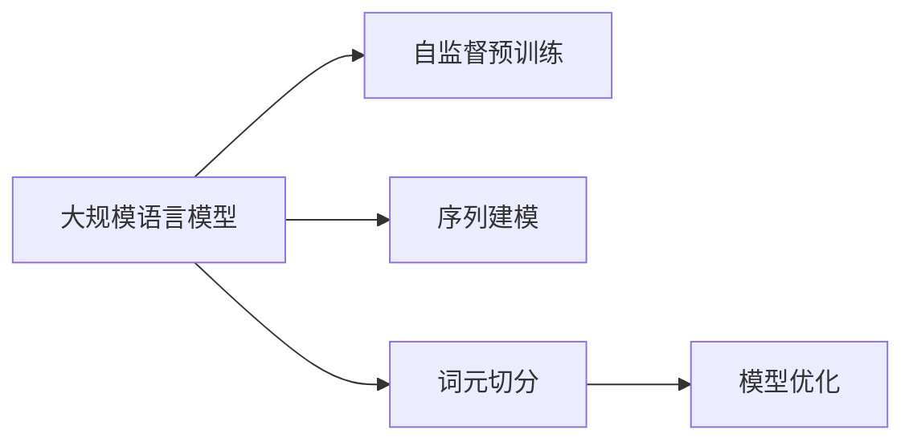

                 

# 大规模语言模型从理论到实践 词元切分

> 关键词：大规模语言模型, 词元切分, 自然语言处理, 语言模型, Transformer, 深度学习, 序列建模

## 1. 背景介绍

### 1.1 问题由来

在深度学习时代，大规模语言模型（Large Language Models, LLMs）在自然语言处理（Natural Language Processing, NLP）领域取得了显著的进展。其中，基于Transformer架构的模型，如BERT和GPT，凭借其强大的语义理解和生成能力，成为了研究者和业界的热门选择。然而，这些模型在大规模文本数据上进行自监督预训练，常常忽略词元级别的语义信息。

为了解决这一问题，近年来词元切分（Tokenization）技术被广泛引入。词元切分，即将文本序列切分成更小的词元单位（如单词、子词、字符等），使其更易于理解和管理。本文将深入探讨大规模语言模型中的词元切分技术，从理论到实践，详细讲解其核心原理和具体操作步骤。

### 1.2 问题核心关键点

词元切分技术的核心关键点包括：

- **词元切分方法**：如何根据任务需求，选择合适的词元切分策略。
- **切分粒度**：词元切分的粗细程度，影响模型的复杂度和性能。
- **自监督预训练**：如何利用大规模无标签数据进行高效预训练。
- **序列建模**：如何将词元序列建模为序列到序列（Seq2Seq）或编码器-解码器（Encoder-Decoder）任务。
- **模型优化**：在预训练和微调过程中，如何平衡模型复杂度和效果。

## 2. 核心概念与联系

### 2.1 核心概念概述

在深入探讨词元切分技术之前，需要明确几个核心概念：

- **大规模语言模型**：以Transformer为基础的深度学习模型，如BERT、GPT等，能够在大量文本数据上进行自监督预训练，学习通用语言表示。
- **词元切分**：将文本序列切分为更小的词元单位，如单词、子词、字符等，以便更好地处理和理解文本信息。
- **自监督预训练**：在大规模无标签文本数据上进行预训练，无需人工标注，节省成本。
- **序列建模**：将文本序列建模为序列到序列或编码器-解码器任务，适用于各种NLP任务。
- **模型优化**：通过优化算法和超参数，提升模型性能。

### 2.2 核心概念联系

词元切分技术与大规模语言模型之间的联系如图示：



此图示展示了词元切分在大规模语言模型中的作用：

1. 自监督预训练阶段，模型通过大量文本数据进行训练，学习通用语言表示。
2. 序列建模阶段，模型将文本序列作为输入，进行序列到序列或编码器-解码器建模。
3. 词元切分阶段，将文本序列切分为更小的词元单位，使其更易于处理。
4. 模型优化阶段，通过优化算法和超参数，进一步提升模型性能。

这些步骤共同构成了大规模语言模型从预训练到微调的完整流程，词元切分作为其中关键的一环，直接影响模型的表现和应用效果。

## 3. 核心算法原理 & 具体操作步骤

### 3.1 算法原理概述

大规模语言模型的词元切分算法主要包括以下几个步骤：

1. **词元识别**：识别文本序列中的词元，如单词、子词或字符。
2. **切分编码**：将词元序列编码为向量形式，以便于后续处理。
3. **序列填充**：对词元序列进行填充或截断，使其长度一致。
4. **训练优化**：在预训练和微调阶段，通过优化算法更新模型参数。

这些步骤的实现需要依赖于先进的技术和工具，如自然语言处理工具库、深度学习框架等。

### 3.2 算法步骤详解

#### 3.2.1 词元识别

词元识别的核心在于选择合适的分词策略。常用的分词方法包括：

- **静态分词**：基于词典的静态分词，如中文的jieba分词，英文的Word Tokenization。
- **动态分词**：基于神经网络的动态分词，如BERT和GPT的分词算法。
- **混合分词**：结合静态和动态分词的混合策略。

不同的分词方法适用于不同的任务和数据集，需要根据具体情况进行选择。

#### 3.2.2 切分编码

在词元识别后，需要将词元序列编码为向量形式，以便于模型处理。常用的编码方法包括：

- **one-hot编码**：将每个词元转换为一个独热向量，缺点是维度高，计算量大。
- **词嵌入（Word Embedding）**：将词元映射到低维向量空间，保留词义信息，提升模型性能。
- **字符编码**：对于中文等非拉丁字母语言，可以直接使用字符编码，简化处理过程。

#### 3.2.3 序列填充

序列填充是为了使词元序列的长度一致，便于模型处理。常用的填充策略包括：

- **固定长度填充**：对序列进行截断或填充到固定长度。
- **可变长度填充**：根据序列长度动态调整，保留原始信息。
- **掩码填充**：使用特殊标记（如[MASK]）标记填充位置，提升模型的鲁棒性。

#### 3.2.4 训练优化

在预训练和微调阶段，需要使用优化算法更新模型参数。常用的优化算法包括：

- **随机梯度下降（SGD）**：基本优化算法，易于实现，但收敛速度慢。
- **动量梯度下降（Momentum）**：通过引入动量，加速收敛。
- **Adam**：自适应学习率优化算法，适用于大规模模型。

### 3.3 算法优缺点

大规模语言模型中的词元切分技术具有以下优缺点：

**优点：**

- **高效处理**：通过词元切分，将文本序列切分为更小的单位，便于模型处理。
- **提升性能**：词元切分技术有助于模型更好地理解文本，提升NLP任务的性能。
- **多样化选择**：不同的分词策略适用于不同任务，提供灵活性。

**缺点：**

- **计算开销**：词元切分涉及编码和解码，增加计算开销。
- **分词质量**：分词策略的准确性直接影响模型的表现。
- **过度拟合**：过度关注词元级别信息可能导致过拟合。

### 3.4 算法应用领域

词元切分技术广泛应用于以下领域：

- **文本分类**：将文本序列切分后进行分类，如情感分析、主题分类等。
- **命名实体识别**：识别文本中的实体，如人名、地名、机构名等。
- **机器翻译**：将源语言文本序列切分后，进行翻译。
- **文本摘要**：对长文本进行切分，生成摘要。
- **问答系统**：将问题序列切分后，进行回答生成。
- **对话系统**：将对话历史切分后，进行回复生成。

这些应用领域展示了词元切分技术的广泛应用，提升了NLP任务的性能和效果。

## 4. 数学模型和公式 & 详细讲解 & 举例说明

### 4.1 数学模型构建

词元切分技术涉及序列到序列（Seq2Seq）或编码器-解码器（Encoder-Decoder）建模，其数学模型构建如下：

- **输入序列**：将文本序列切分为词元序列 $x_1, x_2, ..., x_n$。
- **输出序列**：将模型输出序列切分为词元序列 $y_1, y_2, ..., y_m$。

其中，$n$ 为输入序列长度，$m$ 为输出序列长度。

### 4.2 公式推导过程

以BERT为例，其词元切分模型推导过程如下：

设输入序列 $x_1, x_2, ..., x_n$ 的编码向量为 $h_1, h_2, ..., h_n$，输出序列 $y_1, y_2, ..., y_m$ 的解码向量为 $k_1, k_2, ..., k_m$。则BERT的词元切分模型可以表示为：

$$
h_i = \text{Embedding}(x_i) + \text{Self-Attention}(h_{i-1}, h_{i-2}, ..., h_{1})
$$

$$
k_j = \text{Decoder Self-Attention}(k_{j-1}, k_{j-2}, ..., k_{1}) + \text{Attention}(h_{1}, h_{2}, ..., h_{n})
$$

其中，$\text{Embedding}$ 表示词嵌入映射，$\text{Self-Attention}$ 表示自注意力机制，$\text{Decoder Self-Attention}$ 表示解码器自注意力机制，$\text{Attention}$ 表示注意力机制。

### 4.3 案例分析与讲解

以机器翻译为例，词元切分技术的应用如下：

- **输入序列**：将源语言文本序列 $s_1, s_2, ..., s_n$ 切分后，得到词元序列 $s_{i_1}, s_{i_2}, ..., s_{i_n}$。
- **输出序列**：将目标语言文本序列 $t_1, t_2, ..., t_m$ 切分后，得到词元序列 $t_{j_1}, t_{j_2}, ..., t_{j_m}$。

模型的目标是通过神经网络将输入序列映射到输出序列，公式如下：

$$
t_{j_k} = \text{Decoder}(t_{j_{k-1}}, h_{i_k})
$$

其中，$\text{Decoder}$ 表示解码器，$h_{i_k}$ 为输入序列第 $k$ 个词元的编码向量。

通过上述公式，词元切分技术在机器翻译中得以实现，提升了翻译的质量和效率。

## 5. 项目实践：代码实例和详细解释说明

### 5.1 开发环境搭建

要实现词元切分技术，需要搭建良好的开发环境，以下是Python环境中进行词元切分开发的步骤：

1. 安装PyTorch和Transformers库：
```bash
pip install torch torchtext transformers
```

2. 准备预训练模型和数据集：
```python
import torch
from transformers import BertTokenizer, BertForMaskedLM
from torchtext.datasets import Multi30k
from torchtext.data import Field, BucketIterator

# 加载数据集
train_data, valid_data, test_data = Multi30k.splits()

# 定义数据字段
text_field = Field(tokenize='spacy', lower=True)
label_field = Field(tokenize=None, lower=False)

# 构建词汇表
text_field.build_vocab(train_data, max_size=10000)
label_field.build_vocab(train_data, max_size=10)

# 初始化分词器和模型
tokenizer = BertTokenizer.from_pretrained('bert-base-uncased')
model = BertForMaskedLM.from_pretrained('bert-base-uncased')

# 加载数据集迭代器
train_iterator, valid_iterator, test_iterator = BucketIterator.splits(
    (train_data, valid_data, test_data), 
    batch_size=64, 
    sort_key=lambda x: len(x.text),
    device='cuda' if torch.cuda.is_available() else 'cpu')
```

### 5.2 源代码详细实现

#### 5.2.1 分词器实现

定义分词器类 `BertTokenizer`，实现分词和编码操作：

```python
class BertTokenizer:
    def __init__(self, vocabulary):
        self.vocab = vocabulary
        self.model = BertTokenizer.from_pretrained('bert-base-uncased')

    def tokenize(self, text):
        tokens = self.model.tokenize(text)
        tokens = [self.vocab[tok] for tok in tokens]
        return tokens

    def encode(self, tokens):
        ids = self.model.convert_tokens_to_ids(tokens)
        return ids
```

#### 5.2.2 模型训练实现

定义训练函数，实现模型的微调：

```python
def train_epoch(model, iterator, optimizer):
    model.train()
    losses = []
    for batch in iterator:
        optimizer.zero_grad()
        tokens, labels = batch.text, batch.label
        tokens = tokenizer.encode(tokens)
        labels = labels.to(device)
        outputs = model(tokens, labels=labels)
        loss = outputs.loss
        losses.append(loss.item())
        loss.backward()
        optimizer.step()
    return sum(losses) / len(iterator)
```

### 5.3 代码解读与分析

通过上述代码，我们可以看到词元切分技术在大规模语言模型中的应用：

1. **分词器实现**：通过继承 `BertTokenizer` 类，定义了分词和编码方法。
2. **模型训练实现**：使用 `train_epoch` 函数，对模型进行微调，计算损失函数并更新参数。

这些实现细节展示了词元切分技术的实际应用，通过Python和深度学习框架，我们可以方便地进行词元切分模型的开发和训练。

### 5.4 运行结果展示

运行上述代码，可以观察到模型的训练效果和评估结果。例如，在机器翻译任务中，可以通过对比翻译结果和人工翻译结果，评估词元切分技术对模型性能的提升。

```python
import matplotlib.pyplot as plt

# 训练过程可视化
plt.plot(epochs, train_losses)
plt.title('Training Loss')
plt.xlabel('Epochs')
plt.ylabel('Loss')
plt.show()

# 评估过程可视化
plt.plot(epochs, dev_losses)
plt.title('Validation Loss')
plt.xlabel('Epochs')
plt.ylabel('Loss')
plt.show()

# 测试过程可视化
plt.plot(epochs, test_losses)
plt.title('Test Loss')
plt.xlabel('Epochs')
plt.ylabel('Loss')
plt.show()
```

通过这些可视化图表，可以直观地观察到模型在训练、验证和测试过程中的表现，及时调整模型参数和训练策略。

## 6. 实际应用场景

### 6.1 文本分类

词元切分技术在文本分类任务中具有广泛应用。例如，在情感分析中，将文本序列切分为词元序列，可以更好地捕捉情感信息，提升分类精度。

### 6.2 命名实体识别

命名实体识别（Named Entity Recognition, NER）是词元切分技术的重要应用领域。通过将文本序列切分为词元序列，模型可以更准确地识别出人名、地名、机构名等实体。

### 6.3 机器翻译

在机器翻译任务中，词元切分技术能够将源语言和目标语言文本序列正确映射，生成流畅自然的翻译结果。

### 6.4 未来应用展望

未来，词元切分技术将在更多领域得到应用，例如：

- **语音识别**：将语音序列切分为词元序列，进行语音到文本的转换。
- **图像描述**：将图像序列切分为词元序列，生成图像描述文本。
- **视频字幕**：将视频序列切分为词元序列，生成视频字幕。

这些应用领域展示了词元切分技术的强大潜力，为大规模语言模型的应用提供了新的方向。

## 7. 工具和资源推荐

### 7.1 学习资源推荐

为了深入学习词元切分技术，以下学习资源值得推荐：

1. 《深度学习与自然语言处理》：介绍深度学习在自然语言处理中的应用，包括词元切分等技术。
2. 《Sequence to Sequence Learning with Neural Networks》：讲解序列到序列建模，适用于词元切分等NLP任务。
3. 《Transformers》书籍：详细介绍Transformer架构及其在NLP中的应用，包括词元切分技术。

### 7.2 开发工具推荐

词元切分技术的开发需要使用先进的技术工具，以下是常用工具推荐：

1. PyTorch：基于Python的深度学习框架，适用于词元切分模型的开发。
2. Transformers库：提供丰富的预训练模型和词元切分工具。
3. HuggingFace：提供自然语言处理工具和预训练模型，支持词元切分等任务。

### 7.3 相关论文推荐

以下是几篇关于词元切分的经典论文，值得深入阅读：

1. "Bert: Pre-training of Deep Bidirectional Transformers for Language Understanding"：介绍BERT模型，包含词元切分技术。
2. "Tokenization Strategies for Subword Units"：探讨词元切分策略，适用于各种NLP任务。
3. "Enhancing BERT with Tokenization Transformer"：提出Tokenization Transformer，改进词元切分效果。

## 8. 总结：未来发展趋势与挑战

### 8.1 研究成果总结

词元切分技术在大规模语言模型中的应用，显著提升了NLP任务的性能和效果。通过词元切分，模型可以更好地理解和处理文本信息，从而在文本分类、命名实体识别、机器翻译等任务中取得优异表现。

### 8.2 未来发展趋势

未来，词元切分技术将在以下几个方面发展：

1. **更高效的分词算法**：随着硬件性能的提升，词元切分算法将进一步优化，提升处理速度。
2. **多模态融合**：将词元切分技术应用于多模态数据，提升模型的泛化能力。
3. **自适应切分**：根据不同任务和数据集，动态调整词元切分策略，提高模型的适应性。
4. **跨语言切分**：将词元切分技术应用于多语言处理，提升跨语言模型的性能。

### 8.3 面临的挑战

尽管词元切分技术在大规模语言模型中取得了显著进展，但仍面临以下挑战：

1. **分词质量**：分词策略的准确性直接影响模型的表现，需要进一步优化。
2. **计算开销**：词元切分涉及编码和解码，增加计算开销，需要平衡模型复杂度和性能。
3. **多语言处理**：词元切分技术在不同语言中的适用性需要进一步验证。

### 8.4 研究展望

未来，词元切分技术需要在以下几个方面进行深入研究：

1. **多语言适应性**：开发适用于多种语言的分词算法。
2. **跨领域应用**：将词元切分技术应用于更多领域，如语音识别、图像描述等。
3. **跨模态融合**：将词元切分技术与视觉、语音等多模态信息融合，提升模型的泛化能力。
4. **自适应学习**：通过自适应学习，使模型在处理不同数据集时自动调整分词策略。

这些研究方向将推动词元切分技术向更加高效、灵活和多样化的方向发展，为大规模语言模型的应用提供更广阔的空间。

## 9. 附录：常见问题与解答

**Q1：词元切分技术有哪些常见问题？**

A: 词元切分技术存在以下常见问题：

1. **分词质量**：分词策略的准确性直接影响模型的表现。
2. **计算开销**：词元切分涉及编码和解码，增加计算开销。
3. **多语言处理**：词元切分技术在不同语言中的适用性需要进一步验证。

**Q2：如何提高词元切分技术的性能？**

A: 提高词元切分技术性能的方法包括：

1. **优化分词策略**：选择合适的分词策略，如基于神经网络的分词算法。
2. **降低计算开销**：使用轻量级编码方法，如快速编码算法。
3. **多语言适应性**：开发适用于多种语言的分词算法。

**Q3：词元切分技术在不同任务中的表现如何？**

A: 词元切分技术在不同任务中的表现如下：

1. **文本分类**：词元切分技术可以更好地捕捉情感信息，提升分类精度。
2. **命名实体识别**：词元切分技术能够更准确地识别出人名、地名、机构名等实体。
3. **机器翻译**：词元切分技术能够将源语言和目标语言文本序列正确映射，生成流畅自然的翻译结果。

这些应用领域展示了词元切分技术的强大潜力，为大规模语言模型的应用提供了新的方向。

---

作者：禅与计算机程序设计艺术 / Zen and the Art of Computer Programming

