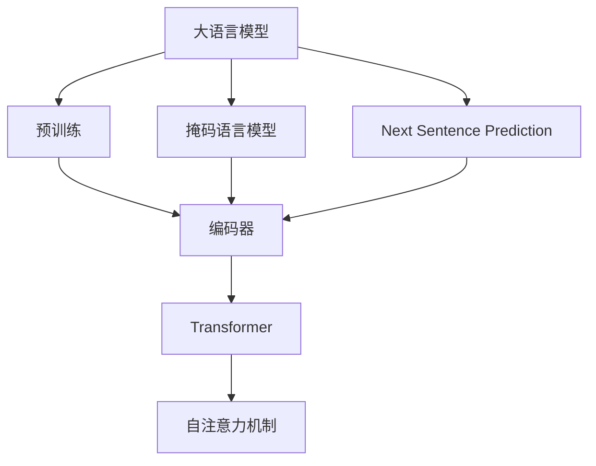

                 

# 大语言模型原理与工程实践：Encoder 的代表：BERT

> 关键词：BERT, 语言模型, 自监督学习, 掩码语言模型, 预训练, 迁移学习, Transformer, 编码器, Attention, 嵌入层

## 1. 背景介绍

### 1.1 问题由来
近年来，深度学习技术的迅猛发展在NLP领域取得了显著的突破，尤其是大语言模型（Large Language Models, LLMs）的涌现，这些模型基于大规模语料进行预训练，学习到了丰富的语言知识和常识，可以应用于各种NLP任务，如问答、文本分类、机器翻译等。BERT（Bidirectional Encoder Representations from Transformers）作为其中的佼佼者，提出了基于Transformer架构的掩码语言模型，成功地解决了语言模型的双向编码问题，显著提升了NLP任务的性能。

### 1.2 问题核心关键点
BERT的核心贡献在于：
1. **掩码语言模型（Masked Language Model, MLM）**：通过随机掩码部分单词，让模型预测被掩码的单词，从而在自监督学习中进行无监督训练。
2. **Next Sentence Prediction（NSP）**：通过判断两个句子是否为连续句，进一步加强模型对文本顺序的感知能力。
3. **Transformer架构**：采用注意力机制（Attention），可以并行处理长序列，提升了模型的训练效率和效果。
4. **双向编码**：通过双向编码机制，可以更好地理解句子中的前后文信息。

这些技术使得BERT在各种NLP任务中表现出色，并成为后续许多大模型预训练的起点。

### 1.3 问题研究意义
研究BERT的技术和原理，对于理解大语言模型的工作机制，提升NLP任务的性能，加速NLP技术的产业化进程，具有重要意义：
1. 降低应用开发成本：基于预训练模型进行微调，可以显著减少从头开发所需的数据、计算和人力成本。
2. 提升模型效果：微调可以显著提升模型在特定任务上的表现，特别是在数据量较小的场景下。
3. 加速开发进度：微调使得开发者可以更快地完成任务适配，缩短开发周期。
4. 带来技术创新：微调范式促进了对预训练-微调的深入研究，催生了少样本学习、提示学习等新的研究方向。
5. 赋能产业升级：微调使得NLP技术更容易被各行各业所采用，为传统行业数字化转型升级提供新的技术路径。

## 2. 核心概念与联系

### 2.1 核心概念概述

为了更好地理解BERT的原理和应用，本节将介绍几个密切相关的核心概念：

- **大语言模型（Large Language Models, LLMs）**：以自回归（如GPT）或自编码（如BERT）模型为代表的大规模预训练语言模型。通过在大规模无标签文本语料上进行预训练，学习通用的语言表示，具备强大的语言理解和生成能力。

- **预训练（Pre-training）**：指在大规模无标签文本语料上，通过自监督学习任务训练通用语言模型的过程。常见的预训练任务包括言语建模、掩码语言模型等。

- **掩码语言模型（Masked Language Model, MLM）**：一种自监督学习任务，通过随机掩码部分单词，让模型预测被掩码的单词，从而在无监督学习中进行训练。

- **双向编码（Bidirectional Encoding）**：通过编码器（Encoder）的前向和后向顺序处理文本，可以更好地捕捉句子中的前后文信息。

- **Transformer架构**：一种基于自注意力机制的神经网络架构，能够并行处理长序列，提升了模型的训练效率和效果。

- **编码器（Encoder）**：BERT中的核心组件，负责将输入的文本序列转换为向量表示，是实现双向编码和自注意力机制的关键。

这些核心概念之间的逻辑关系可以通过以下Mermaid流程图来展示：



这个流程图展示了大语言模型的核心概念及其之间的关系：

1. 大语言模型通过预训练获得基础能力。
2. 掩码语言模型和Next Sentence Prediction作为预训练任务，训练编码器。
3. 编码器通过Transformer架构实现双向编码和自注意力机制。
4. 自注意力机制是Transformer的核心，使得模型能够并行处理长序列。

这些概念共同构成了BERT和大语言模型的学习和应用框架，使其能够在各种场景下发挥强大的语言理解和生成能力。

## 3. 核心算法原理 & 具体操作步骤

### 3.1 算法原理概述

BERT的算法原理主要基于掩码语言模型和Next Sentence Prediction两个自监督学习任务，通过无监督学习训练编码器，从而获得通用的语言表示。

1. **掩码语言模型（MLM）**：在输入的文本中随机掩码一定比例的单词，让模型预测被掩码的单词，从而学习单词之间的依赖关系。
2. **Next Sentence Prediction（NSP）**：判断两个句子是否为连续句，训练编码器对句子顺序的感知能力。

以上两个任务一起构成BERT的预训练过程，使用Transformer架构进行训练。具体来说，BERT的编码器包含多个Transformer层，每个层包括多头自注意力机制和全连接层。

### 3.2 算法步骤详解

BERT的预训练过程包括以下关键步骤：

**Step 1: 准备语料库**
- 收集大规模无标签的文本数据，如维基百科、新闻等。

**Step 2: 数据预处理**
- 对文本数据进行分词和向量化，转换成模型可以处理的向量形式。
- 对于掩码语言模型，随机掩码部分单词，如15%的单词被随机遮住。
- 对于Next Sentence Prediction，将句子对标记为连续或非连续。

**Step 3: 构建模型**
- 使用BERT的编码器（Transformer）对文本数据进行编码，获得向量表示。

**Step 4: 训练模型**
- 将编码器输出作为MLM任务的输入，预测被掩码的单词。
- 使用NSP任务训练编码器对句子顺序的感知能力。
- 使用AdamW优化器，学习率设置为2e-5，训练epochs设置为2.5。

**Step 5: 微调模型**
- 将预训练的编码器作为初始化参数，在下游任务的标注数据上进行微调。
- 设计合适的输出层和损失函数，如分类任务的softmax层和交叉熵损失。
- 使用AdamW优化器，学习率设置为1e-5，训练epochs设置为5。

### 3.3 算法优缺点

BERT作为大语言模型的一种，其优点包括：
1. **广泛的语言表示能力**：通过自监督学习任务，BERT可以学习到丰富的语言知识和常识，适用于多种NLP任务。
2. **高效的训练过程**：Transformer架构能够并行处理长序列，提升了模型的训练效率和效果。
3. **通用性**：BERT可以作为其他大模型的预训练任务，提升后者的性能。

但同时，BERT也存在一些缺点：
1. **计算资源需求高**：大模型的参数量很大，训练和推理过程需要大量的计算资源。
2. **模型复杂度高**：BERT的Transformer层数较多，增加了模型的复杂度和训练难度。
3. **可解释性不足**：大模型难以解释其内部工作机制和决策逻辑，缺乏可解释性。

### 3.4 算法应用领域

BERT已经在NLP领域得到了广泛的应用，覆盖了几乎所有常见任务，例如：

- 文本分类：如情感分析、主题分类、意图识别等。通过微调BERT编码器，使得模型学习文本-标签映射。
- 命名实体识别：识别文本中的人名、地名、机构名等特定实体。通过微调BERT编码器，使得模型掌握实体边界和类型。
- 关系抽取：从文本中抽取实体之间的语义关系。通过微调BERT编码器，使得模型学习实体-关系三元组。
- 问答系统：对自然语言问题给出答案。将问题-答案对作为微调数据，训练模型学习匹配答案。
- 机器翻译：将源语言文本翻译成目标语言。通过微调BERT编码器，使得模型学习语言-语言映射。
- 文本摘要：将长文本压缩成简短摘要。将文章-摘要对作为微调数据，使模型学习抓取要点。
- 对话系统：使机器能够与人自然对话。将多轮对话历史作为上下文，微调BERT编码器进行回复生成。

除了上述这些经典任务外，BERT还被创新性地应用到更多场景中，如可控文本生成、常识推理、代码生成、数据增强等，为NLP技术带来了全新的突破。随着BERT模型的不断进步，相信NLP技术将在更广阔的应用领域大放异彩。

## 4. 数学模型和公式 & 详细讲解

### 4.1 数学模型构建

BERT的核心数学模型可以表示为：

$$
x = \text{Embedding}(w)
$$

其中，$x \in \mathbb{R}^{d_x}$ 为输入文本的向量表示，$d_x$ 为嵌入层的维度，$w$ 为输入文本序列。

对于掩码语言模型，输入向量为：

$$
x_m = \text{Embedding}(w_m) + \text{MaskedEmbedding}(w_{\text{mask}})
$$

其中，$w_m$ 为未被掩码的单词序列，$w_{\text{mask}}$ 为被掩码的单词序列，$\text{MaskedEmbedding}$ 表示掩码单词的嵌入层。

对于Next Sentence Prediction任务，输入向量为：

$$
x_{\text{ns}} = \text{Embedding}(w_{\text{sentence}}) + \text{Embedding}(w_{\text{next}})
$$

其中，$w_{\text{sentence}}$ 为句子，$w_{\text{next}}$ 为后续句子。

### 4.2 公式推导过程

对于掩码语言模型，训练过程如下：

1. 将输入文本序列 $w$ 转换为嵌入向量 $x$。
2. 通过多个Transformer层对嵌入向量 $x$ 进行处理，得到表示 $h$。
3. 随机掩码部分单词，将掩码后的嵌入向量 $x_m$ 输入到MLM任务中，预测被掩码的单词。
4. 计算预测错误率，并使用交叉熵损失进行反向传播。

对于Next Sentence Prediction任务，训练过程如下：

1. 将两个句子 $w_{\text{sentence}}$ 和 $w_{\text{next}}$ 转换为嵌入向量 $x_{\text{ns}}$。
2. 通过多个Transformer层对嵌入向量 $x_{\text{ns}}$ 进行处理，得到表示 $h_{\text{ns}}$。
3. 计算预测概率，并使用二元交叉熵损失进行反向传播。

### 4.3 案例分析与讲解

以BERT在文本分类任务中的应用为例，进行详细讲解：

1. **数据准备**：准备包含文本和标签的数据集，如IMDB电影评论数据集。
2. **模型初始化**：使用预训练的BERT模型作为初始化参数，例如BERT-base模型。
3. **任务适配层设计**：添加适当的输出层和损失函数，如分类任务的softmax层和交叉熵损失。
4. **模型微调**：将标注数据集分成训练集、验证集和测试集，使用AdamW优化器进行微调。
5. **评估与测试**：在测试集上评估微调后模型的分类准确率，对比微调前后的精度提升。

以下是一个简单的Python代码示例：

```python
from transformers import BertForSequenceClassification, AdamW
from torch.utils.data import DataLoader
from sklearn.metrics import accuracy_score

# 加载预训练模型和任务适配层
model = BertForSequenceClassification.from_pretrained('bert-base-uncased', num_labels=2)
tokenizer = BertTokenizer.from_pretrained('bert-base-uncased')
max_length = 128

# 数据准备
train_dataset = TextDataset(train_texts, train_labels, tokenizer, max_length)
dev_dataset = TextDataset(dev_texts, dev_labels, tokenizer, max_length)
test_dataset = TextDataset(test_texts, test_labels, tokenizer, max_length)

# 训练参数
learning_rate = 1e-5
epochs = 5
batch_size = 16

# 模型训练
optimizer = AdamW(model.parameters(), lr=learning_rate)
for epoch in range(epochs):
    model.train()
    train_loss = 0.0
    for batch in DataLoader(train_dataset, batch_size):
        input_ids = batch['input_ids'].to(device)
        attention_mask = batch['attention_mask'].to(device)
        labels = batch['labels'].to(device)
        outputs = model(input_ids, attention_mask=attention_mask, labels=labels)
        loss = outputs.loss
        train_loss += loss.item()
        optimizer.zero_grad()
        loss.backward()
        optimizer.step()

    model.eval()
    dev_loss = 0.0
    dev_acc = 0.0
    for batch in DataLoader(dev_dataset, batch_size):
        input_ids = batch['input_ids'].to(device)
        attention_mask = batch['attention_mask'].to(device)
        labels = batch['labels'].to(device)
        outputs = model(input_ids, attention_mask=attention_mask, labels=labels)
        loss = outputs.loss
        dev_loss += loss.item()
        preds = outputs.predictions.argmax(-1).to('cpu')
        labels = labels.to('cpu')
        dev_acc += accuracy_score(labels, preds)

    print(f"Epoch {epoch+1}, train loss: {train_loss/len(train_dataset)}, dev loss: {dev_loss/len(dev_dataset)}, dev acc: {dev_acc/len(dev_dataset)}")

# 测试评估
test_loss = 0.0
test_acc = 0.0
for batch in DataLoader(test_dataset, batch_size):
    input_ids = batch['input_ids'].to(device)
    attention_mask = batch['attention_mask'].to(device)
    labels = batch['labels'].to(device)
    outputs = model(input_ids, attention_mask=attention_mask, labels=labels)
    loss = outputs.loss
    test_loss += loss.item()
    preds = outputs.predictions.argmax(-1).to('cpu')
    labels = labels.to('cpu')
    test_acc += accuracy_score(labels, preds)

print(f"Test loss: {test_loss/len(test_dataset)}, test acc: {test_acc/len(test_dataset)}")
```

## 5. 项目实践：代码实例和详细解释说明

### 5.1 开发环境搭建

在进行BERT微调实践前，我们需要准备好开发环境。以下是使用Python进行PyTorch开发的环境配置流程：

1. 安装Anaconda：从官网下载并安装Anaconda，用于创建独立的Python环境。

2. 创建并激活虚拟环境：
```bash
conda create -n pytorch-env python=3.8 
conda activate pytorch-env
```

3. 安装PyTorch：根据CUDA版本，从官网获取对应的安装命令。例如：
```bash
conda install pytorch torchvision torchaudio cudatoolkit=11.1 -c pytorch -c conda-forge
```

4. 安装Transformers库：
```bash
pip install transformers
```

5. 安装各类工具包：
```bash
pip install numpy pandas scikit-learn matplotlib tqdm jupyter notebook ipython
```

完成上述步骤后，即可在`pytorch-env`环境中开始微调实践。

### 5.2 源代码详细实现

下面我以文本分类任务为例，给出使用Transformers库对BERT模型进行微调的PyTorch代码实现。

首先，定义数据处理函数：

```python
from transformers import BertTokenizer
from torch.utils.data import Dataset
import torch

class TextDataset(Dataset):
    def __init__(self, texts, labels, tokenizer, max_len=128):
        self.texts = texts
        self.labels = labels
        self.tokenizer = tokenizer
        self.max_len = max_len
        
    def __len__(self):
        return len(self.texts)
    
    def __getitem__(self, item):
        text = self.texts[item]
        label = self.labels[item]
        
        encoding = self.tokenizer(text, return_tensors='pt', max_length=self.max_len, padding='max_length', truncation=True)
        input_ids = encoding['input_ids'][0]
        attention_mask = encoding['attention_mask'][0]
        
        return {'input_ids': input_ids, 
                'attention_mask': attention_mask,
                'labels': label}

# 标签映射
label2id = {'positive': 1, 'negative': 0}
id2label = {v: k for k, v in label2id.items()}
```

然后，定义模型和优化器：

```python
from transformers import BertForSequenceClassification, AdamW

model = BertForSequenceClassification.from_pretrained('bert-base-uncased', num_labels=len(label2id))

optimizer = AdamW(model.parameters(), lr=1e-5)
```

接着，定义训练和评估函数：

```python
from torch.utils.data import DataLoader
from tqdm import tqdm
from sklearn.metrics import accuracy_score

device = torch.device('cuda') if torch.cuda.is_available() else torch.device('cpu')
model.to(device)

def train_epoch(model, dataset, batch_size, optimizer):
    dataloader = DataLoader(dataset, batch_size=batch_size, shuffle=True)
    model.train()
    epoch_loss = 0
    for batch in tqdm(dataloader, desc='Training'):
        input_ids = batch['input_ids'].to(device)
        attention_mask = batch['attention_mask'].to(device)
        labels = batch['labels'].to(device)
        model.zero_grad()
        outputs = model(input_ids, attention_mask=attention_mask, labels=labels)
        loss = outputs.loss
        epoch_loss += loss.item()
        loss.backward()
        optimizer.step()
    return epoch_loss / len(dataloader)

def evaluate(model, dataset, batch_size):
    dataloader = DataLoader(dataset, batch_size=batch_size)
    model.eval()
    preds, labels = [], []
    with torch.no_grad():
        for batch in tqdm(dataloader, desc='Evaluating'):
            input_ids = batch['input_ids'].to(device)
            attention_mask = batch['attention_mask'].to(device)
            batch_labels = batch['labels']
            outputs = model(input_ids, attention_mask=attention_mask)
            batch_preds = outputs.predictions.argmax(-1).to('cpu').tolist()
            batch_labels = batch_labels.to('cpu').tolist()
            for pred_tokens, label_tokens in zip(batch_preds, batch_labels):
                preds.append(pred_tokens)
                labels.append(label_tokens)
                
    print('Accuracy:', accuracy_score(labels, preds))
```

最后，启动训练流程并在测试集上评估：

```python
epochs = 5
batch_size = 16

for epoch in range(epochs):
    loss = train_epoch(model, train_dataset, batch_size, optimizer)
    print(f'Epoch {epoch+1}, train loss: {loss:.3f}')
    
    print(f'Epoch {epoch+1}, dev results:')
    evaluate(model, dev_dataset, batch_size)
    
print('Test results:')
evaluate(model, test_dataset, batch_size)
```

以上就是使用PyTorch对BERT进行文本分类任务微调的完整代码实现。可以看到，得益于Transformers库的强大封装，我们可以用相对简洁的代码完成BERT模型的加载和微调。

### 5.3 代码解读与分析

让我们再详细解读一下关键代码的实现细节：

**TextDataset类**：
- `__init__`方法：初始化文本、标签、分词器等关键组件。
- `__len__`方法：返回数据集的样本数量。
- `__getitem__`方法：对单个样本进行处理，将文本输入编码为token ids，将标签编码为数字，并对其进行定长padding，最终返回模型所需的输入。

**label2id和id2label字典**：
- 定义了标签与数字id之间的映射关系，用于将预测结果解码回真实的标签。

**训练和评估函数**：
- 使用PyTorch的DataLoader对数据集进行批次化加载，供模型训练和推理使用。
- 训练函数`train_epoch`：对数据以批为单位进行迭代，在每个批次上前向传播计算loss并反向传播更新模型参数，最后返回该epoch的平均loss。
- 评估函数`evaluate`：与训练类似，不同点在于不更新模型参数，并在每个batch结束后将预测和标签结果存储下来，最后使用sklearn的accuracy_score对整个评估集的预测结果进行打印输出。

**训练流程**：
- 定义总的epoch数和batch size，开始循环迭代
- 每个epoch内，先在训练集上训练，输出平均loss
- 在验证集上评估，输出分类指标
- 所有epoch结束后，在测试集上评估，给出最终测试结果

可以看到，PyTorch配合Transformers库使得BERT微调的代码实现变得简洁高效。开发者可以将更多精力放在数据处理、模型改进等高层逻辑上，而不必过多关注底层的实现细节。

当然，工业级的系统实现还需考虑更多因素，如模型的保存和部署、超参数的自动搜索、更灵活的任务适配层等。但核心的微调范式基本与此类似。

## 6. 实际应用场景

### 6.1 智能客服系统

基于BERT的对话技术，可以广泛应用于智能客服系统的构建。传统客服往往需要配备大量人力，高峰期响应缓慢，且一致性和专业性难以保证。而使用微调后的对话模型，可以7x24小时不间断服务，快速响应客户咨询，用自然流畅的语言解答各类常见问题。

在技术实现上，可以收集企业内部的历史客服对话记录，将问题和最佳答复构建成监督数据，在此基础上对预训练对话模型进行微调。微调后的对话模型能够自动理解用户意图，匹配最合适的答案模板进行回复。对于客户提出的新问题，还可以接入检索系统实时搜索相关内容，动态组织生成回答。如此构建的智能客服系统，能大幅提升客户咨询体验和问题解决效率。

### 6.2 金融舆情监测

金融机构需要实时监测市场舆论动向，以便及时应对负面信息传播，规避金融风险。传统的人工监测方式成本高、效率低，难以应对网络时代海量信息爆发的挑战。基于BERT的文本分类和情感分析技术，为金融舆情监测提供了新的解决方案。

具体而言，可以收集金融领域相关的新闻、报道、评论等文本数据，并对其进行主题标注和情感标注。在此基础上对BERT编码器进行微调，使其能够自动判断文本属于何种主题，情感倾向是正面、中性还是负面。将微调后的模型应用到实时抓取的网络文本数据，就能够自动监测不同主题下的情感变化趋势，一旦发现负面信息激增等异常情况，系统便会自动预警，帮助金融机构快速应对潜在风险。

### 6.3 个性化推荐系统

当前的推荐系统往往只依赖用户的历史行为数据进行物品推荐，无法深入理解用户的真实兴趣偏好。基于BERT的个性化推荐系统可以更好地挖掘用户行为背后的语义信息，从而提供更精准、多样的推荐内容。

在实践中，可以收集用户浏览、点击、评论、分享等行为数据，提取和用户交互的物品标题、描述、标签等文本内容。将文本内容作为模型输入，用户的后续行为（如是否点击、购买等）作为监督信号，在此基础上微调BERT编码器。微调后的模型能够从文本内容中准确把握用户的兴趣点。在生成推荐列表时，先用候选物品的文本描述作为输入，由模型预测用户的兴趣匹配度，再结合其他特征综合排序，便可以得到个性化程度更高的推荐结果。

### 6.4 未来应用展望

随着BERT模型的不断进步，基于BERT的大语言模型微调技术将在更多领域得到应用，为传统行业带来变革性影响。

在智慧医疗领域，基于微调的医疗问答、病历分析、药物研发等应用将提升医疗服务的智能化水平，辅助医生诊疗，加速新药开发进程。

在智能教育领域，微调技术可应用于作业批改、学情分析、知识推荐等方面，因材施教，促进教育公平，提高教学质量。

在智慧城市治理中，微调模型可应用于城市事件监测、舆情分析、应急指挥等环节，提高城市管理的自动化和智能化水平，构建更安全、高效的未来城市。

此外，在企业生产、社会治理、文娱传媒等众多领域，基于BERT的微调方法也将不断涌现，为经济社会发展注入新的动力。相信随着技术的日益成熟，微调方法将成为人工智能落地应用的重要范式，推动人工智能技术在垂直行业的规模化落地。

## 7. 工具和资源推荐

### 7.1 学习资源推荐

为了帮助开发者系统掌握BERT的技术基础和实践技巧，这里推荐一些优质的学习资源：

1. 《深度学习框架PyTorch教程》：系统介绍PyTorch的常用操作和实践技巧，是理解BERT微调的基础。
2. 《Transformer详解》系列博文：深入解析Transformer架构和自注意力机制，是理解BERT的关键。
3. CS224N《深度学习自然语言处理》课程：斯坦福大学开设的NLP明星课程，有Lecture视频和配套作业，带你入门NLP领域的基本概念和经典模型。
4. 《Natural Language Processing with Transformers》书籍：BERT原作者所著，全面介绍了如何使用BERT进行NLP任务开发，包括微调在内的诸多范式。
5. HuggingFace官方文档：BERT的官方文档，提供了海量预训练模型和完整的微调样例代码，是上手实践的必备资料。

通过对这些资源的学习实践，相信你一定能够快速掌握BERT的精髓，并用于解决实际的NLP问题。

### 7.2 开发工具推荐

高效的开发离不开优秀的工具支持。以下是几款用于BERT微调开发的常用工具：

1. PyTorch：基于Python的开源深度学习框架，灵活动态的计算图，适合快速迭代研究。大部分预训练语言模型都有PyTorch版本的实现。
2. TensorFlow：由Google主导开发的开源深度学习框架，生产部署方便，适合大规模工程应用。同样有丰富的预训练语言模型资源。
3. Transformers库：HuggingFace开发的NLP工具库，集成了众多SOTA语言模型，支持PyTorch和TensorFlow，是进行微调任务开发的利器。
4. Weights & Biases：模型训练的实验跟踪工具，可以记录和可视化模型训练过程中的各项指标，方便对比和调优。与主流深度学习框架无缝集成。
5. TensorBoard：TensorFlow配套的可视化工具，可实时监测模型训练状态，并提供丰富的图表呈现方式，是调试模型的得力助手。
6. Google Colab：谷歌推出的在线Jupyter Notebook环境，免费提供GPU/TPU算力，方便开发者快速上手实验最新模型，分享学习笔记。

合理利用这些工具，可以显著提升BERT微调任务的开发效率，加快创新迭代的步伐。

### 7.3 相关论文推荐

BERT作为大语言模型的一种，其背后的理论和实践经历了学界的持续研究。以下是几篇奠基性的相关论文，推荐阅读：

1. Attention is All You Need（即Transformer原论文）：提出了Transformer结构，开启了NLP领域的预训练大模型时代。
2. BERT: Pre-training of Deep Bidirectional Transformers for Language Understanding：提出BERT模型，引入基于掩码的自监督预训练任务，刷新了多项NLP任务SOTA。
3. Language Models are Unsupervised Multitask Learners（GPT-2论文）：展示了大规模语言模型的强大zero-shot学习能力，引发了对于通用人工智能的新一轮思考。
4. Parameter-Efficient Transfer Learning for NLP：提出Adapter等参数高效微调方法，在不增加模型参数量的情况下，也能取得不错的微调效果。
5. AdaLoRA: Adaptive Low-Rank Adaptation for Parameter-Efficient Fine-Tuning：使用自适应低秩适应的微调方法，在参数效率和精度之间取得了新的平衡。
6. Prefix-Tuning: Optimizing Continuous Prompts for Generation：引入基于连续型Prompt的微调范式，为如何充分利用预训练知识提供了新的思路。

这些论文代表了大语言模型微调技术的发展脉络。通过学习这些前沿成果，可以帮助研究者把握学科前进方向，激发更多的创新灵感。

## 8. 总结：未来发展趋势与挑战

### 8.1 总结

本文对BERT的技术和原理进行了全面系统的介绍。首先阐述了BERT的核心贡献：掩码语言模型和Next Sentence Prediction，以及Transformer架构的强大表现。其次，从原理到实践，详细讲解了BERT的数学模型和训练过程，给出了微调任务开发的完整代码实例。同时，本文还广泛探讨了BERT在智能客服、金融舆情、个性化推荐等多个行业领域的应用前景，展示了微调范式的巨大潜力。

通过本文的系统梳理，可以看到，BERT作为大语言模型的代表，其微调范式已经在NLP领域得到广泛应用，为NLP任务的提升提供了强有力的支持。

### 8.2 未来发展趋势

展望未来，BERT的微调技术将呈现以下几个发展趋势：

1. **模型规模持续增大**：随着算力成本的下降和数据规模的扩张，BERT的参数量还将持续增长，预训练语言模型的通用语言表示能力将进一步提升。
2. **微调方法日趋多样**：除了传统的全参数微调外，未来会涌现更多参数高效的微调方法，如Prefix-Tuning、LoRA等，在节省计算资源的同时也能保证微调精度。
3. **持续学习成为常态**：随着数据分布的不断变化，微调模型也需要持续学习新知识以保持性能。如何在不遗忘原有知识的同时，高效吸收新样本信息，将成为重要的研究课题。
4. **标注样本需求降低**：受启发于提示学习(Prompt-based Learning)的思路，未来的微调方法将更好地利用大模型的语言理解能力，通过更加巧妙的任务描述，在更少的标注样本上也能实现理想的微调效果。
5. **多模态微调崛起**：当前的微调主要聚焦于纯文本数据，未来会进一步拓展到图像、视频、语音等多模态数据微调。多模态信息的融合，将显著提升BERT模型对现实世界的理解和建模能力。
6. **模型通用性增强**：经过海量数据的预训练和多领域任务的微调，未来的BERT模型将具备更强大的常识推理和跨领域迁移能力，逐步迈向通用人工智能(AGI)的目标。

以上趋势凸显了BERT微调技术的广阔前景。这些方向的探索发展，必将进一步提升NLP系统的性能和应用范围，为人类认知智能的进化带来深远影响。

### 8.3 面临的挑战

尽管BERT的微调技术已经取得了瞩目成就，但在迈向更加智能化、普适化应用的过程中，它仍面临诸多挑战：

1. **计算资源需求高**：大模型的参数量很大，训练和推理过程需要大量的计算资源。
2. **模型复杂度高**：BERT的Transformer层数较多，增加了模型的复杂度和训练难度。
3. **可解释性不足**：大模型难以解释其内部工作机制和决策逻辑，缺乏可解释性。
4. **鲁棒性不足**：当前BERT模型面对域外数据时，泛化性能往往大打折扣，对于测试样本的微小扰动，模型的预测也容易发生波动。
5. **安全性和隐私性**：预训练语言模型难免会学习到有害信息，通过微调传递到下游任务，产生误导性、歧视性的输出，给实际应用带来安全隐患。

### 8.4 研究展望

面对BERT微调面临的挑战，未来的研究需要在以下几个方面寻求新的突破：

1. **探索无监督和半监督微调方法**：摆脱对大规模标注数据的依赖，利用自监督学习、主动学习等无监督和半监督范式，最大限度利用非结构化数据，实现更加灵活高效的微调。
2. **研究参数高效和计算高效的微调范式**：开发更加参数高效的微调方法，在固定大部分预训练参数的同时，只更新极少量的任务相关参数。同时优化微调模型的计算图，减少前向传播和反向传播的资源消耗，实现更加轻量级、实时性的部署。
3. **融合因果和对比学习范式**：通过引入因果推断和对比学习思想，增强BERT模型建立稳定因果关系的能力，学习更加普适、鲁棒的语言表征，从而提升模型泛化性和抗干扰能力。
4. **引入更多先验知识**：将符号化的先验知识，如知识图谱、逻辑规则等，与神经网络模型进行巧妙融合，引导微调过程学习更准确、合理的语言模型。同时加强不同模态数据的整合，实现视觉、语音等多模态信息与文本信息的协同建模。
5. **结合因果分析和博弈论工具**：将因果分析方法引入BERT模型，识别出模型决策的关键特征，增强输出解释的因果性和逻辑性。借助博弈论工具刻画人机交互过程，主动探索并规避模型的脆弱点，提高系统稳定性。
6. **纳入伦理道德约束**：在模型训练目标中引入伦理导向的评估指标，过滤和惩罚有偏见、有害的输出倾向。同时加强人工干预和审核，建立模型行为的监管机制，确保输出符合人类价值观和伦理道德。

这些研究方向的探索，必将引领BERT微调技术迈向更高的台阶，为构建安全、可靠、可解释、可控的智能系统铺平道路。面向未来，BERT微调技术还需要与其他人工智能技术进行更深入的融合，如知识表示、因果推理、强化学习等，多路径协同发力，共同推动自然语言理解和智能交互系统的进步。只有勇于创新、敢于突破，才能不断拓展BERT模型和微调技术的边界，让智能技术更好地造福人类社会。

## 9. 附录：常见问题与解答

**Q1：BERT的核心贡献是什么？**

A: BERT的核心贡献在于提出了掩码语言模型（MLM）和Next Sentence Prediction（NSP）两个自监督学习任务，通过无监督学习训练编码器，从而获得通用的语言表示。MLM通过随机掩码部分单词，让模型预测被掩码的单词，从而学习单词之间的依赖关系。NSP通过判断两个句子是否为连续句，训练编码器对句子顺序的感知能力。这两个任务一起构成BERT的预训练过程，使用Transformer架构进行训练。

**Q2：如何选择合适的学习率？**

A: BERT的微调学习率一般要比预训练时小1-2个数量级，以避免破坏预训练权重。一般建议从1e-5开始调参，逐步减小学习率，直至收敛。可以使用warmup策略，在开始阶段使用较小的学习率，再逐渐过渡到预设值。需要注意的是，不同的优化器(如AdamW、Adafactor等)以及不同的学习率调度策略，可能需要设置不同的学习率阈值。

**Q3：BERT的模型结构如何？**

A: BERT的模型结构主要基于Transformer架构，包含多个Transformer层。每个层包含多头自注意力机制和全连接层，可以并行处理长序列。BERT的编码器通过双向编码机制，可以更好地理解句子中的前后文信息。Transformer层的参数量较大，增加了模型的复杂度和训练难度。

**Q4：BERT的预训练任务有哪些？**

A: BERT的预训练任务包括掩码语言模型（MLM）和Next Sentence Prediction（NSP）。MLM通过随机掩码部分单词，让模型预测被掩码的单词，从而学习单词之间的依赖关系。NSP通过判断两个句子是否为连续句，训练编码器对句子顺序的感知能力。这些预训练任务使得BERT能够学习到通用的语言表示，适用于多种NLP任务。

**Q5：BERT在微调过程中需要注意哪些问题？**

A: 在微调过程中，需要注意以下几点：
1. 数据增强：通过回译、近义替换等方式扩充训练集，缓解过拟合。
2. 正则化：使用L2正则、Dropout、Early Stopping等避免过拟合。
3. 对抗训练：引入对抗样本，提高模型鲁棒性。
4. 参数高效微调：只调整少量参数(如Adapter、Prefix等)，减小过拟合风险。
5. 多模型集成：训练多个微调模型，取平均输出，抑制过拟合。
6. 模型裁剪：去除不必要的层和参数，减小模型尺寸，加快推理速度。
7. 量化加速：将浮点模型转为定点模型，压缩存储空间，提高计算效率。

这些策略往往需要根据具体任务和数据特点进行灵活组合。只有在数据、模型、训练、推理等各环节进行全面优化，才能最大限度地发挥BERT微调的威力。

