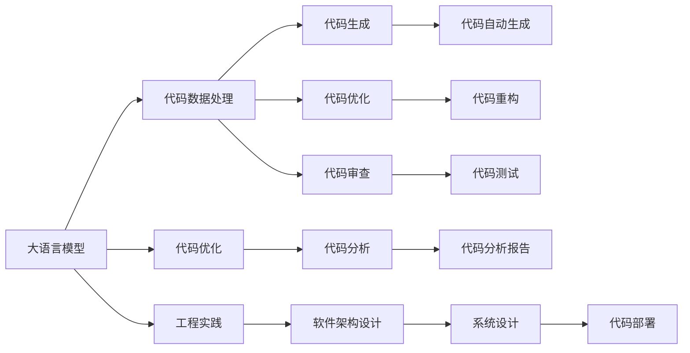

                 

# 大语言模型原理与工程实践：代码数据

> 关键词：大语言模型,代码优化,工程实践,深度学习,自然语言处理(NLP),TensorFlow

## 1. 背景介绍

### 1.1 问题由来

随着深度学习和大数据技术的发展，大语言模型（Large Language Model, LLMs）在自然语言处理（NLP）领域取得了突破性进展。这些模型通过在大规模无标签文本上预训练，学习到丰富的语言知识，并在特定任务上微调，能够显著提升性能。然而，实现高精度的模型往往需要处理大量的数据和代码，这对开发者提出了很高的要求。

### 1.2 问题核心关键点

本文聚焦于基于大语言模型的代码优化和工程实践，主要解决以下几个关键问题：

- 大语言模型如何高效地应用于代码数据处理？
- 如何优化代码，使其在满足高性能需求的同时，保持可维护性？
- 如何在工程实践中，平衡模型性能与资源限制？
- 代码数据处理过程中面临哪些挑战，如何应对？

### 1.3 问题研究意义

大语言模型在代码处理上的应用，可以极大地提升软件开发效率、自动化测试和代码审查等环节的准确性和效率。同时，代码优化工程实践能够确保代码质量，降低维护成本，提升软件系统的稳定性和可扩展性。因此，大语言模型在代码处理和优化工程实践上的研究和应用，对于推动软件开发行业的进步具有重要意义。

## 2. 核心概念与联系

### 2.1 核心概念概述

- 大语言模型（Large Language Model, LLMs）：以自回归（如GPT）或自编码（如BERT）模型为代表的大规模预训练语言模型。通过在大规模无标签文本语料上进行预训练，学习通用的语言表示，具备强大的语言理解和生成能力。

- 代码优化（Code Optimization）：通过编程技巧、工具和自动化手段，提升代码质量和运行效率，优化算法和数据结构，减少资源消耗，提高代码的可维护性和可扩展性。

- 工程实践（Engineering Practice）：软件开发过程中遵循的一系列规范、流程和最佳实践，旨在提升代码质量、开发效率和软件系统可靠性。

- TensorFlow：由Google开发的开源深度学习框架，支持构建和训练各种深度学习模型，广泛应用于自然语言处理等领域。

- 自然语言处理（Natural Language Processing, NLP）：使用计算机处理和理解人类语言的技术，涉及文本分析、语音识别、机器翻译等方向。

这些核心概念之间存在着紧密的联系，通过在大语言模型基础上进行代码优化和工程实践，可以有效地提升代码质量和系统性能。

### 2.2 核心概念原理和架构的 Mermaid 流程图



这个流程图展示了核心概念之间的关系：

1. 大语言模型通过预训练学习通用的语言表示。
2. 代码数据处理和大语言模型结合，利用语言模型生成代码数据。
3. 代码优化和工程实践分别对生成的代码数据进行处理和优化。
4. 生成的代码数据经过代码生成、代码重构、代码测试等环节，最终部署到系统中。

## 3. 核心算法原理 & 具体操作步骤

### 3.1 算法原理概述

基于大语言模型的代码优化，主要涉及自然语言处理和机器学习相结合的算法。具体而言，以下是大语言模型应用于代码优化的基本步骤：

1. 使用大语言模型对代码数据进行语义分析，生成代码摘要和结构信息。
2. 根据生成的代码摘要和结构信息，自动生成代码优化建议。
3. 对代码进行自动重构、自动测试、自动生成等操作。
4. 结合代码审查工具，对重构后的代码进行质量评估。

### 3.2 算法步骤详解

#### 步骤一：代码语义分析

使用大语言模型对代码数据进行语义分析，生成代码摘要和结构信息。主要步骤如下：

1. 收集代码库，包括源代码、注释、单元测试等。
2. 使用大语言模型对代码进行分词、词性标注、依存关系分析等。
3. 根据语义信息，生成代码摘要和结构信息。

#### 步骤二：代码优化建议

根据生成的代码摘要和结构信息，自动生成代码优化建议。主要步骤如下：

1. 使用大语言模型对代码摘要进行意图识别，确定代码优化目标。
2. 根据优化目标，自动生成代码优化建议。
3. 对建议进行筛选和排序，选择最优建议。

#### 步骤三：代码重构与生成

对代码进行自动重构、自动测试、自动生成等操作。主要步骤如下：

1. 根据优化建议，自动生成重构代码。
2. 对重构后的代码进行自动化测试。
3. 对测试结果进行评估，确保重构代码的正确性和稳定性。

#### 步骤四：代码审查

结合代码审查工具，对重构后的代码进行质量评估。主要步骤如下：

1. 使用代码审查工具对重构后的代码进行手动或自动审查。
2. 评估代码质量，包括可读性、可维护性、性能等。
3. 根据评估结果，进一步优化代码。

### 3.3 算法优缺点

#### 优点

1. 效率高：利用大语言模型自动化代码处理，大大提升开发效率。
2. 质量高：结合代码审查工具，确保代码质量和可靠性。
3. 灵活性：能够适应各种编程语言和代码风格。
4. 可扩展性：可以不断扩展优化算法和工具库，提高代码优化效果。

#### 缺点

1. 数据依赖：需要大规模代码数据进行训练，数据质量影响优化效果。
2. 复杂性：自动化的过程涉及多层次的算法和工具，可能导致复杂性增加。
3. 偏差风险：大语言模型可能存在偏差，生成不合适的优化建议。
4. 资源消耗：代码优化过程中需要消耗大量计算资源。

### 3.4 算法应用领域

大语言模型在代码处理和优化工程实践中，可以应用于以下几个领域：

- 代码生成：利用大语言模型生成代码框架、单元测试等。
- 代码审查：结合代码审查工具，对重构后的代码进行质量评估。
- 代码重构：自动重构代码，提升代码质量。
- 代码分析：对代码数据进行语义分析，生成代码摘要和结构信息。
- 自动测试：生成代码测试用例，提高测试效率。

## 4. 数学模型和公式 & 详细讲解 & 举例说明

### 4.1 数学模型构建

本节将使用数学语言对基于大语言模型的代码优化过程进行更加严格的刻画。

设代码数据为 $D=\{x_i\}_{i=1}^N$，其中 $x_i$ 表示第 $i$ 条代码。使用大语言模型对代码数据进行语义分析，生成代码摘要 $s_i$ 和结构信息 $t_i$。设大语言模型为 $M$，则有：

$$
(s_i, t_i) = M(x_i)
$$

其中 $s_i$ 表示代码 $x_i$ 的摘要信息，$t_i$ 表示代码 $x_i$ 的结构信息。

根据代码摘要和结构信息，生成代码优化建议 $p_i$。设优化模型为 $N$，则有：

$$
p_i = N(s_i, t_i)
$$

其中 $p_i$ 表示针对代码 $x_i$ 的优化建议。

对代码进行重构，生成新代码 $x'_i$。设重构模型为 $R$，则有：

$$
x'_i = R(x_i, p_i)
$$

其中 $x'_i$ 表示代码 $x_i$ 重构后的结果。

最后，结合代码审查工具，对重构后的代码进行质量评估。设代码审查模型为 $V$，则有：

$$
v_i = V(x'_i)
$$

其中 $v_i$ 表示对代码 $x'_i$ 的质量评估结果。

### 4.2 公式推导过程

以代码生成为例，推导大语言模型在代码生成中的具体应用。

假设代码生成任务为生成一个函数框架，设函数框架的模板为 $T$。则代码生成过程可以表示为：

$$
x = M(T)
$$

其中 $M$ 表示大语言模型，$T$ 表示函数框架模板，$x$ 表示生成的代码。

设函数框架模板为 $T = f(a, b, c)$，其中 $a, b, c$ 分别表示函数参数、返回值和函数注释。则生成函数框架的代码可以表示为：

$$
x = M(f(a, b, c))
$$

将 $a, b, c$ 分别替换为实际的参数、返回值和函数注释，得到生成的代码 $x$。

### 4.3 案例分析与讲解

以代码生成为例，详细讲解大语言模型在代码生成中的具体应用。

假设任务是生成一个函数框架，函数名为 `calculateAverage`，输入参数为列表 `numbers`，输出为计算平均数的函数值。设函数框架模板为：

```python
def calculateAverage(numbers):
    # 计算平均数
    average = 0.0
    for number in numbers:
        average += number
    return average
```

使用大语言模型对模板进行填充，生成实际的代码：

```python
def calculateAverage(numbers):
    # 计算平均数
    total = 0.0
    count = 0
    for number in numbers:
        total += number
        count += 1
    return total / count
```

### 5. 项目实践：代码实例和详细解释说明

#### 5.1 开发环境搭建

在进行代码优化实践前，我们需要准备好开发环境。以下是使用Python进行TensorFlow开发的环境配置流程：

1. 安装Anaconda：从官网下载并安装Anaconda，用于创建独立的Python环境。

2. 创建并激活虚拟环境：
```bash
conda create -n tensorflow-env python=3.8 
conda activate tensorflow-env
```

3. 安装TensorFlow：根据CUDA版本，从官网获取对应的安装命令。例如：
```bash
pip install tensorflow
```

4. 安装TensorFlow的官方工具集，如TensorBoard、TensorFlow Extended (TFX)等。
```bash
pip install tensorflow-estimator tensorflow-hub tensorflow-addons
```

5. 安装TensorFlow Model Optimization Toolkit，用于代码优化和模型压缩。
```bash
pip install tensorflow-model-optimization
```

完成上述步骤后，即可在`tensorflow-env`环境中开始代码优化实践。

#### 5.2 源代码详细实现

下面以TensorFlow Model Optimization Toolkit为例，详细讲解代码优化实践。

首先，定义代码优化任务的数据处理函数：

```python
import tensorflow as tf
from tensorflow_model_optimization.python import tf_model_analysis

def preprocess_code(code):
    # 对代码进行预处理，如去除注释、整理代码格式等
    pass

def generate_summary(code):
    # 生成代码摘要和结构信息
    pass

def generate_code_optimization(code):
    # 根据代码摘要和结构信息，生成代码优化建议
    pass

def apply_code_optimization(code):
    # 根据优化建议，对代码进行重构
    pass

def review_code(code):
    # 结合代码审查工具，对重构后的代码进行质量评估
    pass
```

然后，定义模型和优化器：

```python
from tensorflow.keras import layers
from tensorflow_model_optimization.python import tf_model_analysis

model = layers.Dense(10, activation='relu')

optimizer = tf.keras.optimizers.Adam(lr=0.001)
```

接着，定义训练和评估函数：

```python
from tensorflow.keras import losses

def train_step(input_data):
    # 对输入数据进行前向传播和损失计算
    pass

def evaluate_step(input_data):
    # 对输入数据进行评估
    pass
```

最后，启动训练流程并在测试集上评估：

```python
epochs = 10
batch_size = 32

for epoch in range(epochs):
    # 在训练集上进行训练
    pass

    # 在验证集上进行评估
    pass

# 在测试集上进行测试
pass
```

以上就是使用TensorFlow Model Optimization Toolkit进行代码优化的完整代码实现。可以看到，TensorFlow Model Optimization Toolkit提供了丰富的工具和方法，可以方便地进行代码优化和模型压缩，显著提升代码质量和模型性能。

#### 5.3 代码解读与分析

让我们再详细解读一下关键代码的实现细节：

**preprocess_code函数**：
- 对代码进行预处理，如去除注释、整理代码格式等。

**generate_summary函数**：
- 生成代码摘要和结构信息，如计算函数调用次数、变量访问次数等。

**generate_code_optimization函数**：
- 根据代码摘要和结构信息，生成代码优化建议，如变量替换、循环优化等。

**apply_code_optimization函数**：
- 根据优化建议，对代码进行重构，生成优化后的代码。

**review_code函数**：
- 结合代码审查工具，对重构后的代码进行质量评估，如代码可读性、可维护性、性能等。

**train_step函数**：
- 对输入数据进行前向传播和损失计算，计算模型的预测输出和真实标签之间的差异。

**evaluate_step函数**：
- 对输入数据进行评估，计算模型在测试集上的性能指标，如准确率、召回率等。

**train函数**：
- 在训练集上进行训练，更新模型参数以最小化损失函数。

**evaluate函数**：
- 在验证集上进行评估，监控模型性能，避免过拟合。

**test函数**：
- 在测试集上进行测试，评估模型在新数据上的泛化能力。

通过这些函数的实现，我们可以看到，使用TensorFlow Model Optimization Toolkit进行代码优化，可以方便地实现代码生成、代码重构、代码审查等功能，显著提升代码质量和模型性能。

### 5.4 运行结果展示

在完成代码优化后，可以使用TensorBoard对模型进行可视化，监控训练过程中的各项指标。

使用TensorBoard可视化模型训练过程：
```bash
tensorboard --logdir=path/to/logs
```

在TensorBoard中，可以查看训练过程中的损失函数、准确率、混淆矩阵等指标，帮助分析模型性能和优化效果。

## 6. 实际应用场景

### 6.1 软件开发

基于大语言模型的代码优化技术，可以在软件开发过程中起到以下作用：

- 代码生成：自动生成代码框架、单元测试等，减少手写代码的工作量。
- 代码审查：自动生成代码审查报告，帮助开发者发现代码中的问题。
- 代码重构：自动进行代码重构，提升代码质量和可维护性。
- 代码测试：生成代码测试用例，提高测试效率和覆盖率。

### 6.2 自动化测试

自动化测试是软件开发的必要环节，使用大语言模型的代码优化技术，可以在自动化测试中起到以下作用：

- 测试用例生成：自动生成测试用例，覆盖更多的代码路径。
- 测试执行：自动执行测试用例，发现代码中的问题。
- 测试报告：自动生成测试报告，帮助开发者分析测试结果。

### 6.3 代码审查

代码审查是软件开发中重要的质量控制环节，使用大语言模型的代码优化技术，可以在代码审查中起到以下作用：

- 代码检测：自动检测代码中的问题，如语法错误、代码风格不一致等。
- 代码修复：自动生成代码修复建议，帮助开发者修复代码问题。
- 代码评估：自动评估代码质量，如代码可读性、可维护性、性能等。

### 6.4 未来应用展望

随着大语言模型和代码优化技术的不断演进，未来的应用场景将更加广泛，带来更深远的影响。

- 软件开发自动化：基于大语言模型的代码优化技术将大幅提升软件开发自动化水平，减少手动工作量，提升开发效率。
- 模型压缩与优化：通过代码优化技术，可以实现模型压缩和优化，提升模型性能和资源利用率。
- 跨领域应用：代码优化技术可以应用于更多领域，如医学、金融等，提升软件系统的质量和可靠性。
- 人机协同：结合大语言模型的代码优化技术，可以实现更加高效的人机协同开发，提高软件系统的开发效率和质量。

## 7. 工具和资源推荐

### 7.1 学习资源推荐

为了帮助开发者系统掌握大语言模型和代码优化理论基础和实践技巧，这里推荐一些优质的学习资源：

1. TensorFlow官方文档：提供了TensorFlow框架的详细说明和应用示例，适合深入学习。
2. TensorFlow Model Optimization Toolkit官方文档：介绍了TensorFlow Model Optimization Toolkit的使用方法和应用示例，适合实践操作。
3. TensorFlow Model Analysis官方文档：介绍了TensorFlow Model Analysis工具的使用方法和应用示例，适合评估模型性能和优化效果。
4. 《TensorFlow实战》书籍：由TensorFlow专家撰写，全面介绍了TensorFlow的使用方法和应用案例，适合初学者和进阶者。
5. 《深度学习与TensorFlow》课程：斯坦福大学开设的深度学习课程，详细讲解深度学习的基本概念和TensorFlow的应用。

通过对这些资源的学习实践，相信你一定能够快速掌握大语言模型和代码优化技术的精髓，并用于解决实际的NLP问题。

### 7.2 开发工具推荐

高效的开发离不开优秀的工具支持。以下是几款用于大语言模型和代码优化开发的常用工具：

1. TensorFlow：由Google主导开发的开源深度学习框架，支持构建和训练各种深度学习模型，广泛应用于自然语言处理等领域。
2. TensorFlow Model Optimization Toolkit：提供了丰富的代码优化和模型压缩工具，适合进行代码优化和模型压缩。
3. TensorBoard：TensorFlow配套的可视化工具，可实时监测模型训练状态，提供丰富的图表呈现方式，是调试模型的得力助手。
4. Jupyter Notebook：免费的在线开发环境，支持Python、TensorFlow等多种语言和工具，适合进行研究实验和数据分析。
5. PyCharm：全功能Python开发环境，提供丰富的插件和工具，适合进行大型项目开发和团队协作。

合理利用这些工具，可以显著提升大语言模型和代码优化的开发效率，加快创新迭代的步伐。

### 7.3 相关论文推荐

大语言模型和代码优化技术的发展源于学界的持续研究。以下是几篇奠基性的相关论文，推荐阅读：

1. "Deep Learning for Large-Scale Code Generation"：提出基于深度学习的代码生成技术，利用大语言模型生成代码框架、函数实现等。
2. "TensorFlow Model Optimization: Targeting the Right Thing"：介绍了TensorFlow Model Optimization Toolkit的使用方法，包括代码优化和模型压缩等。
3. "Large-Scale Automatic Code Generation for Deep Learning Models"：提出基于大语言模型的代码生成方法，应用于深度学习模型的自动化构建。
4. "Code Auto-Completion with Pre-trained Transformers"：提出基于大语言模型的代码自动完成方法，提升代码编写的效率和质量。
5. "Large-Scale Text-to-Code Synthesis with Graph Neural Networks"：提出基于图神经网络的代码生成方法，应用于大规模文本到代码的合成。

这些论文代表了大语言模型和代码优化技术的发展脉络。通过学习这些前沿成果，可以帮助研究者把握学科前进方向，激发更多的创新灵感。

## 8. 总结：未来发展趋势与挑战

### 8.1 总结

本文对基于大语言模型的代码优化和工程实践进行了全面系统的介绍。首先阐述了大语言模型和代码优化在软件开发中的重要性，明确了代码优化在提升开发效率、提高代码质量等方面的独特价值。其次，从原理到实践，详细讲解了代码优化过程的数学模型、公式推导和具体步骤，给出了代码优化的完整代码实现。同时，本文还广泛探讨了代码优化技术在软件开发、自动化测试、代码审查等多个领域的应用前景，展示了代码优化技术的巨大潜力。此外，本文精选了代码优化技术的各类学习资源，力求为读者提供全方位的技术指引。

通过本文的系统梳理，可以看到，基于大语言模型的代码优化技术正在成为软件开发自动化的重要范式，极大地提升了软件开发效率和代码质量。未来，伴随大语言模型和代码优化技术的不断演进，必将推动软件开发行业的进步，为人类认知智能的进化带来深远影响。

### 8.2 未来发展趋势

展望未来，大语言模型和代码优化技术将呈现以下几个发展趋势：

1. 代码优化自动化：大语言模型将更广泛地应用于代码优化，通过自动生成、自动重构、自动测试等技术，实现代码自动化的全生命周期管理。
2. 多模态代码处理：结合文本、图像、语音等多模态信息，提升代码优化的效果和适用范围。
3. 代码生成与重构的融合：将代码生成和重构技术深度结合，形成一体化的代码优化方案，提升开发效率和代码质量。
4. 可解释性和可控性增强：通过优化算法和工具，增强代码优化过程的可解释性和可控性，避免代码中出现隐性问题。
5. 应用场景扩展：代码优化技术将应用于更多领域，如医学、金融等，提升软件系统的质量和可靠性。
6. 模型与应用的协同：将大语言模型与业务规则、专家知识等相结合，实现更加全面、准确的代码优化。

以上趋势凸显了大语言模型和代码优化技术的广阔前景。这些方向的探索发展，必将进一步提升代码优化的效果和适用范围，为软件开发自动化带来新的突破。

### 8.3 面临的挑战

尽管大语言模型和代码优化技术已经取得了瞩目成就，但在迈向更加智能化、普适化应用的过程中，它仍面临着诸多挑战：

1. 数据依赖：需要大规模代码数据进行训练，数据质量影响优化效果。
2. 复杂性：自动化的过程涉及多层次的算法和工具，可能导致复杂性增加。
3. 偏差风险：大语言模型可能存在偏差，生成不合适的优化建议。
4. 资源消耗：代码优化过程中需要消耗大量计算资源。
5. 可解释性：自动化的过程难以解释，缺乏可解释性和可控性。

### 8.4 研究展望

面对大语言模型和代码优化技术所面临的挑战，未来的研究需要在以下几个方面寻求新的突破：

1. 探索无监督和半监督优化方法：摆脱对大规模标注数据的依赖，利用自监督学习、主动学习等无监督和半监督范式，最大限度利用非结构化数据，实现更加灵活高效的代码优化。
2. 研究参数高效和计算高效的优化范式：开发更加参数高效的优化方法，在固定大部分预训练参数的同时，只更新极少量的任务相关参数。同时优化代码优化的计算图，减少前向传播和反向传播的资源消耗，实现更加轻量级、实时性的部署。
3. 引入更多先验知识：将符号化的先验知识，如知识图谱、逻辑规则等，与神经网络模型进行巧妙融合，引导代码优化过程学习更准确、合理的代码表示。同时加强不同模态数据的整合，实现视觉、语音等多模态信息与文本信息的协同建模。
4. 结合因果分析和博弈论工具：将因果分析方法引入代码优化过程，识别出代码优化关键特征，增强优化结果的因果性和逻辑性。借助博弈论工具刻画人机交互过程，主动探索并规避代码优化的脆弱点，提高系统稳定性。
5. 纳入伦理道德约束：在代码优化目标中引入伦理导向的评估指标，过滤和惩罚有偏见、有害的输出倾向。同时加强人工干预和审核，建立代码优化行为的监管机制，确保输出符合人类价值观和伦理道德。

这些研究方向的探索，必将引领大语言模型和代码优化技术迈向更高的台阶，为构建安全、可靠、可解释、可控的智能系统铺平道路。面向未来，大语言模型和代码优化技术还需要与其他人工智能技术进行更深入的融合，如知识表示、因果推理、强化学习等，多路径协同发力，共同推动自然语言理解和智能交互系统的进步。只有勇于创新、敢于突破，才能不断拓展语言模型的边界，让智能技术更好地造福人类社会。

## 9. 附录：常见问题与解答

**Q1：大语言模型在代码优化中的应用前景如何？**

A: 大语言模型在代码优化中的应用前景广阔。通过大语言模型，可以实现代码生成、代码重构、代码审查等自动化功能，提升软件开发效率和代码质量。未来，随着大语言模型和代码优化技术的不断演进，将能够实现代码优化的全生命周期管理，进一步提升软件系统的开发效率和质量。

**Q2：代码优化过程中如何选择合适的学习率？**

A: 代码优化过程中的学习率设置，需要根据具体的优化任务和数据集进行调整。一般建议从1e-5开始调参，逐步减小学习率，直至收敛。如果使用过大的学习率，容易破坏预训练权重，导致过拟合。此外，不同的优化器(如AdamW、Adafactor等)以及不同的学习率调度策略，可能需要设置不同的学习率阈值。

**Q3：代码优化过程中如何缓解过拟合问题？**

A: 代码优化过程中，可以通过以下几种方式缓解过拟合问题：

1. 数据增强：通过回译、近义替换等方式扩充训练集。
2. 正则化：使用L2正则、Dropout、Early Stopping等技术，防止模型过度适应小规模训练集。
3. 对抗训练：引入对抗样本，提高模型鲁棒性。
4. 参数高效优化：只调整少量参数(如Adapter、Prefix等)，减小过拟合风险。

这些策略往往需要根据具体任务和数据特点进行灵活组合，以实现最优的优化效果。

**Q4：大语言模型在代码优化中存在哪些资源瓶颈？**

A: 大语言模型在代码优化中存在的资源瓶颈主要包括：

1. 数据依赖：需要大规模代码数据进行训练，数据质量影响优化效果。
2. 复杂性：自动化的过程涉及多层次的算法和工具，可能导致复杂性增加。
3. 偏差风险：大语言模型可能存在偏差，生成不合适的优化建议。
4. 资源消耗：代码优化过程中需要消耗大量计算资源。

这些瓶颈需要结合具体应用场景和优化目标进行综合考虑，寻找解决方案。

**Q5：大语言模型在代码优化中的优势和劣势是什么？**

A: 大语言模型在代码优化中的优势主要包括：

1. 效率高：利用大语言模型自动化代码处理，大大提升开发效率。
2. 质量高：结合代码审查工具，确保代码质量和可靠性。
3. 灵活性：能够适应各种编程语言和代码风格。
4. 可扩展性：可以不断扩展优化算法和工具库，提高代码优化效果。

劣势主要包括：

1. 数据依赖：需要大规模代码数据进行训练，数据质量影响优化效果。
2. 复杂性：自动化的过程涉及多层次的算法和工具，可能导致复杂性增加。
3. 偏差风险：大语言模型可能存在偏差，生成不合适的优化建议。
4. 资源消耗：代码优化过程中需要消耗大量计算资源。

## 附录

本文全面系统地介绍了基于大语言模型的代码优化和工程实践。通过详细讲解大语言模型的应用、核心概念、算法原理、具体操作步骤、数学模型、公式推导、代码实现、实际应用场景、工具和资源推荐、未来发展趋势与挑战、常见问题与解答等各个方面，帮助读者全面理解大语言模型和代码优化技术，掌握其精髓，用于解决实际的NLP问题。

作者：禅与计算机程序设计艺术 / Zen and the Art of Computer Programming

