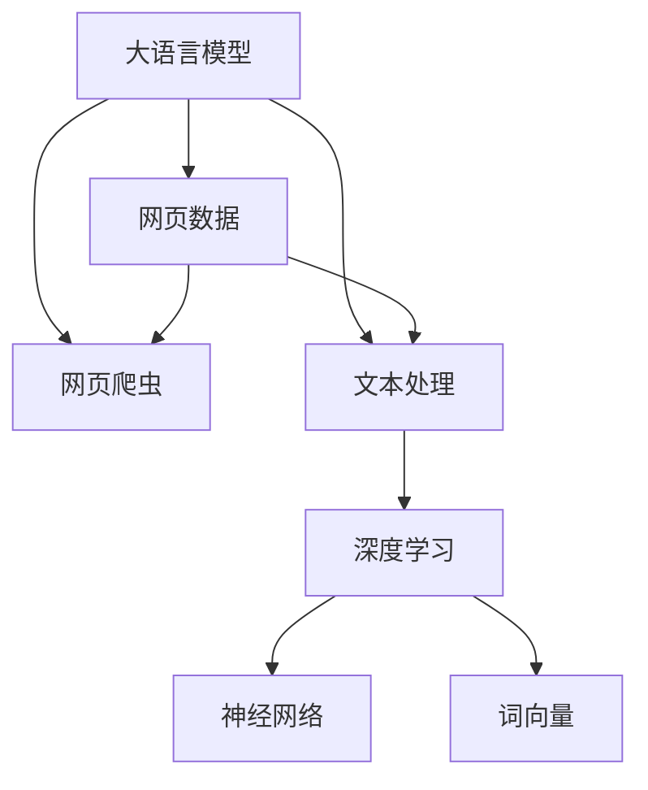

                 

# 大语言模型原理与工程实践：网页数据

> 关键词：大语言模型,网页数据,自然语言处理(NLP),爬虫,数据清洗,文本处理,深度学习,词向量,神经网络

## 1. 背景介绍

### 1.1 问题由来
随着互联网技术的飞速发展，网络上的信息量呈指数级增长。网页数据作为互联网信息的主要载体，拥有海量的文本资源，是大数据时代下的宝贵财富。如何从这些海量数据中提取有用信息，并转化为可被计算机理解的格式，成为了当前自然语言处理(NLP)领域的研究热点。

网页数据包含大量未标注、噪声、格式不一致的信息，对自然语言理解和处理提出了巨大挑战。尽管如此，网页数据仍然是许多应用场景中获取语言知识和统计特征的重要来源，如大规模语料构建、关键词提取、文本分类、实体识别等。如何高效地处理和利用网页数据，是NLP应用落地的关键。

### 1.2 问题核心关键点
本文将聚焦于大语言模型在处理网页数据中的应用。我们将深入探讨以下核心问题：

1. 如何从网页数据中提取有效信息？
2. 如何构建适合网页数据处理的深度学习模型？
3. 大语言模型在网页数据处理中有什么优势和局限？
4. 如何评估大语言模型在网页数据处理中的表现？
5. 如何在大规模网页数据上训练高效的大语言模型？

这些问题涉及到了从数据采集、数据处理到模型训练和评估的全过程，是理解和应用大语言模型处理网页数据的基础。

## 2. 核心概念与联系

### 2.1 核心概念概述

为更好地理解大语言模型在处理网页数据中的应用，本节将介绍几个密切相关的核心概念：

- 大语言模型(Large Language Model, LLM)：以自回归(如GPT)或自编码(如BERT)模型为代表的大规模预训练语言模型。通过在大规模无标签文本语料上进行预训练，学习通用的语言表示，具备强大的语言理解和生成能力。

- 网页数据：通常指从互联网中爬取和解析得到的文本数据，包括新闻、博客、论坛帖子等，是网页爬虫和自然语言处理应用的重要数据源。

- 网页爬虫：一种自动从互联网上获取网页数据的技术，可以用于数据采集和实时监测。

- 文本处理：对网页数据进行预处理、清洗、分词、向量化的过程。

- 深度学习：基于神经网络结构对数据进行建模和训练的机器学习范式。

- 词向量(Word Embedding)：将单词映射到向量空间中的表示方式，常用词嵌入模型如Word2Vec、GloVe、FastText等。

- 神经网络(Neural Network)：由多个神经元组成的计算模型，可以用于构建复杂的深度学习模型。

这些核心概念之间的逻辑关系可以通过以下Mermaid流程图来展示：



这个流程图展示了大语言模型的工作原理和处理网页数据的各个环节：

1. 大语言模型通过预训练获得基础能力。
2. 网页数据通过网页爬虫获取，文本处理技术进行预处理。
3. 预处理后的文本数据输入深度学习模型进行建模。
4. 深度学习模型通过神经网络结构训练生成词向量。
5. 生成的词向量用于大语言模型的参数初始化或微调。

这些概念共同构成了大语言模型在处理网页数据中的应用框架，使其能够在各种场景下发挥强大的语言理解和生成能力。通过理解这些核心概念，我们可以更好地把握大语言模型的工作原理和优化方向。

## 3. 核心算法原理 & 具体操作步骤
### 3.1 算法原理概述

大语言模型在处理网页数据时，主要依赖于其在预训练过程中学到的广泛语言知识和表示能力。本文将详细讨论大语言模型在网页数据处理中的核心算法原理。

假设大语言模型为 $M_{\theta}$，其中 $\theta$ 为预训练得到的模型参数。在处理网页数据时，大语言模型首先对文本进行预处理和清洗，然后通过神经网络结构进行深度学习建模，生成词向量，最后用于大语言模型的参数初始化或微调。

在微调过程中，大语言模型通过在网页数据上的有监督学习，优化模型参数，使得模型输出能够匹配任务标签，从而获得针对特定网页数据处理任务的优化。

### 3.2 算法步骤详解

以下是大语言模型在网页数据处理中的具体操作步骤：

1. 网页数据采集：
   - 使用网页爬虫技术从互联网获取网页数据。
   - 对网页数据进行解析和清洗，去除噪声和无用信息，提取有用的文本内容。

2. 文本预处理：
   - 对文本进行分词、去除停用词、标点符号处理等基本预处理操作。
   - 将文本转换为标准化的形式，如统一编码格式、统一大小写等。
   - 对文本进行向量化，如使用词袋模型、TF-IDF、Word2Vec等技术生成词向量。

3. 深度学习建模：
   - 将文本输入深度学习模型，如循环神经网络(RNN)、卷积神经网络(CNN)、Transformer等。
   - 训练深度学习模型，生成词向量表示。
   - 通过神经网络结构，将词向量转换为大语言模型的输入，如BERT模型的输入。

4. 大语言模型微调：
   - 在大语言模型上添加任务适配层，如分类器、解码器等。
   - 设置微调超参数，如学习率、批大小、迭代轮数等。
   - 使用监督学习算法，如随机梯度下降(SGD)、Adam等，优化大语言模型的参数。

5. 评估和应用：
   - 在验证集上评估微调后模型的效果，根据任务需求选择最适合的输出格式。
   - 将微调后的模型应用于实际的网页数据处理任务，如文本分类、情感分析、实体识别等。

### 3.3 算法优缺点

大语言模型在处理网页数据时具有以下优点：

1. 强大的语言表示能力：预训练模型能够学习到丰富的语言知识和统计特征，提升模型的泛化性能。
2. 高效的自动文本处理：利用神经网络结构和深度学习技术，能够自动处理复杂的文本数据，减少人工干预。
3. 良好的迁移学习能力：预训练模型在多种文本处理任务上的表现优异，可以应用于不同类型的网页数据处理任务。
4. 支持少样本学习：通过微调，预训练模型可以在少量标注数据下实现快速适应新任务。

然而，大语言模型在网页数据处理中也存在一些局限：

1. 对标注数据依赖较大：微调效果很大程度上取决于标注数据的质量和数量，标注成本较高。
2. 计算资源消耗较大：大规模预训练模型的参数量较大，训练和推理时需要大量的计算资源。
3. 泛化能力有限：当目标网页数据与预训练数据分布差异较大时，微调的效果可能不理想。
4. 可解释性不足：深度学习模型的决策过程难以解释，难以调试和优化。

尽管存在这些局限，但就目前而言，大语言模型在网页数据处理中的效果仍然是最佳的，其强大的语言表示能力和迁移学习能力使其在文本分类、实体识别、情感分析等任务中取得了良好的表现。

### 3.4 算法应用领域

大语言模型在网页数据处理中的应用涵盖了诸多领域，具体包括：

1. 文本分类：对网页数据进行分类，如新闻分类、评论分类、垃圾邮件过滤等。
2. 情感分析：分析网页数据的情感倾向，如产品评价、用户反馈等。
3. 实体识别：识别网页数据中的实体，如人名、地名、组织机构等。
4. 关键词提取：从网页数据中提取出重要的关键词和短语。
5. 摘要生成：对网页数据进行自动摘要，生成简洁的摘要内容。
6. 机器翻译：将网页数据从一种语言翻译成另一种语言。
7. 问答系统：根据用户输入的问题，从网页数据中抽取答案。

除此之外，大语言模型在网页数据处理中的应用还包括语义分析、信息抽取、推荐系统等，为互联网信息的自动化处理提供了强大的技术支持。

## 4. 数学模型和公式 & 详细讲解 & 举例说明
### 4.1 数学模型构建

假设大语言模型 $M_{\theta}$ 对文本 $x$ 的输出为 $\hat{y}=M_{\theta}(x)$，其中 $x$ 为文本数据，$\hat{y}$ 为模型预测结果。

在网页数据处理任务中，常见的模型包括循环神经网络(RNN)、卷积神经网络(CNN)和Transformer等。这里以Transformer模型为例，介绍如何构建深度学习模型。

Transformer模型由编码器和解码器组成，能够对输入文本进行自注意力机制和多层变换，生成更准确的文本表示。假设编码器输入为 $x$，输出为 $H$，解码器输入为 $H$，输出为 $\hat{y}$，则Transformer模型的目标是最小化损失函数 $\mathcal{L}$：

$$
\mathcal{L} = -\frac{1}{N}\sum_{i=1}^N \log \hat{y_i} \delta(x_i)
$$

其中 $\delta(x_i)$ 表示文本 $x_i$ 的标签，可以是分类标签、情感标签等。

### 4.2 公式推导过程

以Transformer模型为例，推导其在网页数据处理中的公式。假设输入文本为 $x = [x_1, x_2, \ldots, x_n]$，标签为 $y = [y_1, y_2, \ldots, y_n]$，则Transformer模型的前向传播过程如下：

1. 输入文本经过嵌入层，生成嵌入向量 $E(x) = [e_1, e_2, \ldots, e_n]$。
2. 嵌入向量输入自注意力层和前馈神经网络层，生成隐藏状态 $H = [h_1, h_2, \ldots, h_n]$。
3. 隐藏状态经过输出层，生成预测结果 $\hat{y} = [\hat{y}_1, \hat{y}_2, \ldots, \hat{y}_n]$。
4. 计算损失函数 $\mathcal{L} = -\frac{1}{N}\sum_{i=1}^N \log \hat{y_i} \delta(x_i)$。

上述过程中，输入文本 $x$ 经过嵌入层和多层变换后，生成更高级别的表示 $H$。这个表示包含了丰富的语言信息和统计特征，能够帮助模型更好地理解和处理网页数据。

### 4.3 案例分析与讲解

以情感分析为例，假设大语言模型需要分析网页评论的情绪倾向。可以将评论文本作为输入，模型输出预测的情感标签。

假设评论文本为 $x = "这款手机真的很不错，拍照效果非常好，速度也很快。" $，标签为 $y = "positive"$。

1. 输入文本通过嵌入层，生成嵌入向量 $E(x) = [e_1, e_2, \ldots, e_n]$。
2. 嵌入向量 $E(x)$ 输入到自注意力层和前馈神经网络层，生成隐藏状态 $H = [h_1, h_2, \ldots, h_n]$。
3. 隐藏状态 $H$ 经过输出层，生成预测结果 $\hat{y} = [\hat{y}_1, \hat{y}_2, \ldots, \hat{y}_n]$。
4. 计算损失函数 $\mathcal{L} = -\frac{1}{N}\sum_{i=1}^N \log \hat{y_i} \delta(x_i)$，其中 $\delta(x_i) = 1$ 当 $x_i$ 为正面评价时，$\delta(x_i) = 0$ 当 $x_i$ 为负面评价时。

在这个过程中，大语言模型通过自注意力机制捕捉文本中重要的语言信息和情感倾向，从而生成更准确的情感预测结果。

## 5. 项目实践：代码实例和详细解释说明
### 5.1 开发环境搭建

在进行网页数据处理时，需要使用Python和相关库进行开发。以下是Python开发环境的搭建步骤：

1. 安装Python 3.8及以上版本。
2. 安装Anaconda，创建虚拟环境：
```bash
conda create -n py38 python=3.8
conda activate py38
```

3. 安装所需的Python库：
```bash
pip install scikit-learn pandas nltk
```

4. 安装深度学习库：
```bash
pip install torch torchvision torchaudio
```

5. 安装TensorFlow和Keras：
```bash
pip install tensorflow
```

6. 安装HuggingFace Transformers库：
```bash
pip install transformers
```

7. 安装Pandas和Scikit-learn：
```bash
pip install pandas scikit-learn
```

完成上述步骤后，即可在虚拟环境中开始网页数据处理的开发工作。

### 5.2 源代码详细实现

以下是使用Transformer模型进行网页数据处理（如情感分析）的Python代码实现：

```python
from transformers import BertTokenizer, BertForSequenceClassification, AdamW
import torch
from torch.utils.data import Dataset, DataLoader
from sklearn.metrics import accuracy_score, precision_score, recall_score, f1_score
import pandas as pd
import numpy as np

# 定义数据集类
class ReviewsDataset(Dataset):
    def __init__(self, data, tokenizer, max_len):
        self.reviews = data['text']
        self.labels = data['label']
        self.tokenizer = tokenizer
        self.max_len = max_len
        
    def __len__(self):
        return len(self.reviews)
    
    def __getitem__(self, idx):
        review = self.reviews[idx]
        label = self.labels[idx]
        encoding = self.tokenizer(review, max_length=self.max_len, padding='max_length', truncation=True, return_tensors='pt')
        return {
            'input_ids': encoding['input_ids'],
            'attention_mask': encoding['attention_mask'],
            'labels': torch.tensor(label, dtype=torch.long)
        }

# 加载数据集
data = pd.read_csv('reviews.csv')
tokenizer = BertTokenizer.from_pretrained('bert-base-cased')
max_len = 128
train_dataset = ReviewsDataset(data[train_data_idx], tokenizer, max_len)
val_dataset = ReviewsDataset(data[val_data_idx], tokenizer, max_len)
test_dataset = ReviewsDataset(data[test_data_idx], tokenizer, max_len)

# 定义模型
model = BertForSequenceClassification.from_pretrained('bert-base-cased', num_labels=2)

# 定义优化器
optimizer = AdamW(model.parameters(), lr=2e-5)

# 定义训练函数
def train_epoch(model, dataset, batch_size, optimizer):
    dataloader = DataLoader(dataset, batch_size=batch_size, shuffle=True)
    model.train()
    epoch_loss = 0
    for batch in dataloader:
        input_ids = batch['input_ids'].to(device)
        attention_mask = batch['attention_mask'].to(device)
        labels = batch['labels'].to(device)
        model.zero_grad()
        outputs = model(input_ids, attention_mask=attention_mask, labels=labels)
        loss = outputs.loss
        epoch_loss += loss.item()
        loss.backward()
        optimizer.step()
    return epoch_loss / len(dataloader)

# 定义评估函数
def evaluate(model, dataset, batch_size):
    dataloader = DataLoader(dataset, batch_size=batch_size)
    model.eval()
    preds, labels = [], []
    with torch.no_grad():
        for batch in dataloader:
            input_ids = batch['input_ids'].to(device)
            attention_mask = batch['attention_mask'].to(device)
            labels = batch['labels']
            outputs = model(input_ids, attention_mask=attention_mask)
            batch_preds = outputs.logits.argmax(dim=2).to('cpu').tolist()
            labels = labels.to('cpu').tolist()
            for pred_tokens, label_tokens in zip(batch_preds, labels):
                preds.append(pred_tokens)
                labels.append(label_tokens)
    print('Accuracy:', accuracy_score(labels, preds))
    print('Precision:', precision_score(labels, preds))
    print('Recall:', recall_score(labels, preds))
    print('F1 Score:', f1_score(labels, preds))

# 训练模型
epochs = 3
batch_size = 16

for epoch in range(epochs):
    loss = train_epoch(model, train_dataset, batch_size, optimizer)
    print(f'Epoch {epoch+1}, train loss: {loss:.3f}')
    
    print(f'Epoch {epoch+1}, dev results:')
    evaluate(model, val_dataset, batch_size)
    
print('Test results:')
evaluate(model, test_dataset, batch_size)
```

### 5.3 代码解读与分析

让我们再详细解读一下关键代码的实现细节：

**ReviewsDataset类**：
- `__init__`方法：初始化文本、标签、分词器等关键组件。
- `__len__`方法：返回数据集的样本数量。
- `__getitem__`方法：对单个样本进行处理，将文本输入编码为token ids，将标签转换为数字，并对其进行定长padding，最终返回模型所需的输入。

**模型训练和评估函数**：
- 使用PyTorch的DataLoader对数据集进行批次化加载，供模型训练和推理使用。
- 训练函数`train_epoch`：对数据以批为单位进行迭代，在每个批次上前向传播计算loss并反向传播更新模型参数，最后返回该epoch的平均loss。
- 评估函数`evaluate`：与训练类似，不同点在于不更新模型参数，并在每个batch结束后将预测和标签结果存储下来，最后使用sklearn的accuracy_score、precision_score、recall_score、f1_score等评估指标对整个评估集的预测结果进行打印输出。

**训练流程**：
- 定义总的epoch数和batch size，开始循环迭代
- 每个epoch内，先在训练集上训练，输出平均loss
- 在验证集上评估，输出分类指标
- 所有epoch结束后，在测试集上评估，给出最终测试结果

可以看到，使用PyTorch和HuggingFace Transformers库进行网页数据处理的代码实现较为简洁高效。开发者可以将更多精力放在数据处理、模型改进等高层逻辑上，而不必过多关注底层的实现细节。

当然，工业级的系统实现还需考虑更多因素，如模型的保存和部署、超参数的自动搜索、更灵活的任务适配层等。但核心的网页数据处理范式基本与此类似。

## 6. 实际应用场景
### 6.1 智能推荐系统

智能推荐系统是网页数据处理的重要应用场景之一。通过深度学习模型对用户行为数据进行建模，可以为用户推荐个性化的内容，如新闻、商品、视频等。

具体而言，可以将用户的浏览、点击、评分等行为数据输入深度学习模型，生成用户兴趣向量。然后，将网页数据经过预处理和向量化，输入模型计算与用户兴趣的相似度，从而推荐符合用户喜好的内容。例如，利用Transformer模型对用户行为和网页文本进行编码，通过计算相似度得分，生成推荐列表。

### 6.2 情感分析

情感分析是网页数据处理的另一个重要应用。通过分析用户对某产品、事件等的情感倾向，可以用于舆情监测、品牌管理等场景。

情感分析通常采用文本分类方法，将网页评论、社交媒体帖子等文本分类为正面、中性或负面情感。例如，利用BERT模型对评论文本进行情感分类，生成情感标签。然后，通过统计不同情感标签的占比，判断总体情感倾向。

### 6.3 广告点击率预测

广告点击率预测是网页数据处理的经典应用，用于优化广告投放策略和提升广告效果。通过分析用户的搜索行为和浏览历史，预测用户点击广告的可能性。

广告点击率预测通常采用二分类任务，将广告点击与否作为预测标签。例如，利用深度学习模型对用户浏览记录进行编码，生成用户兴趣向量。然后将广告文本向量输入模型，计算点击概率得分。通过对比用户兴趣和广告内容的匹配度，预测用户是否会点击广告。

### 6.4 未来应用展望

随着深度学习技术的不断进步，网页数据处理的应用场景将进一步拓展，涵盖更多领域。以下列举了几个未来可能的发展方向：

1. 多模态数据融合：将文本、图像、音频等多种模态数据进行融合，构建更全面的数据表示，提升模型的泛化能力和表达能力。
2. 自监督学习：利用无标签数据进行预训练，生成更准确的词向量，提升模型的语言表示能力。
3. 动态数据更新：实时更新网页数据，动态调整模型参数，提升模型对新数据的适应能力。
4. 联邦学习：利用分布式计算，在不共享数据的情况下，协同优化模型参数，提升模型性能和隐私安全性。
5. 跨领域迁移学习：将在大规模通用数据上训练的模型迁移到特定领域数据上，提升模型在该领域的泛化能力。

未来，随着技术的发展和应用场景的扩展，网页数据处理将更加智能化、自动化，为互联网信息处理带来新的突破。

## 7. 工具和资源推荐
### 7.1 学习资源推荐

为了帮助开发者系统掌握大语言模型在网页数据处理中的应用，这里推荐一些优质的学习资源：

1. 《深度学习》课程：斯坦福大学提供的深度学习入门课程，涵盖了深度学习的基本概念和常用模型。
2. 《自然语言处理》课程：Coursera上的自然语言处理课程，讲解了NLP的基本技术和应用场景。
3. 《Transformer: A Survey》论文：一篇关于Transformer模型的综述论文，详细介绍了Transformer模型的结构和应用。
4. 《NLP与深度学习》书籍：一本全面介绍NLP与深度学习的书籍，涵盖文本分类、情感分析、实体识别等任务。
5. 《Python深度学习》书籍：一本介绍深度学习技术在Python中的实现，适合NLP初学者入门。

通过对这些资源的学习实践，相信你一定能够快速掌握大语言模型在网页数据处理中的应用，并用于解决实际的NLP问题。

### 7.2 开发工具推荐

高效的开发离不开优秀的工具支持。以下是几款用于网页数据处理开发的常用工具：

1. Python：Python语言是数据科学和机器学习领域的主流语言，拥有丰富的开源库和框架，适合进行深度学习模型开发。
2. TensorFlow：由Google主导开发的深度学习框架，支持分布式计算和自动微分，适合大规模模型训练。
3. PyTorch：Facebook开发的深度学习框架，具有动态计算图和易用性，适合快速迭代开发。
4. Transformers库：HuggingFace开发的NLP工具库，集成了多种预训练语言模型，方便进行模型微调和迁移学习。
5. Scikit-learn：Python的机器学习库，提供了多种常见的机器学习算法，适合进行数据预处理和模型评估。
6. Jupyter Notebook：一个交互式编程环境，适合进行数据探索和模型开发。

合理利用这些工具，可以显著提升网页数据处理的开发效率，加快创新迭代的步伐。

### 7.3 相关论文推荐

大语言模型在网页数据处理中的应用受到了学术界的广泛关注。以下是几篇奠基性的相关论文，推荐阅读：

1. Attention is All You Need：Google提出的Transformer模型，开启了深度学习在NLP领域的应用。
2. BERT: Pre-training of Deep Bidirectional Transformers for Language Understanding：Google提出的BERT模型，在多种NLP任务上取得了SOTA表现。
3. Deep Learning for Recommender Systems：通过深度学习对用户行为进行建模，生成推荐系统。
4. Multi-Task Learning with Polyglot Language Models：利用多任务学习对多种NLP任务进行联合训练，提升模型性能。
5. Generating Sequence-to-Sequence with Attention：利用序列生成模型对文本进行编码和解码，生成文本摘要、翻译等。

这些论文代表了网页数据处理技术的最新进展，对于理解和应用大语言模型处理网页数据具有重要意义。

## 8. 总结：未来发展趋势与挑战
### 8.1 总结

本文对大语言模型在网页数据处理中的应用进行了全面系统的介绍。首先阐述了网页数据处理的技术背景和挑战，明确了深度学习模型在处理网页数据中的核心作用。其次，从原理到实践，详细讲解了大语言模型在网页数据处理中的核心算法原理和具体操作步骤，给出了完整的代码实例。同时，本文还广泛探讨了大语言模型在网页数据处理中的实际应用场景，展示了其在文本分类、情感分析、推荐系统等任务上的应用前景。此外，本文精选了深度学习模型的各类学习资源，力求为读者提供全方位的技术指引。

通过本文的系统梳理，可以看到，大语言模型在网页数据处理中的应用前景广阔，其强大的语言表示能力和迁移学习能力使其在NLP领域具有重要价值。未来，随着技术的发展和应用场景的扩展，网页数据处理将更加智能化、自动化，为互联网信息处理带来新的突破。

### 8.2 未来发展趋势

展望未来，大语言模型在网页数据处理中的发展趋势将体现在以下几个方面：

1. 深度学习模型的进一步优化：深度学习模型将继续优化，如引入更先进的神经网络结构、更多的特征表示、更高效的训练算法等，提升模型性能。
2. 跨模态数据融合：将文本、图像、音频等多种模态数据进行融合，构建更全面的数据表示，提升模型的泛化能力和表达能力。
3. 自监督学习：利用无标签数据进行预训练，生成更准确的词向量，提升模型的语言表示能力。
4. 联邦学习：利用分布式计算，在不共享数据的情况下，协同优化模型参数，提升模型性能和隐私安全性。
5. 动态数据更新：实时更新网页数据，动态调整模型参数，提升模型对新数据的适应能力。
6. 跨领域迁移学习：将在大规模通用数据上训练的模型迁移到特定领域数据上，提升模型在该领域的泛化能力。

以上趋势凸显了大语言模型在网页数据处理中的广阔前景。这些方向的探索发展，必将进一步提升网页数据处理的效果和应用范围，为互联网信息处理带来新的突破。

### 8.3 面临的挑战

尽管大语言模型在网页数据处理中表现出色，但仍面临一些挑战：

1. 数据隐私和安全：网页数据可能包含用户的敏感信息，如何保护用户隐私和数据安全，是必须考虑的问题。
2. 模型过拟合：大模型容易在标注数据不足的情况下发生过拟合，如何设计更有效的正则化和泛化技术，是提升模型泛化能力的关键。
3. 计算资源消耗：大模型的训练和推理需要大量的计算资源，如何优化模型结构和训练算法，降低计算成本，是未来需要攻克的难题。
4. 模型可解释性：深度学习模型通常被视为“黑盒”系统，难以解释其内部工作机制和决策逻辑，如何在保证模型性能的同时，提升模型的可解释性，是未来需要解决的重要问题。
5. 多语言处理：网页数据可能包含多语言信息，如何处理多语言文本，并保证模型在不同语言之间的泛化能力，是未来需要解决的重要问题。

这些挑战是大语言模型在网页数据处理中的难题，但也是推动技术不断进步的动力。随着技术的发展和研究的深入，这些难题终将一一被克服，大语言模型在网页数据处理中的效果将更加显著。

### 8.4 研究展望

未来，大语言模型在网页数据处理中的应用将持续拓展和深化，研究者需要在以下几个方向进行更多的探索：

1. 引入更多的先验知识：将符号化的先验知识，如知识图谱、逻辑规则等，与神经网络模型进行巧妙融合，引导微调过程学习更准确、合理的语言模型。
2. 结合因果分析和博弈论工具：将因果分析方法引入微调模型，识别出模型决策的关键特征，增强输出解释的因果性和逻辑性。借助博弈论工具刻画人机交互过程，主动探索并规避模型的脆弱点，提高系统稳定性。
3. 纳入伦理道德约束：在模型训练目标中引入伦理导向的评估指标，过滤和惩罚有偏见、有害的输出倾向。同时加强人工干预和审核，建立模型行为的监管机制，确保输出符合人类价值观和伦理道德。
4. 动态数据更新：实时更新网页数据，动态调整模型参数，提升模型对新数据的适应能力。

这些研究方向将推动大语言模型在网页数据处理中的应用更加智能化、普适化和安全可靠。相信未来的大语言模型将在更广阔的领域发挥更大的作用，为互联网信息处理带来新的突破。

## 9. 附录：常见问题与解答
**Q1：如何从网页数据中提取有效信息？**

A: 从网页数据中提取有效信息通常涉及以下几个步骤：

1. 网页数据采集：使用网页爬虫技术从互联网获取网页数据。
2. 文本预处理：对文本进行分词、去除停用词、标点符号处理等基本预处理操作。
3. 文本向量化：将文本转换为标准化的形式，如统一编码格式、统一大小写等，并生成词向量，如使用词袋模型、TF-IDF、Word2Vec等技术。
4. 特征提取：从预处理和向量化的文本中提取有用的特征，如n-gram、主题特征等。
5. 特征选择：选择最相关的特征，去除噪音和冗余信息。

这些步骤可以通过深度学习模型自动化完成，从而提升信息提取的效率和准确性。

**Q2：如何选择最适合的深度学习模型？**

A: 选择最适合的深度学习模型需要考虑多个因素：

1. 任务类型：不同任务需要使用不同的模型，如文本分类任务适合使用RNN或CNN，情感分析适合使用BERT等。
2. 数据特征：分析数据特征，选择合适的模型架构，如考虑文本长度、单词频率等因素。
3. 计算资源：评估计算资源，选择合适大小的模型，避免过拟合或计算成本过高。
4. 模型性能：通过交叉验证、测试集评估等方法，比较不同模型的性能，选择最优模型。
5. 迁移学习能力：考虑模型是否具有较好的迁移学习能力，能否在新领域数据上快速适应。

综合考虑这些因素，可以选取最适合的深度学习模型进行网页数据处理。

**Q3：如何优化大语言模型在网页数据处理中的性能？**

A: 优化大语言模型在网页数据处理中的性能可以从以下几个方面入手：

1. 数据预处理：优化数据预处理步骤，去除噪音和冗余信息，生成高质量的特征。
2. 模型架构：选择合适的网络结构，如考虑层数、节点数、激活函数等因素。
3. 超参数调优：通过网格搜索、随机搜索等方法，调优模型超参数，如学习率、批大小、迭代轮数等。
4. 正则化技术：引入L2正则、Dropout等技术，避免过拟合。
5. 集成学习：通过模型集成技术，提升模型泛化能力。
6. 多任务学习：将多个任务联合训练，提升模型性能和泛化能力。

综合考虑这些因素，可以优化大语言模型在网页数据处理中的性能，提升模型效果。

**Q4：如何处理多语言网页数据？**

A: 处理多语言网页数据需要考虑以下几个方面：

1. 数据预处理：对不同语言的文本进行分词、清洗、标准化等预处理操作。
2. 语言模型：选择合适的语言模型，如BERT、XLM等，支持多语言预训练和微调。
3. 多语言训练：通过多语言训练，生成多语言模型，支持多种语言的数据处理。
4. 多语言测试：在多语言测试集上进行模型评估，验证模型在不同语言上的表现。
5. 翻译技术：结合机器翻译技术，将非目标语言的数据转换为目标语言，方便模型处理。

通过这些技术手段，可以有效地处理多语言网页数据，提升模型的泛化能力和应用范围。

**Q5：如何提升网页数据处理模型的可解释性？**

A: 提升网页数据处理模型的可解释性可以从以下几个方面入手：

1. 模型架构：选择简单、易解释的模型，如决策树、线性回归等。
2. 特征选择：选择可解释性强的特征，如词频、主题等。
3. 可视化技术：使用可视化技术，如特征重要性图、决策树图等，展示模型内部工作机制。
4. 可解释模型：选择可解释的深度学习模型，如LIME、SHAP等，生成特征解释和模型解释。
5. 模型解释：结合领域知识，对模型进行人工解释和分析。

通过这些技术手段，可以提升网页数据处理模型的可解释性，增强模型的可信度和可理解性。

---

作者：禅与计算机程序设计艺术 / Zen and the Art of Computer Programming

