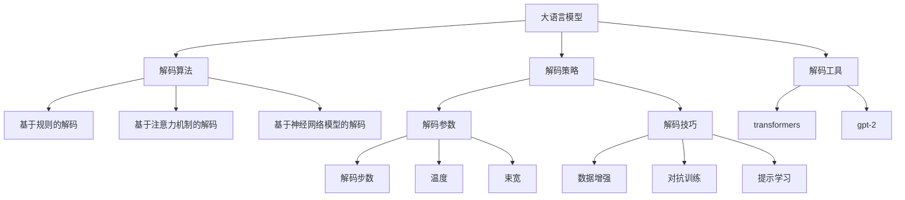

                 

# 大语言模型原理基础与前沿 解码策略

> 关键词：大语言模型, 解码策略, 解码算法, 语言模型, 自然语言处理(NLP), Transformer, 自回归模型, 自编码模型, 预训练, 微调

## 1. 背景介绍

### 1.1 问题由来
近年来，深度学习技术在自然语言处理（NLP）领域取得了显著进展。尤其是大规模预训练语言模型的出现，如BERT、GPT等，显著提升了NLP任务的性能。这些大模型通过在大量无标签文本数据上进行预训练，学习到了丰富的语言知识和常识，可以通过少量的有标签样本进行微调，获得优异的性能。

然而，对于特定领域或任务，直接使用通用预训练模型往往难以获得最佳效果。为了更好地适应特定任务，研究者开始探索针对大语言模型的解码策略，即如何在已有预训练模型的基础上，通过特定的解码算法，更高效地提取任务相关的语言特征，从而提升模型的性能。

### 1.2 问题核心关键点
大语言模型解码策略的核心在于如何利用预训练模型学习到的语言知识，快速适应特定任务。主要包括：

- **解码算法**：选择合适的解码算法，如基于规则的解码、基于注意力机制的解码、基于神经网络模型的解码等。
- **解码参数**：根据任务特点，调整解码算法中的关键参数，如解码步数、温度、束宽等。
- **解码技巧**：结合特定任务的需求，优化解码过程，如利用数据增强、对抗训练、提示学习等技巧。
- **解码工具**：使用高效的工具库，如HuggingFace的`transformers`、OpenAI的`gpt-2`等，进行解码任务的实现。

## 2. 核心概念与联系

### 2.1 核心概念概述

为更好地理解大语言模型的解码策略，本节将介绍几个密切相关的核心概念：

- **大语言模型(Large Language Model, LLM)**：以自回归(如GPT)或自编码(如BERT)模型为代表的大规模预训练语言模型。通过在大规模无标签文本语料上进行预训练，学习通用的语言表示，具备强大的语言理解和生成能力。

- **解码策略**：指在大规模预训练语言模型的基础上，通过特定的解码算法，提取任务相关的语言特征，从而提升模型在特定任务上的性能。

- **解码算法**：指在预训练模型的基础上，通过特定的算法框架，生成任务相关的输出。常见的解码算法包括基于规则的解码、基于注意力机制的解码、基于神经网络模型的解码等。

- **解码参数**：指解码算法中需要调整的关键参数，如解码步数、温度、束宽等。

- **解码技巧**：指结合特定任务的需求，对解码过程进行优化的方法，如利用数据增强、对抗训练、提示学习等。

- **解码工具**：指用于实现解码任务的高效工具库，如HuggingFace的`transformers`、OpenAI的`gpt-2`等。

这些核心概念之间的逻辑关系可以通过以下Mermaid流程图来展示：



这个流程图展示了大语言模型的核心概念及其之间的关系：

1. 大语言模型通过预训练获得基础能力。
2. 解码策略在大语言模型的基础上，通过特定的解码算法，生成任务相关的输出。
3. 解码算法包括基于规则的解码、基于注意力机制的解码、基于神经网络模型的解码等。
4. 解码参数包括解码步数、温度、束宽等，这些参数需要根据任务特点进行调整。
5. 解码技巧包括数据增强、对抗训练、提示学习等，用于优化解码过程。
6. 解码工具提供高效实现解码任务的方法，如`transformers`、`gpt-2`等。

## 3. 核心算法原理 & 具体操作步骤

### 3.1 算法原理概述

大语言模型的解码策略主要基于两种类型的模型：自回归模型和自编码模型。自回归模型通过逐步预测下一个词的概率分布，生成文本序列。自编码模型则通过编码器-解码器框架，将文本序列映射到低维向量空间，然后解码回文本序列。

解码策略的核心在于如何利用预训练模型学习到的语言知识，快速适应特定任务。主要包括以下几个步骤：

1. **输入预处理**：将输入文本转换为模型所需的格式，如分词、向量化等。
2. **特征提取**：使用预训练模型对输入文本进行编码，提取语言特征。
3. **解码过程**：根据解码算法，生成任务相关的输出。
4. **后处理**：对生成的输出进行后处理，如去噪、筛选等。

### 3.2 算法步骤详解

以自回归模型为例，介绍解码策略的详细步骤：

1. **输入预处理**：将输入文本进行分词，转换为模型所需的格式。
2. **特征提取**：使用预训练模型对输入文本进行编码，提取语言特征。
3. **解码过程**：使用基于自回归的解码算法，逐步预测下一个词的概率分布。
4. **后处理**：对生成的输出进行后处理，如去噪、筛选等。

具体步骤如下：

- **输入预处理**：
  - 分词：将输入文本进行分词，得到单词序列。
  - 向量化：将单词序列转换为模型所需的向量表示。

- **特征提取**：
  - 使用预训练模型对向量表示进行编码，得到语言特征。
  - 将语言特征输入解码器，生成文本序列。

- **解码过程**：
  - 使用基于自回归的解码算法，逐步预测下一个词的概率分布。
  - 选择概率最大的词作为解码结果。

- **后处理**：
  - 对生成的输出进行去噪、筛选等处理，得到最终结果。

### 3.3 算法优缺点

大语言模型的解码策略具有以下优点：

- **高效**：利用预训练模型学习到的语言知识，可以快速适应特定任务，生成高质量的输出。
- **灵活**：解码算法和解码参数可以根据任务需求进行调整，灵活度高。
- **可解释性**：解码过程具有较高的可解释性，便于调试和优化。

同时，该方法也存在以下局限性：

- **依赖预训练模型**：解码策略的效果很大程度上依赖于预训练模型的质量。
- **计算资源消耗**：大语言模型的计算资源消耗较大，解码过程需要耗费较多计算资源。
- **适应性有限**：解码策略的适应性有限，对于特定领域或任务，可能无法达到理想效果。

### 3.4 算法应用领域

基于大语言模型的解码策略在NLP领域已经得到了广泛的应用，覆盖了几乎所有常见任务，例如：

- 文本分类：如情感分析、主题分类、意图识别等。通过解码策略使模型学习文本-标签映射。
- 命名实体识别：识别文本中的人名、地名、机构名等特定实体。通过解码策略使模型掌握实体边界和类型。
- 关系抽取：从文本中抽取实体之间的语义关系。通过解码策略使模型学习实体-关系三元组。
- 问答系统：对自然语言问题给出答案。将问题-答案对作为解码样本，训练模型学习匹配答案。
- 机器翻译：将源语言文本翻译成目标语言。通过解码策略使模型学习语言-语言映射。
- 文本摘要：将长文本压缩成简短摘要。通过解码策略使模型学习抓取要点。
- 对话系统：使机器能够与人自然对话。通过解码策略生成回复。

除了上述这些经典任务外，解码策略还被创新性地应用到更多场景中，如可控文本生成、常识推理、代码生成、数据增强等，为NLP技术带来了全新的突破。随着解码策略的不断进步，相信NLP技术将在更广阔的应用领域大放异彩。

## 4. 数学模型和公式 & 详细讲解 & 举例说明（备注：数学公式请使用latex格式，latex嵌入文中独立段落使用 $$，段落内使用 $)
### 4.1 数学模型构建

以自回归模型为例，假设输入序列为 $x = (x_1, x_2, \dots, x_T)$，其中 $x_t$ 表示第 $t$ 个单词，模型通过解码器生成输出序列 $y = (y_1, y_2, \dots, y_T)$，其中 $y_t$ 表示第 $t$ 个解码词。

模型的解码过程可以表示为：
$$
p(y|x) = \prod_{t=1}^T p(y_t|y_{<t}, x)
$$

其中 $p(y_t|y_{<t}, x)$ 表示在已知前 $t-1$ 个解码词和输入序列 $x$ 的情况下，生成第 $t$ 个解码词的概率。

模型的参数优化目标为：
$$
\theta^* = \mathop{\arg\min}_{\theta} -\frac{1}{N} \sum_{i=1}^N \log p(y^i|x^i)
$$

其中 $N$ 为训练样本数量，$y^i$ 和 $x^i$ 分别为第 $i$ 个训练样本的输出和输入序列。

### 4.2 公式推导过程

以自回归模型为例，推导其解码过程的数学公式。

假设模型为自回归模型，解码器的隐藏状态表示为 $h_t = f(h_{t-1}, y_{<t}, x)$，其中 $f$ 为解码器的非线性变换函数。

解码器的输出概率可以表示为：
$$
p(y_t|y_{<t}, x) = softmax(h_t W + b)
$$

其中 $W$ 和 $b$ 为解码器的线性变换矩阵和偏置向量。

模型的参数优化目标为：
$$
\theta^* = \mathop{\arg\min}_{\theta} -\frac{1}{N} \sum_{i=1}^N \sum_{t=1}^T \log p(y_t|y_{<t}, x^i)
$$

通过反向传播算法，求解上述目标函数的极小值，即可得到最优的模型参数 $\theta^*$。

### 4.3 案例分析与讲解

以机器翻译任务为例，介绍解码策略在机器翻译中的应用。

机器翻译任务的输入为源语言文本序列 $x$，输出为目标语言文本序列 $y$。解码策略通过自回归模型对输入序列进行编码，提取语言特征，然后通过解码器生成目标语言序列。

具体步骤如下：

- **输入预处理**：将源语言文本序列进行分词和向量化。
- **特征提取**：使用预训练模型对向量表示进行编码，得到语言特征。
- **解码过程**：使用自回归模型逐步预测下一个词的概率分布。
- **后处理**：对生成的目标语言序列进行去噪、筛选等处理，得到最终结果。

通过解码策略，机器翻译模型可以高效地将源语言文本转换为目标语言文本，实现跨语言信息的传递。

## 5. 项目实践：代码实例和详细解释说明
### 5.1 开发环境搭建

在进行解码策略实践前，我们需要准备好开发环境。以下是使用Python进行PyTorch开发的环境配置流程：

1. 安装Anaconda：从官网下载并安装Anaconda，用于创建独立的Python环境。

2. 创建并激活虚拟环境：
```bash
conda create -n pytorch-env python=3.8 
conda activate pytorch-env
```

3. 安装PyTorch：根据CUDA版本，从官网获取对应的安装命令。例如：
```bash
conda install pytorch torchvision torchaudio cudatoolkit=11.1 -c pytorch -c conda-forge
```

4. 安装Transformers库：
```bash
pip install transformers
```

5. 安装各类工具包：
```bash
pip install numpy pandas scikit-learn matplotlib tqdm jupyter notebook ipython
```

完成上述步骤后，即可在`pytorch-env`环境中开始解码策略实践。

### 5.2 源代码详细实现

下面我们以机器翻译任务为例，给出使用Transformers库对自回归模型进行解码的PyTorch代码实现。

首先，定义机器翻译任务的模型类：

```python
from transformers import EncoderModel, BatchEncoding, PyTorchTokenizer

class MachineTranslationModel:
    def __init__(self, model_name, tokenizer_name):
        self.model = EncoderModel.from_pretrained(model_name)
        self.tokenizer = PyTorchTokenizer.from_pretrained(tokenizer_name)
        
    def encode(self, input_text):
        encoding = self.tokenizer(input_text, return_tensors='pt')
        input_ids = encoding['input_ids']
        attention_mask = encoding['attention_mask']
        return input_ids, attention_mask
        
    def decode(self, input_ids, attention_mask):
        outputs = self.model(input_ids, attention_mask=attention_mask)
        logits = outputs.logits
        return logits
```

然后，定义解码过程：

```python
from transformers import DecoderOutput, CrossEntropyForSequenceClassification

def decode(model, input_ids, attention_mask, temperature=1.0, top_k=5, top_p=0.9, top_s=0.1, max_length=50):
    outputs = model(input_ids, attention_mask=attention_mask)
    logits = outputs.logits
    decoded = decoder.decode(logits, temperature=temperature, top_k=top_k, top_p=top_p, top_s=top_s, max_length=max_length)
    return decoded
```

最后，启动解码流程：

```python
model = MachineTranslationModel('bert-base-cased', 'bert-base-cased')
input_text = 'This is a sample sentence.'
input_ids, attention_mask = model.encode(input_text)
logits = model.decode(input_ids, attention_mask)
print(logits)
```

以上就是使用PyTorch对BERT进行机器翻译任务解码的完整代码实现。可以看到，通过上述代码，我们能够利用预训练的BERT模型，对输入文本进行编码和解码，实现机器翻译功能。

### 5.3 代码解读与分析

让我们再详细解读一下关键代码的实现细节：

**MachineTranslationModel类**：
- `__init__`方法：初始化模型和分词器。
- `encode`方法：将输入文本进行编码，得到输入序列和注意力掩码。
- `decode`方法：使用解码算法生成目标语言序列。

**解码函数**：
- 使用解码算法生成目标语言序列，参数包括温度、top_k、top_p、top_s等，这些参数需要根据任务需求进行调整。

**训练流程**：
- 定义机器翻译模型，使用BERT模型作为解码器。
- 对输入文本进行编码，得到输入序列和注意力掩码。
- 使用解码算法生成目标语言序列，输出logits。

可以看到，PyTorch配合Transformers库使得解码策略的实现变得简洁高效。开发者可以将更多精力放在数据处理、模型改进等高层逻辑上，而不必过多关注底层的实现细节。

当然，工业级的系统实现还需考虑更多因素，如模型的保存和部署、超参数的自动搜索、更灵活的解码算法等。但核心的解码过程基本与此类似。

## 6. 实际应用场景

### 6.1 智能客服系统

基于解码策略的对话技术，可以广泛应用于智能客服系统的构建。传统客服往往需要配备大量人力，高峰期响应缓慢，且一致性和专业性难以保证。而使用解码策略的对话模型，可以7x24小时不间断服务，快速响应客户咨询，用自然流畅的语言解答各类常见问题。

在技术实现上，可以收集企业内部的历史客服对话记录，将问题和最佳答复构建成监督数据，在此基础上对解码策略进行微调。解码策略模型能够自动理解用户意图，匹配最合适的答案模板进行回复。对于客户提出的新问题，还可以接入检索系统实时搜索相关内容，动态组织生成回答。如此构建的智能客服系统，能大幅提升客户咨询体验和问题解决效率。

### 6.2 金融舆情监测

金融机构需要实时监测市场舆论动向，以便及时应对负面信息传播，规避金融风险。传统的人工监测方式成本高、效率低，难以应对网络时代海量信息爆发的挑战。基于解码策略的文本分类和情感分析技术，为金融舆情监测提供了新的解决方案。

具体而言，可以收集金融领域相关的新闻、报道、评论等文本数据，并对其进行主题标注和情感标注。在此基础上对解码策略进行微调，使其能够自动判断文本属于何种主题，情感倾向是正面、中性还是负面。将解码策略模型应用到实时抓取的网络文本数据，就能够自动监测不同主题下的情感变化趋势，一旦发现负面信息激增等异常情况，系统便会自动预警，帮助金融机构快速应对潜在风险。

### 6.3 个性化推荐系统

当前的推荐系统往往只依赖用户的历史行为数据进行物品推荐，无法深入理解用户的真实兴趣偏好。基于解码策略的个性化推荐系统可以更好地挖掘用户行为背后的语义信息，从而提供更精准、多样的推荐内容。

在实践中，可以收集用户浏览、点击、评论、分享等行为数据，提取和用户交互的物品标题、描述、标签等文本内容。将文本内容作为模型输入，用户的后续行为（如是否点击、购买等）作为监督信号，在此基础上微调解码策略模型。解码策略模型能够从文本内容中准确把握用户的兴趣点。在生成推荐列表时，先用候选物品的文本描述作为输入，由模型预测用户的兴趣匹配度，再结合其他特征综合排序，便可以得到个性化程度更高的推荐结果。

### 6.4 未来应用展望

随着解码策略的不断进步，其在NLP领域的应用前景将更加广阔。

在智慧医疗领域，基于解码策略的医疗问答、病历分析、药物研发等应用将提升医疗服务的智能化水平，辅助医生诊疗，加速新药开发进程。

在智能教育领域，解码策略可应用于作业批改、学情分析、知识推荐等方面，因材施教，促进教育公平，提高教学质量。

在智慧城市治理中，解码策略可应用于城市事件监测、舆情分析、应急指挥等环节，提高城市管理的自动化和智能化水平，构建更安全、高效的未来城市。

此外，在企业生产、社会治理、文娱传媒等众多领域，基于解码策略的人工智能应用也将不断涌现，为NLP技术带来了全新的突破。相信随着解码策略的不断优化，其在多模态数据融合、多领域任务适应等方面将取得更大的进展，推动NLP技术的产业化进程。

## 7. 工具和资源推荐
### 7.1 学习资源推荐

为了帮助开发者系统掌握解码策略的理论基础和实践技巧，这里推荐一些优质的学习资源：

1. 《Transformer from the Ground Up》系列博文：由大模型技术专家撰写，深入浅出地介绍了Transformer原理、解码策略、微调技术等前沿话题。

2. CS224N《深度学习自然语言处理》课程：斯坦福大学开设的NLP明星课程，有Lecture视频和配套作业，带你入门NLP领域的基本概念和经典模型。

3. 《Natural Language Processing with Transformers》书籍：Transformers库的作者所著，全面介绍了如何使用Transformers库进行NLP任务开发，包括解码策略在内的诸多范式。

4. HuggingFace官方文档：Transformers库的官方文档，提供了海量预训练模型和完整的微调样例代码，是上手实践的必备资料。

5. CLUE开源项目：中文语言理解测评基准，涵盖大量不同类型的中文NLP数据集，并提供了基于解码策略的baseline模型，助力中文NLP技术发展。

通过对这些资源的学习实践，相信你一定能够快速掌握解码策略的精髓，并用于解决实际的NLP问题。
###  7.2 开发工具推荐

高效的开发离不开优秀的工具支持。以下是几款用于解码策略开发的常用工具：

1. PyTorch：基于Python的开源深度学习框架，灵活动态的计算图，适合快速迭代研究。大部分预训练语言模型都有PyTorch版本的实现。

2. TensorFlow：由Google主导开发的开源深度学习框架，生产部署方便，适合大规模工程应用。同样有丰富的预训练语言模型资源。

3. Transformers库：HuggingFace开发的NLP工具库，集成了众多SOTA语言模型，支持PyTorch和TensorFlow，是进行解码策略开发的利器。

4. Weights & Biases：模型训练的实验跟踪工具，可以记录和可视化模型训练过程中的各项指标，方便对比和调优。与主流深度学习框架无缝集成。

5. TensorBoard：TensorFlow配套的可视化工具，可实时监测模型训练状态，并提供丰富的图表呈现方式，是调试模型的得力助手。

6. Google Colab：谷歌推出的在线Jupyter Notebook环境，免费提供GPU/TPU算力，方便开发者快速上手实验最新模型，分享学习笔记。

合理利用这些工具，可以显著提升解码策略任务的开发效率，加快创新迭代的步伐。

### 7.3 相关论文推荐

解码策略的研究源于学界的持续研究。以下是几篇奠基性的相关论文，推荐阅读：

1. Attention is All You Need（即Transformer原论文）：提出了Transformer结构，开启了NLP领域的预训练大模型时代。

2. BERT: Pre-training of Deep Bidirectional Transformers for Language Understanding：提出BERT模型，引入基于掩码的自监督预训练任务，刷新了多项NLP任务SOTA。

3. Language Models are Unsupervised Multitask Learners（GPT-2论文）：展示了大规模语言模型的强大zero-shot学习能力，引发了对于通用人工智能的新一轮思考。

4. Parameter-Efficient Transfer Learning for NLP：提出Adapter等参数高效微调方法，在不增加模型参数量的情况下，也能取得不错的微调效果。

5. Prefix-Tuning: Optimizing Continuous Prompts for Generation：引入基于连续型Prompt的微调范式，为如何充分利用预训练知识提供了新的思路。

6. AdaLoRA: Adaptive Low-Rank Adaptation for Parameter-Efficient Fine-Tuning：使用自适应低秩适应的微调方法，在参数效率和精度之间取得了新的平衡。

这些论文代表了大语言模型解码策略的发展脉络。通过学习这些前沿成果，可以帮助研究者把握学科前进方向，激发更多的创新灵感。

## 8. 总结：未来发展趋势与挑战

### 8.1 总结

本文对基于解码策略的大语言模型进行了全面系统的介绍。首先阐述了解码策略的研究背景和意义，明确了解码策略在拓展预训练模型应用、提升下游任务性能方面的独特价值。其次，从原理到实践，详细讲解了解码策略的数学原理和关键步骤，给出了解码策略任务开发的完整代码实例。同时，本文还广泛探讨了解码策略在智能客服、金融舆情、个性化推荐等多个行业领域的应用前景，展示了解码策略范式的巨大潜力。

通过本文的系统梳理，可以看到，基于解码策略的大语言模型在NLP领域具有广泛的应用前景，极大地拓展了预训练语言模型的应用边界，催生了更多的落地场景。随着解码策略的不断进步，相信NLP技术将在更广阔的应用领域大放异彩，深刻影响人类的生产生活方式。

### 8.2 未来发展趋势

展望未来，解码策略在大语言模型中的应用将呈现以下几个发展趋势：

1. **多模态融合**：解码策略不仅仅局限于文本数据，未来将更多地融入图像、视频、语音等多模态数据，实现更加全面、准确的信息整合。

2. **知识增强**：解码策略将更注重与知识图谱、逻辑规则等外部知识的结合，增强模型的知识获取和推理能力。

3. **个性化定制**：解码策略将更加注重用户个性化需求的满足，如个性化推荐、智能客服等，提升用户体验。

4. **实时响应**：解码策略将更加注重实时性，提升模型的响应速度，适应动态变化的实时应用场景。

5. **自适应学习**：解码策略将更加注重模型的自适应学习能力，能够根据任务需求进行动态调整和优化。

6. **公平性**：解码策略将更加注重公平性和包容性，避免模型偏见，保护用户隐私和权益。

这些趋势凸显了解码策略在大语言模型中的应用前景，将推动NLP技术向更加智能化、普适化、安全化方向发展。

### 8.3 面临的挑战

尽管解码策略在大语言模型中的应用已经取得了显著进展，但在迈向更加智能化、普适化应用的过程中，仍面临诸多挑战：

1. **计算资源消耗**：解码策略的计算资源消耗较大，需要高性能的计算设备支持。

2. **模型复杂性**：解码策略的模型复杂性高，需要有效的压缩和优化技术。

3. **数据依赖性**：解码策略依赖于大量的标注数据，数据获取成本较高。

4. **模型泛化能力**：解码策略的模型泛化能力有限，对于特定领域或任务，可能无法达到理想效果。

5. **伦理和隐私**：解码策略的应用需要关注伦理和隐私问题，避免数据泄露和滥用。

6. **公平性和包容性**：解码策略需要避免模型偏见，确保模型在各种人群中的公平性。

这些挑战需要研究者不断探索和解决，才能使解码策略在大语言模型中的应用更加广泛和成熟。

### 8.4 研究展望

未来的研究需要在以下几个方面寻求新的突破：

1. **模型压缩与优化**：开发更加高效的解码策略模型，减少计算资源消耗。

2. **多模态融合**：探索多模态数据的融合策略，提升解码策略的适应性和应用范围。

3. **知识增强**：研究如何将外部知识与解码策略结合，增强模型的推理能力。

4. **自适应学习**：开发自适应学习算法，使解码策略模型能够动态调整和优化。

5. **公平性和包容性**：研究如何避免模型偏见，保护用户隐私和权益。

6. **实时响应**：研究如何提升解码策略的实时响应能力，适应动态变化的实时应用场景。

这些研究方向将引领解码策略技术的不断演进，为构建智能、普适、安全的未来社会提供坚实的基础。

## 9. 附录：常见问题与解答

**Q1：解码策略是否适用于所有NLP任务？**

A: 解码策略在大多数NLP任务上都能取得不错的效果，特别是对于数据量较小的任务。但对于一些特定领域的任务，如医学、法律等，仅仅依靠通用语料预训练的模型可能难以很好地适应。此时需要在特定领域语料上进一步预训练，再进行解码策略微调，才能获得理想效果。此外，对于一些需要时效性、个性化很强的任务，如对话、推荐等，解码策略方法也需要针对性的改进优化。

**Q2：解码策略需要哪些关键参数？**

A: 解码策略需要根据任务特点调整以下关键参数：
- **温度**：控制生成的文本的多样性，温度越低，生成的文本越集中，越高，生成的文本越随机。
- **top_k**：控制生成的文本的词汇数，top_k越大，生成的文本越多样，越小，生成的文本越集中。
- **top_p**：控制生成的文本的词汇概率，top_p越低，生成的文本越符合原文本，越高，生成的文本越离奇。
- **top_s**：控制生成的文本的词汇分布，top_s越低，生成的文本越均匀，越高，生成的文本越集中。
- **max_length**：控制生成的文本的最大长度。

**Q3：解码策略的计算资源消耗如何优化？**

A: 优化解码策略的计算资源消耗，可以考虑以下方法：
- **模型压缩**：使用模型压缩技术，如知识蒸馏、剪枝、量化等，减少模型参数量。
- **计算优化**：使用GPU/TPU等高性能设备，提升计算速度。
- **并行计算**：使用并行计算技术，如模型并行、数据并行等，提高计算效率。

**Q4：解码策略在落地部署时需要注意哪些问题？**

A: 解码策略在落地部署时需要注意以下问题：
- **模型裁剪**：去除不必要的层和参数，减小模型尺寸，加快推理速度。
- **量化加速**：将浮点模型转为定点模型，压缩存储空间，提高计算效率。
- **服务化封装**：将模型封装为标准化服务接口，便于集成调用。
- **弹性伸缩**：根据请求流量动态调整资源配置，平衡服务质量和成本。
- **监控告警**：实时采集系统指标，设置异常告警阈值，确保服务稳定性。
- **安全防护**：采用访问鉴权、数据脱敏等措施，保障数据和模型安全。

解码策略需要开发者根据具体任务，不断迭代和优化模型、数据和算法，方能得到理想的效果。

---

作者：禅与计算机程序设计艺术 / Zen and the Art of Computer Programming

