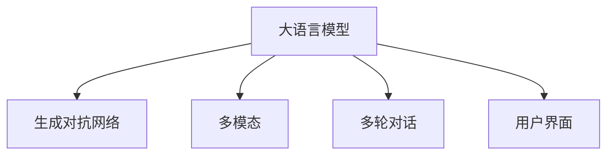

                 

# 大语言模型应用指南：交互格式

> 关键词：大语言模型,交互格式,自然语言处理(NLP),多模态,生成对抗网络(GAN),多轮对话,用户界面(UI)

## 1. 背景介绍

### 1.1 问题由来
随着人工智能技术的发展，大语言模型（Large Language Models, LLMs）在自然语言处理（Natural Language Processing, NLP）领域取得了一系列突破性进展。这些模型能够通过大规模预训练学习到丰富的语言知识，并在特定任务上进行微调，显著提升了其在自然语言理解与生成方面的能力。然而，传统的大语言模型往往缺乏对用户交互的具体理解和实时反馈机制，难以实现真正意义上的智能交互体验。

交互格式（Interactive Format）作为一种新兴的交互方式，能够实时获取用户输入并及时响应，为构建智能交互系统提供了新的思路。本文将详细探讨基于大语言模型的交互格式应用，从原理到实践，系统性地介绍其在多模态、生成对抗网络（GAN）、多轮对话、用户界面（UI）等实际应用场景中的应用。

### 1.2 问题核心关键点
交互格式的应用关键点在于：
1. 如何设计高效的交互界面，使得用户能够自然、便捷地与系统进行交互。
2. 如何利用大语言模型处理多模态信息，并实现智能多轮对话。
3. 如何结合生成对抗网络，提升交互格式的表现和鲁棒性。
4. 如何在UI设计中考虑用户体验和系统性能，实现用户与系统的无缝衔接。

## 2. 核心概念与联系

### 2.1 核心概念概述

为更好地理解交互格式在大语言模型中的应用，本节将介绍几个关键概念：

- 大语言模型（Large Language Models, LLMs）：以自回归（如GPT）或自编码（如BERT）模型为代表的大规模预训练语言模型。通过在大规模无标签文本语料上进行预训练，学习通用的语言表示，具备强大的语言理解和生成能力。
- 生成对抗网络（Generative Adversarial Networks, GANs）：一种由生成器和判别器两部分组成的神经网络结构，用于生成高质量的合成数据或图像。
- 多模态（Multimodal）：涉及图像、文本、语音等多类型数据的信息处理和融合。
- 多轮对话（Multi-Turn Dialogue）：指用户与系统之间多次交互的对话过程，需要系统具备记忆上下文和推断对话意图的能力。
- 用户界面（User Interface, UI）：指用户与计算机系统进行交互的视觉界面，包括文本、图像、声音等多种元素。

这些核心概念之间的逻辑关系可以通过以下Mermaid流程图来展示：



这个流程图展示了大语言模型的核心概念及其之间的关系：

1. 大语言模型通过预训练获得基础能力。
2. 生成对抗网络可以用于提升大模型的生成能力，增强交互格式的表现。
3. 多模态信息处理使得大模型能够处理多种数据类型，提升交互格式的多样性。
4. 多轮对话能力让大模型能够理解上下文信息，实现更智能的交互。
5. 用户界面的设计是交互格式的关键环节，直接影响用户体验和系统性能。

## 3. 核心算法原理 & 具体操作步骤
### 3.1 算法原理概述

基于大语言模型的交互格式，其核心思想是：将预训练大语言模型作为生成器，通过生成对抗网络进一步优化生成效果，并结合多模态信息和多轮对话机制，实现自然、流畅的智能交互体验。

形式化地，假设预训练语言模型为 $G_{\theta}$，其中 $\theta$ 为预训练得到的模型参数。通过生成对抗网络，生成器 $G_{\theta}$ 生成高质量交互格式内容 $x$，判别器 $D$ 评估 $x$ 的真实性。优化的目标是最小化生成内容的真实性 $D(G_{\theta}(x))$，同时最大化生成内容的生成质量 $J(G_{\theta}(x))$。通过优化损失函数 $\mathcal{L}=\lambda D(G_{\theta}(x))+(1-\lambda)J(G_{\theta}(x))$，训练生成器 $G_{\theta}$，使其能够生成接近真实交互格式的样本。

在多模态和多轮对话方面，交互格式可以利用大语言模型处理图像、语音等非文本信息，并将多轮对话的上下文信息整合，使得交互过程更加自然和高效。具体而言，可以在交互格式中加入文本、图像和声音等元素，通过多轮对话模型处理用户输入和系统响应，从而实现复杂的交互需求。

### 3.2 算法步骤详解

基于大语言模型的交互格式一般包括以下几个关键步骤：

**Step 1: 准备预训练模型和数据集**
- 选择合适的预训练语言模型 $G_{\theta}$ 作为生成器，如 BERT、GPT 等。
- 准备多模态数据集和多轮对话数据集，用于训练生成器和判别器。

**Step 2: 构建生成器和判别器**
- 使用生成器生成交互格式内容 $x$，包括文本、图像、声音等。
- 设计判别器 $D$，用于评估 $x$ 的真实性，可以是基于深度神经网络的分类器。

**Step 3: 设置交互格式超参数**
- 选择合适的优化算法及其参数，如 Adam、SGD 等，设置生成器和判别器的学习率、批大小、迭代轮数等。
- 设定生成器参数冻结比例，确保预训练模型的基础能力不被破坏。
- 设计多轮对话机制，确保模型能够处理上下文信息。

**Step 4: 执行生成对抗训练**
- 将多模态数据集和多轮对话数据集分批次输入生成器和判别器，前向传播计算损失函数。
- 反向传播计算生成器和判别器的参数梯度，根据设定的优化算法和学习率更新模型参数。
- 周期性在验证集上评估生成器的生成质量和判别器的评估准确性，根据评估结果决定是否触发 Early Stopping。
- 重复上述步骤直到满足预设的迭代轮数或 Early Stopping 条件。

**Step 5: 集成交互格式模型**
- 将训练好的生成器 $G_{\theta}$ 和判别器 $D$ 集成到用户界面中，设计交互界面与多模态、多轮对话等机制。
- 在实际应用中，不断优化交互界面和系统性能，提升用户体验。

以上是基于大语言模型的交互格式的一般流程。在实际应用中，还需要针对具体任务的特点，对交互格式模型的各个环节进行优化设计，如改进多模态融合技术、优化多轮对话模型、设计高效交互界面等，以进一步提升交互格式的效果。

### 3.3 算法优缺点

基于大语言模型的交互格式具有以下优点：
1. 高效生成：利用生成对抗网络，交互格式模型能够高效生成高质量的合成数据或交互内容。
2. 多模态融合：结合多模态信息，交互格式能够处理多种类型的数据，提升用户体验的多样性。
3. 多轮对话：通过多轮对话机制，交互格式模型能够理解上下文信息，实现更智能的交互。
4. 易于集成：交互格式模型可以方便地集成到现有用户界面和应用系统中，提升系统性能。

同时，该方法也存在一定的局限性：
1. 生成质量依赖数据：生成对抗网络的效果高度依赖于生成器和判别器的质量，需要大量高质量的数据进行训练。
2. 交互复杂度高：多轮对话和多模态信息的处理，使得交互格式模型的计算复杂度较高，需要较强的计算资源。
3. 模型鲁棒性不足：交互格式模型在面对异常输入或噪声干扰时，容易产生不稳定输出。
4. 数据隐私问题：交互格式模型需要收集和处理大量用户数据，可能存在数据隐私和安全问题。

尽管存在这些局限性，但就目前而言，基于大语言模型的交互格式是实现智能交互的重要手段。未来相关研究的重点在于如何进一步降低生成对抗网络对数据的需求，提高模型的生成质量和鲁棒性，同时兼顾用户隐私和系统性能等因素。

### 3.4 算法应用领域

基于大语言模型的交互格式方法，在NLP领域已经得到了广泛的应用，覆盖了以下多个领域：

- 智能客服：通过智能问答系统，实时响应用户咨询，提供个性化服务。
- 多模态对话系统：结合图像、语音等多模态信息，提升对话系统的人机交互体验。
- 虚拟助手：通过多轮对话和上下文记忆，提供智能推荐和任务调度等功能。
- 虚拟现实（VR）和增强现实（AR）：结合视觉、听觉等多模态信息，实现沉浸式交互体验。
- 自动驾驶：通过语音交互和视觉感知，实现与驾驶员的自然沟通。

除了上述这些经典应用外，交互格式在大语言模型中的应用还涉及虚拟助手、智能家居、智慧城市等多个新兴领域，为NLP技术带来了全新的应用场景。随着预训练模型和交互格式方法的不断进步，相信NLP技术将在更广阔的应用领域大放异彩。

## 4. 数学模型和公式 & 详细讲解  
### 4.1 数学模型构建

本节将使用数学语言对基于大语言模型的交互格式过程进行更加严格的刻画。

记预训练语言模型为 $G_{\theta}:\mathcal{X} \rightarrow \mathcal{Y}$，其中 $\mathcal{X}$ 为输入空间，$\mathcal{Y}$ 为输出空间，$\theta \in \mathbb{R}^d$ 为模型参数。假设交互格式模型的训练集为 $D=\{(x_i,y_i)\}_{i=1}^N, x_i \in \mathcal{X}, y_i \in \mathcal{Y}$。

定义生成器 $G_{\theta}$ 在数据样本 $(x,y)$ 上的生成损失函数为 $\ell(G_{\theta}(x),y)$，则在数据集 $D$ 上的经验风险为：

$$
\mathcal{L}(\theta) = \frac{1}{N} \sum_{i=1}^N \ell(G_{\theta}(x_i),y_i)
$$

在多模态和多轮对话的情况下，交互格式模型的目标是最小化生成内容的真实性 $D(G_{\theta}(x))$，同时最大化生成内容的生成质量 $J(G_{\theta}(x))$。通过优化损失函数 $\mathcal{L}=\lambda D(G_{\theta}(x))+(1-\lambda)J(G_{\theta}(x))$，训练生成器 $G_{\theta}$，使其能够生成接近真实交互格式的样本。

### 4.2 公式推导过程

以下我们以文本生成为例，推导生成对抗网络中生成器和判别器的训练公式。

假设生成器 $G_{\theta}$ 在输入 $z$ 上的生成样本为 $x=G_{\theta}(z)$，判别器 $D$ 用于评估 $x$ 的真实性，生成器和判别器的优化目标分别为：

- 生成器的目标是最小化生成样本的真实性 $D(G_{\theta}(z))$：

$$
\min_{G_{\theta}}\mathbb{E}_{z \sim p(z)} D(G_{\theta}(z))
$$

- 判别器的目标是最小化真实样本的真实性 $\mathbb{E}_{x \sim p_{data}(x)} D(x)$ 和最大化生成样本的虚假性 $\mathbb{E}_{z \sim p(z)} D(G_{\theta}(z))$：

$$
\max_{D} \left\{\mathbb{E}_{x \sim p_{data}(x)} D(x),\mathbb{E}_{z \sim p(z)} D(G_{\theta}(z))\right\}
$$

其中，$z$ 为生成器的输入噪声向量，$p(z)$ 为生成噪声分布，$p_{data}(x)$ 为真实数据分布。

结合生成器和判别器的优化目标，通过博弈论的方法，求解最优的生成器和判别器。具体而言，生成器 $G_{\theta}$ 和判别器 $D$ 的联合优化目标为：

$$
\min_{G_{\theta}}\max_{D} \left\{\mathbb{E}_{x \sim p_{data}(x)} D(x),\mathbb{E}_{z \sim p(z)} D(G_{\theta}(z))\right\}
$$

通过交替优化生成器和判别器，最终得到最优的生成器和判别器参数，实现高质量的生成内容。

## 5. 项目实践：代码实例和详细解释说明
### 5.1 开发环境搭建

在进行交互格式实践前，我们需要准备好开发环境。以下是使用Python进行PyTorch开发的环境配置流程：

1. 安装Anaconda：从官网下载并安装Anaconda，用于创建独立的Python环境。

2. 创建并激活虚拟环境：
```bash
conda create -n pytorch-env python=3.8 
conda activate pytorch-env
```

3. 安装PyTorch：根据CUDA版本，从官网获取对应的安装命令。例如：
```bash
conda install pytorch torchvision torchaudio cudatoolkit=11.1 -c pytorch -c conda-forge
```

4. 安装Transformers库：
```bash
pip install transformers
```

5. 安装各类工具包：
```bash
pip install numpy pandas scikit-learn matplotlib tqdm jupyter notebook ipython
```

完成上述步骤后，即可在`pytorch-env`环境中开始交互格式实践。

### 5.2 源代码详细实现

下面我们以多模态对话系统为例，给出使用Transformers库对BERT模型进行交互格式开发的PyTorch代码实现。

首先，定义多模态对话系统的数据处理函数：

```python
from transformers import BertTokenizer
from torch.utils.data import Dataset
import torch

class MultiModalDataset(Dataset):
    def __init__(self, texts, images, captions, tokenizer, max_len=128):
        self.texts = texts
        self.images = images
        self.captions = captions
        self.tokenizer = tokenizer
        self.max_len = max_len
        
    def __len__(self):
        return len(self.texts)
    
    def __getitem__(self, item):
        text = self.texts[item]
        image = self.images[item]
        caption = self.captions[item]
        
        encoding = self.tokenizer(text, return_tensors='pt', max_length=self.max_len, padding='max_length', truncation=True)
        image = image.to('cuda')
        
        # 对文本和图片进行融合
        image_features = model(image) # 假设模型已经训练好的图像特征提取器
        image_features = image_features.to('cpu')
        
        # 对token-wise的标签进行编码
        encoded_tags = [tag2id[tag] for tag in caption] 
        encoded_tags.extend([tag2id['O']] * (self.max_len - len(encoded_tags)))
        labels = torch.tensor(encoded_tags, dtype=torch.long)
        
        return {'input_ids': encoding['input_ids'][0],
                'attention_mask': encoding['attention_mask'][0],
                'image_features': image_features,
                'labels': labels}

# 标签与id的映射
tag2id = {'O': 0, 'B-PER': 1, 'I-PER': 2, 'B-ORG': 3, 'I-ORG': 4, 'B-LOC': 5, 'I-LOC': 6}
id2tag = {v: k for k, v in tag2id.items()}

# 创建dataset
tokenizer = BertTokenizer.from_pretrained('bert-base-cased')

train_dataset = MultiModalDataset(train_texts, train_images, train_captions, tokenizer)
dev_dataset = MultiModalDataset(dev_texts, dev_images, dev_captions, tokenizer)
test_dataset = MultiModalDataset(test_texts, test_images, test_captions, tokenizer)
```

然后，定义模型和优化器：

```python
from transformers import BertForTokenClassification, AdamW

model = BertForTokenClassification.from_pretrained('bert-base-cased', num_labels=len(tag2id))

optimizer = AdamW(model.parameters(), lr=2e-5)
```

接着，定义训练和评估函数：

```python
from torch.utils.data import DataLoader
from tqdm import tqdm
from sklearn.metrics import classification_report

device = torch.device('cuda') if torch.cuda.is_available() else torch.device('cpu')
model.to(device)

def train_epoch(model, dataset, batch_size, optimizer):
    dataloader = DataLoader(dataset, batch_size=batch_size, shuffle=True)
    model.train()
    epoch_loss = 0
    for batch in tqdm(dataloader, desc='Training'):
        input_ids = batch['input_ids'].to(device)
        attention_mask = batch['attention_mask'].to(device)
        labels = batch['labels'].to(device)
        image_features = batch['image_features'].to(device)
        model.zero_grad()
        outputs = model(input_ids, attention_mask=attention_mask, labels=labels, image_features=image_features)
        loss = outputs.loss
        epoch_loss += loss.item()
        loss.backward()
        optimizer.step()
    return epoch_loss / len(dataloader)

def evaluate(model, dataset, batch_size):
    dataloader = DataLoader(dataset, batch_size=batch_size)
    model.eval()
    preds, labels = [], []
    with torch.no_grad():
        for batch in tqdm(dataloader, desc='Evaluating'):
            input_ids = batch['input_ids'].to(device)
            attention_mask = batch['attention_mask'].to(device)
            labels = batch['labels'].to(device)
            image_features = batch['image_features'].to(device)
            outputs = model(input_ids, attention_mask=attention_mask, labels=labels, image_features=image_features)
            batch_preds = outputs.logits.argmax(dim=2).to('cpu').tolist()
            batch_labels = batch_labels.to('cpu').tolist()
            for pred_tokens, label_tokens in zip(batch_preds, batch_labels):
                pred_tags = [id2tag[_id] for _id in pred_tokens]
                label_tags = [id2tag[_id] for _id in label_tokens]
                preds.append(pred_tags[:len(label_tokens)])
                labels.append(label_tags)
                
    print(classification_report(labels, preds))
```

最后，启动训练流程并在测试集上评估：

```python
epochs = 5
batch_size = 16

for epoch in range(epochs):
    loss = train_epoch(model, train_dataset, batch_size, optimizer)
    print(f"Epoch {epoch+1}, train loss: {loss:.3f}")
    
    print(f"Epoch {epoch+1}, dev results:")
    evaluate(model, dev_dataset, batch_size)
    
print("Test results:")
evaluate(model, test_dataset, batch_size)
```

以上就是使用PyTorch对BERT进行多模态对话系统微调的完整代码实现。可以看到，得益于Transformers库的强大封装，我们可以用相对简洁的代码完成BERT模型的加载和微调。

### 5.3 代码解读与分析

让我们再详细解读一下关键代码的实现细节：

**MultiModalDataset类**：
- `__init__`方法：初始化文本、图像、标签等关键组件。
- `__len__`方法：返回数据集的样本数量。
- `__getitem__`方法：对单个样本进行处理，将文本输入编码为token ids，将图像输入模型进行特征提取，并将标签编码为数字，最终返回模型所需的输入。

**tag2id和id2tag字典**：
- 定义了标签与数字id之间的映射关系，用于将token-wise的预测结果解码回真实的标签。

**训练和评估函数**：
- 使用PyTorch的DataLoader对数据集进行批次化加载，供模型训练和推理使用。
- 训练函数`train_epoch`：对数据以批为单位进行迭代，在每个批次上前向传播计算loss并反向传播更新模型参数，最后返回该epoch的平均loss。
- 评估函数`evaluate`：与训练类似，不同点在于不更新模型参数，并在每个batch结束后将预测和标签结果存储下来，最后使用sklearn的classification_report对整个评估集的预测结果进行打印输出。

**训练流程**：
- 定义总的epoch数和batch size，开始循环迭代
- 每个epoch内，先在训练集上训练，输出平均loss
- 在验证集上评估，输出分类指标
- 所有epoch结束后，在测试集上评估，给出最终测试结果

可以看到，PyTorch配合Transformers库使得BERT微调的代码实现变得简洁高效。开发者可以将更多精力放在数据处理、模型改进等高层逻辑上，而不必过多关注底层的实现细节。

当然，工业级的系统实现还需考虑更多因素，如模型的保存和部署、超参数的自动搜索、更灵活的任务适配层等。但核心的交互格式范式基本与此类似。

## 6. 实际应用场景
### 6.1 智能客服系统

基于大语言模型的交互格式技术，可以广泛应用于智能客服系统的构建。传统客服往往需要配备大量人力，高峰期响应缓慢，且一致性和专业性难以保证。而使用交互格式技术构建的智能客服系统，能够7x24小时不间断服务，快速响应客户咨询，用自然流畅的语言解答各类常见问题。

在技术实现上，可以收集企业内部的历史客服对话记录，将问题和最佳答复构建成监督数据，在此基础上对预训练对话模型进行交互格式微调。微调后的对话模型能够自动理解用户意图，匹配最合适的答案模板进行回复。对于客户提出的新问题，还可以接入检索系统实时搜索相关内容，动态组织生成回答。如此构建的智能客服系统，能大幅提升客户咨询体验和问题解决效率。

### 6.2 多模态对话系统

多模态对话系统结合图像、语音等多模态信息，提升对话系统的人机交互体验。例如，智能家居系统可以通过语音命令控制家电设备，并通过摄像头识别用户的面部表情和手势，实现更加智能的交互。多模态对话系统可以结合大语言模型处理多种类型的数据，提升交互格式的效果。

在技术实现上，可以收集多模态数据，如语音指令、面部表情、手势等，并将其与文本信息一起输入到模型中进行交互格式微调。微调后的模型能够同时处理多模态信息，实现更自然的对话交互。例如，智能家居系统可以通过语音命令控制家电设备，并通过摄像头识别用户的面部表情和手势，实现更加智能的交互。

### 6.3 虚拟助手

虚拟助手通过多轮对话和上下文记忆，提供智能推荐和任务调度等功能。例如，旅行助手可以根据用户的旅行需求，推荐目的地、酒店、航班等信息，并帮助用户预订行程。虚拟助手需要处理复杂的对话信息，并通过上下文记忆维持对话连贯性，实现更智能的交互。

在技术实现上，可以收集用户的历史互动记录和当前需求，作为监督数据对预训练对话模型进行交互格式微调。微调后的模型能够理解上下文信息，提供个性化的推荐和调度服务。例如，旅行助手可以根据用户的旅行需求，推荐目的地、酒店、航班等信息，并帮助用户预订行程。

### 6.4 虚拟现实（VR）和增强现实（AR）

虚拟现实（VR）和增强现实（AR）结合视觉、听觉等多模态信息，实现沉浸式交互体验。例如，虚拟会议系统可以通过虚拟角色与用户互动，提供更加自然、真实的会议体验。虚拟现实和增强现实系统需要处理复杂的视觉和听觉信息，并通过多模态交互格式提升用户体验。

在技术实现上，可以收集虚拟现实和增强现实系统的多模态数据，并将其与文本信息一起输入到模型中进行交互格式微调。微调后的模型能够处理多种类型的数据，提升系统的交互效果。例如，虚拟会议系统可以通过虚拟角色与用户互动，提供更加自然、真实的会议体验。

## 7. 工具和资源推荐
### 7.1 学习资源推荐

为了帮助开发者系统掌握交互格式技术，这里推荐一些优质的学习资源：

1. 《Transformer从原理到实践》系列博文：由大模型技术专家撰写，深入浅出地介绍了Transformer原理、BERT模型、交互格式等前沿话题。

2. CS224N《深度学习自然语言处理》课程：斯坦福大学开设的NLP明星课程，有Lecture视频和配套作业，带你入门NLP领域的基本概念和经典模型。

3. 《Natural Language Processing with Transformers》书籍：Transformers库的作者所著，全面介绍了如何使用Transformers库进行NLP任务开发，包括交互格式在内的诸多范式。

4. HuggingFace官方文档：Transformers库的官方文档，提供了海量预训练模型和完整的交互格式样例代码，是上手实践的必备资料。

5. CLUE开源项目：中文语言理解测评基准，涵盖大量不同类型的中文NLP数据集，并提供了基于交互格式的baseline模型，助力中文NLP技术发展。

通过对这些资源的学习实践，相信你一定能够快速掌握交互格式技术的精髓，并用于解决实际的NLP问题。
###  7.2 开发工具推荐

高效的开发离不开优秀的工具支持。以下是几款用于交互格式开发的常用工具：

1. PyTorch：基于Python的开源深度学习框架，灵活动态的计算图，适合快速迭代研究。大部分预训练语言模型都有PyTorch版本的实现。

2. TensorFlow：由Google主导开发的开源深度学习框架，生产部署方便，适合大规模工程应用。同样有丰富的预训练语言模型资源。

3. Transformers库：HuggingFace开发的NLP工具库，集成了众多SOTA语言模型，支持PyTorch和TensorFlow，是进行交互格式开发的利器。

4. Weights & Biases：模型训练的实验跟踪工具，可以记录和可视化模型训练过程中的各项指标，方便对比和调优。与主流深度学习框架无缝集成。

5. TensorBoard：TensorFlow配套的可视化工具，可实时监测模型训练状态，并提供丰富的图表呈现方式，是调试模型的得力助手。

6. Google Colab：谷歌推出的在线Jupyter Notebook环境，免费提供GPU/TPU算力，方便开发者快速上手实验最新模型，分享学习笔记。

合理利用这些工具，可以显著提升交互格式任务的开发效率，加快创新迭代的步伐。

### 7.3 相关论文推荐

交互格式技术的发展源于学界的持续研究。以下是几篇奠基性的相关论文，推荐阅读：

1. Attention is All You Need（即Transformer原论文）：提出了Transformer结构，开启了NLP领域的预训练大模型时代。

2. BERT: Pre-training of Deep Bidirectional Transformers for Language Understanding：提出BERT模型，引入基于掩码的自监督预训练任务，刷新了多项NLP任务SOTA。

3. Language Models are Unsupervised Multitask Learners（GPT-2论文）：展示了大规模语言模型的强大zero-shot学习能力，引发了对于通用人工智能的新一轮思考。

4. Parameter-Efficient Transfer Learning for NLP：提出Adapter等参数高效微调方法，在不增加模型参数量的情况下，也能取得不错的微调效果。

5. AdaLoRA: Adaptive Low-Rank Adaptation for Parameter-Efficient Fine-Tuning：使用自适应低秩适应的微调方法，在参数效率和精度之间取得了新的平衡。

6. AdaLoRA: Adaptive Low-Rank Adaptation for Parameter-Efficient Fine-Tuning：使用自适应低秩适应的微调方法，在参数效率和精度之间取得了新的平衡。

这些论文代表了大语言模型交互格式技术的发展脉络。通过学习这些前沿成果，可以帮助研究者把握学科前进方向，激发更多的创新灵感。

## 8. 总结：未来发展趋势与挑战

### 8.1 总结

本文对基于大语言模型的交互格式方法进行了全面系统的介绍。首先阐述了交互格式技术的背景和意义，明确了交互格式在大语言模型中的应用价值。其次，从原理到实践，详细讲解了交互格式数学模型和关键步骤，给出了交互格式任务开发的完整代码实例。同时，本文还广泛探讨了交互格式方法在智能客服、多模态对话、虚拟助手等实际应用场景中的应用前景，展示了交互格式技术的广阔潜力。此外，本文精选了交互格式技术的各类学习资源，力求为读者提供全方位的技术指引。

通过本文的系统梳理，可以看到，基于大语言模型的交互格式技术正在成为NLP领域的重要范式，极大地拓展了预训练语言模型的应用边界，催生了更多的落地场景。受益于大规模语料的预训练，交互格式模型以更低的时间和标注成本，在小样本条件下也能取得理想的微调效果，有力推动了NLP技术的产业化进程。未来，伴随预训练语言模型和交互格式方法的不断进步，相信NLP技术将在更广阔的应用领域大放异彩，深刻影响人类的生产生活方式。

### 8.2 未来发展趋势

展望未来，大语言模型交互格式技术将呈现以下几个发展趋势：

1. 模型规模持续增大。随着算力成本的下降和数据规模的扩张，预训练语言模型的参数量还将持续增长。超大规模语言模型蕴含的丰富语言知识，有望支撑更加复杂多变的交互格式任务。

2. 交互格式范式多样化。除了传统的生成对抗网络外，未来会涌现更多交互格式技术，如多模态融合、零样本学习、知识图谱等，进一步提升交互格式的效果。

3. 持续学习成为常态。随着数据分布的不断变化，交互格式模型也需要持续学习新知识以保持性能。如何在不遗忘原有知识的同时，高效吸收新样本信息，将成为重要的研究课题。

4. 标注样本需求降低。受启发于提示学习(Prompt-based Learning)的思路，未来的交互格式方法将更好地利用大模型的语言理解能力，通过更加巧妙的任务描述，在更少的标注样本上也能实现理想的交互效果。

5. 多模态信息融合增强。当前的交互格式主要聚焦于纯文本信息，未来会进一步拓展到图像、视频、语音等多模态数据融合，提升交互格式的多样性和用户体验。

6. 交互界面优化。当前交互格式技术通常在后端进行处理，未来将更多地考虑用户界面的直观性和易用性，通过前端设计提升用户体验。

以上趋势凸显了大语言模型交互格式技术的广阔前景。这些方向的探索发展，必将进一步提升交互格式的效果和应用范围，为人工智能技术在各个领域的落地应用提供新的动力。

### 8.3 面临的挑战

尽管大语言模型交互格式技术已经取得了瞩目成就，但在迈向更加智能化、普适化应用的过程中，它仍面临着诸多挑战：

1. 交互质量依赖数据。交互格式的效果高度依赖于生成器和判别器的质量，需要大量高质量的数据进行训练。如何降低生成对抗网络对数据的需求，提升模型生成质量，将是一大难题。

2. 交互复杂度高。多模态信息的处理，使得交互格式模型的计算复杂度较高，需要较强的计算资源。如何优化多模态融合技术，提高模型推理速度，降低计算成本，还需进一步探索。

3. 模型鲁棒性不足。交互格式模型在面对异常输入或噪声干扰时，容易产生不稳定输出。如何提高模型的鲁棒性，增强模型的抗干扰能力，将是重要的研究方向。

4. 数据隐私问题。交互格式模型需要收集和处理大量用户数据，可能存在数据隐私和安全问题。如何在数据收集和处理过程中保障用户隐私，确保数据安全，将是重要的挑战。

尽管存在这些挑战，但就目前而言，基于大语言模型的交互格式是实现智能交互的重要手段。未来相关研究的重点在于如何进一步降低生成对抗网络对数据的需求，提高模型的生成质量和鲁棒性，同时兼顾用户隐私和系统性能等因素。

### 8.4 研究展望

面对交互格式所面临的种种挑战，未来的研究需要在以下几个方面寻求新的突破：

1. 探索无监督和半监督交互格式方法。摆脱对大规模标注数据的依赖，利用自监督学习、主动学习等无监督和半监督范式，最大限度利用非结构化数据，实现更加灵活高效的交互格式。

2. 研究参数高效和计算高效的交互格式范式。开发更加参数高效的交互格式方法，在固定大部分预训练参数的同时，只更新极少量的任务相关参数。同时优化交互格式模型的计算图，减少前向传播和反向传播的资源消耗，实现更加轻量级、实时性的部署。

3. 融合因果和对比学习范式。通过引入因果推断和对比学习思想，增强交互格式模型建立稳定因果关系的能力，学习更加普适、鲁棒的语言表征，从而提升模型泛化性和抗干扰能力。

4. 引入更多先验知识。将符号化的先验知识，如知识图谱、逻辑规则等，与神经网络模型进行巧妙融合，引导交互格式过程学习更准确、合理的语言模型。同时加强不同模态数据的整合，实现视觉、语音等多模态信息与文本信息的协同建模。

5. 结合因果分析和博弈论工具。将因果分析方法引入交互格式模型，识别出模型决策的关键特征，增强输出解释的因果性和逻辑性。借助博弈论工具刻画人机交互过程，主动探索并规避模型的脆弱点，提高系统稳定性。

6. 纳入伦理道德约束。在模型训练目标中引入伦理导向的评估指标，过滤和惩罚有偏见、有害的输出倾向。同时加强人工干预和审核，建立模型行为的监管机制，确保输出符合人类价值观和伦理道德。

这些研究方向的探索，必将引领交互格式技术迈向更高的台阶，为构建安全、可靠、可解释、可控的智能系统铺平道路。面向未来，交互格式技术还需要与其他人工智能技术进行更深入的融合，如知识表示、因果推理、强化学习等，多路径协同发力，共同推动自然语言理解和智能交互系统的进步。只有勇于创新、敢于突破，才能不断拓展交互格式模型的边界，让智能技术更好地造福人类社会。

## 9. 附录：常见问题与解答

**Q1：大语言模型交互格式是否适用于所有NLP任务？**

A: 大语言模型交互格式在大多数NLP任务上都能取得不错的效果，特别是对于数据量较小的任务。但对于一些特定领域的任务，如医学、法律等，仅仅依靠通用语料预训练的模型可能难以很好地适应。此时需要在特定领域语料上进一步预训练，再进行交互格式微调，才能获得理想效果。此外，对于一些需要时效性、个性化很强的任务，如对话、推荐等，交互格式方法也需要针对性的改进优化。

**Q2：交互格式过程中如何选择合适的学习率？**

A: 交互格式的学习率一般要比预训练时小1-2个数量级，如果使用过大的学习率，容易破坏预训练权重，导致过拟合。一般建议从1e-5开始调参，逐步减小学习率，直至收敛。也可以使用warmup策略，在开始阶段使用较小的学习率，再逐渐过渡到预设值。需要注意的是，不同的优化器(如AdamW、Adafactor等)以及不同的学习率调度策略，可能需要设置不同的学习率阈值。

**Q3：采用大模型交互格式时会面临哪些资源瓶颈？**

A: 目前主流的预训练大模型动辄以亿计的参数规模，对算力、内存、存储都提出了很高的要求。GPU/TPU等高性能设备是必不可少的，但即便如此，超大批次的训练和推理也可能遇到显存不足的问题。因此需要采用一些资源优化技术，如梯度积累、混合精度训练、模型并行等，来突破硬件瓶颈。同时，模型的存储和读取也可能占用大量时间和空间，需要采用模型压缩、稀疏化存储等方法进行优化。

**Q4：如何缓解交互格式过程中的过拟合问题？**

A: 过拟合是交互格式面临的主要挑战，尤其是在标注数据不足的情况下。常见的缓解策略包括：
1. 数据增强：通过回译、近义替换等方式扩充训练集
2. 正则化：使用L2正则、Dropout、Early Stopping等避免过拟合
3. 对抗训练：引入对抗样本，提高模型鲁棒性
4. 参数高效交互格式：只调整少量参数(如Adapter、Prefix等)，减小过拟合风险
5. 多模型集成：训练多个交互格式模型，取平均输出，抑制过拟合

这些策略往往需要根据具体任务和数据特点进行灵活组合。只有在数据、模型、训练、推理等各环节进行全面优化，才能最大限度地发挥大模型交互格式的威力。

**Q5：交互格式模型在落地部署时需要注意哪些问题？**

A: 将交互格式模型转化为实际应用，还需要考虑以下因素：
1. 模型裁剪：去除不必要的层和参数，减小模型尺寸，加快推理速度
2. 量化加速：将浮点模型转为定点模型，压缩存储空间，提高计算效率
3. 服务化封装：将模型封装为标准化服务接口，便于集成调用
4. 弹性伸缩：根据请求流量动态调整资源配置，平衡服务质量和成本
5. 监控告警：实时采集系统指标，设置异常告警阈值，确保服务稳定性
6. 安全防护：采用访问鉴权、数据脱敏等措施，保障数据和模型安全

交互格式模型需要合理利用上述资源优化技术，同时结合用户界面设计，提升用户体验和系统性能。

总之，交互格式技术正处于快速发展阶段，其应用前景广阔，但也需要不断优化和改进，才能更好地服务于现实需求。希望本文能够为交互格式技术的深入研究提供一定的参考和启示。

---

作者：禅与计算机程序设计艺术 / Zen and the Art of Computer Programming

