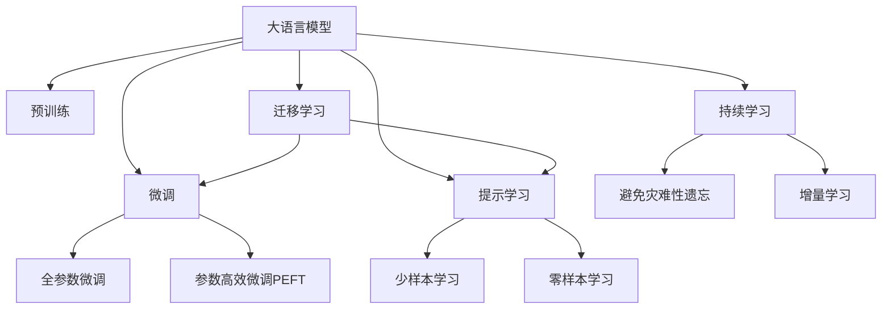

                 

# 大语言模型应用指南：关于大语言模型的思考能力

> 关键词：大语言模型,大模型,思考能力,应用指南,深度学习,自然语言处理,NLP,模型架构,技术解析

## 1. 背景介绍

### 1.1 问题由来
近年来，随着深度学习技术的飞速发展，大语言模型（Large Language Models, LLMs）在自然语言处理（Natural Language Processing, NLP）领域取得了巨大的突破。大语言模型通过在大规模无标签文本数据上进行预训练，学习到丰富的语言知识和常识，可以用于文本分类、情感分析、问答系统、机器翻译等任务，成为当前NLP研究的重要方向。

然而，大语言模型虽然具有强大的语言生成和理解能力，但其思考能力仍有待进一步挖掘和提升。传统的大模型往往只能进行简单的逻辑推理，难以解决复杂的认知问题，如推理链条长、步骤繁琐的逻辑问题。因此，如何增强大语言模型的思考能力，使其能够更好地解决复杂的自然语言问题，成为当前研究的热点之一。

### 1.2 问题核心关键点
要增强大语言模型的思考能力，需从以下几个方面入手：

1. **预训练任务设计**：选择什么样的预训练任务可以更好地促进模型学习复杂的思考能力。例如，引入逻辑推理、常识推理、计算推理等任务，帮助模型掌握更复杂的推理逻辑。

2. **模型架构优化**：如何设计模型架构，使其能够更好地处理复杂推理问题。例如，引入注意力机制、因果推理机制等，提升模型的思考能力。

3. **训练策略改进**：采用什么样的训练策略，能够在有限的数据下提升模型的思考能力。例如，使用强化学习、对抗训练等策略，引导模型学习更复杂的思考方式。

4. **应用场景扩展**：将模型应用于哪些实际场景，可以更好地评估其思考能力。例如，应用于智能问答、自动推理、数学问题解答等场景。

5. **思考能力的度量**：如何度量和评估模型的思考能力，以便更好地指导后续研究和应用。例如，使用推理链条长度、逻辑正确性、推理时间等指标。

### 1.3 问题研究意义
增强大语言模型的思考能力，对于拓展其应用范围，提升NLP系统的智能化水平，具有重要意义：

1. **解决复杂问题**：大模型能够处理复杂、多步骤的推理问题，提升其在知识密集型任务上的表现，如法律咨询、医学诊断、金融分析等。

2. **提升交互体验**：通过增强模型的思考能力，能够提供更加智能和自然的人机交互体验，如智能客服、虚拟助手、教育辅导等。

3. **降低开发成本**：借助大模型的思考能力，能够减少对专家规则的依赖，降低系统的开发和维护成本。

4. **促进产业升级**：思考能力的增强，能够推动NLP技术在更多行业中的应用，促进各行业的数字化转型和升级。

## 2. 核心概念与联系

### 2.1 核心概念概述

为更好地理解增强大语言模型思考能力的方法，本节将介绍几个密切相关的核心概念：

- **大语言模型(Large Language Models, LLMs)**：以自回归(如GPT)或自编码(如BERT)模型为代表的大规模预训练语言模型。通过在大规模无标签文本语料上进行预训练，学习通用的语言表示，具备强大的语言理解和生成能力。

- **预训练(Pre-training)**：指在大规模无标签文本语料上，通过自监督学习任务训练通用语言模型的过程。常见的预训练任务包括言语建模、遮挡语言模型等。

- **微调(Fine-tuning)**：指在预训练模型的基础上，使用下游任务的少量标注数据，通过有监督学习优化模型在该任务上的性能。通常只需要调整顶层分类器或解码器，并以较小的学习率更新全部或部分的模型参数。

- **迁移学习(Transfer Learning)**：指将一个领域学习到的知识，迁移应用到另一个不同但相关的领域的学习范式。大模型的预训练-微调过程即是一种典型的迁移学习方式。

- **思考能力**：指大语言模型进行复杂推理、判断、决策的能力。例如，理解语境、识别逻辑关系、推导出结论等。

- **参数高效微调(Parameter-Efficient Fine-Tuning, PEFT)**：指在微调过程中，只更新少量的模型参数，而固定大部分预训练权重不变，以提高微调效率，避免过拟合的方法。

- **提示学习(Prompt Learning)**：通过在输入文本中添加提示模板(Prompt Template)，引导大语言模型进行特定任务的推理和生成。可以在不更新模型参数的情况下，实现少样本或零样本学习。

- **少样本学习(Few-shot Learning)**：指在只有少量标注样本的情况下，模型能够快速适应新任务的学习方法。在大语言模型中，通常通过在输入中提供少量示例来实现，无需更新模型参数。

- **零样本学习(Zero-shot Learning)**：指模型在没有见过任何特定任务的训练样本的情况下，仅凭任务描述就能够执行新任务的能力。大语言模型通过预训练获得的广泛知识，使其能够理解任务指令并生成相应输出。

- **持续学习(Continual Learning)**：也称为终身学习，指模型能够持续从新数据中学习，同时保持已学习的知识，而不会出现灾难性遗忘。这对于保持大语言模型的时效性和适应性至关重要。

这些核心概念之间的逻辑关系可以通过以下Mermaid流程图来展示：



这个流程图展示了大语言模型的核心概念及其之间的关系：

1. 大语言模型通过预训练获得基础能力。
2. 微调是对预训练模型进行任务特定的优化，可以分为全参数微调和参数高效微调（PEFT）。
3. 提示学习是一种不更新模型参数的方法，可以实现少样本学习和零样本学习。
4. 迁移学习是连接预训练模型与下游任务的桥梁，可以通过微调或提示学习来实现。
5. 持续学习旨在使模型能够不断学习新知识，同时避免遗忘旧知识。

这些概念共同构成了大语言模型的学习和应用框架，使其能够在各种场景下发挥强大的语言理解和生成能力。通过理解这些核心概念，我们可以更好地把握大语言模型的工作原理和优化方向。

## 3. 核心算法原理 & 具体操作步骤
### 3.1 算法原理概述

增强大语言模型的思考能力，本质上是一个有监督的细粒度迁移学习过程。其核心思想是：将预训练的大语言模型视作一个强大的"特征提取器"，通过在复杂推理任务上的有监督学习，优化模型在该任务上的推理能力，从而获得针对特定任务优化的模型。

形式化地，假设预训练模型为 $M_{\theta}$，其中 $\theta$ 为预训练得到的模型参数。给定复杂推理任务 $T$ 的少量标注数据集 $D=\{(x_i, (y_i, p_i))\}_{i=1}^N$，其中 $x_i$ 为输入，$y_i$ 为推理结果，$p_i$ 为推理链条（或推理步骤）。微调的目标是找到新的模型参数 $\hat{\theta}$，使得：

$$
\hat{\theta}=\mathop{\arg\min}_{\theta} \mathcal{L}(M_{\theta},D)
$$

其中 $\mathcal{L}$ 为针对任务 $T$ 设计的损失函数，用于衡量模型推理输出与真实推理结果之间的差异。常见的损失函数包括交叉熵损失、均方误差损失等。

通过梯度下降等优化算法，微调过程不断更新模型参数 $\theta$，最小化损失函数 $\mathcal{L}$，使得模型输出逼近真实推理结果。由于 $\theta$ 已经通过预训练获得了较好的初始化，因此即便在推理任务上标注数据较少，也能较快收敛到理想的模型参数 $\hat{\theta}$。

### 3.2 算法步骤详解

基于有监督学习的大语言模型思考能力增强方法一般包括以下几个关键步骤：

**Step 1: 准备预训练模型和数据集**
- 选择合适的预训练语言模型 $M_{\theta}$ 作为初始化参数，如 BERT、GPT等。
- 准备复杂推理任务 $T$ 的少量标注数据集 $D$，其中每条数据包括输入 $x_i$、推理结果 $y_i$ 和推理链条 $p_i$。

**Step 2: 添加推理目标函数**
- 根据任务类型，在预训练模型顶层设计合适的推理目标函数，如推理链条长度、逻辑正确性等。
- 对于推理链条长度，通常在顶层添加判别器，计算推理链条的长度。
- 对于逻辑正确性，通常使用逻辑判断函数，如蕴含关系判断、等价关系判断等。

**Step 3: 设置微调超参数**
- 选择合适的优化算法及其参数，如 AdamW、SGD 等，设置学习率、批大小、迭代轮数等。
- 设置正则化技术及强度，包括权重衰减、Dropout、Early Stopping 等。
- 确定冻结预训练参数的策略，如仅微调顶层，或全部参数都参与微调。

**Step 4: 执行梯度训练**
- 将训练集数据分批次输入模型，前向传播计算推理目标函数。
- 反向传播计算参数梯度，根据设定的优化算法和学习率更新模型参数。
- 周期性在验证集上评估模型推理能力，根据性能指标决定是否触发 Early Stopping。
- 重复上述步骤直到满足预设的迭代轮数或 Early Stopping 条件。

**Step 5: 测试和部署**
- 在测试集上评估微调后模型 $M_{\hat{\theta}}$ 的推理能力，对比微调前后的推理链条长度、逻辑正确性等指标。
- 使用微调后的模型对新样本进行推理，集成到实际的应用系统中。
- 持续收集新的数据，定期重新微调模型，以适应数据分布的变化。

以上是基于有监督学习微调大语言模型推理能力的完整代码实现。可以看到，通过适当的任务适配层和推理目标函数的设计，大语言模型可以用于处理复杂的推理任务。

### 3.3 算法优缺点

增强大语言模型推理能力的基于有监督学习的方法具有以下优点：
1. 简单高效。只需准备少量标注数据，即可对预训练模型进行快速适配，获得较大的性能提升。
2. 通用适用。适用于各种复杂推理任务，设计简单的推理目标函数即可实现微调。
3. 参数高效。利用参数高效微调技术，在固定大部分预训练参数的情况下，仍可取得不错的提升。
4. 效果显著。在学术界和工业界的诸多任务上，基于微调的方法已经刷新了多项推理任务SOTA。

同时，该方法也存在一定的局限性：
1. 依赖标注数据。推理能力的提升很大程度上取决于标注数据的质量和数量，获取高质量标注数据的成本较高。
2. 迁移能力有限。当目标任务与预训练数据的分布差异较大时，推理能力的提升有限。
3. 负面效果传递。预训练模型的固有偏见、有害信息等，可能通过微调传递到下游任务，造成负面影响。
4. 可解释性不足。微调模型的推理过程通常缺乏可解释性，难以对其推理逻辑进行分析和调试。

尽管存在这些局限性，但就目前而言，基于有监督学习的微调方法仍是大语言模型推理能力提升的最主流范式。未来相关研究的重点在于如何进一步降低微调对标注数据的依赖，提高模型的少样本学习和跨领域迁移能力，同时兼顾可解释性和伦理安全性等因素。

### 3.4 算法应用领域

增强大语言模型推理能力的方法在NLP领域已经得到了广泛的应用，覆盖了几乎所有常见任务，例如：

- 文本分类：如情感分析、主题分类、意图识别等。通过微调使模型学习文本-推理映射。
- 命名实体识别：识别文本中的人名、地名、机构名等特定实体。通过微调使模型掌握实体边界和类型。
- 关系抽取：从文本中抽取实体之间的语义关系。通过微调使模型学习实体-关系三元组。
- 问答系统：对自然语言问题给出答案。将问题-答案对作为微调数据，训练模型学习匹配答案。
- 机器翻译：将源语言文本翻译成目标语言。通过微调使模型学习语言-语言映射。
- 文本摘要：将长文本压缩成简短摘要。将文章-摘要对作为微调数据，使模型学习抓取要点。
- 对话系统：使机器能够与人自然对话。将多轮对话历史作为上下文，微调模型进行回复生成。

除了上述这些经典任务外，大语言模型推理能力增强方法也被创新性地应用到更多场景中，如可控文本生成、常识推理、代码生成、数据增强等，为NLP技术带来了全新的突破。随着预训练模型和推理能力增强方法的不断进步，相信NLP技术将在更广阔的应用领域大放异彩。

## 4. 数学模型和公式 & 详细讲解  
### 4.1 数学模型构建

本节将使用数学语言对基于有监督学习的大语言模型推理能力增强过程进行更加严格的刻画。

记预训练语言模型为 $M_{\theta}$，其中 $\theta$ 为预训练得到的模型参数。假设复杂推理任务 $T$ 的训练集为 $D=\{(x_i, (y_i, p_i))\}_{i=1}^N$，其中 $x_i \in \mathcal{X}$，$y_i \in \mathcal{Y}$，$p_i \in P$。

定义模型 $M_{\theta}$ 在数据样本 $(x, (y, p))$ 上的推理目标函数为 $\ell(M_{\theta}(x), (y, p))$，则在数据集 $D$ 上的经验风险为：

$$
\mathcal{L}(\theta) = \frac{1}{N}\sum_{i=1}^N \ell(M_{\theta}(x_i), (y_i, p_i))
$$

微调的优化目标是最小化经验风险，即找到最优参数：

$$
\theta^* = \mathop{\arg\min}_{\theta} \mathcal{L}(\theta)
$$

在实践中，我们通常使用基于梯度的优化算法（如SGD、Adam等）来近似求解上述最优化问题。设 $\eta$ 为学习率，$\lambda$ 为正则化系数，则参数的更新公式为：

$$
\theta \leftarrow \theta - \eta \nabla_{\theta}\mathcal{L}(\theta) - \eta\lambda\theta
$$

其中 $\nabla_{\theta}\mathcal{L}(\theta)$ 为推理目标函数对参数 $\theta$ 的梯度，可通过反向传播算法高效计算。

### 4.2 公式推导过程

以下我们以推理链条长度预测为例，推导交叉熵损失函数及其梯度的计算公式。

假设模型 $M_{\theta}$ 在输入 $x$ 上的推理输出为 $\hat{p}=M_{\theta}(x) \in [0,1]$，表示推理链条长度为 $p$ 的概率。真实推理链条长度 $p \in P$。则推理链条长度的交叉熵损失函数定义为：

$$
\ell(M_{\theta}(x), p) = -p\log \hat{p} + (1-p)\log (1-\hat{p})
$$

将其代入经验风险公式，得：

$$
\mathcal{L}(\theta) = -\frac{1}{N}\sum_{i=1}^N [p_i\log M_{\theta}(x_i)+(1-p_i)\log(1-M_{\theta}(x_i))]
$$

根据链式法则，推理链条长度对参数 $\theta_k$ 的梯度为：

$$
\frac{\partial \mathcal{L}(\theta)}{\partial \theta_k} = -\frac{1}{N}\sum_{i=1}^N (\frac{p_i}{M_{\theta}(x_i)}-\frac{1-p_i}{1-M_{\theta}(x_i)}) \frac{\partial M_{\theta}(x_i)}{\partial \theta_k}
$$

其中 $\frac{\partial M_{\theta}(x_i)}{\partial \theta_k}$ 可进一步递归展开，利用自动微分技术完成计算。

在得到推理链条长度目标函数的梯度后，即可带入参数更新公式，完成模型的迭代优化。重复上述过程直至收敛，最终得到适应复杂推理任务的最优模型参数 $\theta^*$。

## 5. 项目实践：代码实例和详细解释说明
### 5.1 开发环境搭建

在进行推理能力增强实践前，我们需要准备好开发环境。以下是使用Python进行PyTorch开发的环境配置流程：

1. 安装Anaconda：从官网下载并安装Anaconda，用于创建独立的Python环境。

2. 创建并激活虚拟环境：
```bash
conda create -n pytorch-env python=3.8 
conda activate pytorch-env
```

3. 安装PyTorch：根据CUDA版本，从官网获取对应的安装命令。例如：
```bash
conda install pytorch torchvision torchaudio cudatoolkit=11.1 -c pytorch -c conda-forge
```

4. 安装Transformers库：
```bash
pip install transformers
```

5. 安装各类工具包：
```bash
pip install numpy pandas scikit-learn matplotlib tqdm jupyter notebook ipython
```

完成上述步骤后，即可在`pytorch-env`环境中开始推理能力增强实践。

### 5.2 源代码详细实现

下面我以复杂推理任务中的自然语言推理(NLI)为例，给出使用Transformers库对BERT模型进行推理能力增强的PyTorch代码实现。

首先，定义NLI任务的数据处理函数：

```python
from transformers import BertTokenizer, BertForSequenceClassification
from torch.utils.data import Dataset, DataLoader
import torch

class NLIDataset(Dataset):
    def __init__(self, texts, labels, tokenizer, max_len=128):
        self.texts = texts
        self.labels = labels
        self.tokenizer = tokenizer
        self.max_len = max_len
        
    def __len__(self):
        return len(self.texts)
    
    def __getitem__(self, item):
        text = self.texts[item]
        label = self.labels[item]
        
        encoding = self.tokenizer(text, return_tensors='pt', max_length=self.max_len, padding='max_length', truncation=True)
        input_ids = encoding['input_ids'][0]
        attention_mask = encoding['attention_mask'][0]
        
        # 对label进行编码
        encoded_label = [label2id[label] for label in label2id]
        encoded_label.extend([label2id['O']] * (self.max_len - len(encoded_label)))
        labels = torch.tensor(encoded_label, dtype=torch.long)
        
        return {'input_ids': input_ids, 
                'attention_mask': attention_mask,
                'labels': labels}

# 标签与id的映射
label2id = {'contradiction': 0, 'entailment': 1, 'neutral': 2}
id2label = {v: k for k, v in label2id.items()}

# 创建dataset
tokenizer = BertTokenizer.from_pretrained('bert-base-cased')

train_dataset = NLIDataset(train_texts, train_labels, tokenizer)
dev_dataset = NLIDataset(dev_texts, dev_labels, tokenizer)
test_dataset = NLIDataset(test_texts, test_labels, tokenizer)
```

然后，定义模型和优化器：

```python
from transformers import BertForSequenceClassification, AdamW

model = BertForSequenceClassification.from_pretrained('bert-base-cased', num_labels=len(label2id))

optimizer = AdamW(model.parameters(), lr=2e-5)
```

接着，定义训练和评估函数：

```python
from tqdm import tqdm
from sklearn.metrics import accuracy_score

device = torch.device('cuda') if torch.cuda.is_available() else torch.device('cpu')
model.to(device)

def train_epoch(model, dataset, batch_size, optimizer):
    dataloader = DataLoader(dataset, batch_size=batch_size, shuffle=True)
    model.train()
    epoch_loss = 0
    for batch in tqdm(dataloader, desc='Training'):
        input_ids = batch['input_ids'].to(device)
        attention_mask = batch['attention_mask'].to(device)
        labels = batch['labels'].to(device)
        model.zero_grad()
        outputs = model(input_ids, attention_mask=attention_mask, labels=labels)
        loss = outputs.loss
        epoch_loss += loss.item()
        loss.backward()
        optimizer.step()
    return epoch_loss / len(dataloader)

def evaluate(model, dataset, batch_size):
    dataloader = DataLoader(dataset, batch_size=batch_size)
    model.eval()
    preds, labels = [], []
    with torch.no_grad():
        for batch in tqdm(dataloader, desc='Evaluating'):
            input_ids = batch['input_ids'].to(device)
            attention_mask = batch['attention_mask'].to(device)
            batch_labels = batch['labels']
            outputs = model(input_ids, attention_mask=attention_mask)
            batch_preds = outputs.logits.argmax(dim=2).to('cpu').tolist()
            batch_labels = batch_labels.to('cpu').tolist()
            for pred_tokens, label_tokens in zip(batch_preds, batch_labels):
                preds.append(pred_tokens[:len(label_tokens)])
                labels.append(label_tokens)
                
    return accuracy_score(labels, preds)

epochs = 5
batch_size = 16

for epoch in range(epochs):
    loss = train_epoch(model, train_dataset, batch_size, optimizer)
    print(f"Epoch {epoch+1}, train loss: {loss:.3f}")
    
    print(f"Epoch {epoch+1}, dev accuracy:")
    acc = evaluate(model, dev_dataset, batch_size)
    print(f"{id2label[acc]} accuracy: {acc:.2f}")
    
print("Test accuracy:")
acc = evaluate(model, test_dataset, batch_size)
print(f"{id2label[acc]} accuracy: {acc:.2f}")
```

以上就是使用PyTorch对BERT进行复杂推理任务微调的完整代码实现。可以看到，得益于Transformers库的强大封装，我们可以用相对简洁的代码完成BERT模型的加载和微调。

### 5.3 代码解读与分析

让我们再详细解读一下关键代码的实现细节：

**NLIDataset类**：
- `__init__`方法：初始化文本、标签、分词器等关键组件。
- `__len__`方法：返回数据集的样本数量。
- `__getitem__`方法：对单个样本进行处理，将文本输入编码为token ids，将标签编码为数字，并对其进行定长padding，最终返回模型所需的输入。

**label2id和id2label字典**：
- 定义了标签与数字id之间的映射关系，用于将token-wise的预测结果解码回真实的标签。

**训练和评估函数**：
- 使用PyTorch的DataLoader对数据集进行批次化加载，供模型训练和推理使用。
- 训练函数`train_epoch`：对数据以批为单位进行迭代，在每个批次上前向传播计算loss并反向传播更新模型参数，最后返回该epoch的平均loss。
- 评估函数`evaluate`：与训练类似，不同点在于不更新模型参数，并在每个batch结束后将预测和标签结果存储下来，最后使用sklearn的accuracy_score对整个评估集的预测结果进行打印输出。

**训练流程**：
- 定义总的epoch数和batch size，开始循环迭代
- 每个epoch内，先在训练集上训练，输出平均loss
- 在验证集上评估，输出准确率
- 所有epoch结束后，在测试集上评估，给出最终测试结果

可以看到，PyTorch配合Transformers库使得BERT微调的代码实现变得简洁高效。开发者可以将更多精力放在数据处理、模型改进等高层逻辑上，而不必过多关注底层的实现细节。

当然，工业级的系统实现还需考虑更多因素，如模型的保存和部署、超参数的自动搜索、更灵活的任务适配层等。但核心的推理能力增强范式基本与此类似。

## 6. 实际应用场景
### 6.1 智能客服系统

基于大语言模型推理能力的对话技术，可以广泛应用于智能客服系统的构建。传统客服往往需要配备大量人力，高峰期响应缓慢，且一致性和专业性难以保证。而使用推理能力增强后的对话模型，可以7x24小时不间断服务，快速响应客户咨询，用自然流畅的语言解答各类常见问题。

在技术实现上，可以收集企业内部的历史客服对话记录，将问题和最佳答复构建成监督数据，在此基础上对预训练对话模型进行推理能力增强。推理能力增强后的对话模型能够自动理解用户意图，匹配最合适的答案模板进行回复。对于客户提出的新问题，还可以接入检索系统实时搜索相关内容，动态组织生成回答。如此构建的智能客服系统，能大幅提升客户咨询体验和问题解决效率。

### 6.2 金融舆情监测

金融机构需要实时监测市场舆论动向，以便及时应对负面信息传播，规避金融风险。传统的人工监测方式成本高、效率低，难以应对网络时代海量信息爆发的挑战。基于大语言模型推理能力的文本分类和情感分析技术，为金融舆情监测提供了新的解决方案。

具体而言，可以收集金融领域相关的新闻、报道、评论等文本数据，并对其进行主题标注和情感标注。在此基础上对预训练语言模型进行推理能力增强，使其能够自动判断文本属于何种主题，情感倾向是正面、中性还是负面。将推理能力增强后的模型应用到实时抓取的网络文本数据，就能够自动监测不同主题下的情感变化趋势，一旦发现负面信息激增等异常情况，系统便会自动预警，帮助金融机构快速应对潜在风险。

### 6.3 个性化推荐系统

当前的推荐系统往往只依赖用户的历史行为数据进行物品推荐，无法深入理解用户的真实兴趣偏好。基于大语言模型推理能力的个性化推荐系统可以更好地挖掘用户行为背后的语义信息，从而提供更精准、多样的推荐内容。

在实践中，可以收集用户浏览、点击、评论、分享等行为数据，提取和用户交互的物品标题、描述、标签等文本内容。将文本内容作为模型输入，用户的后续行为（如是否点击、购买等）作为监督信号，在此基础上微调预训练语言模型。推理能力增强后的模型能够从文本内容中准确把握用户的兴趣点。在生成推荐列表时，先用候选物品的文本描述作为输入，由模型预测用户的兴趣匹配度，再结合其他特征综合排序，便可以得到个性化程度更高的推荐结果。

### 6.4 未来应用展望

随着大语言模型推理能力的不断发展，基于推理能力增强的微调方法将在更多领域得到应用，为传统行业带来变革性影响。

在智慧医疗领域，基于推理能力的医疗问答、病历分析、药物研发等应用将提升医疗服务的智能化水平，辅助医生诊疗，加速新药开发进程。

在智能教育领域，推理能力增强技术可应用于作业批改、学情分析、知识推荐等方面，因材施教，促进教育公平，提高教学质量。

在智慧城市治理中，推理能力增强模型可应用于城市事件监测、舆情分析、应急指挥等环节，提高城市管理的自动化和智能化水平，构建更安全、高效的未来城市。

此外，在企业生产、社会治理、文娱传媒等众多领域，基于大语言模型推理能力的AI应用也将不断涌现，为经济社会发展注入新的动力。相信随着技术的日益成熟，推理能力增强方法将成为人工智能落地应用的重要范式，推动人工智能技术在垂直行业的规模化落地。总之，推理能力增强需要开发者根据具体任务，不断迭代和优化模型、数据和算法，方能得到理想的效果。

## 7. 工具和资源推荐
### 7.1 学习资源推荐

为了帮助开发者系统掌握大语言模型推理能力增强的理论基础和实践技巧，这里推荐一些优质的学习资源：

1. 《Transformer从原理到实践》系列博文：由大模型技术专家撰写，深入浅出地介绍了Transformer原理、BERT模型、推理能力增强等前沿话题。

2. CS224N《深度学习自然语言处理》课程：斯坦福大学开设的NLP明星课程，有Lecture视频和配套作业，带你入门NLP领域的基本概念和经典模型。

3. 《Natural Language Processing with Transformers》书籍：Transformers库的作者所著，全面介绍了如何使用Transformers库进行NLP任务开发，包括推理能力增强在内的诸多范式。

4. HuggingFace官方文档：Transformers库的官方文档，提供了海量预训练模型和完整的推理能力增强样例代码，是上手实践的必备资料。

5. CLUE开源项目：中文语言理解测评基准，涵盖大量不同类型的中文NLP数据集，并提供了基于推理能力增强的baseline模型，助力中文NLP技术发展。

通过对这些资源的学习实践，相信你一定能够快速掌握大语言模型推理能力的增强精髓，并用于解决实际的NLP问题。
###  7.2 开发工具推荐

高效的开发离不开优秀的工具支持。以下是几款用于大语言模型推理能力增强开发的常用工具：

1. PyTorch：基于Python的开源深度学习框架，灵活动态的计算图，适合快速迭代研究。大部分预训练语言模型都有PyTorch版本的实现。

2. TensorFlow：由Google主导开发的开源深度学习框架，生产部署方便，适合大规模工程应用。同样有丰富的预训练语言模型资源。

3. Transformers库：HuggingFace开发的NLP工具库，集成了众多SOTA语言模型，支持PyTorch和TensorFlow，是进行推理能力增强开发的利器。

4. Weights & Biases：模型训练的实验跟踪工具，可以记录和可视化模型训练过程中的各项指标，方便对比和调优。与主流深度学习框架无缝集成。

5. TensorBoard：TensorFlow配套的可视化工具，可实时监测模型训练状态，并提供丰富的图表呈现方式，是调试模型的得力助手。

6. Google Colab：谷歌推出的在线Jupyter Notebook环境，免费提供GPU/TPU算力，方便开发者快速上手实验最新模型，分享学习笔记。

合理利用这些工具，可以显著提升大语言模型推理能力增强的开发效率，加快创新迭代的步伐。

### 7.3 相关论文推荐

大语言模型推理能力增强技术的发展源于学界的持续研究。以下是几篇奠基性的相关论文，推荐阅读：

1. Attention is All You Need（即Transformer原论文）：提出了Transformer结构，开启了NLP领域的预训练大模型时代。

2. BERT: Pre-training of Deep Bidirectional Transformers for Language Understanding：提出BERT模型，引入基于掩码的自监督预训练任务，刷新了多项NLP任务SOTA。

3. Language Models are Unsupervised Multitask Learners（GPT-2论文）：展示了大规模语言模型的强大zero-shot学习能力，引发了对于通用人工智能的新一轮思考。

4. Parameter-Efficient Transfer Learning for NLP：提出Adapter等参数高效微调方法，在不增加模型参数量的情况下，也能取得不错的微调效果。

5. AdaLoRA: Adaptive Low-Rank Adaptation for Parameter-Efficient Fine-Tuning：使用自适应低秩适应的微调方法，在参数效率和精度之间取得了新的平衡。

这些论文代表了大语言模型推理能力增强技术的发展脉络。通过学习这些前沿成果，可以帮助研究者把握学科前进方向，激发更多的创新灵感。

## 8. 总结：未来发展趋势与挑战

### 8.1 总结

本文对基于有监督学习的大语言模型推理能力增强方法进行了全面系统的介绍。首先阐述了推理能力增强的研究背景和意义，明确了推理能力增强在提升大语言模型智能化水平方面的独特价值。其次，从原理到实践，详细讲解了推理能力增强的数学原理和关键步骤，给出了推理能力增强任务开发的完整代码实例。同时，本文还广泛探讨了推理能力增强方法在智能客服、金融舆情、个性化推荐等多个行业领域的应用前景，展示了推理能力增强范式的巨大潜力。此外，本文精选了推理能力增强技术的各类学习资源，力求为读者提供全方位的技术指引。

通过本文的系统梳理，可以看到，基于大语言模型的推理能力增强方法正在成为NLP领域的重要范式，极大地拓展了预训练语言模型的应用边界，催生了更多的落地场景。受益于大规模语料的预训练，推理能力增强模型能够更好地处理复杂推理任务，提升其在知识密集型任务上的表现，成为智能决策、自动推理、问题解答等领域的重要工具。未来，伴随预训练语言模型和推理能力增强方法的不断进步，相信NLP技术将在更广阔的应用领域大放异彩，深刻影响人类的生产生活方式。

### 8.2 未来发展趋势

展望未来，大语言模型推理能力增强技术将呈现以下几个发展趋势：

1. 模型规模持续增大。随着算力成本的下降和数据规模的扩张，预训练语言模型的参数量还将持续增长。超大批次的训练和推理也能在更短时间内完成，使得推理能力增强模型能够处理更复杂的推理任务。

2. 推理方法日趋多样。除了传统的有监督微调外，未来会涌现更多参数高效、计算高效的推理方法，如 Prompt Tuning、LoRA等，在节省计算资源的同时也能保证推理精度。

3. 持续学习成为常态。推理能力增强模型需要持续学习新知识以保持性能。如何在不遗忘原有知识的同时，高效吸收新样本信息，将是重要的研究课题。

4. 标注样本需求降低。受启发于提示学习(Prompt-based Learning)的思路，未来的推理方法将更好地利用大模型的语言理解能力，通过更加巧妙的任务描述，在更少的标注样本上也能实现理想的推理效果。

5. 推理能力增强模型的普及。推理能力增强技术将逐渐普及到更多行业，如医疗、金融、法律等，推动这些行业的数字化转型和智能化升级。

6. 多模态推理能力增强崛起。当前的推理能力增强主要聚焦于纯文本数据，未来会进一步拓展到图像、视频、语音等多模态数据推理。多模态信息的融合，将显著提升语言模型对现实世界的理解和建模能力。

以上趋势凸显了大语言模型推理能力增强技术的广阔前景。这些方向的探索发展，必将进一步提升推理能力增强模型的性能和应用范围，为构建安全、可靠、可解释、可控的智能系统铺平道路。面向未来，推理能力增强需要与其他人工智能技术进行更深入的融合，如知识表示、因果推理、强化学习等，多路径协同发力，共同推动自然语言理解和智能交互系统的进步。只有勇于创新、敢于突破，才能不断拓展语言模型的边界，让智能技术更好地造福人类社会。

### 8.3 面临的挑战

尽管大语言模型推理能力增强技术已经取得了瞩目成就，但在迈向更加智能化、普适化应用的过程中，它仍面临着诸多挑战：

1. 推理任务复杂度高。推理能力增强模型往往需要处理复杂的、多步骤的推理问题，这要求模型具备更强的逻辑推理和判断能力，现有模型在处理复杂任务时仍存在不足。

2. 推理链条长、步骤多。长推理链条的推理任务，推理步骤繁多，模型的输出不稳定，推理结果的可解释性差，难以对模型的决策过程进行解释和调试。

3. 数据分布变化大。推理能力增强模型对数据分布的敏感度高，数据分布的变化可能使得模型性能大幅下降，模型需要频繁重新训练或微调。

4. 推理能力增强模型的泛化能力不足。模型对新的推理任务泛化能力差，难以应对未知的推理问题，需要通过模型迁移学习或自适应推理等方法提升泛化能力。

5. 推理能力增强模型的公平性和可解释性不足。推理能力增强模型在处理具有性别、种族等偏见的数据时，可能产生不公平的输出，模型的决策过程缺乏可解释性，难以对其推理逻辑进行分析和调试。

6. 推理能力增强模型的实时性和计算效率低。推理能力增强模型在处理大规模推理任务时，计算效率和实时性仍存在瓶颈，需要在模型结构、计算框架等方面进行优化。

7. 推理能力增强模型的可信度和鲁棒性不足。推理能力增强模型在处理错误或不完整的数据时，推理结果的可信度低，模型的鲁棒性有待提升。

8. 推理能力增强模型的安全和隐私问题。推理能力增强模型在处理涉及隐私的数据时，如何保护数据隐私和安全，防止数据泄露，需要更多的技术手段和管理措施。

这些挑战需要研究者在模型设计、训练策略、数据管理等方面进行深入研究，逐步克服，才能使推理能力增强技术更好地服务于实际应用。

### 8.4 研究展望

面对推理能力增强技术所面临的诸多挑战，未来的研究需要在以下几个方面寻求新的突破：

1. 探索更高效的推理方法。开发更高效的推理算法，如符号推理、因果推理、交互式推理等，提高推理能力增强模型的推理效率和效果。

2. 引入更多先验知识。将符号化的先验知识，如知识图谱、逻辑规则等，与神经网络模型进行巧妙融合，引导推理能力增强模型学习更准确、合理的推理规则。

3. 结合因果分析和博弈论工具。将因果分析方法引入推理能力增强模型，识别出模型决策的关键特征，增强输出解释的因果性和逻辑性。借助博弈论工具刻画人机交互过程，主动探索并规避模型的脆弱点，提高系统稳定性。

4. 纳入伦理道德约束。在模型训练目标中引入伦理导向的评估指标，过滤和惩罚有偏见、有害的输出倾向。同时加强人工干预和审核，建立模型行为的监管机制，确保输出符合人类价值观和伦理道德。

5. 开发更鲁棒、可解释、高效的推理能力增强模型。结合模型压缩、稀疏化存储、梯度加速等技术，提升推理能力增强模型的计算效率和实时性，增强模型的鲁棒性和可解释性。

6. 加强数据管理和隐私保护。在推理能力增强模型的应用中，加强数据管理和隐私保护，确保数据安全，防止数据泄露和滥用。

7. 探索更多跨模态推理能力增强方法。将推理能力增强技术应用到图像、视频、语音等多模态数据中，提升模型对现实世界的理解和建模能力，实现多模态信息融合的推理能力增强。

这些研究方向将推动推理能力增强技术的发展，使推理能力增强模型能够更好地服务于实际应用，解决复杂推理问题，提升人类生产生活智能水平。总之，推理能力增强技术需要在多方面进行创新和优化，才能在更广泛的领域中发挥其优势，为构建安全、可靠、可解释、可控的智能系统铺平道路。面向未来，推理能力增强技术还需要与其他人工智能技术进行更深入的融合，共同推动自然语言理解和智能交互系统的进步。只有勇于创新、敢于突破，才能不断拓展语言模型的边界，让智能技术更好地造福人类社会。

## 9. 附录：常见问题与解答

**Q1：大语言模型推理能力增强是否适用于所有NLP任务？**

A: 推理能力增强在大语言模型中主要适用于推理链条长、逻辑关系复杂的任务。对于简单的分类、匹配、生成等任务，推理能力增强的效果不明显。

**Q2：推理能力增强是否依赖标注数据？**

A: 推理能力增强的效果很大程度上依赖于标注数据的质量和数量。标注数据越多，模型训练效果越好。但基于提示学习等技术，推理能力增强模型也可以在少量标注数据下获得较好的效果。

**Q3：推理能力增强是否需要预训练？**

A: 推理能力增强通常需要在预训练模型上进一步微调，以提升推理能力。但也有一些研究提出使用未预训练的模型进行推理能力增强，在特定任务上也能获得不错的效果。

**Q4：推理能力增强的训练策略有哪些？**

A: 推理能力增强的训练策略包括但不限于以下几种：
1. 有监督微调：使用标注数据进行训练，提升推理能力。
2. 无监督微调：使用未标注数据进行训练，提升推理能力。
3. 半监督微调：使用少量标注数据和大量未标注数据进行训练，提升推理能力。
4. 对抗训练：引入对抗样本，提高模型的鲁棒性。
5. 强化学习：使用奖励机制引导模型进行推理训练，提升推理能力。

**Q5：推理能力增强的模型结构有哪些？**

A: 推理能力增强的模型结构包括但不限于以下几种：
1. 基于自注意力机制的模型，如BERT、GPT等。
2. 基于因果推理机制的模型，如LoRA、AdaLoRA等。
3. 基于对抗训练的模型，如Net-Regularization等。

这些模型结构的选择需要根据具体任务和数据特点进行调整，以达到最佳的推理效果。

总之，推理能力增强技术在大语言模型中的应用，为自然语言处理领域带来了新的突破，能够更好地解决复杂的推理问题，提升系统的智能化水平。未来，随着技术的发展，推理能力增强将有更广阔的应用前景，推动人工智能技术在更多行业中的应用。

