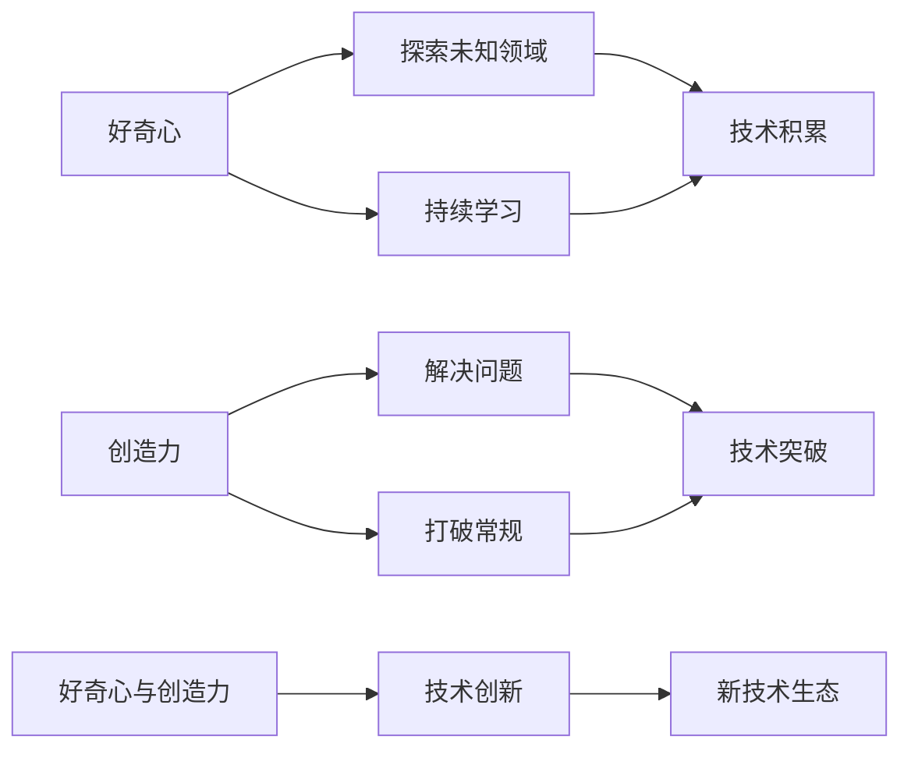

                 

# 好奇心与创造力：创新的双翼

## 1. 背景介绍

### 1.1 问题由来

现代信息技术正在迅速改变我们的生活方式和社会结构，而这种改变的核心驱动力之一便是创新。无论是科技创新还是技术革新，其背后都离不开好奇心与创造力的推动。然而，在追求技术进步的同时，我们也面临着日益严峻的技术瓶颈与创新障碍。如何在数字化时代中保持好奇心与创造力，成为每一位技术从业者必须直面的问题。

### 1.2 问题核心关键点

好奇心与创造力在技术创新中的作用主要体现在以下几个方面：

1. **探索未知领域**：好奇心驱动我们深入探索未知的技术领域，寻找潜在的创新机会。
2. **解决问题**：创造力使我们能够以创新性思维解决复杂问题，突破现有技术瓶颈。
3. **驱动技术迭代**：好奇心与创造力共同作用，推动技术不断迭代升级，实现从0到1的突破。
4. **构建新生态**：创新思维促进新兴技术和市场的出现，构建全新的技术生态系统。

本文旨在深入探讨好奇心与创造力在技术创新中的作用，通过分析其核心原理、操作步骤及应用领域，为技术从业者提供实践指导，以期激发更多创新灵感。

## 2. 核心概念与联系

### 2.1 核心概念概述

好奇心（Curiosity）与创造力（Creativity）是创新的双翼，共同驱动着技术的进步。好奇心促使我们不断探索未知领域，而创造力则使我们能够以创新性思维解决复杂问题。

**好奇心**：是对新奇事物持续探索的渴望，驱动技术从业者不断追求知识和技术的边界。

**创造力**：是能够产生新颖、有价值想法的能力，使我们在解决技术难题时能够打破常规，寻找新的解决方案。

这两个概念之间的联系紧密而互补，共同构成了技术创新的核心动力。通过不断激发好奇心与创造力，技术从业者可以不断突破技术瓶颈，构建新的技术生态。

### 2.2 核心概念原理和架构的 Mermaid 流程图(Mermaid 流程节点中不要有括号、逗号等特殊字符)



这个流程图展示了好奇心与创造力在技术创新中的作用机制：

1. 好奇心驱动我们不断探索未知领域，积累技术知识。
2. 创造力使我们能够以创新性思维解决问题，实现技术突破。
3. 好奇心与创造力的结合，推动技术的持续创新，构建新的技术生态系统。

## 3. 核心算法原理 & 具体操作步骤

### 3.1 算法原理概述

好奇心与创造力在技术创新中的作用可以从以下几个方面来理解：

1. **探索机制**：好奇心促使我们不断探索新的技术领域，积累相关知识。
2. **创新机制**：创造力使我们能够以创新性思维解决问题，实现技术突破。
3. **迭代机制**：好奇心与创造力的结合，推动技术的持续迭代，构建新的技术生态。

### 3.2 算法步骤详解

基于好奇心与创造力的技术创新一般包括以下几个关键步骤：

**Step 1: 激发好奇心**

- 设置探索目标：明确技术创新的方向和目标，为好奇心提供明确的方向。
- 持续学习：通过阅读论文、参加会议、参与开源社区等方式，不断更新和扩展自己的知识体系。

**Step 2: 应用创造力**

- 问题定义：明确需要解决的问题，界定问题的边界和目标。
- 创新思路：结合已有知识，提出新的解决方案或技术路径。
- 实验验证：通过实验验证新方案的可行性和效果。

**Step 3: 迭代优化**

- 反馈机制：通过不断的实验和反馈，不断优化和完善解决方案。
- 持续创新：在原有基础上不断提出新的创新点，推动技术的迭代升级。

### 3.3 算法优缺点

基于好奇心与创造力的技术创新方法具有以下优点：

1. **灵活性高**：好奇心与创造力使技术从业者能够灵活应对各种技术难题，提出创新的解决方案。
2. **创新性强**：结合好奇心与创造力，技术从业者能够打破常规，实现技术突破。
3. **适应性强**：好奇心与创造力驱动的技术创新能够适应技术生态的变化，保持竞争力。

同时，该方法也存在一定的局限性：

1. **时间成本高**：持续的好奇心与创造力探索，需要大量的时间和精力投入。
2. **不确定性大**：创新过程往往伴随着高风险，失败的概率较高。
3. **资源需求大**：创新的过程中需要大量的人力、物力和财力支持。

尽管存在这些局限性，但好奇心与创造力在技术创新中的重要性不言而喻，其驱动的创新过程仍是不可或缺的。

### 3.4 算法应用领域

好奇心与创造力在技术创新的多个领域都有广泛应用：

1. **人工智能**：在深度学习、自然语言处理、计算机视觉等方向，好奇心驱动研究人员不断探索新算法，创造力使他们能够提出新的架构和模型。
2. **大数据**：在数据挖掘、数据分析、数据可视化等方向，好奇心与创造力促使技术从业者不断探索新的数据处理和分析方法，实现技术突破。
3. **区块链**：在共识算法、智能合约、跨链通信等方向，好奇心与创造力推动技术从业者探索新的解决方案，提升区块链系统的安全性和效率。
4. **物联网**：在边缘计算、设备互联、数据安全等方向，好奇心与创造力使技术从业者不断探索新的技术路径，实现智能设备的互联互通。

## 4. 数学模型和公式 & 详细讲解 & 举例说明

### 4.1 数学模型构建

好奇心与创造力在技术创新中的作用，可以通过数学模型来刻画。以下是一个简单的模型：

设技术创新的目标为 $T$，技术积累为 $K$，创造力为 $C$，则技术创新的过程可以表示为：

$$ T = f(K, C) $$

其中 $f$ 是一个复杂函数，表示在特定条件下，技术积累和创造力对技术创新的贡献。

### 4.2 公式推导过程

为了更好地理解上述模型，我们可以进一步推导出其数学表达形式：

假设 $K$ 和 $C$ 之间存在线性关系，即：

$$ K = aC + b $$

代入 $T$ 的表达式中，得：

$$ T = f(aC + b, C) $$

进一步假设 $f$ 为二次函数，即：

$$ T = c(aC + b)^2 + dC + e $$

将 $K$ 和 $C$ 的关系代入，得：

$$ T = c(aC + b)^2 + d(aC + b) + e $$

这是一个关于 $C$ 的三次多项式函数，表示技术积累和创造力对技术创新的非线性贡献。

### 4.3 案例分析与讲解

假设某技术团队在人工智能领域进行创新，初始时技术积累为 $K_0$，创造力为 $C_0$，目标为 $T_0$。通过不断探索新知识，积累技术 $K_1$，并提出创新思路 $C_1$，最终实现技术突破 $T_1$。

根据上述模型，我们可以计算出创新过程对技术突破的贡献：

$$ T_1 = f(K_1, C_1) $$

$$ T_1 = f(aC_1 + b, C_1) $$

$$ T_1 = c(aC_1 + b)^2 + d(aC_1 + b) + e $$

通过对比 $T_1$ 和 $T_0$，可以看出好奇心与创造力对技术创新的显著贡献。

## 5. 项目实践：代码实例和详细解释说明

### 5.1 开发环境搭建

在进行好奇心与创造力驱动的技术创新实践前，我们需要准备好开发环境。以下是使用Python进行数据分析和机器学习的开发环境配置流程：

1. 安装Anaconda：从官网下载并安装Anaconda，用于创建独立的Python环境。

2. 创建并激活虚拟环境：
```bash
conda create -n my_env python=3.8
conda activate my_env
```

3. 安装必要的Python库：
```bash
pip install pandas numpy matplotlib scikit-learn seaborn jupyter notebook
```

4. 安装相关的Python库：
```bash
pip install tensorflow pytorch transformers openai-gym
```

完成上述步骤后，即可在`my_env`环境中开始数据探索和模型训练。

### 5.2 源代码详细实现

接下来，我们通过一个简单的项目实践，展示如何使用Python进行基于好奇心与创造力的数据分析和机器学习模型训练。

假设我们有一个包含历史数据的数据集，需要进行分类预测。我们可以使用以下代码：

```python
import pandas as pd
import numpy as np
from sklearn.model_selection import train_test_split
from sklearn.ensemble import RandomForestClassifier
from sklearn.metrics import accuracy_score

# 读取数据集
data = pd.read_csv('data.csv')

# 数据预处理
X = data.drop('label', axis=1)
y = data['label']

# 数据分割
X_train, X_test, y_train, y_test = train_test_split(X, y, test_size=0.2, random_state=42)

# 模型训练
model = RandomForestClassifier()
model.fit(X_train, y_train)

# 模型评估
y_pred = model.predict(X_test)
accuracy = accuracy_score(y_test, y_pred)
print(f'模型准确率为 {accuracy:.2f}')
```

### 5.3 代码解读与分析

让我们再详细解读一下关键代码的实现细节：

**数据处理**：
- `pd.read_csv()`函数：用于读取CSV格式的数据文件。
- `drop()`函数：用于删除数据集中的标签列，作为特征矩阵。

**模型训练**：
- `train_test_split()`函数：用于将数据集划分为训练集和测试集。
- `RandomForestClassifier()`函数：用于创建随机森林分类器。
- `fit()`函数：用于在训练集上训练模型。

**模型评估**：
- `predict()`函数：用于在测试集上对新数据进行预测。
- `accuracy_score()`函数：用于计算预测准确率。

通过上述代码，我们可以完成一个简单的数据分析和模型训练过程，进一步探索技术创新的方向。

## 6. 实际应用场景

### 6.1 智慧城市

在智慧城市建设中，好奇心与创造力驱动的技术创新，可以推动城市治理和管理模式的革新。

例如，通过数据分析和机器学习，城市管理部门可以实时监控交通流量、环境质量、公共安全等信息，利用好奇心与创造力提出新的解决方案，如智能交通管理、智能监控系统等。这些技术创新不仅提升了城市管理的效率和精度，还为居民提供了更好的生活体验。

### 6.2 医疗健康

在医疗健康领域，好奇心与创造力驱动的技术创新，可以推动疾病的预防、诊断和治疗方式的革新。

例如，通过生物信息学和机器学习，研究人员可以探索新的基因检测技术，提出新的疾病诊断模型。这些技术创新不仅提高了诊断的准确性，还为个性化医疗提供了新的方向。

### 6.3 金融科技

在金融科技领域，好奇心与创造力驱动的技术创新，可以推动金融服务的创新和变革。

例如，通过区块链技术和智能合约，金融科技公司可以提出新的支付系统、资产管理平台等解决方案。这些技术创新不仅提高了金融服务的效率和安全性，还为金融市场带来了新的发展机遇。

## 7. 工具和资源推荐

### 7.1 学习资源推荐

为了帮助开发者系统掌握好奇心与创造力在技术创新中的作用，这里推荐一些优质的学习资源：

1. **《好奇心与创造力》系列文章**：作者深入探讨了好奇心与创造力在技术创新中的作用机制，并提供了大量实践案例。
2. **TED Talks**：TED演讲提供了大量关于好奇心与创造力的演讲视频，涵盖了不同领域的创新实践。
3. **Coursera课程**：Coursera提供了多门关于创新思维和创造力的课程，涵盖了从心理学到技术的多个方面。
4. **Github项目**：Github上包含大量创新项目的代码和文档，可以学习和借鉴。
5. **书籍推荐**：《The War of Art》、《Steal Like an Artist》等书籍，从心理学角度探讨了创造力的源泉和培养方法。

通过这些资源的学习实践，相信你一定能够更好地理解好奇心与创造力在技术创新中的重要性，并在实际开发中灵活运用。

### 7.2 开发工具推荐

高效的工具支持是技术创新不可或缺的。以下是几款用于数据分析和机器学习的开发工具：

1. **Jupyter Notebook**：Python编程环境，支持代码编写和数据可视化，非常适合数据分析和机器学习实践。
2. **Google Colab**：Google提供的免费Jupyter Notebook环境，支持GPU加速，适合高性能计算任务。
3. **PyTorch**：由Facebook开发的深度学习框架，提供了丰富的机器学习库和工具。
4. **TensorFlow**：由Google开发的深度学习框架，支持多种编程语言和平台。
5. **Scikit-learn**：Python的机器学习库，提供了大量的机器学习算法和工具。

合理利用这些工具，可以显著提升技术创新的效率，加速创新过程。

### 7.3 相关论文推荐

好奇心与创造力在技术创新中的作用，源于学界的持续研究。以下是几篇奠基性的相关论文，推荐阅读：

1. **《好奇心与创新：新视角》**：探讨了好奇心在技术创新中的作用机制，并提出了多种激发好奇心的策略。
2. **《创造力与问题解决》**：从心理学角度分析了创造力的源泉和培养方法，提出了多种提升创造力的实践方法。
3. **《创新思维与技术变革》**：探讨了创新思维在技术变革中的作用，并提出了多种创新思维的培养方法。
4. **《好奇心与创造力的神经科学研究》**：从神经科学角度探讨了好奇心与创造力的机制，并提出了多种激发好奇心与创造力的科学方法。
5. **《创新生态与技术生态》**：探讨了创新生态与技术生态的关系，提出了多种构建创新生态的策略。

这些论文代表了大数据技术创新中的研究方向，帮助研究者理解好奇心与创造力的作用机制，并提供了实践指导。

## 8. 总结：未来发展趋势与挑战

### 8.1 总结

本文对好奇心与创造力在技术创新中的作用进行了全面系统的介绍。首先阐述了好奇心与创造力在技术创新中的重要性，明确了其在探索未知领域、解决问题、推动技术迭代中的独特价值。其次，从原理到实践，详细讲解了创新过程的各个环节，给出了创新实践的完整代码实例。同时，本文还广泛探讨了创新方法在智慧城市、医疗健康、金融科技等领域的实际应用，展示了创新技术的巨大潜力。

通过本文的系统梳理，可以看到，好奇心与创造力在技术创新中的重要作用，激发了更多技术从业者探索未知、勇于创新的热情。未来，伴随好奇心与创造力的不断激发和创新方法的不断优化，相信技术创新将迎来新的高峰，为人类社会的发展带来更多突破和变革。

### 8.2 未来发展趋势

展望未来，好奇心与创造力驱动的技术创新将呈现以下几个发展趋势：

1. **数据驱动**：大数据和人工智能技术的广泛应用，使得数据驱动的创新成为主流，通过数据分析和机器学习，探索新的技术方向和解决方案。
2. **多学科融合**：不同学科之间的融合将带来更多创新的思路和方向，如心理学、神经科学、物理学等与技术的结合。
3. **开源文化**：开源社区和平台将为创新提供更多资源和平台，促进技术交流和协作，加速技术创新的步伐。
4. **伦理与安全**：创新过程中需要更多考虑伦理和安全问题，确保技术创新的积极影响。
5. **可持续发展**：技术创新需要更多考虑环境保护和可持续发展，实现技术与环境的和谐共生。

这些趋势凸显了技术创新的广阔前景，好奇心与创造力在其中的作用也将愈发重要。

### 8.3 面临的挑战

尽管好奇心与创造力驱动的技术创新已经取得了显著成就，但在迈向更加智能化、普适化应用的过程中，它仍面临着诸多挑战：

1. **资源限制**：创新的过程中需要大量的人力、物力和财力支持，如何有效利用这些资源，是一个重要的挑战。
2. **伦理问题**：技术创新需要更多考虑伦理和社会问题，避免负面影响。
3. **技术风险**：创新过程中可能面临高风险，如何规避技术风险，确保创新过程的安全性。
4. **市场接受度**：创新技术需要更多的市场认可和用户接受度，如何提升技术产品的市场竞争力。
5. **持续优化**：创新技术需要不断的优化和改进，如何持续提升技术性能和用户体验。

这些挑战需要通过多方面的努力来解决，确保技术创新的健康发展。

### 8.4 研究展望

面对好奇心与创造力驱动的技术创新所面临的挑战，未来的研究需要在以下几个方面寻求新的突破：

1. **激发好奇心的机制**：研究好奇心驱动技术创新的机制，提出更多激发好奇心的策略和方法。
2. **提升创造力的方法**：研究创造力提升的方法和技术，提出更多提升创造力的实践工具和平台。
3. **多学科融合创新**：研究多学科融合创新的方法，促进不同学科之间的知识共享和交叉。
4. **伦理和安全保障**：研究技术创新的伦理和安全保障机制，确保技术创新的积极影响。
5. **可持续发展创新**：研究可持续发展创新的方法和方向，确保技术创新的环境友好性。

这些研究方向将引领技术创新的未来发展，推动技术创新走向更加智能化、普适化。

## 9. 附录：常见问题与解答

**Q1：如何激发好奇心与创造力？**

A: 激发好奇心与创造力的方法多种多样，以下是一些建议：

1. **持续学习**：不断学习新的知识和技能，拓宽知识面。
2. **多学科交叉**：尝试不同领域的知识，进行跨学科学习。
3. **开放心态**：保持开放的心态，接受新事物和新观点。
4. **自我挑战**：挑战自己的舒适区，尝试解决复杂问题。
5. **团队合作**：与他人合作，共同探讨问题，激发创新思维。
6. **多样化体验**：参与不同的活动和体验，丰富生活经验。

**Q2：好奇心与创造力如何结合？**

A: 好奇心与创造力结合的方法包括以下几个方面：

1. **问题导向**：设定明确的问题目标，激发好奇心去探索解决方案。
2. **跨界思维**：将不同领域的知识和方法进行融合，形成新的创新思路。
3. **持续迭代**：在解决问题的过程中，不断反思和优化，推动持续创新。
4. **灵活应用**：在实践中灵活应用新知识和新技术，探索新的应用场景。

**Q3：技术创新中如何规避风险？**

A: 技术创新中规避风险的方法包括以下几个方面：

1. **风险评估**：在创新过程中进行风险评估，识别潜在风险和挑战。
2. **测试验证**：在实验阶段进行充分验证，确保方案的可行性和效果。
3. **迭代优化**：在实施过程中不断优化和改进，降低风险。
4. **团队协作**：与团队成员共同探讨和评估风险，制定应对策略。
5. **伦理审查**：在创新过程中进行伦理审查，确保技术创新的积极影响。

通过这些方法，可以更好地规避技术创新的风险，确保技术创新的健康发展。

---

作者：禅与计算机程序设计艺术 / Zen and the Art of Computer Programming

