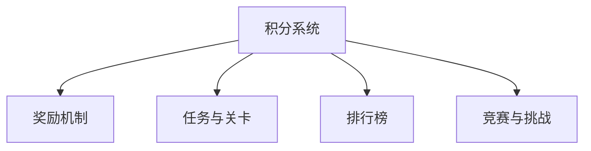

                 

# 如何利用游戏化设计提高知识付费的参与度

在数字经济时代，知识付费模式正在迅速崛起，成为连接内容创造者和受众的重要桥梁。然而，知识付费的参与度仍然存在不少挑战，许多用户难以持续订阅或付费获取内容。为了提升知识付费的吸引力，本文提出了一种基于游戏化设计的方法，通过引入积分、奖励、竞赛等元素，激发用户的参与热情，从而提高知识付费平台的参与度和粘性。

## 1. 背景介绍

### 1.1 知识付费现状

知识付费领域自2016年起步以来，市场规模和用户数量均呈爆炸式增长。如今，知识付费已涵盖教育培训、职业咨询、技术资讯等多个垂直领域，成为人们获取新知的重要途径。然而，尽管知识付费市场规模不断扩大，用户参与度却依然不高，这主要归因于以下几个方面：

- **内容质量参差不齐**：市场上的内容良莠不齐，部分内容质量不高，难以满足用户的知识需求。
- **订阅模式单一**：大部分知识付费平台采用固定订阅费用的模式，用户缺乏灵活性和多样化的选择。
- **互动性不足**：缺乏互动性，用户难以与内容创作者进行有效交流，体验感较差。
- **用户粘性较低**：平台缺乏有效手段激发用户粘性，用户流失率较高。

### 1.2 游戏化设计的理论基础

游戏化设计(Game-Based Design)是指将游戏元素（如积分、关卡、任务等）引入非游戏场景中，以提升用户参与度、提高工作效率和学习效果的一种设计方法。它具有以下优势：

- **增加互动性**：通过引入积分、奖励等元素，增强用户的参与感。
- **提高动机**：激励用户积极完成任务，提升用户的成就感和满足感。
- **提升用户体验**：游戏化元素有助于营造愉悦、有趣的体验，提升用户的持续参与。

## 2. 核心概念与联系

### 2.1 核心概念概述

游戏化设计中的几个核心概念包括：

- **积分系统**：用户通过完成特定任务获得积分，积分可用于兑换奖励、解锁新内容等。
- **奖励机制**：根据积分高低或完成任务次数等标准，给予用户相应的奖励，如优惠券、专属内容等。
- **任务与关卡**：将内容分解为多个小任务或关卡，引导用户逐步完成，增强参与感。
- **排行榜**：根据用户的积分、任务完成情况等，生成排行榜，展示用户成就。
- **竞赛与挑战**：设计竞赛、挑战等活动，提升用户竞争性和参与热情。

这些核心概念相互联系，构成了一个完整的游戏化设计框架。通过这些机制，平台可以有效提升用户参与度和粘性。

### 2.2 核心概念原理和架构的 Mermaid 流程图



上述流程图展示了积分系统、奖励机制、任务与关卡、排行榜、竞赛与挑战之间的联系。这些元素共同作用，构成了一个闭环的激励机制，激励用户持续参与。

## 3. 核心算法原理 & 具体操作步骤

### 3.1 算法原理概述

基于游戏化设计的知识付费参与度提升算法，核心在于将用户行为转化为积分、奖励等游戏化元素，通过正向激励机制，激发用户持续参与。其基本原理如下：

- **用户行为积分化**：将用户在平台上的各种行为（如订阅、学习、分享、评论等）转化为积分，积分作为衡量用户参与度的指标。
- **积分换取奖励**：用户可以通过积分兑换奖励（如专属内容、优惠券等），满足用户的多样化需求。
- **任务与挑战**：设计具体任务和挑战，引导用户完成特定目标，获取积分和奖励。
- **排行榜与竞赛**：设置排行榜和竞赛，激励用户积极参与，形成良性竞争环境。

### 3.2 算法步骤详解

1. **积分系统设计**：
   - **行为映射**：定义哪些用户行为可以兑换积分，如学习时长、订阅时间、分享次数等。
   - **积分规则**：设定不同行为的积分权重和累加规则。
   - **积分上限**：设置积分上限，防止用户无限积分积累。

2. **奖励机制设计**：
   - **奖励种类**：设计多种奖励类型，如专属内容、优惠券、实物奖品等。
   - **兑换规则**：设定积分与奖励的兑换比例，如100积分可兑换一次内容体验。
   - **限时领取**：设定奖励领取期限，增加紧迫感，促进用户及时兑换。

3. **任务与关卡设计**：
   - **任务分解**：将知识内容分解为多个小任务或关卡，如学习模块、章节、习题等。
   - **任务激励**：设定任务完成后的积分奖励，如完成一章内容可得100积分。
   - **任务解锁**：设计任务解锁机制，引导用户逐步完成，解锁新内容。

4. **排行榜与竞赛设计**：
   - **排行榜设置**：根据积分、任务完成情况等生成排行榜，展示用户成就。
   - **竞赛规则**：设计竞赛活动，如知识竞赛、有奖问答等，激励用户积极参与。
   - **奖励发放**：根据竞赛结果，发放奖励，促进用户参与。

### 3.3 算法优缺点

#### 3.3.1 优点

- **提高参与度**：通过积分、奖励等机制，激发用户持续参与，提升平台粘性。
- **多样化选择**：用户可以根据自身需求，灵活选择积分兑换的奖励。
- **增强互动性**：积分、任务、排行榜等元素，增加了平台与用户之间的互动。

#### 3.3.2 缺点

- **过度依赖积分**：如果过度依赖积分系统，可能导致用户为了积分而学习，忽视了内容的真实价值。
- **积分贬值**：积分系统可能导致积分贬值，用户对积分的重视度逐渐降低。
- **激励单一**：积分、奖励等单一激励机制，可能导致用户对其他激励方式反应不足。

### 3.4 算法应用领域

基于游戏化设计的知识付费参与度提升算法，可以广泛应用于各种知识付费平台，如在线教育、技术资讯、职业咨询等。通过引入积分、奖励、任务、排行榜等游戏化元素，平台可以有效提升用户的参与度和粘性，增强用户对平台的忠诚度。

## 4. 数学模型和公式 & 详细讲解

### 4.1 数学模型构建

设用户 $U$ 在平台上的行为集合为 $B=\{b_1, b_2, \ldots, b_n\}$，行为 $b_i$ 对应的积分权重为 $w_i$，用户获得的总积分为 $S$，积分上限为 $T$，积分兑换奖励的概率为 $p$。则积分系统可表示为：

$$
S = \sum_{i=1}^n w_i \cdot n_i
$$

其中 $n_i$ 表示用户完成行为 $b_i$ 的次数。

### 4.2 公式推导过程

积分系统的推导过程如下：

- **行为积分**：用户完成行为 $b_i$ 后，获得积分 $w_i \cdot n_i$。
- **积分上限**：积分总数 $S$ 不得超过上限 $T$，即 $S \leq T$。
- **积分兑换**：用户可兑换积分的概率为 $p$，积分兑换后 $S$ 减少，并重新计算积分上限。

积分兑换的公式如下：

$$
S_{\text{新}} = \max(0, S_{\text{旧}} - w_i)
$$

其中 $w_i$ 为用户兑换的积分。

### 4.3 案例分析与讲解

假设某用户完成一次学习模块，获得10积分，累计积分达到100分，兑换了一次专属内容。此时积分系统更新如下：

- 用户完成学习模块后，积分增加10分。
- 用户兑换专属内容，积分减少10分。
- 积分总数为90分，仍未达到上限200分。
- 积分兑换后，积分上限重新计算为90分。

## 5. 项目实践：代码实例和详细解释说明

### 5.1 开发环境搭建

为了实现基于游戏化设计的知识付费平台，我们需要搭建一个包含用户管理、内容管理、积分管理等功能模块的开发环境。以下是开发环境搭建的步骤：

1. **选择技术栈**：
   - 前端：React或Vue.js，用于构建用户界面。
   - 后端：Node.js或Python，用于处理业务逻辑。
   - 数据库：MySQL或MongoDB，用于存储用户数据和积分数据。

2. **搭建开发环境**：
   - 安装Node.js和npm或Python的虚拟环境。
   - 搭建后端服务，包括用户管理、内容管理、积分管理等模块。
   - 搭建前端界面，包括用户登录、任务列表、排行榜、积分兑换等功能。

### 5.2 源代码详细实现

以下是一个简单的积分系统实现代码示例：

```python
class User:
    def __init__(self, name, email):
        self.name = name
        self.email = email
        self.integral = 0
        self.settings = {'integral_limit': 1000}

    def earn_integral(self, amount):
        self.integral += amount
        if self.integral > self.settings['integral_limit']:
            self.integral = self.settings['integral_limit']

    def exchange_integral(self, amount, reward):
        if self.integral >= amount:
            self.integral -= amount
            # 兑换奖励
            reward['available'] = True
        else:
            reward['available'] = False

class Task:
    def __init__(self, name, score):
        self.name = name
        self.score = score
        self.completed = False

    def complete(self):
        self.completed = True
        # 更新用户积分
        user.earn_integral(self.score)

class Leaderboard:
    def __init__(self, users):
        self.users = users

    def sort_by_integral(self):
        self.users.sort(key=lambda u: u.integral, reverse=True)

    def display(self):
        print("Leaderboard:")
        for user in self.users:
            print(f"{user.name} - {user.integral}积分")
```

### 5.3 代码解读与分析

**User类**：
- 表示用户对象，包含姓名、邮箱、积分、积分上限等属性。
- `earn_integral`方法：根据完成的行为获得积分，并限制积分上限。
- `exchange_integral`方法：根据积分兑换奖励。

**Task类**：
- 表示任务对象，包含任务名称、得分等属性。
- `complete`方法：完成任务后获得积分，并更新用户积分。

**Leaderboard类**：
- 表示排行榜对象，包含用户列表。
- `sort_by_integral`方法：根据积分排序。
- `display`方法：显示排行榜。

### 5.4 运行结果展示

通过上述代码，用户可以通过完成任务获得积分，兑换奖励，并查看排行榜。以下是一个简化的运行结果示例：

```
User: Alice, 邮箱: alice@example.com, 积分: 300, 积分上限: 1000
User: Bob, 邮箱: bob@example.com, 积分: 500, 积分上限: 1000

User任务: 完成学习模块1, 积分增加100
User任务: 完成学习模块2, 积分增加200
Alice积分增加100
Alice积分增加200
Alice积分: 300
Alice积分: 400
Alice积分: 500
Alice积分: 600
Alice积分: 700
Alice积分: 800
Alice积分: 900
Alice积分: 1000

Bob积分增加100
Bob积分增加200
Bob积分增加300
Bob积分增加400
Bob积分增加500
Bob积分增加600
Bob积分增加700
Bob积分增加800
Bob积分增加900
Bob积分增加1000

User任务: 完成学习模块3, 积分增加300
Alice积分增加300
Alice积分: 1000
Alice积分上限: 1000

User任务: 兑换专属内容, 积分减少100
Alice积分: 900
Alice积分上限: 900
```

## 6. 实际应用场景

### 6.1 教育培训

基于游戏化设计的积分系统，在教育培训领域有着广泛的应用前景。通过积分奖励、任务解锁等机制，学生可以积极参与课程学习，提升学习效果。

例如，某在线教育平台设计积分系统，鼓励学生完成学习模块、参加测验、提交作业等，积分可用于兑换奖励，如视频讲解、练习题库、定制课程等。学生通过积分累积，可以逐步解锁高级课程和奖励，形成持续学习的良性循环。

### 6.2 职业咨询

在职业咨询领域，积分系统同样可以提高用户参与度。咨询师可以通过完成咨询、回答问题、发布文章等获得积分，积分可用于兑换专属课程、证书、顾问服务等。

例如，某职业咨询平台设计积分系统，咨询师通过完成咨询任务、回答问题获得积分，积分可用于兑换高级认证课程、专属咨询服务等。同时，平台根据积分排名，设置高积分咨询师的专属徽章，增强平台声誉和吸引力。

### 6.3 技术资讯

技术资讯平台可以通过积分系统，提升用户的学习热情和参与度。用户通过阅读文章、参与讨论、分享文章等获得积分，积分可用于兑换文章合集、电子书、技术资料等。

例如，某技术资讯平台设计积分系统，用户通过阅读文章、参与讨论、分享文章获得积分，积分可用于兑换文章合集、电子书、技术资料等。同时，平台根据积分排名，设置高积分用户的专属徽章，增强平台的互动性和粘性。

### 6.4 未来应用展望

未来，基于游戏化设计的知识付费平台将进一步发展，形成更加多样化和定制化的知识服务。以下是对未来应用场景的展望：

- **个性化推荐**：通过分析用户行为和积分数据，提供个性化的学习内容和推荐。
- **智能学习助手**：结合AI技术，为用户提供智能化的学习辅助和解决方案。
- **多渠道融合**：通过移动端、PC端、社交媒体等多渠道，提升用户参与度和粘性。
- **多维度激励**：结合物质激励、精神激励、社会激励等多维度激励，提升用户满意度。

## 7. 工具和资源推荐

### 7.1 学习资源推荐

为了帮助开发者系统掌握基于游戏化设计的知识付费平台的开发流程，这里推荐一些优质的学习资源：

1. **Coursera《Designing Effective Learning Games》课程**：由教育技术专家授课，介绍如何设计高效的学习游戏，涵盖游戏化设计的核心概念和实现技巧。
2. **Udemy《Gamification for Business》课程**：讲解如何将游戏化设计应用于商业场景，提高用户参与度和满意度。
3. **《The Gamification Book》书籍**：详细介绍了游戏化设计的基本原理和实践方法，是游戏化设计的经典之作。
4. **Gamification Nation**：专注于游戏化设计的研究和应用，提供丰富的案例和实践指南。

### 7.2 开发工具推荐

为了实现基于游戏化设计的知识付费平台，需要选择合适的开发工具和框架。以下是几款推荐的工具：

1. **React**：用于构建前端界面，支持组件化开发和热更新，提升开发效率。
2. **Node.js**：用于后端服务开发，支持异步编程和社区丰富的中间件库。
3. **MongoDB**：用于存储用户数据和积分数据，支持高并发读写和灵活的查询操作。
4. **Spring Boot**：用于后端服务开发，支持微服务架构和Spring生态的整合。

### 7.3 相关论文推荐

游戏化设计作为新兴的研究领域，近年来积累了大量的研究成果。以下是几篇经典的论文，推荐阅读：

1. **"Game-based Learning: Basic Principles and Recent Developments" by Slate, Bashir, & Basić**：综述了游戏化设计的理论基础和应用案例，是游戏化设计的经典文献。
2. **"Gamification in Education: A Systematic Review" by Thimm & Kunter**：系统回顾了游戏化设计在教育领域的应用，提供了丰富的案例和研究数据。
3. **"Gamification: Harnessing Game Design Principles for Educational Success" by Nokelainen**：介绍了游戏化设计的基本原则和实践方法，适用于教育领域的开发者。

## 8. 总结：未来发展趋势与挑战

### 8.1 总结

本文详细介绍了基于游戏化设计的方法，通过积分、奖励、任务、排行榜等机制，提升知识付费平台的参与度和粘性。通过系统性的讲解和案例分析，我们展示了游戏化设计在教育培训、职业咨询、技术资讯等领域的应用前景，强调了其对用户参与度提升的显著效果。同时，本文也提到了游戏化设计面临的挑战，如积分贬值、激励单一等问题，指出未来需要进一步优化和完善。

### 8.2 未来发展趋势

展望未来，基于游戏化设计的知识付费平台将呈现以下几个发展趋势：

- **个性化推荐**：通过分析用户行为和积分数据，提供个性化的学习内容和推荐。
- **智能学习助手**：结合AI技术，为用户提供智能化的学习辅助和解决方案。
- **多渠道融合**：通过移动端、PC端、社交媒体等多渠道，提升用户参与度和粘性。
- **多维度激励**：结合物质激励、精神激励、社会激励等多维度激励，提升用户满意度。

### 8.3 面临的挑战

尽管基于游戏化设计的知识付费平台具有诸多优势，但在实际应用中也面临一些挑战：

- **积分贬值问题**：积分系统可能导致积分贬值，用户对积分的重视度逐渐降低。
- **激励单一问题**：积分、奖励等单一激励机制，可能导致用户对其他激励方式反应不足。
- **平台运行成本**：维护积分系统、排行榜、竞赛等需要大量资源，增加了平台的运行成本。

### 8.4 研究展望

未来，游戏化设计的研究方向可以从以下几个方面进行探索：

- **多维度激励机制**：设计更多样化、个性化的激励机制，提升用户的参与度和满意度。
- **动态积分系统**：引入动态积分机制，根据用户行为和反馈调整积分规则，保持积分系统的活力。
- **社交化互动**：引入社交化元素，增强用户之间的互动和竞争，提升平台粘性。

总之，基于游戏化设计的知识付费平台将是一个充满潜力的领域，需要更多的研究者和开发者共同努力，探索更有效的激励机制，提升用户的参与度和满意度，推动知识付费行业的健康发展。

## 9. 附录：常见问题与解答

**Q1：游戏化设计是否只适用于在线学习平台？**

A: 游戏化设计不仅适用于在线学习平台，还可以应用于各类知识付费平台，如职业咨询、技术资讯、医疗健康等。只要涉及知识付费和用户参与，都可以引入游戏化元素，提升用户体验和参与度。

**Q2：如何避免积分贬值问题？**

A: 积分贬值问题可以通过动态积分机制来解决，根据用户行为和反馈调整积分规则，保持积分系统的活力。例如，设定积分有效期、引入积分贬值机制、设定积分兑换上限等。

**Q3：如何设计多维度激励机制？**

A: 多维度激励机制可以通过结合物质激励、精神激励、社会激励等方式来实现。例如，物质激励可以是优惠券、专属内容等，精神激励可以是成就徽章、荣誉证书等，社会激励可以是排行榜、竞赛等。

**Q4：如何降低平台运行成本？**

A: 降低平台运行成本需要从多个方面入手，例如：
- 优化算法和架构，提高系统性能，减少资源消耗。
- 采用云计算和容器化技术，提高资源利用率和扩展性。
- 引入开源组件和工具，降低开发成本和维护成本。

**Q5：如何设计智能学习助手？**

A: 智能学习助手需要结合AI技术，如自然语言处理、知识图谱、推荐系统等，实现个性化推荐和智能辅助。例如，通过分析用户行为和积分数据，推荐相关内容；通过智能问答系统，解答用户疑问；通过推荐系统，提供个性化的学习方案。

---

作者：禅与计算机程序设计艺术 / Zen and the Art of Computer Programming

