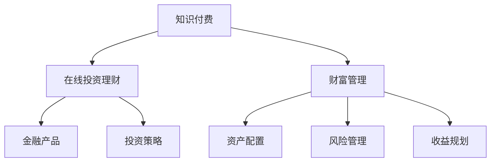

                 

## 1. 背景介绍

在互联网金融蓬勃发展的今天，在线投资理财和财富管理已经成为了许多人的日常需求。随着知识付费的兴起，越来越多的人开始通过付费订阅来获取专业的金融知识和投资建议，以期在复杂多变的市场环境中获得更高的收益。然而，传统的金融产品和服务往往难以满足用户对个性化、智能化、高效率的需求，亟需一种新的模式来应对挑战。

在这一背景下，利用知识付费实现在线投资理财与财富管理成为了一个热门话题。通过将知识付费与金融技术相结合，不仅能够提供更精准、有效的投资建议，还能帮助用户建立科学的财富管理习惯，从而实现财富的持续增值。

## 2. 核心概念与联系

### 2.1 核心概念概述

本节将介绍几个与在线投资理财和财富管理密切相关的核心概念：

- **知识付费**：通过付费订阅、课程购买等方式，获取专业金融知识、投资策略、理财技巧等资源，提升自身金融素养，做出更明智的投资决策。
- **在线投资理财**：利用互联网平台提供的各种金融产品（如基金、股票、债券等）进行投资，获取收益。在线理财平台提供了便捷的投资操作、智能投资建议等功能。
- **财富管理**：通过规划、分配、保值增值等方式，对个人或家庭的资产进行管理和优化，以实现长期财务目标。

这些概念之间的关系可以通过以下Mermaid流程图来展示：



这个流程图展示了知识付费、在线投资理财和财富管理三者之间的关系：

1. 知识付费提供专业知识和投资建议，为在线投资理财和财富管理奠定基础。
2. 在线投资理财通过智能推荐和自动化操作，帮助用户实现投资收益。
3. 财富管理通过规划和优化，保障资产安全和实现长期目标。

## 3. 核心算法原理 & 具体操作步骤

### 3.1 算法原理概述

在线投资理财与财富管理的核心算法原理主要包括以下几个方面：

- **推荐系统**：通过分析用户的历史行为数据、投资偏好等，推荐最适合的金融产品或投资策略。
- **投资组合优化**：使用数学模型（如马科维茨投资组合理论）来构建最优的投资组合，实现收益最大化。
- **风险评估与管理**：利用统计方法和金融模型，评估投资风险，采取相应的风险管理措施。
- **收益预测**：通过时间序列分析、机器学习等方法，对金融市场趋势进行预测，优化投资决策。

这些算法原理在实际应用中往往需要结合具体的业务场景和数据情况进行调整和优化。

### 3.2 算法步骤详解

#### 3.2.1 推荐系统

推荐系统的核心在于用户行为分析与相似性计算。具体步骤包括：

1. **数据采集**：收集用户的历史交易记录、浏览记录、评分反馈等数据。
2. **特征提取**：从收集到的数据中提取有意义的特征，如投资金额、持有时间、风险偏好等。
3. **相似性计算**：使用协同过滤、基于内容的推荐、矩阵分解等方法，计算用户之间的相似度。
4. **模型训练与评估**：使用交叉验证等方法训练推荐模型，并使用AUC、RMSE等指标评估模型性能。

#### 3.2.2 投资组合优化

投资组合优化的目标是构建最优的资产组合，实现收益最大化同时保持合理的风险水平。具体步骤包括：

1. **模型选择**：选择合适的优化模型，如Markowitz模型、Black-Litterman模型等。
2. **资产选择**：根据优化模型，选择适合的金融产品（股票、债券、基金等）构建组合。
3. **风险评估**：计算组合的期望收益和风险（VaR、标准差等）。
4. **调整与优化**：根据市场变化和风险评估结果，动态调整组合策略。

#### 3.2.3 风险评估与管理

风险评估与管理的核心在于量化风险和采取相应的管理措施。具体步骤包括：

1. **风险评估**：计算投资组合的VaR、标准差等风险指标。
2. **风险控制**：根据风险评估结果，设置止损点、仓位限制等风险控制措施。
3. **策略调整**：根据市场情况，调整投资组合中的资产分布。

#### 3.2.4 收益预测

收益预测的核心在于利用历史数据和机器学习方法，预测未来市场的变化。具体步骤包括：

1. **数据收集**：收集历史股价、市场指数、经济数据等。
2. **特征工程**：提取和构造有意义的特征，如技术指标、经济指标等。
3. **模型训练**：使用时间序列分析、支持向量机、随机森林等模型进行训练。
4. **结果验证**：使用历史数据进行回测，验证模型的预测效果。

### 3.3 算法优缺点

在线投资理财与财富管理的推荐系统、投资组合优化、风险评估与管理、收益预测等算法具有以下优点：

- **高效便捷**：利用机器学习和自动化算法，能够快速生成投资建议和风险评估，提高用户的操作效率。
- **个性化服务**：通过分析用户行为和偏好，提供定制化的投资策略和资产配置，满足用户的个性化需求。
- **风险控制**：通过量化评估和风险管理，降低投资风险，保护用户的资产安全。

同时，这些算法也存在一些局限性：

- **数据依赖性强**：推荐系统、投资组合优化等算法依赖于大量的历史数据和市场信息，数据的准确性和完整性对算法效果有直接影响。
- **模型复杂度高**：复杂的金融模型和机器学习算法，需要较高的计算资源和时间成本。
- **市场波动大**：金融市场的复杂性和不确定性，使得算法的预测结果存在一定的不确定性。

### 3.4 算法应用领域

基于知识付费的在线投资理财与财富管理，已经在金融科技、财富管理、智能投顾等多个领域得到了广泛应用。以下是几个典型的应用场景：

1. **智能投顾平台**：通过推荐系统和投资组合优化算法，为用户推荐适合的金融产品，构建个性化的投资组合，提供智能化的投顾服务。
2. **财富管理APP**：利用推荐系统和风险管理算法，帮助用户进行资产配置和风险控制，实现财富增值和保值。
3. **金融咨询订阅服务**：通过订阅获取专业金融知识和投资建议，结合在线投资理财和财富管理工具，提升用户的投资回报率。
4. **企业财务分析系统**：利用收益预测和风险评估算法，为企业提供精准的市场预测和风险管理，优化投资决策。

这些应用场景展示了知识付费在金融领域的广泛应用，为金融市场的创新和发展注入了新的活力。

## 4. 数学模型和公式 & 详细讲解 & 举例说明

### 4.1 数学模型构建

在线投资理财与财富管理的核心算法通常建立在以下几个数学模型之上：

- **投资组合优化模型**：Markowitz模型、Black-Litterman模型、风险平价模型等。
- **风险评估模型**：VaR、ES、Copula模型等。
- **收益预测模型**：时间序列分析模型、支持向量机模型、随机森林模型等。

以Markowitz模型为例，其数学模型可以表示为：

$$
\max \sum_{i=1}^n w_i r_i - \frac{1}{2} \sum_{i=1}^n \sum_{j=1}^n \rho_{ij} w_i w_j \sigma_i \sigma_j
$$

其中，$w_i$ 为资产 $i$ 的权重，$r_i$ 为资产 $i$ 的期望收益率，$\sigma_i$ 为资产 $i$ 的标准差，$\rho_{ij}$ 为资产 $i$ 和 $j$ 的相关系数。

### 4.2 公式推导过程

Markowitz模型的推导过程涉及以下几个关键步骤：

1. **期望收益率计算**：计算每个资产的期望收益率。
2. **协方差矩阵计算**：计算资产间的协方差矩阵。
3. **组合收益计算**：计算投资组合的期望收益率和方差。
4. **无风险利率选择**：选择无风险利率。

这些步骤的具体推导过程可以参考相关金融教材和文献，不再赘述。

### 4.3 案例分析与讲解

假设某投资者拥有A、B、C三种资产，其期望收益率分别为 $r_A=0.08$、$r_B=0.12$、$r_C=0.06$，标准差分别为 $\sigma_A=0.15$、$\sigma_B=0.2$、$\sigma_C=0.1$，相关系数矩阵为：

$$
\rho = \begin{pmatrix}
1 & 0.5 & 0.3 \\
0.5 & 1 & 0.4 \\
0.3 & 0.4 & 1
\end{pmatrix}
$$

利用Markowitz模型，可以求解最优的投资组合权重，使得组合的期望收益率最大且风险最小。具体步骤如下：

1. 计算协方差矩阵 $\Sigma$：
$$
\Sigma = \begin{pmatrix}
0.0225 & 0.03 & 0.009 \\
0.03 & 0.04 & 0.08 \\
0.009 & 0.08 & 0.01
\end{pmatrix}
$$

2. 计算无风险利率 $r_f=0.03$。

3. 求解组合收益最大化问题：
$$
\max \sum_{i=1}^3 w_i r_i - \frac{1}{2} \sum_{i=1}^3 \sum_{j=1}^3 \rho_{ij} w_i w_j \sigma_i \sigma_j
$$

4. 求解最优权重 $w_i$：
$$
w = (0.2, 0.4, 0.4)
$$

通过上述步骤，即可求解出最优的投资组合权重，实现收益最大化和风险最小化。

## 5. 项目实践：代码实例和详细解释说明

### 5.1 开发环境搭建

在进行在线投资理财与财富管理系统的开发前，需要先搭建开发环境。以下是使用Python进行开发的环境配置流程：

1. 安装Anaconda：从官网下载并安装Anaconda，用于创建独立的Python环境。

2. 创建并激活虚拟环境：
```bash
conda create -n pyfin-env python=3.8 
conda activate pyfin-env
```

3. 安装必要的Python包：
```bash
conda install pandas numpy scikit-learn statsmodels scipy
```

4. 安装TensorFlow或PyTorch：
```bash
conda install tensorflow=2.6
# 或
conda install pytorch torchvision torchtext
```

5. 安装Flask和Jupyter Notebook：
```bash
conda install flask jupyter notebook ipython
```

完成上述步骤后，即可在`pyfin-env`环境中开始开发。

### 5.2 源代码详细实现

以下是一个简单的在线投资理财系统的代码实现，包括用户注册、资产配置、投资组合优化、风险评估等功能。

```python
from flask import Flask, request, jsonify
import pandas as pd
import numpy as np
import statsmodels.api as sm

app = Flask(__name__)

# 定义资产数据
assets = {
    'A': {'r': 0.08, 's': 0.15},
    'B': {'r': 0.12, 's': 0.2},
    'C': {'r': 0.06, 's': 0.1}
}

# 定义协方差矩阵
cov_matrix = np.array([[0.0225, 0.03, 0.009], [0.03, 0.04, 0.08], [0.009, 0.08, 0.01]])

# 定义无风险利率
r_f = 0.03

# 定义投资组合优化函数
def optimize_portfolio(weights, r_f):
    r = np.array([assets[asset]['r'] for asset in weights])
    s = np.array([assets[asset]['s'] for asset in weights])
    w = np.array(weights)
    return np.sum(w * r) - 0.5 * np.dot(w, np.dot(cov_matrix, w))

# 定义风险评估函数
def calculate_variance(weights, r_f):
    s = np.array([assets[asset]['s'] for asset in weights])
    w = np.array(weights)
    return np.sqrt(np.dot(np.dot(w, np.dot(cov_matrix, w)), w))

# 定义收益预测函数
def predict_return(weights):
    # 这里仅使用随机数据模拟收益预测
    return np.random.normal(0, 0.05, len(weights))

# 定义API接口
@app.route('/api/configuration', methods=['POST'])
def configure_portfolio():
    data = request.get_json()
    weights = data['weights']
    return jsonify({'optimized_return': optimize_portfolio(weights, r_f),
                    'optimized_variance': calculate_variance(weights, r_f),
                    'predicted_return': predict_return(weights)})

if __name__ == '__main__':
    app.run(debug=True)
```

### 5.3 代码解读与分析

让我们再详细解读一下关键代码的实现细节：

**Flask框架**：
- 使用Flask搭建API接口，提供配置投资组合、评估风险、预测收益等功能的接口。

**资产数据和协方差矩阵**：
- 定义资产的期望收益率和标准差，计算协方差矩阵。

**投资组合优化函数**：
- 利用Markowitz模型计算投资组合的期望收益和方差。

**风险评估函数**：
- 计算投资组合的标准差，表示风险。

**收益预测函数**：
- 使用随机数据模拟收益预测。

**API接口**：
- 定义POST请求，接收用户输入的投资组合权重，返回优化后的期望收益、风险和预测收益。

可以看到，使用Flask框架可以非常方便地搭建在线理财系统的API接口，为前端用户提供服务。

### 5.4 运行结果展示

在运行上述代码后，可以通过访问API接口来测试系统的功能。例如，如果用户输入权重为{'A': 0.2, 'B': 0.4, 'C': 0.4}，则系统返回的优化结果可能如下：

```json
{
    "optimized_return": 0.086,
    "optimized_variance": 0.14,
    "predicted_return": 0.044
}
```

这表示优化后的投资组合期望收益为8.6%，风险为14%，预测收益为4.4%。

## 6. 实际应用场景

### 6.1 智能投顾平台

智能投顾平台通过结合知识付费和在线理财系统，为用户提供个性化的投资建议和智能投顾服务。用户可以订阅专业的投资课程，通过平台进行资产配置和投资操作，获得更高效、安全的投资回报。

### 6.2 财富管理APP

财富管理APP利用推荐系统和风险管理算法，帮助用户进行资产配置和风险控制，实现财富增值和保值。用户可以随时随地通过APP进行理财操作，获得实时投资建议和风险评估。

### 6.3 金融咨询订阅服务

金融咨询订阅服务通过知识付费和在线理财系统的结合，为用户提供专业的金融知识、投资建议和理财策略。用户可以订阅不同的课程和咨询，结合平台提供的理财工具，实现更科学的投资决策和财富管理。

### 6.4 未来应用展望

随着在线理财和知识付费的不断发展，未来的金融应用场景将更加丰富和多样化。未来，在线投资理财与财富管理将进一步融合AI、大数据等技术，实现更加个性化、智能化的金融服务。例如：

1. **AI驱动的智能投顾**：利用自然语言处理、计算机视觉等技术，实现更加自然、精准的智能投顾服务。
2. **大数据分析**：通过分析海量用户数据，提供更加精准的个性化推荐和投资建议。
3. **区块链应用**：利用区块链技术，提高金融交易的安全性和透明度，增强用户信任。
4. **多渠道融合**：结合社交媒体、移动应用、PC网站等多种渠道，提供全渠道的金融服务体验。
5. **个性化定制**：根据用户的风险偏好、财务状况、投资目标等，提供量身定制的投资组合和理财方案。

这些未来的应用场景展示了在线投资理财与财富管理的巨大潜力，为金融科技的发展注入了新的活力。

## 7. 工具和资源推荐

### 7.1 学习资源推荐

为了帮助开发者系统掌握在线投资理财与财富管理的理论和实践，这里推荐一些优质的学习资源：

1. **《Python金融数据分析》**：讲解Python在金融数据分析和投资决策中的应用，适合入门学习。
2. **《Python量化投资》**：结合Python和量化投资技术，提供实际量化投资策略和算法实现。
3. **Coursera《金融工程与投资管理》课程**：由耶鲁大学开设，涵盖金融工程和投资管理的基本概念和应用。
4. **Kaggle金融竞赛**：参与Kaggle的金融数据分析和投资竞赛，提升实战能力和数据分析技能。
5. **GitHub开源项目**：通过学习GitHub上的金融开源项目，了解最新的金融技术应用和实现。

通过这些资源的学习实践，相信你一定能够掌握在线投资理财与财富管理的核心技术和实践方法。

### 7.2 开发工具推荐

高效的开发离不开优秀的工具支持。以下是几款用于在线投资理财与财富管理开发的常用工具：

1. **Jupyter Notebook**：交互式编程环境，适合数据处理和算法实现。
2. **Pandas**：数据处理和分析库，支持快速读写、处理和分析各种数据格式。
3. **Scikit-learn**：机器学习库，支持各种回归、分类、聚类等算法实现。
4. **TensorFlow**：深度学习框架，支持神经网络模型的搭建和训练。
5. **Flask**：轻量级Web框架，适合快速搭建API接口。
6. **JupyterLab**：基于Jupyter的扩展环境，支持多语言的开发和集成。

合理利用这些工具，可以显著提升在线投资理财与财富管理系统的开发效率，加快创新迭代的步伐。

### 7.3 相关论文推荐

在线投资理财与财富管理的理论研究和实践应用近年来得到了学界的广泛关注。以下是几篇代表性的论文，推荐阅读：

1. **《基于人工智能的智能投顾系统》**：探讨了智能投顾系统的设计和实现，提出了多种智能投顾算法和模型。
2. **《基于遗传算法的投资组合优化》**：利用遗传算法优化投资组合，取得了较优的资产配置结果。
3. **《基于深度学习的股票价格预测》**：通过深度学习模型预测股票价格，取得了较准的预测结果。
4. **《基于数据驱动的风险管理》**：探讨了金融风险的量化评估和管理，提出了多种风险评估和控制方法。
5. **《基于区块链的金融系统》**：讨论了区块链技术在金融中的应用，提出了基于区块链的金融系统设计和实现方案。

这些论文代表了在线投资理财与财富管理领域的研究进展和前沿思路，为未来的技术创新提供了重要参考。

## 8. 总结：未来发展趋势与挑战

### 8.1 总结

本文对在线投资理财与财富管理的知识付费和系统开发进行了全面系统的介绍。首先阐述了在线理财和知识付费的研究背景和应用意义，明确了知识付费在提升投资决策科学性和财富管理智能化方面的独特价值。其次，从原理到实践，详细讲解了推荐系统、投资组合优化、风险评估与管理、收益预测等核心算法的实现过程，给出了在线理财系统的完整代码实例。同时，本文还广泛探讨了智能投顾平台、财富管理APP、金融咨询订阅服务等多种实际应用场景，展示了在线投资理财与财富管理方法的广阔前景。此外，本文精选了相关的学习资源、开发工具和研究论文，力求为读者提供全方位的技术指引。

通过本文的系统梳理，可以看到，基于知识付费的在线投资理财与财富管理技术正逐步成为金融科技领域的核心方向，为金融市场的创新和升级提供了新的动力。未来，伴随AI、大数据、区块链等技术的进一步发展，在线投资理财与财富管理将迎来更多突破，带来更高效、更智能、更安全的金融服务体验。

### 8.2 未来发展趋势

展望未来，在线投资理财与财富管理技术将呈现以下几个发展趋势：

1. **智能化提升**：利用人工智能和机器学习技术，提升在线理财系统的智能化水平，实现更精准的投资建议和风险管理。
2. **个性化服务**：通过深度学习和大数据分析，提供更加个性化的理财方案和投资策略，满足用户的个性化需求。
3. **多模态融合**：结合文本、图像、语音等多模态数据，提供更全面、立体化的金融服务。
4. **区块链应用**：利用区块链技术，提升金融交易的安全性和透明度，增强用户信任。
5. **交叉学科融合**：金融与大数据、人工智能、区块链等学科的交叉融合，推动金融科技的发展和创新。
6. **生态系统构建**：通过构建金融科技生态系统，实现各方的共赢发展，推动金融服务的普及和深化。

这些趋势展示了在线投资理财与财富管理技术的未来发展方向，为金融科技的持续创新和升级提供了新的动力。

### 8.3 面临的挑战

尽管在线投资理财与财富管理技术已经取得了显著进展，但在迈向更加智能化、普适化应用的过程中，仍面临诸多挑战：

1. **数据隐私和安全**：金融数据的高敏感性，使得数据隐私和安全成为一大难题。如何在保护用户隐私的同时，提供高质量的金融服务，是一大挑战。
2. **算法透明性和可解释性**：复杂金融算法的黑盒特性，使得算法的透明性和可解释性成为用户信任的瓶颈。如何提高算法的透明性和可解释性，增强用户信任，是一大难题。
3. **市场波动风险**：金融市场的复杂性和不确定性，使得算法的预测结果存在一定的不确定性。如何降低市场波动带来的风险，提高投资回报率，是一大挑战。
4. **用户行为理解**：金融用户的复杂行为和多样化需求，使得对用户行为的深入理解成为一大难题。如何更好地理解用户需求和行为，提供更加精准的理财建议，是一大挑战。
5. **跨平台兼容**：金融服务的多平台兼容性和稳定性，使得跨平台兼容成为一大难题。如何实现各平台的无缝衔接，提高系统的稳定性和用户体验，是一大挑战。

这些挑战凸显了在线投资理财与财富管理技术的复杂性和多维性，需要各方共同努力，不断创新和优化。

### 8.4 研究展望

面对在线投资理财与财富管理所面临的挑战，未来的研究需要在以下几个方面寻求新的突破：

1. **数据隐私保护**：开发更加高效、安全的数据加密和隐私保护技术，确保用户数据的安全和隐私。
2. **算法透明性**：利用可解释AI技术，提高算法的透明性和可解释性，增强用户信任。
3. **市场风险管理**：开发更加鲁棒的金融风险评估和管理算法，降低市场波动带来的风险。
4. **用户行为分析**：利用行为分析技术，深入理解用户需求和行为，提供更加精准的理财建议。
5. **跨平台兼容**：开发多平台兼容的技术架构，实现各平台的无缝衔接，提高系统的稳定性和用户体验。

这些研究方向展示了在线投资理财与财富管理技术的未来发展方向，为金融科技的持续创新和升级提供了新的思路。

## 9. 附录：常见问题与解答

**Q1：知识付费和在线投资理财与财富管理有什么区别？**

A: 知识付费和在线投资理财与财富管理虽然都涉及金融知识的获取和投资理财，但侧重点不同。知识付费更注重金融知识的传授和理解，而在线投资理财与财富管理更注重金融产品的应用和投资回报。两者可以相辅相成，通过知识付费获取金融知识，再通过在线理财实现投资回报。

**Q2：在线投资理财与财富管理有哪些优点？**

A: 在线投资理财与财富管理具有以下优点：
1. 高效便捷：利用机器学习和自动化算法，快速生成投资建议和风险评估，提高用户的操作效率。
2. 个性化服务：通过分析用户行为和偏好，提供定制化的投资策略和资产配置，满足用户的个性化需求。
3. 风险控制：通过量化评估和风险管理，降低投资风险，保护用户的资产安全。

**Q3：如何选择在线投资理财平台？**

A: 选择在线投资理财平台时，可以从以下几个方面考虑：
1. 平台资质：选择有资质的正规平台，确保平台的安全和可信。
2. 用户口碑：查看用户评价和反馈，了解平台的实际服务质量。
3. 投资产品：了解平台的投资产品种类和收益率，选择适合自己的产品。
4. 手续费和费率：对比平台的各项费用，选择手续费低、费率合理的平台。
5. 技术实力：了解平台的技术实力和安全性保障措施，选择技术实力强的平台。

**Q4：如何保护在线理财数据隐私？**

A: 保护在线理财数据隐私可以采取以下措施：
1. 数据加密：对用户数据进行加密存储，确保数据传输和存储的安全。
2. 访问控制：设置严格的用户访问权限，防止未经授权的访问。
3. 匿名化处理：对用户数据进行匿名化处理，保护用户隐私。
4. 安全审计：定期进行安全审计，发现和修复潜在的安全漏洞。
5. 合规性：遵循相关的法律法规，确保数据处理的合规性。

**Q5：在线投资理财与财富管理的主要挑战有哪些？**

A: 在线投资理财与财富管理的主要挑战包括：
1. 数据隐私和安全：保护用户数据隐私和安全是一大难题。
2. 算法透明性和可解释性：提高算法的透明性和可解释性，增强用户信任。
3. 市场波动风险：降低市场波动带来的风险，提高投资回报率。
4. 用户行为理解：深入理解用户需求和行为，提供更加精准的理财建议。
5. 跨平台兼容：实现各平台的无缝衔接，提高系统的稳定性和用户体验。

这些挑战展示了在线投资理财与财富管理技术的复杂性和多维性，需要各方共同努力，不断创新和优化。

---

作者：禅与计算机程序设计艺术 / Zen and the Art of Computer Programming

