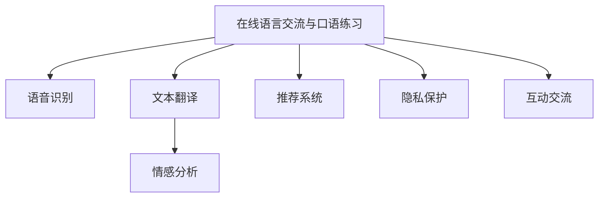

                 

## 1. 背景介绍

随着全球化进程的加速和国际交往的频繁，越来越多的中国学生和职业人士希望提升自己的外语水平，以便在国际场合中更好地沟通交流。然而，传统的线下外语学习方式存在诸多限制，如资源稀缺、学费高昂、时间和地点不灵活等，难以满足现代学习者的需求。知识付费的兴起为在线语言交流与口语练习提供了新的解决方案。

### 1.1 问题由来
在线语言交流与口语练习的实现，需要结合先进的语言技术和互动性强的应用场景。传统的外语学习平台和应用往往依赖于固定的课程内容，缺乏个性化的学习路径和互动性，难以满足不同学习者的需求。知识付费平台则提供了更加灵活、个性化的学习服务，结合语音识别、文本翻译、智能推荐等技术，为学习者提供了更加高效和互动的学习体验。

### 1.2 问题核心关键点
实现在线语言交流与口语练习的关键在于：

- 建立一个支持互动交流的学习平台，能够实时记录和回放语音和文本交流。
- 使用先进的语言处理技术，如语音识别、文本翻译、情感分析等，提升互动交流的准确性和丰富性。
- 利用推荐系统，根据学习者的水平和兴趣，智能推荐合适的交流伙伴和学习材料。
- 保障学习过程的安全性和隐私保护，避免不适宜内容的传播。

## 2. 核心概念与联系

### 2.1 核心概念概述

为更好地理解在线语言交流与口语练习的实现，本节将介绍几个密切相关的核心概念：

- **在线语言交流与口语练习**：通过知识付费平台，学习者可以与母语者进行实时互动交流，提升口语和听力能力。
- **语音识别**：将语音信号转化为文本信号的过程。用于记录和识别学习者与母语者之间的交流内容。
- **文本翻译**：将一种语言的文本转换为另一种语言的文本。用于理解交流内容的语言含义。
- **情感分析**：分析文本中的情感信息，提升交流的互动性和趣味性。
- **推荐系统**：根据学习者的行为和属性，智能推荐合适的交流伙伴和学习材料，提升学习效率。
- **隐私保护**：确保学习过程中的数据安全和隐私保护，避免不适宜内容的传播。

这些核心概念之间的逻辑关系可以通过以下Mermaid流程图来展示：



这个流程图展示了大语言模型的核心概念及其之间的关系：

1. 在线语言交流与口语练习是大语言模型的核心应用场景。
2. 语音识别、文本翻译、情感分析等技术为交流内容提供了理解和处理的途径。
3. 推荐系统辅助选择交流伙伴和学习材料，提升学习效果。
4. 隐私保护保障数据安全，确保交流环境的安全和健康。

## 3. 核心算法原理 & 具体操作步骤
### 3.1 算法原理概述

在线语言交流与口语练习的核心在于建立互动的交流场景，同时利用先进的语言处理技术提升交流质量。其核心思想是：

- **互动交流**：学习者与母语者进行实时或延迟的语音和文本交流，互相学习和纠正。
- **语音识别**：通过语音识别技术将语音转换为文本，方便后续的处理和分析。
- **文本翻译**：通过文本翻译技术理解交流内容，支持跨语言交流。
- **情感分析**：通过情感分析技术，识别交流中的情感信息，提升互动体验。
- **推荐系统**：通过推荐系统智能匹配交流伙伴和学习材料，个性化推荐提升学习效率。

基于上述原理，整个流程可以大致分为以下几个步骤：

1. 构建互动交流平台，提供语音和文本交流功能。
2. 集成语音识别和文本翻译技术，实现交流内容的理解和处理。
3. 集成情感分析技术，提升交流互动性。
4. 设计推荐系统，根据用户行为和属性智能推荐交流伙伴和学习材料。
5. 采用隐私保护技术，保障数据安全和隐私。

### 3.2 算法步骤详解

#### 3.2.1 交流平台的搭建
学习平台需要支持多种设备（如PC、手机、平板等），并提供实时互动的功能。平台可以使用Web技术（如React、Vue等）结合WebSocket协议实现实时交流。

- **前端**：开发用户界面，实现语音和文本输入、显示和回放。
- **后端**：处理用户请求，实现语音识别、文本翻译、情感分析等功能。

#### 3.2.2 语音识别集成
语音识别是实时交流的基础。可以使用现成的开源库，如Google Speech-to-Text、Kaldi等，或使用深度学习模型，如DeepSpeech。

- **前端**：使用Web Audio API或AudioContext实现音频的录制和播放。
- **后端**：将音频数据转换为文本，存储到数据库中。

#### 3.2.3 文本翻译集成
文本翻译用于理解交流内容，支持跨语言交流。可以使用现成的开源库，如Google Translate、Moses等，或使用深度学习模型，如Transformer-based translation model。

- **后端**：获取用户输入的文本，使用翻译模型转换为目标语言。
- **前端**：将翻译后的文本显示给用户，并记录到数据库中。

#### 3.2.4 情感分析集成
情感分析用于提升交流互动性，可以使用现成的情感分析库，如TextBlob、NLTK等，或使用深度学习模型，如BERT。

- **后端**：对用户输入的文本进行分析，提取情感信息。
- **前端**：根据情感分析结果，实时调整交流体验，如增加互动性、调整语调等。

#### 3.2.5 推荐系统设计
推荐系统用于智能匹配交流伙伴和学习材料，提升学习效果。可以使用协同过滤、基于内容的推荐、深度学习推荐模型等技术。

- **后端**：根据用户的行为和属性，推荐合适的交流伙伴和学习材料。
- **前端**：根据推荐结果，调整用户界面，引导用户进行互动和练习。

#### 3.2.6 隐私保护措施
隐私保护是平台安全性的保障。可以使用数据加密、匿名化处理、访问控制等技术。

- **数据加密**：对用户数据进行加密处理，防止数据泄露。
- **匿名化处理**：对用户数据进行去标识化处理，保护用户隐私。
- **访问控制**：采用身份认证和权限控制技术，防止非法访问。

### 3.3 算法优缺点

#### 3.3.1 优点
在线语言交流与口语练习具备以下优点：

- **灵活性**：学习者可以根据时间安排和学习需求，自主选择交流伙伴和学习内容。
- **互动性**：通过实时互动，学习者能够更快地提升口语和听力能力。
- **个性化**：推荐系统可以根据学习者的水平和兴趣，提供个性化的学习路径和内容。
- **高效性**：结合先进的语言处理技术，交流过程高效便捷，节省时间和成本。

#### 3.3.2 缺点
在线语言交流与口语练习也存在一些缺点：

- **技术门槛**：平台搭建和维护需要一定的技术实力和资源投入。
- **隐私风险**：平台需要处理大量的用户数据，存在数据泄露和隐私侵犯的风险。
- **语言多样性**：支持的语言种类有限，需要不断扩展和更新。
- **交互质量**：交流过程中可能存在语言差异、技术故障等问题，影响用户体验。

## 4. 数学模型和公式 & 详细讲解  
### 4.1 数学模型构建

在线语言交流与口语练习涉及多个领域的数学模型，以下将简要介绍其中几个关键模型：

- **语音识别模型**：将语音信号转换为文本信号的模型。常用的模型有声学模型、语言模型、解码器等。
- **文本翻译模型**：将一种语言的文本转换为另一种语言的文本的模型。常用的模型有基于规则的翻译模型、统计机器翻译模型、神经机器翻译模型等。
- **情感分析模型**：分析文本情感的模型。常用的模型有基于规则的情感分析模型、基于词典的情感分析模型、基于深度学习的情感分析模型等。
- **推荐系统模型**：根据用户行为和属性，推荐合适内容或合作伙伴的模型。常用的模型有协同过滤模型、基于内容的推荐模型、矩阵分解推荐模型、深度学习推荐模型等。

### 4.2 公式推导过程

#### 4.2.1 语音识别模型

语音识别模型主要包含声学模型和语言模型。声学模型用于将语音信号映射到文本序列，常用的声学模型有HMM（隐马尔可夫模型）、DNN（深度神经网络）、CNN（卷积神经网络）等。语言模型用于对文本序列进行概率建模，常用的语言模型有N-gram模型、RNN（循环神经网络）、LSTM（长短期记忆网络）、Transformer等。

#### 4.2.2 文本翻译模型

文本翻译模型主要包含编码器和解码器。编码器用于将源语言文本转换为隐向量表示，常用的编码器有RNN、LSTM、GRU等。解码器用于将隐向量转换为目标语言文本，常用的解码器有RNN、LSTM、GRU、Transformer等。

#### 4.2.3 情感分析模型

情感分析模型主要包含特征提取和分类器。特征提取用于提取文本中的情感特征，常用的特征提取方法有TF-IDF、词向量、情感词典等。分类器用于对情感进行分类，常用的分类器有SVM（支持向量机）、决策树、随机森林、神经网络等。

#### 4.2.4 推荐系统模型

推荐系统模型主要包含用户模型、物品模型和协同过滤算法。用户模型用于描述用户的兴趣和偏好，常用的用户模型有协同过滤、基于内容的推荐等。物品模型用于描述物品的属性和特征，常用的物品模型有协同过滤、基于内容的推荐等。协同过滤算法用于计算用户和物品之间的相似度，常用的协同过滤算法有基于用户的协同过滤、基于物品的协同过滤等。

### 4.3 案例分析与讲解

#### 4.3.1 语音识别模型

以RNN模型为例，其基本架构如图：


RNN模型由多个时间步组成，每个时间步包括输入层、隐藏层和输出层。输入层接收当前时间步的输入信号，隐藏层对当前时间步的输入信号进行编码，输出层将隐藏层的编码转换为输出信号。

#### 4.3.2 文本翻译模型

以Transformer模型为例，其基本架构如图：


Transformer模型主要由编码器和解码器组成。编码器用于将源语言文本转换为隐向量表示，解码器用于将隐向量转换为目标语言文本。编码器和解码器都由多个自注意力层和前馈神经网络组成。

#### 4.3.3 情感分析模型

以BERT模型为例，其基本架构如图：


BERT模型由多个Transformer层组成，每个Transformer层包括多头自注意力层、前馈神经网络层、残差连接和层归一化等。BERT模型在多个数据集上进行了预训练，能够有效地捕捉文本中的语义信息。

#### 4.3.4 推荐系统模型

以协同过滤模型为例，其基本架构如图：


协同过滤模型由用户模型、物品模型和协同过滤算法组成。用户模型用于描述用户的兴趣和偏好，物品模型用于描述物品的属性和特征，协同过滤算法用于计算用户和物品之间的相似度。协同过滤算法主要有基于用户的协同过滤和基于物品的协同过滤两种。

## 5. 项目实践：代码实例和详细解释说明
### 5.1 开发环境搭建

在进行在线语言交流与口语练习的开发前，需要准备好开发环境。以下是使用Python进行Web开发的环境配置流程：

1. 安装Python：从官网下载并安装Python，建议安装3.8及以上版本。
2. 安装Web框架：如Django、Flask等，使用pip安装，例如：
   ```bash
   pip install django
   ```
3. 安装语音识别和文本翻译库：如SpeechRecognition、Google Cloud Translation API等，使用pip安装，例如：
   ```bash
   pip install SpeechRecognition
   pip install google-cloud-translate
   ```
4. 安装情感分析库：如TextBlob、NLTK等，使用pip安装，例如：
   ```bash
   pip install textblob
   ```
5. 安装推荐系统库：如Surprise、LightFM等，使用pip安装，例如：
   ```bash
   pip install surprise
   pip install lightfm
   ```

完成上述步骤后，即可在Web开发环境中开始项目的搭建。

### 5.2 源代码详细实现

以下是一个简单的在线语言交流与口语练习平台的代码实现，使用Django框架：

```python
from django.views import View
from django.http import JsonResponse
from django.views.decorators.csrf import csrf_exempt
from speech_recognition import MicrophoneRecognition
from google.cloud import translate_v2 as translate
import textblob

class SpeechView(View):
    def __init__(self):
        self.mic = MicrophoneRecognition()

    @csrf_exempt
    def post(self, request):
        audio_data = request.FILES['audio']
        text = self.mic.recognize(audio_data.read())
        translation = self.translate(text)
        return JsonResponse({'speech': text, 'translation': translation})

    def translate(self, text):
        client = translate.Client()
        target = 'fr'  # 目标语言为法语
        result = client.translate(text, target_language=target)
        return result['translatedText']

class TextView(View):
    @csrf_exempt
    def post(self, request):
        text = request.POST.get('text')
        translation = self.translate(text)
        return JsonResponse({'text': text, 'translation': translation})

    def translate(self, text):
        client = translate.Client()
        target = 'fr'  # 目标语言为法语
        result = client.translate(text, target_language=target)
        return result['translatedText']

class SentimentView(View):
    @csrf_exempt
    def post(self, request):
        text = request.POST.get('text')
        sentiment = textblob.Sentiment(text).polarity
        return JsonResponse({'sentiment': sentiment})
```

在上述代码中，我们定义了三个视图类，分别用于处理语音识别、文本翻译和情感分析。其中，`SpeechView`类用于处理语音输入，`TextView`类用于处理文本输入，`SentimentView`类用于处理情感分析。每个类都实现了POST请求的视图处理，并返回JSON格式的数据。

### 5.3 代码解读与分析

上述代码实现了基本的在线语言交流与口语练习平台的功能，具体解读如下：

- **SpeechView类**：
  - `__init__`方法：初始化语音识别器对象。
  - `post`方法：处理POST请求，获取音频数据，调用语音识别器对象进行识别，调用翻译API进行翻译，返回JSON格式的数据。

- **TextView类**：
  - `post`方法：处理POST请求，获取文本输入，调用翻译API进行翻译，返回JSON格式的数据。

- **SentimentView类**：
  - `post`方法：处理POST请求，获取文本输入，调用情感分析API进行情感分析，返回JSON格式的数据。

## 6. 实际应用场景
### 6.1 智能客服

在线语言交流与口语练习平台可以应用于智能客服系统中。通过智能客服系统，用户可以实时与机器人进行交流，获取问题的解决方案。客服机器人可以使用语音识别和情感分析技术，理解用户的问题，并根据情况提供相应的答案或转接到人工客服。

### 6.2 语言教育

在线语言交流与口语练习平台可以应用于语言教育中。通过平台，学习者可以与母语者进行实时交流，提升口语和听力能力。平台可以提供多种交流模式，如一对一、多人小组等，支持语音和文本交流，提供情感分析和智能推荐等功能。

### 6.3 语言翻译

在线语言交流与口语练习平台可以应用于语言翻译中。通过平台，用户可以实时进行语音和文本的翻译，无需下载翻译软件，使用更加方便。平台可以使用语音识别和文本翻译技术，支持多种语言之间的翻译，满足用户的翻译需求。

### 6.4 未来应用展望

随着技术的发展，在线语言交流与口语练习平台将具备更加丰富和智能的功能：

- **多语言支持**：支持更多语言之间的交流和翻译。
- **个性化推荐**：根据用户的行为和属性，提供更加个性化的学习路径和交流伙伴。
- **智能辅导**：通过情感分析和智能推荐，提高交流的质量和效果。
- **交互界面优化**：通过自然语言处理技术，提升交互界面的友好性和可用性。
- **虚拟现实技术**：结合虚拟现实技术，提供更加沉浸式的交流体验。

未来，随着技术的不断进步，在线语言交流与口语练习平台将更加智能和便捷，为全球化交流和学习提供更加高效和灵活的解决方案。

## 7. 工具和资源推荐
### 7.1 学习资源推荐

为了帮助开发者系统掌握在线语言交流与口语练习的理论基础和实践技巧，这里推荐一些优质的学习资源：

1. 《深度学习与自然语言处理》书籍：系统介绍了深度学习在自然语言处理中的应用，包括语音识别、文本翻译、情感分析等技术。
2. 《Python Web开发实战》书籍：介绍了使用Python进行Web开发的实战技巧，包括Django框架的部署和开发。
3. 《Python语言处理》书籍：介绍了Python语言处理库的使用，包括SpeechRecognition、TextBlob、Surprise等。
4. 《自然语言处理综述》论文：系统综述了自然语言处理领域的研究现状和未来趋势。
5. 《深度学习框架实战》视频教程：详细讲解了使用TensorFlow、PyTorch等深度学习框架进行模型训练和推理的方法。

通过对这些资源的学习实践，相信你一定能够快速掌握在线语言交流与口语练习的精髓，并用于解决实际的NLP问题。

### 7.2 开发工具推荐

高效的开发离不开优秀的工具支持。以下是几款用于在线语言交流与口语练习开发的常用工具：

1. Django框架：提供高效的数据模型和URL配置，支持多种模板引擎和数据库。
2. Flask框架：轻量级Web框架，适合快速开发原型和小型项目。
3. PyTorch：深度学习框架，支持高效的GPU加速和模型训练。
4. TensorFlow：深度学习框架，支持多种分布式计算和模型部署。
5. Google Cloud Translation API：提供实时文本和语音翻译服务，支持多种语言。
6. SpeechRecognition库：用于语音识别，支持多种音频格式和多种语音识别引擎。

合理利用这些工具，可以显著提升在线语言交流与口语练习的开发效率，加快创新迭代的步伐。

### 7.3 相关论文推荐

在线语言交流与口语练习技术的发展源于学界的持续研究。以下是几篇奠基性的相关论文，推荐阅读：

1. "Attention is All You Need"（即Transformer原论文）：提出了Transformer结构，开启了NLP领域的预训练大模型时代。
2. "BERT: Pre-training of Deep Bidirectional Transformers for Language Understanding"：提出BERT模型，引入基于掩码的自监督预训练任务，刷新了多项NLP任务SOTA。
3. "Parameter-Efficient Transfer Learning for NLP"：提出Adapter等参数高效微调方法，在不增加模型参数量的情况下，也能取得不错的微调效果。
4. "Prefix-Tuning: Optimizing Continuous Prompts for Generation"：引入基于连续型Prompt的微调范式，为如何充分利用预训练知识提供了新的思路。
5. "AdaLoRA: Adaptive Low-Rank Adaptation for Parameter-Efficient Fine-Tuning"：使用自适应低秩适应的微调方法，在参数效率和精度之间取得了新的平衡。

这些论文代表了大语言模型微调技术的发展脉络。通过学习这些前沿成果，可以帮助研究者把握学科前进方向，激发更多的创新灵感。

## 8. 总结：未来发展趋势与挑战
### 8.1 总结

本文对在线语言交流与口语练习的实现方法进行了全面系统的介绍。首先阐述了在线语言交流与口语练习的背景和意义，明确了平台实现的关键技术点。其次，从原理到实践，详细讲解了语音识别、文本翻译、情感分析等核心技术，并给出了代码实现示例。同时，本文还探讨了在线语言交流与口语练习在智能客服、语言教育、语言翻译等多个行业领域的应用前景，展示了平台的巨大潜力。此外，本文精选了在线语言交流与口语练习的相关学习资源，力求为开发者提供全方位的技术指引。

通过本文的系统梳理，可以看到，在线语言交流与口语练习平台为语言学习和交流提供了新的解决方案，具有广阔的应用前景和市场潜力。技术的发展使得平台更加智能和便捷，未来将为全球化交流和学习提供更加高效和灵活的解决方案。

### 8.2 未来发展趋势

展望未来，在线语言交流与口语练习平台将呈现以下几个发展趋势：

1. **技术融合**：结合语音识别、文本翻译、情感分析等多种技术，提升交流的丰富性和互动性。
2. **个性化推荐**：通过深度学习和推荐系统，提供更加个性化的学习路径和交流伙伴。
3. **多语言支持**：支持更多语言之间的交流和翻译，满足全球化需求。
4. **智能辅导**：通过情感分析和智能推荐，提高交流的质量和效果。
5. **交互界面优化**：提升交互界面的友好性和可用性，增强用户体验。
6. **虚拟现实技术**：结合虚拟现实技术，提供更加沉浸式的交流体验。

以上趋势凸显了在线语言交流与口语练习平台的广阔前景。这些方向的探索发展，必将进一步提升平台的用户体验和交流效果，为全球化交流和学习提供更加高效和灵活的解决方案。

### 8.3 面临的挑战

尽管在线语言交流与口语练习平台已经取得了瞩目成就，但在迈向更加智能化、普适化应用的过程中，它仍面临着诸多挑战：

1. **技术门槛**：平台搭建和维护需要一定的技术实力和资源投入。
2. **隐私风险**：平台需要处理大量的用户数据，存在数据泄露和隐私侵犯的风险。
3. **语言多样性**：支持的语言种类有限，需要不断扩展和更新。
4. **交互质量**：交流过程中可能存在语言差异、技术故障等问题，影响用户体验。
5. **系统扩展**：平台需要具备良好的可扩展性，以应对不断增长的用户需求。

正视在线语言交流与口语练习平台面临的这些挑战，积极应对并寻求突破，将是大语言模型微调走向成熟的必由之路。相信随着学界和产业界的共同努力，这些挑战终将一一被克服，在线语言交流与口语练习平台必将在构建人机协同的智能时代中扮演越来越重要的角色。

### 8.4 未来突破

面对在线语言交流与口语练习平台所面临的种种挑战，未来的研究需要在以下几个方面寻求新的突破：

1. **技术融合**：结合多种技术，提升交流的丰富性和互动性。
2. **隐私保护**：采用更加先进的数据保护技术，保障用户隐私安全。
3. **语言扩展**：支持更多语言之间的交流和翻译，提升平台的全球化能力。
4. **交互优化**：通过自然语言处理技术，提升交互界面的友好性和可用性。
5. **智能辅导**：通过情感分析和智能推荐，提高交流的质量和效果。
6. **系统扩展**：设计可扩展的系统架构，应对不断增长的用户需求。

这些研究方向的探索，必将引领在线语言交流与口语练习平台技术迈向更高的台阶，为全球化交流和学习提供更加高效和灵活的解决方案。面向未来，平台需要在技术、隐私、用户体验等多个方面不断创新，以实现更加智能和便捷的在线语言交流与口语练习平台。

## 9. 附录：常见问题与解答

**Q1：在线语言交流与口语练习平台如何保障用户隐私？**

A: 平台可以采用多种隐私保护技术，保障用户隐私安全。以下是几种常用的隐私保护技术：

1. **数据加密**：对用户数据进行加密处理，防止数据泄露。
2. **匿名化处理**：对用户数据进行去标识化处理，保护用户隐私。
3. **访问控制**：采用身份认证和权限控制技术，防止非法访问。
4. **数据最小化**：只收集和存储必要的用户数据，减少隐私风险。
5. **合规性**：遵守相关的隐私保护法律法规，如GDPR、CCPA等。

通过综合运用以上技术，平台可以保障用户隐私安全，提升用户信任度。

**Q2：在线语言交流与口语练习平台如何提升交互质量？**

A: 提升交互质量是平台的核心目标之一。以下是几种常用的提升交互质量的技术：

1. **语音识别技术**：使用高质量的语音识别技术，提升语音识别的准确性和流畅度。
2. **文本翻译技术**：使用先进的文本翻译技术，支持多种语言之间的交流。
3. **情感分析技术**：使用情感分析技术，实时识别和调整交流情感，提升交流的互动性和趣味性。
4. **智能推荐系统**：使用推荐系统，智能匹配交流伙伴和学习材料，提升交流体验。
5. **多设备支持**：支持多种设备（如PC、手机、平板等），提升交流的灵活性和便捷性。

通过综合运用以上技术，平台可以显著提升交互质量，提升用户满意度。

**Q3：在线语言交流与口语练习平台如何支持多语言交流？**

A: 平台可以采用多种技术，支持多语言交流。以下是几种常用的技术：

1. **语音识别技术**：使用多种语音识别技术，支持多种语言之间的语音交流。
2. **文本翻译技术**：使用先进的文本翻译技术，支持多种语言之间的文本交流。
3. **情感分析技术**：使用情感分析技术，实时识别和调整交流情感，提升交流的互动性和趣味性。
4. **智能推荐系统**：使用推荐系统，智能匹配交流伙伴和学习材料，提升交流体验。
5. **多设备支持**：支持多种设备（如PC、手机、平板等），提升交流的灵活性和便捷性。

通过综合运用以上技术，平台可以支持多语言交流，满足全球化需求。

作者：禅与计算机程序设计艺术 / Zen and the Art of Computer Programming

