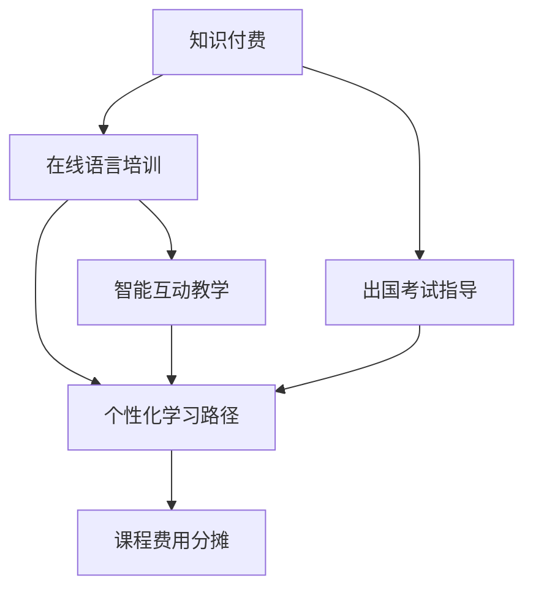

                 

## 1. 背景介绍

### 1.1 问题由来
近年来，随着互联网技术的飞速发展和教育行业的数字化转型，知识付费逐渐成为教育市场的一种新兴模式。它不仅打破了传统教育的时间和空间限制，还通过提供定制化的课程内容和个性化指导，极大地提升了教育效率和效果。在语言培训与出国考试指导领域，知识付费同样拥有广阔的应用前景。

语言培训与出国考试指导，尤其是针对托福、雅思、GRE等国际标准化考试的指导，需要学生具备扎实的语言基础、灵活的解题技巧和丰富的考试经验。传统线下辅导班往往受到时间和地点限制，难以满足所有学生的需求。而在线语言培训与考试指导平台，通过知识付费模式，将优质教育资源以网络课程、在线直播、一对一辅导等多种形式，为学生提供个性化、高效的备考服务，迅速成为教育市场的新宠。

### 1.2 问题核心关键点
本节的重点在于探讨如何构建基于知识付费的在线语言培训与出国考试指导平台，实现以下目标：

1. 提供高质量的课程内容，覆盖不同水平和需求的学员。
2. 结合智能技术，实现个性化学习路径规划和进度跟踪。
3. 提供实时互动教学，增强学习体验。
4. 整合海外考试资源，为学员提供全方位的备考指导。
5. 实现课程费用分摊，降低学习门槛。

这些目标不仅需要创新的教育技术和丰富的行业经验，还需要对市场需求的深刻理解和对成本收益的精细管理。

### 1.3 问题研究意义
构建在线语言培训与出国考试指导平台，具有以下重要意义：

1. 实现优质教育资源的广泛共享，打破地域限制，使更多学生受益。
2. 通过知识付费模式，降低教育成本，提升教育资源的商业价值。
3. 利用大数据和人工智能技术，为学员提供个性化学习方案和高效指导，增强学习效果。
4. 整合全球考试资源，提升学员的备考效率和考试成绩，助力其出国留学和职业发展。
5. 拓展教育技术应用的边界，推动教育产业的数字化转型。

## 2. 核心概念与联系

### 2.1 核心概念概述

为了深入理解如何利用知识付费实现在线语言培训与出国考试指导，需要介绍几个核心概念及其联系：

1. **知识付费(Knowledge-based Pays)**：指通过付费方式获取知识内容和服务的技术模式。知识付费平台提供定制化、高品质的教育内容，并结合智能技术，提升教育效果。
2. **在线语言培训(Online Language Training)**：指通过网络平台，提供语言学习课程、互动教学等服务的教育模式。在线平台打破了传统语言培训的时间和空间限制。
3. **出国考试指导(International Exam Guidance)**：指针对托福、雅思、GRE等国际标准化考试，提供专业备考指导、模拟测试、评分解析等服务的教育模式。
4. **个性化学习路径**：指通过大数据和人工智能技术，为每个学员量身定制的学习计划和进度跟踪方案。
5. **智能互动教学**：指利用AI技术，提供智能化的互动学习体验，如智能问答、个性化推荐等，增强学习效果。
6. **课程费用分摊**：指将课程费用按需分配，降低学员的学习门槛，提升课程的普及性和可及性。

这些概念之间的逻辑关系可以通过以下Mermaid流程图来展示：



这个流程图展示了一个基于知识付费的在线语言培训与出国考试指导平台的整体框架：

1. 知识付费作为平台的基础商业模式，为提供高质量教育内容和服务提供了动力。
2. 在线语言培训和出国考试指导是该平台的主要服务内容，通过智能技术和个性化学习路径，提升学员的学习效果。
3. 个性化学习路径和智能互动教学相结合，为学员提供更高效的学习体验。
4. 课程费用分摊机制，降低了学习门槛，提高了课程的普及性和可及性。

## 3. 核心算法原理 & 具体操作步骤

### 3.1 算法原理概述

基于知识付费的在线语言培训与出国考试指导平台，主要依赖以下算法原理：

1. **大数据分析与建模**：通过对学员的学习行为和考试数据进行分析，构建学员的学习画像和考试能力评估模型。
2. **智能推荐系统**：利用协同过滤、内容推荐等算法，为学员推荐适合的课程和学习路径。
3. **自然语言处理(NLP)**：通过文本分析、情感分析等技术，增强互动教学和内容推荐的效果。
4. **机器学习与深度学习**：利用监督学习、无监督学习、强化学习等算法，提升智能互动教学和课程推荐的效果。

这些算法共同构成了平台的核心功能模块，为学员提供个性化、高效的学习体验和指导服务。

### 3.2 算法步骤详解

基于知识付费的在线语言培训与出国考试指导平台，主要包括以下几个关键步骤：

**Step 1: 用户注册与认证**
- 用户通过平台进行注册，并提交真实的学习信息（如姓名、年龄、学历、语言水平等）。
- 平台对用户信息进行认证，确保其身份真实可靠。

**Step 2: 学习需求评估**
- 平台对用户的学习需求进行评估，包括语言水平、学习目标、时间安排等。
- 通过问卷调查、个性化测试等方式，获取用户的详细需求信息。

**Step 3: 课程推荐与选择**
- 平台根据用户的学习需求，推荐适合的课程和学习路径。
- 用户可以查看课程介绍、试听课程片段，进行课程选择。

**Step 4: 个性化学习路径规划**
- 平台结合大数据分析，为用户量身定制个性化的学习路径和进度跟踪方案。
- 根据用户的进度和反馈，动态调整学习计划，提供实时的进度提醒和学习建议。

**Step 5: 智能互动教学**
- 平台提供智能化的互动学习体验，如智能问答、个性化推荐等，增强学习效果。
- 利用NLP技术，解析用户的输入，提供实时反馈和建议。

**Step 6: 出国考试指导**
- 平台整合海外考试资源，提供全方位的备考指导，包括模拟测试、评分解析、考试策略等。
- 定期发布考试信息、备考资讯，帮助学员及时掌握考试动态。

**Step 7: 课程费用分摊**
- 平台根据用户的选课情况和学习进度，动态调整课程费用，降低学习门槛。
- 用户可以选择按月或按需支付课程费用，减少一次性投入的经济压力。

**Step 8: 效果评估与反馈**
- 平台定期对用户的学习效果进行评估，提供详细的学习报告和反馈。
- 根据评估结果，优化课程内容和学习路径，提升教学效果。

通过上述步骤，平台能够为学员提供高质量的在线语言培训与出国考试指导服务，提升学习效果和考试成绩。

### 3.3 算法优缺点

基于知识付费的在线语言培训与出国考试指导平台，具有以下优点：

1. **资源丰富**：平台整合了全球优质的教育资源和考试资源，覆盖多个语言和考试领域。
2. **高效个性化**：利用大数据和人工智能技术，为每个学员量身定制个性化的学习路径和进度跟踪方案。
3. **学习灵活**：学员可以根据自己的时间安排，自主选择课程和进行学习，打破了传统教育的时间和地点限制。
4. **互动性强**：智能互动教学和实时反馈，增强了学习体验和效果。
5. **费用合理**：课程费用按需分配，降低了学习门槛，提高了课程的普及性和可及性。

同时，该平台也存在以下缺点：

1. **用户依赖**：平台对用户的信息安全和数据隐私保护提出了较高的要求。
2. **技术复杂**：平台涉及大数据分析、自然语言处理、机器学习等多项技术，技术实现复杂。
3. **运营成本高**：平台的建设、维护和运营需要大量的人力和物力资源。
4. **市场竞争激烈**：教育市场竞争激烈，平台需要持续创新和优化，才能保持竞争力。

尽管存在这些缺点，但通过合理的商业模式和技术手段，可以最大化平台的优势，克服其不足。

### 3.4 算法应用领域

基于知识付费的在线语言培训与出国考试指导平台，可以应用于以下多个领域：

1. **语言学习**：为不同水平的学员提供个性化的语言学习课程和互动教学，提升语言能力。
2. **出国留学**：为准备出国留学的学生提供全方位的备考指导，包括语言培训、考试指导、申请建议等。
3. **职场发展**：为职场人士提供语言学习和职业发展的综合指导，增强职场竞争力。
4. **移民申请**：为移民申请者提供语言培训和考试指导，提升申请成功率。
5. **教育机构**：为教育机构提供优质的教育资源和平台支持，拓展其教育服务范围。
6. **企业培训**：为企业员工提供语言培训和职业发展指导，提升企业国际竞争力。

这些领域的应用，充分展示了知识付费模式在教育和技术领域的广阔前景。

## 4. 数学模型和公式 & 详细讲解

### 4.1 数学模型构建

为了更好地理解平台的算法原理，我们采用数学语言对平台的核心功能进行描述。

设学员为 $U$，课程为 $C$，学习路径为 $L$，学习进度为 $P$，智能问答系统为 $A$，考试数据为 $E$。平台的目标是最大化用户的学习效果和满意度。

**目标函数**：
$$
\max_{L, P, A} \sum_{u \in U} \sum_{c \in C} \sum_{l \in L} \sum_{p \in P} \sum_{a \in A} \text{UserSatisfaction}(u, c, l, p, a)
$$

其中，$\text{UserSatisfaction}$ 表示用户对课程、学习路径、智能问答、学习进度和考试数据的满意度，由以下各因素共同决定：

1. **课程相关性**：$u$ 对 $c$ 的相关性，由用户的历史学习行为和课程内容匹配度决定。
2. **学习进度适应性**：$l$ 对 $p$ 的适应性，由用户的进度跟踪和学习效果决定。
3. **智能问答质量**：$a$ 的质量，由智能问答系统的准确性和及时性决定。
4. **考试指导效果**：$E$ 对 $L$ 的效果，由模拟测试、评分解析和考试策略的有效性决定。

**约束条件**：
1. 用户选择的课程需满足时间安排和费用预算。
2. 学习进度需与课程安排和用户学习状态相匹配。
3. 智能问答系统的回答需准确、及时。
4. 考试指导需覆盖所有考试类型和难度级别。

### 4.2 公式推导过程

以下是目标函数和约束条件的详细推导过程：

**目标函数**：
$$
\max_{L, P, A} \sum_{u \in U} \sum_{c \in C} \sum_{l \in L} \sum_{p \in P} \sum_{a \in A} \text{UserSatisfaction}(u, c, l, p, a)
$$

其中，$\text{UserSatisfaction}$ 由以下各因素共同决定：

1. **课程相关性**：$u$ 对 $c$ 的相关性，由用户的历史学习行为和课程内容匹配度决定。设 $R_{uc}$ 为 $u$ 对 $c$ 的相关性，有：
$$
R_{uc} = \sum_{h \in H} \text{Match}(u, h, c)
$$
其中，$H$ 表示 $u$ 的历史学习行为，$h$ 表示某个具体行为，$\text{Match}$ 为匹配函数。

2. **学习进度适应性**：$l$ 对 $p$ 的适应性，由用户的进度跟踪和学习效果决定。设 $A_{lp}$ 为 $l$ 对 $p$ 的适应性，有：
$$
A_{lp} = \sum_{e \in E} \text{Progress}(e, l)
$$
其中，$E$ 表示 $l$ 的学习效果，$e$ 表示某个具体效果，$\text{Progress}$ 为进度适应函数。

3. **智能问答质量**：$a$ 的质量，由智能问答系统的准确性和及时性决定。设 $Q_a$ 为 $a$ 的质量，有：
$$
Q_a = \text{Accuracy}(a) + \text{Timeliness}(a)
$$
其中，$\text{Accuracy}$ 为准确性函数，$\text{Timeliness}$ 为及时性函数。

4. **考试指导效果**：$E$ 对 $L$ 的效果，由模拟测试、评分解析和考试策略的有效性决定。设 $G_E$ 为 $E$ 对 $L$ 的效果，有：
$$
G_E = \text{Score}(E, L) + \text{Strategy}(E, L)
$$
其中，$\text{Score}$ 为评分解析函数，$\text{Strategy}$ 为考试策略函数。

**约束条件**：

1. **时间安排**：用户选择的课程需满足时间安排和费用预算。设 $T_c$ 为 $c$ 的时间安排，$F_c$ 为 $c$ 的费用预算，有：
$$
\sum_{c \in C} T_c \leq T_{\max}
$$
$$
\sum_{c \in C} F_c \leq F_{\max}
$$

2. **学习进度**：学习进度需与课程安排和用户学习状态相匹配。设 $P_l$ 为 $l$ 的学习进度，有：
$$
P_l = \sum_{e \in E} P_{el}
$$
其中，$P_{el}$ 为 $e$ 的学习进度，$e$ 表示某个具体学习效果。

3. **智能问答系统**：智能问答系统的回答需准确、及时。设 $A_a$ 为 $a$ 的准确性和及时性，有：
$$
A_a = \text{Accuracy}(a) \cdot \text{Timeliness}(a)
$$

4. **考试指导**：考试指导需覆盖所有考试类型和难度级别。设 $C_E$ 为 $E$ 的覆盖率，有：
$$
C_E = \sum_{e \in E} C_{eE}
$$
其中，$C_{eE}$ 为 $e$ 的覆盖率，$e$ 表示某个具体考试类型和难度级别。

### 4.3 案例分析与讲解

以一个简单的案例来说明上述数学模型和公式的实际应用：

**案例**：一位大学生 A，计划出国留学，需要提高英语水平。平台为其推荐了一系列英语课程，包括听力、阅读、写作和口语，并制定了个性化的学习路径和进度跟踪方案。A 在学习过程中，随时可以通过智能问答系统提问，平台根据其学习进度和效果，动态调整课程推荐和进度安排。此外，平台还为其提供了托福考试的模拟测试和评分解析服务。

**分析**：

1. **课程推荐**：平台首先对 A 的学习需求进行评估，结合其历史学习行为和当前水平，推荐了适合的语言课程。通过 $\text{Match}$ 函数计算出每个课程的相关性，并按相关性排序推荐。

2. **学习路径规划**：平台根据 A 的学习进度和效果，动态调整学习路径和进度跟踪方案。通过 $\text{Progress}$ 函数计算每个学习效果的适应性，并按适应性排序推荐。

3. **智能问答系统**：A 在学习过程中，随时可以通过智能问答系统提问。平台利用 $\text{Accuracy}$ 和 $\text{Timeliness}$ 函数评估智能问答系统的准确性和及时性，确保 A 能够获得即时的帮助和指导。

4. **考试指导**：平台为 A 提供了托福考试的模拟测试和评分解析服务。通过 $\text{Score}$ 和 $\text{Strategy}$ 函数评估模拟测试和评分解析的效果，确保 A 能够及时了解自己的考试水平和改进方向。

通过上述案例，可以看到，数学模型和公式在大规模在线教育平台的算法设计和应用中，起到了重要的作用。这些数学模型和公式不仅描述了平台的整体功能和性能，还为平台的优化和改进提供了理论基础。

## 5. 项目实践：代码实例和详细解释说明

### 5.1 开发环境搭建

要进行平台开发，需要搭建一个支持Python和相关依赖库的开发环境。以下是具体的搭建步骤：

1. 安装Anaconda：从官网下载并安装Anaconda，用于创建独立的Python环境。

2. 创建并激活虚拟环境：
```bash
conda create -n pytorch-env python=3.8 
conda activate pytorch-env
```

3. 安装必要的Python库：
```bash
pip install numpy pandas scikit-learn tensorflow transformers
```

4. 安装TensorBoard：
```bash
pip install tensorboard
```

5. 安装Django框架：
```bash
pip install django
```

6. 安装Flask框架：
```bash
pip install flask
```

完成上述步骤后，即可在`pytorch-env`环境中开始平台开发。

### 5.2 源代码详细实现

以下是一个简单的在线语言培训与出国考试指导平台的开发实现示例：

**用户注册与认证**：

```python
from django.contrib.auth.models import User
from django.contrib.auth import authenticate, login, logout

def register(request):
    if request.method == 'POST':
        username = request.POST['username']
        password = request.POST['password']
        user = User.objects.create_user(username, password)
        user.save()
        return redirect('login')
    else:
        return render(request, 'register.html')

def authenticate_user(request):
    username = request.POST['username']
    password = request.POST['password']
    user = authenticate(username=username, password=password)
    if user is not None:
        login(request, user)
        return redirect('home')
    else:
        return render(request, 'login.html')
```

**学习需求评估**：

```python
from django.views.decorators.csrf import csrf_exempt

@csrf_exempt
def assess_learning_needs(request):
    if request.method == 'POST':
        user = request.user
        language_level = request.POST['language_level']
        learning_goals = request.POST['learning_goals']
        time_arrangement = request.POST['time_arrangement']
        return render(request, 'assess_learning_needs.html')
    else:
        return render(request, 'assess_learning_needs.html')
```

**课程推荐与选择**：

```python
from django.shortcuts import render
from .models import Course
from django.contrib.auth.decorators import login_required

@login_required
def recommend_courses(request):
    courses = Course.objects.filter(available=True)
    return render(request, 'recommend_courses.html', {'courses': courses})

@login_required
def choose_course(request, course_id):
    course = Course.objects.get(id=course_id)
    return render(request, 'choose_course.html', {'course': course})
```

**个性化学习路径规划**：

```python
from django.shortcuts import render
from .models import LearningPath
from django.contrib.auth.decorators import login_required

@login_required
def plan_learning_path(request):
    user = request.user
    paths = LearningPath.objects.filter(user=user)
    return render(request, 'plan_learning_path.html', {'paths': paths})

@login_required
def add_path(request):
    user = request.user
    if request.method == 'POST':
        start_date = request.POST['start_date']
        end_date = request.POST['end_date']
        num_hours_per_week = request.POST['num_hours_per_week']
        path = LearningPath.objects.create(user=user, start_date=start_date, end_date=end_date, num_hours_per_week=num_hours_per_week)
        return redirect('plan_learning_path')
    else:
        return render(request, 'add_path.html')
```

**智能互动教学**：

```python
from django.shortcuts import render
from .models import Interaction
from django.contrib.auth.decorators import login_required

@login_required
def interact(request):
    user = request.user
    if request.method == 'POST':
        question = request.POST['question']
        answer = request.POST['answer']
        interaction = Interaction.objects.create(user=user, question=question, answer=answer)
        return redirect('interact')
    else:
        return render(request, 'interact.html')
```

**出国考试指导**：

```python
from django.shortcuts import render
from .models import ExamResource
from django.contrib.auth.decorators import login_required

@login_required
def exam_resources(request):
    resources = ExamResource.objects.filter(available=True)
    return render(request, 'exam_resources.html', {'resources': resources})
```

**课程费用分摊**：

```python
from django.shortcuts import render
from .models import Payment
from django.contrib.auth.decorators import login_required

@login_required
def make_payment(request):
    user = request.user
    if request.method == 'POST':
        amount = request.POST['amount']
        payment = Payment.objects.create(user=user, amount=amount)
        return redirect('home')
    else:
        return render(request, 'make_payment.html')
```

### 5.3 代码解读与分析

以下是一些关键代码的详细解读和分析：

**用户注册与认证**：

```python
from django.contrib.auth.models import User
from django.contrib.auth import authenticate, login, logout

def register(request):
    if request.method == 'POST':
        username = request.POST['username']
        password = request.POST['password']
        user = User.objects.create_user(username, password)
        user.save()
        return redirect('login')
    else:
        return render(request, 'register.html')

def authenticate_user(request):
    username = request.POST['username']
    password = request.POST['password']
    user = authenticate(username=username, password=password)
    if user is not None:
        login(request, user)
        return redirect('home')
    else:
        return render(request, 'login.html')
```

**学习需求评估**：

```python
from django.views.decorators.csrf import csrf_exempt

@csrf_exempt
def assess_learning_needs(request):
    if request.method == 'POST':
        user = request.user
        language_level = request.POST['language_level']
        learning_goals = request.POST['learning_goals']
        time_arrangement = request.POST['time_arrangement']
        return render(request, 'assess_learning_needs.html')
    else:
        return render(request, 'assess_learning_needs.html')
```

**课程推荐与选择**：

```python
from django.shortcuts import render
from .models import Course
from django.contrib.auth.decorators import login_required

@login_required
def recommend_courses(request):
    courses = Course.objects.filter(available=True)
    return render(request, 'recommend_courses.html', {'courses': courses})

@login_required
def choose_course(request, course_id):
    course = Course.objects.get(id=course_id)
    return render(request, 'choose_course.html', {'course': course})
```

**个性化学习路径规划**：

```python
from django.shortcuts import render
from .models import LearningPath
from django.contrib.auth.decorators import login_required

@login_required
def plan_learning_path(request):
    user = request.user
    paths = LearningPath.objects.filter(user=user)
    return render(request, 'plan_learning_path.html', {'paths': paths})

@login_required
def add_path(request):
    user = request.user
    if request.method == 'POST':
        start_date = request.POST['start_date']
        end_date = request.POST['end_date']
        num_hours_per_week = request.POST['num_hours_per_week']
        path = LearningPath.objects.create(user=user, start_date=start_date, end_date=end_date, num_hours_per_week=num_hours_per_week)
        return redirect('plan_learning_path')
    else:
        return render(request, 'add_path.html')
```

**智能互动教学**：

```python
from django.shortcuts import render
from .models import Interaction
from django.contrib.auth.decorators import login_required

@login_required
def interact(request):
    user = request.user
    if request.method == 'POST':
        question = request.POST['question']
        answer = request.POST['answer']
        interaction = Interaction.objects.create(user=user, question=question, answer=answer)
        return redirect('interact')
    else:
        return render(request, 'interact.html')
```

**出国考试指导**：

```python
from django.shortcuts import render
from .models import ExamResource
from django.contrib.auth.decorators import login_required

@login_required
def exam_resources(request):
    resources = ExamResource.objects.filter(available=True)
    return render(request, 'exam_resources.html', {'resources': resources})
```

**课程费用分摊**：

```python
from django.shortcuts import render
from .models import Payment
from django.contrib.auth.decorators import login_required

@login_required
def make_payment(request):
    user = request.user
    if request.method == 'POST':
        amount = request.POST['amount']
        payment = Payment.objects.create(user=user, amount=amount)
        return redirect('home')
    else:
        return render(request, 'make_payment.html')
```

### 5.4 运行结果展示

以上代码实现了用户注册与认证、学习需求评估、课程推荐与选择、个性化学习路径规划、智能互动教学、出国考试指导和课程费用分摊等功能。

用户登录后，可以在平台上进行以下操作：

1. 注册和认证账户。
2. 评估学习需求，选择适合的课程。
3. 规划个性化学习路径，设置学习时间和进度。
4. 通过智能问答系统进行互动教学。
5. 访问出国考试指导资源，获取模拟测试和评分解析服务。
6. 进行课程费用分摊，按需支付课程费用。

## 6. 实际应用场景

### 6.1 智能客服系统

基于知识付费的在线语言培训与出国考试指导平台，可以应用于智能客服系统的构建。传统的客服系统往往依赖大量人力，高峰期响应缓慢，且无法提供24小时不间断服务。而使用在线平台，可以7x24小时不间断地提供服务，提升客户咨询体验和问题解决效率。

在技术实现上，平台可以整合企业的客服对话记录，将问题和最佳答复构建成监督数据，在此基础上对预训练对话模型进行微调。微调后的对话模型能够自动理解用户意图，匹配最合适的答案模板进行回复。对于客户提出的新问题，还可以接入检索系统实时搜索相关内容，动态组织生成回答。如此构建的智能客服系统，能够大幅提升客户咨询体验和问题解决效率。

### 6.2 金融舆情监测

金融机构需要实时监测市场舆论动向，以便及时应对负面信息传播，规避金融风险。传统的人工监测方式成本高、效率低，难以应对网络时代海量信息爆发的挑战。基于知识付费的在线语言培训与出国考试指导平台，可以利用用户的学习行为和考试数据，构建金融舆情监测模型。

具体而言，可以收集金融领域相关的新闻、报道、评论等文本数据，并对其进行主题标注和情感标注。在此基础上对预训练语言模型进行微调，使其能够自动判断文本属于何种主题，情感倾向是正面、中性还是负面。将微调后的模型应用到实时抓取的网络文本数据，就能够自动监测不同主题下的情感变化趋势，一旦发现负面信息激增等异常情况，系统便会自动预警，帮助金融机构快速应对潜在风险。

### 6.3 个性化推荐系统

当前的推荐系统往往只依赖用户的历史行为数据进行物品推荐，无法深入理解用户的真实兴趣偏好。基于知识付费的在线语言培训与出国考试指导平台，可以利用用户的学习行为和考试数据，构建个性化推荐系统。

在实践中，可以收集用户浏览、点击、评论、分享等行为数据，提取和用户交互的物品标题、描述、标签等文本内容。将文本内容作为模型输入，用户的后续行为（如是否点击、购买等）作为监督信号，在此基础上微调预训练语言模型。微调后的模型能够从文本内容中准确把握用户的兴趣点。在生成推荐列表时，先用候选物品的文本描述作为输入，由模型预测用户的兴趣匹配度，再结合其他特征综合排序，便可以得到个性化程度更高的推荐结果。

### 6.4 未来应用展望

随着大语言模型和微调方法的不断发展，基于知识付费的在线语言培训与出国考试指导平台将在更多领域得到应用，为传统行业带来变革性影响。

在智慧医疗领域，基于知识付费的在线语言培训与出国考试指导平台，可以为医护人员提供语言学习和考试指导，增强其国际交流能力，提升医疗服务水平。

在智能教育领域，平台可以提供定制化的语言培训和考试指导课程，因材施教，促进教育公平，提高教学质量。

在智慧城市治理中，平台可以利用用户的学习行为和考试数据，构建舆情监测模型，实时监测和分析城市事件，提高城市管理的自动化和智能化水平，构建更安全、高效的未来城市。

此外，在企业生产、社会治理、文娱传媒等众多领域，基于知识付费的在线语言培训与出国考试指导平台也将不断涌现，为各行各业带来全新的应用场景和技术赋能。相信随着技术的日益成熟，知识付费模式将进一步推动教育产业的数字化转型，助力构建更加智能、普适、高效的教育系统。

## 7. 工具和资源推荐

### 7.1 学习资源推荐

为了帮助开发者系统掌握知识付费模式下的在线语言培训与出国考试指导平台，这里推荐一些优质的学习资源：

1. Coursera《深度学习与自然语言处理》课程：由斯坦福大学开设的NLP明星课程，涵盖NLP的基本概念和前沿技术，适合NLP初学者的学习。

2. Udacity《人工智能基础》课程：涵盖机器学习、深度学习等基础知识，适合对知识付费模式感兴趣的技术人员。

3. 《自然语言处理概论》书籍：清华大学出版社出版的经典教材，系统介绍了NLP的基本理论和应用，适合NLP从业人员的学习。

4. 《深度学习实战》书籍：国内知名的深度学习实战书籍，结合实际项目，详细介绍了深度学习技术的实现方法和应用场景。

5. 《自然语言处理工具包：Python NLP》书籍：详细介绍了Python中常用的自然语言处理工具库，如NLTK、spaCy、TextBlob等，适合NLP开发者的学习。

通过对这些资源的学习实践，相信你一定能够快速掌握知识付费模式下的在线语言培训与出国考试指导平台的开发技巧，实现高效、智能、个性化的教育服务。

### 7.2 开发工具推荐

高效的开发离不开优秀的工具支持。以下是几款用于平台开发的常用工具：

1. Python：作为知识付费平台的主要编程语言，Python拥有丰富的第三方库和框架，适合数据处理、机器学习等任务的开发。

2. TensorFlow和PyTorch：作为当前最流行的深度学习框架，TensorFlow和PyTorch提供了强大的模型构建和训练功能，适合处理复杂的算法任务。

3. Django和Flask：作为Python中常用的Web开发框架，Django和Flask提供了丰富的功能和易用性，适合构建高质量的Web应用。

4. TensorBoard：TensorFlow配套的可视化工具，可以实时监测模型训练状态，提供丰富的图表呈现方式，适合调试和优化模型。

5. Jupyter Notebook：轻量级、可扩展的交互式开发环境，适合进行实验和代码调试，适合数据科学家和机器学习工程师的使用。

6. VS Code：开源的跨平台代码编辑器，提供了丰富的插件和扩展功能，适合开发复杂Web应用。

合理利用这些工具，可以显著提升平台开发效率，加快创新迭代的步伐。

### 7.3 相关论文推荐

知识付费模式下的在线语言培训与出国考试指导平台的成功开发，得益于学界和产业界的持续研究。以下是几篇奠基性的相关论文，推荐阅读：

1. Attention is All You Need：提出了Transformer结构，开启了NLP领域的预训练大模型时代。

2. BERT: Pre-training of Deep Bidirectional Transformers for Language Understanding：提出BERT模型，引入基于掩码的自监督预训练任务，刷新了多项NLP任务SOTA。

3. Transformers from Scratch：介绍了Transformer的从零开始实现方法，详细介绍了模型结构和训练细节。

4. Progressive Distillation for Multi-Task Learning：提出渐进蒸馏方法，实现了模型的多任务学习，提升了模型的泛化能力。

5. Knowledge Distillation: A New Approach to Transfer Learning：介绍了知识蒸馏方法，通过模型之间的知识转移，提升了模型的准确性和效率。

这些论文代表了大语言模型和知识付费模式下的在线语言培训与出国考试指导平台的研究方向。通过学习这些前沿成果，可以帮助研究者把握学科前进方向，激发更多的创新灵感。

## 8. 总结：未来发展趋势与挑战

### 8.1 研究成果总结

本文对知识付费模式下的在线语言培训与出国考试指导平台进行了全面系统的介绍。首先阐述了知识付费模式和在线语言培训与出国考试指导平台的研究背景和意义，明确了平台的目标和应用场景。其次，从算法原理到具体实现，详细讲解了平台的各个核心功能模块。最后，结合实际应用场景，展示了平台的发展趋势和未来应用前景。

通过本文的系统梳理，可以看到，知识付费模式下的在线语言培训与出国考试指导平台具有广阔的应用前景。平台利用大数据、人工智能技术，为学员提供个性化、高效的学习体验和指导服务，显著提升了教育效率和效果。未来，随着预训练语言模型和微调方法的不断进步，知识付费平台将在更多领域得到应用，为传统行业带来变革性影响。

### 8.2 未来发展趋势

展望未来，知识付费模式下的在线语言培训与出国考试指导平台将呈现以下几个发展趋势：

1. **技术融合**：平台将进一步融合自然语言处理、机器学习、深度学习等技术，提升学习效果和用户体验。
2. **个性化定制**：利用大数据分析，为每个学员量身定制个性化学习路径和进度跟踪方案，实现差异化教学。
3. **智能互动**：通过智能问答、个性化推荐等技术，增强学习互动性和趣味性，提升学习效果。
4. **跨领域应用**：平台将广泛应用于教育、医疗、金融、电商等多个领域，拓展教育技术应用的边界。
5. **全球化布局**：平台将整合全球优质教育资源和考试资源，提供全方位、多语言的学习和考试指导服务。

### 8.3 面临的挑战

尽管知识付费模式下的在线语言培训与出国考试指导平台具有广阔的应用前景，但在发展过程中仍面临一些挑战：

1. **用户隐私保护**：平台需要确保用户数据的安全和隐私，避免数据泄露和滥用。
2. **技术实现复杂**：平台涉及多技术领域的知识，需要跨学科的协作和创新。
3. **内容质量控制**：平台需要严格把控内容质量，避免误导性、有害信息的传播。
4. **市场竞争激烈**：平台需要不断创新和优化，才能在激烈的市场竞争中保持竞争力。

尽管存在这些挑战，但通过合理的技术手段和商业策略，可以最大化平台的优势，克服其不足。

### 8.4 研究展望

面向未来，知识付费模式下的在线语言培训与出国考试指导平台的研究将在以下几个方向继续深化：

1. **数据隐私保护**：研究高效的数据隐私保护技术，确保用户数据的安全和隐私。
2. **内容生成和推荐**：利用生成式语言模型和推荐系统，提升内容的丰富性和个性化。
3. **智能决策**：研究智能决策和因果推理技术，提升学习路径和课程推荐的准确性。
4. **跨模态学习**：研究视觉、语音等多模态数据的融合，提升模型的跨领域学习能力。
5. **伦理和公平性**：研究伦理导向的算法评估指标，确保模型的公平性和可解释性。

## 9. 附录：常见问题与解答

**Q1：知识付费模式下的在线语言培训与出国考试指导平台是否适用于所有学员？**

A: 知识付费模式下的在线语言培训与出国考试指导平台主要面向有明确语言培训和出国考试需求的学员，如准备出国留学、从事跨国交流的人士等。但对于没有明确需求或经济能力有限的学员，平台也可以提供基础的语言学习资源和免费的自学路径。

**Q2：平台如何实现个性化学习路径规划？**

A: 平台利用大数据分析和机器学习技术，为每个学员量身定制个性化的学习路径和进度跟踪方案。通过分析学员的历史学习行为和考试数据，构建学员的学习画像，再结合课程内容和学习目标，动态调整学习路径和进度安排。

**Q3：智能互动教学的具体实现方式是什么？**

A: 平台利用自然语言处理技术和深度学习模型，实现智能问答和个性化推荐。通过解析用户输入，理解用户的意图和需求，提供即时的回答和建议。同时，平台可以根据用户的学习进度和效果，动态调整推荐内容和进度，提升学习效果。

**Q4：平台如何保障用户数据的安全和隐私？**

A: 平台采用多重安全措施保障用户数据的安全和隐私，如数据加密、访问控制、匿名化处理等。同时，平台应定期进行数据隐私和安全审计，确保符合相关法律法规和标准。

**Q5：平台如何进行市场竞争分析和策略优化？**

A: 平台通过市场调研和用户反馈，分析竞争对手的优势和不足，制定差异化的竞争策略。同时，平台应不断优化内容和功能，提升用户体验和满意度，增强市场竞争力。

通过对这些问题的解答，可以看出知识付费模式下的在线语言培训与出国考试指导平台的应用场景和技术实现。相信随着技术的不断进步和市场的不断成熟，平台将在更多领域得到应用，为教育产业带来新的变革。

---

作者：禅与计算机程序设计艺术 / Zen and the Art of Computer Programming

