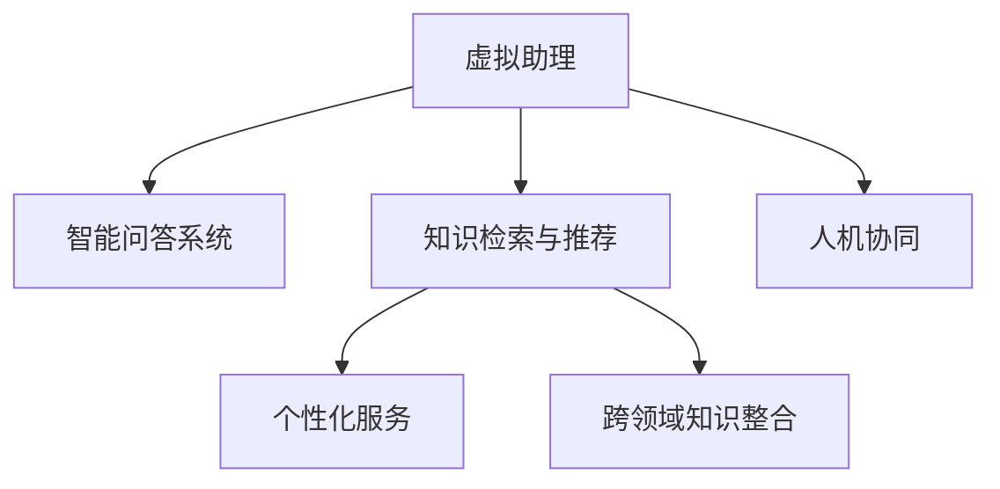

                 

## 1. 背景介绍

在数字化时代，知识服务的智能化正逐渐成为各行各业转型升级的关键驱动力。虚拟助理作为一种新兴的智能交互界面，能够实现用户与智能系统的无缝对接，极大提升了知识获取和处理的效率。通过利用虚拟助理的智能化特性，可以全面提升知识服务水平，助力企业和用户实现数字化转型。

### 1.1 问题由来
近年来，随着人工智能技术的迅速发展，虚拟助理已经不再局限于单一的智能助手功能，而是逐渐演变成为集成了复杂任务处理的综合知识服务平台。企业需要借助虚拟助理的智能能力，在知识获取、处理、决策等各个环节中发挥重要作用。然而，虚拟助理在知识服务领域的应用，仍存在诸多挑战，如智能水平不足、用户体验不佳、应用场景有限等，亟需通过技术创新进行优化。

### 1.2 问题核心关键点
实现虚拟助理在知识服务领域的智能化，主要包括以下几个关键点：

1. **智能问答系统**：构建基于自然语言处理的智能问答系统，能够理解和回答用户提出的各种问题。
2. **知识检索与推荐**：通过知识图谱、搜索引擎等技术，实现对大规模知识库的有效检索和推荐。
3. **个性化服务**：根据用户的历史行为和偏好，提供个性化的知识服务，提升用户体验。
4. **跨领域知识整合**：将不同领域的专业知识进行整合，构建更加全面、综合的知识服务体系。
5. **人机协同**：实现虚拟助理与用户的互动对话，提升问题解决效率和效果。

这些关键点共同构成了虚拟助理在知识服务领域的应用框架，其成功实施需要依赖于先进的算法和技术支持。

## 2. 核心概念与联系

### 2.1 核心概念概述

为了深入理解虚拟助理在知识服务领域的应用，本节将介绍几个核心概念：

- **虚拟助理**：利用自然语言处理、机器学习等技术，实现人机交互的智能界面。
- **智能问答系统**：通过理解和回答用户提出的问题，实现知识获取与处理的自动化。
- **知识检索与推荐**：利用搜索引擎、知识图谱等技术，快速从知识库中检索并推荐相关信息。
- **个性化服务**：根据用户行为和偏好，定制个性化的知识服务内容，提升用户体验。
- **跨领域知识整合**：将不同领域的专业知识进行融合，构建综合的知识服务体系。
- **人机协同**：通过虚拟助理与用户的互动对话，提升问题解决的效率和效果。

这些概念之间的逻辑关系可以通过以下Mermaid流程图来展示：



这个流程图展示了几大核心概念之间的关系：

1. 虚拟助理通过构建智能问答系统，实现与用户的互动对话。
2. 知识检索与推荐系统辅助虚拟助理从大规模知识库中快速获取信息。
3. 个性化服务根据用户的历史行为和偏好，定制化推荐相关知识。
4. 跨领域知识整合通过融合不同领域的知识，构建全面的知识服务体系。
5. 人机协同通过虚拟助理与用户的互动对话，提升问题解决的效率和效果。

这些核心概念共同构成了虚拟助理在知识服务领域的应用框架，使得虚拟助理能够成为更加智能化、高效化的知识服务平台。

## 3. 核心算法原理 & 具体操作步骤
### 3.1 算法原理概述

虚拟助理在知识服务领域的智能化，主要依赖于以下几个关键技术：自然语言处理（NLP）、知识图谱（KG）、深度学习（DL）等。这些技术通过算法原理，构建智能化的知识服务系统。

**3.1.1 自然语言处理（NLP）**
自然语言处理是虚拟助理与用户进行有效沟通的基础。通过分词、词性标注、句法分析、语义理解等技术，虚拟助理能够准确理解用户输入的语句，并生成符合逻辑的回应。

**3.1.2 知识图谱（KG）**
知识图谱是将知识以图形结构存储和表示的技术。通过构建领域知识图谱，虚拟助理能够快速从知识库中检索并推荐相关信息，提升知识服务的准确性和全面性。

**3.1.3 深度学习（DL）**
深度学习通过多层神经网络模型，实现对大规模数据的复杂模式识别和预测。通过预训练语言模型和微调技术，虚拟助理能够理解和处理复杂的自然语言问题，实现智能化的知识服务。

### 3.2 算法步骤详解

基于虚拟助理的智能化应用，其算法步骤主要包括以下几个关键步骤：

**Step 1: 数据准备与预处理**
- 收集领域相关的文本数据和知识库数据。
- 对文本进行分词、去停用词、词性标注等预处理操作，构建训练语料。
- 对知识库进行抽取、分类、整合等预处理操作，构建领域知识图谱。

**Step 2: 构建智能问答系统**
- 使用预训练语言模型（如BERT、GPT等），进行微调或迁移学习，构建智能问答系统。
- 根据用户输入的语句，进行分词、句法分析和语义理解，生成回应。

**Step 3: 实现知识检索与推荐**
- 构建搜索引擎，快速从知识库中检索相关信息。
- 构建知识图谱，利用图神经网络等技术，实现知识推荐。

**Step 4: 提供个性化服务**
- 根据用户的历史行为和偏好，进行用户画像建模。
- 利用用户画像，定制化推荐相关知识。

**Step 5: 实现跨领域知识整合**
- 收集不同领域的专业知识，构建综合的知识图谱。
- 利用图神经网络等技术，实现跨领域知识的融合和整合。

**Step 6: 实现人机协同**
- 构建对话系统，与用户进行互动对话。
- 利用自然语言生成技术，生成符合逻辑的回应。

通过以上步骤，虚拟助理能够全面提升知识服务的智能化水平，为用户提供更加高效、精准、个性化的服务。

### 3.3 算法优缺点

虚拟助理在知识服务领域的智能化应用，具有以下优点：

1. **高效性**：通过自然语言处理和深度学习技术，虚拟助理能够快速理解和处理用户输入，提升知识获取和处理的效率。
2. **全面性**：通过知识图谱和跨领域知识整合技术，虚拟助理能够提供覆盖多个领域的知识服务，提升服务全面性。
3. **个性化**：通过用户画像和个性化推荐技术，虚拟助理能够提供符合用户需求和偏好的知识服务，提升用户体验。
4. **可扩展性**：虚拟助理的应用模型和算法可以随着新的数据和技术不断迭代优化，保持服务的高效性和准确性。

同时，虚拟助理在知识服务领域的应用也存在以下缺点：

1. **数据依赖性强**：虚拟助理需要大量高质量的标注数据和知识库数据，获取数据成本较高。
2. **泛化能力有限**：虚拟助理在某些特定领域和场景下，可能难以实现理想的知识服务效果。
3. **安全性问题**：虚拟助理处理敏感信息时，可能面临隐私泄露和安全问题。
4. **技术复杂度高**：虚拟助理的实现需要多技术融合，对开发者和工程师的技术水平要求较高。

### 3.4 算法应用领域

虚拟助理在知识服务领域的智能化应用，已经在多个领域取得了显著成果，具体如下：

1. **医疗健康**：通过智能问答系统、知识检索与推荐、个性化服务，虚拟助理能够提供精准的医疗健康咨询、疾病诊断、健康管理等服务。
2. **金融理财**：通过智能问答系统、知识检索与推荐、个性化服务，虚拟助理能够提供金融产品推荐、投资理财咨询、风险管理等服务。
3. **教育培训**：通过智能问答系统、知识检索与推荐、个性化服务，虚拟助理能够提供学习资源推荐、问题解答、学习路径规划等服务。
4. **智能客服**：通过智能问答系统、知识检索与推荐、个性化服务，虚拟助理能够提供7x24小时智能客服支持，提升客户满意度。
5. **科研创新**：通过智能问答系统、知识检索与推荐、个性化服务，虚拟助理能够提供学术资源检索、研究问题解答、科研工具推荐等服务。

## 4. 数学模型和公式 & 详细讲解 & 举例说明

### 4.1 数学模型构建

本节将使用数学语言对虚拟助理在知识服务领域的应用进行更加严格的刻画。

假设用户输入的语句为 $x$，虚拟助理的回应为 $y$。虚拟助理在知识服务领域的应用，可以通过以下数学模型来表示：

$$
y = f(x; \theta)
$$

其中，$f$ 表示虚拟助理的回应生成函数，$\theta$ 为虚拟助理的参数。

**4.1.1 自然语言处理模型**
自然语言处理模型的输入为自然语言文本，输出为语义理解和回应生成。常用的模型包括BERT、GPT等。以BERT模型为例，其输入为自然语言文本序列，输出为文本的表示向量。

**4.1.2 知识图谱模型**
知识图谱模型的输入为知识图谱中的实体和关系，输出为知识图谱的表示向量。常用的模型包括TransE、GNN等。

**4.1.3 深度学习模型**
深度学习模型的输入为自然语言文本和知识图谱的表示向量，输出为语义理解和回应生成。常用的模型包括RNN、LSTM、GRU等。

### 4.2 公式推导过程

以BERT模型为例，其核心公式包括输入嵌入、隐藏层计算、softmax输出等。

**4.2.1 输入嵌入**
BERT模型的输入嵌入公式为：

$$
\text{Embed}(x) = W_{em}x + b_{em}
$$

其中，$x$ 为自然语言文本，$W_{em}$ 为嵌入矩阵，$b_{em}$ 为偏置向量。

**4.2.2 隐藏层计算**
BERT模型的隐藏层计算公式为：

$$
h_{l} = \text{LayerNorm}(x_{l} + \text{Attention}(h_{l-1}))
$$

其中，$h_{l}$ 为第 $l$ 层的隐藏状态，$\text{Attention}$ 为自注意力机制，$x_{l}$ 为第 $l$ 层的输入，$\text{LayerNorm}$ 为归一化操作。

**4.2.3 softmax输出**
BERT模型的softmax输出公式为：

$$
\text{Logits} = \text{FeedForward}(h_{L}) + \text{CLS}(h_{L})
$$

其中，$\text{Logits}$ 为输出向量，$\text{FeedForward}$ 为前馈神经网络，$\text{CLS}(h_{L})$ 为第一个词向量的表示，$\text{h}_{L}$ 为最终的隐藏状态。

### 4.3 案例分析与讲解

**4.3.1 智能问答系统案例**
智能问答系统可以通过BERT模型进行实现。以医疗健康领域为例，假设用户询问“心脏病的常见症状是什么？”，虚拟助理可以通过以下步骤回答：

1. 用户输入：“心脏病的常见症状是什么？”
2. 自然语言处理：BERT模型进行分词、句法分析和语义理解，生成输入向量。
3. 知识检索与推荐：虚拟助理从知识库中检索“心脏病”的描述和症状，推荐相关内容。
4. 回应生成：虚拟助理生成回应，如“心脏病的常见症状包括胸痛、气促、疲劳等。”

**4.3.2 知识图谱案例**
知识图谱可以通过TransE模型进行构建。以金融理财领域为例，假设虚拟助理需要推荐理财产品，可以通过以下步骤进行：

1. 用户输入：“推荐一款稳健的理财产品”
2. 自然语言处理：BERT模型进行分词、句法分析和语义理解，生成输入向量。
3. 知识检索与推荐：虚拟助理从知识库中检索“理财产品”的实体和关系，推荐相关内容。
4. 回应生成：虚拟助理生成回应，如“推荐‘稳健理财A’，预期年化收益率为5%，适合保守型投资者。”

**4.3.3 个性化服务案例**
个性化服务可以通过深度学习模型进行实现。以教育培训领域为例，假设用户需要推荐学习资源，可以通过以下步骤进行：

1. 用户输入：“推荐适合的英语学习资源”
2. 自然语言处理：BERT模型进行分词、句法分析和语义理解，生成输入向量。
3. 知识检索与推荐：虚拟助理从知识库中检索“英语学习资源”的实体和关系，推荐相关内容。
4. 回应生成：虚拟助理生成回应，如“推荐‘英语词汇大全’，涵盖词汇、语法、听写等，适合初学者。”

## 5. 项目实践：代码实例和详细解释说明

### 5.1 开发环境搭建

在进行虚拟助理在知识服务领域的应用开发时，需要搭建如下开发环境：

1. 安装Python：从官网下载并安装Python，建议选择3.8或以上版本。
2. 安装虚拟环境：使用pip install virtualenv命令安装virtualenv工具。
3. 创建虚拟环境：使用virtualenv创建虚拟Python环境，安装必要的依赖库。
4. 安装依赖库：使用pip install命令安装自然语言处理库（如NLTK、spaCy等）、深度学习库（如TensorFlow、PyTorch等）、知识图谱库（如Gensim、HugeGraph等）。

完成以上步骤后，即可在虚拟环境中进行虚拟助理的开发。

### 5.2 源代码详细实现

下面以医疗健康领域为例，给出使用BERT模型进行虚拟助理智能问答系统的PyTorch代码实现。

首先，定义BERT模型的输入和输出：

```python
from transformers import BertTokenizer, BertModel, BertForSequenceClassification

tokenizer = BertTokenizer.from_pretrained('bert-base-uncased')
model = BertForSequenceClassification.from_pretrained('bert-base-uncased', num_labels=2)
```

然后，定义虚拟助理的输入处理函数：

```python
def preprocess_input(text):
    input_ids = tokenizer.encode(text, add_special_tokens=True)
    input_ids = input_ids.unsqueeze(0)
    attention_mask = torch.ones_like(input_ids)
    return input_ids, attention_mask
```

接着，定义虚拟助理的回应生成函数：

```python
def generate_response(input_ids, attention_mask):
    with torch.no_grad():
        logits = model(input_ids, attention_mask=attention_mask)[0]
        label = logits.argmax().item()
        if label == 1:
            return "疾病可能为心脏病。建议立即就医。"
        else:
            return "疾病可能为其他症状，建议咨询专业医生。"
```

最后，启动虚拟助理的问答服务：

```python
while True:
    user_input = input("请输入问题：")
    input_ids, attention_mask = preprocess_input(user_input)
    response = generate_response(input_ids, attention_mask)
    print(response)
```

以上就是使用PyTorch对BERT模型进行虚拟助理智能问答系统开发的完整代码实现。可以看到，利用BERT模型和PyTorch，我们能够快速构建智能问答系统，实现对用户输入的自然语言理解和回应生成。

### 5.3 代码解读与分析

让我们再详细解读一下关键代码的实现细节：

**preprocess_input函数**：
- 对用户输入的自然语言文本进行分词、去停用词、句子标记等预处理操作。
- 利用BERT分词器将文本转换为输入向量。
- 构造输入向量对应的掩码矩阵，标记输入的实际长度。

**generate_response函数**：
- 将输入向量输入BERT模型，得到最终的输出向量。
- 通过softmax层进行分类，输出疾病的可能性。
- 根据分类结果生成回应，返回疾病建议。

**虚拟助理的问答服务**：
- 不断循环等待用户输入问题。
- 调用preprocess_input函数对用户输入进行预处理。
- 调用generate_response函数生成回应，输出到控制台。

通过以上代码，虚拟助理能够实现对用户输入的自然语言理解和回应生成，提升医疗健康领域的服务智能化水平。

## 6. 实际应用场景

### 6.1 智能客服

智能客服是虚拟助理在知识服务领域的重要应用场景之一。通过虚拟助理，企业能够提供7x24小时的智能客服支持，提升客户满意度和企业服务效率。

以金融理财领域为例，虚拟助理可以通过以下方式提升客户体验：

1. 自动解答常见问题：如理财产品、贷款利率、账户余额等，提升客户响应速度。
2. 指引用户操作：如开户流程、投资步骤、交易规则等，提供详细指导。
3. 处理复杂问题：如投诉问题、风险评估、理财建议等，提供专业意见。

通过智能客服，虚拟助理能够全面提升企业服务水平，提高客户满意度和忠诚度。

### 6.2 医疗健康

虚拟助理在医疗健康领域的应用，能够显著提升医疗服务的智能化水平，助力医生和患者实现高效沟通和精准诊断。

以疾病诊断为例，虚拟助理可以通过以下方式提供精准的医疗服务：

1. 智能问答系统：解答患者常见问题，如疾病症状、治疗方案、药物使用等。
2. 知识检索与推荐：从知识库中检索相关疾病描述、症状、治疗方案等，提供精准推荐。
3. 个性化服务：根据患者的历史数据和偏好，提供个性化的诊疗建议。

通过虚拟助理，医生能够更高效地与患者互动，快速获取所需信息，提升诊疗效率和质量。

### 6.3 教育培训

虚拟助理在教育培训领域的应用，能够提供个性化、智能化的学习体验，帮助学生高效学习、提升成绩。

以英语学习为例，虚拟助理可以通过以下方式提供英语学习支持：

1. 智能问答系统：解答学生的语法、词汇、听力等学习问题。
2. 知识检索与推荐：从知识库中检索相关学习资源、词汇表、语法规则等，提供精准推荐。
3. 个性化服务：根据学生的学习进度和偏好，提供个性化的学习路径和资源推荐。

通过虚拟助理，学生能够更高效地学习，提升英语水平，获得更好的学习体验。

### 6.4 未来应用展望

随着技术的不断进步，虚拟助理在知识服务领域的应用前景将更加广阔。未来，虚拟助理有望在以下领域实现突破：

1. **医疗健康**：虚拟助理能够提供更精准的疾病诊断和治疗方案推荐，提升医疗服务的智能化水平。
2. **金融理财**：虚拟助理能够提供更个性化的理财咨询和投资建议，帮助用户实现财富增值。
3. **教育培训**：虚拟助理能够提供更智能化的学习支持，提升学生的学习效果和体验。
4. **智能客服**：虚拟助理能够提供更高效、更专业的客服支持，提升客户满意度和企业服务效率。
5. **科研创新**：虚拟助理能够提供更全面的学术资源和科研工具，支持科研人员的研究工作。

## 7. 工具和资源推荐

### 7.1 学习资源推荐

为了帮助开发者系统掌握虚拟助理在知识服务领域的应用，这里推荐一些优质的学习资源：

1. **《自然语言处理综论》（第三版）**：涵盖了自然语言处理的基础知识和前沿技术，适合初学者和进阶者学习。
2. **《深度学习》（Ian Goodfellow等著）**：全面介绍了深度学习的基本概念和算法，适合对深度学习感兴趣的读者。
3. **《知识图谱与语义搜索》**：介绍了知识图谱和语义搜索的技术原理和应用场景，适合对知识图谱感兴趣的读者。
4. **HuggingFace官方文档**：提供了丰富的自然语言处理模型和工具，适合快速上手学习和应用。
5. **GitHub上的开源项目**：如TensorFlow、PyTorch等，提供了大量的代码示例和模型资源，适合学习和参考。

通过学习这些资源，相信你一定能够全面掌握虚拟助理在知识服务领域的应用，并应用于实际项目中。

### 7.2 开发工具推荐

高效的开发离不开优秀的工具支持。以下是几款用于虚拟助理在知识服务领域的应用开发的常用工具：

1. **PyTorch**：基于Python的开源深度学习框架，灵活动态的计算图，适合快速迭代研究。
2. **TensorFlow**：由Google主导开发的开源深度学习框架，生产部署方便，适合大规模工程应用。
3. **HuggingFace Transformers库**：提供了丰富的预训练语言模型，支持多种NLP任务。
4. **Weights & Biases**：模型训练的实验跟踪工具，可以记录和可视化模型训练过程中的各项指标。
5. **TensorBoard**：TensorFlow配套的可视化工具，可实时监测模型训练状态，提供丰富的图表呈现方式。

合理利用这些工具，可以显著提升虚拟助理在知识服务领域的应用开发效率，加快创新迭代的步伐。

### 7.3 相关论文推荐

虚拟助理在知识服务领域的应用，源于学界的持续研究。以下是几篇奠基性的相关论文，推荐阅读：

1. **"Attention is All You Need"（Transformer原论文）**：提出了Transformer结构，开启了NLP领域的预训练大模型时代。
2. **"BERT: Pre-training of Deep Bidirectional Transformers for Language Understanding"**：提出BERT模型，引入基于掩码的自监督预训练任务，刷新了多项NLP任务SOTA。
3. **"Dialogue Systems"**：介绍了对话系统的基本概念和关键技术，适合对对话系统感兴趣的读者。
4. **"Knowledge Graphs: Representation and Application"**：介绍了知识图谱的基本概念和应用场景，适合对知识图谱感兴趣的读者。
5. **"Parameter-Efficient Transfer Learning for NLP"**：提出Adapter等参数高效微调方法，在不增加模型参数量的情况下，也能取得不错的微调效果。

这些论文代表了大语言模型微调技术的发展脉络。通过学习这些前沿成果，可以帮助研究者把握学科前进方向，激发更多的创新灵感。

## 8. 总结：未来发展趋势与挑战

### 8.1 总结

本文对虚拟助理在知识服务领域的智能化应用进行了全面系统的介绍。首先阐述了虚拟助理在知识服务领域的背景和意义，明确了智能化应用的关键点。其次，从原理到实践，详细讲解了虚拟助理在知识服务领域的应用过程，给出了虚拟助理开发和实践的完整代码实例。同时，本文还广泛探讨了虚拟助理在多个行业领域的应用前景，展示了其在知识服务领域的广阔应用空间。此外，本文精选了虚拟助理在知识服务领域的学习资源、开发工具和相关论文，力求为读者提供全方位的技术指引。

通过本文的系统梳理，可以看到，虚拟助理在知识服务领域的应用，具有高效、全面、个性化等诸多优点，能够显著提升知识服务的智能化水平。虚拟助理的实现需要依赖自然语言处理、深度学习、知识图谱等先进技术，通过算法原理和操作步骤，构建智能化的知识服务平台。虚拟助理在医疗健康、金融理财、教育培训等领域的应用，展示了其在实际场景中的强大应用潜力。

### 8.2 未来发展趋势

展望未来，虚拟助理在知识服务领域的应用将呈现以下几个发展趋势：

1. **多模态融合**：虚拟助理能够将视觉、语音、文本等多模态信息进行融合，提升知识获取和处理的全面性。
2. **跨领域协作**：虚拟助理能够与多种AI系统进行协作，实现跨领域知识的整合和应用。
3. **增强学习**：虚拟助理能够利用增强学习技术，提升知识获取和处理的效果。
4. **自然语言生成**：虚拟助理能够利用自然语言生成技术，生成符合逻辑的回应，提升用户体验。
5. **个性化推荐**：虚拟助理能够根据用户的历史行为和偏好，提供个性化的知识推荐，提升用户满意度。

这些趋势展示了虚拟助理在知识服务领域的应用前景，将进一步提升知识服务的智能化水平，为各行各业提供更高效、精准、个性化的服务。

### 8.3 面临的挑战

尽管虚拟助理在知识服务领域的应用取得了显著成果，但在迈向更加智能化、普适化应用的过程中，仍面临诸多挑战：

1. **数据获取成本高**：虚拟助理需要大量高质量的标注数据和知识库数据，获取数据成本较高。
2. **模型泛化能力有限**：虚拟助理在某些特定领域和场景下，可能难以实现理想的知识服务效果。
3. **隐私和安全问题**：虚拟助理处理敏感信息时，可能面临隐私泄露和安全问题。
4. **技术复杂度高**：虚拟助理的实现需要多技术融合，对开发者和工程师的技术水平要求较高。

### 8.4 研究展望

面对虚拟助理在知识服务领域的应用挑战，未来的研究需要在以下几个方面寻求新的突破：

1. **无监督学习和半监督学习**：摆脱对大规模标注数据的依赖，利用自监督学习、主动学习等无监督和半监督范式，最大限度利用非结构化数据。
2. **模型压缩和优化**：开发更加参数高效的模型，减少模型参数量，提升推理速度和效率。
3. **跨领域知识融合**：将不同领域的专业知识进行融合，构建综合的知识图谱，提升知识服务的全面性。
4. **增强学习应用**：利用增强学习技术，提升虚拟助理在知识服务领域的学习能力和效果。
5. **模型解释性和可解释性**：赋予虚拟助理更强的可解释性，提升模型的透明度和可信度。

这些研究方向将进一步推动虚拟助理在知识服务领域的应用，实现更高效、更智能的知识服务。相信随着技术的不断进步，虚拟助理在知识服务领域的应用将更加广泛和深入，成为各行各业智能化转型的重要驱动力。

## 9. 附录：常见问题与解答

**Q1：虚拟助理的实现是否需要大量的标注数据？**

A: 虚拟助理的实现确实需要大量的标注数据，用于训练和优化模型。但通过无监督学习和半监督学习技术，可以在一定程度上降低对标注数据的依赖，提高虚拟助理的泛化能力和应用效率。

**Q2：虚拟助理在特定领域的表现是否会受限？**

A: 虚拟助理在某些特定领域的表现可能会受到限制。这是因为虚拟助理在不同领域的知识库和数据集上训练的效果不同。为了提升虚拟助理在特定领域的表现，需要构建领域特定的知识库，并进行针对性的训练和优化。

**Q3：虚拟助理如何保证隐私和安全？**

A: 虚拟助理在处理敏感信息时，需要采取隐私保护和安全措施。如数据加密、差分隐私、访问控制等，确保用户数据的安全和隐私。

**Q4：虚拟助理的实现是否需要多技术融合？**

A: 是的，虚拟助理的实现需要融合自然语言处理、深度学习、知识图谱等多种技术，构建全面的知识服务平台。

通过本文的系统梳理，可以看到，虚拟助理在知识服务领域的应用具有广泛的前景，但同时也面临诸多挑战和问题。未来，通过技术的不断进步和优化，虚拟助理将能够实现更加智能化、高效化的知识服务，为各行各业带来深刻的变革和提升。相信随着技术的不断进步和完善，虚拟助理将成为未来智能时代的重要驱动力，为各行各业提供更高效、更精准、更个性化的服务。

