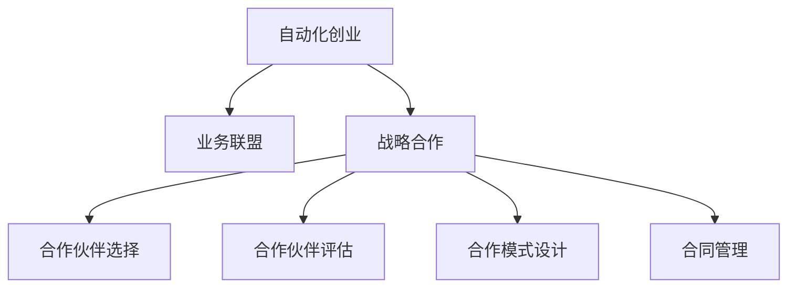

                 

# 如何在自动化创业中建立战略合作

> 关键词：自动化创业、战略合作、业务联盟、合作伙伴选择、合作伙伴评估、合作模式设计、合同管理

## 1. 背景介绍

随着人工智能和自动化技术的不断成熟，越来越多的创业公司致力于开发基于自动化技术的产品或服务，旨在提高工作效率、降低运营成本、提升用户体验。这些创业公司在技术创新和市场竞争方面面临着巨大的压力，同时也需要借助外部的资源和力量来快速扩展业务规模，从而提升市场竞争力。因此，建立战略合作伙伴关系成为自动化创业公司发展的重要战略之一。

本文档将系统地介绍自动化创业公司在建立战略合作时的关键步骤、核心概念和策略，旨在帮助创业公司全面理解战略合作的精髓，并在此基础上设计出高效、稳定的合作关系。

## 2. 核心概念与联系

### 2.1 核心概念概述

在进行自动化创业的战略合作时，需要理解以下核心概念：

- **战略合作**：指两个或多个实体之间建立的长期合作关系，旨在共同实现各自的目标和利益。
- **自动化创业**：利用自动化技术进行创业，开发自动化产品或服务，以提高工作效率、降低运营成本、提升用户体验。
- **业务联盟**：指通过战略合作建立起来的业务网络，有助于扩大市场份额和业务范围。
- **合作伙伴选择**：在众多潜在的合作伙伴中，选择适合自身业务需求的合作伙伴。
- **合作伙伴评估**：评估潜在合作伙伴的资质、技术能力和合作意愿，确保合作关系的长期稳定。
- **合作模式设计**：确定合作的具体形式，如技术授权、联合研发、销售代理等。
- **合同管理**：通过合同明确合作各方的权利和义务，确保合作关系得到法律保障。

这些概念之间的联系可以通过以下Mermaid流程图来展示：



## 3. 核心算法原理 & 具体操作步骤

### 3.1 算法原理概述

自动化创业公司建立战略合作，其核心算法原理可以简单概括为：在分析自身业务需求的基础上，寻找适合的潜在合作伙伴，并通过一系列评估和筛选，最终确定合适的合作模式，签订合同，并持续管理合作关系。

### 3.2 算法步骤详解

#### 3.2.1 需求分析

首先需要明确自动化创业公司希望通过战略合作实现的具体目标。例如：

- 获取新的技术能力
- 拓展市场份额
- 降低成本
- 提升产品竞争力

需求分析需要涵盖公司业务的核心部分，包括但不限于以下方面：

- 技术能力：公司目前拥有的技术水平和技术缺口。
- 市场定位：公司在市场中的定位和目标客户群体。
- 业务目标：短期和长期业务目标。

#### 3.2.2 潜在合作伙伴识别

根据需求分析的结果，识别出符合要求的潜在合作伙伴。这可以通过以下方式实现：

- **行业研究**：分析行业内的主要公司及其技术能力。
- **网络资源**：利用行业论坛、社交媒体等网络资源寻找潜在的合作伙伴。
- **展会和会议**：参加行业展会和会议，直接与潜在合作伙伴接触。
- **现有客户**：利用现有客户推荐新的潜在合作伙伴。

#### 3.2.3 合作伙伴评估

在初步确定潜在合作伙伴后，需要进行详细的评估。评估内容主要包括：

- **技术能力**：评估合作伙伴的技术水平、研发实力和专利情况。
- **业务能力**：评估合作伙伴的业务规模、市场影响力和销售渠道。
- **文化契合度**：评估合作伙伴的企业文化、合作态度和价值观。
- **风险评估**：评估合作伙伴的财务状况、法律风险和合作意愿。

评估结果可以采用量化的评分体系，每个评估指标分配一定的分数，最终计算总分数。评估方法可以包括：

- **调查问卷**：发送调查问卷给潜在合作伙伴，收集其技术、业务和文化信息。
- **现场考察**：实地考察合作伙伴的研发设施、市场运营和企业文化。
- **第三方评估**：利用行业第三方评估机构对合作伙伴进行评估。

#### 3.2.4 合作模式设计

确定合适的合作模式，以实现双方的共赢。合作模式可以包括：

- **技术授权**：获得合作伙伴的技术授权，在特定领域内使用其专利和专有技术。
- **联合研发**：与合作伙伴共同进行研发，共享研发成果和技术成果。
- **销售代理**：通过合作伙伴的销售渠道销售产品，共享销售收益。
- **战略投资**：投资合作伙伴，成为其战略投资者，共同推动业务发展。

合作模式设计需要考虑以下几个关键因素：

- **合作范围**：明确合作的具体领域和内容。
- **权益分配**：确定双方的权益分配，包括技术、市场和财务等方面。
- **风险分担**：明确合作过程中可能面临的风险及其分担方式。
- **期限和终止条件**：明确合作期限和终止条件，确保合作关系具有可持续性。

#### 3.2.5 合同管理

合同是战略合作关系的法律保障，需要明确双方的权利和义务。合同内容可以包括：

- **合作范围**：明确合作的具体领域和内容。
- **权益分配**：确定双方的权益分配，包括技术、市场和财务等方面。
- **风险分担**：明确合作过程中可能面临的风险及其分担方式。
- **期限和终止条件**：明确合作期限和终止条件，确保合作关系具有可持续性。
- **保密条款**：确保合作过程中涉及的商业秘密和技术秘密不被泄露。
- **争议解决**：明确争议解决机制，确保合作过程中发生争议时能够有效解决。

合同签订后，需要进行持续的管理和监控，以确保合作的顺利进行。管理内容包括：

- **进度跟踪**：定期跟踪合作项目的进展情况。
- **绩效评估**：对合作项目的绩效进行评估，确保目标的实现。
- **沟通机制**：建立有效的沟通机制，确保双方及时沟通和协调。
- **风险控制**：及时识别和控制合作过程中可能面临的风险。

## 4. 数学模型和公式 & 详细讲解 & 举例说明

### 4.1 数学模型构建

在战略合作的过程中，可以通过数学模型来量化合作伙伴的评估和选择。例如，可以使用线性加权评分模型来计算合作伙伴的总得分。

设合作伙伴的评估指标为 $X_1, X_2, \ldots, X_n$，每个指标的权重为 $w_1, w_2, \ldots, w_n$，评分为 $S_1, S_2, \ldots, S_n$。则合作伙伴的总得分为：

$$
\text{Total Score} = \sum_{i=1}^{n} w_i \cdot S_i
$$

### 4.2 公式推导过程

以技术能力评估为例，假设评估指标包括技术水平、研发实力和专利情况，对应的权重分别为0.4、0.3和0.3。技术水平评分为80分，研发实力评分为85分，专利情况评分为90分。则总得分为：

$$
\text{Total Score} = 0.4 \times 80 + 0.3 \times 85 + 0.3 \times 90 = 81.5
$$

### 4.3 案例分析与讲解

假设某自动化创业公司需要开发一款自动化软件，需要找到一家具有相关技术实力的合作伙伴。评估指标包括技术水平、研发实力和专利情况，对应的权重分别为0.4、0.3和0.3。假设评估结果如下：

- 技术水平：80分
- 研发实力：85分
- 专利情况：90分

则总得分为：

$$
\text{Total Score} = 0.4 \times 80 + 0.3 \times 85 + 0.3 \times 90 = 81.5
$$

基于此得分，可以初步确定该公司为合适的合作伙伴。

## 5. 项目实践：代码实例和详细解释说明

### 5.1 开发环境搭建

在进行自动化创业的战略合作时，需要搭建一个开发环境来管理和监控合作关系。以下是常用的开发环境搭建步骤：

1. **选择开发工具**：
   - **项目管理工具**：如JIRA、Trello等，用于跟踪和管理合作项目的进度。
   - **协作工具**：如Slack、Microsoft Teams等，用于实时沟通和协作。
   - **文档管理工具**：如Confluence、SharePoint等，用于管理和共享文档和资料。

2. **安装和配置工具**：
   - 安装项目管理工具。
   - 配置协作工具和文档管理工具。

### 5.2 源代码详细实现

以下是一个简单的示例代码，用于计算合作伙伴的总得分：

```python
class PartnerEvaluator:
    def __init__(self, weights):
        self.weights = weights

    def evaluate(self, scores):
        total_score = 0
        for i, score in enumerate(scores):
            total_score += self.weights[i] * score
        return total_score

# 示例：技术能力评估
weights = [0.4, 0.3, 0.3]
scores = [80, 85, 90]
evaluator = PartnerEvaluator(weights)
total_score = evaluator.evaluate(scores)
print(total_score)
```

### 5.3 代码解读与分析

以上代码实现了PartnerEvaluator类，用于计算合作伙伴的总得分。类中的`__init__`方法用于初始化权重向量，`evaluate`方法用于计算总得分。在示例中，我们使用技术水平、研发实力和专利情况作为评估指标，计算出总得分。

### 5.4 运行结果展示

执行上述代码，输出结果为81.5分，说明该公司在技术能力方面的评估总得分为81.5分。

## 6. 实际应用场景

### 6.1 智能制造

在智能制造领域，自动化创业公司需要与设备制造商和软件供应商建立战略合作，共同开发智能制造解决方案。例如，与设备制造商合作，集成自动化设备，提供设备状态监测和维护服务；与软件供应商合作，提供生产过程优化和供应链管理解决方案。

### 6.2 医疗健康

在医疗健康领域，自动化创业公司需要与医疗设备和软件公司建立战略合作，共同开发智能医疗解决方案。例如，与医疗设备公司合作，提供远程监控和诊断服务；与软件公司合作，开发电子病历和医疗数据分析系统。

### 6.3 物流运输

在物流运输领域，自动化创业公司需要与物流公司建立战略合作，共同开发智能物流解决方案。例如，与物流公司合作，提供仓储管理和配送优化服务；与软件公司合作，开发智能路径规划和物流跟踪系统。

## 7. 工具和资源推荐

### 7.1 学习资源推荐

为了帮助自动化创业公司系统掌握战略合作的核心方法和技巧，推荐以下学习资源：

1. **《战略管理》**：系统介绍战略管理的理论和实践，适合自动化创业公司的管理人员阅读。
2. **《合作伙伴关系管理》**：详细介绍合作伙伴关系管理的理论和方法，适合自动化创业公司的项目管理团队阅读。
3. **《自动化创业指南》**：详细介绍自动化创业的基础知识和实践技巧，适合自动化创业公司的技术团队阅读。
4. **《战略联盟与管理》**：详细介绍战略联盟的构建和管理的理论和方法，适合自动化创业公司的高级管理人员阅读。

### 7.2 开发工具推荐

以下工具可以用于自动化创业公司的战略合作管理：

1. **项目管理工具**：如JIRA、Trello等，用于跟踪和管理合作项目的进度。
2. **协作工具**：如Slack、Microsoft Teams等，用于实时沟通和协作。
3. **文档管理工具**：如Confluence、SharePoint等，用于管理和共享文档和资料。
4. **合同管理工具**：如DocuSign、LegalZoom等，用于合同的在线签署和管理。
5. **数据可视化工具**：如Tableau、Power BI等，用于数据分析和可视化。

### 7.3 相关论文推荐

自动化创业公司在建立战略合作时，可以参考以下相关论文，以获得最新的研究进展和案例分析：

1. **《战略合作管理：理论、实践与挑战》**：系统介绍战略合作管理的理论和实践，适合自动化创业公司的管理人员阅读。
2. **《合作伙伴关系的测量与管理》**：详细介绍合作伙伴关系的测量与管理方法，适合自动化创业公司的项目管理团队阅读。
3. **《自动化创业与战略合作》**：详细介绍自动化创业和战略合作的理论和方法，适合自动化创业公司的技术团队阅读。
4. **《战略联盟的构建与管理》**：详细介绍战略联盟的构建与管理方法，适合自动化创业公司的高级管理人员阅读。

## 8. 总结：未来发展趋势与挑战

### 8.1 研究成果总结

本文系统介绍了自动化创业公司在建立战略合作时的关键步骤、核心概念和策略，重点强调了需求分析、合作伙伴评估、合作模式设计和合同管理的重要性。通过系统分析和案例讲解，本文旨在帮助自动化创业公司全面理解战略合作的精髓，并在此基础上设计出高效、稳定的合作关系。

### 8.2 未来发展趋势

未来，自动化创业公司的战略合作将呈现以下几个发展趋势：

1. **跨行业合作**：自动化创业公司将更多地与其他行业公司建立战略合作，以拓展业务范围和市场份额。
2. **全球化合作**：自动化创业公司将更多地与国际公司建立战略合作，以拓展国际市场。
3. **技术融合**：自动化创业公司将更多地与技术公司建立战略合作，以实现技术创新和突破。
4. **生态系统构建**：自动化创业公司将更多地与其他公司和组织建立战略合作，以构建完整的生态系统。

### 8.3 面临的挑战

自动化创业公司在建立战略合作时，将面临以下几个挑战：

1. **合作伙伴选择**：自动化创业公司需要从众多潜在的合作伙伴中选择合适的合作伙伴，需要花费大量的时间和精力。
2. **合作伙伴评估**：自动化创业公司需要对潜在合作伙伴进行全面的评估，需要投入大量的资源和精力。
3. **合作模式设计**：自动化创业公司需要设计合适的合作模式，需要具备丰富的经验和技巧。
4. **合同管理**：自动化创业公司需要管理复杂的合同，需要具备较高的法律和项目管理能力。

### 8.4 研究展望

未来，自动化创业公司在建立战略合作时，需要在以下几个方面进行深入研究：

1. **自动化创业与战略合作的理论研究**：深入研究自动化创业和战略合作的理论基础，为实践提供理论支持。
2. **合作伙伴评估方法的研究**：研究新的合作伙伴评估方法，提高评估的准确性和效率。
3. **合作模式设计的研究**：研究新的合作模式设计方法，提高合作模式的灵活性和可持续性。
4. **合同管理的研究**：研究新的合同管理方法，提高合同管理的效率和公平性。

总之，自动化创业公司在建立战略合作时需要具备系统的理论基础和丰富的实践经验，通过持续的研究和创新，才能在激烈的竞争中脱颖而出，实现持续的业务增长和市场拓展。

## 9. 附录：常见问题与解答

**Q1：如何识别潜在的合作伙伴？**

A: 识别潜在的合作伙伴可以通过以下方式：

1. **行业研究**：分析行业内的主要公司及其技术能力。
2. **网络资源**：利用行业论坛、社交媒体等网络资源寻找潜在的合作伙伴。
3. **展会和会议**：参加行业展会和会议，直接与潜在合作伙伴接触。
4. **现有客户**：利用现有客户推荐新的潜在合作伙伴。

**Q2：如何评估潜在合作伙伴的技术能力？**

A: 评估潜在合作伙伴的技术能力可以通过以下方式：

1. **调查问卷**：发送调查问卷给潜在合作伙伴，收集其技术水平、研发实力和专利情况。
2. **现场考察**：实地考察合作伙伴的研发设施、市场运营和企业文化。
3. **第三方评估**：利用行业第三方评估机构对合作伙伴进行评估。

**Q3：如何选择适合的合作模式？**

A: 选择适合的合作模式需要考虑以下几个因素：

1. **合作范围**：明确合作的具体领域和内容。
2. **权益分配**：确定双方的权益分配，包括技术、市场和财务等方面。
3. **风险分担**：明确合作过程中可能面临的风险及其分担方式。
4. **期限和终止条件**：明确合作期限和终止条件，确保合作关系具有可持续性。

**Q4：如何管理战略合作关系？**

A: 管理战略合作关系需要以下几个步骤：

1. **进度跟踪**：定期跟踪合作项目的进展情况。
2. **绩效评估**：对合作项目的绩效进行评估，确保目标的实现。
3. **沟通机制**：建立有效的沟通机制，确保双方及时沟通和协调。
4. **风险控制**：及时识别和控制合作过程中可能面临的风险。

**Q5：如何确保合作关系的可持续性？**

A: 确保合作关系的可持续性需要以下几个步骤：

1. **合同管理**：签订详细的合同，明确双方的权利和义务。
2. **定期沟通**：保持定期的沟通，确保双方了解合作进展和遇到的问题。
3. **绩效评估**：定期评估合作项目的绩效，及时调整合作策略。
4. **风险控制**：及时识别和控制合作过程中可能面临的风险。

总之，自动化创业公司在建立战略合作关系时需要全面考虑各种因素，通过科学的方法和严谨的执行，确保合作关系的高效和稳定。

---

作者：禅与计算机程序设计艺术 / Zen and the Art of Computer Programming

