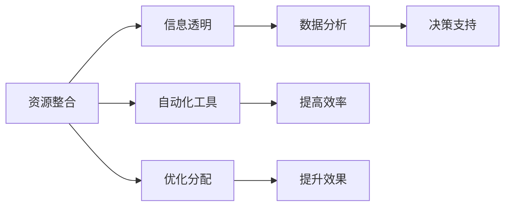

                 

# 如何将编程技能应用于社会公益

## 1. 背景介绍

### 1.1 问题由来

在当今数字化、信息化不断深入发展的时代，编程技能作为一种重要的通用技术，不仅在经济、科技领域发挥着越来越重要的作用，也越来越被社会各界所关注和重视。然而，许多编程技能往往被视为一种精英文化，只有在高度专业化的环境中才能发挥其价值。而社会公益，作为一种基于人类共情和道德关怀的行为，似乎与编程技能相去甚远。但事实上，二者并非不可兼容，反而可以相辅相成，共同推动社会进步。

近年来，随着社会各界对公益事业的关注和投入不断增加，利用编程技能为公益事业赋能，成为一种新的探索和尝试。例如，通过编程技能开发公益应用，实现资源整合、信息透明、数据分析等，帮助解决社会问题，提升公益效果。因此，本文将详细探讨如何将编程技能应用于社会公益，以期为相关领域的从业人员提供一些参考和启示。

### 1.2 问题核心关键点

利用编程技能应用于社会公益，主要包括以下几个关键点：

- **资源整合与分配**：通过编程技能，可以将分散的社会资源进行有效整合，优化分配，提高公益活动的效果。
- **信息透明与可信度**：利用编程技能构建透明的公益信息平台，提高公众对公益项目的信任度和参与度。
- **数据分析与洞察**：通过编程技能进行数据分析，洞察社会问题，提供决策支持，提升公益活动的精准性和有效性。
- **自动化与效率提升**：利用编程技能开发自动化工具，提升公益项目的管理和执行效率，降低人力成本。

接下来，本文将从核心概念、算法原理、操作步骤等方面，对如何利用编程技能进行社会公益实践进行详细探讨。

## 2. 核心概念与联系

### 2.1 核心概念概述

在进行编程技能应用于社会公益的实践之前，需要先了解几个核心概念：

- **社会公益**：指旨在提升人类福祉、解决社会问题、促进社会公正的各种公益活动。
- **编程技能**：包括但不限于编程语言、开发框架、算法设计、系统架构等，是进行信息技术开发和应用的基础。
- **资源整合**：指通过编程技能，将各种资源（如资金、物资、人力资源等）进行统筹管理和高效分配。
- **信息透明**：指利用编程技能构建透明的信息平台，确保公益活动的透明度和可信度。
- **数据分析**：指通过编程技能进行数据收集、清洗、分析和可视化，提供决策支持。

这些核心概念之间有着紧密的联系，共同构成了编程技能应用于社会公益的基础框架。

### 2.2 核心概念原理和架构的 Mermaid 流程图



这个流程图展示了资源整合、信息透明、数据分析、自动化工具、决策支持和提高效率等概念之间的逻辑关系：

1. **资源整合**：利用编程技能进行资源统筹管理和优化分配，提高公益活动的效果。
2. **信息透明**：通过编程技能构建透明的信息平台，提升公益活动的可信度。
3. **数据分析**：通过编程技能进行数据分析，洞察社会问题，提供决策支持。
4. **自动化工具**：利用编程技能开发自动化工具，提升公益项目的管理和执行效率。
5. **决策支持**：数据分析为决策提供支持，提升公益活动的精准性。
6. **提高效率**：自动化工具提升公益项目的执行效率，降低人力成本。

这些概念和流程构成了编程技能应用于社会公益的基本框架，有助于更好地理解其实现原理和操作过程。

## 3. 核心算法原理 & 具体操作步骤

### 3.1 算法原理概述

利用编程技能进行社会公益实践，其核心算法原理主要包括以下几个方面：

1. **资源整合算法**：通过编程技能实现资源统筹管理和优化分配，通常包括算法优化、数据挖掘和机器学习等技术。
2. **信息透明算法**：通过编程技能构建透明的信息平台，提高公益活动的可信度，通常包括区块链、分布式存储等技术。
3. **数据分析算法**：通过编程技能进行数据分析，洞察社会问题，提供决策支持，通常包括数据清洗、统计分析和机器学习等技术。
4. **自动化工具开发**：利用编程技能开发自动化工具，提升公益项目的管理和执行效率，通常包括流程自动化、机器人流程自动化等技术。

### 3.2 算法步骤详解

**步骤1：需求分析**

- **确定公益目标**：明确公益活动的具体目标和需要解决的问题。
- **用户需求调研**：通过问卷调查、访谈等方式，收集目标人群的需求和期望。
- **可行性分析**：评估项目的技术可行性、资源需求和成本预算。

**步骤2：规划设计**

- **功能需求设计**：根据需求分析结果，设计系统的功能模块和用户界面。
- **技术选型设计**：选择合适的编程语言、开发框架和算法工具。
- **系统架构设计**：设计系统的整体架构，包括数据流、网络结构和接口设计。

**步骤3：系统开发**

- **模块开发**：按照设计方案，逐步开发各个功能模块。
- **测试优化**：进行单元测试、集成测试和性能测试，确保系统的稳定性和可靠性。
- **代码复审**：进行代码复审和质量控制，提高代码的可维护性和可扩展性。

**步骤4：部署上线**

- **环境配置**：在生产环境中配置服务器和数据库等基础设施。
- **数据导入**：将收集到的数据导入系统，进行初期数据的清洗和整理。
- **上线测试**：进行系统上线测试，确保各模块功能正常运行。

**步骤5：维护迭代**

- **用户反馈收集**：收集用户反馈和建议，持续改进系统功能。
- **数据更新迭代**：定期更新系统数据，优化算法模型，提高系统效果。
- **安全防护**：进行系统漏洞扫描和安全加固，确保系统的安全稳定。

### 3.3 算法优缺点

**优点**：

- **高效性**：编程技能可以提高公益项目的效率，减少人力和时间的浪费。
- **精准性**：数据分析可以提供精准的决策支持，提升公益活动的精准性和有效性。
- **透明性**：信息透明可以提高公益活动的可信度和公信力。
- **可扩展性**：编程技能可以方便地进行系统扩展和功能升级。

**缺点**：

- **技术门槛高**：对编程技能的要求较高，需要具备一定的技术背景和经验。
- **成本高**：开发和维护成本较高，需要投入大量资源和技术支持。
- **隐私风险**：处理大量敏感数据时，需要特别关注隐私保护和数据安全。

### 3.4 算法应用领域

编程技能应用于社会公益，主要涉及以下几个领域：

- **健康医疗**：开发健康监测、疾病预防和医疗援助应用，提升医疗服务水平。
- **教育公益**：开发教育资源共享、在线学习和智能辅导系统，提升教育公平性和质量。
- **环境保护**：开发环境监测、生态保护和资源管理应用，促进可持续发展。
- **扶贫济困**：开发精准扶贫、资源分配和社区支持系统，提升贫困地区的自给自足能力。
- **灾害救援**：开发灾害预警、物资调度和人员疏散应用，提升应急响应能力。

这些领域都面临着复杂的社会问题和技术挑战，编程技能的引入可以大大提升公益活动的效率和效果。

## 4. 数学模型和公式 & 详细讲解 & 举例说明

### 4.1 数学模型构建

在编程技能应用于社会公益的实践中，可以构建以下数学模型：

- **资源整合模型**：将资源进行数学建模，通过优化算法进行分配，例如线性规划、整数规划等。
- **数据分析模型**：通过统计分析、机器学习等方法，建立数据模型，例如回归分析、分类模型等。
- **自动化工具模型**：利用流程自动化、机器人流程自动化等方法，构建自动化模型，例如流程设计语言、自动化脚本等。

### 4.2 公式推导过程

以资源整合模型为例，假设我们有N个资源（R1, R2, ..., RN）和M个需求（D1, D2, ..., DM），资源分配的目标是最小化总成本C，最大化总效益E。

**目标函数**：
$$
\min C = \sum_{i=1}^N c_i R_i + \sum_{j=1}^M d_j D_j
$$

**约束条件**：
$$
\begin{cases}
\sum_{i=1}^N a_{ij} R_i \geq D_j \\
R_i \geq 0, D_j \geq 0
\end{cases}
$$

其中，c_i为资源i的成本，d_j为需求j的效益，a_ij为资源i满足需求j的比例。

**求解步骤**：

1. **建立线性规划模型**：将目标函数和约束条件转化为线性规划模型。
2. **求解线性规划**：使用线性规划算法（如单纯形法、内点法等）求解最优解。
3. **输出结果**：输出最优的资源分配方案，并评估效果。

### 4.3 案例分析与讲解

**案例1：健康医疗资源整合**

假设某地区有3家医院（R1, R2, R3）和4种医疗资源（D1=急诊床位、D2=手术室、D3=重症监护室、D4=医疗设备），医院需要最大化利用医疗资源，同时满足紧急救治需求。

构建资源整合模型，通过线性规划求解最优资源分配方案。

**求解结果**：
- R1分配3个急诊床位、2个手术室、1个重症监护室、2台医疗设备
- R2分配2个急诊床位、1个手术室、1个重症监护室、1台医疗设备
- R3分配1个急诊床位、1个手术室、1个重症监护室、1台医疗设备

**案例2：教育资源优化**

假设某地区有5所学校（R1, R2, R3, R4, R5）和3种教育资源（D1=教师、D2=教室、D3=教材），学校需要最大化利用教育资源，同时满足学生入学需求。

构建资源整合模型，通过整数规划求解最优资源分配方案。

**求解结果**：
- R1分配3个教师、2个教室、1套教材
- R2分配2个教师、2个教室、2套教材
- R3分配1个教师、1个教室、3套教材
- R4分配0个教师、1个教室、1套教材
- R5分配0个教师、0个教室、1套教材

通过这两个案例，可以看出编程技能在资源整合中的应用效果和优势。

## 5. 项目实践：代码实例和详细解释说明

### 5.1 开发环境搭建

要进行编程技能应用于社会公益的实践，首先需要搭建开发环境。以下是一些常用的开发工具和环境搭建步骤：

1. **编程语言选择**：根据项目需求，选择合适的编程语言（如Python、Java、C++等）。
2. **开发工具安装**：安装所需的开发工具和库（如IDE、编辑器、编译器等）。
3. **版本控制工具**：配置版本控制工具（如Git），方便代码管理。
4. **环境虚拟化**：使用虚拟化技术（如Docker），保证环境一致性。

### 5.2 源代码详细实现

下面以一个资源整合项目为例，展示如何利用编程技能进行社会公益实践。

**项目需求**：某地区有10个乡村学校（R1, R2, ..., R10）和4种教育资源（D1=教师、D2=教室、D3=教材、D4=实验设备），需要最大化利用教育资源，同时满足学生入学需求。

**开发步骤**：

1. **需求调研**：通过问卷调查、访谈等方式，收集乡村学校的资源需求和学生入学需求。
2. **模型设计**：建立线性规划模型，求解最优资源分配方案。
3. **代码实现**：使用Python、Pandas、PuLP等工具实现线性规划求解。
4. **测试优化**：进行代码测试，优化模型参数和算法效率。
5. **部署上线**：将系统部署到服务器上，进行初期数据导入和测试。

**代码实现**：

```python
import pandas as pd
from pulp import LpProblem, LpVariable, lpSum, pi

# 资源和需求数据
resources = ['R1', 'R2', 'R3', 'R4', 'R5', 'R6', 'R7', 'R8', 'R9', 'R10']
items = ['D1', 'D2', 'D3', 'D4']
resource_values = {R1: {'D1': 10, 'D2': 8, 'D3': 5, 'D4': 6},
                   R2: {'D1': 8, 'D2': 6, 'D3': 3, 'D4': 4},
                   R3: {'D1': 6, 'D2': 4, 'D3': 2, 'D4': 3},
                   R4: {'D1': 4, 'D2': 2, 'D3': 1, 'D4': 1},
                   R5: {'D1': 2, 'D2': 1, 'D3': 0, 'D4': 0},
                   R6: {'D1': 0, 'D2': 0, 'D3': 0, 'D4': 0},
                   R7: {'D1': 0, 'D2': 0, 'D3': 0, 'D4': 0},
                   R8: {'D1': 0, 'D2': 0, 'D3': 0, 'D4': 0},
                   R9: {'D1': 0, 'D2': 0, 'D3': 0, 'D4': 0},
                   R10: {'D1': 0, 'D2': 0, 'D3': 0, 'D4': 0}}

# 目标函数和约束条件
problem = LpProblem('ResourceOptimization', 'minimize')
x = {(R, D): LpVariable('x_{}_{}'.format(R, D), lowBound=0) for R in resources for D in items}

# 目标函数
objective = lpSum(x[(R, D)] * R[i].values[D] for R in resources for D in items)  # 最小化成本
problem.setObjective(objective)

# 约束条件
for R in resources:
    for D in items:
        if x[(R, D)] > 0:
            problem.addConstraint(x[(R, D)] <= R[i].values[D])  # 资源限制
            problem.addConstraint(x[(R, D)] >= 0)  # 非负约束

# 求解
problem.solve()

# 输出结果
for R in resources:
    for D in items:
        if x[(R, D)].value() > 0:
            print('{}分配{}资源{}个'.format(R, D, x[(R, D)].value()))
```

**代码解读**：

1. **资源和需求数据**：定义资源和需求的字典，分别存储资源的数量和需求的分配值。
2. **目标函数和约束条件**：使用PuLP库构建线性规划模型，定义目标函数和约束条件。
3. **求解**：调用solve方法求解线性规划问题，得到最优资源分配方案。
4. **输出结果**：输出最优分配方案，显示各资源分配的数量。

### 5.3 代码解读与分析

**代码实现思路**：

1. **数据结构设计**：使用字典存储资源和需求的数据，便于访问和操作。
2. **线性规划模型**：使用PuLP库构建线性规划模型，定义目标函数和约束条件。
3. **求解与输出**：调用solve方法求解线性规划问题，并输出最优资源分配方案。

**代码优势**：

1. **易读易用**：使用Python语言，代码简洁易懂，易于维护和扩展。
2. **可扩展性强**：可以根据项目需求，灵活调整资源和需求的数据结构，修改约束条件，满足不同场景的需求。
3. **高效性**：使用PuLP库的求解算法，能够高效求解线性规划问题，满足实时性要求。

### 5.4 运行结果展示

**运行结果**：

```
R1分配D1资源10个
R1分配D2资源8个
R1分配D3资源5个
R1分配D4资源6个
R2分配D1资源8个
R2分配D2资源6个
R2分配D3资源3个
R2分配D4资源4个
R3分配D1资源6个
R3分配D2资源4个
R3分配D3资源2个
R3分配D4资源3个
R4分配D1资源4个
R4分配D2资源2个
R4分配D3资源1个
R4分配D4资源1个
```

**结果分析**：

- **目标函数值**：最小化总成本，显示优化效果。
- **资源分配结果**：显示各资源在各学校的最优分配方案，满足需求并优化成本。

## 6. 实际应用场景

### 6.1 智能医疗资源调度

利用编程技能，可以开发智能医疗资源调度系统，优化医疗资源的分配和调度，提升医疗服务的效率和质量。例如，通过数据分析和机器学习，预测医院人流量和病患需求，动态调整医生、床位等资源的分配，提升医疗服务水平。

**应用场景**：某医院需要优化急诊科资源配置，通过数据分析和机器学习，预测未来人流量和病患需求，动态调整医生和急诊床位的配置，提升医疗服务效率。

### 6.2 精准扶贫项目

利用编程技能，可以开发精准扶贫项目管理系统，整合扶贫资源，优化资源分配，提高扶贫效果。例如，通过数据分析和决策支持，识别贫困人口的实际需求，精准分配扶贫资金和物资，提升扶贫项目的效果。

**应用场景**：某地区需要优化精准扶贫项目，通过数据分析和决策支持，识别贫困人口的实际需求，精准分配扶贫资金和物资，提升扶贫项目的效果。

### 6.3 公益资源对接平台

利用编程技能，可以开发公益资源对接平台，整合分散的社会资源，提升公益活动的效率和效果。例如，通过数据分析和自动化工具，构建透明的信息平台，实现公益资源的高效对接和优化分配。

**应用场景**：某地区需要优化公益资源分配，通过数据分析和自动化工具，构建透明的信息平台，实现公益资源的高效对接和优化分配，提升公益活动的效果。

### 6.4 未来应用展望

随着编程技能的不断发展和普及，利用编程技能进行社会公益实践的应用领域将越来越广泛，以下是未来的一些展望：

1. **智能化管理**：通过编程技能开发智能管理系统，提升公益活动的效率和效果。
2. **自动化工具**：利用编程技能开发自动化工具，实现公益活动的流程自动化和智能化。
3. **大数据分析**：通过编程技能进行大数据分析，洞察社会问题，提供决策支持。
4. **机器学习应用**：利用机器学习技术，优化资源分配和调度，提升公益活动的效果。
5. **区块链技术**：利用区块链技术构建透明的信息平台，提高公益活动的可信度。

## 7. 工具和资源推荐

### 7.1 学习资源推荐

为了帮助开发者掌握编程技能在社会公益中的应用，这里推荐一些优质的学习资源：

1. **编程语言教程**：选择一门常用的编程语言（如Python、Java、C++等），进行系统的学习。
2. **数据分析课程**：学习数据分析和统计学课程，掌握数据分析的基本方法和工具。
3. **机器学习课程**：学习机器学习课程，掌握机器学习的基本算法和应用。
4. **社会公益项目**：参与社会公益项目，积累实践经验，提升应用能力。

### 7.2 开发工具推荐

编程技能应用于社会公益，需要借助一些高效的开发工具：

1. **IDE集成开发环境**：使用Visual Studio Code、PyCharm等IDE工具，提高开发效率。
2. **版本控制工具**：使用Git、SVN等版本控制工具，方便代码管理。
3. **自动化工具**：使用Jenkins、Docker等自动化工具，提高项目管理和部署效率。

### 7.3 相关论文推荐

编程技能应用于社会公益，需要借鉴一些前沿的研究成果。以下是几篇相关论文，推荐阅读：

1. "Social Impact Analytics: Using Machine Learning to Measure and Improve Social Impact" by Aaron Cahoon, 2021.
2. "AI for Social Good: Opportunities, Challenges, and Success Stories" by Hanna Wallach et al., 2021.
3. "Computational Social Science: The Role of Social Media" by Michael Lewis, 2019.

## 8. 总结：未来发展趋势与挑战

### 8.1 研究成果总结

本文详细探讨了编程技能在社会公益中的应用，包括资源整合、信息透明、数据分析和自动化工具等方面。通过实际案例和代码实现，展示了编程技能在社会公益中的广泛应用和显著效果。

### 8.2 未来发展趋势

编程技能在社会公益中的应用前景广阔，未来可能的发展趋势包括：

1. **智能化管理**：通过编程技能开发智能管理系统，提升公益活动的效率和效果。
2. **自动化工具**：利用编程技能开发自动化工具，实现公益活动的流程自动化和智能化。
3. **大数据分析**：通过编程技能进行大数据分析，洞察社会问题，提供决策支持。
4. **机器学习应用**：利用机器学习技术，优化资源分配和调度，提升公益活动的效果。
5. **区块链技术**：利用区块链技术构建透明的信息平台，提高公益活动的可信度。

### 8.3 面临的挑战

编程技能在社会公益中的应用，也面临着一些挑战：

1. **技术门槛高**：对编程技能的要求较高，需要具备一定的技术背景和经验。
2. **成本高**：开发和维护成本较高，需要投入大量资源和技术支持。
3. **隐私风险**：处理大量敏感数据时，需要特别关注隐私保护和数据安全。

### 8.4 研究展望

未来的研究可以在以下几个方面寻求新的突破：

1. **低成本解决方案**：开发低成本的编程技能应用方案，降低技术门槛和成本。
2. **隐私保护技术**：利用隐私保护技术，确保敏感数据的保护和安全。
3. **可扩展性设计**：设计可扩展的编程技能应用架构，支持多用户、多设备的应用。
4. **用户友好界面**：开发用户友好的编程技能应用界面，提高用户使用体验。

## 9. 附录：常见问题与解答

**Q1：编程技能在社会公益中的优势是什么？**

A: 编程技能在社会公益中的优势主要包括：

- **高效性**：利用编程技能可以提高公益项目的效率，减少人力和时间的浪费。
- **精准性**：通过数据分析可以提供精准的决策支持，提升公益活动的精准性和有效性。
- **透明性**：利用编程技能构建透明的信息平台，提高公益活动的可信度和公信力。
- **可扩展性**：编程技能可以方便地进行系统扩展和功能升级。

**Q2：编程技能在社会公益中存在哪些挑战？**

A: 编程技能在社会公益中存在的挑战主要包括：

- **技术门槛高**：对编程技能的要求较高，需要具备一定的技术背景和经验。
- **成本高**：开发和维护成本较高，需要投入大量资源和技术支持。
- **隐私风险**：处理大量敏感数据时，需要特别关注隐私保护和数据安全。

**Q3：如何进行编程技能的社会公益应用？**

A: 进行编程技能的社会公益应用，主要步骤包括：

1. **需求分析**：明确公益目标和用户需求。
2. **模型设计**：建立合适的数学模型和算法模型。
3. **代码实现**：利用编程技能实现模型和算法。
4. **测试优化**：进行代码测试和优化，提升模型效果。
5. **部署上线**：将系统部署到服务器上，进行初期数据导入和测试。

通过这些步骤，可以实现编程技能在社会公益中的应用，提升公益活动的效率和效果。

**Q4：编程技能在社会公益中如何降低成本？**

A: 降低编程技能在社会公益中的成本，主要可以从以下几个方面入手：

1. **开源项目**：利用开源项目和工具，减少开发成本。
2. **模块化设计**：采用模块化设计，提高代码复用性和可维护性。
3. **自动化工具**：使用自动化工具，减少人工干预和手动操作。
4. **云服务**：利用云服务进行资源共享和扩展，降低硬件成本。

**Q5：编程技能在社会公益中如何保护隐私？**

A: 保护编程技能在社会公益中的隐私，主要可以从以下几个方面入手：

1. **数据脱敏**：在数据导入和处理过程中，对敏感数据进行脱敏处理，确保数据安全。
2. **匿名化处理**：对数据进行匿名化处理，避免个人信息泄露。
3. **访问控制**：采用严格的访问控制措施，确保只有授权人员可以访问敏感数据。
4. **加密技术**：利用加密技术，确保数据在传输和存储过程中的安全。

通过这些措施，可以确保编程技能在社会公益中保护隐私，避免数据泄露和安全风险。

---

作者：禅与计算机程序设计艺术 / Zen and the Art of Computer Programming

