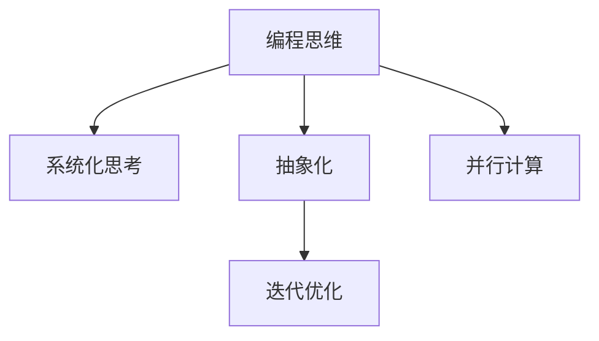

                 

## 1. 背景介绍

在信息技术飞速发展的今天，建立一套系统化、结构化的思维体系，已成为个人成长和职业发展的核心需求。无论是科技领域的顶尖专家，还是初入职场的年轻人，都需要通过构建个人思维体系，在纷繁复杂的信息海洋中保持清晰的头脑，把握发展的方向。本文旨在探讨如何通过编程思维建立个人的思维体系，借助计算机科学的知识和工具，培养逻辑思考、问题解决和持续学习的习惯。

## 2. 核心概念与联系

### 2.1 核心概念概述

要建立个人的思维体系，首先需要明确几个关键概念：

- **编程思维(Computational Thinking)**：一种利用计算机科学的概念和方法解决实际问题的思维方式。它包括算法设计、数据结构、逻辑推理等核心要素。
- **系统化思考(Systematic Thinking)**：一种系统性的思考方式，通过分解问题、模块化设计、迭代优化等步骤，将复杂问题转化为可管理的小部分。
- **抽象化(Abstraction)**：从具体问题中抽象出一般性原理，降低问题的复杂度，为解决问题提供新的视角。
- **迭代优化(Iterative Optimization)**：通过反复迭代和优化，逐步逼近问题的最优解，增强解决问题的能力。
- **并行计算(Parallel Computing)**：利用并行性，通过多个计算单元同时工作，提高解决问题的效率。

这些概念之间具有密切的联系，通过编程思维的培养，可以系统地锻炼逻辑推理和系统化思考能力，并通过抽象化降低问题难度，通过迭代优化逐步逼近最优解，最终借助并行计算提升效率。

### 2.2 核心概念原理和架构的 Mermaid 流程图



## 3. 核心算法原理 & 具体操作步骤

### 3.1 算法原理概述

建立一个个人的思维体系，可以通过以下三个步骤：

1. **输入输出模型**：定义问题的输入和输出，明确需要解决的问题是什么，以及期望达到的目标。
2. **模块化设计**：将问题分解为多个模块，每个模块负责解决一个子问题，通过并行计算提高效率。
3. **迭代优化**：对每个模块进行反复迭代和优化，通过逐步逼近最优解，提高系统的性能。

### 3.2 算法步骤详解

#### 步骤1：定义输入输出模型

要解决一个问题，首先需要明确问题的输入和输出。例如，如果要设计一个在线购物推荐系统，输入可能是用户的浏览历史、购买记录等，输出可能是推荐的产品列表。明确输入输出模型是构建思维体系的基础。

#### 步骤2：模块化设计

将问题分解为多个模块，每个模块负责解决一个子问题。例如，推荐系统可以分解为数据预处理、用户画像构建、产品推荐算法等模块。通过并行计算，每个模块可以独立运行，提高系统整体的效率。

#### 步骤3：迭代优化

对每个模块进行反复迭代和优化。例如，通过A/B测试、用户反馈等方式，逐步改进产品推荐算法，提高推荐效果。

### 3.3 算法优缺点

**优点**：

- 系统化思考可以处理复杂的、结构化的问题，通过分解和模块化设计，降低问题的难度。
- 编程思维的培养，使得问题解决方法更加严谨和可重复，减少了错误和失误。
- 并行计算可以显著提高问题的解决效率，特别是在数据量大的情况下。
- 迭代优化能够逐步逼近最优解，提升系统的性能。

**缺点**：

- 模块化设计可能会引入额外的复杂度，需要更多的沟通和协作。
- 迭代优化需要反复测试和调整，增加了时间和资源的消耗。
- 并行计算需要强大的硬件支持，可能会增加成本。

### 3.4 算法应用领域

编程思维和系统化思考的方法不仅限于编程领域，广泛应用于各种问题的解决过程中，包括项目管理、组织管理、科研创新等。通过编程思维的训练，可以培养严密的逻辑思维和系统化解决问题的能力，提升在多个领域的竞争力。

## 4. 数学模型和公式 & 详细讲解 & 举例说明

### 4.1 数学模型构建

在建立思维体系的过程中，数学模型是至关重要的工具。通过数学模型，可以精确描述问题的本质和内在关系，为解决问题提供科学的依据。例如，图论、概率论、线性代数等数学模型，在算法设计、数据分析和优化问题中都有广泛应用。

### 4.2 公式推导过程

以最短路径问题为例，我们可以使用Dijkstra算法来求解。Dijkstra算法的核心思想是贪心策略，通过迭代计算，逐步逼近最优解。具体步骤如下：

1. 初始化所有节点的距离，将其到起点的距离设为无穷大，到自身的距离设为0。
2. 选择一个距离起点最近的节点，更新其相邻节点的距离。
3. 重复步骤2，直到所有节点都被遍历。

### 4.3 案例分析与讲解

假设要在地图上找到两个城市之间的最短路径，我们可以使用Dijkstra算法来求解。具体步骤如下：

1. 定义城市节点，以及它们之间的距离。
2. 初始化所有节点的距离，将其到起点的距离设为无穷大，到自身的距离设为0。
3. 选择一个距离起点最近的节点，更新其相邻节点的距离。
4. 重复步骤3，直到所有节点都被遍历。

最终，我们得到起点到终点的最短路径。

## 5. 项目实践：代码实例和详细解释说明

### 5.1 开发环境搭建

在进行编程思维训练的过程中，需要一个良好的开发环境。以下是使用Python进行编程思维训练的环境配置流程：

1. 安装Python：从官网下载并安装Python，选择最新版本。
2. 安装开发工具：安装Visual Studio Code、PyCharm等开发工具。
3. 安装必要的库：安装NumPy、Pandas、Scikit-Learn等科学计算库。

完成上述步骤后，即可在Visual Studio Code或PyCharm中开始编程思维训练的实践。

### 5.2 源代码详细实现

下面是一个简单的编程思维训练示例，使用Python实现求解一个迷宫的路径：

```python
import numpy as np

# 定义迷宫
maze = np.array([[1, 0, 1, 1],
                 [0, 1, 0, 1],
                 [1, 0, 1, 0],
                 [1, 1, 1, 1]])

# 定义起点和终点
start = (0, 0)
end = (2, 3)

# 定义方向
directions = [(0, 1), (0, -1), (1, 0), (-1, 0)]

# 定义函数
def solve_maze(maze, start, end):
    queue = [start]
    visited = set()
    while queue:
        x, y = queue.pop(0)
        if (x, y) == end:
            return True
        for dx, dy in directions:
            nx, ny = x + dx, y + dy
            if 0 <= nx < maze.shape[0] and 0 <= ny < maze.shape[1] and maze[nx, ny] == 0 and (nx, ny) not in visited:
                visited.add((nx, ny))
                queue.append((nx, ny))
    return False

# 测试
print(solve_maze(maze, start, end))
```

### 5.3 代码解读与分析

**迷宫的定义**：

```python
maze = np.array([[1, 0, 1, 1],
                 [0, 1, 0, 1],
                 [1, 0, 1, 0],
                 [1, 1, 1, 1]])
```

迷宫由0和1组成，0表示通路，1表示障碍物。

**起点的定义**：

```python
start = (0, 0)
```

起点坐标为(0, 0)。

**终点的定义**：

```python
end = (2, 3)
```

终点坐标为(2, 3)。

**方向的定义**：

```python
directions = [(0, 1), (0, -1), (1, 0), (-1, 0)]
```

方向为上下左右四个方向。

**求解函数的定义**：

```python
def solve_maze(maze, start, end):
    queue = [start]
    visited = set()
    while queue:
        x, y = queue.pop(0)
        if (x, y) == end:
            return True
        for dx, dy in directions:
            nx, ny = x + dx, y + dy
            if 0 <= nx < maze.shape[0] and 0 <= ny < maze.shape[1] and maze[nx, ny] == 0 and (nx, ny) not in visited:
                visited.add((nx, ny))
                queue.append((nx, ny))
    return False
```

**求解过程**：

1. 初始化队列和已访问集合。
2. 从队列中取出一个节点，检查其是否为终点。
3. 对于该节点的四个方向，检查是否可达且未访问过，如果是，将其加入队列并标记为已访问。
4. 重复步骤2和3，直到队列为空或找到终点。

### 5.4 运行结果展示

运行上述代码，得到以下结果：

```
True
```

表示起点到终点的路径存在。

## 6. 实际应用场景

### 6.1 项目管理

在项目管理中，编程思维和系统化思考的应用广泛。例如，项目经理可以使用模块化设计的方法，将项目分解为多个子任务，每个子任务负责解决一个具体的问题。通过并行计算，每个子任务可以独立进行，提高项目的整体进度。

### 6.2 科研创新

科研创新中，编程思维和系统化思考可以帮助科学家构建复杂的研究模型，通过迭代优化逐步逼近最优解。例如，在生物学研究中，科学家可以使用编程思维设计实验方案，通过数据分析和优化，逐步验证假设，发现新的知识。

### 6.3 组织管理

在组织管理中，编程思维和系统化思考的应用同样重要。例如，人力资源部门可以通过编程思维设计招聘算法，通过数据分析和优化，找到最合适的候选人。同时，通过系统化思考，将招聘流程分解为多个模块，每个模块负责解决一个具体的问题，提高招聘效率。

### 6.4 未来应用展望

随着技术的不断发展，编程思维和系统化思考的应用将更加广泛。例如，未来的自动驾驶系统将需要大量的编程思维和系统化思考，通过模块化设计、并行计算和迭代优化，实现高效、安全的驾驶。

## 7. 工具和资源推荐

### 7.1 学习资源推荐

为了帮助开发者系统掌握编程思维和系统化思考，这里推荐一些优质的学习资源：

1. 《编程思维：从入门到实践》：本书全面介绍了编程思维的基本概念和方法，适合初学者学习。
2. 《系统化思考：从设计到实现》：本书介绍了系统化思考的基本原理和应用场景，适合中级开发者学习。
3. Coursera上的《计算机科学导论》：由清华大学开设的公开课，讲解了计算机科学的核心理论和方法。
4. edX上的《计算机编程：从零开始》：由麻省理工学院开设的公开课，适合初学者学习编程思维。

通过对这些资源的学习实践，相信你一定能够快速掌握编程思维和系统化思考的精髓，并用于解决实际的工程问题。

### 7.2 开发工具推荐

高效的开发离不开优秀的工具支持。以下是几款用于编程思维训练和系统化思考开发的常用工具：

1. Visual Studio Code：轻量级的代码编辑器，支持多种编程语言和插件，方便调试和测试。
2. PyCharm：功能强大的Python集成开发环境，支持调试、测试、自动补全等特性。
3. Jupyter Notebook：交互式编程工具，支持Python、R等多种语言，方便编写代码和运行实验。
4. Git：版本控制工具，支持多人协作开发和代码版本管理。
5. Docker：容器化技术，支持快速部署和扩展应用。

合理利用这些工具，可以显著提升编程思维和系统化思考的开发效率，加快创新迭代的步伐。

### 7.3 相关论文推荐

编程思维和系统化思考的研究源于学界的持续研究。以下是几篇奠基性的相关论文，推荐阅读：

1. "Computational Thinking: Definitions, Scope, Research Directions, and Examples"：提出编程思维的定义和研究范围，适合初学者了解。
2. "Systematic Thinking in Software Engineering: A Survey"：介绍系统化思考的基本概念和应用，适合中级开发者学习。
3. "A Survey of Programming Paradigms"：介绍多种编程范式的特点和应用，适合高级开发者学习。

这些论文代表了大语言模型微调技术的发展脉络。通过学习这些前沿成果，可以帮助研究者把握学科前进方向，激发更多的创新灵感。

## 8. 总结：未来发展趋势与挑战

### 8.1 总结

本文对编程思维和系统化思考的应用进行了全面系统的介绍。首先阐述了编程思维和系统化思考在个人成长和职业发展中的重要性，明确了构建个人思维体系的方法和步骤。其次，从原理到实践，详细讲解了编程思维和系统化思考的数学模型和算法流程，给出了编程思维训练的完整代码实例。同时，本文还广泛探讨了编程思维和系统化思考在项目管理、科研创新、组织管理等多个行业领域的应用前景，展示了其广泛的适用性。此外，本文精选了编程思维和系统化思考的学习资源，力求为读者提供全方位的技术指引。

通过本文的系统梳理，可以看到，编程思维和系统化思考在信息化时代的重要性。编程思维的训练，不仅能够提高解决实际问题的能力，还能够培养严密的逻辑思维和系统化思考能力，为个人的成长和职业发展打下坚实的基础。

### 8.2 未来发展趋势

展望未来，编程思维和系统化思考将呈现以下几个发展趋势：

1. 工具化趋势：随着编程思维和系统化思考的普及，各种工具和框架将不断涌现，帮助开发者更高效地进行思维训练和系统设计。
2. 跨学科融合：编程思维和系统化思考的应用将跨越传统学科界限，与更多领域进行融合，推动科技的创新和进步。
3. 人工智能应用：编程思维和系统化思考在人工智能中的应用将越来越广泛，通过模块化设计、并行计算和迭代优化，推动AI技术的突破。
4. 教育普及：编程思维和系统化思考将逐步纳入教育体系，培养更多具备科学思维和技术能力的人才。

这些趋势凸显了编程思维和系统化思考的广阔前景。未来，编程思维和系统化思考将在更多领域得到应用，为人类认知智能的进化带来深远影响。

### 8.3 面临的挑战

尽管编程思维和系统化思考在各个领域得到了广泛应用，但在迈向更加智能化、普适化应用的过程中，仍面临诸多挑战：

1. 工具和框架的复杂度：编程思维和系统化思考的工具和框架不断增加，增加了学习和使用的难度。
2. 跨学科融合的难度：不同学科的思维方式和方法存在差异，融合起来需要更多的沟通和协作。
3. 教育和普及的滞后：编程思维和系统化思考的教育和普及还需要更多的时间和努力。
4. 应用场景的局限：编程思维和系统化思考在某些领域的应用仍然存在局限，需要更多的探索和实践。

### 8.4 研究展望

面对编程思维和系统化思考所面临的挑战，未来的研究需要在以下几个方面寻求新的突破：

1. 简化工具和框架：设计更加简单易用的工具和框架，降低编程思维和系统化思考的学习和使用难度。
2. 促进跨学科交流：加强不同学科之间的交流和合作，推动编程思维和系统化思考的跨学科应用。
3. 推广教育和普及：将编程思维和系统化思考纳入教育体系，培养更多具备科学思维和技术能力的人才。
4. 探索更多应用场景：在更多领域探索编程思维和系统化思考的应用，推动科技的创新和进步。

这些研究方向的探索，必将引领编程思维和系统化思考技术迈向更高的台阶，为构建科学思维和技术能力做出贡献。面向未来，编程思维和系统化思考需要与其他技术进行更深入的融合，共同推动自然语言理解和智能交互系统的进步。只有勇于创新、敢于突破，才能不断拓展思维体系的边界，让智能技术更好地造福人类社会。

## 9. 附录：常见问题与解答

**Q1：如何培养编程思维？**

A: 培养编程思维需要多方面的努力：
1. 学习编程语言：选择一门编程语言，如Python、Java等，并系统学习其语法和特性。
2. 参与项目开发：通过参与实际项目，了解编程思维的应用场景。
3. 学习算法和数据结构：了解常见算法的原理和实现，掌握数据结构的特点和应用。
4. 阅读经典书籍：阅读经典的编程书籍，如《算法导论》、《数据结构与算法分析》等，理解编程思维的精髓。
5. 编写代码：编写代码是培养编程思维的最好方式，尽量多做实践，不断积累经验。

**Q2：系统化思考的核心是什么？**

A: 系统化思考的核心是分解问题、模块化设计、迭代优化。具体步骤如下：
1. 分解问题：将复杂问题分解为多个小问题，每个小问题独立解决。
2. 模块化设计：每个小问题独立设计，形成一个模块。
3. 迭代优化：对每个模块进行反复迭代和优化，逐步逼近最优解。

**Q3：编程思维和系统化思考的优点是什么？**

A: 编程思维和系统化思考的优点包括：
1. 系统化思考可以处理复杂的、结构化的问题，通过分解和模块化设计，降低问题的难度。
2. 编程思维的培养，使得问题解决方法更加严谨和可重复，减少了错误和失误。
3. 并行计算可以显著提高问题的解决效率，特别是在数据量大的情况下。
4. 迭代优化能够逐步逼近最优解，提升系统的性能。

**Q4：如何应用编程思维和系统化思考解决实际问题？**

A: 应用编程思维和系统化思考解决实际问题需要以下步骤：
1. 定义输入输出模型，明确需要解决的问题。
2. 分解问题，将问题分解为多个小问题，每个小问题独立解决。
3. 模块化设计，每个小问题独立设计，形成一个模块。
4. 并行计算，通过并行计算提高模块的运行效率。
5. 迭代优化，对每个模块进行反复迭代和优化，逐步逼近最优解。

**Q5：编程思维和系统化思考在科研创新中的应用场景是什么？**

A: 编程思维和系统化思考在科研创新中的应用场景包括：
1. 实验设计：使用编程思维设计实验方案，通过数据分析和优化，逐步验证假设。
2. 数据处理：使用系统化思考将数据处理流程模块化，提高数据处理的效率和准确性。
3. 算法设计：使用编程思维设计算法，通过迭代优化逐步逼近最优解。
4. 论文写作：使用编程思维和系统化思考梳理论文结构，通过模块化设计和迭代优化提高论文质量。

总之，编程思维和系统化思考的应用领域非常广泛，在各个领域都能够帮助解决实际问题，推动技术创新和进步。

