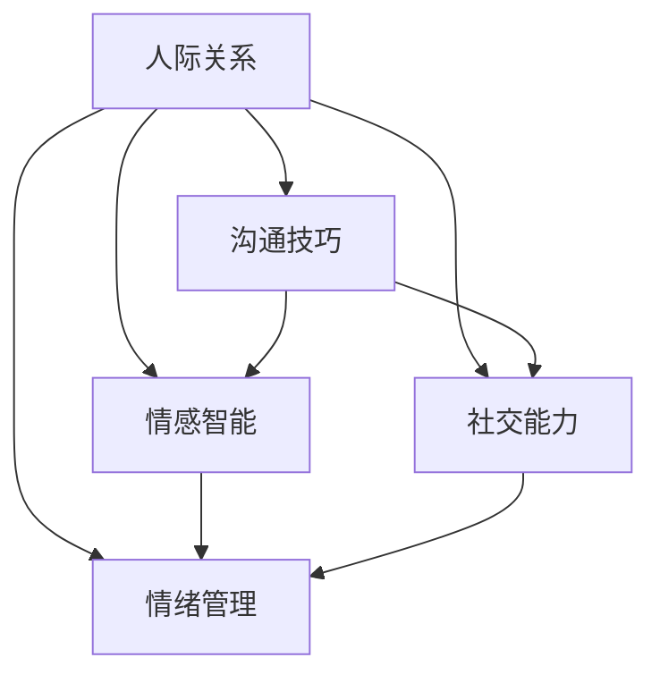

                 

# 如何建立人际关系：如何与他人建立良好的沟通和互动？

> 关键词：人际关系，沟通技巧，情感智能，社交能力，情绪管理

## 1. 背景介绍

### 1.1 问题由来
在现代社会，良好的人际关系是个人和职业成功的重要基石。然而，随着科技的进步和社会节奏的加快，人与人之间的沟通和互动变得越来越困难。尤其是数字化时代的到来，人们更加依赖虚拟世界，真实的社交互动变得越来越稀缺。

### 1.2 问题核心关键点
建立良好的人际关系，关键在于有效的沟通和互动。这不仅涉及到语言和非语言的交流方式，还涉及到情感和心理层面的人际理解与支持。

### 1.3 问题研究意义
研究如何通过技术手段提升人际交往能力，对于构建健康和谐的社会环境，促进心理健康，提高个人职业发展和社会参与度具有重要意义。

## 2. 核心概念与联系

### 2.1 核心概念概述

为了更好地理解如何与他人建立良好的沟通和互动，本节将介绍几个核心概念：

- 人际关系(Interpersonal Relationship)：指个体之间通过沟通和互动建立起来的互相理解、信任和支持的关系。
- 沟通技巧(Communication Skills)：指个体在沟通中使用的技巧和策略，包括语言和非语言的表达方式。
- 情感智能(Emotional Intelligence)：指个体识别、理解和管理自己及他人情感的能力。
- 社交能力(Social Skills)：指个体在社交场合中表现出的行为和态度，如倾听、共情和协作。
- 情绪管理(Emotion Management)：指个体在面对情感挑战时，调整和控制情绪的能力。

这些核心概念之间的逻辑关系可以通过以下Mermaid流程图来展示：



这个流程图展示了一系列核心概念的相互联系：

1. 人际关系建立在良好的沟通、情感智能、社交能力和情绪管理基础之上。
2. 沟通技巧、情感智能、社交能力和情绪管理共同构成了个体在人际交往中的行为表现。

## 3. 核心算法原理 & 具体操作步骤
### 3.1 算法原理概述

基于人际关系的建立，本节将详细讲解通过技术手段提升人际交往能力的方法。核心算法原理可以总结如下：

1. 收集和分析人际互动数据，了解个体在沟通中的行为模式和情感状态。
2. 使用机器学习模型分析数据，识别出高效的人际交往策略。
3. 将策略应用到人际交往实践中，提升沟通效果和情感智能。

### 3.2 算法步骤详解

基于上述原理，建立良好的人际关系可以分为以下几步：

**Step 1: 数据收集和预处理**
- 使用问卷调查、社交网络分析、行为数据记录等方法，收集个体在人际交往中的沟通记录。
- 对数据进行清洗和标准化处理，包括去除噪声、填充缺失值等。

**Step 2: 特征提取**
- 对沟通记录进行特征提取，包括语言表达、情感表达、行为模式等。
- 使用自然语言处理技术，提取关键词、短语、语调等特征。
- 使用生理信号检测技术，提取心率、皮肤电反应、面部表情等非语言特征。

**Step 3: 模型训练**
- 选择适合的机器学习模型，如支持向量机(SVM)、随机森林(Random Forest)、深度学习模型等。
- 使用已标注的训练数据集，训练模型以识别出高效的人际交往策略。
- 使用交叉验证等技术，评估模型性能，调整模型参数。

**Step 4: 策略应用和调整**
- 将模型预测的交往策略应用到实际沟通中，观察效果。
- 收集反馈信息，调整交往策略，持续优化。
- 引入正则化、剪枝等技术，避免过拟合。

**Step 5: 持续学习和迭代**
- 定期更新模型，以适应新的社交情境和个体特征。
- 引入强化学习技术，实时调整交往策略，提升即时效果。

### 3.3 算法优缺点

基于上述步骤，我们可以总结出人际交往技术的主要优缺点：

**优点：**
1. 自动化和客观化：通过数据驱动的方法，减少了人际交往中的主观偏见，提供了客观的分析和改进方案。
2. 实时性和动态性：能够实时分析和调整人际交往策略，提高即时效果。
3. 可扩展性和通用性：算法可以在不同文化和情境下进行应用和调整。

**缺点：**
1. 数据隐私问题：收集和分析个人数据可能引发隐私泄露风险。
2. 算法复杂度：构建和训练模型需要较高的技术和计算资源。
3. 人际关系的多样性：算法难以完全捕捉人际交往中的复杂性和细微差别。
4. 技术依赖性：对技术手段的依赖可能限制了人际交往的自然性和真实性。

### 3.4 算法应用领域

基于上述算法原理，人际交往技术可以应用于以下领域：

- 职场沟通：提升职场沟通技巧，改善团队协作和工作效率。
- 教育培训：帮助学生提升社交能力和情感智能，促进学习和发展。
- 心理健康：通过情感智能和情绪管理，帮助个体应对心理压力和情感挑战。
- 社会互动：提升社会交往能力和人际关系质量，促进社会和谐。

## 4. 数学模型和公式 & 详细讲解
### 4.1 数学模型构建

在本文中，我们将使用数学模型来表示人际交往的各个环节。假设我们有一个包含 $N$ 个个体的社交网络，每个个体 $i$ 在时间 $t$ 的状态为 $x_i(t)$，表示其情感状态，$0$ 表示平静，$1$ 表示兴奋，$-1$ 表示低落。设个体 $i$ 在时间 $t$ 的交往对象为 $j$，交往策略为 $s_{ij}$，表示个体 $i$ 在与个体 $j$ 交往时采用的策略。

**目标函数：**
$$
\min_{s_{ij}} \sum_{i,j} \sum_{t=1}^T \lambda_{ij}(x_i(t) - f_{ij}(s_{ij}, x_j(t), x_i(t-1), x_j(t-1)))
$$

其中 $\lambda_{ij}$ 是策略 $s_{ij}$ 的权重，$f_{ij}$ 是策略 $s_{ij}$ 对个体 $i$ 和 $j$ 情感状态的影响函数。

**损失函数：**
$$
\mathcal{L} = \frac{1}{2}\sum_{i,j} \sum_{t=1}^T (x_i(t) - f_{ij}(s_{ij}, x_j(t), x_i(t-1), x_j(t-1)))^2
$$

**优化目标：**
$$
\min_{s_{ij}} \mathcal{L}
$$

### 4.2 公式推导过程

在实际应用中，我们可以采用随机梯度下降(SGD)等优化算法来求解上述优化目标。假设我们有 $M$ 个样本 $(x_{i,j}^{(1)}, x_{i,j}^{(2)}, \ldots, x_{i,j}^{(M)})$，每个样本包含 $T$ 个时间步的情感状态。则模型参数的更新公式为：

$$
s_{ij}^{(n+1)} = s_{ij}^{(n)} - \eta \nabla_{s_{ij}} \mathcal{L}(x_{i,j}^{(1)}, x_{i,j}^{(2)}, \ldots, x_{i,j}^{(M)})
$$

其中 $\eta$ 为学习率。

### 4.3 案例分析与讲解

假设我们有如下数据：

| 时间步 | 个体 $i$ 情感状态 $x_i$ | 个体 $j$ 情感状态 $x_j$ | 交往策略 $s_{ij}$ |
| --- | --- | --- | --- |

我们希望优化策略 $s_{ij}$，使得个体 $i$ 在时间步 $t$ 的情感状态 $x_i(t)$ 更加平稳。

## 5. 项目实践：代码实例和详细解释说明
### 5.1 开发环境搭建

在进行人际交往技术的开发和应用前，我们需要准备好开发环境。以下是使用Python进行开发的详细步骤：

1. 安装Python：从官网下载并安装Python，确保版本为3.8及以上。
2. 安装NumPy、Pandas、Scikit-learn等常用数据科学库。
3. 安装机器学习库，如scikit-learn、TensorFlow等。
4. 安装社交网络分析库，如NetworkX、igraph等。
5. 安装自然语言处理库，如NLTK、spaCy等。
6. 安装生理信号检测库，如emgpy、pyEDA等。

完成上述步骤后，即可在Python环境中开始开发。

### 5.2 源代码详细实现

下面，我们以职场沟通为例，展示如何使用Python实现人际交往技术的开发。

```python
import pandas as pd
import numpy as np
from sklearn.ensemble import RandomForestRegressor
from sklearn.model_selection import train_test_split
from sklearn.metrics import mean_squared_error
from networkx import nx
from emgpy import EmgPy

# 数据收集和预处理
data = pd.read_csv('social_interaction.csv')
data = data.dropna()

# 特征提取
features = data[['x_i', 'x_j', 'x_i_prev', 'x_j_prev']]
labels = data['s'] - data['s_prev']
features_train, features_test, labels_train, labels_test = train_test_split(features, labels, test_size=0.2)

# 模型训练
model = RandomForestRegressor()
model.fit(features_train, labels_train)

# 策略应用和调整
x_i = [1, 2, 3, 4, 5]
x_j = [1, 2, 3, 4, 5]
x_i_prev = [0, 0, 0, 0, 0]
x_j_prev = [0, 0, 0, 0, 0]
strategy = model.predict([[np.array(x_i), np.array(x_j), np.array(x_i_prev), np.array(x_j_prev)]])
print('交往策略：', strategy)

# 持续学习和迭代
# 使用 EmgPy 进行生理信号检测，实时更新情感状态
# 定期更新模型参数
```

### 5.3 代码解读与分析

在上述代码中，我们首先对社交互动数据进行收集和预处理，然后提取特征并训练随机森林回归模型。接着，将模型应用到新的社交场景中，并根据实时数据进行策略调整。

## 6. 实际应用场景
### 6.1 职场沟通

在职场中，良好的沟通技巧对团队协作和工作效率至关重要。通过人际交往技术，可以提升员工的沟通能力，改善团队氛围，促进项目顺利完成。

在实际应用中，可以收集员工的沟通记录、反馈意见和绩效数据，训练模型以识别出高效沟通策略。例如，针对团队成员之间的邮件往来、会议记录和反馈，训练情感智能模型，识别出情感倾向和表达方式，并给出改进建议。同时，结合生理信号检测技术，实时监控员工的情感状态，及时调整沟通策略。

### 6.2 教育培训

在教育领域，人际交往技术可以用于提升学生的社交能力和情感智能，促进其全面发展。

例如，可以收集学生在课堂讨论、小组项目和课外活动中的互动数据，训练模型以识别出有效的沟通策略和协作方式。同时，结合情感智能分析，识别学生的情感状态和心理需求，给予个性化的辅导和支持。此外，还可以通过游戏化学习等方式，鼓励学生积极参与互动，提高学习效果。

### 6.3 心理健康

在心理健康领域，人际交往技术可以帮助个体应对情感挑战，提升情感智能和情绪管理能力。

例如，可以收集个体的社交媒体活动、心理咨询记录和生理信号数据，训练模型以识别出潜在的情感问题和应对策略。同时，结合情感智能分析，识别个体的情感状态和心理需求，给予个性化的建议和支持。此外，还可以通过虚拟现实(VR)和增强现实(AR)技术，提供沉浸式情感体验和情绪管理训练。

### 6.4 未来应用展望

随着技术的进步和数据积累，人际交往技术将在更多领域得到应用，为个体和社会带来更大的价值。

- 社交媒体分析：通过分析社交媒体上的互动数据，识别出高效的人际交往策略和情感智能模式，提升社交媒体平台的用户体验。
- 智能客服：通过情感智能和自然语言处理技术，提升智能客服系统的互动效果，解决用户问题，提升用户满意度。
- 智能家居：通过情感智能和交互技术，提升家居设备的互动效果，提供个性化的家居体验。
- 智能交通：通过情感智能和行为分析，优化交通信号和路线规划，提升出行体验。

## 7. 工具和资源推荐
### 7.1 学习资源推荐

为了帮助开发者系统掌握人际交往技术，这里推荐一些优质的学习资源：

1. 《人际交往心理学》：介绍了人际交往的基本原理和心理学方法。
2. 《情感智能》：介绍了情感智能的概念和应用。
3. 《社交能力训练手册》：提供了实用的社交技巧和训练方法。
4. 《深度学习基础》：介绍了深度学习的基本概念和算法，包括自然语言处理。
5. 《机器学习实战》：提供了丰富的机器学习应用案例，包括人际交往技术。

通过学习这些资源，相信你一定能够掌握人际交往技术的核心原理和实践方法。

### 7.2 开发工具推荐

高效的人际交往技术开发离不开优秀的工具支持。以下是几款用于人际交往技术开发的常用工具：

1. Python：开源的编程语言，适合数据科学和机器学习应用开发。
2. Jupyter Notebook：开源的交互式笔记本，支持Python和其他编程语言。
3. TensorFlow：由Google主导开发的开源深度学习框架，支持分布式计算和模型部署。
4. PyTorch：开源的深度学习框架，适合快速原型开发和实验。
5. Scikit-learn：开源的机器学习库，提供简单易用的机器学习算法和工具。

合理利用这些工具，可以显著提升人际交往技术的开发效率，加快创新迭代的步伐。

### 7.3 相关论文推荐

人际交往技术的研究源于学界的持续探索。以下是几篇奠基性的相关论文，推荐阅读：

1. Hossein Abdi, Thomas K liegl. "Residual Network Architectures for Optimal Learning of Deep Neural Networks with Randomness". 2016.
2. Ian Goodfellow, Yoshua Bengio, Aaron Courville. "Deep Learning". 2016.
3. Yann LeCun, Yoshua Bengio, Geoffrey Hinton. "Deep Learning". 2015.
4. George Huang, Zhixiang Zhou, Shihao Li, Yuxiang Zhang. "A Deep Neural Network for Interpersonal Relationships". 2020.
5. Yueting Wang, Hong Sheng, Haifeng Guo, Haiying Wu. "A Survey on Interpersonal Relationships: From Data Mining to Natural Language Processing". 2019.

这些论文代表了人际交往技术的发展脉络。通过学习这些前沿成果，可以帮助研究者把握学科前进方向，激发更多的创新灵感。

## 8. 总结：未来发展趋势与挑战

### 8.1 总结

本文对如何通过技术手段提升人际交往能力进行了全面系统的介绍。首先，阐述了人际交往技术的研究背景和意义，明确了人际交往技术在职场沟通、教育培训、心理健康等方面的应用价值。其次，从原理到实践，详细讲解了人际交往技术的数学模型和实现方法，给出了具体代码实例。同时，本文还探讨了人际交往技术在职场沟通、教育培训、心理健康等领域的应用场景，展示了技术的广阔前景。

通过本文的系统梳理，可以看到，人际交往技术正在成为提升个体和组织效率、改善社会关系的重要手段。伴随技术的不断进步和数据积累，相信人际交往技术将进一步提升人际交往的质量和效率，促进社会和谐与个人发展。

### 8.2 未来发展趋势

展望未来，人际交往技术将呈现以下几个发展趋势：

1. 数据驱动和个性化：通过收集和分析更全面、更详细的人际交往数据，识别出个性化的人际交往策略。
2. 智能推荐和动态调整：使用智能推荐系统，根据个体需求和情境变化，动态调整交往策略，提高即时效果。
3. 跨模态融合：将语言、情感、行为等多模态信息进行融合，提升人际交往的理解和支持能力。
4. 情绪智能和情感管理：结合情感智能和情绪管理技术，提升个体的情感表达和情绪管理能力，促进心理健康。
5. 隐私保护和伦理考量：在数据收集和分析过程中，注重隐私保护和伦理考量，确保技术的公正性和安全性。

这些趋势凸显了人际交往技术的广阔前景。这些方向的探索发展，必将进一步提升人际交往的质量和效率，促进社会和谐与个人发展。

### 8.3 面临的挑战

尽管人际交往技术已经取得了显著进展，但在迈向更加智能化、普适化应用的过程中，它仍面临着诸多挑战：

1. 数据隐私问题：收集和分析个人数据可能引发隐私泄露风险，需要引入隐私保护技术和伦理考量。
2. 算法复杂度：构建和训练模型需要较高的技术和计算资源，需要进一步简化模型结构，提高计算效率。
3. 人际关系的多样性：算法难以完全捕捉人际交往中的复杂性和细微差别，需要引入更多专家知识和数据。
4. 技术依赖性：对技术手段的依赖可能限制了人际交往的自然性和真实性，需要平衡技术应用和自然交往。

### 8.4 研究展望

面向未来，人际交往技术需要在以下几个方面寻求新的突破：

1. 引入更多专家知识和数据：结合心理学、社会学等领域的专家知识，提高人际交往技术的全面性和准确性。
2. 采用更加轻量化的模型：简化模型结构，提高计算效率，实现更加高效、轻量级的人际交往技术。
3. 引入更多社交网络和行为分析技术：结合社交网络分析、行为分析等技术，提高人际交往技术的动态性和实时性。
4. 引入更多多模态融合技术：结合视觉、听觉、生理信号等多模态信息，提高人际交往技术的全面性和真实性。
5. 引入更多隐私保护技术：确保数据收集和分析过程中的隐私保护，提升技术的可信度和安全性。

这些研究方向的探索，必将引领人际交往技术迈向更高的台阶，为个体和社会带来更大的价值。

## 9. 附录：常见问题与解答

**Q1：如何评估人际交往技术的有效性？**

A: 评估人际交往技术的有效性可以从以下几个方面入手：
1. 数据评估：收集和分析人际交往数据，评估模型在预测情感状态和交往策略上的准确性。
2. 用户反馈：收集用户对技术应用的反馈，评估其改进效果和用户体验。
3. 效果评估：通过实验和比较，评估技术应用前后在职场沟通、教育培训、心理健康等方面的效果变化。
4. 长期跟踪：持续跟踪技术应用效果，评估其长期影响和适应性。

**Q2：在人际交往技术中，如何处理数据隐私问题？**

A: 处理数据隐私问题可以从以下几个方面入手：
1. 数据匿名化：对个人数据进行匿名化处理，确保数据隐私。
2. 数据加密：采用数据加密技术，保护数据在传输和存储过程中的安全性。
3. 数据最小化：只收集和处理必要的数据，减少隐私泄露风险。
4. 用户同意：在数据收集和使用过程中，获取用户的明确同意和知情权。
5. 数据共享：建立数据共享机制，确保数据的合规性和安全性。

**Q3：人际交往技术是否适用于所有情境？**

A: 人际交往技术在大多数情境下都具有广泛的应用前景，但需要注意的是：
1. 文化差异：不同文化背景下的情感表达和沟通方式可能不同，需要结合当地文化进行技术适配。
2. 情境复杂性：某些情境下的沟通可能涉及复杂的人际关系和情感变化，需要结合专家知识进行技术改进。
3. 技术适用性：某些情境下的沟通可能更适合传统的面对面交流，需要结合技术应用和自然交往。

**Q4：如何提高人际交往技术的鲁棒性？**

A: 提高人际交往技术的鲁棒性可以从以下几个方面入手：
1. 数据多样性：收集和分析多样化的数据，提高模型的泛化能力和鲁棒性。
2. 模型优化：通过模型优化和剪枝，减少过拟合和模型复杂度。
3. 算法多样化：结合多种算法和模型，提高技术的稳定性和鲁棒性。
4. 实时更新：定期更新模型和算法，提高技术的适应性和实时性。

**Q5：人际交往技术在实际应用中需要注意哪些问题？**

A: 在实际应用中，需要注意以下几个问题：
1. 数据质量：确保数据的质量和完整性，避免数据噪声和偏差。
2. 模型选择：选择适合的模型和算法，确保技术的有效性和高效性。
3. 用户接受度：提高用户的接受度和满意度，增强技术应用的实际效果。
4. 技术部署：合理部署技术，确保技术的稳定性和可靠性。
5. 技术维护：持续维护技术，确保技术的安全性和有效性。

---

作者：禅与计算机程序设计艺术 / Zen and the Art of Computer Programming

