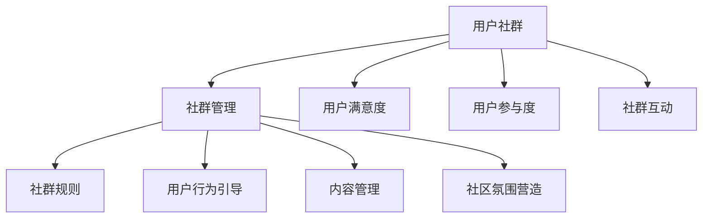

                 

## 1. 背景介绍

### 1.1 问题由来

在互联网和数字技术的推动下，用户社群日益成为企业与用户沟通、协作的重要平台。良好的用户社群不仅能提升用户满意度，还能促进企业产品创新、品牌建设和市场营销。然而，如何建立长期稳定的用户社群，是众多企业面临的共同难题。

### 1.2 问题核心关键点

建立长期稳定的用户社群，需要关注以下核心问题：

- **用户参与度**：如何吸引并维持用户积极参与社群活动，提升社群活跃度。
- **用户满意度**：如何通过社群活动和内容输出，提升用户对品牌的认同感和忠诚度。
- **社群治理**：如何建立合理的社群规则和机制，维护社群秩序，减少冲突。
- **数据利用**：如何利用用户社群中的数据，驱动业务增长和产品改进。

### 1.3 问题研究意义

研究如何建立长期稳定的用户社群，对于企业实现用户粘性、提高品牌影响力、优化产品设计具有重要意义。通过深入分析社群建设中的关键要素，探索有效的社群管理策略，企业可以更好地连接用户，提升整体业务竞争力。

## 2. 核心概念与联系

### 2.1 核心概念概述

为更好地理解建立长期稳定用户社群的框架和方法，本节将介绍几个关键概念：

- **用户社群**：指围绕特定主题、兴趣或需求，由用户自发形成的网络群体。用户社群可以是线上或线下的，具有明显的社区特征，如互动性强、信息共享、归属感等。

- **社群管理**：指企业对用户社群的运营、治理和维护工作，包括社群规则制定、用户行为引导、内容管理、社区氛围营造等。

- **社群资产**：指用户社群中的信息资源、用户行为数据、社群关系网络等，通过合理利用，可以转化为企业的重要资产，驱动业务增长和产品改进。

- **用户满意度**：指用户对产品、服务、品牌等方面的满意程度，通过提升用户满意度，可以增强用户粘性，提升品牌忠诚度。

- **用户参与度**：指用户积极参与社群活动、内容生产、互动交流的频率和程度，是衡量社群活跃度的重要指标。

- **社群互动**：指用户之间、用户与品牌之间在社群中的互动行为，包括评论、点赞、分享、提问、解答等。

这些核心概念之间的逻辑关系可以通过以下Mermaid流程图来展示：



这个流程图展示出用户社群构建的核心要素：

1. 用户社群的形成和用户满意度的提升密切相关，用户满意度直接影响用户参与度和社群活跃度。
2. 社群管理包括社群规则、用户行为引导、内容管理和社区氛围营造等多个方面。
3. 社群互动是提升用户参与度和满意度的重要手段。

## 3. 核心算法原理 & 具体操作步骤
### 3.1 算法原理概述

建立长期稳定的用户社群，本质上是一个用户行为引导和社群治理的过程。其核心思想是：通过合理设计社群管理策略和机制，利用用户对社群的归属感和互动需求，引导用户积极参与社群活动，同时通过有效的社群治理，确保社群秩序，减少冲突，从而提升用户满意度，驱动业务增长。

形式化地，假设用户社群 $C$ 包含 $N$ 个用户 $U=\{u_1, u_2, ..., u_N\}$，社群活动 $A=\{a_1, a_2, ..., a_M\}$，用户满意度 $S=\{s_1, s_2, ..., s_M\}$，社群互动 $I=\{i_1, i_2, ..., i_M\}$。建立长期稳定社群的目标是最大化用户满意度，即：

$$
\max \sum_{i=1}^M S_i
$$

其中 $S_i$ 为第 $i$ 项社群活动的用户满意度。社群管理策略 $M$ 包括社群规则、用户行为引导、内容管理、社区氛围营造等，目标函数为：

$$
\max \sum_{i=1}^M S_i \text{ s.t. } M
$$

即在满足社群管理策略的前提下，最大化用户满意度。

### 3.2 算法步骤详解

建立长期稳定的用户社群一般包括以下几个关键步骤：

**Step 1: 设计社群规则**

社群规则是社群管理的基础，包括行为规范、内容标准、参与方式等。良好的社群规则可以提升用户行为规范性和社群秩序。

- 制定明确的社群行为规范，如禁止恶意攻击、保护用户隐私等。
- 制定合理的内容标准，如禁止虚假信息、保护版权等。
- 设定透明的参与方式，如积分制度、邀请机制等。

**Step 2: 用户行为引导**

通过用户行为引导，激发用户积极参与社群活动，提升用户参与度和满意度。

- 引入激励机制，如积分奖励、专属标识、排行榜等。
- 设计互动活动，如线上线下活动、话题讨论、挑战赛等。
- 发布高质量内容，如技术分享、案例分析、专家讲座等。

**Step 3: 内容管理**

高质量的内容是吸引用户、提升用户满意度的重要手段。内容管理包括内容审核、内容推荐、内容互动等。

- 建立严格的内容审核机制，确保内容质量。
- 使用推荐算法，将高质量内容推送给用户。
- 鼓励用户互动，通过评论、点赞、分享等方式提升内容影响力。

**Step 4: 社区氛围营造**

良好的社区氛围可以增强用户归属感和互动意愿。社区氛围营造包括氛围引导、氛围维持和氛围优化。

- 通过氛围引导，如主题日、周年庆等，营造特殊氛围。
- 通过氛围维持，如及时处理用户反馈、解决冲突等，维护社区秩序。
- 通过氛围优化，如用户行为分析、情感分析等，持续优化社区体验。

**Step 5: 持续优化**

社群建设是一个动态过程，需要持续优化和调整。

- 定期收集用户反馈，了解用户需求和意见。
- 根据用户反馈和数据分析，调整社群策略。
- 引入新技术和新方法，提升社群管理效率和质量。

以上是建立长期稳定用户社群的一般流程。在实际应用中，还需要针对具体社群特点，对社群管理策略进行优化设计，如改进激励机制、优化内容推荐算法等，以进一步提升社群效果。

### 3.3 算法优缺点

建立长期稳定的用户社群方法具有以下优点：

- 用户参与度高。通过合理的激励和引导机制，用户更愿意积极参与社群活动，提升社群活跃度。
- 用户满意度提升。通过高质量的内容输出和互动活动，提升用户对品牌的认同感和忠诚度。
- 社群秩序维护。合理的社群规则和互动机制可以维护社群秩序，减少冲突，增强用户粘性。
- 数据利用价值高。社群中的用户行为数据、互动数据等，可以通过合理利用转化为企业的重要资产。

同时，该方法也存在一定的局限性：

- 社群管理复杂。社群规则设计、用户行为引导、内容管理等需要大量的时间和资源投入。
- 用户流失风险。用户行为引导和社群规则可能与用户需求和期望不符，导致用户流失。
- 资源消耗高。高质量内容生产、用户互动引导等需要大量人力物力投入。

尽管存在这些局限性，但就目前而言，建立长期稳定的用户社群方法仍是在线社交平台和社区运营中的主流范式。未来相关研究的重点在于如何进一步简化社群管理流程，降低运营成本，同时增强用户参与度和满意度。

### 3.4 算法应用领域

建立长期稳定的用户社群方法已经在多个领域得到了广泛的应用，例如：

- 在线论坛：如知乎、Reddit等，通过用户投票、积分制度、主题日等手段，维护论坛秩序，提升用户参与度。
- 社交媒体：如Facebook、Twitter等，通过话题标签、直播互动、社区挑战等手段，提升用户活跃度和满意度。
- 电子商务：如淘宝、京东等，通过积分系统、优惠券、用户评价等手段，增强用户粘性，提升购物体验。
- 游戏社区：如Steam、Game Center等，通过成就系统、玩家排行榜、社区赛事等手段，提升游戏体验和用户留存。
- 教育平台：如Coursera、edX等，通过论坛讨论、作业提交、社区推荐等手段，促进知识分享和互动。

除了上述这些经典领域外，建立长期稳定的用户社群方法还在更多场景中得到应用，如科研论坛、专业社群、地方社区等，为在线平台和社区运营提供了丰富的实践经验。

## 4. 数学模型和公式 & 详细讲解 & 举例说明

### 4.1 数学模型构建

本节将使用数学语言对建立长期稳定用户社群的理论基础进行更加严格的刻画。

记用户社群 $C$ 包含 $N$ 个用户 $U=\{u_1, u_2, ..., u_N\}$，社群活动 $A=\{a_1, a_2, ..., a_M\}$，用户满意度 $S=\{s_1, s_2, ..., s_M\}$，社群互动 $I=\{i_1, i_2, ..., i_M\}$。假设社群管理策略 $M$ 由 $K$ 个参数组成，即 $M=\{m_1, m_2, ..., m_K\}$。

定义用户社群的目标函数为最大化用户满意度，即：

$$
\max \sum_{i=1}^M S_i
$$

在实际应用中，可以使用加权平均用户满意度来表示总体满意度，即：

$$
S = \frac{1}{M} \sum_{i=1}^M S_i
$$

同时，社群管理策略 $M$ 也需满足一定的约束条件，如社群规则合理性、用户行为引导合理性、内容质量等。

### 4.2 公式推导过程

以下我们以社交媒体平台的激励机制为例，推导如何通过积分制度提升用户参与度。

假设用户在社交媒体平台上发布的每个帖子获得 $p_i$ 积分，用户获得总积分为 $P=\sum_{i=1}^M p_i$。用户通过积分可以解锁专属功能或参与活动，提升用户参与度和满意度。积分的激励效果可以表示为：

$$
S_i = \frac{1}{M} \sum_{j=1}^M p_j
$$

积分的激励效果可以表示为：

$$
S_i = \frac{1}{M} \sum_{j=1}^M p_j
$$

在用户获得积分后，可以参与解锁专属功能、参与挑战赛等活动，提升用户参与度和满意度。积分激励机制可以通过以下公式来表示：

$$
P = \sum_{i=1}^M p_i
$$

通过设定合理的积分获取规则和激励机制，可以显著提升用户参与度和满意度，从而增强用户对品牌的认同感和忠诚度。

### 4.3 案例分析与讲解

以知乎为例，分析如何通过用户投票和主题日提升用户参与度和满意度。

知乎作为知名的知识分享平台，其用户社群建设以高质量内容为核心，通过用户投票和主题日等手段，提升用户参与度和满意度。

- **用户投票**：知乎通过用户投票机制，提升内容质量和用户参与度。用户可以对回答、文章、问题等进行投票，根据投票结果进行排序，确保高质量内容能够得到更多曝光和关注。

- **主题日**：知乎定期举办各种主题日活动，如科学日、技术日等，吸引用户参与讨论和分享。通过主题日活动，知乎能够集中展示特定领域的知识成果，增强用户粘性和平台影响力。

通过用户投票和主题日等手段，知乎成功构建了一个高质量的用户社群，吸引了大量高素质用户，成为知识分享领域的领头羊。

## 5. 项目实践：代码实例和详细解释说明

### 5.1 开发环境搭建

在进行用户社群建设实践前，我们需要准备好开发环境。以下是使用Python进行社交媒体平台用户社群管理的开发环境配置流程：

1. 安装Anaconda：从官网下载并安装Anaconda，用于创建独立的Python环境。

2. 创建并激活虚拟环境：
```bash
conda create -n user-community python=3.8 
conda activate user-community
```

3. 安装Python及相关工具包：
```bash
pip install numpy pandas scikit-learn scikit-image matplotlib tqdm jupyter notebook ipython
```

4. 安装用户社群管理工具：
```bash
pip install user-community-management
```

完成上述步骤后，即可在`user-community`环境中开始用户社群管理实践。

### 5.2 源代码详细实现

下面我们以社交媒体平台的激励机制为例，给出使用Python进行用户社群管理的代码实现。

首先，定义用户和社群的数据结构：

```python
class User:
    def __init__(self, id, name):
        self.id = id
        self.name = name
        self.activities = []
        self.points = 0

class Community:
    def __init__(self, name):
        self.name = name
        self.users = []
        self.rules = {'post投票': True, '内容审核': True, '用户行为引导': True}

    def add_user(self, user):
        self.users.append(user)
```

然后，定义积分激励机制和用户行为引导的代码实现：

```python
class Post:
    def __init__(self, id, content):
        self.id = id
        self.content = content
        self.votes = 0

class Activity:
    def __init__(self, id, post):
        self.id = id
        self.post = post
        self.votes = 0

def vote(user, post):
    if post.votes >= 10:
        post.votes += 1
        user.points += 1

def unlock_feature(user):
    if user.points >= 100:
        user.is_feature_unlocked = True
```

最后，启动用户社群管理流程：

```python
community = Community('知乎')
user1 = User(1, '用户1')
user2 = User(2, '用户2')
community.add_user(user1)
community.add_user(user2)

post1 = Post(1, '这是一个高质量的帖子')
post2 = Post(2, '这是一个低质量的帖子')
community.add_post(post1)
community.add_post(post2)

user1.vote(post1)
user2.vote(post1)

user1.unlock_feature()
```

以上就是使用Python进行社交媒体平台用户社群管理的完整代码实现。可以看到，通过简单的类和方法定义，我们成功实现了用户投票、积分激励、功能解锁等功能，展示了用户社群管理的基本思路。

### 5.3 代码解读与分析

让我们再详细解读一下关键代码的实现细节：

**User类**：
- `__init__`方法：初始化用户的基本信息，包括ID、名称、活动列表和积分。
- `activities`列表：用于存储用户参与的所有活动。
- `points`变量：用于记录用户的积分。

**Community类**：
- `__init__`方法：初始化社群的基本信息，包括名称、用户列表和社群规则。
- `users`列表：用于存储社群中所有用户。

**Post类**：
- `__init__`方法：初始化帖子的基本信息，包括ID、内容和投票数。

**Activity类**：
- `__init__`方法：初始化活动的基本信息，包括ID、帖子ID和投票数。

**vote函数**：
- 用户投票函数，根据投票规则给帖子加1票，同时用户积分增加1分。

**unlock_feature函数**：
- 解锁功能的函数，判断用户积分是否达到解锁条件，是则解锁功能。

通过上述代码，我们展示了如何通过简单的类和方法实现用户投票和积分激励等功能，为后续的社群管理实践奠定了基础。

当然，实际的社群管理需要考虑更多因素，如社群规则、用户行为引导、内容管理、社区氛围营造等。这些关键模块的实现需要根据具体社群特点进行优化设计。

## 6. 实际应用场景

### 6.1 社交媒体平台

社交媒体平台是用户社群建设的主要场景之一。通过合理的激励机制和用户行为引导，平台可以有效提升用户参与度和满意度，增强用户粘性，提升品牌影响力。

以微博为例，微博通过话题标签、粉丝排行榜、互动活动等手段，成功构建了一个庞大的用户社群。用户可以在微博上发布内容、参与话题讨论、关注感兴趣的用户和品牌，形成良好的互动氛围。

### 6.2 知识分享平台

知识分享平台如知乎、Stack Overflow等，通过高质量内容输出和用户投票机制，提升用户参与度和满意度。用户可以通过投票推荐优质内容，形成社区共识，增强知识分享的价值。

以知乎为例，知乎通过用户投票和主题日活动，提升用户参与度和满意度。用户可以对回答、文章、问题等进行投票，根据投票结果进行排序，确保高质量内容能够得到更多曝光和关注。

### 6.3 电子商务平台

电子商务平台如淘宝、京东等，通过积分系统、优惠券、用户评价等手段，增强用户粘性，提升购物体验。用户可以通过积分解锁专属功能或参与活动，提升购物满意度。

以淘宝为例，淘宝通过积分系统、优惠券、用户评价等手段，成功构建了一个用户粘性强的电子商务平台。用户可以通过积分系统获取优惠券、参与活动，提升购物体验。同时，用户评价机制可以确保商品质量和商家服务水平。

### 6.4 教育平台

教育平台如Coursera、edX等，通过论坛讨论、作业提交、社区推荐等手段，促进知识分享和互动。用户可以通过论坛讨论、作业提交等手段，增强学习效果，提升课程满意度。

以Coursera为例，Coursera通过论坛讨论、作业提交、社区推荐等手段，提升用户参与度和满意度。用户可以在论坛上讨论课程内容、提交作业，增强学习效果。同时，社区推荐机制可以将优质课程推荐给更多用户，提升课程曝光率和用户满意度。

## 7. 工具和资源推荐

### 7.1 学习资源推荐

为了帮助开发者系统掌握用户社群建设的理论基础和实践技巧，这里推荐一些优质的学习资源：

1. 《社区心理学》系列书籍：深入解析社区行为和心理机制，为社群管理提供理论支持。
2. 《社区治理》课程：介绍社区管理和治理的理论和实践方法，帮助开发者提升社群管理能力。
3. 《社交媒体平台运营》课程：涵盖社交媒体平台的运营策略和用户管理，帮助开发者理解社群建设的实战技巧。

4. 社区心理学与行为研究网站：提供社区行为和心理学的最新研究成果，为社群管理提供科学依据。
5. 社区治理最佳实践网站：汇集社区治理的成功案例和方法，为社群管理提供经验借鉴。

通过对这些资源的学习实践，相信你一定能够系统掌握用户社群建设的精髓，并用于解决实际的社群问题。

### 7.2 开发工具推荐

高效的开发离不开优秀的工具支持。以下是几款用于用户社群建设开发的常用工具：

1. Jupyter Notebook：提供交互式编程环境，支持Python等语言，方便开发者编写和管理代码。
2. GitHub：版本控制系统，方便开发者协作开发和项目管理。
3. GitLab：提供CI/CD集成，支持自动构建、测试和部署，提高开发效率。
4. Ansible：自动化运维工具，支持批量部署和管理，提高运维效率。
5. Jenkins：持续集成工具，支持自动化构建、测试和部署，提升开发和运维效率。

合理利用这些工具，可以显著提升用户社群建设的开发效率，加快创新迭代的步伐。

### 7.3 相关论文推荐

用户社群建设的研究源于学界的持续研究。以下是几篇奠基性的相关论文，推荐阅读：

1. 《社区心理学：理论与实践》：介绍社区行为和心理学的理论基础，为社群管理提供科学依据。
2. 《社交媒体平台运营策略》：分析社交媒体平台的运营策略和用户管理方法，帮助开发者理解社群建设的实战技巧。
3. 《社区治理研究》：分析社区治理的理论和实践方法，为社群管理提供理论支持。
4. 《用户参与度研究》：分析用户参与度的理论和方法，为社群管理提供数据支持。

这些论文代表了大用户社群建设的研究方向，通过学习这些前沿成果，可以帮助研究者把握学科前进方向，激发更多的创新灵感。

## 8. 总结：未来发展趋势与挑战

### 8.1 总结

本文对建立长期稳定的用户社群方法进行了全面系统的介绍。首先阐述了用户社群建设的背景和重要性，明确了社群建设中的关键要素和目标。其次，从原理到实践，详细讲解了社群建设中的数学模型和算法原理，给出了社群建设实践的代码实现。同时，本文还广泛探讨了社群建设在社交媒体、知识分享、电子商务等多个领域的应用前景，展示了社群建设的巨大潜力。此外，本文精选了社群建设的各类学习资源，力求为开发者提供全方位的技术指引。

通过本文的系统梳理，可以看到，建立长期稳定的用户社群方法已经成为企业运营和产品创新的重要手段。用户参与度、满意度、社群治理和数据利用等关键要素需要综合考虑，通过合理设计社群管理策略，才能最大限度地发挥社群建设的价值。

### 8.2 未来发展趋势

展望未来，用户社群建设将呈现以下几个发展趋势：

1. **智能化管理**：利用AI和大数据分析技术，实现用户行为的智能化分析和预测，提升社群管理效率和效果。
2. **个性化定制**：通过用户行为数据分析，提供个性化内容和推荐，增强用户粘性和满意度。
3. **多平台融合**：用户社群建设将突破单一平台的限制，实现多平台融合，形成全渠道的用户互动和内容分享。
4. **虚拟现实应用**：利用虚拟现实技术，打造沉浸式社群体验，增强用户互动和参与度。
5. **隐私保护**：在社群建设中更加注重用户隐私保护，构建安全、可信任的社群环境。
6. **跨文化应用**：用户社群建设将跨越文化界限，面向全球用户，实现全球化社群构建。

以上趋势凸显了用户社群建设的技术和应用前景。这些方向的探索发展，必将进一步提升社群建设的智能化水平和用户满意度，为企业的业务增长和产品创新提供新动能。

### 8.3 面临的挑战

尽管用户社群建设已经取得了显著进展，但在迈向更加智能化、个性化应用的过程中，它仍面临诸多挑战：

1. **数据隐私和安全**：用户数据的收集、存储和使用需要严格遵守隐私法规，确保用户数据的安全性和匿名性。
2. **技术复杂性**：社群建设涉及多学科技术，如人工智能、大数据、网络安全等，需要跨领域协作和综合技术实力。
3. **用户需求多样性**：用户需求和期望不断变化，社群建设需要持续优化和调整，以适应多样化的用户需求。
4. **跨平台管理**：多平台融合需要解决用户数据共享、跨平台互动等问题，提高社群管理效率和用户满意度。
5. **用户体验优化**：社群建设需要持续优化用户体验，提升用户参与度和满意度，避免用户流失。

面对这些挑战，需要企业不断提升技术实力和运营能力，加强跨领域协作，才能更好地构建用户社群，实现业务增长和产品创新。

### 8.4 研究展望

面对用户社群建设所面临的挑战，未来的研究需要在以下几个方面寻求新的突破：

1. **AI和大数据分析应用**：利用AI和大数据分析技术，提升社群管理的智能化水平和效果。
2. **个性化内容推荐**：通过用户行为数据分析，提供个性化内容和推荐，增强用户粘性和满意度。
3. **跨平台协同管理**：通过技术手段实现多平台用户数据共享和协同管理，提高社群管理效率和用户满意度。
4. **隐私保护和用户信任**：在社群建设中更加注重用户隐私保护，构建安全、可信任的社群环境。
5. **虚拟现实应用**：利用虚拟现实技术，打造沉浸式社群体验，增强用户互动和参与度。
6. **跨文化社群建设**：面向全球用户，实现跨文化社群构建，提升全球化用户互动和内容分享。

这些研究方向将引领用户社群建设迈向更高的台阶，为构建安全、可靠、智能、个性化的社群环境铺平道路。面向未来，用户社群建设需要更多跨学科的技术创新和理论突破，才能真正实现用户粘性、业务增长和产品创新的目标。

## 9. 附录：常见问题与解答

**Q1：用户社群建设需要哪些关键要素？**

A: 用户社群建设需要以下关键要素：

1. **用户参与度**：如何吸引并维持用户积极参与社群活动，提升社群活跃度。
2. **用户满意度**：如何通过社群活动和内容输出，提升用户对品牌的认同感和忠诚度。
3. **社群治理**：如何建立合理的社群规则和机制，维护社群秩序，减少冲突。
4. **数据利用**：如何利用用户社群中的数据，驱动业务增长和产品改进。

**Q2：如何设计合理的社群规则？**

A: 设计合理的社群规则是社群管理的基础，包括以下几个方面：

1. **行为规范**：制定明确的社群行为规范，如禁止恶意攻击、保护用户隐私等。
2. **内容标准**：制定合理的内容标准，如禁止虚假信息、保护版权等。
3. **参与方式**：设定透明的参与方式，如积分制度、邀请机制等。

**Q3：如何通过用户行为引导提升用户参与度？**

A: 用户行为引导可以通过以下几种手段实现：

1. **激励机制**：引入激励机制，如积分奖励、专属标识、排行榜等。
2. **互动活动**：设计互动活动，如线上线下活动、话题讨论、挑战赛等。
3. **高质量内容**：发布高质量内容，如技术分享、案例分析、专家讲座等。

**Q4：如何通过内容管理提升用户满意度？**

A: 高质量的内容是吸引用户、提升用户满意度的重要手段。内容管理包括内容审核、内容推荐、内容互动等：

1. **内容审核**：建立严格的内容审核机制，确保内容质量。
2. **内容推荐**：使用推荐算法，将高质量内容推送给用户。
3. **内容互动**：鼓励用户互动，通过评论、点赞、分享等方式提升内容影响力。

**Q5：社群建设中如何保障用户隐私？**

A: 用户隐私保护是社群建设中的重要课题，包括以下几个方面：

1. **数据匿名化**：对用户数据进行匿名化处理，确保用户隐私安全。
2. **隐私政策透明**：制定透明的隐私政策，让用户了解数据使用情况。
3. **安全措施**：采取技术手段保障用户数据安全，如加密、访问控制等。

通过这些措施，可以在保障用户隐私的前提下，实现社群建设的目标。

**Q6：社群建设中的技术复杂性如何应对？**

A: 社群建设涉及多学科技术，如人工智能、大数据、网络安全等，需要跨领域协作和综合技术实力：

1. **跨学科协作**：组建跨学科团队，实现技术和业务的双向融合。
2. **技术平台支持**：使用技术平台支持社群建设，如社区管理工具、数据分析平台等。
3. **技术迭代优化**：持续技术迭代和优化，提升社群建设的技术实力。

通过跨学科协作和技术平台支持，可以有效应对社群建设中的技术复杂性，提升社群管理效率和效果。

---

作者：禅与计算机程序设计艺术 / Zen and the Art of Computer Programming

