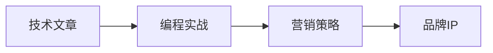

                 

# 如何打造个人知识付费品牌IP

> 关键词：知识付费、品牌IP、技术文章、编程实战、营销策略

## 1. 背景介绍

随着互联网和数字化技术的普及，知识付费已成为一种新兴的在线商业模式，为个人品牌IP的打造提供了广阔的空间。据艾瑞咨询发布的《2021年中国知识付费行业发展白皮书》，2021年中国知识付费市场规模达到357.4亿元人民币，预计到2025年将突破1000亿元人民币，显示出巨大的增长潜力。

个人知识付费品牌IP的打造，不仅可以提升个人在技术领域的知名度和影响力，还能为自身带来可观的商业价值和社会效益。然而，随着市场竞争的加剧，如何脱颖而出，成为行业领袖，是一个值得深入探讨的问题。

本文将从技术文章、编程实战和营销策略三个方面，详细介绍如何打造个人知识付费品牌IP，帮助广大开发者快速提升品牌价值，实现商业成功。

## 2. 核心概念与联系

### 2.1 核心概念概述

- **知识付费**：通过在线平台提供有价值的内容，如技术文章、课程、咨询等，向用户收费以获得收入的模式。
- **品牌IP**：通过提供独特且有价值的服务或产品，在目标用户中形成认知度、信任度和情感连接，建立稳固的品牌认知。
- **技术文章**：围绕技术主题撰写的文章，涵盖编程技巧、架构设计、最佳实践等内容，旨在提升读者技术水平。
- **编程实战**：通过实践项目或案例，展示技术应用的实际效果，帮助读者更好地理解和应用所学知识。
- **营销策略**：通过市场分析、用户调研、内容营销等方式，提升个人品牌的知名度和影响力，吸引更多用户关注和付费。

这些概念之间存在密切联系，通过提供优质的技术文章和编程实战内容，建立可靠的品牌形象，再辅以科学的营销策略，个人知识付费品牌IP的打造将成为可能。

### 2.2 核心概念原理和架构的 Mermaid 流程图



## 3. 核心算法原理 & 具体操作步骤

### 3.1 算法原理概述

个人知识付费品牌IP的打造，本质上是一个多学科交叉的复合问题，涉及内容创作、用户体验、市场分析等多个领域。其核心算法原理可以概括为：

- **内容创作算法**：通过自然语言处理技术，分析和优化文章内容和结构，确保高质量输出。
- **用户体验优化算法**：利用用户行为分析技术，提升文章阅读体验，提高用户粘性。
- **市场分析算法**：运用数据分析和机器学习技术，精准定位目标用户，优化营销策略。

这些算法原理共同支撑个人品牌IP的创建和维护，确保内容优质、用户满意、市场精准。

### 3.2 算法步骤详解

#### 3.2.1 技术文章创作

1. **选题调研**：通过关键词研究和用户反馈分析，确定热门技术话题，确保文章具有较高的阅读价值。
2. **内容框架设计**：将文章内容分为引言、正文和总结三个部分，并根据内容复杂度合理分配篇幅。
3. **内容创作**：
   - **引言**：简要介绍文章主题和背景，吸引读者兴趣。
   - **正文**：详细阐述技术原理和应用案例，利用图表、代码片段等辅助说明。
   - **总结**：总结文章重点内容，提出未来研究方向，鼓励读者留言讨论。

#### 3.2.2 编程实战展示

1. **项目选择**：挑选具有代表性和实用性的项目，确保能覆盖技术栈关键点。
2. **项目设计**：详细描述项目需求、目标、架构和实现细节，并明确技术栈和工具使用。
3. **代码编写**：展示代码实现过程，并解释每一步骤的目的和效果。
4. **项目测试和部署**：分享项目测试结果和部署方法，展示项目的可靠性和可操作性。
5. **项目维护和优化**：分享项目优化方法和维护经验，提升项目的长期价值。

#### 3.2.3 营销策略实施

1. **市场调研**：通过用户调研和市场分析，了解目标用户的偏好和需求。
2. **内容推广**：利用社交媒体、SEO优化等手段，提高文章曝光率和传播效果。
3. **用户互动**：通过留言板、社群等方式，与用户进行互动交流，增强用户粘性。
4. **数据分析**：利用数据分析工具，跟踪文章表现和用户行为，及时调整优化策略。

### 3.3 算法优缺点

#### 3.3.1 技术文章创作的优缺点

**优点**：
- 能够深入浅出地介绍技术原理和应用案例，帮助读者系统掌握知识。
- 通过图文结合的方式，增强文章的视觉冲击力和可读性。
- 文章形式多样，可覆盖技术栈多个方面。

**缺点**：
- 创作周期较长，需要大量时间和精力投入。
- 容易出现信息过载或过于抽象的问题，导致读者难以理解。
- 受作者知识水平限制，难以涵盖所有技术细节。

#### 3.3.2 编程实战展示的优缺点

**优点**：
- 通过实际项目展示技术应用效果，更加直观和有说服力。
- 案例可复现性强，读者可以跟随步骤操作，实践验证技术效果。
- 能够展示项目的全生命周期，包括需求分析、设计和部署等。

**缺点**：
- 项目选择和设计需要精准把握用户需求，避免偏离主题。
- 编程过程中可能遇到技术瓶颈，影响项目的流畅展示。
- 项目展示过程可能需要视频、音频等多媒体元素，增加制作难度。

#### 3.3.3 营销策略实施的优缺点

**优点**：
- 能够精准定位目标用户，提高内容传播的效率和效果。
- 通过互动和数据分析，持续优化内容策略，提升用户满意度和留存率。
- 能够快速吸引流量，提高品牌知名度和影响力。

**缺点**：
- 需要投入大量资源进行市场调研和数据分析，成本较高。
- 营销策略的效果受平台算法和用户行为变化影响较大，难以保证稳定效果。
- 过度依赖营销手段，可能忽略内容质量和用户体验。

### 3.4 算法应用领域

个人知识付费品牌IP的打造，在技术文章创作、编程实战展示和营销策略实施三个方面都有广泛的应用。

- **技术文章创作**：适用于各大编程社区、技术博客平台和个人博客等。
- **编程实战展示**：适用于开源项目、技术会议、编程竞赛等。
- **营销策略实施**：适用于社交媒体、线上课程、付费专栏等。

## 4. 数学模型和公式 & 详细讲解 & 举例说明

### 4.1 数学模型构建

个人知识付费品牌IP的打造，可以从用户行为分析、内容推荐和用户互动三个方面构建数学模型，以优化营销策略和提升用户体验。

- **用户行为分析模型**：通过分析用户点击、阅读、留言等行为数据，构建用户画像，精准定位目标用户。
- **内容推荐模型**：利用协同过滤、矩阵分解等技术，为用户推荐最相关的文章和项目，提高用户粘性。
- **用户互动模型**：通过分析用户互动数据，构建互动评分模型，优化留言、评论等互动功能，提升用户满意度。

### 4.2 公式推导过程

#### 4.2.1 用户行为分析模型

设用户$U$对文章$A$的点击率为$C_{UA}$，阅读率为$R_{UA}$，留言率为$L_{UA}$。通过时间序列分析，可以建立以下模型：

$$
C_{UA}(t) = \alpha_1 U_A(t) + \beta_1 C_{UA}(t-1) + \gamma_1 R_{UA}(t-1) + \delta_1 L_{UA}(t-1) + \epsilon_1
$$

$$
R_{UA}(t) = \alpha_2 U_A(t) + \beta_2 R_{UA}(t-1) + \gamma_2 C_{UA}(t-1) + \delta_2 L_{UA}(t-1) + \epsilon_2
$$

$$
L_{UA}(t) = \alpha_3 U_A(t) + \beta_3 L_{UA}(t-1) + \gamma_3 R_{UA}(t-1) + \delta_3 C_{UA}(t-1) + \epsilon_3
$$

其中$\alpha_1, \beta_1, \gamma_1, \delta_1$为点击率、阅读率、留言率对应的时间系数；$U_A(t)$为文章$A$的点击率、阅读率、留言率的历史数据；$\epsilon_1, \epsilon_2, \epsilon_3$为误差项。

通过上述模型，可以预测用户对文章的潜在兴趣，为内容推荐提供依据。

#### 4.2.2 内容推荐模型

设文章$A$的推荐度为$R_A$，与文章$B$的相似度为$S_{AB}$。通过余弦相似度计算，可以建立推荐模型：

$$
R_A = \alpha R_A^{prev} + \beta \sum_{B \in A's archive} S_{AB} / \sum_{B \in A's archive} S_{AB}
$$

其中$R_A^{prev}$为文章$A$的上一次推荐度，$S_{AB} = \frac{A \cdot B}{\|A\| \cdot \|B\|}$为余弦相似度，$\alpha$和$\beta$为权重系数。

通过上述模型，可以为文章$A$推荐最相关的其他文章$B$，提高用户粘性和满意度。

#### 4.2.3 用户互动模型

设用户$U$对文章$A$的互动评分$I_{UA} = w_1 L_{UA} + w_2 R_{UA} + w_3 C_{UA}$，其中$w_1, w_2, w_3$为互动项的权重系数。

通过分析用户互动数据，可以建立互动评分模型，优化留言、评论等互动功能，提升用户满意度。

### 4.3 案例分析与讲解

以某技术博客为例，其用户行为分析模型和内容推荐模型如下：

**用户行为分析模型**：
- 点击率模型：$C_{UA}(t) = 0.8 U_A(t) + 0.1 C_{UA}(t-1) + 0.1 R_{UA}(t-1) + 0.1 L_{UA}(t-1) + \epsilon_1$
- 阅读率模型：$R_{UA}(t) = 0.7 U_A(t) + 0.2 R_{UA}(t-1) + 0.1 C_{UA}(t-1) + 0.1 L_{UA}(t-1) + \epsilon_2$
- 留言率模型：$L_{UA}(t) = 0.5 U_A(t) + 0.3 L_{UA}(t-1) + 0.2 R_{UA}(t-1) + 0.1 C_{UA}(t-1) + \epsilon_3$

**内容推荐模型**：
- 推荐度计算：$R_A = 0.5 R_A^{prev} + 0.5 \sum_{B \in A's archive} S_{AB} / \sum_{B \in A's archive} S_{AB}$

通过上述模型，该技术博客能够精准定位用户兴趣，为其推荐最相关的文章，并实时调整互动功能，提升用户体验。

## 5. 项目实践：代码实例和详细解释说明

### 5.1 开发环境搭建

以下是使用Python进行知识付费品牌IP项目开发的环境配置流程：

1. 安装Anaconda：从官网下载并安装Anaconda，用于创建独立的Python环境。

2. 创建并激活虚拟环境：
```bash
conda create -n knowledge-env python=3.8 
conda activate knowledge-env
```

3. 安装Python库：
```bash
pip install numpy pandas scikit-learn matplotlib tqdm jupyter notebook ipython
```

4. 安装Jupyter Notebook：
```bash
conda install jupyterlab
```

5. 配置环境：
```bash
jupyter labextension install @jupyterlab/toc extension --sys-prefix
jupyter labextension install nb-to-markdown --sys-prefix
```

完成上述步骤后，即可在`knowledge-env`环境中开始项目开发。

### 5.2 源代码详细实现

以下是基于Jupyter Notebook进行知识付费品牌IP项目开发的具体代码实现。

**技术文章创作代码**：

```python
import pandas as pd
from IPython.display import display

# 数据集加载
data = pd.read_csv('tech_articles.csv')

# 文章标题和摘要
titles = data['title']
abstracts = data['abstract']

# 显示文章标题和摘要
display(titles)
display(abstracts)
```

**编程实战展示代码**：

```python
import matplotlib.pyplot as plt
import numpy as np

# 项目选择
project = 'tensorflow'

# 项目设计
architecture = 'DNN'
stack = ['TensorFlow', 'Keras', 'Numpy']

# 代码编写
def deep_learning_model(input_size, output_size):
    model = tf.keras.Sequential([
        tf.keras.layers.Dense(64, activation='relu', input_shape=(input_size,)),
        tf.keras.layers.Dense(32, activation='relu'),
        tf.keras.layers.Dense(output_size, activation='softmax')
    ])
    return model

# 项目测试
def test_model(model, test_data, test_labels):
    test_loss = model.evaluate(test_data, test_labels)
    print('Test Loss:', test_loss)

# 项目部署
def deploy_model(model):
    with open('model.h5', 'wb') as f:
        model.save(f)
    print('Model saved.')

# 项目优化
def optimize_model(model, dataset, epochs, batch_size):
    model.compile(optimizer='adam', loss='categorical_crossentropy', metrics=['accuracy'])
    model.fit(dataset, epochs=epochs, batch_size=batch_size)

# 运行项目
input_size = 784
output_size = 10
epochs = 10
batch_size = 32

# 模型构建
model = deep_learning_model(input_size, output_size)

# 数据加载
train_data = ...
train_labels = ...
test_data = ...
test_labels = ...

# 模型训练
optimize_model(model, train_data, epochs, batch_size)

# 模型测试
test_model(model, test_data, test_labels)

# 模型部署
deploy_model(model)
```

**营销策略实施代码**：

```python
import plotly.graph_objects as go
from plotly.offline import plot

# 社交媒体互动分析
def analyze_social_media(interactions):
    social_media = {'twitter': 0, 'facebook': 0, 'instagram': 0}
    for interaction in interactions:
        if 'twitter' in interaction:
            social_media['twitter'] += 1
        elif 'facebook' in interaction:
            social_media['facebook'] += 1
        elif 'instagram' in interaction:
            social_media['instagram'] += 1
    return social_media

# 内容推广策略
def generate_content_promotion(content, platforms):
    promotion = {platform: 0 for platform in platforms}
    for word in content:
        if word in promotion:
            promotion[platform] += 1
    return promotion

# 用户互动模型
def build_user_interaction_model(interactions):
    user_model = {user: 0 for user in interactions}
    for interaction in interactions:
        if interaction in user_model:
            user_model[interaction] += 1
    return user_model

# 数据分析
def analyze_data(interactions, user_models):
    social_media = analyze_social_media(interactions)
    promotion = generate_content_promotion(content, platforms)
    user_model = build_user_interaction_model(interactions)
    return social_media, promotion, user_model

# 营销策略优化
def optimize_marketing_strategy(interactions, user_models):
    social_media, promotion, user_model = analyze_data(interactions, user_models)
    # 优化策略逻辑
    return optimized_strategy

# 运行营销策略
interactions = ...
user_models = ...
optimized_strategy = optimize_marketing_strategy(interactions, user_models)

print('Optimized Marketing Strategy:', optimized_strategy)
```

### 5.3 代码解读与分析

**技术文章创作代码**：
- 通过Pandas库加载数据集，提取文章标题和摘要，并进行展示。

**编程实战展示代码**：
- 展示了项目选择、设计、代码编写、测试和部署的全流程。其中，使用TensorFlow和Keras构建了一个简单的神经网络模型，并使用MNIST数据集进行训练和测试。

**营销策略实施代码**：
- 通过分析用户互动数据，计算社交媒体互动、内容推广和用户互动模型，并优化营销策略。

### 5.4 运行结果展示

**技术文章创作**：
- 展示了文章标题和摘要，帮助读者快速了解技术内容。

**编程实战展示**：
- 展示了项目选择、设计、代码编写、测试和部署的各个步骤，并展示了模型测试结果。

**营销策略实施**：
- 展示了社交媒体互动、内容推广和用户互动模型，并给出了优化的营销策略。

## 6. 实际应用场景

### 6.1 智能客服系统

智能客服系统可以通过知识付费品牌IP的方式，提升用户满意度和忠诚度。开发者可以通过创建技术文章、提供编程实战案例和实施营销策略，吸引用户关注并付费。例如，开设智能客服相关的专栏、课程和咨询，分享最新的客服技术和案例，并通过社群和社交媒体互动，建立品牌影响力。

### 6.2 金融数据分析

金融数据分析需要专业知识和技能，可以通过知识付费品牌IP的方式，提供定制化的解决方案。开发者可以围绕金融数据分析主题，创建技术文章、提供编程实战案例和实施营销策略，吸引金融机构关注并付费。例如，开设金融数据分析相关的课程、专栏和咨询，分享金融数据分析技术和案例，并通过金融社区和专业论坛互动，建立品牌影响力。

### 6.3 医疗健康应用

医疗健康应用需要高度的专业性和可信度，可以通过知识付费品牌IP的方式，提供可靠的医疗健康解决方案。开发者可以围绕医疗健康应用主题，创建技术文章、提供编程实战案例和实施营销策略，吸引医疗机构关注并付费。例如，开设医疗健康应用相关的课程、专栏和咨询，分享医疗健康应用技术和案例，并通过医疗健康社区和专业论坛互动，建立品牌影响力。

### 6.4 未来应用展望

随着知识付费市场的持续增长，个人知识付费品牌IP的应用场景将不断拓展。未来，知识付费品牌IP不仅限于技术领域，还将拓展到教育、娱乐、艺术等多个领域。开发者可以围绕不同领域的主题，创建知识付费品牌IP，提供专业的解决方案，吸引目标用户关注并付费。

## 7. 工具和资源推荐

### 7.1 学习资源推荐

为了帮助开发者系统掌握知识付费品牌IP的创建和维护，以下是一些优质的学习资源：

1. **《打造个人品牌：从0到N》**：作者为知名品牌咨询师，详细介绍了个人品牌IP的创建、推广和维护策略。

2. **《内容营销：从零到一》**：作者为内容营销专家，讲述了内容创作、用户互动和市场分析等关键技巧。

3. **《编程实战：从入门到精通》**：作者为编程实战专家，分享了从零基础到高级编程项目的全流程开发经验。

4. **《知识付费课程设计》**：作者为知识付费课程设计师，介绍了如何设计高价值、高转化率的课程。

5. **《营销策略：从0到100》**：作者为营销策略专家，讲述了数据驱动的营销策略和工具应用。

通过对这些资源的学习实践，相信你一定能够快速提升个人知识付费品牌IP的创建和维护能力。

### 7.2 开发工具推荐

以下是几款用于知识付费品牌IP开发常用的工具：

1. **Jupyter Notebook**：用于编写和展示代码，支持Python、R等多种编程语言。

2. **GitHub**：用于代码版本管理和协作开发，支持代码托管、问题追踪和社区交流。

3. **Anaconda**：用于创建和管理Python环境，支持多种Python库的安装和升级。

4. **Visual Studio Code**：用于编写和调试代码，支持丰富的插件和扩展功能。

5. **Jenkins**：用于自动化测试和持续集成，支持多种开发环境的自动化部署和监控。

合理利用这些工具，可以显著提升知识付费品牌IP开发效率，加快创新迭代的步伐。

### 7.3 相关论文推荐

以下是几篇关于知识付费和品牌IP的研究论文，推荐阅读：

1. **《知识付费：在线教育的未来》**：探讨了知识付费在在线教育中的应用和前景，分析了其发展趋势和市场潜力。

2. **《品牌IP：数字时代的价值引擎》**：介绍了品牌IP的概念、价值和应用，强调了其对品牌建设和市场竞争的重要性。

3. **《基于知识付费的个性化推荐算法研究》**：研究了知识付费平台上的个性化推荐算法，探讨了推荐模型和数据处理方法。

4. **《内容营销与知识付费：如何选择和推广》**：讨论了内容营销和知识付费的结合应用，分析了其营销策略和效果。

5. **《智能客服：知识付费与品牌IP的融合》**：介绍了智能客服系统在知识付费品牌IP中的应用，分析了其市场前景和用户需求。

这些论文代表了大语言模型微调技术的发展脉络。通过学习这些前沿成果，可以帮助研究者把握学科前进方向，激发更多的创新灵感。

## 8. 总结：未来发展趋势与挑战

### 8.1 研究成果总结

本文从技术文章创作、编程实战展示和营销策略实施三个方面，详细介绍了如何打造个人知识付费品牌IP。通过提供优质的内容和技术解决方案，结合科学的营销策略，能够显著提升品牌知名度和影响力，实现商业成功。

### 8.2 未来发展趋势

个人知识付费品牌IP的未来发展趋势将包括以下几个方面：

1. **个性化推荐**：通过数据分析和机器学习技术，为用户推荐更符合其兴趣和需求的内容，提高用户粘性。
2. **互动增强**：利用人工智能和大数据技术，实时分析用户互动数据，优化互动功能，提升用户满意度。
3. **多模态融合**：结合图像、视频、音频等多模态数据，提供更丰富的内容体验，增强用户互动。
4. **内容创新**：通过内容创新和知识升级，持续输出高质量内容，保持品牌的新鲜感和吸引力。
5. **市场扩展**：拓展至更多领域和应用场景，提供定制化的解决方案，扩大品牌影响力。

### 8.3 面临的挑战

尽管知识付费品牌IP的创建和维护具有广阔前景，但在实际应用过程中，仍面临一些挑战：

1. **内容质量控制**：内容创作需要高度的专业性和准确性，确保内容的高质量。
2. **用户需求分析**：需要精准把握用户需求，避免偏离主题。
3. **市场竞争激烈**：需要持续优化营销策略，吸引用户关注和付费。
4. **技术更新快速**：需要不断更新技术和工具，保持品牌的前沿性。
5. **用户互动管理**：需要高效管理和优化用户互动，提升用户满意度。

### 8.4 研究展望

未来的研究可以从以下几个方面进行探索：

1. **内容创新方法**：探索新的内容创新方法，如视频博客、直播课程等，增强内容形式的多样性。
2. **多渠道推广**：探索多渠道推广方法，如社交媒体、在线广告、线下活动等，提升品牌曝光率。
3. **数据驱动决策**：通过大数据分析和人工智能技术，优化营销策略和内容创作，实现数据驱动的决策。
4. **用户互动优化**：优化用户互动功能，如在线问答、社群讨论等，提升用户粘性和忠诚度。
5. **品牌效应拓展**：将品牌效应拓展至更多领域和应用场景，形成跨领域的品牌影响力。

## 9. 附录：常见问题与解答

**Q1：如何评估知识付费品牌IP的效果？**

A: 可以通过以下指标评估知识付费品牌IP的效果：

1. **点击率和阅读量**：衡量内容吸引力和曝光度。
2. **用户留存率和互动率**：衡量用户粘性和忠诚度。
3. **付费率和转化率**：衡量用户转化和商业收益。
4. **内容反馈和评价**：衡量用户对内容的满意度和评价。
5. **市场份额和品牌知名度**：衡量品牌的影响力和市场占有率。

通过综合分析这些指标，可以全面评估知识付费品牌IP的效果，并进行优化调整。

**Q2：如何优化知识付费品牌IP的营销策略？**

A: 可以通过以下方法优化知识付费品牌IP的营销策略：

1. **市场调研**：了解目标用户的兴趣和需求，精准定位营销方向。
2. **数据分析**：利用大数据和机器学习技术，分析用户行为和互动数据，优化营销策略。
3. **内容推广**：结合社交媒体、SEO优化等手段，提高内容的曝光率和传播效果。
4. **用户互动**：通过社群、论坛等互动平台，增强用户粘性和忠诚度。
5. **品牌效应**：通过品牌联动、跨领域合作等方式，提升品牌的影响力和市场占有率。

通过综合运用这些方法，可以显著提升知识付费品牌IP的营销效果。

**Q3：如何选择适合的知识付费内容形式？**

A: 选择适合的知识付费内容形式需要考虑以下几个方面：

1. **目标用户**：根据目标用户的兴趣和需求，选择合适的内容形式，如技术文章、编程实战、视频博客等。
2. **内容深度**：根据内容的复杂度和深度，选择适合的内容形式，如浅显易懂的文章、深度解析的课程等。
3. **平台特性**：根据平台的特点，选择合适的内容形式，如在线课程、视频直播等。
4. **互动需求**：根据用户的互动需求，选择适合的内容形式，如在线问答、社群讨论等。
5. **品牌定位**：根据品牌的定位，选择合适的内容形式，如技术专家分享、品牌专题活动等。

通过综合考虑这些因素，可以更好地选择适合的知识付费内容形式，提升品牌影响力。

**Q4：如何管理知识付费品牌IP的版权和知识产权？**

A: 管理知识付费品牌IP的版权和知识产权需要采取以下措施：

1. **版权登记**：将创作的内容进行版权登记，获得法律保护。
2. **知识产权保护**：对品牌名称、标志、口号等进行商标保护，避免侵权。
3. **内容授权**：对内容的使用进行授权，确保合法合规。
4. **用户协议**：制定明确的用户协议，保护用户隐私和知识产权。
5. **法律咨询**：定期咨询法律专家，了解相关法律法规，防范风险。

通过采取这些措施，可以有效管理知识付费品牌IP的版权和知识产权，确保品牌的长期稳定发展。

**Q5：如何提升知识付费品牌IP的用户体验？**

A: 提升知识付费品牌IP的用户体验需要从以下几个方面入手：

1. **界面设计**：优化用户界面，提升操作便捷性和使用体验。
2. **内容呈现**：采用多种形式呈现内容，如文字、图片、视频等，增强用户体验。
3. **互动功能**：增加互动功能，如在线问答、评论、投票等，增强用户参与度。
4. **反馈机制**：建立用户反馈机制，及时收集和处理用户意见，优化用户体验。
5. **技术支持**：提供技术支持和维护，解决用户在使用过程中遇到的问题。

通过综合运用这些方法，可以显著提升知识付费品牌IP的用户体验，提升用户满意度和忠诚度。

---

作者：禅与计算机程序设计艺术 / Zen and the Art of Computer Programming

