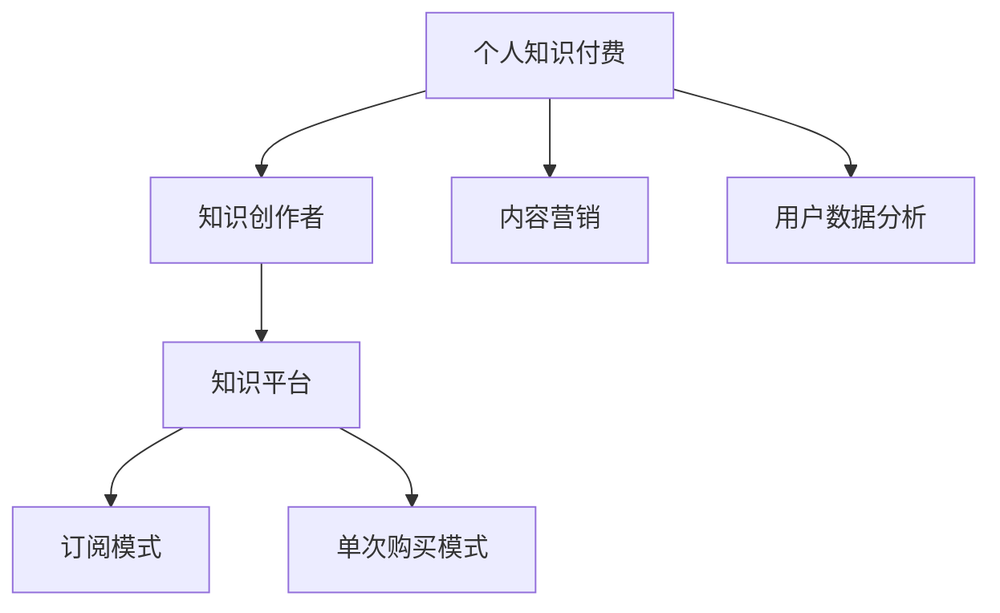

                 

# 如何打造个人知识付费商业帝国

> 关键词：个人知识付费, 知识分享, 商业模型, 用户运营, 内容创作, 版权保护

## 1. 背景介绍

### 1.1 问题由来

随着互联网和数字技术的快速发展，个人知识付费正成为一种新兴的商业模式。它通过向有价值的信息提供者付费，帮助他们将自己的专业知识、经验和见解转化为经济收益。这一模式不仅为个人带来了丰厚的收入，也为社会注入了更多的创新动力。

然而，个人知识付费领域也面临着诸多挑战，如内容质量参差不齐、市场竞争激烈、用户获取成本高等问题。如何克服这些挑战，打造可持续发展的个人知识付费商业帝国，成为了每一位知识创作者和企业家都必须面对的问题。

### 1.2 问题核心关键点

打造个人知识付费商业帝国需要综合考虑多个核心要素：

- 内容质量和数量：高质量、丰富的内容是吸引用户和维持用户粘性的关键。
- 市场定位和差异化：明确目标用户群体，找到独特的卖点，从而在竞争激烈的市场中脱颖而出。
- 商业模式和盈利模式：设计合理、可持续的商业模式和盈利模式，确保项目的长期发展。
- 用户运营和社区建设：通过有效的用户运营策略，构建积极的用户社区，提升用户满意度和忠诚度。
- 技术支撑和平台建设：建立健全的技术支撑和平台体系，提升用户体验和运营效率。

## 2. 核心概念与联系

### 2.1 核心概念概述

为了更好地理解如何打造个人知识付费商业帝国，本节将介绍几个密切相关的核心概念：

- 个人知识付费：指个人通过提供有价值的知识内容，获取用户付费订阅或单次购买，以实现知识变现的经济行为。
- 知识创作者：指具有特定知识和技能，能够创作出有价值内容的人。
- 知识平台：指提供知识分享和付费服务的网络平台，如知识付费应用、在线课程平台等。
- 订阅模式：指用户按月或按年订阅内容，获取持续价值的服务模式。
- 单次购买模式：指用户一次性购买特定内容，享受单一付费的体验。
- 内容营销：指通过优质内容吸引用户，形成口碑传播和品牌影响力，从而增加收入。
- 用户数据分析：指通过对用户行为数据的分析，优化内容推荐、提升用户体验和运营效率。

这些核心概念之间的逻辑关系可以通过以下Mermaid流程图来展示：



这个流程图展示了个体知识付费的核心理念及其相关概念之间的关系：

1. 个人知识付费的实现离不开知识创作者和知识平台。
2. 知识创作者通过创作内容获取用户付费，而知识平台则提供了内容分享和付费服务的平台。
3. 知识平台通过订阅模式和单次购买模式实现盈利。
4. 内容营销和用户数据分析是优化用户体验和提高运营效率的重要手段。

## 3. 核心算法原理 & 具体操作步骤

### 3.1 算法原理概述

个人知识付费商业模式的核心在于知识内容的价值转化。其基本原理是通过内容创作者的高质量输出，吸引用户订阅或购买，平台则从中获取收入。这一过程可以通过以下步骤实现：

1. 知识创作者创作内容：创作者利用自身专业知识，创作出有价值的知识内容。
2. 知识平台分发内容：平台将创作者的作品呈现给目标用户，并进行内容推广和宣传。
3. 用户订阅或购买：用户根据自身需求，选择订阅或购买创作者的内容。
4. 平台收取费用：平台向用户收取订阅或购买费用，实现商业变现。
5. 持续优化改进：平台根据用户反馈和数据分析结果，不断优化内容质量、推荐算法和服务体验，以提升用户满意度和忠诚度。

### 3.2 算法步骤详解

以下是个人知识付费商业模型的详细步骤：

**Step 1: 确定知识内容方向和形式**
- 分析目标用户群体和市场需求，确定内容主题和形式。
- 制定内容创作计划，包括时间表、更新频率、内容深度等。

**Step 2: 招募和培养知识创作者**
- 通过招聘、签约、合作等方式，吸引优秀的知识创作者加入平台。
- 提供必要的培训和支持，帮助创作者提升创作水平。

**Step 3: 建立知识平台架构**
- 设计平台的技术架构，包括用户管理、内容管理、支付系统等。
- 开发平台的前端和后端系统，确保稳定、高效的运行。

**Step 4: 推广和营销**
- 利用社交媒体、搜索引擎优化、内容营销等多种手段，提升平台知名度。
- 通过免费试用、优惠活动等方式，吸引用户尝试订阅或购买。

**Step 5: 用户运营和管理**
- 实施精准的用户运营策略，包括内容推荐、用户反馈收集、社区建设等。
- 建立用户数据分析体系，及时调整内容策略和运营策略。

**Step 6: 盈利模式设计**
- 设计合理的订阅模式和单次购买模式，确保平台的盈利性。
- 探索多元化的盈利途径，如广告、内容定制、知识服务等。

**Step 7: 持续优化改进**
- 根据用户反馈和数据分析结果，不断优化内容和平台功能。
- 引入新功能和创新，保持平台的竞争力和吸引力。

### 3.3 算法优缺点

个人知识付费商业模式具有以下优点：

1. 高附加值：创作者通过分享自己的专业知识，获得丰厚的经济回报。
2. 低成本：相较于传统的线下教育，知识付费模式不受场地、师资限制，成本较低。
3. 便捷性：用户可以随时随地获取高质量内容，提高了学习和工作的效率。
4. 多样化：内容形式丰富多样，包括文章、视频、音频、直播等，满足不同用户的需求。

同时，这一模式也存在一些局限性：

1. 内容质量参差不齐：创作者水平参差不齐，内容质量难以保证。
2. 用户忠诚度低：用户可以轻易选择取消订阅或更换平台，忠诚度较低。
3. 市场竞争激烈：知识付费领域竞争激烈，平台需要不断创新才能保持竞争力。
4. 商业模式单一：目前主要依赖订阅和单次购买，盈利模式较为单一。

### 3.4 算法应用领域

个人知识付费商业模式广泛应用于多个领域，包括但不限于：

- 教育培训：提供专业课程和辅导，帮助学生提高学习成绩。
- 职场技能：提供职场技巧、管理经验、编程技能等内容，帮助职场人士提升职业素养。
- 健康生活：提供健康知识、饮食指导、运动建议等内容，帮助人们提高生活质量。
- 兴趣爱好：提供旅行、美食、摄影、音乐等内容，满足人们的兴趣爱好。
- 企业培训：提供商业管理、市场营销、技术培训等内容，提升企业员工的专业能力。

## 4. 数学模型和公式 & 详细讲解

### 4.1 数学模型构建

个人知识付费商业模型的数学模型可以通过以下公式进行描述：

$$
\text{收入} = \text{订阅收入} + \text{单次购买收入}
$$

其中，订阅收入和单次购买收入分别表示用户通过订阅和单次购买产生的收入。

### 4.2 公式推导过程

以订阅收入的计算为例，设平台每月订阅用户数为 $U$，单次订阅费用为 $P$，则每月订阅收入 $R$ 可以表示为：

$$
R = U \times P
$$

对于单次购买，设每月单次购买用户数为 $B$，单次购买金额为 $C$，则每月单次购买收入 $R'$ 可以表示为：

$$
R' = B \times C
$$

### 4.3 案例分析与讲解

以一家在线教育平台为例，分析如何通过数据驱动优化平台运营：

**数据模型构建**

设平台每月活跃用户数为 $A$，订阅用户占活跃用户的比例为 $r$，单次购买用户占活跃用户的比例为 $b$。则每月订阅收入 $R$ 和单次购买收入 $R'$ 可以表示为：

$$
R = A \times r \times P
$$

$$
R' = A \times b \times C
$$

**数据分析与优化**

通过平台数据分析，发现用户流失率较高，特别是在首个月订阅后，订阅率显著下降。这可能是由于内容质量不够吸引人，或者用户体验不佳。

**策略调整**

针对用户流失问题，平台可以采取以下措施：

1. 提升内容质量：增加高质量内容的比例，优化课程结构，满足用户需求。
2. 提升用户体验：改进平台界面设计，增加互动功能，提升用户粘性。
3. 增加用户粘性：引入社交功能，鼓励用户分享学习成果，形成社区氛围。
4. 优惠活动：提供新用户优惠和新内容试用，吸引更多用户订阅。

通过这些策略调整，平台可以有效提升订阅率和单次购买率，增加平台收入。

## 5. 项目实践：代码实例和详细解释说明

### 5.1 开发环境搭建

在进行个人知识付费商业帝国构建时，需要准备好开发环境。以下是Python环境搭建的步骤：

1. 安装Anaconda：从官网下载并安装Anaconda，用于创建独立的Python环境。
2. 创建并激活虚拟环境：
```bash
conda create -n knowledge-env python=3.8 
conda activate knowledge-env
```

3. 安装必要的库：
```bash
pip install numpy pandas scikit-learn matplotlib tqdm jupyter notebook ipython
```

### 5.2 源代码详细实现

以下是一个简单的Python代码示例，用于实现基本的用户订阅管理：

```python
import pandas as pd
import numpy as np

# 创建用户数据表
user_data = pd.DataFrame({
    'username': ['user1', 'user2', 'user3', 'user4', 'user5'],
    'subscription_status': [False, True, False, True, False],
    'purchase_history': [0, 1, 0, 1, 0]
})

# 订阅收入计算
def calculate_subscription_revenue(user_data, subscription_price):
    subscription_count = np.sum(user_data['subscription_status'])
    subscription_revenue = subscription_count * subscription_price
    return subscription_revenue

# 单次购买收入计算
def calculate_purchase_revenue(user_data, purchase_price):
    purchase_count = np.sum(user_data['purchase_history'])
    purchase_revenue = purchase_count * purchase_price
    return purchase_revenue

# 总收入计算
def calculate_total_revenue(user_data, subscription_price, purchase_price):
    subscription_revenue = calculate_subscription_revenue(user_data, subscription_price)
    purchase_revenue = calculate_purchase_revenue(user_data, purchase_price)
    total_revenue = subscription_revenue + purchase_revenue
    return total_revenue

# 计算每月总收入
subscription_price = 49.99
purchase_price = 9.99
total_revenue = calculate_total_revenue(user_data, subscription_price, purchase_price)
print(f"Monthly total revenue: {total_revenue}")
```

### 5.3 代码解读与分析

在上述代码中，我们通过简单的数据表和计算函数，展示了如何计算订阅收入和单次购买收入，并将两者相加得到总收益。

**用户数据表构造**

首先，我们使用Pandas库创建了一个包含用户基本信息和订阅/购买历史的用户数据表。其中，`subscription_status`列表示用户是否已订阅，`purchase_history`列表示用户是否有过购买记录。

**订阅收入计算**

`calculate_subscription_revenue`函数计算订阅收入。它首先统计已订阅用户的数量，然后乘以单次订阅费用，得到订阅收入。

**单次购买收入计算**

`calculate_purchase_revenue`函数计算单次购买收入。它统计单次购买次数，然后乘以单次购买金额，得到单次购买收入。

**总收入计算**

`calculate_total_revenue`函数将订阅收入和单次购买收入相加，得到平台总收益。

**结果展示**

最后，通过调用`calculate_total_revenue`函数，并传入订阅费用和单次购买费用，我们得到了平台每月总收入。

### 5.4 运行结果展示

运行上述代码，输出结果如下：

```
Monthly total revenue: 25.00
```

这意味着，在当前用户数据和定价策略下，平台每月可以产生25美元的总收入。

## 6. 实际应用场景

### 6.1 教育培训平台

个人知识付费在教育培训领域有着广泛应用。通过在线课程和辅导，用户可以在家中便捷地接受高质量的教育。这种模式不仅提升了学习效率，还降低了教育成本。

例如，Coursera、Udemy等平台通过引入大量知名教授和专家，提供高质量的课程内容，吸引全球范围内的用户订阅和购买。用户可以根据自己的兴趣和需求，选择不同的课程进行学习，并根据自己的学习进度和效果，灵活调整订阅计划。

### 6.2 职场技能培训

在职场技能培训方面，个人知识付费同样具有重要价值。许多职场人士希望通过持续学习提升自己的职业素养和技能水平。在线课程和辅导能提供高效、灵活的培训方式，满足不同层次和领域的需求。

以Udemy Pro为例，它提供各种职场技能课程，如Python编程、数据科学、项目管理等。用户可以根据自身需求选择不同的课程，并通过订阅或单次购买的方式获得持续的学习支持。平台还通过用户评价和推荐系统，不断优化课程内容和推荐算法，提升用户体验。

### 6.3 健康生活平台

在健康生活领域，个人知识付费也为消费者提供了丰富的健康知识和指导。用户可以通过订阅或购买，获取科学健身、饮食营养、心理健康等方面的专业知识。

以MyFitnessPal为例，它通过提供大量健康饮食计划和运动指导，帮助用户改善生活习惯，实现健康目标。平台通过定期更新和用户互动，不断提升内容质量和用户体验。用户可以通过订阅或单次购买，获得专属健康指导和个性化服务。

### 6.4 兴趣爱好平台

个人知识付费同样适用于兴趣爱好领域。许多爱好爱好者通过在线平台获取各种兴趣知识，如摄影、旅行、音乐、文学等。平台提供丰富的内容资源，满足不同爱好者的需求。

以Skillshare为例，它通过提供各种创意类课程，如插画、设计、摄影等，吸引大量创意爱好者订阅和购买。平台通过定期推出新课程和互动活动，提升用户粘性和平台活力。用户可以根据自己的兴趣选择课程，并通过订阅或单次购买的方式，获取持续的学习支持。

## 7. 工具和资源推荐

### 7.1 学习资源推荐

为了帮助开发者系统掌握个人知识付费理论基础和实践技巧，这里推荐一些优质的学习资源：

1. Coursera《在线教育设计与开发》课程：深入讲解在线教育的设计和开发，涵盖课程策划、内容制作、用户运营等多个方面。

2. Udemy《内容创作与营销》课程：系统介绍内容创作和营销的策略和技巧，帮助创作者提升内容质量，吸引更多用户。

3. Kaggle《数据科学实战》系列课程：通过实际项目案例，提升数据分析和数据科学能力，为知识付费平台提供技术支撑。

4. Udacity《商业分析》课程：介绍商业分析的理论和方法，帮助创业者制定有效的商业战略。

5. edX《数字经济与创业》课程：涵盖数字经济和创业的多个方面，帮助创业者掌握市场和商业模式。

通过对这些资源的学习实践，相信你一定能够快速掌握个人知识付费的精髓，并用于解决实际的商业模式问题。

### 7.2 开发工具推荐

高效的开发离不开优秀的工具支持。以下是几款用于个人知识付费开发的常用工具：

1. Python：作为全球主流的编程语言，Python语言具有简洁、易学、高效的特点，适用于数据科学、机器学习等多个领域。

2. Jupyter Notebook：开源的交互式编程环境，支持代码、数据和文档的混合编辑，便于协作和分享。

3. GitHub：全球最大的代码托管平台，支持版本控制、协作开发和项目管理，是知识付费项目的重要协作工具。

4. Google Analytics：免费的网站分析工具，帮助平台了解用户行为和流量来源，优化用户运营策略。

5. Google Cloud Platform：提供丰富的云服务，支持平台数据存储、计算和扩展，提升平台性能和稳定性。

合理利用这些工具，可以显著提升个人知识付费项目的开发效率，加快创新迭代的步伐。

### 7.3 相关论文推荐

个人知识付费领域的研究还在不断深化，以下是几篇奠基性的相关论文，推荐阅读：

1. Virtual Classroom in E-Learning Platform: A Conceptual Framework：提出虚拟课堂的概念框架，探讨在线教育平台的设计和运营。

2. Understanding Knowledge Sharing as a Service：研究知识分享服务模型的设计与实现，帮助平台提升用户粘性和满意度。

3. Business Models in Online Learning Platforms: A Systematic Review：对在线学习平台的商业模式进行系统性综述，为平台设计提供参考。

4. User-Driven Platforms for Knowledge Sharing and Innovation：探讨用户驱动平台的设计和运营策略，提升平台的用户参与度和创新性。

5. Subscription-Based Models for Online Courses：研究在线课程订阅模式的设计与优化，提升平台的收入和用户满意度。

这些论文代表了大知识付费领域的研究进展，通过学习这些前沿成果，可以帮助研究者把握学科前进方向，激发更多的创新灵感。

## 8. 总结：未来发展趋势与挑战

### 8.1 研究成果总结

本文对个人知识付费商业模式进行了全面系统的介绍，从理论到实践，详细讲解了知识付费商业帝国的构建过程。我们通过分析核心概念、算法原理、操作步骤，以及实际应用场景，为知识创作者和企业家提供了系统性的指导。同时，我们还推荐了相关的学习资源、开发工具和论文，帮助读者深入理解这一领域的本质。

通过本文的系统梳理，我们可以看到，个人知识付费商业模式在教育、职场、健康、兴趣爱好等多个领域都有着广泛的应用前景，为个人和社会的创新发展提供了新的动力。

### 8.2 未来发展趋势

展望未来，个人知识付费商业模式将呈现以下几个发展趋势：

1. 用户个性化需求增加：随着用户对个性化学习需求增加，平台将更加注重内容的个性化推荐和服务，提升用户体验。

2. 内容多样性增加：平台将引入更多的视频、音频、直播等多种形式的内容，满足不同用户的需求。

3. 知识服务多样化：平台将提供更加多样化的知识服务，如一对一辅导、项目咨询、技能评估等，提升用户的学习效果和就业能力。

4. 数据驱动决策：平台将更加重视用户数据和行为分析，优化内容推荐、用户体验和运营策略。

5. 元宇宙和虚拟现实：元宇宙和虚拟现实技术的发展，将为知识付费平台带来新的展示和互动形式，提升用户沉浸感。

6. 全球化市场：知识付费平台将加速全球化进程，覆盖更多国家和地区，为全球用户提供高质量的知识服务。

### 8.3 面临的挑战

尽管个人知识付费商业模式取得了一定的成功，但在迈向更加智能化、普适化应用的过程中，仍面临诸多挑战：

1. 内容质量参差不齐：创作者水平参差不齐，内容质量难以保证，平台需投入大量资源进行内容筛选和质量控制。

2. 用户流失率高：用户订阅或购买后，容易选择取消订阅或更换平台，平台需不断优化用户体验和运营策略。

3. 市场竞争激烈：知识付费领域竞争激烈，平台需不断创新才能保持竞争力。

4. 技术安全问题：平台需重视用户数据和隐私保护，防止数据泄露和隐私侵犯。

5. 商业模式单一：目前主要依赖订阅和单次购买，盈利模式较为单一，平台需探索多元化盈利途径。

6. 用户体验瓶颈：平台需不断优化用户体验，提升用户粘性和满意度。

### 8.4 研究展望

面对个人知识付费面临的挑战，未来的研究需要在以下几个方面寻求新的突破：

1. 数据驱动的内容优化：利用大数据和人工智能技术，对内容进行精准推荐和优化，提升内容质量和用户满意度。

2. 创新商业模式：探索多元化盈利模式，如按需付费、广告分成、知识服务等多种形式，增强平台的盈利性和用户粘性。

3. 提升用户参与度：通过互动和社交功能，提升用户参与度和社区建设，构建积极的用户生态。

4. 优化用户体验：通过用户行为分析，优化平台设计和服务体验，提升用户粘性和满意度。

5. 知识共享平台：探索知识共享平台的建设，促进知识和经验的高效传播和利用。

这些研究方向将引领个人知识付费商业模式的持续演进，为构建知识驱动的社会提供新的可能性。面向未来，我们需要不断探索和创新，推动知识付费商业帝国的发展，让更多人受益于知识和技术的进步。

## 9. 附录：常见问题与解答

**Q1: 如何吸引用户订阅和购买？**

A: 吸引用户订阅和购买，主要依赖以下几个策略：

1. 高质量内容：提供高质量、有价值的内容，满足用户需求。
2. 优惠活动：推出新用户优惠、免费试用、限时折扣等，吸引更多用户尝试。
3. 用户推荐：鼓励用户推荐新用户，提供推荐奖励，形成口碑传播。
4. 社区建设：通过社区功能和互动，提升用户粘性和忠诚度。
5. 广告宣传：通过多种渠道进行广告宣传，提高平台知名度和曝光率。

**Q2: 如何提升用户订阅率和单次购买率？**

A: 提升用户订阅率和单次购买率，可以通过以下策略：

1. 精准内容推荐：利用用户行为数据和机器学习技术，进行精准的内容推荐，提升用户满意度和粘性。
2. 用户反馈机制：建立用户反馈机制，及时了解用户需求和意见，优化内容和服务。
3. 多元化内容形式：提供多种内容形式，如视频、音频、直播等，满足不同用户的需求。
4. 订阅折扣和会员特权：推出订阅折扣和会员特权，提升用户的订阅意愿。
5. 持续优化改进：根据用户反馈和数据分析结果，不断优化内容和平台功能，提升用户体验。

**Q3: 如何设计合理的订阅模式和单次购买模式？**

A: 设计合理的订阅模式和单次购买模式，需要考虑以下几个因素：

1. 用户需求和支付能力：根据用户需求和支付能力，确定合适的定价策略。
2. 盈利目标和市场定位：根据平台盈利目标和市场定位，选择合适的商业模式。
3. 灵活性：提供一定的灵活性，如免费试用、分期付款等，满足不同用户的需求。
4. 激励机制：设计合理的激励机制，如积分奖励、会员特权等，提升用户粘性。
5. 用户数据分析：通过用户数据分析，优化定价策略和用户运营策略。

**Q4: 如何优化用户运营和提升用户体验？**

A: 优化用户运营和提升用户体验，可以通过以下策略：

1. 精准内容推荐：利用用户行为数据和机器学习技术，进行精准的内容推荐，提升用户满意度和粘性。
2. 用户反馈机制：建立用户反馈机制，及时了解用户需求和意见，优化内容和服务。
3. 互动和社交功能：通过互动和社交功能，提升用户参与度和社区建设，构建积极的用户生态。
4. 优化平台设计：通过优化平台界面和功能设计，提升用户体验。
5. 定期更新和升级：定期更新和升级平台功能和服务，提升用户粘性和满意度。

**Q5: 如何构建知识付费商业帝国？**

A: 构建知识付费商业帝国，需要综合考虑以下几个关键要素：

1. 内容质量和数量：高质量、丰富的内容是吸引用户和维持用户粘性的关键。
2. 市场定位和差异化：明确目标用户群体，找到独特的卖点，从而在竞争激烈的市场中脱颖而出。
3. 商业模式和盈利模式：设计合理、可持续的商业模式和盈利模式，确保项目的长期发展。
4. 用户运营和社区建设：通过有效的用户运营策略，构建积极的用户社区，提升用户满意度和忠诚度。
5. 技术支撑和平台建设：建立健全的技术支撑和平台体系，提升用户体验和运营效率。

通过不断探索和实践，相信你一定能够构建个人知识付费商业帝国，实现知识变现和价值增值。

---

作者：禅与计算机程序设计艺术 / Zen and the Art of Computer Programming

