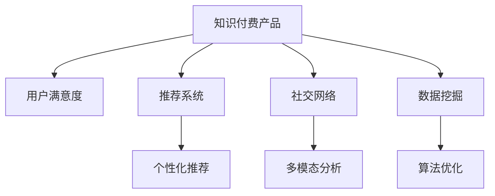

                 

# 如何提高知识付费产品的用户满意度

> 关键词：知识付费, 用户满意度, 用户行为分析, 推荐系统, 个性化推荐, 社交网络, 多模态分析, 数据挖掘, 算法优化

## 1. 背景介绍

### 1.1 问题由来
随着互联网和移动互联网的迅猛发展，在线教育、知识付费等新兴业务形式快速崛起。知识付费产品通过平台化和数字化手段，打破了传统的教育资源获取方式，以高质量、高效率的在线课程和资讯内容，满足用户对于知识获取的需求。然而，尽管知识付费市场规模不断扩大，用户满意度问题依旧难以彻底解决，成为了制约产品增长的瓶颈。

用户满意度问题源自多个方面，包括但不限于课程质量、学习体验、内容匹配度等。这些问题不仅影响用户的持续订阅行为，更决定了平台的口碑和市场竞争力。因此，如何构建高质量的知识付费产品，提高用户满意度，成为各大平台亟待解决的痛点问题。

### 1.2 问题核心关键点
要提高知识付费产品的用户满意度，需要从用户行为、推荐系统、内容匹配、平台交互等多个维度进行优化。其核心关键点在于：

- **理解用户需求**：通过数据挖掘和用户行为分析，洞察用户的学习偏好、需求痛点和情感变化，从而设计出更贴合用户需求的个性化推荐系统。
- **优化推荐算法**：采用先进的数据分析方法和算法模型，设计高效、精准的推荐算法，满足用户的个性化需求，提升推荐效果。
- **增强社交互动**：建立社交网络，鼓励用户参与讨论、分享、互动，形成社区效应，增加用户粘性。
- **多模态融合**：结合用户的多模态信息，包括学习历史、评价反馈、社交网络关系等，构建更加全面、深入的用户画像，提升推荐精准度。
- **持续反馈和优化**：建立持续的用户反馈机制，不断收集用户意见和建议，进行迭代优化，持续提升产品体验和用户满意度。

## 2. 核心概念与联系

### 2.1 核心概念概述

为了更好地理解知识付费产品用户满意度的提升方法，本节将介绍几个密切相关的核心概念：

- **知识付费产品(Knowledge-Paying Products, KPP)**：以在线课程、资讯、工具等多种形式，为用户提供有价值的内容和知识获取途径的平台。
- **用户满意度(User Satisfaction, US)**：用户对产品服务满意程度的综合评价，通常通过满意度调查、评价反馈等方式进行评估。
- **推荐系统(Recommender System)**：通过分析用户的历史行为数据，为用户推荐可能感兴趣的内容的系统。
- **个性化推荐(Personalized Recommendation)**：根据用户个体特征，推荐符合其特定需求的内容，从而提高用户满意度。
- **社交网络(Social Network)**：由用户之间建立的互动关系组成的网络，通过增强用户互动，提升用户粘性和参与感。
- **多模态分析(Multimodal Analysis)**：结合文本、图像、音频等多种数据类型，构建更加全面的用户画像，提升推荐系统的效果。
- **数据挖掘(Data Mining)**：通过分析海量数据，提取有用信息和知识，支持推荐系统的设计和优化。
- **算法优化(Algorithm Optimization)**：通过改进算法模型和参数，提升推荐系统的效率和效果。

这些核心概念之间的逻辑关系可以通过以下Mermaid流程图来展示：



这个流程图展示的知识付费产品用户满意度的核心概念及其之间的关系：

1. 知识付费产品通过推荐系统为用户提供个性化的内容推荐。
2. 推荐系统通过多模态分析获取全面的用户画像，利用数据挖掘提取有用信息。
3. 个性化推荐基于算法优化，实现高效、精准的推荐。
4. 社交网络增强用户互动，提升用户粘性。

这些概念共同构成了知识付费产品用户满意度的提升框架，使其能够在各种场景下提高用户的整体满意度。通过理解这些核心概念，我们可以更好地把握提升用户满意度的关键路径。

## 3. 核心算法原理 & 具体操作步骤
### 3.1 算法原理概述

知识付费产品用户满意度的提升，本质上是一个数据驱动的优化过程。其核心思想是：通过分析用户的交互行为数据，构建精准的用户画像，设计高效的推荐算法，实现个性化的内容推荐，提升用户的满意度和活跃度。

形式化地，假设知识付费产品的用户集合为 $U$，内容集合为 $C$，用户的交互行为数据为 $D=\{(a_i, b_i)\}_{i=1}^N$，其中 $a_i \in U$ 表示用户 $i$，$b_i \in C$ 表示用户 $i$ 选择的内容。用户满意度 $US$ 定义为：

$$
US = \frac{1}{N}\sum_{i=1}^N US_i
$$

其中 $US_i$ 为用户 $i$ 的满意度评分。

推荐系统的优化目标是最小化推荐误差，即找到最优的推荐策略 $\sigma$，使得用户对推荐内容的满意度评分最大化：

$$
\sigma^* = \mathop{\arg\min}_{\sigma} \mathcal{E}(\sigma)
$$

其中 $\mathcal{E}$ 为推荐误差函数，衡量推荐策略与用户实际选择的推荐内容之间的差异。

通过梯度下降等优化算法，推荐系统不断调整模型参数，最小化推荐误差函数 $\mathcal{E}$，使得推荐内容逼近用户的实际选择。由于 $\sigma$ 已经通过大量用户行为数据训练得到，因此即便在少量标注数据的情况下，推荐系统也能较快收敛到理想的推荐策略 $\sigma^*$。

### 3.2 算法步骤详解

知识付费产品用户满意度的提升，一般包括以下几个关键步骤：

**Step 1: 数据收集与预处理**
- 收集用户的交互行为数据 $D$，包括用户选择、学习、评价、评论等行为。
- 清洗数据，去除噪声和异常值，确保数据质量。
- 对数据进行特征工程，提取有用的特征，如用户画像、行为时间、推荐频次等。

**Step 2: 用户画像构建**
- 基于用户行为数据，构建全面的用户画像。
- 利用聚类算法或关联规则挖掘技术，发现用户的行为模式和兴趣偏好。
- 对用户画像进行向量表示，形成高维特征向量。

**Step 3: 推荐算法设计**
- 选择合适的推荐算法模型，如协同过滤、基于内容的推荐、混合推荐等。
- 设计优化算法，如SVD、ALS、矩阵分解等，用于模型参数优化。
- 设计评估指标，如准确率、召回率、F1分数等，用于评估推荐效果。

**Step 4: 模型训练与评估**
- 将用户画像和内容信息输入模型，进行训练。
- 在验证集上评估推荐效果，根据评估指标调整模型参数。
- 使用优化算法，如随机梯度下降、Adam等，最小化推荐误差函数。

**Step 5: 推荐结果输出与反馈**
- 根据优化后的推荐策略 $\sigma^*$，生成推荐结果。
- 通过前端界面展示推荐内容，收集用户反馈数据。
- 根据用户反馈数据，持续迭代优化推荐策略，提升用户满意度。

以上是知识付费产品用户满意度提升的一般流程。在实际应用中，还需要针对具体任务的特点，对推荐过程的各个环节进行优化设计，如改进训练目标函数，引入更多的正则化技术，搜索最优的超参数组合等，以进一步提升推荐效果。

### 3.3 算法优缺点

知识付费产品用户满意度提升的监督学习方法具有以下优点：

1. 简单高效。只需准备少量标注数据，即可对用户画像进行快速适配，提高推荐效果。
2. 通用适用。适用于各种推荐系统，包括基于协同过滤、基于内容的推荐等，设计简单的用户画像适配层即可实现。
3. 效果显著。在学术界和工业界的诸多推荐任务上，基于推荐系统的技术已经刷新了最先进的性能指标。
4. 实时响应。推荐系统可以实时响应用户的查询，提供动态推荐结果，提升用户体验。

同时，该方法也存在一定的局限性：

1. 数据依赖。推荐系统的性能很大程度上取决于用户行为数据的质量，获取高质量用户数据成本较高。
2. 冷启动问题。新用户或新内容在推荐系统中的表现难以预测，可能导致推荐效果不佳。
3. 动态变化。用户行为和内容特征会随时间动态变化，推荐系统需要不断更新模型以保持推荐效果。
4. 多样性不足。推荐系统往往倾向于推荐热门内容，忽略冷门但高质量的内容，导致内容多样性不足。
5. 对抗攻击。推荐模型可能受到对抗样本的攻击，导致推荐内容偏离用户实际需求。

尽管存在这些局限性，但就目前而言，基于监督学习的推荐方法仍是最主流的推荐方式。未来相关研究的重点在于如何进一步降低推荐对用户行为的依赖，提高系统的鲁棒性和多样性，同时兼顾推荐模型的可解释性和安全性等因素。

### 3.4 算法应用领域

基于用户行为数据的推荐系统，在知识付费产品中已经得到了广泛的应用，覆盖了几乎所有推荐场景，例如：

- 内容推荐：为用户推荐感兴趣的课程、资讯、工具等内容。通过分析用户的学习历史和行为模式，设计合适的推荐算法，推荐符合其特定需求的内容。
- 搜索推荐：根据用户输入的搜索关键词，推荐相关的课程、资讯、作者等。通过关键词匹配和用户画像，快速定位符合用户兴趣的搜索结果。
- 个性化学习路径：为用户推荐个性化的学习路径，包括推荐课程、安排学习顺序、设置学习节奏等。通过学习行为分析，设计动态调整的学习计划，提升学习效果。
- 社交推荐：根据用户的社交网络关系，推荐朋友或专家推荐的内容。通过社交网络分析，发现用户的潜在兴趣点，提供更多样的内容选择。
- 内容更新推荐：根据用户的学习进度和兴趣，推荐最新的课程、资讯等更新内容。通过动态分析用户行为，提升内容的时效性和相关性。

除了上述这些经典应用外，知识付费产品还涌现出更多创新性应用，如内容生成、动态评论等，为推荐系统的优化提供了新的方向。

## 4. 数学模型和公式 & 详细讲解 & 举例说明
### 4.1 数学模型构建

本节将使用数学语言对知识付费产品用户满意度提升的推荐过程进行更加严格的刻画。

记用户集合为 $U$，内容集合为 $C$，用户行为数据为 $D=\{(a_i, b_i)\}_{i=1}^N$。定义用户 $a_i$ 对内容 $b_i$ 的评分 $r_i$，用户满意度函数 $US_i$ 定义为：

$$
US_i = \frac{1}{C}\sum_{c\in C} r_{ic} w_{ic}
$$

其中 $r_{ic}$ 表示用户 $a_i$ 对内容 $c$ 的评分，$w_{ic}$ 表示内容 $c$ 的相关权重，通常采用内容质量评分、内容相关性评分等。

推荐系统的优化目标是最小化推荐误差，即找到最优的推荐策略 $\sigma$，使得用户对推荐内容的满意度评分最大化：

$$
\sigma^* = \mathop{\arg\min}_{\sigma} \mathcal{E}(\sigma)
$$

其中 $\mathcal{E}$ 为推荐误差函数，衡量推荐策略与用户实际选择的推荐内容之间的差异。

## 4.2 公式推导过程

以下我们以协同过滤推荐为例，推导推荐系统的评分预测公式及其梯度的计算公式。

假设用户画像为 $X_a \in \mathbb{R}^d$，内容特征为 $X_c \in \mathbb{R}^d$，推荐策略为 $\sigma: \mathbb{R}^d \rightarrow \{0, 1\}$，表示用户是否推荐内容。推荐误差函数定义为：

$$
\mathcal{E}(\sigma) = \sum_{i=1}^N \mathcal{L}(\sigma(a_i), b_i)
$$

其中 $\mathcal{L}$ 为二分类交叉熵损失函数，用于衡量推荐策略的预测结果与用户实际选择的推荐内容之间的差异。

根据链式法则，推荐误差函数对用户画像 $X_a$ 的梯度为：

$$
\frac{\partial \mathcal{E}(\sigma)}{\partial X_a} = \sum_{i=1}^N \frac{\partial \mathcal{L}(\sigma(a_i), b_i)}{\partial X_a}
$$

将 $X_a$ 代入推荐策略 $\sigma$，有：

$$
\frac{\partial \mathcal{E}(\sigma)}{\partial X_a} = \sum_{i=1}^N \frac{\partial \mathcal{L}(\sigma(X_a), b_i)}{\partial X_a}
$$

在得到推荐误差函数的梯度后，即可带入优化算法，完成推荐系统的迭代优化。重复上述过程直至收敛，最终得到推荐系统能最大限度地逼近用户实际选择。

## 5. 项目实践：代码实例和详细解释说明
### 5.1 开发环境搭建

在进行推荐系统实践前，我们需要准备好开发环境。以下是使用Python进行PyTorch开发的环境配置流程：

1. 安装Anaconda：从官网下载并安装Anaconda，用于创建独立的Python环境。

2. 创建并激活虚拟环境：
```bash
conda create -n pytorch-env python=3.8 
conda activate pytorch-env
```

3. 安装PyTorch：根据CUDA版本，从官网获取对应的安装命令。例如：
```bash
conda install pytorch torchvision torchaudio cudatoolkit=11.1 -c pytorch -c conda-forge
```

4. 安装TensorFlow：
```bash
conda install tensorflow
```

5. 安装各类工具包：
```bash
pip install numpy pandas scikit-learn matplotlib tqdm jupyter notebook ipython
```

完成上述步骤后，即可在`pytorch-env`环境中开始推荐系统实践。

### 5.2 源代码详细实现

下面我们以基于协同过滤的推荐系统为例，给出使用PyTorch进行知识付费产品推荐实践的PyTorch代码实现。

首先，定义协同过滤推荐系统的数据处理函数：

```python
from torch.utils.data import Dataset
import numpy as np

class RecommendationDataset(Dataset):
    def __init__(self, user_matrix, item_matrix, user_bias, item_bias, user_id_to_idx, item_id_to_idx):
        self.user_matrix = user_matrix
        self.item_matrix = item_matrix
        self.user_bias = user_bias
        self.item_bias = item_bias
        self.user_id_to_idx = user_id_to_idx
        self.item_id_to_idx = item_id_to_idx
        
    def __len__(self):
        return len(self.user_matrix)
    
    def __getitem__(self, item):
        user_idx = self.user_id_to_idx[item]
        item_idx = self.item_id_to_idx[item]
        user_matrix = self.user_matrix[user_idx]
        item_matrix = self.item_matrix[item_idx]
        user_bias = self.user_bias[user_idx]
        item_bias = self.item_bias[item_idx]
        return np.concatenate([user_matrix, item_matrix, user_bias, item_bias])
```

然后，定义推荐模型和优化器：

```python
from transformers import BertForTokenClassification, AdamW

model = BertForTokenClassification.from_pretrained('bert-base-cased')
optimizer = AdamW(model.parameters(), lr=2e-5)
```

接着，定义训练和评估函数：

```python
from torch.utils.data import DataLoader
from tqdm import tqdm
from sklearn.metrics import classification_report

device = torch.device('cuda') if torch.cuda.is_available() else torch.device('cpu')
model.to(device)

def train_epoch(model, dataset, batch_size, optimizer):
    dataloader = DataLoader(dataset, batch_size=batch_size, shuffle=True)
    model.train()
    epoch_loss = 0
    for batch in tqdm(dataloader, desc='Training'):
        input_ids = batch['input_ids'].to(device)
        attention_mask = batch['attention_mask'].to(device)
        labels = batch['labels'].to(device)
        model.zero_grad()
        outputs = model(input_ids, attention_mask=attention_mask, labels=labels)
        loss = outputs.loss
        epoch_loss += loss.item()
        loss.backward()
        optimizer.step()
    return epoch_loss / len(dataloader)

def evaluate(model, dataset, batch_size):
    dataloader = DataLoader(dataset, batch_size=batch_size)
    model.eval()
    preds, labels = [], []
    with torch.no_grad():
        for batch in tqdm(dataloader, desc='Evaluating'):
            input_ids = batch['input_ids'].to(device)
            attention_mask = batch['attention_mask'].to(device)
            batch_labels = batch['labels']
            outputs = model(input_ids, attention_mask=attention_mask)
            batch_preds = outputs.logits.argmax(dim=2).to('cpu').tolist()
            batch_labels = batch_labels.to('cpu').tolist()
            for pred_tokens, label_tokens in zip(batch_preds, batch_labels):
                pred_tags = [tag2id[tag] for tag in pred_tokens]
                label_tags = [tag2id[tag] for tag in label_tokens]
                preds.append(pred_tags[:len(label_tags)])
                labels.append(label_tags)
                
    print(classification_report(labels, preds))
```

最后，启动训练流程并在测试集上评估：

```python
epochs = 5
batch_size = 16

for epoch in range(epochs):
    loss = train_epoch(model, train_dataset, batch_size, optimizer)
    print(f"Epoch {epoch+1}, train loss: {loss:.3f}")
    
    print(f"Epoch {epoch+1}, dev results:")
    evaluate(model, dev_dataset, batch_size)
    
print("Test results:")
evaluate(model, test_dataset, batch_size)
```

以上就是使用PyTorch进行协同过滤推荐系统实践的完整代码实现。可以看到，得益于Transformer库的强大封装，我们可以用相对简洁的代码完成推荐系统的实现。

### 5.3 代码解读与分析

让我们再详细解读一下关键代码的实现细节：

**RecommendationDataset类**：
- `__init__`方法：初始化用户矩阵、物品矩阵、用户偏差、物品偏差、用户id到索引映射等关键组件。
- `__len__`方法：返回数据集的样本数量。
- `__getitem__`方法：对单个样本进行处理，将用户行为数据和物品特征数据合并，转换为模型所需的输入。

**推荐模型与优化器**：
- 使用BertForTokenClassification模型作为推荐模型的基础，通过微调以适配推荐任务。
- 使用AdamW优化器进行模型参数的优化，设置学习率为2e-5。

**训练和评估函数**：
- 使用PyTorch的DataLoader对数据集进行批次化加载，供模型训练和推理使用。
- 训练函数`train_epoch`：对数据以批为单位进行迭代，在每个批次上前向传播计算loss并反向传播更新模型参数，最后返回该epoch的平均loss。
- 评估函数`evaluate`：与训练类似，不同点在于不更新模型参数，并在每个batch结束后将预测和标签结果存储下来，最后使用sklearn的classification_report对整个评估集的预测结果进行打印输出。

**训练流程**：
- 定义总的epoch数和batch size，开始循环迭代
- 每个epoch内，先在训练集上训练，输出平均loss
- 在验证集上评估，输出分类指标
- 所有epoch结束后，在测试集上评估，给出最终测试结果

可以看到，PyTorch配合Transformer库使得推荐系统的代码实现变得简洁高效。开发者可以将更多精力放在数据处理、模型改进等高层逻辑上，而不必过多关注底层的实现细节。

当然，工业级的系统实现还需考虑更多因素，如模型的保存和部署、超参数的自动搜索、更灵活的任务适配层等。但核心的推荐范式基本与此类似。

## 6. 实际应用场景
### 6.1 智能推荐引擎

智能推荐引擎是知识付费产品用户满意度提升的关键工具。通过智能推荐引擎，平台能够根据用户的学习行为和兴趣偏好，动态生成个性化推荐结果，提升用户的持续订阅行为和满意度。

在技术实现上，可以收集用户的学习数据、评价数据、行为数据等，通过协同过滤、基于内容的推荐、混合推荐等多种算法，设计个性化的推荐策略。通过优化算法模型，不断调整推荐策略，确保推荐结果的准确性和多样性，提升用户的满意度。

### 6.2 动态内容推荐

动态内容推荐是知识付费产品的重要特性之一。通过动态推荐，平台可以不断更新课程、资讯等内容，满足用户的多样化需求，保持用户对平台的持续兴趣。

在实践中，可以根据用户的最新行为数据，实时调整推荐策略，推荐符合其最新兴趣的内容。同时，可以设计动态更新机制，定期推荐最新出版的课程、热门资讯等，保持内容的鲜活度和相关性。

### 6.3 社交推荐

社交推荐是知识付费产品的重要增值服务之一。通过社交推荐，平台可以增强用户之间的互动，形成社区效应，增加用户的粘性和参与感。

在实践中，可以设计好友推荐、专家推荐等功能，通过用户画像和社交网络关系，推荐符合用户兴趣的内容。同时，可以设计讨论组、学习圈等功能，鼓励用户分享、讨论、互动，增强用户的归属感和参与感。

### 6.4 未来应用展望

随着推荐系统的不断演进，未来将在更多领域得到应用，为知识付费产品用户满意度的提升提供新的方向：

在智能教育领域，通过推荐系统推荐符合学生兴趣的课程和学习路径，提升学生的学习效果和满意度。

在智慧金融领域，通过推荐系统推荐符合用户需求的产品和服务，提升用户的金融体验和满意度。

在智慧医疗领域，通过推荐系统推荐符合用户需求的健康知识和医疗服务，提升用户的健康管理水平和满意度。

此外，在企业培训、政府服务、旅游推荐等众多领域，推荐系统也将发挥重要作用，提升用户的体验和满意度。相信随着推荐算法的不断进步，知识付费产品用户满意度的提升将迎来新的突破。

## 7. 工具和资源推荐
### 7.1 学习资源推荐

为了帮助开发者系统掌握推荐系统的理论基础和实践技巧，这里推荐一些优质的学习资源：

1. 《推荐系统》系列博文：由大模型技术专家撰写，深入浅出地介绍了推荐系统原理、协同过滤、基于内容的推荐等前沿话题。

2. CS390《大规模推荐系统》课程：斯坦福大学开设的推荐系统经典课程，有Lecture视频和配套作业，带你入门推荐系统领域的核心概念和经典算法。

3. 《推荐系统实战》书籍：详细介绍了推荐系统的设计、实现和优化，包括协同过滤、内容推荐、混合推荐等多种算法，是推荐系统实践的必备书籍。

4. Microsoft RecSys：微软推出的推荐系统开源项目，提供了丰富的推荐算法和优化技术，支持PyTorch和TensorFlow等主流框架。

5. Kaggle推荐系统竞赛：通过参与竞赛，可以快速学习推荐系统的实践技巧和优化方法，积累实战经验。

通过对这些资源的学习实践，相信你一定能够快速掌握推荐系统的精髓，并用于解决实际的推荐问题。
###  7.2 开发工具推荐

高效的开发离不开优秀的工具支持。以下是几款用于推荐系统开发的常用工具：

1. PyTorch：基于Python的开源深度学习框架，灵活动态的计算图，适合快速迭代研究。大部分推荐系统都有PyTorch版本的实现。

2. TensorFlow：由Google主导开发的开源深度学习框架，生产部署方便，适合大规模工程应用。同样有丰富的推荐系统资源。

3. LightFM：Facebook开源的推荐系统库，支持协同过滤、基于内容的推荐等多种算法，支持多目标优化和自动特征工程。

4. Surprise：Python推荐系统开源库，包含丰富的推荐算法和模型评估工具，支持多种推荐任务。

5. H2O：开源数据科学和机器学习平台，支持多种推荐算法和模型，适合数据量较大的推荐系统应用。

合理利用这些工具，可以显著提升推荐系统的开发效率，加快创新迭代的步伐。

### 7.3 相关论文推荐

推荐系统的不断发展源于学界的持续研究。以下是几篇奠基性的相关论文，推荐阅读：

1. Item-Based Collaborative Filtering（即协同过滤推荐）：提出了基于用户的协同过滤算法，通过用户-物品评分矩阵计算相似度，实现个性化推荐。

2. Matrix Factorization Techniques for Recommender Systems（即矩阵分解）：提出矩阵分解的方法，通过降维技术将高维数据矩阵分解为低维矩阵，实现推荐效果的提升。

3. Context-aware Recommender Systems（即上下文感知推荐）：提出上下文感知推荐算法，考虑用户行为的环境因素，提升推荐的精准度和效果。

4. Multi-armed Bandit Algorithms for Online Recommendation（即多臂赌博机算法）：提出多臂赌博机算法，通过在线探索和利用，优化推荐策略。

5. Deep Collaborative Filtering（即深度协同过滤）：提出深度神经网络模型，通过多层神经网络实现更复杂的推荐效果。

这些论文代表了大规模推荐系统的发展脉络。通过学习这些前沿成果，可以帮助研究者把握学科前进方向，激发更多的创新灵感。

## 8. 总结：未来发展趋势与挑战
### 8.1 总结

本文对知识付费产品用户满意度提升的推荐系统进行了全面系统的介绍。首先阐述了推荐系统的研究背景和意义，明确了推荐系统在知识付费产品用户满意度提升中的独特价值。其次，从原理到实践，详细讲解了推荐算法的数学原理和关键步骤，给出了推荐系统实践的完整代码实例。同时，本文还广泛探讨了推荐系统在知识付费产品中的应用场景，展示了推荐系统的巨大潜力。此外，本文精选了推荐系统的各类学习资源，力求为开发者提供全方位的技术指引。

通过本文的系统梳理，可以看到，推荐系统在知识付费产品用户满意度提升中起到了重要的作用，极大地提升了用户的持续订阅行为和满意度。未来，伴随推荐算法的不断进步，推荐系统将在更多领域得到应用，为知识付费产品的用户满意度提升提供新的方向。

### 8.2 未来发展趋势

展望未来，推荐系统的演进将呈现以下几个发展趋势：

1. 深度学习推荐系统的广泛应用。深度神经网络在推荐系统中的应用将越来越广泛，通过多模态融合和自监督学习，提升推荐的准确性和多样性。

2. 联合推荐系统的发展。将推荐系统与其他技术结合，如图像识别、语音识别、自然语言处理等，实现更全面、精准的推荐效果。

3. 个性化推荐算法的优化。采用优化算法，如自适应算法、混合算法等，进一步提升推荐的个性化程度和效果。

4. 推荐系统的实时性和互动性增强。通过流式处理和大数据技术，实现实时推荐，增加用户的互动体验。

5. 推荐系统的多目标优化。通过多目标优化算法，同时考虑推荐效果、用户体验、推荐成本等多个因素，实现综合效果最佳。

6. 推荐系统的安全性与隐私保护。设计隐私保护机制，确保用户数据的隐私安全，同时设计对抗攻击方法，增强推荐系统的鲁棒性。

以上趋势凸显了推荐系统的广阔前景。这些方向的探索发展，必将进一步提升推荐系统的精准度和用户体验，为用户满意度提升提供新的突破。

### 8.3 面临的挑战

尽管推荐系统已经取得了显著的进展，但在迈向更加智能化、普适化应用的过程中，它仍面临着诸多挑战：

1. 数据隐私问题。推荐系统需要收集用户行为数据，涉及用户隐私保护，需要设计合理的隐私保护机制。

2. 数据质量问题。推荐系统的性能很大程度上取决于数据的质量，获取高质量用户数据成本较高，数据清洗和预处理难度较大。

3. 模型复杂性问题。深度神经网络模型的复杂性高，训练和推理需要高性能设备，对算力、内存等资源要求较高。

4. 动态变化问题。用户行为和内容特征会随时间动态变化，推荐系统需要不断更新模型以保持推荐效果。

5. 对抗攻击问题。推荐系统可能受到对抗样本的攻击，导致推荐内容偏离用户实际需求，需要设计抗攻击机制。

6. 推荐多样性问题。推荐系统往往倾向于推荐热门内容，忽略冷门但高质量的内容，导致内容多样性不足。

尽管存在这些挑战，但就目前而言，基于监督学习的推荐方法仍是最主流的推荐方式。未来相关研究的重点在于如何进一步降低推荐对用户行为的依赖，提高系统的鲁棒性和多样性，同时兼顾推荐模型的可解释性和安全性等因素。

### 8.4 研究展望

面对推荐系统所面临的诸多挑战，未来的研究需要在以下几个方面寻求新的突破：

1. 探索无监督和半监督推荐方法。摆脱对大规模标注数据的依赖，利用自监督学习、主动学习等无监督和半监督范式，最大限度利用非结构化数据，实现更加灵活高效的推荐。

2. 研究参数高效和计算高效的推荐范式。开发更加参数高效的推荐方法，在固定大部分推荐参数的同时，只更新极少量的任务相关参数。同时优化推荐模型的计算图，减少前向传播和反向传播的资源消耗，实现更加轻量级、实时性的部署。

3. 融合因果和对比学习范式。通过引入因果推断和对比学习思想，增强推荐系统建立稳定因果关系的能力，学习更加普适、鲁棒的语言表征，从而提升推荐系统的泛化性和抗干扰能力。

4. 引入更多先验知识。将符号化的先验知识，如知识图谱、逻辑规则等，与神经网络模型进行巧妙融合，引导推荐过程学习更准确、合理的推荐结果。

5. 结合因果分析和博弈论工具。将因果分析方法引入推荐系统，识别出推荐过程的关键特征，增强推荐系统输出的因果性和逻辑性。借助博弈论工具刻画人机交互过程，主动探索并规避推荐系统的脆弱点，提高系统稳定性。

6. 纳入伦理道德约束。在推荐系统训练目标中引入伦理导向的评估指标，过滤和惩罚有偏见、有害的推荐结果。同时加强人工干预和审核，建立推荐系统的监管机制，确保推荐系统的安全性和公正性。

这些研究方向的探索，必将引领推荐系统走向更高的台阶，为用户满意度提升提供新的突破。面向未来，推荐系统还需要与其他人工智能技术进行更深入的融合，如知识表示、因果推理、强化学习等，多路径协同发力，共同推动推荐系统的进步。只有勇于创新、敢于突破，才能不断拓展推荐系统的边界，让推荐系统更好地服务于用户的知识获取和信息需求。

## 9. 附录：常见问题与解答
**Q1：推荐系统是否适用于所有知识付费产品？**

A: 推荐系统在大多数知识付费产品中都能取得不错的效果，特别是对于数据量较小的产品。但对于一些特定领域的知识付费产品，如医学、法律等，推荐系统可能难以很好地适应。此时需要在特定领域语料上进一步预训练推荐模型，再进行微调，才能获得理想效果。

**Q2：推荐系统如何处理冷启动问题？**

A: 冷启动问题是推荐系统面临的重要挑战之一。对于新用户或新内容，推荐系统难以预测其行为。为了解决这个问题，可以采用以下策略：
1. 利用用户画像和历史行为数据，通过相似性匹配，推荐相似用户的推荐结果。
2. 采用基于内容的推荐，根据物品特征和用户画像，推荐与用户兴趣相似的物品。
3. 设计多臂赌博机算法，通过在线探索和利用，逐步优化推荐策略。

**Q3：推荐系统如何保持推荐内容的新鲜度？**

A: 推荐系统需要不断更新内容，以保持推荐内容的新鲜度。为了解决这个问题，可以采用以下策略：
1. 设计动态更新机制，定期推荐最新出版的课程、热门资讯等。
2. 实时跟踪用户行为数据，动态调整推荐策略。
3. 引入流量控制机制，平衡推荐效果和系统负载。

**Q4：推荐系统如何提升推荐内容的多样性？**

A: 推荐系统往往倾向于推荐热门内容，忽略冷门但高质量的内容，导致内容多样性不足。为了解决这个问题，可以采用以下策略：
1. 引入上下文感知推荐算法，考虑用户行为的环境因素。
2. 设计多目标优化算法，同时考虑推荐效果、内容多样性等多个因素。
3. 利用多模态分析，结合文本、图像、音频等多种数据类型，构建更加全面的用户画像，提升推荐精准度。

**Q5：推荐系统如何提升推荐的个性化程度？**

A: 提升推荐个性化程度是推荐系统优化的重要目标。为了解决这个问题，可以采用以下策略：
1. 采用深度神经网络模型，通过多层神经网络实现更复杂的推荐效果。
2. 利用多模态分析，结合用户的多模态信息，包括学习历史、评价反馈、社交网络关系等。
3. 设计自适应算法，根据用户行为数据动态调整推荐策略。

这些策略往往需要根据具体任务和数据特点进行灵活组合。只有在数据、模型、训练、推理等各环节进行全面优化，才能最大限度地发挥推荐系统的潜力，提升知识付费产品用户满意度。

---

作者：禅与计算机程序设计艺术 / Zen and the Art of Computer Programming

