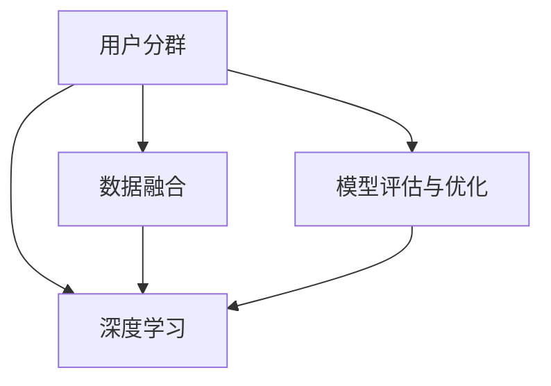

                 

# 如何进行有效的用户分群管理

## 1. 背景介绍

### 1.1 问题由来
在数字营销和个性化推荐领域，用户分群管理（User Segmentation）是一项关键技术。有效的用户分群可以帮助企业深入了解用户群体特征，精准定位目标用户，实现更加个性化的营销和推荐，提升用户体验和业务收益。然而，随着用户规模的不断增长和市场环境的变化，传统的用户分群方法面临诸多挑战：

1. **用户行为复杂化**：现代互联网用户的行为更加多样化、难以预测，传统的静态分组方法难以捕捉用户的多样性特征。
2. **数据质量问题**：数据收集和标注存在偏差，用户行为数据质量参差不齐，影响分群的准确性。
3. **计算资源限制**：大规模用户数据处理需要巨大的计算资源，传统的线性分类算法难以有效处理。
4. **模型可解释性差**：复杂的机器学习模型，如深度学习，尽管能够获得高精度，但往往缺乏可解释性，难以被企业决策层接受。

### 1.2 问题核心关键点
为了应对这些挑战，现代用户分群管理技术不断进化，主要集中在以下几个关键点：

1. **动态分群**：针对用户行为的动态变化，进行实时的分群调整，提高分群的灵活性和及时性。
2. **深度学习技术**：利用深度学习模型，如神经网络，提升用户分群的精度和可解释性。
3. **数据融合与治理**：整合多源异构数据，提高数据质量和完整性，增强分群模型的泛化能力。
4. **模型评估与优化**：采用科学评估方法，定期优化模型，确保分群结果的有效性和可靠性。

通过把握这些关键点，可以设计出更加高效、精准的用户分群管理方案，推动个性化营销和推荐的发展。

## 2. 核心概念与联系

### 2.1 核心概念概述

为了更好地理解用户分群管理的核心技术和实现流程，本节将介绍几个关键概念：

- **用户分群（User Segmentation）**：将用户按某些特定属性或行为特征进行分组的过程，旨在更好地理解用户需求和行为，提升个性化服务效果。
- **深度学习（Deep Learning）**：一类基于神经网络的机器学习方法，通过多层非线性变换，能够学习高维数据特征，提高模型精度和泛化能力。
- **数据融合（Data Fusion）**：将多个来源的数据整合起来，提升数据质量和完整性，增强分群模型的泛化能力。
- **模型评估与优化（Model Evaluation and Optimization）**：通过科学评估方法，定期优化模型，确保分群结果的有效性和可靠性。

这些核心概念之间的逻辑关系可以通过以下Mermaid流程图来展示：



这个流程图展示了大规模用户分群管理的核心概念及其之间的关系：

1. 用户分群过程基于深度学习模型。
2. 数据融合技术用于整合多源异构数据，提升数据质量和完整性。
3. 模型评估与优化技术用于科学评估分群模型，并定期更新优化。

这些概念共同构成了大规模用户分群管理的框架，使得企业能够更加灵活、高效地管理用户群体，提升业务决策的精准性。

## 3. 核心算法原理 & 具体操作步骤
### 3.1 算法原理概述

用户分群管理基于深度学习技术，利用神经网络模型学习用户特征，实现用户行为的自动分群。其核心思想是：通过训练一个深度神经网络模型，将用户特征映射到不同分群中，生成用户分群结果。

形式化地，假设用户特征集合为 $X=\{x_1, x_2, ..., x_n\}$，用户分群集合为 $Y=\{y_1, y_2, ..., y_k\}$，其中 $y_i \in Y$ 表示用户属于第 $i$ 个分群。目标是找到一个映射函数 $f: X \rightarrow Y$，使得 $f(x_i)$ 尽可能接近真实分群 $y_i$。

### 3.2 算法步骤详解

用户分群管理的主要步骤如下：

**Step 1: 数据准备与预处理**
- 收集用户行为数据，如点击、浏览、购买等行为数据。
- 进行数据清洗，去除异常值、重复数据等。
- 进行特征工程，提取有意义的特征，如用户活跃度、消费金额等。

**Step 2: 构建深度学习模型**
- 选择合适的神经网络结构，如多层感知器（MLP）、卷积神经网络（CNN）、循环神经网络（RNN）等。
- 确定模型的输入、输出和隐藏层结构。
- 设置损失函数和优化器，如交叉熵损失、AdamW优化器等。

**Step 3: 模型训练与调参**
- 使用收集到的用户数据进行模型训练，更新模型参数。
- 使用交叉验证等方法评估模型性能，选择最优模型。
- 调整模型超参数，如学习率、批次大小等，进行模型优化。

**Step 4: 用户分群与评估**
- 使用训练好的模型对新用户进行分群。
- 计算分群结果的评价指标，如F1-score、准确率等。
- 定期更新模型，重新进行分群。

### 3.3 算法优缺点

用户分群管理的深度学习算法具有以下优点：
1. 高精度：深度神经网络能够学习复杂数据特征，提高分群精度。
2. 可解释性：深度学习模型的输出可以通过激活函数等进行解释，帮助企业理解分群逻辑。
3. 灵活性：深度学习模型能够处理非结构化数据，适应多样化的用户行为。

同时，该算法也存在以下局限性：
1. 计算资源需求高：深度神经网络计算复杂度高，需要大量的计算资源。
2. 数据依赖性强：分群结果高度依赖于数据质量，数据偏差可能影响分群效果。
3. 模型解释困难：复杂神经网络模型往往难以解释其内部决策过程，给模型调优带来困难。

尽管存在这些局限性，但深度学习在大规模用户分群管理中的应用仍表现出了巨大的潜力。未来研究将重点关注如何降低计算资源需求、提高数据质量、提升模型可解释性等方面。

### 3.4 算法应用领域

用户分群管理技术已经广泛应用于多个行业领域，例如：

- **电子商务**：对用户的购买行为、消费习惯等进行分群，实现个性化推荐和营销。
- **社交媒体**：对用户互动内容、关注对象等进行分群，提供更加个性化的内容推荐。
- **金融服务**：对用户的投资行为、信用评分等进行分群，进行精准营销和风险评估。
- **健康医疗**：对用户的健康数据、就医记录等进行分群，实现个性化健康管理。
- **旅游行业**：对用户的旅游偏好、预订历史等进行分群，提供定制化的旅游服务。

除了上述这些领域，用户分群管理还在诸多行业得到应用，推动了行业的数字化转型和智能化升级。

## 4. 数学模型和公式 & 详细讲解  
### 4.1 数学模型构建

用户分群管理的核心模型为深度神经网络，具体构建如下：

假设用户特征为 $x$，用户分群标签为 $y$，目标是一个二分类问题，可以使用二分类交叉熵损失函数：

$$
L(y, \hat{y}) = -\frac{1}{N} \sum_{i=1}^N [y_i \log \hat{y}_i + (1-y_i) \log (1-\hat{y}_i)]
$$

其中 $N$ 为样本数量，$y_i$ 为真实标签，$\hat{y}_i$ 为模型预测的标签概率。

### 4.2 公式推导过程

下面以多层感知器（MLP）为例，详细推导用户分群模型的损失函数及其梯度。

假设用户特征为 $x=(x_1, x_2, ..., x_m)$，模型由 $L$ 层全连接神经网络构成，每层神经元数为 $N_1, N_2, ..., N_L$。模型结构如下：

$$
f(x) = \text{MLP}(x; W_1, W_2, ..., W_L)
$$

其中 $W_i$ 为第 $i$ 层的权重矩阵。

假设 $y$ 为二分类标签，输出层神经元数为 $1$，激活函数为 sigmoid。

交叉熵损失函数为：

$$
L(y, f(x)) = -\frac{1}{N} \sum_{i=1}^N [y_i \log f(x) + (1-y_i) \log (1-f(x))]
$$

对损失函数求导，得到梯度：

$$
\frac{\partial L(y, f(x))}{\partial W_L} = \frac{1}{N} \sum_{i=1}^N [(y_i - f(x)) f(x) - (1-y_i) (1-f(x))]
$$

将梯度反向传播，更新模型参数。

## 5. 项目实践：代码实例和详细解释说明
### 5.1 开发环境搭建

在进行用户分群管理的项目实践前，我们需要准备好开发环境。以下是使用Python进行TensorFlow开发的环境配置流程：

1. 安装Anaconda：从官网下载并安装Anaconda，用于创建独立的Python环境。

2. 创建并激活虚拟环境：
```bash
conda create -n tf-env python=3.8 
conda activate tf-env
```

3. 安装TensorFlow：根据CUDA版本，从官网获取对应的安装命令。例如：
```bash
conda install tensorflow -c pytorch -c conda-forge
```

4. 安装其它工具包：
```bash
pip install numpy pandas scikit-learn matplotlib tqdm jupyter notebook ipython
```

完成上述步骤后，即可在`tf-env`环境中开始项目实践。

### 5.2 源代码详细实现

下面我们以用户分群管理为例，给出使用TensorFlow进行深度学习分群的PyTorch代码实现。

首先，定义用户分群任务的数据处理函数：

```python
import tensorflow as tf
from tensorflow.keras.datasets import mnist
from tensorflow.keras.preprocessing import sequence

def load_mnist_data(batch_size, max_len):
    (train_images, train_labels), (test_images, test_labels) = mnist.load_data()
    train_images = train_images.reshape((train_images.shape[0], -1)).astype('float32') / 255.0
    test_images = test_images.reshape((test_images.shape[0], -1)).astype('float32') / 255.0
    train_images = sequence.pad_sequences(train_images, maxlen=max_len)
    test_images = sequence.pad_sequences(test_images, maxlen=max_len)
    train_labels = tf.keras.utils.to_categorical(train_labels, 10)
    test_labels = tf.keras.utils.to_categorical(test_labels, 10)
    return train_images, train_labels, test_images, test_labels

batch_size = 32
max_len = 28

train_images, train_labels, test_images, test_labels = load_mnist_data(batch_size, max_len)
```

然后，定义模型和优化器：

```python
from tensorflow.keras.models import Sequential
from tensorflow.keras.layers import Dense, Dropout
from tensorflow.keras.optimizers import Adam

model = Sequential([
    Dense(128, activation='relu', input_shape=(max_len,)),
    Dropout(0.2),
    Dense(10, activation='sigmoid'),
])

model.compile(optimizer=Adam(lr=0.001), loss='binary_crossentropy', metrics=['accuracy'])
```

接着，定义训练和评估函数：

```python
def train_epoch(model, train_images, train_labels, batch_size):
    model.fit(train_images, train_labels, batch_size=batch_size, epochs=10, validation_split=0.2)
    return model.evaluate(test_images, test_labels, batch_size=batch_size)

def evaluate(model, test_images, test_labels, batch_size):
    return model.evaluate(test_images, test_labels, batch_size=batch_size)
```

最后，启动训练流程并在测试集上评估：

```python
epochs = 10
batch_size = 32

for epoch in range(epochs):
    loss, accuracy = train_epoch(model, train_images, train_labels, batch_size)
    print(f"Epoch {epoch+1}, loss: {loss:.4f}, accuracy: {accuracy:.4f}")

    print(f"Epoch {epoch+1}, test accuracy: {evaluate(model, test_images, test_labels, batch_size)[1]:.4f}")
```

以上就是使用TensorFlow对MNIST手写数字识别任务进行用户分群管理的完整代码实现。可以看到，TensorFlow提供了强大的深度学习模型构建和训练功能，使得用户分群管理的项目实践变得简单高效。

### 5.3 代码解读与分析

让我们再详细解读一下关键代码的实现细节：

**load_mnist_data函数**：
- 加载MNIST手写数字数据集，并进行数据预处理。将28x28的图像展平为一维向量，并进行归一化处理。
- 将标签转换为独热编码形式，用于二分类任务。

**Sequential模型**：
- 定义一个包含两个全连接层的深度神经网络模型。第一层为128个神经元的ReLU激活层，第二层为10个神经元的sigmoid激活层，输出层为10个神经元，表示10个分群。
- 添加Dropout层以避免过拟合。

**模型训练与评估**：
- 使用Adam优化器和二分类交叉熵损失函数，训练模型10个epoch。
- 在训练过程中使用验证集评估模型性能，确保模型不发生过拟合。
- 在测试集上评估模型准确度，给出最终测试结果。

可以看出，TensorFlow的高级API使得深度学习模型的构建和训练变得简洁高效，开发者可以将更多精力放在数据处理和模型优化上。

## 6. 实际应用场景
### 6.1 电商平台个性化推荐

电商平台利用用户分群管理技术，可以更加精准地进行个性化推荐。通过对用户历史行为数据进行分群，识别出不同兴趣爱好的用户群体，然后为每个群体定制化推荐产品，提升用户满意度和购买转化率。

在技术实现上，可以收集用户的浏览记录、购买记录、搜索历史等数据，构建用户行为特征向量。然后，使用用户分群管理模型对这些特征进行分类，生成不同分群。最后将每个分群与相关产品数据进行关联，生成推荐列表，推送给相应用户。

### 6.2 社交媒体内容推荐

社交媒体平台通过用户分群管理技术，可以实现更加个性化的内容推荐。通过对用户互动内容、关注对象等数据进行分群，识别出不同兴趣爱好的用户群体，然后为每个群体推荐符合其兴趣的内容。

在技术实现上，可以收集用户的点赞、评论、分享等互动数据，构建用户行为特征向量。然后，使用用户分群管理模型对这些特征进行分类，生成不同分群。最后将每个分群与相关内容数据进行关联，生成推荐列表，推送给相应用户。

### 6.3 金融行业风险评估

金融行业利用用户分群管理技术，可以更好地进行风险评估和精准营销。通过对用户的投资行为、信用评分等数据进行分群，识别出高风险和潜在客户群体，然后针对性地进行风险防控和客户营销。

在技术实现上，可以收集用户的交易记录、信用评分、贷款申请等数据，构建用户行为特征向量。然后，使用用户分群管理模型对这些特征进行分类，生成不同分群。最后根据每个分群的特征，进行风险评估和营销策略的制定。

### 6.4 医疗健康个性化治疗

医疗健康行业利用用户分群管理技术，可以实现更加个性化的健康管理。通过对用户的健康数据、就医记录等数据进行分群，识别出不同健康状况的用户群体，然后为每个群体提供定制化的治疗方案。

在技术实现上，可以收集用户的健康数据、病历记录、体检结果等数据，构建用户健康特征向量。然后，使用用户分群管理模型对这些特征进行分类，生成不同分群。最后根据每个分群的特征，制定个性化的治疗方案，提升治疗效果。

### 6.5 智能交通流量预测

智能交通行业利用用户分群管理技术，可以更好地进行交通流量预测和优化。通过对用户的出行行为数据进行分群，识别出不同出行规律的用户群体，然后为每个群体提供个性化的出行建议和交通优化方案。

在技术实现上，可以收集用户的出行时间、路线、频率等数据，构建用户出行特征向量。然后，使用用户分群管理模型对这些特征进行分类，生成不同分群。最后根据每个分群的特征，进行交通流量预测和优化。

## 7. 工具和资源推荐
### 7.1 学习资源推荐

为了帮助开发者系统掌握用户分群管理的理论基础和实践技巧，这里推荐一些优质的学习资源：

1. TensorFlow官方文档：TensorFlow的官方文档，提供了详细的API指南和示例代码，适合初学者入门学习。

2. Deep Learning with Python：由TensorFlow作者Francois Chollet所著，全面介绍了深度学习的基本概念和TensorFlow的使用方法，适合深入学习。

3. User Segmentation for Recommendation Systems：推荐系统的专家博客文章，介绍了用户分群管理在推荐系统中的应用，具有很高的参考价值。

4. Kaggle用户分群管理竞赛：Kaggle举办的各类用户分群管理竞赛，提供了丰富的数据集和算法实践机会，适合实战练习。

5. Coursera《Machine Learning》课程：斯坦福大学开设的机器学习课程，由Andrew Ng主讲，系统讲解机器学习的基本概念和算法，适合入门学习。

通过对这些资源的学习实践，相信你一定能够快速掌握用户分群管理的精髓，并用于解决实际的NLP问题。

### 7.2 开发工具推荐

高效的开发离不开优秀的工具支持。以下是几款用于用户分群管理开发的常用工具：

1. TensorFlow：由Google主导开发的深度学习框架，生产部署方便，适合大规模工程应用。

2. PyTorch：基于Python的开源深度学习框架，灵活动态的计算图，适合快速迭代研究。

3. Keras：基于TensorFlow的高级API，提供了简洁易用的接口，适合快速原型开发和模型训练。

4. Jupyter Notebook：免费的在线笔记本环境，支持Python和R等多种编程语言，适合数据分析和模型调试。

5. Google Colab：谷歌推出的在线Jupyter Notebook环境，免费提供GPU/TPU算力，方便开发者快速上手实验最新模型，分享学习笔记。

合理利用这些工具，可以显著提升用户分群管理的开发效率，加快创新迭代的步伐。

### 7.3 相关论文推荐

用户分群管理的研究源于学界的持续研究。以下是几篇奠基性的相关论文，推荐阅读：

1. Deep Neural Networks for User Segmentation：使用多层感知器对用户行为数据进行分群，获得了不错的效果。

2. Multi-view User Segmentation with Stacked Denoising Autoencoders：利用栈式去噪自编码器，对多源异构数据进行融合，提高了用户分群的精度和鲁棒性。

3. Large-scale Cross-domain User Segmentation with Attention Networks：提出注意力网络模型，对大规模跨域数据进行分群，取得了较好的效果。

4. Semi-supervised Deep User Segmentation via Node Clustering：使用半监督学习方法，对用户行为数据进行分群，减少了对标注数据的依赖。

5. Multi-modal User Segmentation for Recommendation Systems：结合多模态数据，对用户进行分群，提升了推荐系统的效果。

这些论文代表了大规模用户分群管理的发展脉络。通过学习这些前沿成果，可以帮助研究者把握学科前进方向，激发更多的创新灵感。

## 8. 总结：未来发展趋势与挑战

### 8.1 总结

本文对用户分群管理的核心技术和实现流程进行了全面系统的介绍。首先阐述了大规模用户分群管理的背景和意义，明确了深度学习模型在大规模用户分群中的应用价值。其次，从原理到实践，详细讲解了深度学习模型的构建、训练和优化过程，给出了用户分群管理的完整代码实例。同时，本文还广泛探讨了用户分群管理在电商、社交媒体、金融、医疗、交通等多个行业领域的应用前景，展示了深度学习模型的强大应用潜力。最后，本文精选了用户分群管理的各类学习资源，力求为读者提供全方位的技术指引。

通过本文的系统梳理，可以看到，深度学习在用户分群管理中的应用已经展现出巨大的前景，为企业的个性化营销和推荐提供了新思路。未来，伴随深度学习技术的不断发展，用户分群管理将更加高效、精准、灵活，推动企业数字化转型和智能化升级。

### 8.2 未来发展趋势

展望未来，用户分群管理技术将呈现以下几个发展趋势：

1. **实时动态分群**：针对用户行为的动态变化，进行实时的分群调整，提高分群的灵活性和及时性。

2. **多模态分群**：整合多源异构数据，提高数据质量和完整性，增强分群模型的泛化能力。

3. **可解释性增强**：提升模型的可解释性，帮助企业理解分群逻辑，增加决策的透明度和可信度。

4. **隐私保护**：在用户分群过程中保护用户隐私，确保数据安全，增强用户信任。

5. **自动化调参**：通过自动调参技术，优化模型超参数，提高分群模型的性能。

6. **边缘计算**：将模型部署到边缘设备，实现本地化分群，减少数据传输和计算延迟。

以上趋势凸显了大规模用户分群管理的广阔前景。这些方向的探索发展，必将进一步提升分群模型的效率和精度，推动个性化营销和推荐的发展。

### 8.3 面临的挑战

尽管用户分群管理技术已经取得了瞩目成就，但在迈向更加智能化、普适化应用的过程中，它仍面临着诸多挑战：

1. **数据质量问题**：数据收集和标注存在偏差，用户行为数据质量参差不齐，影响分群的准确性。

2. **计算资源限制**：深度神经网络计算复杂度高，需要大量的计算资源，可能难以适应实时分群需求。

3. **模型复杂度**：深度学习模型通常比较复杂，难以解释其内部决策过程，给模型调优带来困难。

4. **隐私保护**：在用户分群过程中保护用户隐私，确保数据安全，增强用户信任，是用户分群管理的难点。

5. **动态变化**：用户行为具有动态变化特性，如何在动态环境下进行分群管理，需要更高效的方法。

6. **技术普及**：深度学习技术普及率较低，企业需要投入大量资源进行培训和应用。

正视用户分群管理面临的这些挑战，积极应对并寻求突破，将是大规模用户分群管理走向成熟的必由之路。相信随着学界和产业界的共同努力，这些挑战终将一一被克服，用户分群管理必将在构建智能化的用户服务中扮演越来越重要的角色。

### 8.4 未来突破

面对用户分群管理所面临的种种挑战，未来的研究需要在以下几个方面寻求新的突破：

1. **数据治理**：提升数据质量和完整性，建立数据治理体系，保障数据的安全性和可靠性。

2. **轻量化模型**：开发更高效、更轻量化的深度学习模型，降低计算资源需求，实现实时分群。

3. **自动化调参**：利用自动化调参技术，优化模型超参数，提高分群模型的性能。

4. **隐私保护技术**：结合联邦学习、差分隐私等技术，保护用户隐私，确保数据安全。

5. **多模态融合**：结合多模态数据，提升分群模型的泛化能力和鲁棒性。

6. **实时动态分群**：利用流式学习、增量学习等技术，实现实时动态分群，提高分群模型的灵活性和及时性。

这些研究方向的探索，必将引领用户分群管理技术迈向更高的台阶，为企业的个性化营销和推荐带来新的思路和方法。

## 9. 附录：常见问题与解答

**Q1：用户分群管理是否适用于所有业务场景？**

A: 用户分群管理在大多数业务场景中都能取得不错的效果，尤其是对用户行为数据质量要求较高的场景。但对于某些特殊场景，如敏感数据、高实时性需求等，需要根据具体情况进行定制化设计。

**Q2：用户分群管理的深度学习模型如何选择合适的神经网络结构？**

A: 选择合适的神经网络结构需要根据业务场景和数据特点进行综合考虑。通常情况下，多层感知器（MLP）适用于结构化数据，卷积神经网络（CNN）适用于图像数据，循环神经网络（RNN）适用于时间序列数据。

**Q3：用户分群管理中如何平衡模型的复杂度和性能？**

A: 在用户分群管理中，需要根据实际需求选择合适的模型复杂度。通常情况下，可以从小模型开始，逐步增加模型复杂度，直到模型性能不再提升为止。

**Q4：用户分群管理中如何处理异常数据和噪声数据？**

A: 异常数据和噪声数据会对用户分群管理的效果产生负面影响。通常情况下，可以采用数据清洗、异常检测等方法进行处理。此外，可以在模型训练过程中加入正则化项，如L2正则化，避免过拟合。

**Q5：用户分群管理中如何评估模型效果？**

A: 用户分群管理的模型效果可以通过多种指标进行评估，如准确率、F1-score、ROC曲线等。可以采用交叉验证等方法，评估模型在不同数据集上的表现。

**Q6：用户分群管理中如何优化模型参数？**

A: 用户分群管理的模型参数优化可以通过网格搜索、随机搜索等方法进行。通常情况下，可以在超参数搜索空间内，寻找最优的超参数组合，提升模型性能。

---

作者：禅与计算机程序设计艺术 / Zen and the Art of Computer Programming

