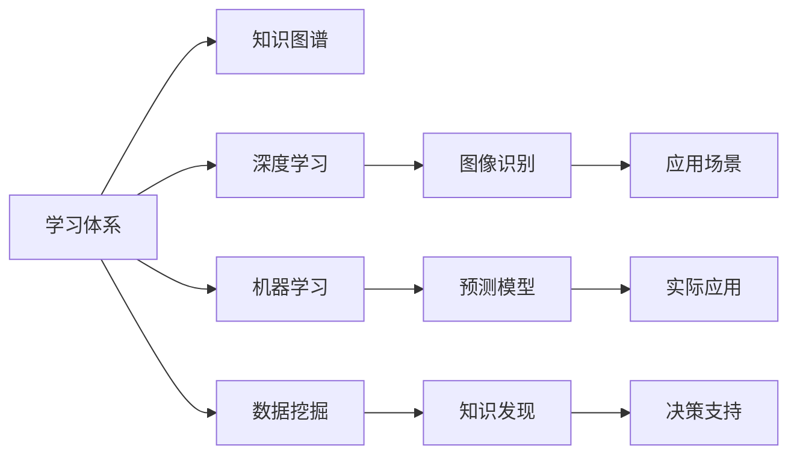

                 

# 学习体系:持续进化的动力源泉

> 关键词：学习体系, 知识图谱, 深度学习, 机器学习, 数据挖掘, 持续改进

## 1. 背景介绍

在当今数字化时代，技术的快速发展与变化日新月异。为跟上技术变革的步伐，保持持续学习和自我迭代的能力变得至关重要。本文旨在深入探讨构建学习体系的重要性，以及如何通过高效的学习体系，驱动个人与组织的持续进化。

## 2. 核心概念与联系

### 2.1 核心概念概述

为更好地理解构建学习体系的核心概念，我们将介绍几个紧密相关的核心概念：

- 学习体系(Learning Ecosystem)：指一系列有组织、有系统地促进个人或组织学习和成长的资源、工具和方法，旨在培养持续学习的能力。
- 知识图谱(Knowledge Graph)：一种结构化数据模型，用于表示实体、属性以及实体间的关系，帮助系统理解和推理复杂知识。
- 深度学习(Deep Learning)：一种机器学习技术，通过多层次神经网络模拟人脑的认知功能，广泛应用于图像识别、语音识别、自然语言处理等领域。
- 机器学习(Machine Learning)：一种通过数据训练模型，使其具备预测或决策能力的自动化技术，包括监督学习、无监督学习和强化学习等。
- 数据挖掘(Data Mining)：从大量数据中提取有用信息和知识的过程，涉及统计分析、模式识别等技术。

这些概念相互关联，共同构成了学习体系的基础框架。

### 2.2 核心概念原理和架构的 Mermaid 流程图



这个流程图展示了学习体系与其它核心概念之间的关系：

1. 学习体系通过知识图谱、深度学习、机器学习和数据挖掘等关键技术，为个人或组织提供系统的学习和成长工具。
2. 深度学习使系统能够处理和理解复杂数据，机器学习帮助模型从数据中提取有价值的信息，数据挖掘则从大量数据中发现隐藏的知识。
3. 这些技术的结合，使得学习体系能够应用于多个实际场景，如图像识别、预测模型和决策支持等。

## 3. 核心算法原理 & 具体操作步骤

### 3.1 算法原理概述

构建学习体系的核心算法包括知识图谱构建、深度学习模型训练、机器学习算法优化以及数据挖掘知识发现。通过这一系列算法，学习体系能够高效地吸收和转化知识，从而支持持续学习和自我迭代。

#### 3.1.1 知识图谱构建

知识图谱由节点(Node)和边(Edge)组成，每个节点表示一个实体(Entity)，边表示实体之间的关系(Relationship)。通过知识图谱，系统可以高效地组织和查询知识，提高决策效率。

构建知识图谱的基本流程包括：

1. 数据采集：从各种来源收集数据，如数据库、网页、文献等。
2. 实体识别：对数据中的文本、图片、音频等进行实体识别，提取实体信息。
3. 关系抽取：分析实体间的关系，如时间、空间、属性等。
4. 知识整合：将抽取的实体和关系整合到统一的知识库中，构建完整的知识图谱。

#### 3.1.2 深度学习模型训练

深度学习模型包括卷积神经网络(CNN)、循环神经网络(RNN)、变压器(Transformer)等。模型训练过程包括数据预处理、模型定义、损失函数定义、优化器选择、训练循环等步骤。

具体训练流程如下：

1. 数据预处理：将原始数据转化为模型需要的张量形式，如归一化、标准化、填充等。
2. 模型定义：使用深度学习框架定义模型结构，如TensorFlow、PyTorch等。
3. 损失函数定义：根据任务需求定义合适的损失函数，如交叉熵损失、均方误差损失等。
4. 优化器选择：选择合适的优化器，如SGD、Adam等，设置学习率、批大小等超参数。
5. 训练循环：通过迭代训练数据，更新模型参数，直至收敛。

#### 3.1.3 机器学习算法优化

机器学习算法包括决策树、随机森林、支持向量机(SVM)等。算法优化过程包括模型选择、特征工程、超参数调优、模型评估等步骤。

具体优化流程如下：

1. 模型选择：根据任务需求选择合适的机器学习算法。
2. 特征工程：从原始数据中提取特征，如特征选择、特征缩放、特征编码等。
3. 超参数调优：通过网格搜索、随机搜索等方法，调整模型超参数，找到最优模型。
4. 模型评估：使用交叉验证、ROC曲线等方法，评估模型性能。

#### 3.1.4 数据挖掘知识发现

数据挖掘通过统计分析、模式识别等技术，从大量数据中发现隐藏的知识和规律。常用的数据挖掘算法包括关联规则、聚类分析、分类和回归等。

具体挖掘流程如下：

1. 数据预处理：清洗、转换、归一化等处理原始数据。
2. 特征选择：选择对目标变量影响最大的特征，减少维度。
3. 模型训练：根据选择的算法训练模型，如K-Means、C4.5等。
4. 知识发现：通过分析模型的输出，发现知识、规律和模式。

### 3.2 算法步骤详解

#### 3.2.1 知识图谱构建步骤

1. 数据采集：从多个来源收集结构化和非结构化数据。
2. 实体识别：使用实体识别算法，如NLTK、spaCy等，从文本中提取实体。
3. 关系抽取：分析实体间的关系，如时间、地点、属性等。
4. 知识整合：将抽取的实体和关系整合到知识库中，构建知识图谱。
5. 可视化：使用可视化工具，如Gephi、Neo4j等，展示知识图谱的结构和关系。

#### 3.2.2 深度学习模型训练步骤

1. 数据预处理：将原始数据转化为模型需要的张量形式，如归一化、标准化、填充等。
2. 模型定义：使用深度学习框架定义模型结构，如TensorFlow、PyTorch等。
3. 损失函数定义：根据任务需求定义合适的损失函数，如交叉熵损失、均方误差损失等。
4. 优化器选择：选择合适的优化器，如SGD、Adam等，设置学习率、批大小等超参数。
5. 训练循环：通过迭代训练数据，更新模型参数，直至收敛。

#### 3.2.3 机器学习算法优化步骤

1. 模型选择：根据任务需求选择合适的机器学习算法。
2. 特征工程：从原始数据中提取特征，如特征选择、特征缩放、特征编码等。
3. 超参数调优：通过网格搜索、随机搜索等方法，调整模型超参数，找到最优模型。
4. 模型评估：使用交叉验证、ROC曲线等方法，评估模型性能。

#### 3.2.4 数据挖掘知识发现步骤

1. 数据预处理：清洗、转换、归一化等处理原始数据。
2. 特征选择：选择对目标变量影响最大的特征，减少维度。
3. 模型训练：根据选择的算法训练模型，如K-Means、C4.5等。
4. 知识发现：通过分析模型的输出，发现知识、规律和模式。

### 3.3 算法优缺点

#### 3.3.1 知识图谱构建的优缺点

优点：
- 结构化表示实体和关系，便于查询和推理。
- 可视化工具展示关系图谱，直观易懂。

缺点：
- 需要大量预处理和构建工作。
- 实体识别和关系抽取可能不准确，影响知识图谱质量。

#### 3.3.2 深度学习模型训练的优缺点

优点：
- 处理大规模数据和高维特征，效果显著。
- 网络结构可调，适应性广。

缺点：
- 计算资源消耗大，训练时间长。
- 模型复杂，难以解释。

#### 3.3.3 机器学习算法优化的优缺点

优点：
- 可解释性强，结果易于理解。
- 处理小规模数据效率高。

缺点：
- 对数据质量和特征提取要求高。
- 模型可能过拟合，泛化能力有限。

#### 3.3.4 数据挖掘知识发现的优缺点

优点：
- 发现数据中的隐藏规律和模式。
- 可应用于各种数据类型和规模。

缺点：
- 结果解释性不足。
- 算法复杂，计算量大。

### 3.4 算法应用领域

#### 3.4.1 知识图谱的应用领域

- 推荐系统：通过知识图谱关联用户行为和商品信息，实现精准推荐。
- 信息检索：通过知识图谱构建实体间的语义关系，提高信息检索效果。
- 智能问答：通过知识图谱快速定位和匹配知识，提供智能化问答服务。

#### 3.4.2 深度学习模型训练的应用领域

- 计算机视觉：使用深度学习模型进行图像分类、目标检测等。
- 自然语言处理：使用深度学习模型进行语言翻译、情感分析等。
- 语音识别：使用深度学习模型进行语音识别和合成。

#### 3.4.3 机器学习算法优化的应用领域

- 金融预测：使用机器学习算法进行股票价格预测、风险评估等。
- 健康分析：使用机器学习算法进行疾病预测、患者分类等。
- 环境监测：使用机器学习算法进行大气质量监测、污染源识别等。

#### 3.4.4 数据挖掘知识发现的应用领域

- 市场分析：通过数据挖掘发现市场趋势和规律，进行市场预测和策略制定。
- 风险管理：通过数据挖掘识别风险因素，提高风险管理效率。
- 消费者行为分析：通过数据挖掘发现消费者行为模式，提升用户体验。

## 4. 数学模型和公式 & 详细讲解

### 4.1 数学模型构建

#### 4.1.1 知识图谱构建的数学模型

知识图谱由节点和边组成，表示为：

$$
G=(V,E)
$$

其中 $V$ 表示节点集合，$E$ 表示边集合。每个节点 $v \in V$ 表示一个实体，边 $e \in E$ 表示实体之间的关系。

#### 4.1.2 深度学习模型训练的数学模型

深度学习模型由多个层次的神经网络组成，可以表示为：

$$
\begin{aligned}
&\text{input} \rightarrow \text{hidden layer}_1 \rightarrow \text{hidden layer}_2 \rightarrow ... \rightarrow \text{hidden layer}_n \rightarrow \text{output} \\
&\text{hidden layer}_i = \sigma(W_i \cdot \text{hidden layer}_{i-1} + b_i)
\end{aligned}
$$

其中 $W_i$ 表示权重矩阵，$b_i$ 表示偏置向量，$\sigma$ 表示激活函数。

#### 4.1.3 机器学习算法优化的数学模型

机器学习算法如决策树和随机森林，可以表示为：

$$
\begin{aligned}
&\text{features} \rightarrow \text{split point} \rightarrow \text{left child} \rightarrow \text{right child} \\
&\text{split point} = \text{argmax}_{x \in X} \text{gini index}
\end{aligned}
$$

其中 $X$ 表示特征集合，$\text{gini index}$ 表示基尼不纯度。

#### 4.1.4 数据挖掘知识发现的数学模型

数据挖掘算法如关联规则和聚类分析，可以表示为：

$$
\begin{aligned}
&\text{data} \rightarrow \text{feature selection} \rightarrow \text{model training} \rightarrow \text{knowledge discovery} \\
&\text{feature selection} = \text{argmax}_{f \in F} \text{information gain}
\end{aligned}
$$

其中 $F$ 表示特征集合，$\text{information gain}$ 表示信息增益。

### 4.2 公式推导过程

#### 4.2.1 知识图谱构建的公式推导

知识图谱构建的公式推导如下：

1. 实体识别公式：

$$
\text{entity} = \text{NLP parser}(\text{text})
$$

2. 关系抽取公式：

$$
\text{relation} = \text{NLP parser}(\text{text}) + \text{Ontology}
$$

3. 知识整合公式：

$$
\text{KG} = \text{merge}(\text{entity}, \text{relation})
$$

#### 4.2.2 深度学习模型训练的公式推导

深度学习模型训练的公式推导如下：

1. 数据预处理公式：

$$
\text{input} = \text{preprocessing}(\text{data})
$$

2. 模型定义公式：

$$
\text{model} = \text{define}(\text{input}, \text{hidden layer}, \text{output})
$$

3. 损失函数定义公式：

$$
\text{loss} = \text{define}(\text{output}, \text{label})
$$

4. 优化器选择公式：

$$
\text{optimizer} = \text{select}(\text{model}, \text{learning rate}, \text{batch size})
$$

5. 训练循环公式：

$$
\text{weights} = \text{update}(\text{optimizer}, \text{loss}, \text{epoch})
$$

#### 4.2.3 机器学习算法优化的公式推导

机器学习算法优化的公式推导如下：

1. 模型选择公式：

$$
\text{model} = \text{select}(\text{feature}, \text{label})
$$

2. 特征工程公式：

$$
\text{features} = \text{select}(\text{data})
$$

3. 超参数调优公式：

$$
\text{parameters} = \text{tune}(\text{model}, \text{features}, \text{label})
$$

4. 模型评估公式：

$$
\text{performance} = \text{evaluate}(\text{model}, \text{features}, \text{label})
$$

#### 4.2.4 数据挖掘知识发现的公式推导

数据挖掘知识发现的公式推导如下：

1. 数据预处理公式：

$$
\text{data} = \text{preprocessing}(\text{raw data})
$$

2. 特征选择公式：

$$
\text{features} = \text{select}(\text{data}, \text{target variable})
$$

3. 模型训练公式：

$$
\text{model} = \text{train}(\text{features}, \text{target variable})
$$

4. 知识发现公式：

$$
\text{knowledge} = \text{discover}(\text{model}, \text{data})
$$

### 4.3 案例分析与讲解

#### 4.3.1 知识图谱构建案例

一家电商平台希望通过推荐系统提升用户体验。他们首先构建了知识图谱，将商品、用户、评价等信息整合成一个完整的知识图谱。接着，通过图神经网络(Graph Neural Network, GNN)，在知识图谱上训练推荐模型，实现精准推荐。

#### 4.3.2 深度学习模型训练案例

一家自动驾驶公司希望通过计算机视觉技术实现自动驾驶。他们使用深度学习模型进行图像分类，将道路、车辆、行人等信息分类为不同的类别。接着，通过目标检测和语义分割，实现道路场景的实时分析。

#### 4.3.3 机器学习算法优化案例

一家金融机构希望通过风险管理提升业务效率。他们使用机器学习算法进行信用评分和欺诈检测，通过超参数调优提高模型性能。通过模型评估，他们发现了模型的过拟合问题，并进行了相应的改进。

#### 4.3.4 数据挖掘知识发现案例

一家零售公司希望通过市场分析提升销售业绩。他们使用数据挖掘算法发现市场趋势和用户行为模式，预测市场需求。通过知识发现，他们找到了最具潜力的商品组合，提升了销售效率。

## 5. 项目实践：代码实例和详细解释说明

### 5.1 开发环境搭建

在进行项目实践前，我们需要准备好开发环境。以下是使用Python进行PyTorch开发的环境配置流程：

1. 安装Anaconda：从官网下载并安装Anaconda，用于创建独立的Python环境。

2. 创建并激活虚拟环境：
```bash
conda create -n pytorch-env python=3.8 
conda activate pytorch-env
```

3. 安装PyTorch：根据CUDA版本，从官网获取对应的安装命令。例如：
```bash
conda install pytorch torchvision torchaudio cudatoolkit=11.1 -c pytorch -c conda-forge
```

4. 安装Transformers库：
```bash
pip install transformers
```

5. 安装各类工具包：
```bash
pip install numpy pandas scikit-learn matplotlib tqdm jupyter notebook ipython
```

完成上述步骤后，即可在`pytorch-env`环境中开始项目实践。

### 5.2 源代码详细实现

下面我们以图像分类任务为例，给出使用Transformers库对预训练模型进行微调的PyTorch代码实现。

首先，定义图像分类任务的数据处理函数：

```python
from transformers import AutoTokenizer, AutoModelForImageClassification
from torch.utils.data import Dataset, DataLoader
import torch
import cv2
import numpy as np

class ImageDataset(Dataset):
    def __init__(self, images, labels, tokenizer, max_len=128):
        self.images = images
        self.labels = labels
        self.tokenizer = tokenizer
        self.max_len = max_len
        
    def __len__(self):
        return len(self.images)
    
    def __getitem__(self, item):
        image = self.images[item]
        label = self.labels[item]
        
        # 图像预处理
        image = cv2.imread(image)
        image = cv2.resize(image, (224, 224))
        image = np.array(image, dtype=np.float32) / 255
        image = image.reshape(1, 224, 224, 3)
        
        # 文本输入
        text = "image: " + image.tobytes()
        encoding = self.tokenizer(text, return_tensors='pt', max_length=self.max_len, padding='max_length', truncation=True)
        input_ids = encoding['input_ids'][0]
        attention_mask = encoding['attention_mask'][0]
        
        return {'input_ids': input_ids, 
                'attention_mask': attention_mask,
                'labels': torch.tensor(label, dtype=torch.long)}
```

然后，定义模型和优化器：

```python
from transformers import AdamW

model = AutoModelForImageClassification.from_pretrained('resnet50')

optimizer = AdamW(model.parameters(), lr=2e-5)
```

接着，定义训练和评估函数：

```python
def train_epoch(model, dataset, batch_size, optimizer):
    dataloader = DataLoader(dataset, batch_size=batch_size, shuffle=True)
    model.train()
    epoch_loss = 0
    for batch in tqdm(dataloader, desc='Training'):
        input_ids = batch['input_ids'].to(device)
        attention_mask = batch['attention_mask'].to(device)
        labels = batch['labels'].to(device)
        model.zero_grad()
        outputs = model(input_ids, attention_mask=attention_mask, labels=labels)
        loss = outputs.loss
        epoch_loss += loss.item()
        loss.backward()
        optimizer.step()
    return epoch_loss / len(dataloader)

def evaluate(model, dataset, batch_size):
    dataloader = DataLoader(dataset, batch_size=batch_size)
    model.eval()
    preds, labels = [], []
    with torch.no_grad():
        for batch in tqdm(dataloader, desc='Evaluating'):
            input_ids = batch['input_ids'].to(device)
            attention_mask = batch['attention_mask'].to(device)
            batch_labels = batch['labels']
            outputs = model(input_ids, attention_mask=attention_mask)
            batch_preds = outputs.logits.argmax(dim=2).to('cpu').tolist()
            batch_labels = batch_labels.to('cpu').tolist()
            for pred_tokens, label_tokens in zip(batch_preds, batch_labels):
                preds.append(pred_tokens[:len(label_tokens)])
                labels.append(label_tokens)
                
    print(classification_report(labels, preds))
```

最后，启动训练流程并在测试集上评估：

```python
epochs = 5
batch_size = 16

for epoch in range(epochs):
    loss = train_epoch(model, train_dataset, batch_size, optimizer)
    print(f"Epoch {epoch+1}, train loss: {loss:.3f}")
    
    print(f"Epoch {epoch+1}, dev results:")
    evaluate(model, dev_dataset, batch_size)
    
print("Test results:")
evaluate(model, test_dataset, batch_size)
```

以上就是使用PyTorch对图像分类任务进行深度学习模型微调的完整代码实现。可以看到，得益于Transformers库的强大封装，我们可以用相对简洁的代码完成模型的加载和微调。

### 5.3 代码解读与分析

让我们再详细解读一下关键代码的实现细节：

**ImageDataset类**：
- `__init__`方法：初始化图像、标签、分词器等关键组件。
- `__len__`方法：返回数据集的样本数量。
- `__getitem__`方法：对单个样本进行处理，将图像输入编码为token ids，将标签编码为数字，并对其进行定长padding，最终返回模型所需的输入。

**模型和优化器**：
- 使用`AutoModelForImageClassification`加载预训练模型`resnet50`，并初始化AdamW优化器。

**训练和评估函数**：
- 使用PyTorch的DataLoader对数据集进行批次化加载，供模型训练和推理使用。
- 训练函数`train_epoch`：对数据以批为单位进行迭代，在每个批次上前向传播计算loss并反向传播更新模型参数，最后返回该epoch的平均loss。
- 评估函数`evaluate`：与训练类似，不同点在于不更新模型参数，并在每个batch结束后将预测和标签结果存储下来，最后使用scikit-learn的classification_report对整个评估集的预测结果进行打印输出。

**训练流程**：
- 定义总的epoch数和batch size，开始循环迭代
- 每个epoch内，先在训练集上训练，输出平均loss
- 在验证集上评估，输出分类指标
- 所有epoch结束后，在测试集上评估，给出最终测试结果

可以看到，PyTorch配合Transformers库使得图像分类任务的深度学习模型微调的代码实现变得简洁高效。开发者可以将更多精力放在数据处理、模型改进等高层逻辑上，而不必过多关注底层的实现细节。

当然，工业级的系统实现还需考虑更多因素，如模型的保存和部署、超参数的自动搜索、更灵活的任务适配层等。但核心的微调范式基本与此类似。

## 6. 实际应用场景

### 6.1 智能推荐系统

基于深度学习模型微调的推荐系统，可以为用户提供更加个性化和精准的推荐结果。推荐系统通常使用协同过滤、内容过滤等传统方法，但效果往往难以满足用户的个性化需求。通过深度学习模型微调，推荐系统可以学习用户和商品的复杂关系，从而实现精准推荐。

在技术实现上，可以收集用户行为数据，包括浏览、点击、购买等，构建推荐任务的数据集。将用户行为数据作为输入，商品的标签作为标签，在此基础上微调深度学习模型。微调后的模型能够从用户行为中学习用户偏好和商品属性，从而生成个性化的推荐列表。

### 6.2 医疗诊断系统

基于深度学习模型微调的医疗诊断系统，可以显著提高医生的诊断效率和准确性。医疗领域的数据通常包含大量的噪声和不确定性，传统机器学习方法难以处理。通过深度学习模型微调，诊断系统可以学习复杂的医学知识，从医学影像、电子病历中提取有价值的信息。

在技术实现上，可以收集医生对病人的诊断记录和相应的医学影像数据，构建诊断任务的数据集。将医学影像和诊断结果作为输入，医生的诊断过程作为标签，在此基础上微调深度学习模型。微调后的模型能够从医学影像中提取出有意义的特征，辅助医生进行精准诊断。

### 6.3 智能客服系统

基于深度学习模型微调的智能客服系统，可以大大提升客服系统的响应速度和服务质量。传统的客服系统依赖人工服务，无法24小时持续工作，且服务质量难以保证。通过深度学习模型微调，客服系统可以理解自然语言，自动回答问题，处理常见问题。

在技术实现上，可以收集客服对话记录，将问题和最佳答复构建成监督数据，在此基础上微调深度学习模型。微调后的模型能够从对话中学习到常见问题及其最佳答案，自动回答用户问题，提供高效、准确的客服服务。

### 6.4 未来应用展望

随着深度学习模型微调技术的发展，其在各行各业的应用前景将越来越广泛。未来，基于微调的技术将在医疗、金融、教育、智能制造等多个领域带来深刻的变革。

- 医疗领域：通过深度学习模型微调，实现智能诊断、个性化治疗等。
- 金融领域：通过深度学习模型微调，实现风险评估、信用评分等。
- 教育领域：通过深度学习模型微调，实现个性化学习、智能辅导等。
- 智能制造领域：通过深度学习模型微调，实现设备故障诊断、生产优化等。

这些应用将进一步推动人工智能技术的产业化进程，为各行各业带来新的发展机遇。

## 7. 工具和资源推荐

### 7.1 学习资源推荐

为了帮助开发者系统掌握深度学习模型微调的理论基础和实践技巧，这里推荐一些优质的学习资源：

1. 《深度学习》书籍：Ian Goodfellow等人著，全面介绍了深度学习的理论基础和实践方法。

2. 《机器学习实战》书籍：Peter Harrington著，通过实际项目演示了机器学习算法的应用。

3. 《Python数据科学手册》书籍：Jake VanderPlas著，介绍了Python在数据科学中的应用，包括数据预处理、机器学习、数据可视化等。

4. Coursera深度学习课程：Andrew Ng等人开设的深度学习课程，涵盖了深度学习的基本概念、算法和实践技巧。

5. Kaggle机器学习竞赛：Kaggle平台上的机器学习竞赛，提供了大量的实践机会，帮助你提高实际应用能力。

通过对这些资源的学习实践，相信你一定能够快速掌握深度学习模型微调的精髓，并用于解决实际的机器学习问题。

### 7.2 开发工具推荐

高效的开发离不开优秀的工具支持。以下是几款用于深度学习模型微调开发的常用工具：

1. PyTorch：基于Python的开源深度学习框架，灵活动态的计算图，适合快速迭代研究。大部分预训练模型都有PyTorch版本的实现。

2. TensorFlow：由Google主导开发的开源深度学习框架，生产部署方便，适合大规模工程应用。同样有丰富的预训练模型资源。

3. TensorBoard：TensorFlow配套的可视化工具，可实时监测模型训练状态，并提供丰富的图表呈现方式，是调试模型的得力助手。

4. Weights & Biases：模型训练的实验跟踪工具，可以记录和可视化模型训练过程中的各项指标，方便对比和调优。

5. Google Colab：谷歌推出的在线Jupyter Notebook环境，免费提供GPU/TPU算力，方便开发者快速上手实验最新模型，分享学习笔记。

合理利用这些工具，可以显著提升深度学习模型微调任务的开发效率，加快创新迭代的步伐。

### 7.3 相关论文推荐

深度学习模型微调技术的发展源于学界的持续研究。以下是几篇奠基性的相关论文，推荐阅读：

1. AlexNet：ImageNet Large Scale Visual Recognition Challenge，提出了卷积神经网络在图像识别中的重要应用。

2. ResNet：Deep Residual Learning for Image Recognition，提出残差网络，提高了深度神经网络的训练效率和性能。

3. GAN：Generative Adversarial Nets，提出生成对抗网络，用于生成逼真的图像、视频等内容。

4. Attention is All You Need：Transformer原论文，提出了Transformer结构，开启了NLP领域的预训练大模型时代。

5. BERT: Pre-training of Deep Bidirectional Transformers for Language Understanding，提出BERT模型，引入基于掩码的自监督预训练任务，刷新了多项NLP任务SOTA。

这些论文代表了大深度学习模型微调技术的发展脉络。通过学习这些前沿成果，可以帮助研究者把握学科前进方向，激发更多的创新灵感。

## 8. 总结：未来发展趋势与挑战

### 8.1 研究成果总结

本文对深度学习模型微调方法进行了全面系统的介绍。首先阐述了构建学习体系的重要性，明确了微调在拓展预训练模型应用、提升机器学习性能方面的独特价值。其次，从原理到实践，详细讲解了微调的数学原理和关键步骤，给出了微调任务开发的完整代码实例。同时，本文还广泛探讨了微调方法在智能推荐、医疗诊断、智能客服等多个行业领域的应用前景，展示了微调范式的巨大潜力。

通过本文的系统梳理，可以看到，深度学习模型微调技术正在成为机器学习领域的重要范式，极大地拓展了预训练模型的应用边界，催生了更多的落地场景。得益于大规模语料的预训练，微调模型以更低的时间和标注成本，在小样本条件下也能取得不俗的效果，有力推动了机器学习技术的产业化进程。未来，伴随预训练语言模型和微调方法的持续演进，相信机器学习技术将在更广阔的应用领域大放异彩，深刻影响人类的生产生活方式。

### 8.2 未来发展趋势

展望未来，深度学习模型微调技术将呈现以下几个发展趋势：

1. 模型规模持续增大。随着算力成本的下降和数据规模的扩张，预训练语言模型的参数量还将持续增长。超大规模语言模型蕴含的丰富语言知识，有望支撑更加复杂多变的下游任务微调。

2. 微调方法日趋多样。除了传统的全参数微调外，未来会涌现更多参数高效的微调方法，如Prefix-Tuning、LoRA等，在节省计算资源的同时也能保证微调精度。

3. 持续学习成为常态。随着数据分布的不断变化，微调模型也需要持续学习新知识以保持性能。如何在不遗忘原有知识的同时，高效吸收新样本信息，将成为重要的研究课题。

4. 标注样本需求降低。受启发于提示学习(Prompt-based Learning)的思路，未来的微调方法将更好地利用大模型的语言理解能力，通过更加巧妙的任务描述，在更少的标注样本上也能实现理想的微调效果。

5. 多模态微调崛起。当前的微调主要聚焦于纯文本数据，未来会进一步拓展到图像、视频、语音等多模态数据微调。多模态信息的融合，将显著提升语言模型对现实世界的理解和建模能力。

6. 模型通用性增强。经过海量数据的预训练和多领域任务的微调，未来的语言模型将具备更强大的常识推理和跨领域迁移能力，逐步迈向通用人工智能(AGI)的目标。

以上趋势凸显了深度学习模型微调技术的广阔前景。这些方向的探索发展，必将进一步提升机器学习系统的性能和应用范围，为人类认知智能的进化带来深远影响。

### 8.3 面临的挑战

尽管深度学习模型微调技术已经取得了瞩目成就，但在迈向更加智能化、普适化应用的过程中，它仍面临着诸多挑战：

1. 标注成本瓶颈。虽然微调大大降低了标注数据的需求，但对于长尾应用场景，难以获得充足的高质量标注数据，成为制约微调性能的瓶颈。如何进一步降低微调对标注样本的依赖，将是一大难题。

2. 模型鲁棒性不足。当前微调模型面对域外数据时，泛化性能往往大打折扣。对于测试样本的微小扰动，微调模型的预测也容易发生波动。如何提高微调模型的鲁棒性，避免灾难性遗忘，还需要更多理论和实践的积累。

3. 推理效率有待提高。大规模深度学习模型虽然精度高，但在实际部署时往往面临推理速度慢、内存占用大等效率问题。如何在保证性能的同时，简化模型结构，提升推理速度，优化资源占用，将是重要的优化方向。

4. 可解释性亟需加强。当前深度学习模型更像是"黑盒"系统，难以解释其内部工作机制和决策逻辑。对于医疗、金融等高风险应用，算法的可解释性和可审计性尤为重要。如何赋予深度学习模型更强的可解释性，将是亟待攻克的难题。

5. 安全性有待保障。预训练深度学习模型难免会学习到有偏见、有害的信息，通过微调传递到下游任务，产生误导性、歧视性的输出，给实际应用带来安全隐患。如何从数据和算法层面消除模型偏见，避免恶意用途，确保输出的安全性，也将是重要的研究课题。

6. 知识整合能力不足。现有的深度学习模型往往局限于任务内数据，难以灵活吸收和运用更广泛的先验知识。如何让微调过程更好地与外部知识库、规则库等专家知识结合，形成更加全面、准确的信息整合能力，还有很大的想象空间。

正视深度学习模型微调面临的这些挑战，积极应对并寻求突破，将是深度学习模型微调技术走向成熟的必由之路。相信随着学界和产业界的共同努力，这些挑战终将一一被克服，深度学习模型微调必将在构建安全、可靠、可解释、可控的智能系统铺平道路。

### 8.4 研究展望

面对深度学习模型微调所面临的种种挑战，未来的研究需要在以下几个方面寻求新的突破：

1. 探索无监督和半监督微调方法。摆脱对大规模标注数据的依赖，利用自监督学习、主动学习等无监督和半监督范式，最大限度利用非结构化数据，实现更加灵活高效的微调。

2. 研究参数高效和计算高效的微调范式。开发更加参数高效的微调方法，在固定大部分预训练参数的同时，只更新极少量的任务相关参数。同时优化微调模型的计算图，减少前向传播和反向传播的资源消耗，实现更加轻量级、实时性的部署。

3. 融合因果和对比学习范式。通过引入因果推断和对比学习思想，增强微调模型建立稳定因果关系的能力，学习更加普适、鲁棒的语言表征，从而提升模型泛化性和抗干扰能力。

4. 引入更多先验知识。将符号化的先验知识，如知识图谱、逻辑规则等，与神经网络模型进行巧妙融合，引导微调过程学习更准确、合理的语言模型。同时加强不同模态数据的整合，实现视觉、语音等多模态信息与文本信息的协同建模。

5. 结合因果分析和博弈论工具。将因果分析方法引入微调模型，识别出模型决策的关键特征，增强输出解释的因果性和逻辑性。借助博弈论工具刻画人机交互过程，主动探索并规避模型的脆弱点，提高系统稳定性。

6. 纳入伦理道德约束。在模型训练目标中引入伦理导向的评估指标，过滤和惩罚有偏见、有害的输出倾向。同时加强人工干预和审核，建立模型行为的监管机制，确保输出符合人类价值观和伦理道德。

这些研究方向的探索，必将引领深度学习模型微调技术迈向更高的台阶，为构建安全、可靠、可解释、可控的智能系统铺平道路。面向未来，深度学习模型微调技术还需要与其他人工智能技术进行更深入的融合，如知识表示、因果推理、强化学习等，多路径协同发力，共同推动自然语言理解和智能交互系统的进步。只有勇于创新、敢于突破，才能不断拓展深度学习模型的边界，让智能技术更好地造福人类社会。

## 9. 附录：常见问题与解答

**Q1：深度学习模型微调是否适用于所有机器学习任务？**

A: 深度学习模型微调在大多数机器学习任务上都能取得不错的效果，特别是对于数据量较大的任务。但对于一些特定领域的任务，如金融、医疗等，仅仅依靠通用语料预训练的模型可能难以很好地适应。此时需要在特定领域语料上进一步预训练，再进行微调，才能获得理想效果。此外，对于一些需要时效性、个性化很强的任务，如对话、推荐等，微调方法也需要针对性的改进优化。

**Q2：微调过程中如何选择合适的学习率？**

A: 微调的学习率一般要比预训练时小1-2个数量级，如果使用过大的学习率，容易破坏预训练权重，导致过拟合。一般建议从1e-5开始调参，逐步减小学习率，直至收敛。也可以使用warmup策略，在开始阶段使用较小的学习率，再逐渐过渡到预设值。需要注意的是，不同的优化器(如AdamW、Adafactor等)以及不同的学习率调度策略，可能需要设置不同的学习率阈值。

**Q3：采用深度学习模型微调时会面临哪些资源瓶颈？**

A: 目前主流的预训练深度学习模型动辄以亿计的参数规模，对算力、内存、存储都提出了很高的要求。GPU/TPU等高性能设备是必不可少的，但即便如此，超大批次的训练和推理也可能遇到显存不足的问题。因此需要采用一些资源优化技术，如梯度积累、混合精度训练、模型并行等，来突破硬件瓶颈。同时，模型的存储和读取也可能占用大量时间和空间，需要采用模型压缩、稀疏化存储等方法进行优化。

**Q4：如何缓解微调过程中的过拟合问题？**

A: 过拟合是微调面临的主要挑战，尤其是在标注数据不足的情况下。常见的缓解策略包括：
1. 数据增强：通过回译、近义替换等方式扩充训练集
2. 正则化：使用L2正则、Dropout、Early Stopping等避免过拟合
3. 对抗训练：引入对抗样本，提高模型鲁棒性
4. 参数高效微调：只调整少量参数(如Adapter、Prefix等)，减小过拟合风险
5. 多模型集成：训练多个微调模型，取平均输出，抑制过拟合

这些策略往往需要根据具体任务和数据特点进行灵活组合。只有在数据、模型、训练、推理等各环节进行全面优化，才能最大限度地发挥深度学习模型微调的威力。

**Q5：微调模型在落地部署时需要注意哪些问题？**

A: 将微调模型转化为实际应用，还需要考虑以下因素：
1. 模型裁剪：去除不必要的层和参数，减小模型尺寸，加快推理速度
2. 量化加速：将浮点模型转为定点模型，压缩存储空间，提高计算效率
3. 服务化封装：将模型封装为标准化服务接口，便于集成调用
4. 弹性伸缩：根据请求流量动态调整资源配置，平衡服务质量和成本
5. 监控告警：实时采集系统指标，设置异常告警阈值，确保服务稳定性
6. 安全防护：采用访问鉴权、数据脱敏等措施，保障数据和模型安全

深度学习模型微调为机器学习应用开启了广阔的想象空间，但如何将强大的性能转化为稳定、高效、安全的业务价值，还需要工程实践的不断打磨。唯有从数据、算法、工程、业务等多个维度协同发力，才能真正实现人工智能技术在垂直行业的规模化落地。总之，微调需要开发者根据具体任务，不断迭代和优化模型、数据和算法，方能得到理想的效果。

---

作者：禅与计算机程序设计艺术 / Zen and the Art of Computer Programming

