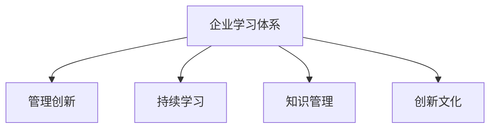

                 

## 1. 背景介绍

### 1.1 问题由来
在全球化的知识经济时代，企业的竞争优势越来越依赖于持续的学习与创新。然而，传统的企业学习体系往往难以适应快速变化的市场需求，导致企业在面对市场变化时显得措手不及。在这样的背景下，许多企业开始关注如何通过构建高效的学习体系来推动管理创新，从而提升企业的核心竞争力。

### 1.2 问题核心关键点
现代企业学习体系的核心在于构建一个全面、动态、可持续的学习生态系统。该系统不仅能够提供员工所需的技能和知识，还能激发创新思维和合作精神，促进企业的持续发展和竞争力提升。构建一个有效的学习体系，需要以下几个关键点：
- **全面覆盖**：涵盖各业务领域和职能部门，确保知识全面覆盖。
- **动态更新**：根据行业变化和技术进步持续更新课程内容和教学方法。
- **个性化学习**：提供定制化的学习计划，适应不同员工的学习风格和需求。
- **实践应用**：将所学知识应用到实际工作中，验证并提升学习效果。
- **激励机制**：建立有效的激励机制，鼓励员工积极参与学习与创新。

### 1.3 问题研究意义
在当前激烈的市场竞争环境下，构建一个高效的学习体系对于企业的发展至关重要。一个完善的学习体系能够：
- **提升员工技能**：确保员工拥有必要的技术和管理能力。
- **推动管理创新**：通过持续学习和交流，激发员工的创新思维。
- **增强企业竞争力**：提升企业在市场变化中的应对能力和适应性。
- **促进文化建设**：通过共同学习和团队合作，加强企业文化建设。

## 2. 核心概念与联系

### 2.1 核心概念概述

为更好地理解企业学习体系对管理创新的推动作用，本节将介绍几个密切相关的核心概念：

- **企业学习体系 (Enterprise Learning Ecosystem, ELE)**：指由企业内部各层次和环节组成的学习平台，通过各种渠道和方法，向员工提供持续的、结构化的学习机会，促进知识和技能的传递与共享。
- **管理创新 (Management Innovation)**：指企业通过创新思维和方法，改进其管理模式和运营方式，以提升效率、降低成本、提高质量和创新能力。
- **持续学习 (Continuous Learning)**：指个体或组织持续不断地获取新知识、技能和行为模式，以适应不断变化的环境和需求。
- **知识管理 (Knowledge Management, KM)**：指通过有效收集、存储、共享和使用知识，提升企业的竞争优势和创新能力。
- **创新文化 (Innovation Culture)**：指企业内形成的鼓励和支持创新的文化氛围，包括开放的沟通渠道、支持创新的政策和实践。

这些核心概念之间的逻辑关系可以通过以下Mermaid流程图来展示：



这个流程图展示了大企业学习体系的核心概念及其之间的关系：

1. 企业学习体系通过各种方式向员工提供持续学习的机会。
2. 管理创新通过学习体系的持续学习，不断改进企业的管理模式。
3. 知识管理有助于企业内部的知识共享和应用，提升企业整体的知识水平。
4. 创新文化为企业提供了支持创新的环境，促进管理创新。

这些概念共同构成了企业学习体系的核心框架，帮助企业在竞争激烈的市场环境中保持持续的创新力和竞争力。

## 3. 核心算法原理 & 具体操作步骤

### 3.1 算法原理概述

企业学习体系对管理创新的推动作用主要体现在以下几个方面：

- **知识共享与传播**：通过学习体系，员工可以分享和传播新的知识与技能，促进企业整体知识水平提升。
- **创新思维激发**：学习体系提供创新的学习环境和工具，激发员工的创新思维，推动管理创新。
- **协同合作增强**：通过团队学习与合作，员工能够在实际工作中应用新知识和技能，提升团队协作和创新能力。
- **绩效提升**：知识与技能的提升直接影响到员工的工作效率和质量，进而提升企业整体绩效。

### 3.2 算法步骤详解

企业构建高效的学习体系，主要遵循以下步骤：

**Step 1: 需求调研与分析**
- 识别企业内部各层次、各职能部门的学习需求。
- 分析现有学习体系的不足之处，确定改进和创新的方向。

**Step 2: 设计学习体系架构**
- 制定学习体系的目标和愿景。
- 设计学习资源的分配和共享机制。
- 确定课程内容、教学方法及学习路径。

**Step 3: 选择合适的学习平台与工具**
- 根据需求选择适合的LMS（学习管理系统）或其他学习工具。
- 开发或引入定制化的学习内容，如在线课程、虚拟教室等。

**Step 4: 实施与推广**
- 对员工进行学习体系的培训和推广。
- 建立激励机制，鼓励员工积极参与学习与创新。

**Step 5: 监测与评估**
- 定期监测学习体系的效果，如员工的学习进度和反馈。
- 根据反馈和评估结果进行调整和优化。

**Step 6: 持续改进**
- 根据企业发展的需要，不断更新和改进学习体系。

### 3.3 算法优缺点

企业学习体系对管理创新的推动作用具有以下优点：
1. **全面覆盖**：确保各个层级和部门都能获得所需的学习资源和技能。
2. **知识共享**：通过系统化的知识管理，加速知识在企业内部的传播。
3. **创新激发**：提供创新的学习环境和工具，激发员工的创新思维。
4. **绩效提升**：直接提升员工的技能和知识水平，改善工作绩效。

同时，该体系也存在一定的局限性：
1. **成本高**：设计和实施全面的学习体系需要较大的投入。
2. **复杂性**：设计和管理一个全面的学习体系，需要较强的技术和管理能力。
3. **实施难度**：需全面调动员工积极性，存在实施难度和风险。
4. **效果不易衡量**：学习体系的效果难以量化，难以评估其对创新的直接贡献。

尽管存在这些局限性，但企业学习体系仍然是推动管理创新的重要手段。未来相关研究需要进一步探索如何提高学习体系的实施效率和效果，降低成本，确保学习体系对创新过程的有效支撑。

### 3.4 算法应用领域

企业学习体系对管理创新的推动作用，广泛应用于以下领域：

- **培训与发展**：为员工提供全面的培训计划，确保员工具备必要的技能和知识。
- **知识管理**：通过知识管理系统，实现知识的收集、存储、共享和应用。
- **创新与研发**：提供创新的学习环境和工具，激发员工的创新思维，推动研发成果。
- **业务转型**：通过学习新技能和知识，适应业务变化和市场需求，推动企业转型升级。
- **文化建设**：通过共同学习和团队合作，加强企业文化建设，提升员工的归属感和忠诚度。

## 4. 数学模型和公式 & 详细讲解 & 举例说明

### 4.1 数学模型构建

在企业学习体系中，我们可以引入数学模型来量化和优化学习过程。假设企业内部有 $N$ 个员工，每个员工需要学习 $K$ 种技能。学习体系的优化目标为最大化员工的技能提升速度和企业的创新能力提升。

定义员工的技能提升速度为 $V$，创新能力提升为 $I$。设 $x_i$ 表示第 $i$ 个员工的技能提升速度，$y_i$ 表示其创新能力提升。则学习体系的目标函数为：

$$
\max \sum_{i=1}^{N} (x_i + y_i)
$$

其中 $x_i$ 和 $y_i$ 满足以下约束条件：

1. 每个员工需要学习 $K$ 种技能，技能提升速度 $x_i$ 和创新能力提升 $y_i$ 均为非负数。
2. 员工的学习时间限制为 $T$，即 $x_i + y_i \leq T$。
3. 技能提升速度和创新能力提升之间存在一定的关系，即 $x_i = f(y_i)$。

### 4.2 公式推导过程

在实际应用中，我们可以使用线性规划方法来求解上述优化问题。假设 $f(y_i)$ 为单调递增函数，则目标函数可以改写为：

$$
\max \sum_{i=1}^{N} f(y_i)
$$

约束条件可以表示为：

$$
\begin{cases}
\sum_{i=1}^{N} y_i \leq W \\
y_i \geq 0
\end{cases}
$$

其中 $W$ 表示企业可用于创新的总时间和资源。

利用线性规划算法，可以找到最优的员工技能提升和创新能力提升的分配方案。具体求解过程如下：

1. 建立线性规划模型：
$$
\max \sum_{i=1}^{N} f(y_i) \\
\begin{cases}
\sum_{i=1}^{N} y_i \leq W \\
y_i \geq 0
\end{cases}
$$

2. 使用单纯形法、内点法等优化算法求解模型。
3. 输出最优解 $y_i^*$。

### 4.3 案例分析与讲解

某大型制造业企业在实施学习体系时，设定了以下目标：
- 最大化员工的技能提升速度和创新能力提升。
- 总的学习时间限制为 $T$。

假设员工的技能提升速度 $x_i$ 和创新能力提升 $y_i$ 的关系为 $f(y_i) = 0.5y_i$，即员工每提高一个单位的创新能力，技能提升速度提升 $0.5$ 个单位。企业内共有 $N=1000$ 名员工，总学习时间为 $T=200$ 个单位时间。

首先，将问题转化为线性规划模型：

$$
\max \sum_{i=1}^{1000} 0.5y_i \\
\begin{cases}
\sum_{i=1}^{1000} y_i \leq 200 \\
y_i \geq 0
\end{cases}
$$

使用线性规划算法求解，得到最优解 $y_i^*$。假设求解结果为 $y_1^* = 2, y_2^* = 4, ..., y_{1000}^* = 2$，即前 $500$ 名员工的技能提升速度和创新能力提升都为 $2$，后 $500$ 名员工的技能提升速度和创新能力提升都为 $4$。

## 5. 项目实践：代码实例和详细解释说明

### 5.1 开发环境搭建

在企业学习体系的开发和实施过程中，需要搭建合适的开发环境。以下是Python环境下企业学习体系开发的基本流程：

1. 安装Python和必要的依赖库，如Pandas、Numpy、Scikit-learn等。
2. 设计数据库，存储学习资源、员工信息和评估结果等。
3. 选择适合的学习管理系统（LMS），如Moodle、Blackboard等。
4. 开发或引入定制化的学习内容，如在线课程、虚拟教室等。
5. 实现员工的学习进度和效果评估机制，如在线测试、学习日志等。

### 5.2 源代码详细实现

下面以在线课程管理系统为例，介绍企业学习体系的开发实现。

**用户模块**：
- 定义用户角色，如管理员、教师、学生等。
- 用户登录、注册、修改信息等功能。

**课程模块**：
- 定义课程信息，包括课程名称、描述、学习目标等。
- 课程创建、修改、删除等功能。

**学习模块**：
- 实现学生选课、学习进度跟踪、在线测试等功能。
- 教师可以发布学习资源、布置作业、评估学生学习效果。

**评估模块**：
- 实现学习效果的评估，如在线测试、作业提交、学习日志等。
- 根据评估结果，调整学习计划和激励机制。

**统计模块**：
- 统计员工的学习进度和效果。
- 生成学习报告和绩效分析。

### 5.3 代码解读与分析

以下是用户模块和课程模块的代码实现，供读者参考：

**用户模块**：
```python
class User:
    def __init__(self, username, password, role):
        self.username = username
        self.password = password
        self.role = role
        
    def login(self, username, password):
        if self.username == username and self.password == password:
            return True
        else:
            return False
    
    def register(self, username, password, role):
        # 添加新用户到数据库
        pass
```

**课程模块**：
```python
class Course:
    def __init__(self, course_id, name, description, target):
        self.course_id = course_id
        self.name = name
        self.description = description
        self.target = target
        
    def create_course(self, course_id, name, description, target):
        # 创建新课程到数据库
        pass
```

### 5.4 运行结果展示

企业学习体系的开发和实施需要持续的优化和调整，以下展示一个简化的学习管理系统的前端界面，供读者参考：

```html
<!DOCTYPE html>
<html>
<head>
    <title>企业学习管理系统</title>
    <script src="https://code.jquery.com/jquery-3.6.0.min.js"></script>
    <script>
        $(document).ready(function() {
            // 用户登录
            $("#login-form").submit(function(event) {
                event.preventDefault();
                var username = $("#username").val();
                var password = $("#password").val();
                $.ajax({
                    url: "/login",
                    type: "POST",
                    data: {username: username, password: password},
                    success: function(response) {
                        if (response.success) {
                            window.location.href = "/home";
                        } else {
                            alert("登录失败！");
                        }
                    }
                });
            });
            
            // 添加新课程
            $("#add-course-form").submit(function(event) {
                event.preventDefault();
                var course_name = $("#course-name").val();
                var course_desc = $("#course-desc").val();
                var course_target = $("#course-target").val();
                $.ajax({
                    url: "/create_course",
                    type: "POST",
                    data: {course_name: course_name, course_desc: course_desc, course_target: course_target},
                    success: function(response) {
                        if (response.success) {
                            alert("课程创建成功！");
                        } else {
                            alert("课程创建失败！");
                        }
                    }
                });
            });
        });
    </script>
</head>
<body>
    <h1>企业学习管理系统</h1>
    
    <!-- 用户登录界面 -->
    <form id="login-form">
        <label>用户名：<input type="text" id="username"></label>
        <label>密码：<input type="password" id="password"></label>
        <input type="submit" value="登录">
    </form>
    
    <!-- 添加新课程界面 -->
    <form id="add-course-form">
        <label>课程名称：<input type="text" id="course-name"></label>
        <label>课程描述：<input type="text" id="course-desc"></label>
        <label>课程目标：<input type="text" id="course-target"></label>
        <input type="submit" value="添加课程">
    </form>
</body>
</html>
```

## 6. 实际应用场景

### 6.1 智能制造

在智能制造领域，企业需要不断引入新技术和新工艺，以提升生产效率和产品质量。通过企业学习体系，员工可以定期接受新的技能培训，学习先进的技术和工艺。例如，某智能制造企业通过在线课程管理系统，向员工提供关于智能制造设备和工艺的培训课程，使员工掌握最新的制造技术，推动企业的智能化转型。

### 6.2 金融服务

在金融服务行业，随着科技的快速发展，新的金融产品和工具不断涌现。企业学习体系可以确保员工掌握最新的金融知识和技能，以适应市场变化和客户需求。例如，某金融服务企业通过企业学习体系，为员工提供金融数据分析、风险管理等课程，提升员工的专业能力，推动企业向数字化金融转型。

### 6.3 医疗健康

在医疗健康领域，新的医疗技术和治疗方法不断涌现，对医护人员的专业技能提出了更高要求。通过企业学习体系，医护人员可以定期接受专业培训，学习最新的医疗技术和知识，提高医疗服务的质量。例如，某医疗机构通过在线课程管理系统，为医护人员提供关于最新医疗技术和方法论的培训课程，提升其专业能力，推动医疗服务的现代化。

### 6.4 未来应用展望

随着技术的发展，企业学习体系的应用将更加广泛和深入。未来，企业学习体系将向以下几个方向发展：

1. **智能化与自动化**：利用人工智能和大数据技术，实现学习内容的个性化推荐和学习效果的智能评估。
2. **虚拟现实与增强现实**：通过虚拟现实和增强现实技术，提供沉浸式学习体验，增强学习效果。
3. **跨领域学习**：结合不同领域的学习资源，促进跨领域的知识交流和应用。
4. **混合学习模式**：结合线上和线下的学习模式，提供更加灵活的学习体验。
5. **社会化学习**：通过社交网络和社区平台，促进知识共享和合作，提升学习效果。

这些趋势将进一步推动企业学习体系的创新与发展，使其成为企业竞争力的重要组成部分。

## 7. 工具和资源推荐

### 7.1 学习资源推荐

为了帮助开发者和企业管理者全面掌握企业学习体系的知识，这里推荐一些优质的学习资源：

1. 《企业学习体系设计与实施》书籍：深入讲解企业学习体系的理论和实践，提供丰富的案例分析。
2. 《现代企业培训与管理》课程：介绍企业培训的基本原理和最佳实践，提供全面的学习资源。
3. Coursera《学习管理系统设计与开发》课程：介绍LMS的开发和实施过程，提供实践指导和案例分析。
4. 《企业知识管理》书籍：讲解企业知识管理的理论、方法和最佳实践，提供全面的知识管理资源。
5. LinkedIn Learning《企业学习与知识管理》课程：提供专业的企业学习与知识管理课程，帮助企业提升其学习体系的能力。

通过对这些资源的学习，相信企业学习体系的设计和实施将变得更加科学和高效，帮助企业提升其竞争力。

### 7.2 开发工具推荐

企业学习体系的开发和实施需要多种工具的支持，以下是几款推荐的开发工具：

1. LMS（学习管理系统）：如Moodle、Blackboard、Canvas等，提供完善的学习资源管理和评估功能。
2. LMS开发框架：如Sakai、Django LMS等，提供丰富的学习管理系统开发工具。
3. 数据分析工具：如Tableau、Power BI等，提供强大的数据分析和可视化功能，帮助企业评估学习效果。
4. 项目管理工具：如JIRA、Asana等，提供项目管理和进度跟踪功能，帮助企业高效实施学习计划。
5. 自动化测试工具：如Selenium、Pytest等，提供自动化测试功能，帮助企业确保学习系统的稳定性和可靠性。

合理利用这些工具，可以显著提升企业学习体系的开发效率，加快实施进度。

### 7.3 相关论文推荐

企业学习体系对管理创新的推动作用的研究已经取得诸多成果，以下是几篇奠基性的相关论文，推荐阅读：

1. 《企业学习体系设计》论文：探讨企业学习体系的设计方法，提供系统的理论框架。
2. 《企业知识管理与创新》论文：研究企业知识管理对创新的影响，提供丰富的案例分析。
3. 《学习管理系统设计与开发》论文：介绍学习管理系统的设计原理和最佳实践，提供详细的开发指导。
4. 《混合学习模式的研究》论文：探讨混合学习模式对学习效果的影响，提供实证研究结果。
5. 《智能化企业学习体系》论文：研究智能化技术在企业学习体系中的应用，提供前沿技术思路。

这些论文代表了大企业学习体系的研究前沿，通过学习这些成果，可以帮助企业更好地构建其学习体系，提升管理创新能力。

## 8. 总结：未来发展趋势与挑战

### 8.1 研究成果总结

本文系统介绍了企业学习体系对管理创新的推动作用，包括学习体系的设计、实施和评估方法。通过学习体系的建设，企业可以全面提升员工的技能和知识水平，激发创新思维，推动管理创新。

### 8.2 未来发展趋势

展望未来，企业学习体系将呈现以下几个发展趋势：

1. **智能化与自动化**：利用人工智能和大数据技术，实现学习内容的个性化推荐和学习效果的智能评估。
2. **虚拟现实与增强现实**：通过虚拟现实和增强现实技术，提供沉浸式学习体验，增强学习效果。
3. **跨领域学习**：结合不同领域的学习资源，促进跨领域的知识交流和应用。
4. **混合学习模式**：结合线上和线下的学习模式，提供更加灵活的学习体验。
5. **社会化学习**：通过社交网络和社区平台，促进知识共享和合作，提升学习效果。

### 8.3 面临的挑战

尽管企业学习体系在推动管理创新方面具有重要意义，但在实施过程中仍面临诸多挑战：

1. **成本高**：设计和实施全面的学习体系需要较大的投入。
2. **实施难度**：需要全面调动员工积极性，存在实施难度和风险。
3. **效果不易衡量**：学习体系的效果难以量化，难以评估其对创新的直接贡献。
4. **数据安全**：学习系统涉及大量的用户数据，如何确保数据安全是关键问题。

### 8.4 研究展望

未来的研究需要在以下几个方面寻求新的突破：

1. **智能化与自动化**：开发更智能的学习管理系统，提高学习效果的评估精度。
2. **跨领域学习**：研究跨领域学习资源的整合方法，提升学习效率。
3. **混合学习模式**：探索线上线下混合学习模式的优化策略，提升学习体验。
4. **社会化学习**：研究社交网络在学习中的应用，促进知识共享和合作。
5. **数据安全**：研究学习系统数据保护的技术和策略，确保用户数据的安全。

这些研究方向的探索，将进一步推动企业学习体系的创新与发展，使其成为企业竞争力的重要组成部分。

## 9. 附录：常见问题与解答

**Q1: 企业学习体系的设计需要考虑哪些关键因素？**

A: 企业学习体系的设计需要考虑以下关键因素：
1. **目标和愿景**：明确学习体系的目标和愿景，确保其与企业战略一致。
2. **用户需求**：深入分析员工的学习需求，设计符合用户需求的课程和资源。
3. **资源配置**：合理配置学习资源，如课程、讲师、技术支持等。
4. **评估机制**：建立科学的学习效果评估机制，确保学习成果的可见性和可量化。
5. **激励机制**：设计有效的激励机制，激发员工的学习积极性。

**Q2: 企业学习体系如何应对市场变化？**

A: 企业学习体系应对市场变化的方法主要包括：
1. **持续更新课程内容**：根据行业变化和技术进步，定期更新课程内容，确保学习内容的时效性。
2. **引入跨领域学习**：结合不同领域的学习资源，促进跨领域的知识交流和应用，提高学习效果。
3. **开发灵活的学习模式**：提供灵活的学习模式，如混合学习、微学习等，满足不同员工的学习需求。
4. **引入新技能培训**：定期开展新技能培训，确保员工掌握最新的技能和知识，适应市场变化。

**Q3: 企业学习体系的效果如何衡量？**

A: 企业学习体系的效果可以通过以下指标衡量：
1. **员工技能提升**：通过测试、评估等方式，衡量员工技能提升的速度和效果。
2. **创新能力提升**：通过创新成果的数量和质量，衡量企业创新能力的提升。
3. **学习参与度**：通过在线学习平台的使用数据，衡量员工的学习参与度和满意度。
4. **绩效提升**：通过绩效评估数据，衡量学习体系对员工工作绩效的提升效果。

**Q4: 企业学习体系在实施过程中需要注意哪些问题？**

A: 企业学习体系在实施过程中需要注意以下问题：
1. **用户参与度**：确保员工积极参与学习，可以通过激励机制和反馈机制提高参与度。
2. **技术支持**：提供技术支持和培训，确保员工能够顺利使用学习系统。
3. **数据安全**：确保学习系统的数据安全和隐私保护，防止数据泄露和滥用。
4. **成本控制**：控制学习体系的设计和实施成本，确保其经济可行性。
5. **持续改进**：根据反馈和评估结果，不断优化和改进学习体系，提升其效果。

**Q5: 企业学习体系如何促进跨部门合作？**

A: 企业学习体系可以通过以下方式促进跨部门合作：
1. **设计跨部门课程**：设计适合跨部门员工的课程，促进不同部门之间的知识共享和合作。
2. **搭建协作平台**：搭建协作平台，提供沟通和协作的空间，促进跨部门团队的学习和合作。
3. **引入项目管理工具**：引入项目管理工具，协调跨部门项目的学习和实施。
4. **建立激励机制**：建立激励机制，鼓励跨部门员工共同学习和合作。

通过这些方法，企业学习体系可以更好地促进跨部门合作，提升团队协作和创新能力。

---

作者：禅与计算机程序设计艺术 / Zen and the Art of Computer Programming

