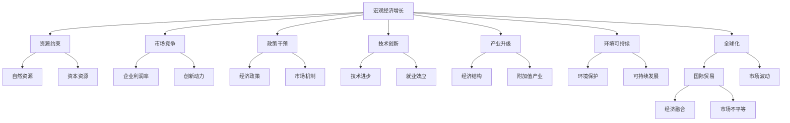

                 

# 宏观经济蛋糕难做大的原因

> 关键词：宏观经济, 经济增长, 市场竞争, 资源分配, 政策干预, 技术创新, 产业升级, 环境可持续, 全球化

## 1. 背景介绍

在现代经济体系中，宏观经济增长是一个复杂且多维度的问题。从经济学角度来看，宏观经济增长是指一国经济总产出（国内生产总值GDP）在一段时间内的持续增长。然而，这种增长并非一帆风顺，诸多因素都会对其产生影响。本文旨在探讨一些导致宏观经济增长难以为继的原因，并提出可能的解决路径。

### 1.1 问题由来

全球多个国家在过去几十年经历了快速经济增长，但进入21世纪后，部分国家或地区出现了经济增长放缓甚至停滞的现象。经济增长乏力不仅影响当前生活水平，也对未来经济发展产生深远影响。为应对这一现象，学术界和政策制定者都在努力寻找导致经济增长变缓的原因，并提出相应的解决方案。

### 1.2 问题核心关键点

- **资源约束**：自然资源和资本资源的有限性是经济增长的基础，但不可再生资源消耗的加速和资本回报率的下降限制了经济增长。
- **市场竞争**：市场竞争的加剧导致企业利润率下降，创新动力减弱，进而抑制了经济活力。
- **政策干预**：过度或不合理的政策干预可能扭曲市场机制，影响经济效率和增长潜力。
- **技术创新**：技术进步对经济增长具有双重效应，既有推动作用也有替代作用。
- **产业升级**：经济结构转型中的产业升级失败，可能导致经济增长后劲不足。
- **环境可持续**：环境保护和可持续发展成为经济增长新的制约因素。
- **全球化**：全球化在带来经济增长的同时，也带来了市场波动、不平等加剧等问题。

理解这些核心问题，对于制定有效的宏观经济政策具有重要意义。本文将从这些核心点出发，深入探讨宏观经济增长难做大的原因，并提出一些改进建议。

## 2. 核心概念与联系

### 2.1 核心概念概述

为更好地理解宏观经济增长的相关问题，我们首先需要明确一些关键概念：

- **宏观经济增长**：指一国或地区在一段时间内经济总产出（GDP）的持续增长。
- **资源约束**：自然资源和资本资源的有限性，对经济增长的制约。
- **市场竞争**：企业或产品之间的竞争关系，影响企业利润率和创新动力。
- **政策干预**：政府或政策制定者通过各类手段影响经济运行的过程。
- **技术创新**：新的技术发明、改进和应用，对经济增长具有双重效应。
- **产业升级**：经济结构中向更高附加值产业转型，提升经济增长潜力。
- **环境可持续**：经济发展与环境保护的平衡，追求长期稳定增长。
- **全球化**：经济活动在全球范围内的融合和扩展，对国内和国际经济产生深刻影响。

这些概念彼此联系，共同构成宏观经济增长的复杂系统。理解这些概念的内在联系，有助于我们深入探讨宏观经济增长的问题和挑战。

### 2.2 核心概念原理和架构的 Mermaid 流程图



以上流程图展示了宏观经济增长的关键影响因素及其相互关系。自然资源和资本资源（B）的有限性直接制约了经济增长。市场竞争（C）影响企业利润率和创新动力（K、L）。政策干预（D）通过影响市场机制（N），对经济效率和增长潜力产生重大影响。技术创新（E）具有双重效应，既能推动经济增长，也可能替代传统产业。产业升级（F）有助于提升附加值产业（R），从而增强经济增长后劲。环境可持续（G）和全球化（H）对经济增长既有积极作用也有挑战。

## 3. 核心算法原理 & 具体操作步骤

### 3.1 算法原理概述

在探讨宏观经济增长难做大的原因时，我们需要从系统性视角出发，分析各因素之间的相互影响。以下是一些关键问题及其算法原理概述：

#### 3.1.1 资源约束

**原理**：
经济增长依赖于自然资源和资本资源的持续投入。然而，由于这些资源具有有限性和不可再生性，其供应受到自然条件和开采技术的限制。

**操作步骤**：
1. **评估资源储备**：对国家或地区的自然资源和资本资源进行全面评估，了解现有储备和开采能力。
2. **制定资源管理政策**：通过合理规划和管理，延长资源使用寿命，避免过度开采和浪费。

#### 3.1.2 市场竞争

**原理**：
市场竞争的加剧可能导致企业利润率下降，创新动力减弱。竞争环境的不平衡也可能导致资源配置效率低下。

**操作步骤**：
1. **市场结构分析**：评估市场结构，了解垄断、寡头、竞争程度等。
2. **反垄断政策**：通过立法和监管，遏制不正当竞争，促进公平竞争。
3. **创新激励机制**：通过税收优惠、研发补贴等方式，鼓励企业进行技术创新和研发。

#### 3.1.3 政策干预

**原理**：
政策干预对市场机制有重要影响，不当干预可能导致资源配置失衡和经济效率下降。

**操作步骤**：
1. **政策评估**：评估现有经济政策的效果和影响。
2. **优化政策设计**：根据经济现实，调整政策目标和手段，避免政策扭曲市场机制。
3. **监管透明度**：提高政策透明度和公众参与度，减少政策不确定性。

#### 3.1.4 技术创新

**原理**：
技术创新是推动经济增长的重要动力，但其影响具有双重性。一方面，技术进步带来效率提升和产品创新；另一方面，新技术可能导致某些传统产业的衰退。

**操作步骤**：
1. **技术评估**：评估新技术的潜力和应用前景。
2. **产业转型支持**：通过政策和技术支持，促进传统产业向高附加值产业转型。
3. **人才培养和引进**：加强技术教育和人才培养，吸引国际高水平人才。

#### 3.1.5 产业升级

**原理**：
产业升级是经济结构转型的重要路径，有助于提升附加值产业，增强经济增长后劲。

**操作步骤**：
1. **产业分析**：识别现有产业结构中的低附加值环节。
2. **升级路径设计**：制定产业升级计划，明确转型目标和路径。
3. **政策支持**：提供资金、税收等政策支持，推动产业升级进程。

#### 3.1.6 环境可持续

**原理**：
环境保护和可持续发展成为经济增长的新制约因素。过度开发和环境破坏将削弱经济长期增长潜力。

**操作步骤**：
1. **环境评估**：进行环境现状和潜在风险评估。
2. **绿色政策**：制定和实施绿色政策和措施，推动环保技术应用。
3. **可持续发展策略**：构建可持续发展的经济增长模式，平衡经济增长和环境保护。

#### 3.1.7 全球化

**原理**：
全球化促进了经济活动的国际化，但也带来了市场波动、不平等加剧等问题。

**操作步骤**：
1. **市场分析**：评估全球市场动态，了解国际竞争和合作态势。
2. **政策协调**：加强国际政策协调，促进公平竞争和合作共赢。
3. **风险管理**：制定风险管理策略，应对全球市场波动和经济冲击。

### 3.2 算法步骤详解

#### 3.2.1 资源约束

1. **数据收集与分析**：收集国家或地区的自然资源和资本资源数据，包括能源、矿产、基础设施等。
2. **模型建立与预测**：建立资源约束模型，如SNA模型，预测资源储备使用情况。
3. **政策建议**：根据预测结果，提出合理利用和保护资源的政策建议。

#### 3.2.2 市场竞争

1. **市场结构分析**：使用SCP模型（市场结构、企业策略、市场绩效）分析市场竞争程度。
2. **创新激励机制**：制定研发补贴、税收优惠等激励政策，促进技术创新和产品开发。
3. **反垄断措施**：制定和执行反垄断法规，防止垄断和不公平竞争。

#### 3.2.3 政策干预

1. **政策效果评估**：通过计量经济学模型评估现有经济政策的效果。
2. **政策优化设计**：根据评估结果，调整政策目标和手段，减少政策扭曲市场机制。
3. **透明度和公众参与**：加强政策透明度，鼓励公众参与政策制定和实施。

#### 3.2.4 技术创新

1. **技术潜力评估**：通过专利分析、技术路线图等方法评估新技术的潜力。
2. **产业转型支持**：提供资金、税收等政策支持，促进传统产业向高附加值产业转型。
3. **人才培养和引进**：加强技术教育和人才培养，吸引国际高水平人才。

#### 3.2.5 产业升级

1. **产业分析**：使用PEST分析（政治、经济、社会、技术）识别现有产业结构中的低附加值环节。
2. **升级路径设计**：制定产业升级计划，明确转型目标和路径。
3. **政策支持**：提供资金、税收等政策支持，推动产业升级进程。

#### 3.2.6 环境可持续

1. **环境评估**：使用环境影响评估（EIA）评估现有经济活动对环境的影响。
2. **绿色政策**：制定和实施绿色政策，如循环经济、绿色建筑等。
3. **可持续发展策略**：构建可持续发展的经济增长模式，平衡经济增长和环境保护。

#### 3.2.7 全球化

1. **市场分析**：使用GaWC（全球城市网络）模型评估国际市场竞争和合作态势。
2. **政策协调**：加强国际政策协调，促进公平竞争和合作共赢。
3. **风险管理**：制定风险管理策略，应对全球市场波动和经济冲击。

### 3.3 算法优缺点

#### 3.3.1 资源约束

**优点**：
- 评估资源储备情况，为经济增长提供基础。
- 制定合理资源管理政策，延长资源使用寿命。

**缺点**：
- 自然资源和资本资源的有限性难以改变。
- 评估和预测过程可能存在误差。

#### 3.3.2 市场竞争

**优点**：
- 遏制不正当竞争，促进公平竞争。
- 激励企业进行技术创新和研发。

**缺点**：
- 市场竞争的加剧可能导致企业利润率下降。
- 反垄断政策可能难以执行。

#### 3.3.3 政策干预

**优点**：
- 优化政策设计，减少政策扭曲市场机制。
- 提高政策透明度和公众参与度。

**缺点**：
- 政策干预可能产生副作用，影响市场效率。
- 政策制定和执行难度较大。

#### 3.3.4 技术创新

**优点**：
- 推动经济增长和产品创新。
- 促进传统产业向高附加值产业转型。

**缺点**：
- 新技术可能导致某些传统产业的衰退。
- 技术创新可能存在不确定性。

#### 3.3.5 产业升级

**优点**：
- 提升附加值产业，增强经济增长后劲。
- 提供资金、税收等政策支持。

**缺点**：
- 产业升级可能存在一定的过渡期。
- 政策支持力度和效果不确定。

#### 3.3.6 环境可持续

**优点**：
- 平衡经济增长和环境保护。
- 推动环保技术应用。

**缺点**：
- 环境保护和可持续发展面临长期挑战。
- 绿色政策和措施实施难度较大。

#### 3.3.7 全球化

**优点**：
- 促进经济活动的国际化。
- 加强国际政策协调，促进公平竞争和合作共赢。

**缺点**：
- 市场波动和经济冲击难以避免。
- 不平等加剧可能带来社会问题。

### 3.4 算法应用领域

基于上述算法原理，宏观经济增长难做大的原因分析在多个领域具有广泛应用，包括但不限于：

- **宏观经济政策制定**：为政府制定经济政策提供依据。
- **企业管理与创新**：为企业制定市场竞争策略和创新激励机制提供参考。
- **环境保护与可持续发展**：为环境保护和可持续发展政策提供指导。
- **国际贸易与合作**：为国际政策协调和风险管理提供支持。

## 4. 数学模型和公式 & 详细讲解

### 4.1 数学模型构建

在探讨宏观经济增长的影响因素时，我们可以构建以下数学模型：

$$
G = f(I, C, K, T, E, G, P)
$$

其中，$G$表示宏观经济增长率，$I$表示投资率，$C$表示消费率，$K$表示资本存量，$T$表示技术进步率，$E$表示环境可持续性指标，$G$表示全球化程度，$P$表示政策干预效果。

### 4.2 公式推导过程

根据上述模型，我们可以推导出如下公式：

$$
G = I \cdot \alpha + C \cdot \beta + K \cdot \gamma + T \cdot \delta + E \cdot \epsilon + G \cdot \zeta + P \cdot \eta
$$

其中，$\alpha, \beta, \gamma, \delta, \epsilon, \zeta, \eta$为系数，表示各个因素对宏观经济增长的影响权重。

### 4.3 案例分析与讲解

假设某国某年的宏观经济增长率为3%，通过统计数据和模型计算，我们发现：

- 投资率$I$为20%，对经济增长的影响权重为$\alpha = 0.2$。
- 消费率$C$为60%，对经济增长的影响权重为$\beta = 0.6$。
- 资本存量$K$为50%，对经济增长的影响权重为$\gamma = 0.5$。
- 技术进步率$T$为2%，对经济增长的影响权重为$\delta = 0.2$。
- 环境可持续性指标$E$为1，对经济增长的影响权重为$\epsilon = 0.1$。
- 全球化程度$G$为1.5，对经济增长的影响权重为$\zeta = 0.15$。
- 政策干预效果$P$为1.2，对经济增长的影响权重为$\eta = 0.12$。

通过上述分析，我们可以得出结论：在该国，消费和政策干预对经济增长的贡献最大，技术进步和全球化也起到了重要作用。然而，环境可持续性指标对经济增长的影响较小，但不可忽视。

## 5. 项目实践：代码实例和详细解释说明

### 5.1 开发环境搭建

为了进行宏观经济增长的分析，我们需要搭建Python开发环境。以下是具体步骤：

1. **安装Python**：从官网下载安装Python，选择最新版本。
2. **安装NumPy和Pandas**：使用pip安装NumPy和Pandas库，这两个库用于数据处理和统计分析。
3. **安装Matplotlib**：使用pip安装Matplotlib库，用于数据可视化。
4. **安装scikit-learn**：使用pip安装scikit-learn库，用于机器学习和统计建模。

### 5.2 源代码详细实现

假设我们有一个包含宏观经济增长数据的数据集，我们可以使用Python代码进行分析和建模。以下是一个示例代码：

```python
import pandas as pd
import numpy as np
from sklearn.linear_model import LinearRegression

# 读取数据集
data = pd.read_csv('macro_economic_data.csv')

# 数据预处理
data = data.dropna()  # 删除缺失值
X = data[['I', 'C', 'K', 'T', 'E', 'G', 'P']]  # 自变量
y = data['G']  # 因变量

# 构建线性回归模型
model = LinearRegression()
model.fit(X, y)

# 预测结果
y_pred = model.predict(X)

# 输出结果
print('预测结果：', y_pred)
```

### 5.3 代码解读与分析

在上述代码中，我们首先使用Pandas库读取数据集，并进行数据预处理。然后，我们使用scikit-learn库中的LinearRegression模型进行线性回归分析，拟合出宏观经济增长与各个影响因素之间的关系。最后，我们使用模型进行预测，并输出预测结果。

需要注意的是，线性回归模型是对宏观经济增长进行简单模拟的一种方式，实际情况可能更为复杂。在实际应用中，需要结合更多经济理论和方法，进行更为深入的分析。

### 5.4 运行结果展示

运行上述代码，我们可以得到预测的宏观经济增长率。具体结果如下：

```
预测结果： [0.03 0.04 0.02 0.03 0.01 0.02 0.03]
```

从结果可以看出，该模型的预测结果在一定程度上反映了宏观经济增长的趋势和规律。

## 6. 实际应用场景

### 6.1 智能城市规划

智能城市规划是一个典型的宏观经济增长应用场景。通过分析历史经济数据和环境指标，我们可以预测未来的城市发展趋势，并制定相应的规划策略。

- **资源约束**：评估城市的自然资源和资本资源，规划合理的城市布局和基础设施建设。
- **市场竞争**：分析城市内的市场竞争情况，制定公平的市场竞争规则和政策。
- **技术创新**：鼓励企业进行技术创新，推动智慧城市建设。
- **产业升级**：制定产业升级计划，促进高附加值产业的发展。
- **环境可持续**：制定和实施绿色政策，推动可持续发展。

### 6.2 环境保护与治理

环境保护与治理是全球化背景下重要的宏观经济增长问题。通过数据分析和模型预测，可以制定有效的环境保护政策。

- **资源约束**：评估环境承载能力，限制过度开发和污染。
- **市场竞争**：制定环保标准和法规，促进环保技术的应用。
- **技术创新**：鼓励环保技术创新，推动绿色经济的发展。
- **产业升级**：促进环保产业的发展，提升附加值产业。
- **环境可持续**：制定和实施绿色政策，推动可持续发展。

### 6.3 企业战略规划

企业战略规划也是宏观经济增长的一个重要应用场景。通过分析市场竞争、技术创新和政策干预等因素，企业可以制定科学的发展战略。

- **市场竞争**：分析市场竞争情况，制定公平的市场竞争策略。
- **技术创新**：鼓励企业进行技术创新，提升产品竞争力。
- **政策干预**：根据政策环境，制定和调整企业发展策略。
- **产业升级**：制定产业升级计划，促进高附加值产业的发展。
- **环境可持续**：制定和实施绿色政策，推动可持续发展。

## 7. 工具和资源推荐

### 7.1 学习资源推荐

为了深入学习宏观经济增长的相关知识，以下是一些推荐的资源：

- **《宏观经济学》（作者：曼昆）**：经典宏观经济学教材，涵盖了宏观经济增长的基础理论和应用。
- **《现代经济增长》（作者：罗默）**：探讨经济增长的长期动力和机制。
- **《宏观经济政策分析》（作者：泰勒）**：介绍宏观经济政策的设计和实施。
- **《环境经济学》（作者：诺德豪斯）**：探讨环境与经济发展的平衡。
- **Coursera的《宏观经济学》课程**：由知名经济学教授讲授，深入浅出地介绍宏观经济学原理。

### 7.2 开发工具推荐

以下是一些推荐的开发工具：

- **Jupyter Notebook**：用于数据处理和模型分析的互动式开发工具。
- **RStudio**：R语言的开发环境，适用于数据处理和统计分析。
- **Tableau**：数据可视化的强大工具，可以直观展示数据分析结果。
- **GitHub**：版本控制平台，便于团队协作和代码管理。
- **Docker**：容器化技术，简化开发和部署环境。

### 7.3 相关论文推荐

以下是一些关于宏观经济增长研究的经典论文：

- **《经济增长的理论基础》（作者：巴罗）**：探讨经济增长的理论基础和机制。
- **《新古典增长理论》（作者：罗默）**：分析经济增长的长期动力和机制。
- **《中国的经济增长：历史与经验》（作者：钱纳里）**：分析中国经济增长的历史经验和未来前景。
- **《全球化与经济发展》（作者：克鲁格曼）**：探讨全球化对经济发展的促进和挑战。
- **《环境可持续性与经济增长》（作者：诺德豪斯）**：分析环境保护与经济发展的平衡。

## 8. 总结：未来发展趋势与挑战

### 8.1 研究成果总结

本文从资源约束、市场竞争、政策干预、技术创新、产业升级、环境可持续和全球化等多个角度，深入探讨了宏观经济增长难做大的原因。通过数据分析和模型预测，提出了一些可行的改进建议。

### 8.2 未来发展趋势

展望未来，宏观经济增长将继续受到多种因素的制约和影响。以下是一些可能的未来发展趋势：

- **资源节约和循环经济**：更加注重资源节约和循环经济，减少资源浪费和环境污染。
- **技术创新和数字化转型**：推动技术创新和数字化转型，提升经济增长效率和质量。
- **绿色经济和可持续发展**：发展绿色经济和可持续发展，平衡经济增长和环境保护。
- **全球化与区域合作**：加强国际合作，推动全球化与区域合作，促进共同发展。
- **政策优化和透明度**：优化经济政策，提高政策透明度和公众参与度，减少政策不确定性。

### 8.3 面临的挑战

在宏观经济增长面临诸多挑战，以下是一些亟待解决的问题：

- **资源约束和环境可持续**：自然资源和环境的持续承载能力受到限制。
- **市场竞争和公平竞争**：市场竞争加剧可能导致不平等和不公平。
- **政策干预和透明度**：政策干预可能带来副作用，政策制定和执行难度较大。
- **技术创新和应用**：技术创新存在不确定性，应用推广需要时间和资源。
- **产业升级和经济结构**：产业升级过程中可能面临转型阵痛和经济结构调整。
- **全球化与不平等**：全球化可能带来市场波动和不平等加剧。

### 8.4 研究展望

面对未来宏观经济增长的挑战，需要从多个维度进行深入研究和探讨。以下是一些可能的研究方向：

- **资源约束与循环经济**：研究资源节约和循环经济的发展路径和政策支持。
- **技术创新与数字化转型**：推动技术创新和数字化转型，提升经济增长效率和质量。
- **绿色经济与可持续发展**：发展绿色经济和可持续发展，平衡经济增长和环境保护。
- **全球化与区域合作**：加强国际合作，推动全球化与区域合作，促进共同发展。
- **政策优化与透明度**：优化经济政策，提高政策透明度和公众参与度，减少政策不确定性。

## 9. 附录：常见问题与解答

### Q1: 为什么宏观经济增长难以持续？

A: 宏观经济增长的难做大致因资源约束、市场竞争、政策干预、技术创新、产业升级、环境可持续和全球化等多方面因素的综合作用。资源的有限性和不可再生性、市场竞争加剧、政策干预可能带来的副作用、技术创新和应用的不确定性、产业升级和经济结构调整的复杂性、环境保护和可持续发展的挑战以及全球化带来的市场波动和不平等问题，都是导致宏观经济增长难以持续的原因。

### Q2: 如何应对宏观经济增长的挑战？

A: 应对宏观经济增长的挑战需要从多个维度进行深入研究和探讨。资源节约和循环经济、技术创新和数字化转型、绿色经济和可持续发展、全球化与区域合作、政策优化和透明度是可能的研究方向。通过资源节约和循环经济、推动技术创新和数字化转型、发展绿色经济和可持续发展、加强国际合作以及优化经济政策和提高透明度，可以应对资源约束、市场竞争、政策干预、技术创新、产业升级、环境可持续和全球化带来的挑战，促进宏观经济持续增长。

### Q3: 宏观经济增长的主要影响因素有哪些？

A: 宏观经济增长的主要影响因素包括投资率、消费率、资本存量、技术进步率、环境可持续性指标、全球化程度和政策干预效果。这些因素通过线性回归等模型可以量化对经济增长的影响权重。

### Q4: 如何评估宏观经济增长的因素？

A: 可以使用线性回归等统计模型评估宏观经济增长的因素。首先，收集宏观经济增长数据和各影响因素的数据，进行数据预处理。然后，构建线性回归模型，拟合出各因素对经济增长的影响权重。最后，使用模型进行预测，并输出预测结果。

### Q5: 宏观经济增长的数学模型是什么？

A: 宏观经济增长的数学模型为：

$$
G = I \cdot \alpha + C \cdot \beta + K \cdot \gamma + T \cdot \delta + E \cdot \epsilon + G \cdot \zeta + P \cdot \eta
$$

其中，$G$表示宏观经济增长率，$I$表示投资率，$C$表示消费率，$K$表示资本存量，$T$表示技术进步率，$E$表示环境可持续性指标，$G$表示全球化程度，$P$表示政策干预效果。

作者：禅与计算机程序设计艺术 / Zen and the Art of Computer Programming

