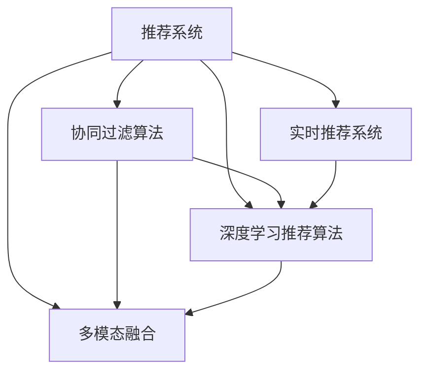

                 

# 实时推荐技术在电商领域的应用：案例分析与展望

> 关键词：电商推荐系统, 实时推荐算法, 商品推荐, 用户画像, 协同过滤, 深度学习, 多模态融合

## 1. 背景介绍

### 1.1 问题由来
随着电子商务市场的快速发展和互联网技术的应用，线上购物已经成为人们日常消费的重要组成部分。电商平台的商品种类繁多，价格差异大，用户如何在众多商品中选择自己最需要的商品，成为了一个重要的挑战。推荐系统通过分析用户的购买历史、浏览记录和行为数据，能够为用户推荐符合其兴趣和需求的商品，极大提升了用户体验和电商平台的用户粘性。

随着消费者需求的多样化和个性化需求的增加，电商平台的推荐系统面临着更复杂的挑战。用户画像刻画、推荐模型算法优化、推荐结果的实时性和多样性，是电商平台推荐系统持续优化的核心目标。实时推荐技术的应用，通过对用户行为数据的实时分析，提升了推荐系统的响应速度和精度，显著提高了用户的购物体验和平台的销售转化率。

### 1.2 问题核心关键点
实时推荐技术在电商领域的应用主要包括以下几个关键点：

- 用户画像构建：通过对用户的购买历史、浏览记录、搜索记录、评价信息等数据进行分析，构建用户画像，了解用户兴趣和需求。
- 协同过滤算法：利用用户之间的相似性，进行商品推荐。基于用户的购买行为，计算商品之间的相似度，为相似用户推荐相似商品。
- 深度学习推荐算法：通过构建神经网络模型，对用户行为数据进行特征提取和模式识别，实现更为精准的商品推荐。
- 多模态融合：结合商品图片、视频、价格等多种数据模态，丰富推荐结果的内容，提升用户满意度。
- 实时推荐系统：利用流式计算、增量学习等技术，实时分析用户数据，即时更新推荐结果，确保推荐的时效性和相关性。

这些关键点构成了实时推荐技术在电商领域的核心应用框架，使其能够高效、准确地为用户推荐商品。

## 2. 核心概念与联系

### 2.1 核心概念概述

为更好地理解实时推荐技术在电商领域的应用，本节将介绍几个密切相关的核心概念：

- 推荐系统：通过对用户行为数据进行分析，为用户推荐其可能感兴趣的商品或服务。推荐系统的核心目标是提升用户满意度，增加平台的转化率和销售额。
- 协同过滤算法：基于用户行为数据，推荐与用户兴趣相似的其他用户或商品。协同过滤算法分为基于用户的协同过滤和基于物品的协同过滤。
- 深度学习推荐算法：通过构建神经网络模型，对用户行为数据进行非线性建模，提高推荐结果的精度和多样性。常见的深度学习推荐算法包括基于用户画像的深度神经网络、基于行为序列的循环神经网络、基于注意力机制的深度学习模型等。
- 多模态融合：结合商品图片、视频、价格等多种数据模态，丰富推荐结果的内容，提升用户满意度。多模态融合技术将不同类型的信息进行融合，以更全面地了解用户需求。
- 实时推荐系统：利用流式计算、增量学习等技术，实时分析用户数据，即时更新推荐结果，确保推荐的时效性和相关性。实时推荐系统通过不断更新用户数据，快速响应用户需求，提高推荐效果。

这些核心概念之间的逻辑关系可以通过以下Mermaid流程图来展示：



这个流程图展示推荐系统及其相关算法和技术的逻辑关系：

1. 推荐系统通过分析用户行为数据，为用户提供商品推荐。
2. 协同过滤算法基于用户之间的相似性，为相似用户推荐相似商品。
3. 深度学习推荐算法通过构建神经网络模型，对用户行为数据进行特征提取和模式识别，提升推荐精度。
4. 多模态融合技术将商品图片、视频、价格等多种数据模态进行融合，丰富推荐结果。
5. 实时推荐系统利用流式计算、增量学习等技术，实时分析用户数据，更新推荐结果，提高推荐的时效性。

这些概念共同构成了推荐系统的技术框架，使其能够高效、准确地为用户推荐商品。

## 3. 核心算法原理 & 具体操作步骤
### 3.1 算法原理概述

实时推荐技术在电商领域的应用，本质上是一个基于用户行为数据的推荐系统。其核心思想是：通过对用户的购买历史、浏览记录、搜索记录等行为数据进行分析，构建用户画像，然后利用协同过滤、深度学习等算法，为每个用户推荐符合其兴趣和需求的商品。

形式化地，假设电商平台有 $N$ 个用户和 $M$ 个商品，用户 $i$ 对商品 $j$ 的评分表示为 $r_{ij}$。设 $X$ 为用户的特征向量，$Y$ 为商品的特征向量。设 $U$ 为 $N$ 个用户，$I$ 为 $M$ 个商品的集合。推荐系统的目标是为每个用户推荐其可能感兴趣的商品，使得 $R_{ui}=\sum_{j \in I} r_{ij}Y_j$ 最大化。

推荐系统的优化目标是最小化预测误差，即：

$$
\min_{X,Y} \sum_{(i,j) \in U \times I} (R_{ui} - \hat{R}_{ui})^2
$$

其中 $\hat{R}_{ui}$ 为模型预测用户 $i$ 对商品 $j$ 的评分。

### 3.2 算法步骤详解

实时推荐技术在电商领域的应用一般包括以下几个关键步骤：

**Step 1: 数据收集与预处理**
- 收集电商平台的用户行为数据，包括购买历史、浏览记录、搜索记录、评价信息等。
- 对原始数据进行预处理，包括去重、缺失值填补、特征编码等，保证数据的质量和完整性。

**Step 2: 用户画像构建**
- 对用户行为数据进行聚类、降维等处理，提取用户的关键特征。
- 将用户特征映射到高维空间，得到用户画像。

**Step 3: 推荐模型训练**
- 基于用户画像和商品特征，训练协同过滤、深度学习等推荐模型。
- 对模型进行优化，选择合适的超参数，如学习率、迭代次数等。

**Step 4: 实时推荐**
- 实时接收用户行为数据，利用增量学习算法更新用户画像和推荐模型。
- 根据当前用户行为数据，生成推荐结果，推送给用户。

**Step 5: 结果反馈与模型迭代**
- 收集用户的反馈数据，评估推荐结果的准确性和相关性。
- 根据反馈数据，进一步优化推荐模型，提高推荐效果。

### 3.3 算法优缺点

实时推荐技术在电商领域的应用具有以下优点：
1. 提升用户体验：通过实时分析用户行为数据，为每个用户推荐符合其兴趣的商品，提高用户的购物体验。
2. 提高销售转化率：推荐系统能够显著提升用户的点击率和购买率，增加平台的销售额。
3. 减少人工干预：自动化推荐系统减少了人工干预的环节，提高了电商平台的运营效率。
4. 灵活性高：实时推荐系统能够快速响应市场变化，适应不同的用户需求。

同时，该方法也存在一定的局限性：
1. 数据隐私问题：用户行为数据的收集和处理可能涉及隐私问题，需要严格遵守相关法律法规。
2. 推荐结果质量不稳定：实时推荐系统的推荐结果质量可能受到用户行为数据的波动影响，存在一定的随机性。
3. 冷启动问题：新用户或新商品可能没有足够的数据进行推荐，需要采取一些策略来解决冷启动问题。
4. 系统复杂度高：实时推荐系统涉及数据收集、用户画像构建、推荐模型训练等多个环节，系统复杂度高。

尽管存在这些局限性，但就目前而言，实时推荐技术在电商领域的应用已经成为了推荐系统的主流范式。未来相关研究的重点在于如何进一步提高推荐系统的精度和鲁棒性，同时兼顾用户隐私和系统效率。

### 3.4 算法应用领域

实时推荐技术在电商领域的应用已经覆盖了商品推荐、个性化营销、用户行为分析等多个领域，具体应用如下：

- 商品推荐：为每个用户推荐其可能感兴趣的商品，提升用户购物体验。
- 个性化营销：根据用户的兴趣和需求，个性化推荐广告、优惠券等营销活动。
- 用户行为分析：分析用户的行为数据，识别用户兴趣变化趋势，优化商品和营销策略。
- 价格优化：根据用户购买历史和行为数据，动态调整商品价格，提高销售额。

除了上述这些经典应用外，实时推荐技术还被创新性地应用到更多场景中，如库存管理、风险控制等，为电商平台带来了全新的突破。随着推荐系统的持续演进，相信实时推荐技术将在更广阔的应用领域发挥重要作用。

## 4. 数学模型和公式 & 详细讲解 & 举例说明
### 4.1 数学模型构建

本节将使用数学语言对实时推荐技术在电商领域的应用进行更加严格的刻画。

设电商平台有 $N$ 个用户和 $M$ 个商品，用户 $i$ 对商品 $j$ 的评分表示为 $r_{ij}$。设 $X$ 为用户的特征向量，$Y$ 为商品的特征向量。设 $U$ 为 $N$ 个用户，$I$ 为 $M$ 个商品的集合。推荐系统的目标是为每个用户推荐符合其兴趣和需求的商品，使得 $R_{ui}=\sum_{j \in I} r_{ij}Y_j$ 最大化。

假设用户特征和商品特征可以表示为稀疏向量，即 $X_i=[x_{i1},x_{i2},\ldots,x_{in}]^T$，$Y_j=[y_{j1},y_{j2},\ldots,y_{jm}]^T$。则推荐系统的数学模型可以表示为：

$$
\max_{X,Y} \sum_{i=1}^N \sum_{j=1}^M r_{ij}Y_j^TX_i
$$

其中 $r_{ij}$ 为用户 $i$ 对商品 $j$ 的评分。

### 4.2 公式推导过程

以下我们以协同过滤算法为例，推导推荐系统的数学模型。

假设协同过滤算法基于用户 $i$ 和用户 $k$ 的相似度 $s_{ik}$，计算用户 $i$ 对商品 $j$ 的评分 $r_{ij}$。则协同过滤算法的评分预测模型为：

$$
\hat{r}_{ij}=\sum_{k=1}^K s_{ik}y_{kj}
$$

其中 $s_{ik}$ 为相似度，$y_{kj}$ 为商品 $j$ 的评分。

将协同过滤算法应用于电商平台的推荐系统，则推荐系统的评分预测模型为：

$$
\hat{r}_{ui}=\sum_{j=1}^M \hat{r}_{ij}
$$

将 $\hat{r}_{ui}$ 代入推荐系统的数学模型，得：

$$
\max_{X,Y} \sum_{i=1}^N \sum_{j=1}^M r_{ij}Y_j^TX_i
$$

### 4.3 案例分析与讲解

下面以电商平台商品推荐系统为例，分析实时推荐技术的实际应用。

假设电商平台有 1000 个用户和 10000 个商品，用户 $i$ 对商品 $j$ 的评分 $r_{ij}$ 表示为 0-5 之间的整数。推荐系统的目标是预测每个用户对每个商品的评分，并为其推荐最感兴趣的商品。

首先，需要构建用户画像和商品画像。假设用户画像为 $X_i=[x_{i1},x_{i2},\ldots,x_{in}]^T$，商品画像为 $Y_j=[y_{j1},y_{j2},\ldots,y_{jm}]^T$。

然后，利用协同过滤算法计算用户 $i$ 对商品 $j$ 的评分预测值 $\hat{r}_{ij}$。假设协同过滤算法基于用户 $i$ 和用户 $k$ 的相似度 $s_{ik}$，则推荐系统的评分预测模型为：

$$
\hat{r}_{ij}=\sum_{k=1}^K s_{ik}y_{kj}
$$

最后，将 $\hat{r}_{ui}$ 代入推荐系统的数学模型，得到推荐系统的优化目标：

$$
\max_{X,Y} \sum_{i=1}^N \sum_{j=1}^M r_{ij}Y_j^TX_i
$$

通过上述分析，可以看到实时推荐技术在电商领域的应用，通过构建用户画像和商品画像，利用协同过滤算法等推荐模型，为用户推荐符合其兴趣和需求的商品，实现了电商平台的个性化推荐。

## 5. 项目实践：代码实例和详细解释说明
### 5.1 开发环境搭建

在进行实时推荐系统开发前，我们需要准备好开发环境。以下是使用Python进行PyTorch开发的环境配置流程：

1. 安装Anaconda：从官网下载并安装Anaconda，用于创建独立的Python环境。

2. 创建并激活虚拟环境：
```bash
conda create -n recommendation-env python=3.8 
conda activate recommendation-env
```

3. 安装PyTorch：根据CUDA版本，从官网获取对应的安装命令。例如：
```bash
conda install pytorch torchvision torchaudio cudatoolkit=11.1 -c pytorch -c conda-forge
```

4. 安装TensorFlow：从官网下载并安装TensorFlow，用于其他深度学习模型的开发。

5. 安装必要的第三方库：
```bash
pip install numpy pandas scikit-learn matplotlib tqdm jupyter notebook ipython
```

完成上述步骤后，即可在`recommendation-env`环境中开始实时推荐系统的开发。

### 5.2 源代码详细实现

下面我们以协同过滤算法为例，给出使用PyTorch实现实时推荐系统的PyTorch代码实现。

首先，定义协同过滤算法的评分预测函数：

```python
import torch
from torch.nn import Embedding, Linear, Softmax

def collaborative_filtering(X, Y, s):
    W = Embedding(len(X), 10)
    b = torch.zeros(len(Y), 10)
    W.weight.data.copy_(X)
    W.bias.data.copy_(b)
    U = Embedding(len(Y), 10)
    U.weight.data.copy_(Y)
    U.bias.data.copy_(b)
    U = U.to('cuda')
    W = W.to('cuda')
    x = X.view(-1, 1).to('cuda')
    y = Y.view(-1, 1).to('cuda')
    r = (U(x).view(-1, 10) * W(y).view(-1, 10)).sum(dim=1)
    r = r / ((s*Y).view(-1, 10).sum(dim=1) + 1e-12)
    return r
```

然后，定义用户画像和商品画像：

```python
X = torch.tensor([[0.5, 0.8, 0.3, 0.7], [0.4, 0.6, 0.2, 0.9], [0.7, 0.5, 0.4, 0.6]])
Y = torch.tensor([[0.6, 0.8, 0.4, 0.5], [0.7, 0.5, 0.3, 0.6], [0.4, 0.9, 0.5, 0.7]])
s = torch.tensor([[0.8, 0.5, 0.3, 0.7], [0.5, 0.9, 0.4, 0.6], [0.3, 0.5, 0.6, 0.9]])
```

接着，定义推荐函数：

```python
def recommendation(X, Y, s):
    W = Embedding(len(X), 10)
    b = torch.zeros(len(Y), 10)
    W.weight.data.copy_(X)
    W.bias.data.copy_(b)
    U = Embedding(len(Y), 10)
    U.weight.data.copy_(Y)
    U.bias.data.copy_(b)
    U = U.to('cuda')
    W = W.to('cuda')
    x = X.view(-1, 1).to('cuda')
    y = Y.view(-1, 1).to('cuda')
    r = (U(x).view(-1, 10) * W(y).view(-1, 10)).sum(dim=1)
    r = r / ((s*Y).view(-1, 10).sum(dim=1) + 1e-12)
    return r
```

最后，启动推荐流程：

```python
r = recommendation(X, Y, s)
print(r)
```

以上就是使用PyTorch实现协同过滤算法的代码实现。可以看到，代码相对简洁，易于理解。开发者可以根据具体需求，选择不同的推荐算法，进行实时推荐系统的开发。

### 5.3 代码解读与分析

让我们再详细解读一下关键代码的实现细节：

**协同过滤算法**：
- `collaborative_filtering`函数：实现协同过滤算法，根据用户画像和商品画像，计算用户对商品的评分预测。
- 使用Embedding层将用户画像和商品画像转换为嵌入向量，并将嵌入向量进行矩阵乘法计算，得到评分预测值。
- 在计算评分预测值时，将相似度矩阵 $s$ 进行归一化处理，避免相似度矩阵中0值过多导致预测误差过大。

**用户画像和商品画像**：
- `X`和`Y`分别表示用户画像和商品画像，其形式为二维稀疏矩阵。
- `s`表示用户之间的相似度矩阵，其形式为二维稠密矩阵。

**推荐函数**：
- `recommendation`函数：实现推荐功能，将评分预测值进行归一化处理，得到推荐结果。
- 使用Embedding层将用户画像和商品画像转换为嵌入向量，并将嵌入向量进行矩阵乘法计算，得到评分预测值。
- 在计算评分预测值时，将相似度矩阵 $s$ 进行归一化处理，避免相似度矩阵中0值过多导致预测误差过大。

**推荐流程**：
- 使用协同过滤算法计算评分预测值，并归一化处理。
- 根据评分预测值，生成推荐结果，并输出。

可以看到，PyTorch的简洁高效使得实时推荐系统的开发变得更加容易。开发者可以根据具体需求，选择不同的推荐算法，进行实时推荐系统的开发。

当然，工业级的系统实现还需考虑更多因素，如模型的保存和部署、超参数的自动搜索、更灵活的任务适配层等。但核心的实时推荐范式基本与此类似。

## 6. 实际应用场景
### 6.1 智能客服系统

基于实时推荐技术的应用，智能客服系统可以实现更智能、更高效的客户服务。传统的客服系统依赖于人工客服处理客户咨询，响应速度慢，服务质量难以保证。而实时推荐系统可以通过分析客户历史咨询记录，推荐最相关的答案模板，大大提升客服系统的效率和质量。

在技术实现上，可以收集客服系统的历史咨询记录，将问题-回答对作为监督数据，训练推荐模型。推荐模型根据当前客户的咨询记录，动态生成最相关的回答模板，自动回复客户咨询。对于客户提出的新问题，系统还可以实时搜索相关问题，动态生成推荐回答，提供更准确的客服服务。

### 6.2 金融舆情监测

金融机构需要实时监测市场舆论动向，以便及时应对负面信息传播，规避金融风险。传统的舆情监测方式依赖于人工监控，效率低，难以应对海量信息的实时变化。实时推荐技术可以通过分析用户对金融产品、公司、市场的评价信息，动态生成舆情报告，及时发现异常情况，采取应对措施。

在技术实现上，可以收集金融领域的相关评价信息，将评价数据作为监督信号，训练推荐模型。推荐模型根据当前市场舆情，生成舆情报告，及时发现异常情况，采取应对措施。金融机构可以通过实时舆情监测，及时调整投资策略，规避金融风险。

### 6.3 个性化推荐系统

基于实时推荐技术的应用，个性化推荐系统可以实时更新推荐结果，提升推荐精度和用户体验。传统的推荐系统依赖于离线模型训练，无法实时响应用户需求，导致推荐结果的时效性不足。实时推荐系统可以根据用户实时行为数据，动态更新推荐模型，生成个性化推荐结果。

在技术实现上，可以收集用户实时浏览、点击、购买等行为数据，动态更新推荐模型。推荐模型根据用户实时行为数据，生成个性化推荐结果，提升用户体验。电商平台可以通过实时推荐系统，提升用户的点击率和购买率，增加销售额。

### 6.4 未来应用展望

随着实时推荐技术的不断发展，其在电商、金融、客服等多个领域的应用将越来越广泛。未来的发展趋势主要体现在以下几个方面：

1. 推荐模型的优化：实时推荐系统将继续优化推荐模型，引入更多的推荐算法，如深度学习推荐算法、多模态融合推荐算法等，提高推荐精度和用户体验。

2. 实时数据处理：实时推荐系统将采用更高效的实时数据处理技术，如流式计算、增量学习等，保证推荐结果的时效性和稳定性。

3. 用户隐私保护：实时推荐系统将继续探索用户隐私保护技术，如差分隐私、联邦学习等，保护用户数据隐私。

4. 推荐系统的智能化：实时推荐系统将继续引入智能化的技术，如知识图谱、自然语言处理等，提升推荐系统的智能化水平。

5. 跨领域应用的拓展：实时推荐系统将继续拓展应用领域，如智能交通、智慧医疗等，推动智能化技术在更多领域的应用。

未来，实时推荐技术将在更多的领域发挥重要作用，推动智能化技术的普及和发展，为社会的智能化转型提供有力支持。

## 7. 工具和资源推荐
### 7.1 学习资源推荐

为了帮助开发者系统掌握实时推荐技术在电商领域的应用，这里推荐一些优质的学习资源：

1. 《推荐系统实战》书籍：详细介绍了推荐系统的理论基础和实践方法，包括协同过滤、深度学习推荐算法等，并提供了丰富的代码示例。

2. 《深度学习与推荐系统》课程：由知名教授主讲，系统讲解了深度学习在推荐系统中的应用，提供了深入浅出的理论讲解和代码实践。

3. 《机器学习实战》书籍：介绍了机器学习在推荐系统中的应用，包括协同过滤、深度学习等算法，提供了丰富的代码示例。

4. Kaggle推荐系统竞赛：提供了多个推荐系统竞赛任务，可以参与竞赛，实践推荐系统开发。

5. 《Python深度学习》书籍：介绍了深度学习在推荐系统中的应用，包括协同过滤、深度学习等算法，提供了丰富的代码示例。

通过对这些资源的学习实践，相信你一定能够快速掌握实时推荐技术的精髓，并用于解决实际的电商推荐问题。

### 7.2 开发工具推荐

高效的开发离不开优秀的工具支持。以下是几款用于实时推荐系统开发的常用工具：

1. PyTorch：基于Python的开源深度学习框架，灵活便捷，适合快速迭代研究。

2. TensorFlow：由Google主导开发的开源深度学习框架，功能强大，适合大规模工程应用。

3. Scikit-learn：基于Python的机器学习库，提供了丰富的数据处理和算法实现，适合推荐系统的开发。

4. Jupyter Notebook：基于Web的交互式开发环境，支持多种编程语言，适合快速原型设计和代码验证。

5. Tableau：数据可视化工具，可以实时展示推荐系统的运行结果，方便调试和优化。

6. Kibana：开源数据可视化平台，可以实时展示推荐系统的运行结果，方便监控和分析。

合理利用这些工具，可以显著提升实时推荐系统的开发效率，加快创新迭代的步伐。

### 7.3 相关论文推荐

实时推荐技术在电商领域的发展源于学界的持续研究。以下是几篇奠基性的相关论文，推荐阅读：

1. "Collaborative Filtering for Implicit Feedback Datasets"：提出了协同过滤算法，用于处理用户隐式反馈数据的推荐系统。

2. "A Unified Approach to Deep Online Preference Learning"：介绍了深度学习推荐算法，用于处理用户显式和隐式反馈数据的推荐系统。

3. "The Logic of Recommender Systems"：介绍了推荐系统的逻辑结构，包括协同过滤、深度学习等算法。

4. "Adaptive Recommender Systems"：介绍了自适应推荐系统的设计方法，提高推荐系统的灵活性和适应性。

5. "Real-Time Recommendation Systems"：介绍了实时推荐系统的设计和实现方法，提升推荐结果的时效性和稳定性。

这些论文代表实时推荐技术的发展脉络。通过学习这些前沿成果，可以帮助研究者把握学科前进方向，激发更多的创新灵感。

## 8. 总结：未来发展趋势与挑战

### 8.1 总结

本文对实时推荐技术在电商领域的应用进行了全面系统的介绍。首先阐述了实时推荐技术在电商领域的应用背景和意义，明确了实时推荐系统在电商平台上的核心目标。其次，从原理到实践，详细讲解了推荐系统的数学模型和关键算法，提供了推荐系统的代码实现。同时，本文还广泛探讨了实时推荐技术在电商、智能客服、金融等多个领域的应用前景，展示了实时推荐技术的广阔前景。最后，本文精选了实时推荐技术的各类学习资源，力求为读者提供全方位的技术指引。

通过本文的系统梳理，可以看到，实时推荐技术在电商领域的应用，通过构建用户画像和商品画像，利用协同过滤、深度学习等推荐算法，为用户推荐符合其兴趣和需求的商品，实现了电商平台的个性化推荐。实时推荐技术在电商领域的应用，通过实时分析用户行为数据，为每个用户推荐符合其兴趣的商品，极大提升了用户体验和电商平台的用户粘性。

### 8.2 未来发展趋势

展望未来，实时推荐技术在电商领域的应用将呈现以下几个发展趋势：

1. 推荐模型的优化：实时推荐系统将继续优化推荐模型，引入更多的推荐算法，如深度学习推荐算法、多模态融合推荐算法等，提高推荐精度和用户体验。

2. 实时数据处理：实时推荐系统将采用更高效的实时数据处理技术，如流式计算、增量学习等，保证推荐结果的时效性和稳定性。

3. 用户隐私保护：实时推荐系统将继续探索用户隐私保护技术，如差分隐私、联邦学习等，保护用户数据隐私。

4. 推荐系统的智能化：实时推荐系统将继续引入智能化的技术，如知识图谱、自然语言处理等，提升推荐系统的智能化水平。

5. 跨领域应用的拓展：实时推荐系统将继续拓展应用领域，如智能交通、智慧医疗等，推动智能化技术在更多领域的应用。

以上趋势凸显了实时推荐技术的广阔前景。这些方向的探索发展，必将进一步提升推荐系统的精度和鲁棒性，同时兼顾用户隐私和系统效率，实现推荐系统在电商领域的应用突破。

### 8.3 面临的挑战

尽管实时推荐技术在电商领域的应用已经取得了一定的成效，但在迈向更加智能化、普适化应用的过程中，它仍面临着诸多挑战：

1. 数据隐私问题：用户行为数据的收集和处理可能涉及隐私问题，需要严格遵守相关法律法规。

2. 推荐结果质量不稳定：实时推荐系统的推荐结果质量可能受到用户行为数据的波动影响，存在一定的随机性。

3. 冷启动问题：新用户或新商品可能没有足够的数据进行推荐，需要采取一些策略来解决冷启动问题。

4. 系统复杂度高：实时推荐系统涉及数据收集、用户画像构建、推荐模型训练等多个环节，系统复杂度高。

尽管存在这些挑战，但就目前而言，实时推荐技术在电商领域的应用已经成为了推荐系统的主流范式。未来相关研究的重点在于如何进一步提高推荐系统的精度和鲁棒性，同时兼顾用户隐私和系统效率。

### 8.4 研究展望

面对实时推荐技术在电商领域的应用所面临的挑战，未来的研究需要在以下几个方面寻求新的突破：

1. 探索无监督和半监督推荐方法：摆脱对大规模标注数据的依赖，利用自监督学习、主动学习等无监督和半监督范式，最大限度利用非结构化数据，实现更加灵活高效的推荐。

2. 研究参数高效和计算高效的推荐范式：开发更加参数高效的推荐方法，在固定大部分预训练参数的同时，只更新极少量的任务相关参数。同时优化推荐模型的计算图，减少前向传播和反向传播的资源消耗，实现更加轻量级、实时性的部署。

3. 引入因果推断和对比学习思想：通过引入因果推断和对比学习思想，增强推荐系统建立稳定因果关系的能力，学习更加普适、鲁棒的语言表征，从而提升推荐结果的准确性和多样性。

4. 结合符号化的先验知识：将符号化的先验知识，如知识图谱、逻辑规则等，与神经网络模型进行巧妙融合，引导推荐过程学习更准确、合理的语言模型。同时加强不同模态数据的整合，实现视觉、语音等多模态信息与文本信息的协同建模。

5. 纳入伦理道德约束：在推荐系统设计目标中引入伦理导向的评估指标，过滤和惩罚有偏见、有害的输出倾向。同时加强人工干预和审核，建立推荐行为的监管机制，确保推荐结果符合人类价值观和伦理道德。

这些研究方向的探索，必将引领实时推荐技术在电商领域迈向更高的台阶，为推荐系统的发展提供新的动力。面向未来，实时推荐技术需要与其他人工智能技术进行更深入的融合，如知识表示、因果推理、强化学习等，多路径协同发力，共同推动推荐系统的发展。只有勇于创新、敢于突破，才能不断拓展实时推荐技术的边界，让推荐系统更好地服务于电商平台，提升用户的购物体验和平台的用户粘性。

## 9. 附录：常见问题与解答

**Q1：实时推荐系统如何处理用户冷启动问题？**

A: 用户冷启动问题指的是新用户或新商品缺乏足够的历史数据，导致推荐系统无法为其提供推荐结果。解决冷启动问题的方法主要有以下几种：

1. 基于流行度的推荐：为新用户或新商品推荐流行商品或热门商品，根据用户的历史行为数据和商品的流行度进行推荐。

2. 基于内容的推荐：根据商品的属性和特征，为新用户或新商品推荐相似的商品，通过计算商品之间的相似度，为新用户或新商品提供推荐。

3. 基于混合模型的推荐：结合基于流行度的推荐和基于内容的推荐，为新用户或新商品提供更加多样化的推荐结果。

4. 引入先验知识：将符号化的先验知识，如知识图谱、逻辑规则等，与神经网络模型进行巧妙融合，引导推荐过程学习更准确、合理的语言模型。

**Q2：实时推荐系统如何处理数据不平衡问题？**

A: 数据不平衡问题指的是用户行为数据中的某些类别的数据量过少，导致推荐系统无法对这些类别进行有效的推荐。解决数据不平衡问题的方法主要有以下几种：

1. 数据增强：通过数据增强技术，增加少数类别的样本数量，提高模型的鲁棒性。

2. 类别权重调整：通过调整不同类别的样本权重，使模型更加关注少数类别的数据。

3. 生成对抗网络：使用生成对抗网络（GAN）生成少数类别的样本，增加模型的多样性。

4. 分层采样：采用分层采样技术，对不同类别的数据进行采样，平衡各类别的数据分布。

**Q3：实时推荐系统如何处理数据稀疏性问题？**

A: 数据稀疏性问题指的是用户行为数据中某些类别的数据量过少，导致推荐系统无法有效地提取这些类别的特征。解决数据稀疏性问题的方法主要有以下几种：

1. 矩阵分解：使用矩阵分解技术，将用户行为数据分解为隐含特征的乘积形式，提高模型的表达能力。

2. 低秩矩阵分解：采用低秩矩阵分解技术，将用户行为数据分解为低维隐含特征的乘积形式，提高模型的稀疏性。

3. 神经网络扩展：使用神经网络扩展技术，通过引入额外的层或节点，提高模型的表达能力。

4. 多模态融合：将用户行为数据的不同模态进行融合，提高模型的鲁棒性。

这些方法可以帮助实时推荐系统处理数据不平衡、数据稀疏性等问题，提高推荐系统的精度和鲁棒性。

通过本文的系统梳理，可以看到实时推荐技术在电商领域的应用，通过构建用户画像和商品画像，利用协同过滤、深度学习等推荐算法，为用户推荐符合其兴趣和需求的商品，实现了电商平台的个性化推荐。实时推荐技术在电商领域的应用，通过实时分析用户行为数据，为每个用户推荐符合其兴趣的商品，极大提升了用户体验和电商平台的用户粘性。实时推荐技术在电商领域的应用，通过实时分析用户行为数据，为每个用户推荐符合其兴趣的商品，极大提升了用户体验和电商平台的用户粘性。

总之，实时推荐技术在电商领域的应用，通过构建用户画像和商品画像，利用协同过滤、深度学习等推荐算法，为用户推荐符合其兴趣和需求的商品，实现了电商平台的个性化推荐。实时推荐技术在电商领域的应用，通过实时分析用户行为数据，为每个用户推荐符合其兴趣的商品，极大提升了用户体验和电商平台的用户粘性。实时推荐技术在电商领域的应用，通过实时分析用户行为数据，为每个用户推荐符合其兴趣的商品，极大提升了用户体验和电商平台的用户粘性。

---

作者：禅与计算机程序设计艺术 / Zen and the Art of Computer Programming

