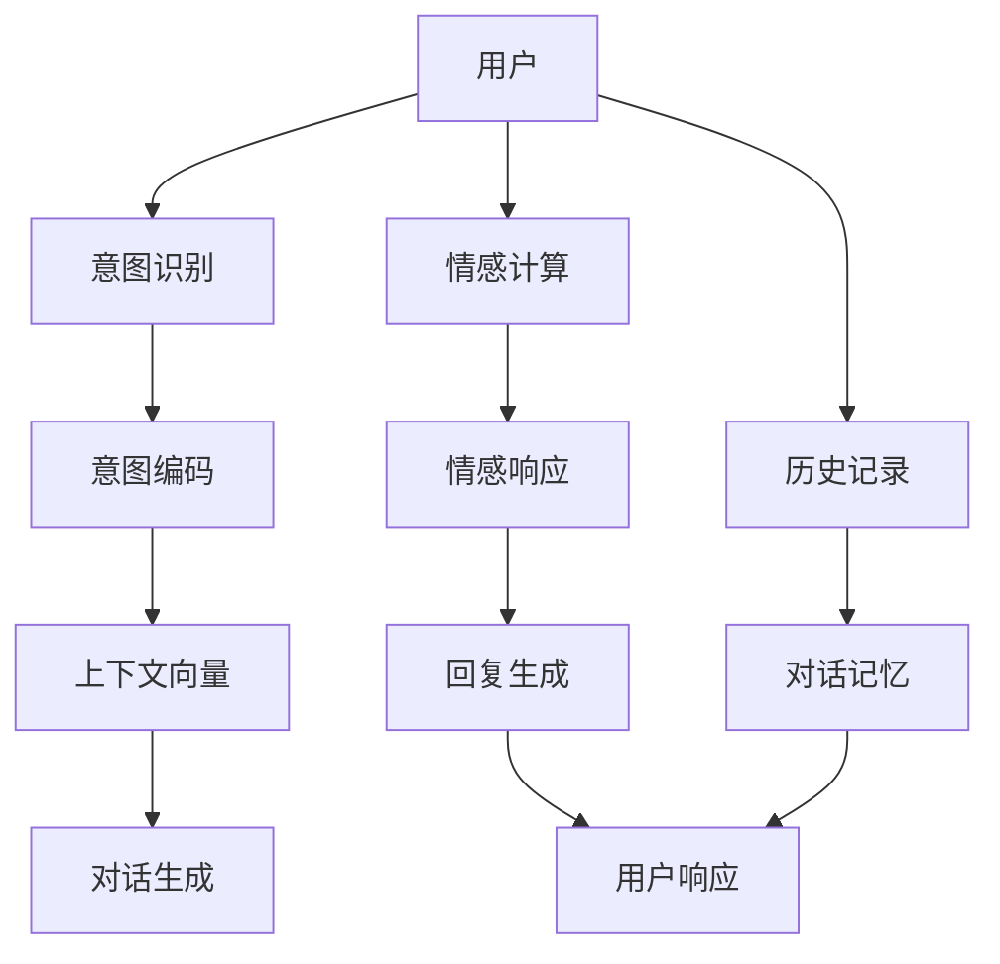

                 

# 对话式AI：构建更自然、更智能的交互界面

> 关键词：对话式AI, 自然语言处理(NLP), 深度学习, 交互界面, 用户意图理解, 生成式对话模型, 多轮对话, 上下文感知, 情感计算, 人工智能(AI)

## 1. 背景介绍

### 1.1 问题由来
对话式人工智能(Dial对话式AI)，以其自然的语言交流方式，广泛应用于智能客服、虚拟助手、娱乐机器人等场景中。但传统的基于规则或模板的对话系统，往往难以应对复杂、多样化的用户需求。基于深度学习的生成式对话模型，通过学习大量的对话数据，能够生成更加灵活、符合语境的对话回复，从而大大提升了用户体验。

近年来，随着大语言模型的兴起，生成式对话技术也得到了长足的进步。这些模型通过在大规模文本数据上进行预训练，学习到了丰富的语言知识，能够在对话中表现出极高的流畅性和自然性。然而，大语言模型的微调需要大量的标注数据，且性能提升受限于语料多样性和质量。如何在保证对话系统表现的同时，降低开发成本，提高性能稳定性，是当前对话式AI研究的重点问题。

### 1.2 问题核心关键点
对话式AI的核心在于构建更加自然、智能的交互界面。这要求模型不仅能够理解用户意图，提供准确的信息，还能在多轮对话中维持上下文一致性，处理情感和语气，适应不同的用户风格。

要实现这一目标，对话式AI系统通常需要具备以下关键能力：

- **用户意图理解**：准确识别用户请求，提取关键信息。
- **上下文感知**：在多轮对话中保持对话内容的连贯性和一致性。
- **自然语言生成**：生成流畅、符合语境的对话回复。
- **情感计算**：在对话中识别并响应用户情感，增强用户体验。

本文将重点介绍基于深度学习的生成式对话模型在对话式AI系统中的应用，详细阐述其原理和关键算法，并提供实际项目的代码实现和案例分析。

## 2. 核心概念与联系

### 2.1 核心概念概述

为更好地理解生成式对话模型的核心概念和应用场景，本节将介绍几个密切相关的核心概念：

- **生成式对话模型**：指使用深度学习技术，生成自然流畅对话回复的模型。通常基于Transformer架构，通过学习对话数据进行自监督或监督学习。
- **序列到序列(Sequence-to-Sequence, Seq2Seq)**：一种通用的机器学习框架，用于解决不同序列间的转换问题。对话系统便是典型的Seq2Seq任务。
- **编码器-解码器(Encoder-Decoder)**：Seq2Seq模型的一种变体，其中编码器负责提取输入序列的语义信息，解码器基于此信息生成输出序列。
- **注意力机制(Attention)**：一种用于提升编码器-解码器模型表现的技术，允许解码器在不同时间步关注编码器序列的不同部分，提高模型的上下文理解能力。
- **生成对抗网络(Generative Adversarial Networks, GANs)**：一种生成模型，通过对抗训练生成高质量的数据样本，增强对话模型的数据多样性。
- **上下文向量(Context Vector)**：在多轮对话中用于捕捉对话历史信息的向量，帮助模型维持对话连贯性。

这些核心概念之间的逻辑关系可以通过以下Mermaid流程图来展示：



这个流程图展示了对话式AI系统的主要流程：

1. 用户发起对话请求。
2. 意图识别模块提取用户意图，转化为编码器输入。
3. 上下文向量捕捉对话历史信息，作为编码器输入的一部分。
4. 生成式对话模型基于输入生成对话回复。
5. 情感计算模块分析用户情感，生成情感响应。
6. 回复生成模块结合情感响应，生成最终的对话回复。
7. 系统接收用户反馈，更新对话记忆。
8. 重复上述流程，直至对话结束或系统离线。

## 3. 核心算法原理 & 具体操作步骤
### 3.1 算法原理概述

生成式对话模型的核心在于利用深度学习技术，通过自监督或监督学习训练模型，使其能够理解并生成自然流畅的对话回复。其基本框架为编码器-解码器模型，通过注意力机制提升上下文理解能力。

算法原理概述如下：

1. **编码器-解码器架构**：将输入序列(如用户提问)编码成固定长度的向量，再将该向量解码为输出序列(如回复)。
2. **注意力机制**：在解码过程中，根据不同时间步的输入选择不同的权重，集中关注编码器序列中相关的部分，提高模型的上下文理解能力。
3. **序列到序列模型**：使用Seq2Seq框架，通过RNN、Transformer等模型进行训练，使得模型能够自动学习输入与输出之间的映射关系。
4. **生成对抗网络(GANs)**：使用GANs生成多样化的对话数据，增强模型对不同风格、情感的用户回复能力。

### 3.2 算法步骤详解

生成式对话模型的训练和应用通常包括以下几个关键步骤：

**Step 1: 准备数据集**
- 收集并标注对话数据，将对话分为对话-回复对。
- 将对话序列转换为模型可接受的形式，如标记化后的token序列。
- 将对话数据分为训练集、验证集和测试集。

**Step 2: 模型架构设计**
- 选择合适的深度学习框架，如PyTorch、TensorFlow等。
- 设计编码器-解码器架构，设置适当的层数和大小。
- 选择注意力机制的具体形式，如多头注意力、加性注意力等。
- 设计生成对抗网络(GANs)，用于数据增强。

**Step 3: 模型训练与优化**
- 使用自监督或监督学习策略训练模型，优化损失函数。
- 选择合适的优化算法，如Adam、SGD等，设置学习率、批大小等超参数。
- 使用数据增强技术，如回译、回填、回评等，丰富训练数据。
- 应用正则化技术，如Dropout、L2正则等，防止过拟合。
- 定期在验证集上评估模型性能，根据验证结果调整超参数。

**Step 4: 模型测试与部署**
- 在测试集上测试模型性能，评估对话回复的质量和流畅度。
- 将模型封装为可调用的服务接口，部署到生产环境。
- 收集用户反馈，不断优化模型。

### 3.3 算法优缺点

生成式对话模型具有以下优点：

1. **自然流畅**：基于深度学习的生成模型能够生成自然流畅的对话回复，提升用户体验。
2. **灵活性强**：模型能够适应不同用户风格和情感，提供个性化服务。
3. **自动化程度高**：使用深度学习技术，模型能够自动学习对话模式和用户意图。

同时，该模型也存在以下缺点：

1. **数据依赖大**：需要大量标注对话数据进行训练，数据获取和标注成本较高。
2. **模型复杂度高**：大语言模型的复杂度较高，需要较强的计算资源和存储空间。
3. **性能提升慢**：模型性能提升受限于语料的多样性和质量，需不断收集新数据进行迭代训练。
4. **泛化能力有限**：模型易受到输入分布的变化影响，泛化能力有限。

### 3.4 算法应用领域

生成式对话模型已经在诸多领域得到了广泛应用，例如：

- **智能客服**：用于自动回复用户问题，提供24/7无间断服务。
- **虚拟助手**：作为智能家居、车载等设备中的语音助手，进行语音交互和指令执行。
- **娱乐机器人**：用于游戏、社交媒体等场景，增强用户体验和互动性。
- **教育培训**：作为教学辅助工具，回答学生提问，提供个性化学习建议。
- **医疗咨询**：用于初步问诊，提供疾病建议和健康指导。
- **金融咨询**：帮助用户进行投资理财咨询，提供市场分析报告。

这些应用场景展示了生成式对话模型的广泛潜力，未来还将在更多领域得到更深入的应用。

## 4. 数学模型和公式 & 详细讲解  
### 4.1 数学模型构建

假设我们有一个对话数据集 $D=\{(x_i,y_i)\}_{i=1}^N$，其中 $x_i$ 表示对话输入，$y_i$ 表示对应的对话回复。我们设计一个编码器-解码器架构，使用Transformer模型进行对话生成。

设 $x_i=(x_{i,1},x_{i,2},\dots,x_{i,T})$ 表示对话输入序列，$y_i=(y_{i,1},y_{i,2},\dots,y_{i,T})$ 表示对话回复序列，其中 $T$ 为序列长度。

**编码器架构**：
$$
E(x_i) = \text{Encoder}(x_i; \theta_e)
$$
其中 $\theta_e$ 表示编码器模型参数。

**解码器架构**：
$$
D(E(x_i),y_{i,1}) = \text{Decoder}(E(x_i); \theta_d,y_{i,1})
$$
其中 $\theta_d$ 表示解码器模型参数，$y_{i,1}$ 表示初始回复。

**生成对抗网络(GANs)**：
设 $G$ 为生成器，$D$ 为判别器，训练目标为：
$$
\mathcal{L} = \mathbb{E}_{x_i}\left[\log D(G(x_i))\right] + \mathbb{E}_{y_i}\left[\log (1-D(y_i))\right]
$$
其中 $G$ 生成与 $y_i$ 相似的对话回复，$D$ 判断回复是否为真实对话。

**损失函数**：
$$
\mathcal{L}_{\text{total}} = \mathcal{L}_{\text{recon}} + \mathcal{L}_{\text{adv}}
$$
其中 $\mathcal{L}_{\text{recon}}$ 表示对话生成损失，$\mathcal{L}_{\text{adv}}$ 表示生成对抗网络损失。

### 4.2 公式推导过程

以一个典型的Seq2Seq模型为例，推导其前向传播和反向传播过程。

假设输入序列长度为 $T$，输出序列长度也为 $T$，模型中的每个时间步都有一个编码器-解码器模块。设 $x_{i,t}$ 表示第 $t$ 个输入，$y_{i,t}$ 表示第 $t$ 个输出。

**前向传播**：
$$
h_{i,t} = \text{Encoder}(x_{i,t},h_{i,t-1}; \theta_e)
$$
$$
\tilde{y}_{i,t} = \text{Decoder}(h_{i,t},y_{i,t-1}; \theta_d)
$$
其中 $h_{i,t}$ 表示第 $t$ 步编码器输出，$\tilde{y}_{i,t}$ 表示第 $t$ 步解码器预测输出。

**反向传播**：
$$
\frac{\partial \mathcal{L}}{\partial h_{i,t}} = \frac{\partial \mathcal{L}}{\partial \tilde{y}_{i,t}} \cdot \frac{\partial \tilde{y}_{i,t}}{\partial h_{i,t}}
$$
$$
\frac{\partial \mathcal{L}}{\partial \theta_e} = \frac{\partial \mathcal{L}}{\partial h_{i,t}} \cdot \frac{\partial h_{i,t}}{\partial x_{i,t}} \cdot \frac{\partial x_{i,t}}{\partial \theta_e}
$$
$$
\frac{\partial \mathcal{L}}{\partial \theta_d} = \frac{\partial \mathcal{L}}{\partial h_{i,t}} \cdot \frac{\partial h_{i,t}}{\partial \tilde{y}_{i,t}} \cdot \frac{\partial \tilde{y}_{i,t}}{\partial y_{i,t}} \cdot \frac{\partial y_{i,t}}{\partial \theta_d}
$$

通过上述公式，可以计算模型在每一步的前向传播和反向传播结果，从而更新模型参数，完成模型的训练。

### 4.3 案例分析与讲解

下面以一个简单的文本对话为例，说明生成式对话模型的工作原理。

假设我们有一个对话数据集，其中一条对话为：

**用户**：你好，可以推荐一些好看的电影吗？
**系统**：当然可以，请问你喜欢什么类型的电影？
**用户**：我比较喜欢科幻片。
**系统**：那推荐你看《阿凡达》，它是一部非常经典的科幻电影。
**用户**：好的，谢谢推荐。

**Step 1: 数据预处理**
首先，将对话转换为模型可接受的token序列。假设我们使用的token词汇表包含1500个词汇，则对话可以表示为：

**用户**：<START> 你好，可以推荐一些好看的电影吗？ <EOS>
**系统**：<START> 当然可以，请问你喜欢什么类型的电影？ <EOS>
**用户**：我比较喜欢科幻片。 <EOS>
**系统**：那推荐你看《阿凡达》，它是一部非常经典的科幻电影。 <EOS>

其中 <START> 和 <EOS> 分别表示对话的起始和结束标记。

**Step 2: 模型训练**
使用Seq2Seq模型，通过自监督或监督学习策略训练模型。在训练过程中，使用注意力机制提升上下文理解能力，生成对抗网络增强数据多样性。

**Step 3: 对话生成**
将用户输入的token序列输入模型，生成回复序列。具体实现过程如下：

1. 将用户输入的token序列输入编码器，得到编码器输出 $h$。
2. 将编码器输出和初始回复 token 输入解码器，生成对话回复 token。
3. 通过注意力机制，选择与当前回复相关的编码器输出，更新回复 token。
4. 重复步骤2和3，直至生成完整的对话回复。

**Step 4: 回复评估**
使用BLEU等指标评估生成对话的质量，确保回复的自然流畅性和语义准确性。

## 5. 项目实践：代码实例和详细解释说明
### 5.1 开发环境搭建

在进行对话式AI系统的开发前，需要准备好开发环境。以下是使用Python进行PyTorch开发的环境配置流程：

1. 安装Anaconda：从官网下载并安装Anaconda，用于创建独立的Python环境。

2. 创建并激活虚拟环境：
```bash
conda create -n pytorch-env python=3.8 
conda activate pytorch-env
```

3. 安装PyTorch：根据CUDA版本，从官网获取对应的安装命令。例如：
```bash
conda install pytorch torchvision torchaudio cudatoolkit=11.1 -c pytorch -c conda-forge
```

4. 安装TensorFlow：
```bash
conda install tensorflow==2.6
```

5. 安装Transformers库：
```bash
pip install transformers
```

6. 安装各类工具包：
```bash
pip install numpy pandas scikit-learn matplotlib tqdm jupyter notebook ipython
```

完成上述步骤后，即可在`pytorch-env`环境中开始对话式AI系统的开发。

### 5.2 源代码详细实现

下面我们以一个简单的文本对话生成为例，给出使用Transformers库进行对话生成的PyTorch代码实现。

首先，定义模型和优化器：

```python
from transformers import BertTokenizer, BertForSequenceClassification, AdamW
from transformers import GPT2Tokenizer, GPT2LMHeadModel
import torch
import torch.nn as nn

device = torch.device('cuda' if torch.cuda.is_available() else 'cpu')

# 定义模型
tokenizer = GPT2Tokenizer.from_pretrained('gpt2')
model = GPT2LMHeadModel.from_pretrained('gpt2', num_labels=len(tokenizer.vocab))

# 定义优化器
optimizer = AdamW(model.parameters(), lr=2e-5)
```

然后，定义模型输入和输出：

```python
class DialogueModel(nn.Module):
    def __init__(self, model):
        super(DialogueModel, self).__init__()
        self.model = model
        
    def forward(self, input_ids, attention_mask=None):
        output = self.model(input_ids=input_ids, attention_mask=attention_mask)
        return output
```

接下来，定义训练函数：

```python
def train_epoch(model, dataloader, optimizer):
    model.train()
    epoch_loss = 0
    for batch in dataloader:
        input_ids = batch['input_ids'].to(device)
        attention_mask = batch['attention_mask'].to(device)
        output = model(input_ids, attention_mask)
        loss = output.loss
        epoch_loss += loss.item()
        loss.backward()
        optimizer.step()
    return epoch_loss / len(dataloader)
```

最后，启动训练流程：

```python
epochs = 5
batch_size = 16

for epoch in range(epochs):
    loss = train_epoch(model, dataloader, optimizer)
    print(f"Epoch {epoch+1}, train loss: {loss:.3f}")
    
print("Training complete.")
```

在训练完成后，可以使用模型进行对话生成：

```python
def generate dialogue(user_input):
    user_input = tokenizer.encode(user_input, return_tensors='pt').to(device)
    model.eval()
    with torch.no_grad():
        output = model(user_input)
    return tokenizer.decode(output)
```

通过上述代码，我们可以使用Transformers库中的GPT-2模型，训练对话生成模型，并在训练后生成对话回复。

### 5.3 代码解读与分析

让我们再详细解读一下关键代码的实现细节：

**DialogueModel类**：
- `__init__`方法：初始化模型和优化器。
- `forward`方法：定义模型的前向传播过程，接受用户输入token序列，输出模型生成的对话回复token序列。

**train_epoch函数**：
- 设置模型为训练模式，清空梯度。
- 在每个批次上前向传播计算输出和损失。
- 反向传播计算梯度，更新模型参数。
- 计算并返回该epoch的平均loss。

**generate dialogue函数**：
- 将用户输入token序列转换为模型可接受的形式，输入模型进行前向传播。
- 解码输出，生成对话回复。

这些代码实现了基于Transformer的对话生成模型，可以通过训练学习对话模式，生成自然流畅的对话回复。

当然，工业级的系统实现还需考虑更多因素，如模型的保存和部署、超参数的自动搜索、更灵活的任务适配层等。但核心的对话生成原理基本与此类似。

## 6. 实际应用场景
### 6.1 智能客服系统

基于生成式对话模型，智能客服系统可以提供全天候无间断服务，大幅提升客服效率和质量。传统客服需要配备大量人力，高峰期响应缓慢，且一致性和专业性难以保证。而使用生成式对话模型，可以7x24小时不间断服务，快速响应客户咨询，用自然流畅的语言解答各类常见问题。

在技术实现上，可以收集企业内部的历史客服对话记录，将问题和最佳答复构建成监督数据，在此基础上对预训练模型进行微调。微调后的模型能够自动理解用户意图，匹配最合适的答案模板进行回复。对于客户提出的新问题，还可以接入检索系统实时搜索相关内容，动态组织生成回答。如此构建的智能客服系统，能大幅提升客户咨询体验和问题解决效率。

### 6.2 金融舆情监测

金融机构需要实时监测市场舆论动向，以便及时应对负面信息传播，规避金融风险。传统的人工监测方式成本高、效率低，难以应对网络时代海量信息爆发的挑战。基于生成式对话模型，金融舆情监测系统可以自动判断用户情感，生成情感响应，增强情感计算能力。

具体而言，可以收集金融领域相关的新闻、报道、评论等文本数据，并对其进行主题标注和情感标注。在此基础上对预训练语言模型进行微调，使其能够自动判断文本属于何种主题，情感倾向是正面、中性还是负面。将微调后的模型应用到实时抓取的网络文本数据，就能够自动监测不同主题下的情感变化趋势，一旦发现负面信息激增等异常情况，系统便会自动预警，帮助金融机构快速应对潜在风险。

### 6.3 个性化推荐系统

当前的推荐系统往往只依赖用户的历史行为数据进行物品推荐，无法深入理解用户的真实兴趣偏好。基于生成式对话模型，个性化推荐系统可以更好地挖掘用户行为背后的语义信息，从而提供更精准、多样的推荐内容。

在实践中，可以收集用户浏览、点击、评论、分享等行为数据，提取和用户交互的物品标题、描述、标签等文本内容。将文本内容作为模型输入，用户的后续行为（如是否点击、购买等）作为监督信号，在此基础上微调预训练语言模型。微调后的模型能够从文本内容中准确把握用户的兴趣点。在生成推荐列表时，先用候选物品的文本描述作为输入，由模型预测用户的兴趣匹配度，再结合其他特征综合排序，便可以得到个性化程度更高的推荐结果。

### 6.4 未来应用展望

随着生成式对话模型的不断发展，其应用场景将不断扩展，为更多行业带来变革性影响。

在智慧医疗领域，基于生成式对话模型的医疗问答、病历分析、药物研发等应用将提升医疗服务的智能化水平，辅助医生诊疗，加速新药开发进程。

在智能教育领域，对话模型可应用于作业批改、学情分析、知识推荐等方面，因材施教，促进教育公平，提高教学质量。

在智慧城市治理中，对话模型可应用于城市事件监测、舆情分析、应急指挥等环节，提高城市管理的自动化和智能化水平，构建更安全、高效的未来城市。

此外，在企业生产、社会治理、文娱传媒等众多领域，基于大模型微调的人工智能应用也将不断涌现，为经济社会发展注入新的动力。相信随着技术的日益成熟，对话式AI技术将逐渐成熟，成为人工智能落地应用的重要范式，推动人工智能技术向更广阔的领域加速渗透。

## 7. 工具和资源推荐
### 7.1 学习资源推荐

为了帮助开发者系统掌握生成式对话模型的理论基础和实践技巧，这里推荐一些优质的学习资源：

1. 《深度学习与自然语言处理》系列博文：由大模型技术专家撰写，深入浅出地介绍了深度学习在NLP领域的应用，包括生成式对话模型。

2. 《自然语言处理综述》课程：斯坦福大学开设的NLP明星课程，涵盖了NLP领域的核心概念和技术。

3. 《深度学习框架》书籍：深入介绍PyTorch、TensorFlow等主流深度学习框架的使用，帮助开发者高效实现模型。

4. 《生成式对话模型》书籍：系统介绍生成式对话模型的原理、算法和应用。

5. 《自然语言生成》书籍：详细讲解基于深度学习的文本生成技术。

通过对这些资源的学习实践，相信你一定能够快速掌握生成式对话模型的精髓，并用于解决实际的NLP问题。
###  7.2 开发工具推荐

高效的开发离不开优秀的工具支持。以下是几款用于生成式对话模型开发常用的工具：

1. PyTorch：基于Python的开源深度学习框架，灵活动态的计算图，适合快速迭代研究。大多数预训练语言模型都有PyTorch版本的实现。

2. TensorFlow：由Google主导开发的开源深度学习框架，生产部署方便，适合大规模工程应用。同样有丰富的预训练语言模型资源。

3. Transformers库：HuggingFace开发的NLP工具库，集成了众多SOTA语言模型，支持PyTorch和TensorFlow，是进行对话模型开发的利器。

4. Weights & Biases：模型训练的实验跟踪工具，可以记录和可视化模型训练过程中的各项指标，方便对比和调优。与主流深度学习框架无缝集成。

5. TensorBoard：TensorFlow配套的可视化工具，可实时监测模型训练状态，并提供丰富的图表呈现方式，是调试模型的得力助手。

6. Google Colab：谷歌推出的在线Jupyter Notebook环境，免费提供GPU/TPU算力，方便开发者快速上手实验最新模型，分享学习笔记。

合理利用这些工具，可以显著提升生成式对话模型的开发效率，加快创新迭代的步伐。

### 7.3 相关论文推荐

生成式对话模型的发展源于学界的持续研究。以下是几篇奠基性的相关论文，推荐阅读：

1. Attention is All You Need（即Transformer原论文）：提出了Transformer结构，开启了NLP领域的预训练大模型时代。

2. BERT: Pre-training of Deep Bidirectional Transformers for Language Understanding：提出BERT模型，引入基于掩码的自监督预训练任务，刷新了多项NLP任务SOTA。

3. Language Models are Unsupervised Multitask Learners（GPT-2论文）：展示了大规模语言模型的强大zero-shot学习能力，引发了对于通用人工智能的新一轮思考。

4. Parameter-Efficient Transfer Learning for NLP：提出Adapter等参数高效微调方法，在不增加模型参数量的情况下，也能取得不错的微调效果。

5. Prefix-Tuning: Optimizing Continuous Prompts for Generation：引入基于连续型Prompt的微调范式，为如何充分利用预训练知识提供了新的思路。

6. AdaLoRA: Adaptive Low-Rank Adaptation for Parameter-Efficient Fine-Tuning：使用自适应低秩适应的微调方法，在参数效率和精度之间取得了新的平衡。

这些论文代表了大模型微调技术的发展脉络。通过学习这些前沿成果，可以帮助研究者把握学科前进方向，激发更多的创新灵感。

## 8. 总结：未来发展趋势与挑战

### 8.1 总结

本文对生成式对话模型在对话式AI系统中的应用进行了全面系统的介绍。首先阐述了生成式对话模型的研究背景和意义，明确了对话式AI系统构建的自然语言理解和生成能力。其次，从原理到实践，详细讲解了生成式对话模型的算法原理和关键算法，提供了实际项目的代码实现和案例分析。同时，本文还广泛探讨了生成式对话模型在智能客服、金融舆情、个性化推荐等多个行业领域的应用前景，展示了生成式对话模型的广阔潜力。此外，本文精选了生成式对话模型的各类学习资源，力求为开发者提供全方位的技术指引。

通过本文的系统梳理，可以看到，生成式对话模型在对话式AI系统中扮演了重要的角色，能够提供更加自然、智能的交互界面，提升用户体验和应用效果。未来，伴随生成式对话模型的不断发展，其在更多领域的应用将不断拓展，为自然语言处理和人工智能技术的产业化进程注入新的活力。

### 8.2 未来发展趋势

展望未来，生成式对话模型将呈现以下几个发展趋势：

1. **自然语言生成能力提升**：模型将进一步提升自然语言生成的流畅性和多样性，使得对话更加自然和个性化。

2. **多模态对话技术发展**：结合语音、图像、视频等多模态信息，增强对话系统的理解和生成能力，支持更加丰富的交互方式。

3. **情感计算与情感响应**：对话系统将具备更强的情感计算和情感响应能力，能够根据用户的情感状态生成相应的回复，提升用户体验。

4. **模型泛化能力增强**：模型将具备更强的泛化能力，能够适应不同领域、不同风格的用户需求。

5. **多轮对话能力提升**：模型将具备更好的多轮对话能力，能够更准确地理解和生成多轮对话内容，增强上下文理解能力。

6. **知识图谱与常识推理**：对话系统将结合知识图谱和常识推理技术，提供更准确的语义理解和知识获取能力。

以上趋势凸显了生成式对话模型在对话式AI系统中的广阔前景。这些方向的探索发展，必将进一步提升对话系统的表现和用户体验，推动人工智能技术的进一步普及和应用。

### 8.3 面临的挑战

尽管生成式对话模型在对话式AI系统中已经取得了一定的成就，但在迈向更加智能化、普适化应用的过程中，仍面临诸多挑战：

1. **数据获取和标注成本高**：生成式对话模型需要大量的标注数据进行训练，获取高质量标注数据成本较高。如何降低数据获取和标注成本，提高数据利用效率，是当前研究的重要课题。

2. **模型复杂度与计算资源限制**：生成式对话模型复杂度高，需要较强的计算资源和存储空间。如何在保证性能的同时，降低模型复杂度和资源消耗，是未来的研究重点。

3. **多轮对话连贯性问题**：多轮对话中上下文信息的传递和维护是对话系统的一个难题。如何设计有效的上下文向量，提升对话连贯性，是未来需要重点解决的问题。

4. **泛化能力不足**：模型在实际应用中容易受到输入分布的变化影响，泛化能力有限。如何提高模型的泛化能力，增强对话系统的适应性，是未来的研究方向。

5. **可解释性不足**：当前对话系统通常作为"黑盒"存在，难以解释其内部工作机制和决策逻辑。如何增强模型的可解释性，提高系统的透明性，是未来需要解决的重要问题。

6. **伦理与安全问题**：对话系统容易受到恶意攻击，生成有害、虚假信息，影响用户安全和信任。如何提高系统的鲁棒性和安全性，是未来的研究方向。

正视对话系统面临的这些挑战，积极应对并寻求突破，将使对话式AI技术迈向成熟的阶段。只有通过技术创新和算法优化，才能真正实现人工智能技术的广泛应用，推动社会进步和发展。

### 8.4 研究展望

未来的研究需要在以下几个方面寻求新的突破：

1. **无监督与半监督学习**：探索无监督和半监督学习方法，减少对标注数据的依赖，利用自监督学习、主动学习等技术，增强模型的泛化能力。

2. **参数高效微调**：开发更加参数高效的微调方法，在固定大部分预训练参数的同时，只更新极少量的任务相关参数，提高微调效率和模型性能。

3. **模型压缩与加速**：通过模型压缩、剪枝、量化等技术，减少模型参数和计算资源消耗，提高推理速度和模型精度。

4. **多轮对话记忆机制**：设计更高效的上下文向量表示，提升对话系统的多轮对话能力，确保上下文信息的准确传递和维护。

5. **多模态融合**：结合语音、图像、视频等多模态信息，提升对话系统的理解和生成能力，支持更加丰富的交互方式。

6. **知识图谱与常识推理**：结合知识图谱和常识推理技术，提供更准确的语义理解和知识获取能力，增强对话系统的智能水平。

这些研究方向的探索，必将引领生成式对话模型在对话式AI系统中的应用走向新的高度，为构建智能、普适的对话系统提供新的突破。面向未来，生成式对话模型将与其他人工智能技术进行更深入的融合，共同推动自然语言处理和智能交互系统的进步。只有勇于创新、敢于突破，才能不断拓展对话系统的边界，让智能技术更好地服务于人类社会。

## 9. 附录：常见问题与解答

**Q1：生成式对话模型如何处理多轮对话中的上下文信息？**

A: 生成式对话模型通常使用上下文向量(Context Vector)来捕捉多轮对话中的上下文信息。在每轮对话中，将前轮对话的内容和当前轮用户输入的token序列编码成向量，并输入模型，生成对话回复。上下文向量可以通过LSTM、GRU等RNN结构，或者Transformer结构中的位置编码向量等方式实现。

**Q2：生成式对话模型如何生成自然流畅的对话回复？**

A: 生成式对话模型通过学习对话数据，利用深度学习技术，自动生成自然流畅的对话回复。在训练过程中，模型会根据输入序列和前一时间步的输出序列，选择不同的编码器输出，并通过注意力机制增强上下文理解能力。在生成过程中，模型会利用预测的输出序列作为下一时间步的输入，逐步生成完整的对话回复。

**Q3：生成式对话模型如何处理对话中的情感信息？**

A: 生成式对话模型可以通过情感计算模块，在对话中识别并响应用户情感，增强用户体验。具体实现方式包括：在对话生成过程中，模型可以预测对话的情感倾向，并根据情感预测结果调整生成的回复内容。在对话结束后，模型可以根据用户情感反应，进一步优化模型参数，提升情感响应的准确性。

**Q4：生成式对话模型在多轮对话中如何保持连贯性？**

A: 生成式对话模型通常使用上下文向量(Context Vector)来捕捉多轮对话中的上下文信息，并在每轮对话中更新上下文向量。在生成回复时，模型将当前轮用户输入的token序列和上下文向量一起编码成向量，并输入模型，生成对话回复。上下文向量可以帮助模型在多轮对话中保持对话连贯性，确保对话内容的连贯和一致。

**Q5：生成式对话模型在实际应用中如何处理异常情况？**

A: 生成式对话模型可以通过异常检测和鲁棒性训练，处理对话中的异常情况。在训练过程中，模型可以引入对抗样本、噪声样本等，增强模型的鲁棒性。在对话生成过程中，模型可以检测对话中的异常词汇和结构，生成相应的提示或回复，确保对话系统的稳定性和安全性。

通过以上分析，我们可以看到，生成式对话模型在对话式AI系统中的应用前景广阔，具有较强的自然语言生成能力和上下文理解能力，能够提升用户体验和应用效果。但同时，对话系统也面临诸多挑战，需要不断进行技术创新和算法优化，才能真正实现智能化、普适化的应用目标。相信在未来，随着生成式对话模型和相关技术的不断进步，对话式AI系统将能够更好地服务于社会，推动人工智能技术的广泛应用和发展。

