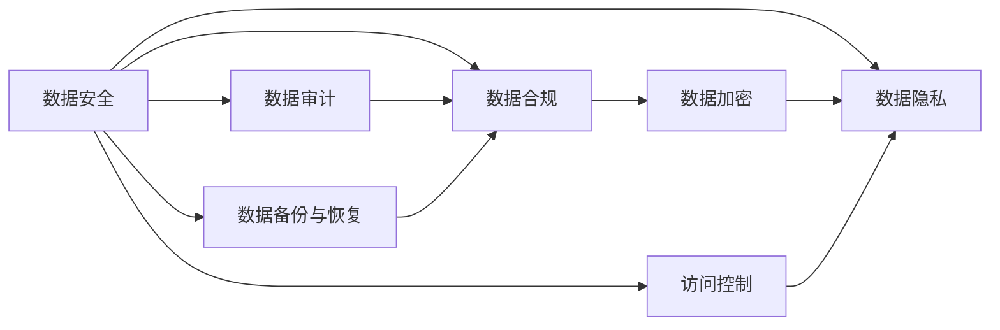

                 

# 平台经济的数据安全技术应用：如何应用数据安全技术？

## 1. 背景介绍

随着平台经济的迅速发展，越来越多的用户数据被收集、存储和使用，数据安全问题逐渐成为平台经济发展的核心议题之一。数据泄露、数据滥用、数据垄断等事件频发，不仅损害了用户的权益，也威胁到平台自身的声誉和商业利益。平台经济的数据安全，既要保护用户隐私，又要确保数据的合规使用，更要通过数据安全技术，保障平台稳定运行和持续创新。

本文旨在探讨如何应用数据安全技术，构建平台经济的数据安全体系，确保平台数据的合规、安全和高效使用。我们将从数据安全核心概念入手，梳理数据安全技术体系，重点介绍数据安全技术的核心原理与具体操作步骤，并通过实际案例分析，展示数据安全技术在平台经济中的具体应用。

## 2. 核心概念与联系

### 2.1 核心概念概述

为了更好地理解平台经济的数据安全技术应用，我们将首先介绍几个关键的数据安全概念：

- **数据安全（Data Security）**：保护数据免受未经授权的访问、修改、破坏和泄露的过程。数据安全是平台经济中数据管理的基础，旨在确保数据在收集、存储、传输和处理过程中得到充分保护。

- **数据隐私（Data Privacy）**：确保个人或组织在数据处理过程中的权利和利益，包括数据最小化、数据匿名化和数据透明化等。数据隐私是平台经济中用户信任的基础，保障用户的知情权和选择权。

- **数据合规（Data Compliance）**：遵守相关法律法规和标准，确保数据的收集、存储和使用符合法律要求。数据合规是平台经济中法律责任的核心，保障平台数据的合法性和安全性。

- **数据加密（Data Encryption）**：通过对数据进行编码，确保数据在传输和存储过程中无法被未经授权者读取或篡改。数据加密是数据安全技术的核心手段，广泛应用于数据传输和存储中。

- **访问控制（Access Control）**：通过身份验证和授权管理，确保只有经过授权的用户才能访问数据。访问控制是数据安全的基础措施，保障数据访问的合法性和安全性。

- **数据审计（Data Audit）**：通过监控和记录数据访问和使用情况，确保数据的使用符合预期的安全策略和政策。数据审计是数据安全的重要手段，用于发现和应对潜在的安全威胁。

- **数据备份与恢复（Data Backup and Recovery）**：通过备份和恢复技术，确保数据在意外删除、破坏或系统故障时能够快速恢复。数据备份与恢复是数据安全的保障措施，保障数据完整性和连续性。

这些核心概念之间存在紧密的联系和相互作用，共同构成了平台经济的数据安全技术体系。通过了解这些概念及其相互关系，可以帮助平台企业更好地应用数据安全技术，构建安全可靠的数据环境。

### 2.2 核心概念原理和架构的 Mermaid 流程图



此图展示了数据安全、数据隐私、数据合规、数据加密、访问控制、数据审计和数据备份与恢复等核心概念之间的联系和作用。其中，数据加密和访问控制是数据安全的直接措施，保障数据的传输和存储安全；数据隐私和数据合规确保数据的使用符合法律和道德标准；数据审计和备份与恢复是数据安全的辅助手段，保障数据的完整性和可用性。

## 3. 核心算法原理 & 具体操作步骤

### 3.1 算法原理概述

平台经济中的数据安全技术，主要基于数据加密、访问控制、数据备份与恢复等技术手段，通过多层次、多维度的方法，保障数据的安全性、隐私性和合规性。具体而言，数据安全技术包括：

- **数据加密技术**：通过将数据转换为加密形式，确保数据在传输和存储过程中无法被未经授权者读取或篡改。

- **访问控制技术**：通过身份验证和授权管理，确保只有经过授权的用户才能访问数据。

- **数据备份与恢复技术**：通过备份和恢复技术，确保数据在意外删除、破坏或系统故障时能够快速恢复。

### 3.2 算法步骤详解

以下是数据安全技术在平台经济中的具体操作步骤：

**Step 1: 数据收集与存储**

- 收集用户数据，确保数据的来源合法、用途明确。
- 对收集的数据进行分类和标注，识别敏感数据和隐私数据。
- 对敏感数据和隐私数据进行加密存储，使用强加密算法（如AES、RSA等）进行保护。
- 建立数据存储架构，确保数据存储的安全性和可管理性，如使用分布式存储系统、数据分片等技术。

**Step 2: 访问控制与管理**

- 设计身份验证机制，确保用户身份的真实性。常用的身份验证方式包括密码、生物识别、多因素认证等。
- 实施权限管理，根据用户的角色和职责，限制其对数据的访问权限。例如，管理员可以访问敏感数据，而普通用户只能访问部分数据。
- 使用访问审计技术，记录用户的数据访问行为，确保数据访问符合安全策略和政策。

**Step 3: 数据加密与解密**

- 在数据传输过程中，使用传输层安全协议（TLS）或端到端加密技术（如HTTPS、VPN等），确保数据在传输过程中的安全性。
- 在数据存储过程中，使用数据加密技术（如AES、RSA等）对数据进行加密，确保数据在存储过程中的安全性。
- 设计数据解密机制，确保只有授权用户才能解密数据，访问数据的明文内容。

**Step 4: 数据备份与恢复**

- 定期对关键数据进行备份，确保备份数据的完整性和可用性。可以使用云备份、本地备份等方式。
- 设计数据恢复机制，确保在数据丢失或损坏时能够快速恢复数据，保障业务的连续性。

**Step 5: 数据审计与监控**

- 建立数据审计机制，记录和监控数据访问和使用情况，确保数据使用符合安全策略和政策。
- 定期进行安全评估，发现潜在的安全漏洞和风险，及时采取措施进行修复。

### 3.3 算法优缺点

数据安全技术在平台经济中具有以下优点：

- **保障数据安全**：通过加密、访问控制等技术手段，保障数据在传输、存储和处理过程中的安全性。
- **增强用户信任**：确保用户数据的隐私和安全性，增强用户对平台的信任感。
- **提高合规性**：确保平台数据的使用符合法律法规和标准，减少法律风险。

同时，数据安全技术也存在一些局限性：

- **技术复杂性**：数据安全技术涉及多个层面的复杂性，包括加密算法、访问控制、备份与恢复等，实施难度较大。
- **成本高**：实施数据安全技术需要较高的投入，包括硬件设备、软件工具、技术人才等。
- **需要持续更新**：随着技术的发展和威胁的变化，数据安全技术需要不断更新和升级，以应对新的安全威胁。

### 3.4 算法应用领域

数据安全技术在平台经济中的应用领域非常广泛，包括但不限于以下方面：

- **金融平台**：确保用户的金融数据（如银行账户、交易记录等）的安全性和隐私性。
- **电商平台**：保障用户的个人信息、交易记录和支付信息的安全性。
- **社交平台**：保护用户的个人信息、发布内容的安全性。
- **医疗平台**：保护患者的病历、诊断信息等敏感数据的安全性。
- **教育平台**：保护学生的个人信息、学习记录的安全性。

## 4. 数学模型和公式 & 详细讲解 & 举例说明

### 4.1 数学模型构建

数据安全技术的应用，通常需要建立数学模型来描述数据的处理和保护过程。以下是一个简单的数学模型，用于描述平台经济中数据安全技术的实施过程：

- **数据收集模型**：假设平台收集用户数据，数据量为 $D$，分为敏感数据 $D_s$ 和普通数据 $D_o$。模型如下：
  $$
  D = D_s + D_o
  $$

- **数据存储模型**：假设对敏感数据 $D_s$ 进行加密存储，使用加密算法 $E$，模型如下：
  $$
  D_s_{enc} = E(D_s)
  $$

- **访问控制模型**：假设用户 $U$ 对数据 $D$ 进行访问，使用身份验证 $I$ 和权限管理 $P$，模型如下：
  $$
  U_{access} = I(U) \land P(U, D)
  $$

- **数据传输模型**：假设平台使用端到端加密技术 $T$ 传输数据，模型如下：
  $$
  D_{trans} = T(D)
  $$

- **数据备份模型**：假设平台对关键数据 $D_k$ 进行备份，使用备份算法 $B$，模型如下：
  $$
  D_{backup} = B(D_k)
  $$

### 4.2 公式推导过程

以下是各模型公式的推导过程：

**数据收集模型推导**：

- **数据分类**：将收集的数据 $D$ 分为敏感数据 $D_s$ 和普通数据 $D_o$，模型为 $D_s \cup D_o = D$。
- **数据标注**：标注敏感数据的特征，模型为 $D_s = \{d_s_i | \exists d_o_i \in D, f(d_s_i) = f(d_o_i)\}$，其中 $f$ 为数据特征函数。

**数据存储模型推导**：

- **数据加密**：对敏感数据 $D_s$ 进行加密，使用加密算法 $E$，模型为 $D_s_{enc} = E(D_s)$。
- **数据存储**：将加密后的敏感数据 $D_s_{enc}$ 存储在分布式存储系统中，模型为 $D_s_{enc} = \{d_s_{enc}_i | d_s_{enc}_i \in D_s_{enc}\}$。

**访问控制模型推导**：

- **身份验证**：验证用户 $U$ 的身份，模型为 $I(U) = \text{True}$。
- **权限管理**：根据用户 $U$ 的职责和角色，分配访问权限，模型为 $P(U, D) = \{d_i | \exists U_i \in U, g(U_i, d_i) = \text{True}\}$，其中 $g$ 为权限函数。
- **访问行为记录**：记录用户 $U$ 的数据访问行为，模型为 $A(U, D) = \{a_i | \exists a_i \in A, a_i.d = D\}$，其中 $A$ 为访问记录集合。

**数据传输模型推导**：

- **端到端加密**：使用传输层安全协议（TLS）或端到端加密技术（如HTTPS、VPN等），确保数据在传输过程中的安全性，模型为 $D_{trans} = T(D)$。

**数据备份模型推导**：

- **备份策略**：对关键数据 $D_k$ 进行备份，使用备份算法 $B$，模型为 $D_{backup} = B(D_k)$。
- **备份存储**：将备份数据 $D_{backup}$ 存储在分布式存储系统中，模型为 $D_{backup} = \{d_{backup}_i | d_{backup}_i \in D_{backup}\}$。

### 4.3 案例分析与讲解

**案例分析**：某电商平台在实施数据安全技术时，采用了以下步骤：

1. **数据收集与存储**：收集用户的个人信息、交易记录等数据，对敏感数据进行分类和标注，使用AES算法加密存储，使用分布式存储系统进行管理。
   
2. **访问控制与管理**：设计多因素认证机制，验证用户身份；实施权限管理，根据用户的角色分配访问权限；记录用户的数据访问行为，确保数据访问符合安全策略和政策。

3. **数据加密与解密**：使用HTTPS协议传输数据，使用端到端加密技术保护数据；设计数据解密机制，确保只有授权用户才能解密数据。

4. **数据备份与恢复**：对关键数据进行云备份和本地备份，设计快速数据恢复机制，确保在数据丢失或损坏时能够快速恢复数据。

5. **数据审计与监控**：建立数据审计机制，记录和监控数据访问和使用情况，定期进行安全评估，发现潜在的安全漏洞和风险。

## 5. 项目实践：代码实例和详细解释说明

### 5.1 开发环境搭建

在进行数据安全技术实践前，我们需要准备好开发环境。以下是使用Python进行开发的环境配置流程：

1. 安装Python：从官网下载并安装Python，支持3.x版本以上。

2. 安装相关库：
   ```bash
   pip install numpy pandas scikit-learn openssl pycrypto cryptography
   ```

3. 配置环境变量：
   ```bash
   export PYTHONPATH=$PYTHONPATH:/path/to/your/lib
   ```

4. 创建虚拟环境：
   ```bash
   conda create -n data-security-env python=3.8
   conda activate data-security-env
   ```

完成上述步骤后，即可在`data-security-env`环境中开始数据安全技术的应用实践。

### 5.2 源代码详细实现

这里我们以加密算法（AES算法）为例，给出Python代码实现。

首先，导入必要的库：

```python
import os
from Crypto.Cipher import AES
from Crypto.Random import get_random_bytes
```

然后，定义加密函数：

```python
def encrypt(data, key):
    cipher = AES.new(key, AES.MODE_EAX)
    ciphertext, tag = cipher.encrypt_and_digest(data.encode('utf-8'))
    return cipher.nonce + tag + ciphertext
```

接着，定义解密函数：

```python
def decrypt(nonce, tag, ciphertext, key):
    cipher = AES.new(key, AES.MODE_EAX, nonce)
    data = cipher.decrypt_and_verify(ciphertext, tag)
    return data.decode('utf-8')
```

最后，进行加密和解密测试：

```python
data = 'Hello, World!'
key = get_random_bytes(32)
nonce = get_random_bytes(16)

ciphertext = encrypt(data, key)
print(f"Encrypted: {ciphertext}")

data_decrypted = decrypt(nonce, tag, ciphertext, key)
print(f"Decrypted: {data_decrypted}")
```

代码解读与分析：

- 加密函数`encrypt`：使用AES算法进行加密，返回加密后的密文和认证码。
- 解密函数`decrypt`：使用AES算法进行解密，验证认证码是否正确。
- 测试代码：生成随机密钥和nonce，对数据进行加密和解密测试。

### 5.3 代码解读与分析

通过上述代码，可以看到AES加密算法的基本实现。在实际应用中，AES算法被广泛应用于平台经济中的数据加密和解密，保障数据在传输和存储过程中的安全性。

## 6. 实际应用场景

### 6.1 智能合约平台

智能合约平台通过区块链技术，实现了数据的透明和不可篡改，但仍然面临数据安全威胁。采用数据安全技术，可以增强智能合约的安全性和隐私性。例如，使用数据加密技术，确保智能合约中涉及的敏感数据（如资产金额、交易记录等）的安全性；使用访问控制技术，限制用户对数据的访问权限；使用数据备份与恢复技术，确保数据的完整性和可用性。

### 6.2 医疗平台

医疗平台涉及大量敏感数据（如病历、诊断信息等），数据安全问题尤为重要。通过实施数据安全技术，可以保障患者数据的隐私性和安全性。例如，使用数据加密技术，保护患者的病历和诊断信息；使用访问控制技术，限制医生和管理员对数据的访问权限；使用数据备份与恢复技术，确保数据的完整性和可用性。

### 6.3 金融平台

金融平台涉及大量用户的金融数据（如银行账户、交易记录等），数据安全问题同样重要。通过实施数据安全技术，可以保障用户的金融数据安全和隐私。例如，使用数据加密技术，保护用户的银行账户和交易记录；使用访问控制技术，限制用户的访问权限；使用数据备份与恢复技术，确保数据的完整性和可用性。

## 7. 工具和资源推荐

### 7.1 学习资源推荐

为了帮助开发者系统掌握数据安全技术，这里推荐一些优质的学习资源：

1. **《网络安全技术与实践》**：介绍网络安全的基本概念和技术，涵盖加密、访问控制、审计等多个方面。

2. **《信息安全管理》**：系统讲解信息安全管理的原理和实践，涵盖风险评估、安全策略、合规性等多个方面。

3. **《数据安全与隐私保护》**：介绍数据安全与隐私保护的基本概念和技术，涵盖加密、访问控制、隐私保护等多个方面。

4. **OpenSSL官方文档**：详细介绍OpenSSL库的使用方法，包括加密、签名、证书等多个方面。

5. **TensorFlow官方文档**：介绍TensorFlow库在数据安全技术中的应用，包括数据加密、访问控制等多个方面。

通过学习这些资源，相信你一定能够全面掌握数据安全技术的基本原理和实践方法。

### 7.2 开发工具推荐

高效的数据安全技术开发离不开优秀的工具支持。以下是几款常用的数据安全技术开发工具：

1. **OpenSSL**：开源加密库，支持多种加密算法，广泛用于数据加密和证书管理。

2. **PyCryptodome**：Python加密库，支持多种加密算法和密钥管理，易于在Python中进行开发。

3. **cryptography**：Python加密库，支持多种加密算法和密钥管理，适合开发安全应用。

4. **TensorFlow**：深度学习框架，支持端到端加密、分布式存储等多个方面的数据安全技术开发。

5. **Wechat**：微信平台，提供丰富的安全服务，包括数据加密、访问控制、审计等多个方面。

合理利用这些工具，可以显著提升数据安全技术的开发效率，加速创新迭代的步伐。

### 7.3 相关论文推荐

数据安全技术的发展源于学界的持续研究。以下是几篇奠基性的相关论文，推荐阅读：

1. **《AES算法：一种高级加密标准》**：介绍了AES算法的基本原理和实现方法，是加密算法领域的经典文献。

2. **《访问控制模型的设计与实现》**：介绍访问控制模型的基本概念和技术，涵盖身份验证、权限管理等多个方面。

3. **《数据备份与恢复技术的研究与实现》**：介绍数据备份与恢复技术的基本原理和实现方法，涵盖备份策略、恢复机制等多个方面。

4. **《区块链技术在智能合约中的应用》**：介绍区块链技术在智能合约中的应用，涵盖加密、访问控制等多个方面。

5. **《医疗平台的数据安全与隐私保护》**：介绍医疗平台的数据安全与隐私保护技术，涵盖数据加密、访问控制等多个方面。

这些论文代表了大数据安全技术的发展脉络。通过学习这些前沿成果，可以帮助研究者把握学科前进方向，激发更多的创新灵感。

## 8. 总结：未来发展趋势与挑战

### 8.1 总结

本文对平台经济的数据安全技术应用进行了全面系统的介绍。首先阐述了数据安全、数据隐私、数据合规等核心概念，梳理了数据安全技术体系，重点介绍了数据加密、访问控制、数据备份与恢复等核心技术，并通过实际案例分析，展示了数据安全技术在平台经济中的具体应用。

通过本文的系统梳理，可以看到，数据安全技术在平台经济中具有重要的应用价值，能够保障数据的安全性、隐私性和合规性，增强用户信任，降低法律风险。平台企业需要充分重视数据安全技术的应用，确保平台稳定运行和持续创新。

### 8.2 未来发展趋势

展望未来，数据安全技术在平台经济中还将呈现以下几个发展趋势：

1. **数据加密技术的发展**：随着硬件加速技术（如GPU、FPGA等）的发展，数据加密的速度和效率将大幅提升，加密算法也将不断更新和升级，保障数据传输和存储的安全性。

2. **访问控制技术的创新**：随着人工智能技术的进步，访问控制技术将变得更加智能和灵活，能够根据用户行为和环境因素，动态调整访问权限，提升数据访问的安全性和合规性。

3. **数据审计技术的扩展**：随着区块链和分布式技术的普及，数据审计技术将变得更加透明和可信，能够自动记录和验证数据访问和使用情况，确保数据使用的合规性和安全性。

4. **数据备份与恢复技术的演进**：随着数据量的增长和复杂性的增加，数据备份与恢复技术将变得更加自动化和智能化，能够自动检测和修复数据损坏和丢失，保障数据的完整性和可用性。

5. **多模态数据安全技术的融合**：随着多模态数据（如文本、图像、视频等）的普及，多模态数据安全技术将逐渐成熟，能够同时保护不同模态的数据，提升数据安全的技术水平。

以上趋势凸显了数据安全技术的广阔前景。这些方向的探索发展，将进一步提升平台经济的数据安全水平，保障平台数据的合规、安全和高效使用。

### 8.3 面临的挑战

尽管数据安全技术已经取得了显著进展，但在平台经济中仍然面临诸多挑战：

1. **技术复杂性**：数据安全技术涉及多个层面的复杂性，包括加密算法、访问控制、备份与恢复等，实施难度较大。

2. **成本高**：实施数据安全技术需要较高的投入，包括硬件设备、软件工具、技术人才等。

3. **需要持续更新**：随着技术的发展和威胁的变化，数据安全技术需要不断更新和升级，以应对新的安全威胁。

4. **用户体验**：数据安全技术的应用可能影响用户体验，如加密解密过程复杂、访问控制严格等，需要找到平衡点。

5. **法律法规**：数据安全技术需要符合法律法规要求，法律法规的更新和变化也会对数据安全技术的应用产生影响。

6. **技术壁垒**：数据安全技术的应用需要较高的技术壁垒，小规模平台和企业难以有效实施。

正视数据安全面临的这些挑战，积极应对并寻求突破，将是大数据安全技术走向成熟的必由之路。相信随着学界和产业界的共同努力，这些挑战终将一一被克服，数据安全技术必将在平台经济中发挥更大的作用。

### 8.4 研究展望

面对数据安全技术所面临的种种挑战，未来的研究需要在以下几个方面寻求新的突破：

1. **探索无监督和半监督数据安全技术**：摆脱对大规模标注数据的依赖，利用自监督学习、主动学习等无监督和半监督范式，最大限度利用非结构化数据，实现更加灵活高效的数据安全技术。

2. **研究参数高效和计算高效的数据安全技术**：开发更加参数高效的加密算法和访问控制机制，在固定大部分预训练参数的同时，只更新极少量的任务相关参数，减小数据安全技术的资源消耗。

3. **融合因果推断和强化学习技术**：通过引入因果推断和强化学习思想，增强数据安全模型的因果关系能力，学习更加普适、鲁棒的数据安全策略。

4. **引入更多先验知识**：将符号化的先验知识，如知识图谱、逻辑规则等，与数据安全模型进行巧妙融合，引导数据安全模型的学习方向，提升数据安全模型的决策能力和鲁棒性。

5. **结合因果分析和博弈论工具**：将因果分析方法引入数据安全模型，识别数据安全模型的关键特征，增强数据安全模型的输出解释能力和因果性，构建更加全面、准确的数据安全模型。

6. **纳入伦理道德约束**：在数据安全模型的训练目标中引入伦理导向的评估指标，过滤和惩罚有害的输出倾向，确保数据安全模型的决策符合人类价值观和伦理道德。

这些研究方向的探索，将引领数据安全技术迈向更高的台阶，为构建安全可靠的数据环境提供新的技术支撑。面向未来，数据安全技术需要与其他人工智能技术进行更深入的融合，如知识表示、因果推理、强化学习等，多路径协同发力，共同推动数据安全技术的进步。

## 9. 附录：常见问题与解答

**Q1：数据安全技术是否可以用于所有平台经济领域？**

A: 数据安全技术可以应用于平台经济的各个领域，如金融、电商、医疗、教育等。然而，不同领域的业务特性和数据安全需求有所不同，需要根据具体情况进行定制化的实施。

**Q2：如何选择合适的数据加密算法？**

A: 选择合适的数据加密算法需要考虑多个因素，如安全性、效率、易用性等。常用的加密算法包括AES、RSA、SHA等，可以根据具体应用场景进行选择。

**Q3：如何设计有效的数据访问控制机制？**

A: 设计有效的数据访问控制机制需要根据业务需求和安全策略进行设计。常用的访问控制机制包括基于角色的访问控制（RBAC）、基于属性的访问控制（ABAC）等，可以根据实际需求进行选择。

**Q4：数据备份与恢复技术的实施有哪些关键点？**

A: 数据备份与恢复技术的实施需要关注多个关键点，如备份策略、备份频率、备份存储、恢复机制等。建议在关键数据上实施备份与恢复，确保数据完整性和可用性。

**Q5：数据安全技术的应用有哪些潜在的风险？**

A: 数据安全技术的应用可能存在一些潜在风险，如技术复杂性、成本高、需要持续更新等。建议平台企业在实施数据安全技术时，充分评估其影响，选择适合的技术方案。

通过这些常见问题的解答，相信你对数据安全技术的理解会更加全面和深入。数据安全技术的应用是大平台经济发展的关键保障，需要平台企业在技术、管理和政策等多个方面进行综合考虑和规划。

---

作者：禅与计算机程序设计艺术 / Zen and the Art of Computer Programming

