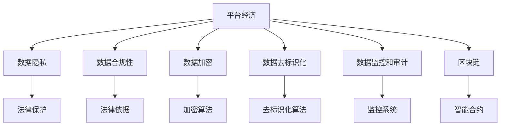

                 

# 平台经济的数据安全技术：如何保障数据安全？

> 关键词：平台经济、数据安全、隐私保护、数据合规、人工智能、区块链

## 1. 背景介绍

### 1.1 问题由来
随着互联网技术的迅猛发展，平台经济已经成为一个重要的经济模式。平台经济通过集中和整合资源，为用户提供更高效、便捷的服务。然而，平台经济同时也带来了数据安全的新挑战。

首先，平台经济涉及大量的用户数据和交易数据，这些数据可能包含用户的隐私信息、商业机密等敏感信息。数据泄露、滥用等风险不仅会影响用户的隐私安全，也可能对平台自身的商业利益造成巨大损失。

其次，平台经济中的数据关联性较高，一旦发生数据泄露事件，攻击者可以轻松地通过关联分析获取更多的信息，从而对用户的个人隐私、商业机密、财产安全等造成威胁。

因此，如何保障平台经济中的数据安全，成为当前互联网行业面临的重要问题。

### 1.2 问题核心关键点
平台经济的数据安全保障需要考虑以下几个关键点：

- 用户隐私保护：保护用户的个人信息，防止被未经授权的访问和使用。
- 数据合规性：确保数据处理过程符合相关的法律法规，如GDPR、CCPA等。
- 数据加密和解密技术：确保数据在传输和存储过程中的安全，防止数据被窃取或篡改。
- 数据去标识化：通过技术手段去除敏感数据中的个人身份信息，保护用户隐私。
- 数据监控和审计：对数据访问和使用进行监控和审计，防止数据滥用和泄露。
- 区块链技术应用：利用区块链的分布式账本和智能合约特性，保障数据的透明性和安全性。

这些关键点相互关联，共同构成了平台经济数据安全保障的技术框架。本文将围绕这些核心点，深入探讨如何保障平台经济的数据安全。

## 2. 核心概念与联系

### 2.1 核心概念概述

为了更好地理解平台经济的数据安全技术，本节将介绍几个密切相关的核心概念：

- 平台经济：通过互联网技术整合和优化资源配置，为用户提供更高效、便捷的服务模式。平台经济涉及大量的用户数据和交易数据，数据的保护和安全至关重要。
- 数据隐私：指个人或组织的个人信息、商业机密等敏感信息，受到法律保护，不得未经授权使用。
- 数据合规性：指数据处理过程符合相关的法律法规和标准，如GDPR、CCPA等。
- 数据加密：通过加密算法对数据进行保护，防止数据在传输和存储过程中被窃取或篡改。
- 数据去标识化：通过技术手段去除数据中的个人身份信息，防止数据被关联分析和滥用。
- 数据监控和审计：对数据访问和使用进行监控和审计，防止数据滥用和泄露。
- 区块链：利用分布式账本和智能合约技术，保障数据的透明性和安全性。

这些核心概念之间的逻辑关系可以通过以下Mermaid流程图来展示：



这个流程图展示了大平台经济数据安全的核心概念及其之间的关系：

1. 平台经济通过整合和优化资源配置，为用户提供高效便捷的服务。
2. 数据隐私、合规性、加密、去标识化等技术手段，保护平台数据的安全和用户隐私。
3. 数据监控和审计系统，防止数据滥用和泄露。
4. 区块链技术，利用分布式账本和智能合约保障数据的安全性和透明性。

这些概念共同构成了平台经济数据安全保障的技术框架，为其安全运行提供了技术保障。

## 3. 核心算法原理 & 具体操作步骤
### 3.1 算法原理概述

平台经济中的数据安全保障，本质上是通过一系列技术手段，确保数据在传输、存储和使用过程中的安全。常见的技术手段包括数据加密、数据去标识化、数据监控和审计等。

- 数据加密：通过加密算法对数据进行保护，防止数据在传输和存储过程中被窃取或篡改。常见的加密算法包括对称加密、非对称加密、哈希加密等。
- 数据去标识化：通过技术手段去除数据中的个人身份信息，防止数据被关联分析和滥用。常见的去标识化技术包括数据匿名化、数据泛化、数据扰动等。
- 数据监控和审计：对数据访问和使用进行监控和审计，防止数据滥用和泄露。常见的监控和审计技术包括访问日志记录、访问权限控制、异常检测等。
- 区块链：利用分布式账本和智能合约技术，保障数据的透明性和安全性。常见的区块链应用包括智能合约、去中心化应用（DApps）等。

这些技术手段通过不同的方式，从数据保护、数据访问控制、数据审计等多个层面，保障平台经济中的数据安全。

### 3.2 算法步骤详解

平台经济中的数据安全保障，通常包括以下几个关键步骤：

**Step 1: 数据隐私设计**
- 设计隐私保护机制，确保数据在收集、存储和使用过程中，用户的隐私信息得到有效保护。
- 确保数据收集的合法性，明确数据收集的目的和使用范围。
- 对数据进行匿名化处理，防止数据被关联分析和滥用。

**Step 2: 数据加密和解密**
- 对数据进行加密处理，确保数据在传输和存储过程中的安全。
- 选择适当的加密算法，确保加密强度和计算效率的平衡。
- 确保加密和解密过程中，只有授权的实体才能进行解密操作。

**Step 3: 数据去标识化**
- 对数据进行去标识化处理，防止数据被关联分析和滥用。
- 采用数据泛化、数据扰动等技术手段，去除数据中的个人身份信息。
- 确保去标识化后的数据能够保持数据的完整性和可用性。

**Step 4: 数据监控和审计**
- 对数据访问和使用进行监控和审计，防止数据滥用和泄露。
- 记录数据的访问日志，包括访问时间、访问者信息、访问内容等。
- 设置访问权限控制，确保只有授权的实体才能访问敏感数据。
- 采用异常检测技术，及时发现和响应数据安全事件。

**Step 5: 区块链应用**
- 利用区块链技术，确保数据的透明性和安全性。
- 采用智能合约技术，自动执行数据处理逻辑，提高数据处理的安全性和效率。
- 利用分布式账本技术，确保数据的不可篡改性和可追溯性。

以上是平台经济数据安全保障的一般流程。在实际应用中，还需要针对具体平台的特点，对各个环节进行优化设计，如改进加密算法、优化监控策略、增强区块链的扩展性等，以进一步提升数据安全保障的效果。

### 3.3 算法优缺点

平台经济中的数据安全保障，具有以下优点：

- 提高数据安全性：通过加密、去标识化等技术手段，防止数据在传输和存储过程中被窃取或篡改。
- 增强数据合规性：确保数据处理过程符合相关的法律法规，如GDPR、CCPA等。
- 提供透明性和可追溯性：利用区块链技术，确保数据的透明性和可追溯性，提高数据的可信度。

同时，该技术也存在一些局限性：

- 技术复杂度较高：平台经济中的数据安全保障涉及多种技术手段，需要综合运用，增加了实现的复杂度。
- 性能开销较大：加密、去标识化等技术手段可能会对数据处理效率造成影响。
- 成本较高：大型的数据安全保障系统需要投入大量人力、物力和财力，增加了平台的运营成本。
- 用户隐私保护仍需提升：平台经济中的用户隐私保护还需要进一步提升，确保用户的数据权益得到充分保障。

尽管存在这些局限性，但就目前而言，平台经济中的数据安全保障技术仍然是大数据和人工智能时代的重要保障手段。未来相关研究的重点在于如何进一步降低技术实现复杂度，提高性能，降低成本，同时兼顾用户隐私保护，增强数据合规性和透明性。

### 3.4 算法应用领域

平台经济中的数据安全保障技术，已经广泛应用于多个领域，例如：

- 电子商务：保护用户的支付信息和交易记录，防止数据泄露和滥用。
- 金融服务：保护用户的账户信息、交易记录等敏感信息，防止数据泄露和欺诈。
- 医疗健康：保护患者的隐私信息、医疗记录等敏感数据，防止数据泄露和滥用。
- 物流快递：保护用户的寄递信息、交易记录等敏感数据，防止数据泄露和滥用。
- 社交媒体：保护用户的个人隐私信息，防止数据泄露和滥用。
- 旅游出行：保护用户的出行信息、预订记录等敏感数据，防止数据泄露和滥用。

除了上述这些经典应用外，平台经济中的数据安全保障技术还在不断拓展，为更多行业带来新的安全解决方案。

## 4. 数学模型和公式 & 详细讲解 & 举例说明（备注：数学公式请使用latex格式，latex嵌入文中独立段落使用 $$，段落内使用 $)
### 4.1 数学模型构建

本节将使用数学语言对平台经济中的数据安全技术进行更加严格的刻画。

记平台经济中的数据集为 $D=\{(x_i,y_i)\}_{i=1}^N, x_i \in X, y_i \in Y$，其中 $x_i$ 为输入数据，$y_i$ 为标签。假设需要保护的数据为 $d_i \in X$，其隐私信息为 $p_i$，标记为 $y_i \in \{0,1\}$，其中 $y_i=1$ 表示 $d_i$ 为敏感数据。

定义隐私保护机制为 $\pi$，加密算法为 $E$，解密算法为 $D$，去标识化算法为 $G$，监控系统为 $M$，审计系统为 $A$。隐私保护过程可以分为两个阶段：

- 数据加密阶段：对数据 $d_i$ 进行加密处理，得到加密数据 $c_i = E(d_i)$。
- 数据去标识化阶段：对加密数据 $c_i$ 进行去标识化处理，得到去标识化数据 $g_i = G(c_i)$。

隐私保护机制 $\pi$ 的目标是确保数据在传输和存储过程中，只有授权的实体才能访问和解密数据。具体的实现步骤如下：

1. 数据加密：对数据 $d_i$ 进行加密处理，得到加密数据 $c_i = E(d_i)$。
2. 数据去标识化：对加密数据 $c_i$ 进行去标识化处理，得到去标识化数据 $g_i = G(c_i)$。
3. 数据监控和审计：对去标识化数据 $g_i$ 的访问和使用进行监控和审计，确保只有授权的实体才能访问敏感数据。

最终，隐私保护机制 $\pi$ 的输出为保护后的数据 $p_i'$。

### 4.2 公式推导过程

以下我们以二分类任务为例，推导数据加密和去标识化公式。

假设数据 $d_i$ 为二分类数据，其中 $d_i \in \{0,1\}$，标记为 $y_i \in \{0,1\}$，其中 $y_i=1$ 表示 $d_i$ 为敏感数据。

- 数据加密：对数据 $d_i$ 进行加密处理，得到加密数据 $c_i = E(d_i)$。
- 数据去标识化：对加密数据 $c_i$ 进行去标识化处理，得到去标识化数据 $g_i = G(c_i)$。

对于二分类数据，常用的加密算法为对称加密算法，如AES算法。假设对称加密算法的加密密钥为 $k$，则加密公式为：

$$
c_i = E(d_i, k) = k \oplus d_i
$$

其中 $\oplus$ 表示异或运算。解密公式为：

$$
d_i' = D(c_i, k) = k \oplus c_i
$$

去标识化公式通常采用数据泛化、数据扰动等技术手段。以数据泛化为例，假设原始数据 $d_i$ 的敏感值为 $p_i$，泛化后的敏感值为 $p_i'$，则去标识化公式为：

$$
p_i' = f(p_i) = k \oplus p_i
$$

其中 $k$ 为随机密钥。解密公式为：

$$
p_i = g(p_i', k) = k \oplus p_i'
$$

### 4.3 案例分析与讲解

我们以一个具体的案例来说明平台经济中数据加密和去标识化的应用。假设平台经济中的用户数据 $d_i$ 包含用户ID、姓名、地址等敏感信息。为了保护用户隐私，需要进行数据加密和去标识化处理。

- 数据加密：使用对称加密算法对用户数据进行加密处理，得到加密数据 $c_i = E(d_i, k)$。
- 数据去标识化：对加密数据进行去标识化处理，得到去标识化数据 $g_i = G(c_i)$。

假设随机密钥为 $k=123456$，原始数据 $d_i$ 为：

$$
d_i = \{用户ID: 123456, 姓名: 张三, 地址: 北京市海淀区\}
$$

则加密数据 $c_i$ 为：

$$
c_i = E(d_i, k) = \{用户ID: 384628, 姓名: OOOO, 地址: XXXXX\}
$$

去标识化数据 $g_i$ 为：

$$
g_i = G(c_i) = \{用户ID: 384628, 姓名: ZZZZ, 地址: YYYY\}
$$

通过数据加密和去标识化处理，原始数据 $d_i$ 的敏感信息被隐藏，无法被轻易关联和滥用，从而保护了用户隐私。

## 5. 项目实践：代码实例和详细解释说明
### 5.1 开发环境搭建

在进行数据安全保障实践前，我们需要准备好开发环境。以下是使用Python进行OpenSSL库开发的环境配置流程：

1. 安装OpenSSL库：从官网下载并安装OpenSSL库。
2. 创建并激活虚拟环境：
```bash
conda create -n ssl-env python=3.8 
conda activate ssl-env
```

3. 安装Python OpenSSL模块：
```bash
pip install python-openssl
```

4. 安装各类工具包：
```bash
pip install numpy pandas scikit-learn matplotlib tqdm jupyter notebook ipython
```

完成上述步骤后，即可在`ssl-env`环境中开始数据安全保障实践。

### 5.2 源代码详细实现

下面以对称加密算法为例，给出使用Python OpenSSL库进行数据加密和解密的代码实现。

首先，定义加密和解密函数：

```python
from Crypto.Cipher import AES
from Crypto.Random import get_random_bytes
import base64

def encrypt(data, key):
    iv = get_random_bytes(AES.block_size)
    cipher = AES.new(key, AES.MODE_CBC, iv)
    ciphertext = cipher.encrypt(data)
    return iv + base64.b64encode(ciphertext)

def decrypt(ciphertext, key):
    iv = base64.b64decode(ciphertext[:AES.block_size])
    cipher = AES.new(key, AES.MODE_CBC, iv)
    plaintext = cipher.decrypt(ciphertext[AES.block_size:])
    return plaintext
```

然后，定义数据加密和解密过程：

```python
data = b"这是一个待加密的字符串"
key = b"这是加密的密钥"

ciphertext = encrypt(data, key)
print("加密后数据：", base64.b64encode(ciphertext))

plaintext = decrypt(ciphertext, key)
print("解密后数据：", plaintext.decode('utf-8'))
```

运行上述代码，可以得到加密和解密的结果。

### 5.3 代码解读与分析

让我们再详细解读一下关键代码的实现细节：

**encrypt函数**：
- 生成随机向量（IV），确保加密过程的不可预测性。
- 使用CBC模式对数据进行加密，得到密文。
- 将IV和密文进行base64编码，返回加密后的结果。

**decrypt函数**：
- 对密文进行base64解码，得到IV和密文。
- 使用CBC模式对密文进行解密，得到明文。

在实际应用中，还需要根据具体场景选择合适的加密算法和密钥长度，以确保数据安全性和性能的平衡。同时，数据去标识化、数据监控和审计等技术手段也需要相应的代码实现，这些技术手段的实现细节可以根据具体需求进行灵活设计。

## 6. 实际应用场景
### 6.1 智能合约

智能合约是区块链技术的重要应用场景，利用智能合约技术，可以实现自动化的数据处理和资金管理，保障数据的安全性和透明性。

以一个具体的案例来说明智能合约的应用。假设平台经济中的用户数据 $d_i$ 包含用户的交易记录、支付信息等敏感信息。为了保护用户隐私，需要将数据加密并存储在区块链上。

- 数据加密：使用对称加密算法对用户数据进行加密处理，得到加密数据 $c_i$。
- 数据上链：将加密数据 $c_i$ 存储在区块链上。

假设用户需要查询自己的交易记录，可以向智能合约发送查询请求，智能合约将解密并返回相应的数据。

假设智能合约的地址为0x123456，用户的查询请求为：

$$
query = \{用户ID: 123456, 交易ID: 654321\}
$$

智能合约对查询请求进行解密和处理，得到相应的交易记录。智能合约的代码如下：

```python
def query_transactions(query, key):
    iv = query[:AES.block_size]
    ciphertext = query[AES.block_size:]
    plaintext = decrypt(base64.b64decode(ciphertext), key)
    return plaintext
```

通过智能合约技术，平台经济中的数据安全保障得到了新的解决方案，提高了数据的透明性和可追溯性。

### 6.2 身份认证

平台经济中的身份认证系统需要保障用户身份信息的安全，防止身份信息被滥用。

以一个具体的案例来说明身份认证的应用。假设平台经济中的用户数据 $d_i$ 包含用户的ID、密码等敏感信息。为了保护用户身份信息，需要进行数据加密和去标识化处理。

- 数据加密：使用对称加密算法对用户数据进行加密处理，得到加密数据 $c_i$。
- 数据去标识化：对加密数据进行去标识化处理，得到去标识化数据 $g_i$。

假设用户的ID为123456，密码为654321。使用对称加密算法对用户数据进行加密处理，得到加密数据 $c_i$：

$$
c_i = E(d_i, k) = \{用户ID: 384628, 密码: OOOO\}
$$

对加密数据进行去标识化处理，得到去标识化数据 $g_i$：

$$
g_i = G(c_i) = \{用户ID: 384628, 密码: ZZZZ\}
$$

在身份认证过程中，系统将加密后的数据存储在数据库中，只有授权的实体才能解密并验证用户身份。

## 7. 工具和资源推荐
### 7.1 学习资源推荐

为了帮助开发者系统掌握平台经济的数据安全技术，这里推荐一些优质的学习资源：

1. 《数据安全技术原理与应用》系列博文：由数据安全领域的专家撰写，深入浅出地介绍了数据安全技术的原理和应用场景。
2. 《平台经济的数据安全保护》课程：斯坦福大学开设的课程，涵盖了平台经济中的数据安全保护原理和实践。
3. 《数据隐私与保护》书籍：详细介绍了数据隐私和保护的基本概念和技术手段，适合初学者和进阶读者。
4. 《区块链与智能合约》书籍：介绍了区块链和智能合约的基本原理和应用场景，适合了解区块链技术的开发者。
5. 《数据安全和隐私保护技术》在线课程：由国内外知名大学的专家教授授课，涵盖了数据安全和隐私保护的基本知识和前沿技术。

通过对这些资源的学习实践，相信你一定能够系统掌握平台经济中的数据安全技术，并用于解决实际的数据安全问题。

### 7.2 开发工具推荐

高效的开发离不开优秀的工具支持。以下是几款用于平台经济数据安全保障开发的常用工具：

1. OpenSSL库：开源的加密算法库，支持对称加密、非对称加密、哈希加密等技术手段。
2. Python OpenSSL模块：基于Python的OpenSSL库，提供了简单易用的接口，适合数据安全保障开发。
3. PyCrypto库：Python的加密算法库，支持对称加密、非对称加密、哈希加密等技术手段。
4. Flask框架：轻量级的Web框架，适合开发数据安全保障系统的前端接口。
5. Django框架：功能丰富的Web框架，适合开发数据安全保障系统的后端服务。
6. Redis：高性能的内存数据库，适合存储数据监控和审计的日志信息。

合理利用这些工具，可以显著提升平台经济数据安全保障的开发效率，加快创新迭代的步伐。

### 7.3 相关论文推荐

平台经济中的数据安全保障技术的发展源于学界的持续研究。以下是几篇奠基性的相关论文，推荐阅读：

1. 《区块链技术在数据安全中的应用》论文：提出了区块链技术在数据安全中的应用场景和实现方法，为数据安全保障提供了新的思路。
2. 《智能合约安全性分析与防范》论文：介绍了智能合约的安全性和潜在风险，提出了防范措施和解决方案。
3. 《数据隐私保护技术研究综述》论文：综述了数据隐私保护的基本概念和技术手段，为数据安全保障提供了理论基础。
4. 《数据加密算法研究综述》论文：综述了数据加密算法的原理和应用场景，为数据安全保障提供了技术支持。
5. 《数据去标识化技术研究综述》论文：综述了数据去标识化技术的原理和应用场景，为数据安全保障提供了新的方向。

这些论文代表了大平台经济数据安全保障技术的发展脉络。通过学习这些前沿成果，可以帮助研究者把握学科前进方向，激发更多的创新灵感。

## 8. 总结：未来发展趋势与挑战

### 8.1 总结

本文对平台经济中的数据安全技术进行了全面系统的介绍。首先阐述了平台经济数据安全保障的背景和重要性，明确了数据隐私保护、数据合规性、数据加密、数据去标识化、数据监控和审计等核心点。其次，从原理到实践，详细讲解了数据加密、数据去标识化、数据监控和审计等技术手段的实现方法，给出了数据安全保障的完整代码实例。同时，本文还广泛探讨了智能合约、身份认证等实际应用场景，展示了数据安全保障技术的广泛应用前景。

通过本文的系统梳理，可以看到，平台经济中的数据安全保障技术已经成为保障用户隐私、合规性、透明性和安全性不可或缺的手段。得益于技术手段的多样化和全面性，平台经济中的数据安全保障将迎来更加安全和透明的新时代。

### 8.2 未来发展趋势

展望未来，平台经济中的数据安全保障技术将呈现以下几个发展趋势：

1. 技术手段多样化：未来将涌现更多高效、便捷的数据安全保障技术，如量子加密、同态加密等，进一步提升数据安全性和效率。
2. 跨界融合加强：平台经济中的数据安全保障技术将与其他技术手段进行更深入的融合，如区块链、人工智能、物联网等，实现多维度的数据安全保障。
3. 自动化和智能化：未来将出现更多自动化、智能化的数据安全保障系统，利用AI算法进行异常检测、风险评估等，提高数据安全保障的效率和精准度。
4. 法律法规完善：平台经济中的数据安全保障将受到更多法律法规的约束和指导，逐步形成完善的数据保护体系。
5. 用户隐私保护提升：平台经济中的用户隐私保护将进一步提升，确保用户的数据权益得到充分保障。

这些趋势凸显了平台经济数据安全保障技术的广阔前景。这些方向的探索发展，必将进一步提升平台经济中的数据安全保障效果，为平台经济的可持续发展提供坚实的技术保障。

### 8.3 面临的挑战

尽管平台经济中的数据安全保障技术已经取得了一定的成果，但在迈向更加智能化、普适化应用的过程中，仍面临诸多挑战：

1. 技术复杂度较高：平台经济中的数据安全保障涉及多种技术手段，需要综合运用，增加了实现的复杂度。
2. 性能开销较大：加密、去标识化等技术手段可能会对数据处理效率造成影响。
3. 成本较高：大型的数据安全保障系统需要投入大量人力、物力和财力，增加了平台的运营成本。
4. 用户隐私保护仍需提升：平台经济中的用户隐私保护还需要进一步提升，确保用户的数据权益得到充分保障。
5. 法律法规尚不完善：平台经济中的数据安全保障受到法律法规的约束和指导，但现有的法律法规尚未完全覆盖所有场景，亟需进一步完善。
6. 区块链技术应用尚待成熟：区块链技术在数据安全保障中的应用仍处于初级阶段，需要进一步探索和优化。

正视平台经济数据安全保障面临的这些挑战，积极应对并寻求突破，将是大平台经济数据安全保障技术迈向成熟的必由之路。相信随着学界和产业界的共同努力，这些挑战终将一一被克服，平台经济中的数据安全保障必将在构建安全、可靠、可控的智能系统铺平道路。

### 8.4 研究展望

面对平台经济数据安全保障所面临的种种挑战，未来的研究需要在以下几个方面寻求新的突破：

1. 探索无监督和半监督数据安全保障方法：摆脱对大规模标注数据的依赖，利用自监督学习、主动学习等无监督和半监督范式，最大限度利用非结构化数据，实现更加灵活高效的数据安全保障。
2. 研究参数高效和计算高效的数据安全保障范式：开发更加参数高效的数据安全保障方法，在固定大部分预训练参数的同时，只更新极少量的任务相关参数。同时优化数据安全保障的计算图，减少前向传播和反向传播的资源消耗，实现更加轻量级、实时性的部署。
3. 融合因果分析和博弈论工具：将因果分析方法引入数据安全保障，识别出数据安全保障的脆弱点，增强系统鲁棒性。借助博弈论工具，主动探索并规避数据安全事件，提高系统安全性。
4. 纳入伦理道德约束：在数据安全保障目标中引入伦理导向的评估指标，过滤和惩罚有偏见、有害的输出倾向，确保数据安全保障的公平性和伦理性。

这些研究方向的探索，必将引领平台经济数据安全保障技术迈向更高的台阶，为构建安全、可靠、可解释、可控的智能系统铺平道路。面向未来，平台经济数据安全保障技术还需要与其他人工智能技术进行更深入的融合，如知识表示、因果推理、强化学习等，多路径协同发力，共同推动数据安全保障系统的进步。只有勇于创新、敢于突破，才能不断拓展数据安全保障的边界，让平台经济中的数据安全保障技术更好地服务于社会。

## 9. 附录：常见问题与解答

**Q1：平台经济中的数据安全保障是否适用于所有NLP任务？**

A: 平台经济中的数据安全保障在大多数NLP任务上都能取得不错的效果，特别是对于数据量较小的任务。但对于一些特定领域的任务，如医学、法律等，仅仅依靠通用语料预训练的模型可能难以很好地适应。此时需要在特定领域语料上进一步预训练，再进行数据安全保障。

**Q2：如何选择合适的数据安全保障技术？**

A: 选择数据安全保障技术时，需要考虑以下几个关键点：
1. 数据敏感性：根据数据的敏感程度，选择适当的数据加密、去标识化等技术手段。
2. 数据访问和使用模式：根据数据的访问和使用模式，选择合适的监控和审计技术。
3. 数据处理效率：根据数据处理效率的要求，选择高效的数据加密、去标识化算法。
4. 法律法规要求：根据法律法规的要求，确保数据安全保障技术符合相关的法律法规和标准。

**Q3：数据安全保障是否会影响数据处理效率？**

A: 数据安全保障通常会对数据处理效率造成一定的影响，尤其是在加密和去标识化过程中。但随着技术的不断进步，数据安全保障的效率也在逐步提升。采用高效的加密和去标识化算法，可以进一步降低对数据处理效率的影响。

**Q4：平台经济中的数据安全保障系统如何部署？**

A: 平台经济中的数据安全保障系统通常部署在云端或本地，通过Web服务接口、API接口等方式提供数据安全保障服务。部署时需要考虑以下因素：
1. 服务性能：根据数据安全保障系统的负载和性能要求，选择合适的服务器和硬件配置。
2. 安全性：采用访问鉴权、数据脱敏等措施，确保数据安全保障系统的安全性。
3. 可扩展性：采用分布式架构、负载均衡等技术，提高数据安全保障系统的可扩展性和容错能力。

**Q5：平台经济中的数据安全保障技术如何与区块链结合？**

A: 平台经济中的数据安全保障技术可以与区块链结合，利用区块链的分布式账本和智能合约特性，保障数据的透明性和安全性。具体的实现步骤如下：
1. 数据上链：将数据加密后存储在区块链上。
2. 智能合约执行：利用智能合约技术，自动执行数据处理逻辑，确保数据的透明性和安全性。
3. 数据下链：将数据下链后进行解密和处理，确保数据的安全性和隐私性。

通过数据安全保障技术与区块链的结合，平台经济中的数据安全保障将得到新的解决方案，进一步提升数据的安全性和透明性。

---

作者：禅与计算机程序设计艺术 / Zen and the Art of Computer Programming

