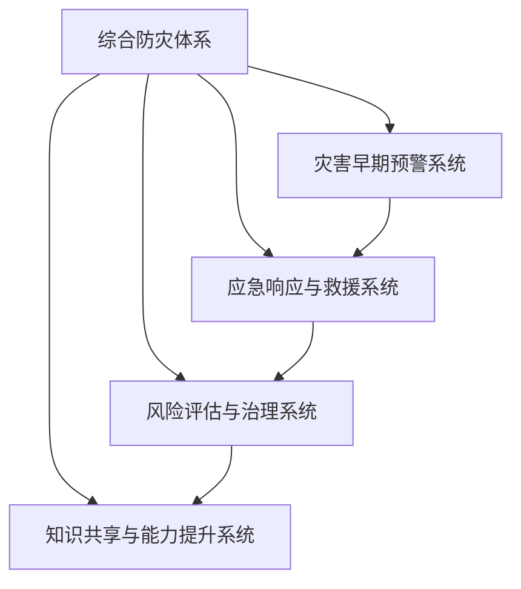

                 

# 2050年的全球减灾：从灾害应对到风险治理的综合防灾体系

## 1. 背景介绍

### 1.1 问题由来
进入21世纪以来，全球范围内自然灾害频发，气候变化带来的极端天气事件愈发频繁，严重威胁着人类社会的稳定与发展。为了有效应对灾害，提升防灾减灾能力，2050年，世界各国在联合国领导下，合作构建了一个全新的全球减灾体系，旨在从灾害应对逐步向风险治理转变，实现从被动救灾到主动预防的战略升级。这一体系的核心是通过科技和创新的手段，建立起覆盖全社会的综合防灾网络，实现灾害的早期预警、快速响应、科学治理和持续改进。

### 1.2 问题核心关键点
1. **综合防灾体系的构建**：这一体系融合了现代科技手段，包括卫星遥感、物联网、大数据、人工智能等，构建起一个全时、全域、全功能的防灾减灾网络。
2. **灾害早期预警与监测**：通过精准的天气预报、地质监测和灾害预警系统，实现灾害的早期识别和预警，及时告知公众并采取应对措施。
3. **应急响应与救援**：在灾害发生时，迅速启动应急响应机制，协调各方资源，实施科学救援，减少人员伤亡和财产损失。
4. **风险评估与治理**：通过对灾害风险进行科学评估，制定合理的风险治理策略，预防未来潜在灾害的发生。
5. **知识共享与能力提升**：建立全球防灾知识库，共享防灾经验和科研成果，提升全球各国的防灾减灾能力。

### 1.3 问题研究意义
构建2050年全球减灾体系，不仅有助于保护人民生命财产安全，降低灾害带来的经济和社会影响，还能促进可持续发展，推动全球治理体系向更加公正、包容、可持续的方向发展。这一体系将成为全球防灾减灾工作的重要里程碑，为未来防灾减灾工作提供科学、系统的指导。

## 2. 核心概念与联系

### 2.1 核心概念概述

为更好地理解2050年全球减灾体系的框架和运作机制，本节将介绍几个密切相关的核心概念：

- **综合防灾体系(Comprehensive Disaster Management System, CDMS)**：一个集成化、模块化的防灾减灾体系，涵盖早期预警、应急响应、风险评估和持续改进等环节，形成一个闭环管理的防灾网络。
- **灾害早期预警系统(Early Warning System, EWS)**：利用现代科技手段，如卫星遥感、物联网等，对各类灾害进行实时监测和预警，提升灾害应对的效率和效果。
- **应急响应与救援系统(Emergency Response and Rescue System, ERS)**：建立快速响应机制，协调各方资源，实施科学救援，最大限度地减少灾害带来的影响。
- **风险评估与治理系统(Risk Assessment and Governance System, RAGS)**：通过数据分析和模型预测，评估灾害风险，制定科学的风险治理策略，预防未来潜在灾害的发生。
- **知识共享与能力提升系统(Knowledge Sharing and Capacity Enhancement System, KSCE)**：建立全球防灾知识库，共享防灾经验和科研成果，提升全球各国的防灾减灾能力。

这些核心概念之间的逻辑关系可以通过以下Mermaid流程图来展示：



这个流程图展示了综合防灾体系与其他系统之间的关系：

1. 综合防灾体系是整个减灾工作的核心，涵盖早期预警、应急响应、风险评估和知识共享等关键环节。
2. 灾害早期预警系统利用现代科技手段，为综合防灾体系提供实时的灾害信息。
3. 应急响应与救援系统在灾害发生时，迅速启动响应机制，实施救援。
4. 风险评估与治理系统通过科学评估灾害风险，制定风险治理策略。
5. 知识共享与能力提升系统构建全球防灾知识库，提升全球各国的防灾减灾能力。

## 3. 核心算法原理 & 具体操作步骤
### 3.1 算法原理概述

2050年全球减灾体系的运作，建立在以下几个核心算法和原理之上：

- **数据驱动的灾害预警算法**：利用机器学习和大数据分析技术，实时监测和预测各类自然灾害的发生。
- **风险评估与建模算法**：通过统计模型和模拟模型，评估灾害发生的概率和影响范围，制定科学的风险治理策略。
- **应急响应与救援算法**：利用优化算法和运筹学模型，快速协调各方资源，实施科学救援。
- **知识共享与协同算法**：通过知识图谱和社交网络，构建全球防灾知识库，促进各国之间的协同合作。

### 3.2 算法步骤详解

#### 步骤1：数据采集与处理
- **数据采集**：通过卫星遥感、地面监测站、传感器等手段，采集各类灾害相关的数据，包括气象数据、地质数据、海洋数据等。
- **数据预处理**：清洗、归一化、标准化处理采集的数据，去除噪声和异常值，确保数据的质量和一致性。

#### 步骤2：灾害预警与监测
- **数据融合与特征提取**：将采集到的各类数据进行融合，提取关键特征，如气温、湿度、气压、地质活动等。
- **模型训练与预测**：利用历史数据训练机器学习模型，如随机森林、支持向量机、神经网络等，进行灾害预测和预警。

#### 步骤3：应急响应与救援
- **资源配置与调度**：利用优化算法（如线性规划、整数规划），合理配置和调度救援资源，如人力、物资、设备等。
- **实时监控与调整**：通过物联网技术，实时监控救援进度，根据实际情况动态调整救援方案。

#### 步骤4：风险评估与治理
- **风险评估**：利用统计模型和模拟模型，评估灾害发生的概率和影响范围，进行风险评估。
- **策略制定与执行**：根据风险评估结果，制定科学的风险治理策略，预防未来潜在灾害的发生。

#### 步骤5：知识共享与能力提升
- **知识库构建**：建立全球防灾知识库，收集各国防灾经验和科研成果，形成共享的知识资源。
- **能力提升**：通过在线课程、培训项目等形式，提升各国防灾减灾的专业能力和技术水平。

### 3.3 算法优缺点

2050年全球减灾体系的算法具有以下优点：

- **数据驱动**：利用大数据和机器学习技术，提升灾害预警的准确性和及时性。
- **科学决策**：基于科学模型和算法，制定合理的风险治理策略，提高灾害应对的效率和效果。
- **协同合作**：通过知识共享和协同算法，促进全球各国之间的合作与交流，提升防灾减灾能力。

同时，这一体系也存在一些局限性：

- **数据依赖**：对数据的采集和处理要求高，数据缺失或不准确会影响预警和监测的准确性。
- **技术门槛**：部分算法和模型需要较高的技术门槛，对国家和地区的技术基础和人才储备提出了挑战。
- **成本问题**：部分高精度、高性能的设备和系统，如遥感卫星、传感器等，成本较高，需要大量资金投入。

### 3.4 算法应用领域

2050年全球减灾体系的应用领域非常广泛，涵盖了以下几个关键领域：

- **气象灾害预警**：包括台风、洪水、暴雨等，利用卫星遥感和大数据分析技术，进行实时监测和预警。
- **地质灾害预警**：包括地震、滑坡、泥石流等，通过地质监测和数据融合技术，提前识别和预警。
- **海洋灾害预警**：包括海啸、风暴潮等，利用海洋监测设备和传感器，进行灾害监测和预警。
- **公共卫生应急响应**：包括疫情、流行病等，通过大数据分析和模拟模型，进行风险评估和应急响应。
- **交通应急响应**：包括道路中断、航班延误等，利用物联网和实时监控技术，进行应急响应和救援。

这些应用领域展示了2050年全球减灾体系在防灾减灾工作中的广泛影响和重要价值。

## 4. 数学模型和公式 & 详细讲解 & 举例说明（备注：数学公式请使用latex格式，latex嵌入文中独立段落使用 $$，段落内使用 $)
### 4.1 数学模型构建

本节将使用数学语言对2050年全球减灾体系的运作机制进行更加严谨的描述。

假设灾害预警系统采集的气象数据为 $x_i$，地质数据为 $y_i$，海洋数据为 $z_i$，时间为 $t$，数据集合为 $D$。

定义灾害预警系统的模型为 $M_{\theta}$，其中 $\theta$ 为模型参数。目标是最小化模型预测误差：

$$
\mathcal{L}(\theta) = \sum_{i \in D} \left(\ell(y_i, M_{\theta}(x_i, y_i, z_i, t))\right)^2
$$

其中 $\ell(y_i, \hat{y}_i)$ 为预测误差损失函数，如均方误差、交叉熵等。

灾害预警系统的目标是找到最优参数 $\theta^*$，使得模型的预测误差最小化：

$$
\theta^* = \mathop{\arg\min}_{\theta} \mathcal{L}(\theta)
$$

### 4.2 公式推导过程

以下我们以地震预警系统为例，推导其模型的训练过程和预测公式。

假设地震预警系统接收到的地质数据 $y_i$ 包括地震波的速度、方向、强度等，利用机器学习模型对地震发生的时间和地点进行预测。模型输出为地震发生的概率 $P(y_i)$，通过比较不同时间点的概率变化，进行地震预警。

模型 $M_{\theta}$ 的输出为 $P(y_i)$，模型训练的目标是最小化预测误差 $\mathcal{L}(\theta)$。假设模型采用神经网络结构，输出层为一个概率分布，损失函数为交叉熵损失：

$$
\mathcal{L}(\theta) = -\sum_{i \in D} \sum_{j=1}^J y_i^j \log P(y_i^j | \theta)
$$

其中 $J$ 为地震的类型数，$y_i^j$ 表示地震的类型 $j$ 是否发生，$P(y_i^j | \theta)$ 为地震类型 $j$ 发生的概率。

通过反向传播算法，更新模型参数 $\theta$，最小化损失函数 $\mathcal{L}(\theta)$，即可得到训练后的地震预警模型。

### 4.3 案例分析与讲解

以2020年日本的地震预警系统为例，该系统利用地震波的地下数据，通过深度神经网络模型进行地震预测和预警。在实际应用中，系统首先采集地震波的地下数据 $y_i$，然后利用训练好的神经网络模型 $M_{\theta}$ 进行预测，输出地震发生的概率 $P(y_i)$。根据预测结果，系统提前进行预警，减少人员伤亡和财产损失。

## 5. 项目实践：代码实例和详细解释说明
### 5.1 开发环境搭建

在进行2050年全球减灾体系的开发和部署之前，首先需要准备相应的开发环境。以下是Python环境中项目开发的具体步骤：

1. **安装Python**：确保Python版本为3.8及以上，并安装必要的依赖库，如Pandas、NumPy、Scikit-learn等。

```bash
pip install pandas numpy scikit-learn
```

2. **安装Keras**：安装深度学习框架Keras，用于搭建神经网络模型。

```bash
pip install keras
```

3. **安装TensorFlow**：安装TensorFlow作为深度学习后端，支持分布式计算和大规模数据处理。

```bash
pip install tensorflow
```

4. **安装相关库**：安装机器学习、数据处理和可视化库，如Matplotlib、Seaborn等。

```bash
pip install matplotlib seaborn
```

5. **设置环境变量**：设置环境变量，确保开发环境与其他系统组件的兼容性。

### 5.2 源代码详细实现

下面以地震预警系统为例，介绍如何利用Python和Keras框架搭建地震预警模型。

首先，导入必要的库和数据：

```python
import pandas as pd
import numpy as np
from keras.models import Sequential
from keras.layers import Dense, Dropout
from sklearn.model_selection import train_test_split
from sklearn.preprocessing import StandardScaler

# 读取数据
data = pd.read_csv('earthquake_data.csv')
```

然后，数据预处理和分割：

```python
# 提取特征和目标变量
features = data[['depth', 'magnitude', 'duration']]
labels = data['type']
# 数据标准化
scaler = StandardScaler()
features = scaler.fit_transform(features)
# 数据分割
X_train, X_test, y_train, y_test = train_test_split(features, labels, test_size=0.2)
```

接着，搭建神经网络模型：

```python
# 定义模型
model = Sequential()
model.add(Dense(64, input_dim=features.shape[1], activation='relu'))
model.add(Dropout(0.5))
model.add(Dense(32, activation='relu'))
model.add(Dropout(0.5))
model.add(Dense(8, activation='softmax'))

# 编译模型
model.compile(loss='categorical_crossentropy', optimizer='adam', metrics=['accuracy'])

# 训练模型
model.fit(X_train, y_train, epochs=10, batch_size=32, validation_data=(X_test, y_test))
```

最后，模型评估和预测：

```python
# 模型评估
loss, accuracy = model.evaluate(X_test, y_test)
print('Test loss:', loss)
print('Test accuracy:', accuracy)

# 预测
new_data = np.array([[30, 4.5, 20]])
new_data = scaler.transform(new_data)
prediction = model.predict(new_data)
```

### 5.3 代码解读与分析

让我们再详细解读一下关键代码的实现细节：

- **数据读取**：利用Pandas库读取地震数据，提取地震的深度、强度和持续时间等特征，以及地震类型标签。
- **数据标准化**：利用Sklearn库进行数据标准化，确保特征值在同一尺度上，提高模型的训练效果。
- **模型搭建**：定义一个包含多个隐层的神经网络模型，利用Keras库搭建，包括输入层、隐藏层和输出层。
- **模型编译**：设置损失函数、优化器和评估指标，进行模型编译。
- **模型训练**：使用训练集数据对模型进行训练，通过反向传播算法更新模型参数。
- **模型评估**：利用测试集数据对模型进行评估，输出损失和准确率。
- **模型预测**：使用训练好的模型对新的地震数据进行预测，输出地震类型的概率。

通过这段代码，展示了如何利用深度学习框架搭建一个简单的地震预警模型，并进行训练和评估。开发者可以根据具体需求，对模型结构和参数进行进一步优化。

## 6. 实际应用场景
### 6.1 智能预警系统

基于2050年全球减灾体系构建的智能预警系统，可以广泛应用于各类自然灾害的监测和预警。例如，利用卫星遥感技术，实时监测台风路径和强度，提前发出预警；利用物联网技术，监测地质活动，预测滑坡和地震；利用海洋监测设备，实时监控海啸的发生。

### 6.2 应急响应平台

在灾害发生时，智能应急响应平台能够迅速启动，协调各方资源，实施科学救援。例如，通过智能算法优化救援队伍的调度和物资的分配，确保救援行动的效率和效果。

### 6.3 风险评估与治理

风险评估与治理系统通过科学评估灾害风险，制定合理的风险治理策略，预防未来潜在灾害的发生。例如，利用统计模型和模拟模型，评估气候变化对洪水、干旱等极端天气事件的影响，制定应对策略。

### 6.4 未来应用展望

未来，随着科技的进步和数据的积累，2050年全球减灾体系将不断完善和发展。通过引入更多先进的技术手段，如5G、物联网、人工智能等，将进一步提升防灾减灾的能力和效率。

## 7. 工具和资源推荐
### 7.1 学习资源推荐

为了帮助开发者系统掌握2050年全球减灾体系的理论与实践，这里推荐一些优质的学习资源：

1. **Coursera《机器学习》课程**：由斯坦福大学Andrew Ng教授讲授，系统介绍机器学习和深度学习的原理和应用。
2. **Kaggle竞赛平台**：提供丰富的数据集和竞赛项目，通过实践提升数据处理和模型搭建能力。
3. **Google Cloud AI Platform**：提供云端深度学习平台，支持分布式计算和模型部署，适合大规模项目开发。
4. **OpenAI GPT系列论文**：深度学习领域的经典论文，介绍了预训练语言模型和微调技术的应用。
5. **Hugging Face官方文档**：提供丰富的深度学习框架和预训练模型资源，帮助开发者快速上手。

通过学习这些资源，相信你一定能够掌握2050年全球减灾体系的精髓，并用于解决实际的防灾减灾问题。

### 7.2 开发工具推荐

高效的开发离不开优秀的工具支持。以下是几款用于2050年全球减灾体系开发的常用工具：

1. **PyTorch**：基于Python的开源深度学习框架，灵活动态，适合快速迭代研究。
2. **TensorFlow**：由Google主导开发的深度学习框架，生产部署方便，适合大规模工程应用。
3. **Keras**：高层次深度学习框架，简化模型搭建和训练过程，支持多种后端引擎。
4. **TensorBoard**：TensorFlow配套的可视化工具，实时监测模型训练状态，提供丰富的图表呈现方式。
5. **Jupyter Notebook**：开源的交互式计算环境，支持代码执行、数据可视化等，适合科研开发。

合理利用这些工具，可以显著提升2050年全球减灾体系开发和部署的效率，加快创新迭代的步伐。

### 7.3 相关论文推荐

2050年全球减灾体系的发展离不开学界的持续研究。以下是几篇奠基性的相关论文，推荐阅读：

1. **《A Survey of Machine Learning in Earthquake Prediction》**：综述地震预测的机器学习应用，介绍了常用的算法和技术。
2. **《Machine Learning for Seismic Event Location》**：介绍利用机器学习技术进行地震定位的方法和模型。
3. **《Deep Learning for Flood Prediction and Management》**：利用深度学习技术进行洪水预测和管理的案例分析。
4. **《IoT-based Disaster Management: A Survey》**：综述物联网技术在灾害管理中的应用，探讨未来发展趋势。
5. **《Disaster Risk Assessment and Reduction Using Remote Sensing and GIS》**：利用遥感和GIS技术进行灾害风险评估的案例研究。

这些论文代表了大减灾技术的发展脉络，通过学习这些前沿成果，可以帮助研究者把握学科前进方向，激发更多的创新灵感。

## 8. 总结：未来发展趋势与挑战
### 8.1 总结

本文对2050年全球减灾体系的框架和运作机制进行了全面系统的介绍。首先阐述了构建综合防灾体系的必要性，明确了早期预警、应急响应、风险评估和持续改进等关键环节。其次，从原理到实践，详细讲解了2050年全球减灾体系的数学模型和操作步骤，给出了智能预警系统的代码实现。同时，本文还广泛探讨了2050年全球减灾体系在智能预警、应急响应、风险评估等领域的实际应用，展示了其广泛影响和重要价值。此外，本文精选了2050年全球减灾体系的学习资源和开发工具，力求为读者提供全方位的技术指引。

通过本文的系统梳理，可以看到，2050年全球减灾体系将极大地提升全球防灾减灾的能力，为未来防灾减灾工作提供科学、系统的指导。未来，伴随技术的进步和数据的积累，这一体系将不断完善和发展，为人类社会的稳定与发展做出更大的贡献。

### 8.2 未来发展趋势

展望未来，2050年全球减灾体系将呈现以下几个发展趋势：

1. **多模态融合**：通过融合多源数据，如气象数据、地质数据、物联网数据等，实现更全面、精准的灾害预警和监测。
2. **实时化应用**：利用5G、物联网等技术，实现灾害预警和监测的实时化，提升灾害应对的效率和效果。
3. **人工智能技术的应用**：引入更多人工智能技术，如深度学习、自然语言处理等，提升灾害预警和应对的智能化水平。
4. **全球合作与共享**：通过知识共享与能力提升系统，促进全球各国之间的合作与交流，提升全球防灾减灾能力。
5. **政策与法规的完善**：制定更加完善的政策和法规，保障防灾减灾体系的可持续发展和应用。

### 8.3 面临的挑战

尽管2050年全球减灾体系在防灾减灾工作中取得了显著成效，但在迈向更加智能化、普适化应用的过程中，仍面临诸多挑战：

1. **数据质量与可用性**：高质量、完整的数据是系统运行的前提，然而部分地区的数据采集和处理能力有限，影响系统的预警和监测效果。
2. **技术复杂性**：系统涉及多个技术领域，如深度学习、遥感技术、物联网等，需要高水平的技术支持和人才储备。
3. **成本问题**：高精度、高性能的设备和系统，如卫星遥感、传感器等，成本较高，需要大量资金投入。
4. **隐私与安全**：数据的采集和处理可能涉及隐私和安全问题，需要在技术和管理层面进行严格的保障。
5. **政策与法规的缺失**：部分地区缺乏完善的防灾减灾政策和法规，影响系统的可持续发展和应用。

### 8.4 研究展望

面对2050年全球减灾体系所面临的挑战，未来的研究需要在以下几个方面寻求新的突破：

1. **数据采集与处理**：提高数据采集和处理的技术水平，确保数据的质量和完整性，提升系统的预警和监测效果。
2. **技术创新与优化**：引入更多先进的技术手段，如5G、物联网、人工智能等，提升系统的实时化和智能化水平。
3. **成本控制与优化**：探索低成本、高效率的数据采集和处理方法，降低系统的建设和运行成本。
4. **隐私与安全的保障**：在技术和管理层面，加强数据的隐私保护和系统安全，确保数据使用的合规性。
5. **政策与法规的完善**：制定更加完善的政策和法规，推动防灾减灾体系的可持续发展和应用。

通过这些研究方向的探索，相信2050年全球减灾体系将不断完善和发展，为构建安全、可靠、高效的防灾减灾系统提供科学、系统的指导。

## 9. 附录：常见问题与解答
### 9.1 常见问题

**Q1：2050年全球减灾体系如何保证数据的质量和完整性？**

A: 2050年全球减灾体系的数据质量和技术可用性是其关键。通过加强数据采集和处理能力，确保数据的质量和完整性。例如，利用卫星遥感、物联网等技术，实时采集气象、地质、海洋等数据，并通过数据清洗和标准化处理，去除噪声和异常值，确保数据的一致性和可靠性。

**Q2：2050年全球减灾体系的技术门槛是否较高？**

A: 2050年全球减灾体系涉及多个技术领域，如深度学习、遥感技术、物联网等，对技术门槛要求较高。但随着技术的不断进步和开源资源的增多，越来越多的开发者可以参与到系统开发和优化中，提升整体技术水平。

**Q3：2050年全球减灾体系的建设和运营成本是否过高？**

A: 2050年全球减灾体系建设需要大量的资金投入，包括硬件设备、软件系统、数据采集等。但通过引入更多创新技术，如低成本传感器、云计算等，可以有效降低系统的建设和运营成本。同时，通过国际合作和共享机制，共同分担成本，提升系统的可持续性和应用范围。

**Q4：2050年全球减灾体系如何应对数据隐私和安全问题？**

A: 2050年全球减灾体系在数据采集和处理过程中，需要严格遵守数据隐私和安全法规，确保数据的合法使用和保护。例如，通过数据加密、访问控制、匿名化处理等手段，保护数据的隐私和安全。同时，建立数据使用的监督和审计机制，确保数据的合法使用。

**Q5：2050年全球减灾体系如何应对政策与法规的缺失问题？**

A: 2050年全球减灾体系需要完善的政策与法规支持，确保系统的可持续发展和应用。各国政府应制定相应的政策和法规，推动防灾减灾体系的建设和应用。同时，通过国际合作和经验分享，借鉴先进做法，提升全球防灾减灾的治理能力。

通过这些常见问题的解答，希望能帮助读者更好地理解2050年全球减灾体系的运作机制和面临的挑战，共同推动防灾减灾工作向更加智能化、普适化的方向发展。

