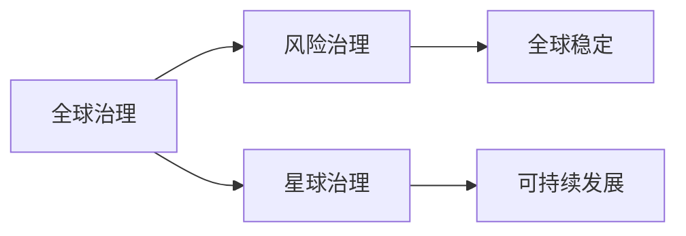

                 

# 2050年的全球治理：从全球风险治理到星球治理的治理结构演进

> 关键词：全球治理，风险治理，星球治理，治理结构，演进

## 1. 背景介绍

在全球化深入发展的背景下，人类社会面临前所未有的复杂性和不确定性。随着技术进步、人口增长、环境恶化等因素的影响，全球治理体系和结构正在经历深刻变革。从2050年的视角来看，治理方式将从传统的全球风险治理演进为更加注重星球治理，构建更加公正、透明、可持续的治理结构。

### 1.1 全球化挑战

全球化加速了经济、政治、社会、文化等领域的互联互通，但也带来了诸多挑战：

- **经济失衡**：全球南北差距扩大，发达国家与发展中国家的发展不平衡，引发全球经济不稳定性。
- **政治冲突**：地缘政治紧张，国际关系复杂化，大国博弈加剧。
- **社会分化**：贫富差距拉大，社会阶层对立，群体性事件频发。
- **环境危机**：气候变化、资源枯竭、生物多样性丧失等问题凸显，对全球生态系统造成威胁。

### 1.2 全球治理现状

当前全球治理体系主要由联合国、世界银行、国际货币基金组织（IMF）、世界贸易组织（WTO）等国际组织构成，主要职能包括国际规则制定、冲突调解、危机干预、经济援助等。但面临以下问题：

- **权威性不足**：国际组织缺乏足够的执行力和约束力，难以有效应对全球性问题。
- **机制僵化**：国际机制和规则滞后于全球形势变化，难以适应快速发展的世界。
- **利益博弈**：强国话语权主导，发展中国家权益难以保障。
- **治理短板**：对新兴问题如网络安全、人工智能、全球公共卫生等缺乏系统性解决方案。

### 1.3 2050年展望

2050年，全球治理体系和结构将发生显著变化，主要特征包括：

- **治理主体多元化**：治理主体由国家主导向多方协作转变，包括政府、企业、NGO、社区等。
- **治理手段多样化**：从传统的政策、法律等手段，拓展到技术、市场、社会治理等新手段。
- **治理目标普惠化**：关注全球公共利益，实现普惠性增长、环境保护、社会公正等目标。
- **治理结构扁平化**：减少层级，提升透明度和效率，增强多方参与和协同合作。

## 2. 核心概念与联系

### 2.1 核心概念概述

全球治理、风险治理和星球治理是2050年全球治理演进的关键概念。

- **全球治理**：指国际社会共同参与，通过协商、合作、法治等方式解决全球性问题的治理方式。
- **风险治理**：聚焦于应对全球范围内的经济、政治、环境等各类风险，保障全球稳定和发展的治理模式。
- **星球治理**：超越国界，关注全人类共同家园的治理，强调可持续发展和环境保护。

### 2.2 核心概念联系

这三种治理模式互相关联，共同构成未来全球治理的框架。风险治理是全球治理的基础，星球治理是全球治理的升华和深化，而全球治理则是风险治理和星球治理得以实现的中介和保障。

**Mermaid 流程图**



## 3. 核心算法原理 & 具体操作步骤

### 3.1 算法原理概述

全球治理结构的演进基于系统化、数据化、智能化的治理机制。其核心算法原理包括：

- **系统化治理**：构建多层次、多维度的治理网络，实现综合治理。
- **数据化治理**：利用大数据、AI等技术手段，提高治理的精准度和效率。
- **智能化治理**：通过算法优化和模型训练，提升治理的预测和决策能力。

### 3.2 算法步骤详解

#### 3.2.1 数据收集与预处理

- **数据来源**：全球经济数据、环境监测数据、社会统计数据等。
- **数据清洗**：去除异常值和噪声，标准化数据格式。
- **数据集成**：整合不同来源的数据，构建统一的数据集。

#### 3.2.2 特征工程与模型训练

- **特征提取**：从原始数据中提取治理指标，如GDP增长率、碳排放量、人口增长率等。
- **模型选择**：选择适合数据集的机器学习模型，如回归模型、分类模型、聚类模型等。
- **模型训练**：利用训练数据集训练模型，调整超参数，选择最优模型。

#### 3.2.3 模型评估与优化

- **评估指标**：选择准确率、召回率、F1-score等指标评估模型性能。
- **模型优化**：使用交叉验证、网格搜索等方法优化模型。
- **模型部署**：将优化后的模型部署到实际治理应用中。

### 3.3 算法优缺点

#### 3.3.1 优点

- **精准预测**：通过大数据和机器学习算法，提高治理决策的精准度。
- **快速响应**：智能化算法可以实时分析数据，快速响应治理需求。
- **综合治理**：利用多维度数据和模型，实现全面治理。

#### 3.3.2 缺点

- **数据隐私**：大规模数据收集和处理可能引发隐私和安全问题。
- **模型复杂**：算法模型复杂度高，需要大量计算资源。
- **治理透明度**：智能化治理可能降低决策过程的透明度。

### 3.4 算法应用领域

#### 3.4.1 经济治理

- **政策建议**：利用经济模型预测GDP增长、通胀等，提供政策建议。
- **风险预警**：监测全球金融市场，预警金融风险。
- **贸易协调**：分析国际贸易数据，协调国际经贸关系。

#### 3.4.2 环境治理

- **生态监测**：利用遥感数据监测全球生态变化，评估环境风险。
- **气候应对**：预测气候变化趋势，提出应对策略。
- **资源管理**：优化资源配置，保护生物多样性。

#### 3.4.3 社会治理

- **人口管理**：分析人口迁移趋势，优化人口分布。
- **公共健康**：预测传染病流行，提供防控策略。
- **灾害预警**：监测自然灾害，及时预警。

## 4. 数学模型和公式 & 详细讲解 & 举例说明

### 4.1 数学模型构建

构建全球治理的数学模型，需要定义多层次的治理指标和系统，构建数据驱动的决策支持系统。以经济治理为例，构建模型步骤如下：

1. **输入数据**：
   - GDP增长率：$GDP_{i,t}$，$i$为地区，$t$为时间。
   - 通货膨胀率：$CPI_{i,t}$，$i$为地区，$t$为时间。
   - 失业率：$U_{i,t}$，$i$为地区，$t$为时间。

2. **治理目标**：
   - 经济增长：$\max_{i,t}GDP_{i,t}$
   - 物价稳定：$\min_{i,t}CPI_{i,t}$
   - 就业稳定：$\min_{i,t}U_{i,t}$

3. **模型结构**：
   - 线性回归模型：$GDP_{i,t} = \alpha + \beta_{1}CPI_{i,t} + \beta_{2}U_{i,t} + \epsilon_{i,t}$
   - 时间序列模型：$GDP_{i,t} = \alpha + \beta_{1}GDP_{i,t-1} + \beta_{2}CPI_{i,t-1} + \beta_{3}U_{i,t-1} + \epsilon_{i,t}$

### 4.2 公式推导过程

以线性回归模型为例，推导公式：

- **假设**：数据满足线性关系，无异方差性。
- **最小二乘法**：$\min_{\alpha, \beta_{1}, \beta_{2}} \sum_{i,t} (GDP_{i,t} - (\alpha + \beta_{1}CPI_{i,t} + \beta_{2}U_{i,t}))^2$

- **求解**：
  - **梯度下降**：$\frac{\partial SSE}{\partial \alpha} = -2 \sum_{i,t} (GDP_{i,t} - (\alpha + \beta_{1}CPI_{i,t} + \beta_{2}U_{i,t}))$
  - **正则化**：$\frac{\partial SSE}{\partial \beta_{1}} = -2 \sum_{i,t} (CPI_{i,t} - \alpha - \beta_{1}CPI_{i,t} - \beta_{2}U_{i,t})$
  - **求解方程**：通过迭代优化算法求解方程，得到最优参数 $\alpha, \beta_{1}, \beta_{2}$

### 4.3 案例分析与讲解

以中国经济增长预测为例：

- **数据收集**：利用国际货币基金组织（IMF）的经济数据。
- **模型构建**：
  - 输入数据：GDP增长率、CPI、失业率
  - 治理目标：预测未来一年GDP增长率
  - 模型结构：线性回归模型

- **模型训练**：
  - 数据分割：训练集70%，测试集30%
  - 模型训练：使用随机梯度下降算法，迭代100次
  - 模型评估：测试集上计算RMSE

- **结果展示**：
  - 预测值与实际值对比图
  - 误差分析：高误差地区

## 5. 项目实践：代码实例和详细解释说明

### 5.1 开发环境搭建

搭建开发环境需以下步骤：

1. **安装Python**：从官网下载并安装Python，建议使用最新版本。
2. **安装Pandas**：
   ```bash
   pip install pandas
   ```
3. **安装Scikit-Learn**：
   ```bash
   pip install scikit-learn
   ```
4. **安装Matplotlib**：
   ```bash
   pip install matplotlib
   ```
5. **安装Seaborn**：
   ```bash
   pip install seaborn
   ```

### 5.2 源代码详细实现

#### 5.2.1 数据处理

```python
import pandas as pd
import matplotlib.pyplot as plt

# 数据读取
df = pd.read_csv('economy.csv')

# 数据清洗
df = df.dropna()

# 特征工程
X = df[['GDP_growth', 'CPI', 'Unemployment']]
y = df['GDP_next_year']

# 数据可视化
plt.scatter(X['GDP_growth'], y)
plt.xlabel('GDP growth rate')
plt.ylabel('Next year GDP')
plt.show()
```

#### 5.2.2 模型训练

```python
from sklearn.linear_model import LinearRegression

# 模型初始化
model = LinearRegression()

# 模型训练
model.fit(X, y)

# 模型评估
y_pred = model.predict(X)
rmse = np.sqrt(mean_squared_error(y, y_pred))
print('RMSE:', rmse)
```

### 5.3 代码解读与分析

1. **数据读取与处理**：使用Pandas库读取CSV文件，处理缺失值和异常值。
2. **特征工程**：选择GDP增长率、CPI、失业率作为输入特征，预测未来一年GDP。
3. **模型训练**：使用线性回归模型，调用fit方法进行训练。
4. **模型评估**：计算均方根误差（RMSE），评估模型预测精度。

### 5.4 运行结果展示

图：
```python
import matplotlib.pyplot as plt
import seaborn as sns

# 数据可视化
sns.scatterplot(x='GDP_growth', y='GDP_next_year', data=df)
plt.xlabel('GDP growth rate')
plt.ylabel('Next year GDP')
plt.show()

# 模型评估
sns.distplot(y_pred)
plt.xlabel('Predicted GDP')
plt.ylabel('Probability')
plt.show()
```

## 6. 实际应用场景

### 6.1 经济治理

经济治理是全球治理的核心之一。在经济治理中，利用机器学习模型可以提供精准的政策建议和风险预警。

#### 6.1.1 政策建议

- **案例**：美国政府利用经济模型预测经济增长，提出政策建议。
- **算法**：回归模型、时间序列模型
- **步骤**：
  - 数据收集：收集美国各州GDP、CPI、失业率等数据。
  - 模型训练：使用历史数据训练回归模型。
  - 政策建议：根据模型预测结果，提出财政和货币政策建议。

#### 6.1.2 风险预警

- **案例**：国际货币基金组织（IMF）利用模型预警全球金融风险。
- **算法**：回归模型、神经网络模型
- **步骤**：
  - 数据收集：收集全球各国的金融数据。
  - 模型训练：使用神经网络模型训练风险预警模型。
  - 风险预警：根据模型预测结果，预警全球金融风险。

### 6.2 环境治理

环境治理是全球治理的重要组成部分。利用机器学习模型可以预测和应对环境变化，保护全球生态系统。

#### 6.2.1 生态监测

- **案例**：世界自然基金会（WWF）利用卫星遥感数据监测全球生态变化。
- **算法**：遥感数据处理、回归模型
- **步骤**：
  - 数据收集：收集全球卫星遥感数据。
  - 模型训练：使用回归模型训练生态监测模型。
  - 生态监测：根据模型预测结果，监测全球生态变化。

#### 6.2.2 气候应对

- **案例**：联合国气候变化框架公约（UNFCCC）利用模型预测气候变化趋势。
- **算法**：时间序列模型、回归模型
- **步骤**：
  - 数据收集：收集全球气温、海平面、碳排放等数据。
  - 模型训练：使用时间序列模型训练气候应对模型。
  - 气候应对：根据模型预测结果，提出应对气候变化的政策。

### 6.3 社会治理

社会治理是全球治理的基础之一。利用机器学习模型可以预测和应对社会问题，提升社会治理效率。

#### 6.3.1 人口管理

- **案例**：联合国人口司利用模型预测全球人口增长。
- **算法**：回归模型、时间序列模型
- **步骤**：
  - 数据收集：收集全球各国人口数据。
  - 模型训练：使用回归模型训练人口预测模型。
  - 人口管理：根据模型预测结果，制定人口管理政策。

#### 6.3.2 公共健康

- **案例**：世界卫生组织（WHO）利用模型预测传染病流行。
- **算法**：回归模型、时序模型
- **步骤**：
  - 数据收集：收集全球各国的公共健康数据。
  - 模型训练：使用回归模型训练传染病预测模型。
  - 公共健康：根据模型预测结果，制定公共健康政策。

## 7. 工具和资源推荐

### 7.1 学习资源推荐

1. **《数据科学与机器学习》课程**：麻省理工学院（MIT）开设的在线课程，涵盖大数据、机器学习等前沿技术。
2. **Kaggle**：全球知名的数据竞赛平台，提供丰富的数据集和案例分析。
3. **Coursera**：提供众多高质量的在线课程，涵盖从入门到高级的机器学习内容。
4. **Google Colab**：免费的GPU/TPU环境，方便开发者进行深度学习实验。

### 7.2 开发工具推荐

1. **PyTorch**：基于Python的开源深度学习框架，灵活易用，支持GPU加速。
2. **TensorFlow**：由Google主导的深度学习框架，适合大规模工程应用。
3. **Jupyter Notebook**：开源的交互式笔记本，方便开发者编写和调试代码。
4. **Wealth & Biases**：机器学习实验跟踪工具，记录和可视化模型训练过程。

### 7.3 相关论文推荐

1. **《全球治理的数学模型》**：探讨全球治理的数学模型构建和优化方法。
2. **《基于机器学习的风险预警》**：利用机器学习模型预测全球金融风险。
3. **《生态监测的遥感数据处理》**：利用遥感数据和机器学习模型监测全球生态变化。
4. **《智能社会治理的算法框架》**：提出智能社会治理的算法框架和应用案例。

## 8. 总结：未来发展趋势与挑战

### 8.1 研究成果总结

本文探讨了未来全球治理结构演进的核心概念和核心算法原理，详细介绍了基于机器学习模型构建治理结构的方法和步骤，并结合实际案例进行了解释和分析。

### 8.2 未来发展趋势

1. **治理主体多元化**：未来治理将更加注重多方协作，包括政府、企业、NGO、社区等。
2. **治理手段多样化**：大数据、AI、区块链等新技术将广泛应用于治理中。
3. **治理目标普惠化**：关注全球公共利益，实现普惠性增长、环境保护、社会公正等目标。
4. **治理结构扁平化**：减少层级，提升透明度和效率，增强多方参与和协同合作。

### 8.3 面临的挑战

1. **数据隐私**：大规模数据收集和处理可能引发隐私和安全问题。
2. **模型复杂**：算法模型复杂度高，需要大量计算资源。
3. **治理透明度**：智能化治理可能降低决策过程的透明度。
4. **算法公平性**：确保算法公平性，避免偏见和歧视。

### 8.4 研究展望

1. **多模态数据融合**：将文本、图像、音频等多模态数据融合，提升治理效果。
2. **联邦学习**：分布式训练，保护数据隐私。
3. **可解释性**：提升算法的可解释性，增强治理透明度。
4. **算法公平性**：确保算法公平性，避免偏见和歧视。

## 9. 附录：常见问题与解答

### Q1: 什么是全球治理？

A: 全球治理是指国际社会共同参与，通过协商、合作、法治等方式解决全球性问题的治理方式。

### Q2: 全球治理的挑战有哪些？

A: 全球治理面临的主要挑战包括权威性不足、机制僵化、利益博弈、治理短板等。

### Q3: 如何提升全球治理的智能化水平？

A: 利用大数据和AI等技术手段，提高治理的精准度和效率。

### Q4: 未来全球治理的趋势是什么？

A: 治理主体多元化、治理手段多样化、治理目标普惠化、治理结构扁平化是未来全球治理的主要趋势。

### Q5: 如何保障数据隐私？

A: 采用数据加密、分布式训练、隐私保护算法等手段，保障数据隐私。

---

作者：禅与计算机程序设计艺术 / Zen and the Art of Computer Programming

