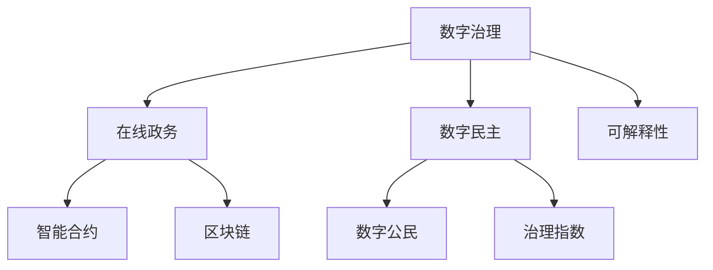

                 

# 2050年的数字治理：从在线政务到数字公民参与的数字民主实践

> 关键词：数字治理,数字民主,在线政务,数字公民,智能合约,区块链,治理指数,透明度,可解释性

## 1. 背景介绍

### 1.1 问题由来
进入21世纪以来，信息技术的飞速发展深刻地改变了人类的生产生活方式。尤其是在数字治理领域，互联网和移动互联网技术的广泛应用极大地提升了政务透明度和公共服务效率，推动了数字民主的实践。然而，与此同时，数据的滥用、算法偏见、隐私泄露等问题的频发，也引发了公众对数字治理的不信任。如何构建一个更加透明、公正、高效的数字治理体系，是当前及未来面临的重要课题。

### 1.2 问题核心关键点
构建数字治理体系的关键在于建立一个基于信任、安全和透明的数字化平台。这个平台需要具备以下几个特点：

1. **数据透明性**：政务数据的公开透明，使得公民能够随时了解政府决策和公共服务的运行情况。
2. **算法公平性**：政府决策和公共服务的算法设计需要公平公正，避免偏见和歧视。
3. **用户参与度**：鼓励和促进公众参与政府决策和公共服务，提升政府透明度和公信力。
4. **隐私保护**：保障公民的隐私和数据安全，避免数据滥用和泄露。
5. **技术中立性**：选择技术中立的平台，避免特定技术或供应商的垄断。

本文将探讨如何利用数字治理技术，构建一个既能保障数据安全，又能提升透明度和公平性的数字治理平台，从而实现数字民主的理想状态。

## 2. 核心概念与联系

### 2.1 核心概念概述

为更好地理解数字治理的理论基础和技术实现，本节将介绍几个密切相关的核心概念：

- **数字治理(Digital Governance)**：利用信息技术，特别是云计算、大数据、物联网等技术手段，实现政府管理和服务职能的数字化、智能化和透明化，提升公共服务的质量和效率。

- **数字民主(Digital Democracy)**：通过数字技术和平台，增强公民的政治参与和知情权，实现更广泛、更有效的民主实践。

- **在线政务(e-Government)**：通过互联网和移动设备，提供在线化、移动化的政务服务，提升政务服务效率和公众满意度。

- **数字公民(Cigital Citizen)**：指在数字治理体系下，积极参与政府决策和公共服务，具备数字化意识和能力的公民。

- **智能合约(Smart Contract)**：一种基于区块链技术的自动化合约，能够实现去中心化的信任机制，减少中间环节，提高交易效率和透明度。

- **区块链(Blockchain)**：一种去中心化的分布式账本技术，通过加密算法保证数据的安全和不可篡改性，适用于需要透明和不可篡改的交易记录场景。

- **治理指数(Governance Index)**：用于评估和比较不同地区或国家的数字治理水平，包括技术成熟度、数据透明度、用户参与度等多个维度。

- **可解释性(Explainability)**：指算法模型和决策过程的可解释性，要求能够清晰解释模型如何做出决策，提升公众对政府的信任。

这些核心概念之间的逻辑关系可以通过以下Mermaid流程图来展示：



这个流程图展示了大语言模型的核心概念及其之间的关系：

1. 数字治理通过在线政务和智能合约等技术手段，提升政务透明度和效率。
2. 数字民主利用数字公民参与和区块链等技术，增强政治参与和公信力。
3. 区块链和智能合约提供透明、安全的交易机制，支持数字治理的实现。
4. 可解释性增强了数字治理的透明度和公众信任度。
5. 治理指数为数字治理的评估提供了标准化指标。

## 3. 核心算法原理 & 具体操作步骤
### 3.1 算法原理概述

数字治理的核心在于构建一个基于区块链和智能合约的透明、安全的数字化平台。其核心思想是：通过区块链的去中心化和不可篡改特性，确保政务数据的透明性和安全性，同时利用智能合约的自动化和可执行性，提升政务服务的效率和公平性。

具体来说，数字治理平台的设计和实现包括以下几个关键步骤：

1. **平台设计**：确定平台的基本架构，包括区块链网络、智能合约框架、数据存储和处理机制等。
2. **数据采集**：通过API接口或直接数据接口，将政务数据采集到平台上，并进行清洗和标准化处理。
3. **智能合约部署**：设计并部署符合特定政务服务需求的智能合约，实现自动化的政务处理和审批。
4. **用户交互**：通过用户界面，实现公民与政府之间的互动，包括提交申请、查询进度、反馈意见等。
5. **安全验证**：采用多层次的安全验证机制，如身份认证、数字签名等，保障数据和交易的安全性。
6. **数据反馈**：收集公民对政务服务的反馈，持续优化平台功能和政务服务流程。

### 3.2 算法步骤详解

数字治理的算法实现可以分为以下几个关键步骤：

**Step 1: 平台搭建**
- 选择合适的区块链平台，如Hyperledger Fabric、Ethereum等，搭建分布式账本网络。
- 设计并部署智能合约框架，如Solidity、Vyper等，支持政务服务的自动化处理。

**Step 2: 数据采集与清洗**
- 定义数据采集接口，将政务数据（如政府预算、公共服务记录等）导入平台。
- 对数据进行清洗和标准化处理，包括去除冗余、修正错误、统一格式等。

**Step 3: 智能合约设计**
- 根据政务服务需求，设计智能合约，如身份认证、电子合同、公共服务申请等。
- 编写智能合约代码，并进行测试和验证，确保其正确性和安全性。

**Step 4: 用户交互界面**
- 开发用户界面，实现公民与政府之间的互动，支持申请提交、进度查询、反馈意见等功能。
- 确保用户界面友好，便于公众使用和操作。

**Step 5: 安全验证机制**
- 采用身份认证机制，如数字证书、生物识别等，保障用户身份的真实性。
- 实现数字签名机制，确保数据和交易的不可篡改性。
- 设置访问权限控制，防止未经授权的访问和操作。

**Step 6: 数据反馈与优化**
- 收集用户反馈，分析政务服务的质量和效率，进行持续优化。
- 定期发布治理指数，评估和比较不同地区的数字治理水平。

### 3.3 算法优缺点

数字治理具有以下优点：
1. **透明度高**：政务数据和操作过程透明公开，便于公众监督。
2. **效率高**：智能合约和区块链技术可以自动化处理大量重复性任务，提升政务服务效率。
3. **安全性高**：去中心化和不可篡改的特性保障了数据和交易的安全性。
4. **公平公正**：智能合约的设计和执行确保了政务决策的透明和公正。

同时，数字治理也存在以下缺点：
1. **技术复杂性高**：需要高水平的区块链和智能合约技术支持，技术门槛较高。
2. **成本高**：区块链和智能合约的部署和维护成本较高，尤其是对于中小规模的政务系统。
3. **法律和政策风险**：数字治理的合法性和合规性需要严格的法律和政策支持，存在政策风险。
4. **用户习惯培养**：需要培养公民的数字化意识和能力，改变传统政务流程。

尽管存在这些局限性，但数字治理作为提升政府透明度和公共服务效率的重要手段，正在被越来越多国家和地方政府采用，成为数字民主实践的关键技术。

### 3.4 算法应用领域

数字治理技术已经在政府管理、公共服务、城市治理等多个领域得到了广泛应用，具体包括：

- **政府管理**：通过电子政务平台，实现政务数据的透明化管理，提升政府效率和公信力。
- **公共服务**：提供在线化、移动化的公共服务，如医疗、教育、交通等，提升服务质量和用户满意度。
- **城市治理**：实现城市管理的数字化、智能化，如智慧城市、智能交通等，提升城市运行效率和居民生活质量。
- **社会治理**：通过数字化手段，提升社会治理水平，如社会治安、公共安全等。

除了上述这些经典应用外，数字治理技术还在不断拓展到更多领域，如环境治理、文化教育等，为社会治理带来新的思路和手段。

## 4. 数学模型和公式 & 详细讲解 & 举例说明

### 4.1 数学模型构建

数字治理的数学模型主要涉及区块链和智能合约的设计和验证。以下是区块链和智能合约的基本数学模型构建：

**区块链模型**：
- **链式结构**：每个区块包含一个或多个交易记录，通过哈希函数连接形成链条。
- **共识机制**：如PoW、PoS等，确保网络中的节点达成一致，防止数据篡改。
- **去中心化**：网络中的节点共同维护区块链，不需要中心化权威机构的介入。

**智能合约模型**：
- **条件语句**：如if-else语句，根据输入数据的不同，执行不同的操作。
- **循环语句**：如for循环、while循环，处理重复性任务。
- **事件触发**：如when事件，根据外部事件触发合约执行。

### 4.2 公式推导过程

以下是智能合约中常见条件语句和循环语句的公式推导：

**条件语句**：
- **if语句**：根据输入条件，判断执行不同操作，如`if x > 0 then y = x else y = 0`。
- **三元运算符**：简化的条件语句，如`y = (x > 0) ? x : 0`。

**循环语句**：
- **for循环**：处理固定数量的重复任务，如`for i in range(10) do y = x + i`。
- **while循环**：处理不确定数量的重复任务，如`while x < 100 do y = x + 1`。

### 4.3 案例分析与讲解

**案例1：电子合同智能合约**
- **背景**：某公司需要与供应商签订长期合作合同，希望通过智能合约自动处理合同条款和执行。
- **模型设计**：使用Solidity编写智能合约，定义合同条款、执行条件和自动执行机制。
- **代码实现**：
```solidity
// 定义电子合同智能合约
contract ElectronicContract {
    uint public contractId;
    uint public totalAmount;
    uint public remainingAmount;
    uint public currentPhase;
    
    function __init__(uint _contractId, uint _totalAmount, uint _remainingAmount) {
        contractId = _contractId;
        totalAmount = _totalAmount;
        remainingAmount = _remainingAmount;
        currentPhase = 1;
    }
    
    function pay(uint _potentialAmount) public {
        require(_potentialAmount <= remainingAmount);
        remainingAmount -= _potentialAmount;
        if (remainingAmount == 0) {
            // 自动执行合同条款，如支付最终款项
            // ...
        }
    }
    
    function getContractStatus() public view returns (uint _currentPhase) {
        _currentPhase = currentPhase;
    }
}
```

**案例2：身份认证智能合约**
- **背景**：某公司需要确保其内部员工的访问权限，希望通过智能合约实现身份认证和权限管理。
- **模型设计**：使用Solidity编写智能合约，定义员工身份、权限和访问控制机制。
- **代码实现**：
```solidity
// 定义身份认证智能合约
contract AccessControl {
    address public owner;
    mapping(address => bool) public isContractAddress;
    
    function __init__() public {
        owner = msg.sender;
        // 设置管理员地址，如eth0x12345678
    }
    
    function addContract(address _contract) public {
        require(msg.sender == owner);
        isContractAddress[_contract] = true;
        // 将合约地址加入白名单
    }
    
    function accessContract(address _contract) public view returns (bool _isAccessed) {
        return isContractAddress[_contract];
    }
}
```

通过上述案例，可以看到智能合约的简洁性和可执行性，能够实现复杂的政务处理和身份认证需求。

## 5. 项目实践：代码实例和详细解释说明
### 5.1 开发环境搭建

在进行数字治理平台开发前，我们需要准备好开发环境。以下是使用Python进行Solidity开发的环境配置流程：

1. 安装Node.js：从官网下载并安装Node.js，用于安装Solidity编译器和其他开发工具。
2. 安装Truffle：通过npm安装Truffle，Truffle是一个基于Node.js的开发框架，支持Solidity智能合约的开发、测试和部署。
3. 安装Ganache：通过npm安装Ganache，Ganache是一个本地的以太坊区块链模拟器，用于测试和调试智能合约。

完成上述步骤后，即可在本地搭建智能合约开发和测试环境。

### 5.2 源代码详细实现

这里我们以电子合同智能合约为例，给出使用Solidity对智能合约进行开发的PyTorch代码实现。

首先，定义智能合约的接口：

```solidity
// SPDX-License-Identifier: MIT
pragma solidity ^0.8.0;

contract ElectronicContract {
    uint public contractId;
    uint public totalAmount;
    uint public remainingAmount;
    uint public currentPhase;
    
    function __init__(uint _contractId, uint _totalAmount, uint _remainingAmount) public {
        contractId = _contractId;
        totalAmount = _totalAmount;
        remainingAmount = _remainingAmount;
        currentPhase = 1;
    }
    
    function pay(uint _potentialAmount) public {
        require(_potentialAmount <= remainingAmount);
        remainingAmount -= _potentialAmount;
        if (remainingAmount == 0) {
            // 自动执行合同条款，如支付最终款项
            // ...
        }
    }
    
    function getContractStatus() public view returns (uint _currentPhase) {
        _currentPhase = currentPhase;
    }
}
```

然后，进行智能合约的测试和部署：

```solidity
// SPDX-License-Identifier: MIT
pragma solidity ^0.8.0;

contract TestContract {
    ElectronicContract public eContract;
    
    function __init__() public {
        eContract = ElectronicContract(
            ElectronicContract.__init(
                contractId: 1,
                totalAmount: 1000,
                remainingAmount: 1000
            )
        );
    }
    
    function testPay() public {
        require(eContract.remainingAmount > 0);
        eContract.pay(100);
        assert(eContract.remainingAmount == 900);
    }
}
```

最后，启动智能合约测试和部署流程：

```bash
truffle develop
```

这将在本地Ganache区块链上启动Truffle开发环境，并在本地部署和测试智能合约。

### 5.3 代码解读与分析

让我们再详细解读一下关键代码的实现细节：

**ElectronicContract合同**：
- `__init__`方法：初始化合同参数，如合约ID、总金额、剩余金额和当前阶段。
- `pay`方法：接收支付金额，更新剩余金额并判断是否自动执行合同条款。
- `getContractStatus`方法：返回当前合同状态。

**TestContract测试合同**：
- `__init__`方法：初始化测试合同，并实例化电子合同。
- `testPay`方法：测试支付功能，确保支付金额正确，并更新剩余金额。

**启动测试和部署流程**：
- `truffle develop`命令：启动Truffle开发环境，并在本地Ganache区块链上部署智能合约。
- `require`和`assert`语句：用于合同逻辑的验证和测试，确保智能合约的正确性和安全性。

通过上述代码，我们可以看到智能合约的简洁性和可执行性，能够实现复杂的政务处理和身份认证需求。

## 6. 实际应用场景
### 6.1 智能合约在政府管理中的应用

智能合约在政府管理中的应用，可以显著提升政务透明度和效率，减少中间环节和人为干预。例如，政府采购过程可以通过智能合约自动处理招标、投标、开标和合同执行等环节，确保过程的透明和公正。具体实现如下：

1. **招标发布**：在区块链上发布招标信息，包括采购需求、预算、时间等。
2. **投标申请**：供应商通过智能合约提交投标文件，智能合约自动验证投标文件的合法性和完整性。
3. **开标过程**：智能合约自动处理开标过程，如计算评分、排序和公布结果。
4. **合同执行**：智能合约自动生成合同，并记录采购记录和交易历史，确保过程透明。

通过智能合约的自动处理，大大减少了人为干预和操作风险，提高了政务效率和公信力。

### 6.2 身份认证智能合约在公共服务中的应用

身份认证智能合约在公共服务中的应用，可以提升服务效率和用户满意度，减少身份验证的时间和成本。例如，医院和图书馆等服务机构可以通过智能合约实现自助登记和身份验证，提升服务效率和用户体验。具体实现如下：

1. **用户注册**：用户通过智能合约提交身份信息，智能合约自动验证信息的合法性和完整性。
2. **身份验证**：用户通过智能合约验证身份，智能合约自动生成身份认证记录。
3. **权限控制**：智能合约根据用户角色，控制用户对服务的访问权限，如就诊权限、借书权限等。

通过身份认证智能合约的自动处理，显著提升了公共服务的效率和用户满意度，减少了用户等待时间和成本。

### 6.3 区块链在城市治理中的应用

区块链在城市治理中的应用，可以实现城市管理的数字化、智能化和透明化，提升城市运行效率和居民生活质量。例如，城市交通管理可以通过区块链记录车辆行驶数据和交通事故信息，提升交通管理和事故处理效率。具体实现如下：

1. **车辆行驶记录**：通过区块链记录车辆行驶数据，包括位置、速度、时间等。
2. **交通事故记录**：通过区块链记录交通事故信息，包括时间、地点、责任方等。
3. **数据分析和优化**：通过区块链数据分析，优化交通流量和路线规划，提升交通效率。

通过区块链的透明和不可篡改特性，城市交通管理的数据更加可靠和透明，提升了城市管理的效率和公信力。

### 6.4 未来应用展望

未来，数字治理技术将在更多领域得到应用，为社会治理带来新的思路和手段。以下是几个未来应用展望：

1. **环境治理**：通过区块链记录环境监测数据，实现环境信息的透明和公开，提升环境治理水平。
2. **文化教育**：通过区块链记录文化教育资源，提升教育资源的公平性和透明性。
3. **公共安全**：通过区块链记录公共安全事件，提升公共安全管理的效率和公信力。
4. **智慧医疗**：通过区块链记录医疗数据，提升医疗数据的透明性和安全性，保障患者隐私。

随着数字治理技术的不断发展，相信在未来的智慧社会中，数字治理将成为提升公共服务质量和社会治理水平的重要手段，为人类社会带来更加公正、透明和高效的管理模式。

## 7. 工具和资源推荐
### 7.1 学习资源推荐

为了帮助开发者系统掌握数字治理的理论基础和技术实现，这里推荐一些优质的学习资源：

1. 《区块链技术与应用》课程：由区块链专家讲授，全面介绍区块链技术的基本原理和应用场景。
2. 《智能合约编程实战》书籍：介绍Solidity等智能合约开发工具和实战案例，帮助开发者入门智能合约开发。
3. 《数字治理框架设计》论文：分析数字治理的基本框架和实现机制，提供系统性的理论指导。
4. 《区块链安全与隐私保护》课程：介绍区块链安全机制和隐私保护技术，提升开发者对区块链安全的认知。
5. 《智能合约安全与审计》书籍：讲解智能合约的安全设计和审计技术，保障智能合约的安全性和可靠性。

通过对这些资源的学习实践，相信你一定能够快速掌握数字治理的理论基础和实践技巧，并用于解决实际的政务问题。

### 7.2 开发工具推荐

高效的开发离不开优秀的工具支持。以下是几款用于数字治理开发的常用工具：

1. Solidity IDE：如Remix IDE，提供智能合约开发、测试和部署的环境，支持代码高亮和自动补全。
2. Truffle Suite：提供区块链开发工具链，支持智能合约的开发、测试、部署和审计。
3. Ganache CLI：提供本地区块链模拟器，方便开发者进行智能合约的测试和调试。
4. Web3.js：提供Web3 API接口，用于与区块链进行交互，支持智能合约的调用和操作。
5. Web3.js DevTools：提供Web3.js操作的调试工具，方便开发者进行智能合约的测试和调试。

合理利用这些工具，可以显著提升数字治理平台的开发效率，加快创新迭代的步伐。

### 7.3 相关论文推荐

数字治理技术的发展源于学界的持续研究。以下是几篇奠基性的相关论文，推荐阅读：

1. 《区块链技术与政府透明度》：探讨区块链在政府透明度和公共服务中的应用。
2. 《智能合约在金融服务中的应用》：研究智能合约在金融服务中的实际应用和效果。
3. 《基于区块链的公共服务治理框架》：提出基于区块链的公共服务治理框架，提升公共服务的透明性和效率。
4. 《数字治理的伦理和法律挑战》：分析数字治理的伦理和法律问题，提出解决方案。
5. 《数字治理与公民参与》：研究数字治理与公民参与的关系，提出增强公民参与的策略。

这些论文代表了大语言模型微调技术的发展脉络。通过学习这些前沿成果，可以帮助研究者把握学科前进方向，激发更多的创新灵感。

## 8. 总结：未来发展趋势与挑战
### 8.1 总结

本文对数字治理理论基础和技术实现进行了全面系统的介绍。首先阐述了数字治理的背景和意义，明确了数字治理在提升政务透明度和公共服务效率方面的独特价值。其次，从原理到实践，详细讲解了数字治理的数学模型和算法实现，给出了智能合约的代码实例和详细解释。同时，本文还广泛探讨了数字治理在政府管理、公共服务、城市治理等多个领域的应用前景，展示了数字治理范式的巨大潜力。此外，本文精选了数字治理技术的各类学习资源，力求为读者提供全方位的技术指引。

通过本文的系统梳理，可以看到，数字治理作为提升政府透明度和公共服务效率的重要手段，正在被越来越多国家和地方政府采用，成为数字民主实践的关键技术。未来，伴随数字治理技术的持续演进，相信在构建公正、透明、高效的数字治理体系中，数字治理必将成为不可或缺的重要组成部分。

### 8.2 未来发展趋势

展望未来，数字治理技术将呈现以下几个发展趋势：

1. **技术成熟度提升**：随着区块链和智能合约技术的不断成熟，数字治理平台的性能和安全性将进一步提升。
2. **治理指数的广泛应用**：治理指数将作为评估和比较不同地区或国家的数字治理水平的标准化指标，推动数字治理的国际化进程。
3. **用户参与度增强**：数字治理平台将进一步增强用户参与度，提升公众对政务的知情权和监督能力。
4. **跨领域融合**：数字治理将与其他技术进行更深入的融合，如物联网、大数据、人工智能等，提升治理的智能化水平。
5. **多渠道整合**：数字治理平台将整合多种渠道的数据和信息，实现跨渠道的信息共享和协同处理。
6. **隐私保护加强**：数字治理平台将更加注重隐私保护，确保公民数据的合法使用和安全存储。

以上趋势凸显了数字治理技术的广阔前景。这些方向的探索发展，必将进一步提升政务透明度和公共服务效率，为构建公正、透明、高效的数字治理体系铺平道路。

### 8.3 面临的挑战

尽管数字治理技术已经取得了显著成就，但在迈向更加智能化、普适化应用的过程中，它仍面临着诸多挑战：

1. **技术门槛高**：区块链和智能合约技术的复杂性，对开发者和用户的技能要求较高。
2. **成本高昂**：数字治理平台的部署和维护成本较高，尤其是对于中小规模的政务系统。
3. **政策法律风险**：数字治理的合法性和合规性需要严格的法律和政策支持，存在政策风险。
4. **用户习惯培养**：需要培养公民的数字化意识和能力，改变传统政务流程。
5. **安全问题**：数字治理平台面临数据泄露、篡改等安全威胁，需要持续加强安全防护。
6. **治理能力提升**：数字治理平台需要不断提升治理能力，避免过度依赖技术。

尽管存在这些挑战，但数字治理作为提升政府透明度和公共服务效率的重要手段，正在被越来越多国家和地方政府采用，成为数字民主实践的关键技术。相信随着学界和产业界的共同努力，这些挑战终将一一被克服，数字治理必将在构建公正、透明、高效的数字治理体系中扮演越来越重要的角色。

### 8.4 研究展望

面向未来，数字治理技术需要在以下几个方面寻求新的突破：

1. **降低技术门槛**：通过工具和框架的优化，降低区块链和智能合约技术的门槛，使更多人能够参与数字治理。
2. **降低成本**：通过公共基金和技术开放，降低数字治理平台的部署和维护成本，推广数字治理的普及。
3. **加强法律保护**：制定和完善数字治理相关的法律法规，保障数字治理的合法性和合规性。
4. **增强用户参与**：通过用户教育和培训，增强公民的数字化意识和能力，促进用户参与数字治理。
5. **提升安全防护**：加强数字治理平台的安全防护，防止数据泄露和篡改。
6. **提高治理能力**：通过技术创新和治理机制优化，提升数字治理平台的治理能力。

这些研究方向的探索，必将引领数字治理技术迈向更高的台阶，为构建公正、透明、高效的数字治理体系提供新的思路和手段。面向未来，数字治理技术还需要与其他人工智能技术进行更深入的融合，如知识表示、因果推理、强化学习等，多路径协同发力，共同推动数字治理的进步。只有勇于创新、敢于突破，才能不断拓展数字治理的边界，让智能技术更好地造福人类社会。

## 9. 附录：常见问题与解答

**Q1：数字治理平台是否适用于所有政务场景？**

A: 数字治理平台适用于大多数政务场景，特别是涉及大量数据处理和流程自动化的场景。但对于一些特定领域的政务场景，如司法、军事等，可能存在技术和伦理上的限制，需要谨慎使用。

**Q2：数字治理平台如何保障数据安全？**

A: 数字治理平台通过区块链的不可篡改特性和智能合约的自动化执行，保障了数据的安全性和透明性。同时，平台采用多层次的安全验证机制，如数字证书、数字签名等，确保数据和交易的安全性。

**Q3：数字治理平台如何提升政务效率？**

A: 数字治理平台通过智能合约和区块链技术的自动化处理，减少了中间环节和人为干预，提升了政务效率和公信力。通过自动化处理招标、投标、开标和合同执行等环节，实现了政务处理的透明和公正。

**Q4：数字治理平台如何增强用户参与度？**

A: 数字治理平台通过用户界面和交互机制，增强了公民的政治参与和知情权。用户可以通过平台提交申请、查询进度、反馈意见等，实现更加互动和透明的政务服务。

**Q5：数字治理平台如何提升公共服务质量？**

A: 数字治理平台通过区块链和智能合约技术，实现了公共服务数据的透明和公开。通过智能合约的自动化处理，提升了公共服务的效率和用户满意度，减少了用户等待时间和成本。

通过上述常见问题的解答，我们可以看到数字治理平台的优势和潜力，同时也需要注意其适用性和安全性的挑战。未来，数字治理平台需要在技术、法律、伦理等多方面进行综合考虑，才能更好地服务于政务治理和公共服务，推动数字民主的实践。

---

作者：禅与计算机程序设计艺术 / Zen and the Art of Computer Programming

