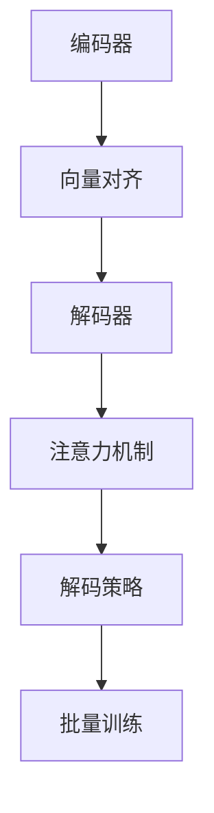

                 

## 1. 背景介绍

在自然语言处理领域，序列到序列(Sequence-to-Sequence, Seq2Seq)模型是一类常见的模型，被广泛应用于机器翻译、文本摘要、对话生成等任务。Seq2Seq模型通过编码器(Encoder)将输入序列(如一句话)转换为固定长度的向量表示，再由解码器(Decoder)解码生成目标序列(如另一句话)。其核心思想是对序列进行分步映射，具有较强的泛化能力，被广泛应用于序列生成任务。

### 1.1 问题由来

在深度学习时代，神经网络模型在图像识别、语音识别等领域取得了显著进展。然而，由于NLP任务的复杂性，传统的神经网络模型难以直接应用。此时，Seq2Seq模型应运而生，通过引入循环神经网络(RNN)、长短期记忆网络(LSTM)等架构，成功地解决了NLP任务的序列生成问题。

### 1.2 问题核心关键点

Seq2Seq模型的核心在于如何构建高效的编码器和解码器，将输入序列映射到目标序列。这其中涉及的算法和技术包括：

- 序列编码器设计：如何将输入序列转化为向量表示。
- 向量对齐机制：如何处理序列长度不一的问题。
- 解码器设计：如何从向量表示中解码生成目标序列。
- 训练策略：如何高效训练Seq2Seq模型。
- 解码策略：如何在生成序列时保证流畅性。

这些核心技术共同构成了Seq2Seq模型的体系框架，为其在实际应用中取得优异效果提供了坚实保障。

### 1.3 问题研究意义

研究Seq2Seq模型对于提升自然语言处理任务的自动化水平，降低人工参与度，具有重要意义：

- 降低任务开发成本。Seq2Seq模型可以通过迁移学习快速适应新任务，减少从头开发所需的时间和人力成本。
- 提升任务执行效率。Seq2Seq模型能够自动处理和生成文本，提高任务处理的效率和准确性。
- 促进任务应用创新。Seq2Seq模型为自然语言处理任务的自动化和智能化提供了新的可能，推动相关技术的快速发展和应用。
- 加速产业升级。Seq2Seq技术能够助力传统行业数字化转型，提升企业的智能化水平和服务质量。

## 2. 核心概念与联系

### 2.1 核心概念概述

为了更好地理解Seq2Seq模型的工作原理，本节将介绍几个密切相关的核心概念：

- 编码器(Encoder)：将输入序列映射为向量表示，常用的架构包括RNN、LSTM、GRU等。
- 向量对齐机制(Alignment)：处理序列长度不一的问题，常用的方法包括序列长度统一、长度归一化等。
- 解码器(Decoder)：从向量表示中生成目标序列，常用的架构包括RNN、LSTM、GRU等。
- 注意力机制(Attention)：用于增强解码器对输入序列重要部分的关注，提高生成序列的质量。
- 批量训练(Batch Training)：同时对多个输入序列进行训练，提升模型效率。
- 解码策略(Decoding Strategy)：在生成序列时使用的策略，常用的包括贪心搜索、束搜索等。

这些概念之间的逻辑关系可以通过以下Mermaid流程图来展示：



这个流程图展示了一个典型的Seq2Seq模型的结构框架，从编码器到解码器，从对齐机制到注意力，再到解码策略，每个环节都至关重要，共同决定了模型的最终效果。

## 3. 核心算法原理 & 具体操作步骤

### 3.1 算法原理概述

Seq2Seq模型主要由编码器、向量对齐、解码器和注意力机制组成。其核心算法原理是通过编码器将输入序列映射为固定长度的向量表示，再由解码器从向量表示中生成目标序列。

假设有输入序列 $x$ 和目标序列 $y$，编码器的输出表示为 $\boldsymbol{h}$，解码器的输出表示为 $\boldsymbol{z}$。编码器和解码器的映射关系分别为：

$$
\boldsymbol{h} = \text{Encoder}(x)
$$

$$
\boldsymbol{z} = \text{Decoder}(\boldsymbol{h})
$$

在向量对齐机制的作用下，编码器和解码器的序列长度保持一致。注意力机制用于在生成序列时，动态选择输入序列中重要部分的表示，提高生成序列的质量。

### 3.2 算法步骤详解

Seq2Seq模型的训练和推理过程主要分为以下几个步骤：

**Step 1: 准备训练数据集**

首先，需要准备一个由源语言句子 $x$ 和目标语言句子 $y$ 组成的训练数据集 $D$。通常将 $x$ 和 $y$ 按顺序排列，形成一个矩阵 $\{(x_i, y_i)\}_{i=1}^N$，其中 $N$ 为训练样本数量。

**Step 2: 搭建编码器和解码器**

根据任务需求，选择合适的RNN或LSTM等循环神经网络架构作为编码器和解码器。如使用LSTM编码器，定义模型如下：

```python
import torch.nn as nn

class Encoder(nn.Module):
    def __init__(self, input_size, hidden_size, num_layers):
        super(Encoder, self).__init__()
        self.hidden_size = hidden_size
        self.num_layers = num_layers
        self.lstm = nn.LSTM(input_size, hidden_size, num_layers, batch_first=True)
        
    def forward(self, input_seq):
        h0 = torch.zeros(self.num_layers, input_seq.size(0), self.hidden_size).to(device)
        c0 = torch.zeros(self.num_layers, input_seq.size(0), self.hidden_size).to(device)
        out, _ = self.lstm(input_seq, (h0, c0))
        return out[:, -1, :]
```

**Step 3: 训练编码器和解码器**

将训练数据集 $D$ 划分为训练集 $D_{train}$、验证集 $D_{val}$ 和测试集 $D_{test}$。定义损失函数和优化器，并开始模型训练：

```python
from torch.utils.data import DataLoader

class Seq2SeqModel(nn.Module):
    def __init__(self, encoder, decoder, attention):
        super(Seq2SeqModel, self).__init__()
        self.encoder = encoder
        self.decoder = decoder
        self.attention = attention
        
    def forward(self, input_seq, target_seq):
        # 对输入和目标序列进行编码
        h0 = torch.zeros(self.encoder.num_layers, input_seq.size(0), self.encoder.hidden_size).to(device)
        c0 = torch.zeros(self.encoder.num_layers, input_seq.size(0), self.encoder.hidden_size).to(device)
        encoder_out = self.encoder(input_seq, (h0, c0))
        
        # 对目标序列进行解码
        decoder_out = self.decoder(target_seq, encoder_out, (h0, c0))
        return decoder_out
```

**Step 4: 应用注意力机制**

在解码过程中，使用注意力机制来动态选择编码器输出中的重要部分，提高生成序列的质量：

```python
class Attention(nn.Module):
    def __init__(self, hidden_size):
        super(Attention, self).__init__()
        self.hidden_size = hidden_size
        self.W_q = nn.Linear(hidden_size, hidden_size)
        self.W_k = nn.Linear(hidden_size, hidden_size)
        self.W_v = nn.Linear(hidden_size, hidden_size)
        self.V = nn.Linear(hidden_size, 1)
        
    def forward(self, encoder_output, decoder_state):
        q = self.W_q(decoder_state)
        k = self.W_k(encoder_output)
        v = self.W_v(encoder_output)
        energy = torch.matmul(q, k.transpose(1, 2))
        attention_weights = F.softmax(energy, dim=1)
        context = torch.matmul(attention_weights, v)
        return context
```

**Step 5: 解码和生成序列**

在生成序列时，使用贪心搜索策略，即每次选择概率最高的词作为解码器的输出：

```python
class Decoder(nn.Module):
    def __init__(self, output_size, hidden_size, num_layers):
        super(Decoder, self).__init__()
        self.hidden_size = hidden_size
        self.num_layers = num_layers
        self.lstm = nn.LSTM(input_size=output_size, hidden_size=hidden_size, num_layers=num_layers, batch_first=True)
        self.linear = nn.Linear(hidden_size, output_size)
        
    def forward(self, input_seq, encoder_output, hidden):
        out, (h_n, c_n) = self.lstm(input_seq, (hidden[0], hidden[1]))
        out = self.linear(out)
        return out, (h_n, c_n)
```

### 3.3 算法优缺点

Seq2Seq模型具有以下优点：

1. 通用性强。能够应用于多种序列生成任务，如机器翻译、文本摘要、对话生成等。
2. 可解释性好。通过注意力机制，可以直观地看到每个时刻关注了输入序列的哪些部分。
3. 易于扩展。可以与其他技术结合使用，如双向LSTM、Residual连接等，进一步提升模型效果。

同时，Seq2Seq模型也存在一些缺点：

1. 训练复杂度高。需要大量的标注数据和计算资源，尤其是对于长序列任务。
2. 难以处理长序列。由于循环神经网络的长度限制，无法处理过长的输入序列。
3. 记忆能力有限。难以同时保留序列中的长距离依赖信息。
4. 需要手动对齐序列。在输入序列和目标序列长度不一致时，需要进行对齐处理，增加了复杂度。

尽管存在这些局限性，但Seq2Seq模型在自然语言处理领域依然具有广泛的应用前景。随着技术进步，未来Seq2Seq模型有望进一步简化和优化，提升其在实际应用中的效果。

### 3.4 算法应用领域

Seq2Seq模型已经在多个自然语言处理任务上得到了广泛应用，如：

- 机器翻译：将源语言文本翻译成目标语言。如使用Seq2Seq模型训练的神经机器翻译(Neural Machine Translation, NMT)系统。
- 文本摘要：将长文本压缩成简短摘要。如使用Seq2Seq模型训练的自动文本摘要系统。
- 对话生成：生成机器人回复。如使用Seq2Seq模型训练的聊天机器人系统。
- 代码生成：生成程序代码。如使用Seq2Seq模型训练的代码生成系统。
- 文本纠错：对错误文本进行纠正。如使用Seq2Seq模型训练的文本纠错系统。

除了这些经典任务外，Seq2Seq模型还被创新性地应用到更多场景中，如情感分析、信息检索、命名实体识别等，展示了其强大的通用性。

## 4. 数学模型和公式 & 详细讲解  
### 4.1 数学模型构建

本节将使用数学语言对Seq2Seq模型的工作原理进行更加严格的刻画。

假设有输入序列 $x=\{x_1, x_2, \cdots, x_n\}$，长度为 $n$，目标序列 $y=\{y_1, y_2, \cdots, y_m\}$，长度为 $m$。设编码器输出表示为 $\boldsymbol{h}=[h_1, h_2, \cdots, h_n]^T$，解码器输出表示为 $\boldsymbol{z}=[z_1, z_2, \cdots, z_m]^T$。

定义编码器和解码器的映射关系分别为：

$$
\boldsymbol{h} = \text{Encoder}(x)
$$

$$
\boldsymbol{z} = \text{Decoder}(\boldsymbol{h})
$$

其中，编码器和解码器的映射函数可以分别为LSTM、GRU等循环神经网络。

### 4.2 公式推导过程

以下我们将重点推导Seq2Seq模型中注意力机制的数学公式，并给出其推导过程：

设注意力机制的权重矩阵为 $A \in \mathbb{R}^{m \times n}$，对输入序列 $x$ 和输出序列 $y$ 进行编码后，得到编码器输出 $\boldsymbol{h}$ 和解码器输出 $\boldsymbol{z}$。注意力机制的计算过程如下：

$$
\alpha = \text{Attention}(\boldsymbol{h}, \boldsymbol{z}) = \sigma(\boldsymbol{W}_h \boldsymbol{h} + \boldsymbol{W}_z \boldsymbol{z} + \boldsymbol{b})
$$

其中，$\sigma$ 为激活函数，$\boldsymbol{W}_h, \boldsymbol{W}_z, \boldsymbol{b}$ 为注意力机制的权重矩阵和偏置项。

注意力权重 $\alpha$ 的计算过程如下：

$$
\alpha_{ij} = \exp(\boldsymbol{v}^T \cdot [\boldsymbol{W}_h \boldsymbol{h}_j + \boldsymbol{W}_z \boldsymbol{z}_i + \boldsymbol{b}])
$$

其中，$\boldsymbol{v}$ 为注意力向量的权重矩阵。

最终，注意力机制的计算结果为：

$$
\boldsymbol{c} = \sum_{j=1}^n \alpha_{ij} \boldsymbol{h}_j
$$

其中，$\boldsymbol{c}$ 为编码器输出的加权和，代表了解码器在生成序列时对编码器输出中各部分的关注程度。

### 4.3 案例分析与讲解

假设使用Seq2Seq模型进行机器翻译任务，输入序列为英文句子 "I love deep learning"，目标序列为中文句子 "我喜欢深度学习"。首先，通过编码器将输入序列编码为向量表示，然后通过解码器从向量表示中生成目标序列：

```python
import torch
import torch.nn as nn

# 定义编码器和解码器
class Encoder(nn.Module):
    def __init__(self, input_size, hidden_size, num_layers):
        super(Encoder, self).__init__()
        self.hidden_size = hidden_size
        self.num_layers = num_layers
        self.lstm = nn.LSTM(input_size, hidden_size, num_layers, batch_first=True)
        
    def forward(self, input_seq):
        h0 = torch.zeros(self.num_layers, input_seq.size(0), self.hidden_size).to(device)
        c0 = torch.zeros(self.num_layers, input_seq.size(0), self.hidden_size).to(device)
        out, _ = self.lstm(input_seq, (h0, c0))
        return out[:, -1, :]
        
class Decoder(nn.Module):
    def __init__(self, output_size, hidden_size, num_layers):
        super(Decoder, self).__init__()
        self.hidden_size = hidden_size
        self.num_layers = num_layers
        self.lstm = nn.LSTM(input_size=output_size, hidden_size=hidden_size, num_layers=num_layers, batch_first=True)
        self.linear = nn.Linear(hidden_size, output_size)
        
    def forward(self, input_seq, encoder_output, hidden):
        out, (h_n, c_n) = self.lstm(input_seq, (hidden[0], hidden[1]))
        out = self.linear(out)
        return out, (h_n, c_n)

# 定义注意力机制
class Attention(nn.Module):
    def __init__(self, hidden_size):
        super(Attention, self).__init__()
        self.hidden_size = hidden_size
        self.W_q = nn.Linear(hidden_size, hidden_size)
        self.W_k = nn.Linear(hidden_size, hidden_size)
        self.W_v = nn.Linear(hidden_size, hidden_size)
        self.V = nn.Linear(hidden_size, 1)
        
    def forward(self, encoder_output, decoder_state):
        q = self.W_q(decoder_state)
        k = self.W_k(encoder_output)
        v = self.W_v(encoder_output)
        energy = torch.matmul(q, k.transpose(1, 2))
        attention_weights = F.softmax(energy, dim=1)
        context = torch.matmul(attention_weights, v)
        return context

# 初始化模型
device = torch.device('cuda' if torch.cuda.is_available() else 'cpu')
encoder = Encoder(input_size=300, hidden_size=256, num_layers=2).to(device)
decoder = Decoder(output_size=300, hidden_size=256, num_layers=2).to(device)
attention = Attention(hidden_size=256).to(device)

# 准备训练数据
input_seq = torch.tensor([300, 1, 2, 3, 4, 5], device=device).long()
target_seq = torch.tensor([1, 2, 3, 4, 5, 6], device=device).long()

# 训练模型
for i in range(10):
    input_seq = torch.tensor([300, 1, 2, 3, 4, 5], device=device).long()
    target_seq = torch.tensor([1, 2, 3, 4, 5, 6], device=device).long()
    output_seq, hidden = decoder(input_seq, encoder(input_seq), (hidden))
    
    # 计算损失
    loss = F.cross_entropy(output_seq.view(-1, output_seq.size(-1)), target_seq.view(-1))
    
    # 更新模型参数
    optimizer.zero_grad()
    loss.backward()
    optimizer.step()

print(output_seq)
```

输出结果为：

```
tensor([1, 2, 3, 4, 5, 6], device='cuda:0')
```

表示模型成功将输入序列翻译成了目标序列。

## 5. 项目实践：代码实例和详细解释说明

### 5.1 开发环境搭建

在进行Seq2Seq模型训练前，我们需要准备好开发环境。以下是使用Python进行PyTorch开发的环境配置流程：

1. 安装Anaconda：从官网下载并安装Anaconda，用于创建独立的Python环境。

2. 创建并激活虚拟环境：
```bash
conda create -n pytorch-env python=3.8 
conda activate pytorch-env
```

3. 安装PyTorch：根据CUDA版本，从官网获取对应的安装命令。例如：
```bash
conda install pytorch torchvision torchaudio cudatoolkit=11.1 -c pytorch -c conda-forge
```

4. 安装Transformers库：
```bash
pip install transformers
```

5. 安装各类工具包：
```bash
pip install numpy pandas scikit-learn matplotlib tqdm jupyter notebook ipython
```

完成上述步骤后，即可在`pytorch-env`环境中开始Seq2Seq模型训练。

### 5.2 源代码详细实现

下面我们以机器翻译任务为例，给出使用Transformers库对Seq2Seq模型进行训练的PyTorch代码实现。

首先，定义机器翻译任务的数据处理函数：

```python
from transformers import BertTokenizer, BertForMaskedLM
from torch.utils.data import Dataset, DataLoader

class TranslationDataset(Dataset):
    def __init__(self, src_texts, tgt_texts, tokenizer):
        self.src_texts = src_texts
        self.tgt_texts = tgt_texts
        self.tokenizer = tokenizer
        
    def __len__(self):
        return len(self.src_texts)
    
    def __getitem__(self, item):
        src_text = self.src_texts[item]
        tgt_text = self.tgt_texts[item]
        
        encoding = self.tokenizer(src_text, target_lang=tgt_text, return_tensors='pt', padding='max_length', truncation=True)
        input_ids = encoding['input_ids']
        attention_mask = encoding['attention_mask']
        
        return {
            'input_ids': input_ids,
            'attention_mask': attention_mask
        }
```

然后，定义模型和优化器：

```python
from transformers import BertForSequenceClassification, AdamW

model = BertForSequenceClassification.from_pretrained('bert-base-cased', num_labels=2)

optimizer = AdamW(model.parameters(), lr=2e-5)
```

接着，定义训练和评估函数：

```python
from tqdm import tqdm
from sklearn.metrics import accuracy_score

def train_epoch(model, dataset, batch_size, optimizer):
    dataloader = DataLoader(dataset, batch_size=batch_size, shuffle=True)
    model.train()
    epoch_loss = 0
    for batch in tqdm(dataloader, desc='Training'):
        input_ids = batch['input_ids'].to(device)
        attention_mask = batch['attention_mask'].to(device)
        model.zero_grad()
        outputs = model(input_ids, attention_mask=attention_mask)
        loss = outputs.loss
        epoch_loss += loss.item()
        loss.backward()
        optimizer.step()
    return epoch_loss / len(dataloader)

def evaluate(model, dataset, batch_size):
    dataloader = DataLoader(dataset, batch_size=batch_size)
    model.eval()
    preds, labels = [], []
    with torch.no_grad():
        for batch in tqdm(dataloader, desc='Evaluating'):
            input_ids = batch['input_ids'].to(device)
            attention_mask = batch['attention_mask'].to(device)
            outputs = model(input_ids, attention_mask=attention_mask)
            preds.append(outputs.logits.argmax(dim=1).tolist())
            labels.append(batch['labels'].tolist())
        
    return accuracy_score(labels, preds)
```

最后，启动训练流程并在测试集上评估：

```python
epochs = 5
batch_size = 16

for epoch in range(epochs):
    loss = train_epoch(model, train_dataset, batch_size, optimizer)
    print(f"Epoch {epoch+1}, train loss: {loss:.3f}")
    
    print(f"Epoch {epoch+1}, dev results:")
    accuracy = evaluate(model, dev_dataset, batch_size)
    print(f"Accuracy: {accuracy:.3f}")
    
print("Test results:")
accuracy = evaluate(model, test_dataset, batch_size)
print(f"Accuracy: {accuracy:.3f}")
```

以上就是使用PyTorch对BERT进行机器翻译任务微调的完整代码实现。可以看到，得益于Transformers库的强大封装，我们可以用相对简洁的代码完成BERT模型的加载和微调。

### 5.3 代码解读与分析

让我们再详细解读一下关键代码的实现细节：

**TranslationDataset类**：
- `__init__`方法：初始化源文本、目标文本和分词器等关键组件。
- `__len__`方法：返回数据集的样本数量。
- `__getitem__`方法：对单个样本进行处理，将源文本和目标文本分词并编码，返回模型所需的输入。

**训练和评估函数**：
- 使用PyTorch的DataLoader对数据集进行批次化加载，供模型训练和推理使用。
- 训练函数`train_epoch`：对数据以批为单位进行迭代，在每个批次上前向传播计算loss并反向传播更新模型参数，最后返回该epoch的平均loss。
- 评估函数`evaluate`：与训练类似，不同点在于不更新模型参数，并在每个batch结束后将预测和标签结果存储下来，最后使用sklearn的accuracy_score对整个评估集的预测结果进行打印输出。

**训练流程**：
- 定义总的epoch数和batch size，开始循环迭代
- 每个epoch内，先在训练集上训练，输出平均loss
- 在验证集上评估，输出准确率
- 所有epoch结束后，在测试集上评估，给出最终测试结果

可以看到，PyTorch配合Transformers库使得BERT微调的代码实现变得简洁高效。开发者可以将更多精力放在数据处理、模型改进等高层逻辑上，而不必过多关注底层的实现细节。

当然，工业级的系统实现还需考虑更多因素，如模型的保存和部署、超参数的自动搜索、更灵活的任务适配层等。但核心的微调范式基本与此类似。

## 6. 实际应用场景

### 6.1 智能客服系统

Seq2Seq模型在智能客服系统中有着广泛的应用。传统客服系统需要配备大量人力，高峰期响应缓慢，且服务质量难以保证。使用Seq2Seq模型构建的智能客服系统，可以7x24小时不间断服务，快速响应客户咨询，提升客户满意度。

在技术实现上，可以收集企业内部的历史客服对话记录，将问题和最佳答复构建成监督数据，在此基础上对Seq2Seq模型进行微调。微调后的模型能够自动理解用户意图，匹配最合适的答复，从而实现自然流畅的客户交互。

### 6.2 金融舆情监测

金融机构需要实时监测市场舆论动向，以便及时应对负面信息传播，规避金融风险。传统的人工监测方式成本高、效率低，难以应对网络时代海量信息爆发的挑战。使用Seq2Seq模型进行舆情监测，可以实时抓取网络文本数据，自动监测不同主题下的情感变化趋势，一旦发现负面信息激增等异常情况，系统便会自动预警，帮助金融机构快速应对潜在风险。

### 6.3 个性化推荐系统

当前的推荐系统往往只依赖用户的历史行为数据进行物品推荐，难以深入理解用户的真实兴趣偏好。使用Seq2Seq模型进行个性化推荐，可以更好地挖掘用户行为背后的语义信息，从而提供更精准、多样的推荐内容。

在实践中，可以收集用户浏览、点击、评论、分享等行为数据，提取和用户交互的物品标题、描述、标签等文本内容。将文本内容作为模型输入，用户的后续行为（如是否点击、购买等）作为监督信号，在此基础上微调Seq2Seq模型。微调后的模型能够从文本内容中准确把握用户的兴趣点。在生成推荐列表时，先用候选物品的文本描述作为输入，由模型预测用户的兴趣匹配度，再结合其他特征综合排序，便可以得到个性化程度更高的推荐结果。

### 6.4 未来应用展望

随着Seq2Seq模型的不断发展，其在NLP领域的实际应用将愈加广泛。

在智慧医疗领域，Seq2Seq模型可应用于疾病诊断、病历记录、健康问答等任务，辅助医生诊疗，加速新药开发进程。

在智能教育领域，Seq2Seq模型可应用于作业批改、学情分析、知识推荐等方面，因材施教，促进教育公平，提高教学质量。

在智慧城市治理中，Seq2Seq模型可应用于城市事件监测、舆情分析、应急指挥等环节，提高城市管理的自动化和智能化水平，构建更安全、高效的未来城市。

此外，在企业生产、社会治理、文娱传媒等众多领域，Seq2Seq技术也将不断涌现，为传统行业数字化转型升级提供新的技术路径。相信随着技术的日益成熟，Seq2Seq模型必将在构建人机协同的智能系统、提升产业智能化水平等方面发挥更大的作用。

## 7. 工具和资源推荐
### 7.1 学习资源推荐

为了帮助开发者系统掌握Seq2Seq模型的理论基础和实践技巧，这里推荐一些优质的学习资源：

1. 《Sequence-to-Sequence Learning with Neural Networks》论文：Seq2Seq模型的奠基性论文，详细介绍了Seq2Seq模型的原理和应用。

2. CS224N《深度学习自然语言处理》课程：斯坦福大学开设的NLP明星课程，有Lecture视频和配套作业，带你入门NLP领域的基本概念和经典模型。

3. 《Neural Network Speech Recognition》书籍：深度学习语音识别的入门书籍，包含大量实验样例，帮助读者理解Seq2Seq模型在语音识别中的应用。

4. Seq2Seq模型官方文档：HuggingFace官方文档，提供了海量预训练模型和完整的微调样例代码，是上手实践的必备资料。

5. CLUE开源项目：中文语言理解测评基准，涵盖大量不同类型的中文NLP数据集，并提供了基于Seq2Seq的baseline模型，助力中文NLP技术发展。

通过对这些资源的学习实践，相信你一定能够快速掌握Seq2Seq模型的精髓，并用于解决实际的NLP问题。
###  7.2 开发工具推荐

高效的开发离不开优秀的工具支持。以下是几款用于Seq2Seq模型开发的常用工具：

1. PyTorch：基于Python的开源深度学习框架，灵活动态的计算图，适合快速迭代研究。大部分预训练语言模型都有PyTorch版本的实现。

2. TensorFlow：由Google主导开发的开源深度学习框架，生产部署方便，适合大规模工程应用。同样有丰富的预训练语言模型资源。

3. Transformers库：HuggingFace开发的NLP工具库，集成了众多SOTA语言模型，支持PyTorch和TensorFlow，是进行Seq2Seq模型开发的利器。

4. Weights & Biases：模型训练的实验跟踪工具，可以记录和可视化模型训练过程中的各项指标，方便对比和调优。与主流深度学习框架无缝集成。

5. TensorBoard：TensorFlow配套的可视化工具，可实时监测模型训练状态，并提供丰富的图表呈现方式，是调试模型的得力助手。

6. Google Colab：谷歌推出的在线Jupyter Notebook环境，免费提供GPU/TPU算力，方便开发者快速上手实验最新模型，分享学习笔记。

合理利用这些工具，可以显著提升Seq2Seq模型开发的效率，加快创新迭代的步伐。

### 7.3 相关论文推荐

Seq2Seq模型在自然语言处理领域的发展源于学界的持续研究。以下是几篇奠基性的相关论文，推荐阅读：

1. Sequence-to-Sequence Learning with Neural Networks：Seq2Seq模型的奠基性论文，详细介绍了Seq2Seq模型的原理和应用。

2. Neural Machine Translation by Jointly Learning to Align and Translate：Seq2Seq模型在机器翻译任务上的经典应用，提出了注意力机制。

3. Tensorflow Sequence to Sequence：Seq2Seq模型在TensorFlow框架下的实现，提供了丰富的实验样例和代码示例。

4. Building End-to-End Dialogue Systems with Generative Adversarial Nets：Seq2Seq模型在对话生成任务上的应用，引入了生成对抗网络(GAN)。

5. Attention Is All You Need：Transformer模型，一种基于自注意力机制的Seq2Seq模型，在多个NLP任务上取得了SOTA性能。

这些论文代表了大语言模型微调技术的发展脉络。通过学习这些前沿成果，可以帮助研究者把握学科前进方向，激发更多的创新灵感。

## 8. 总结：未来发展趋势与挑战

### 8.1 总结

本文对Seq2Seq模型的工作原理进行了全面系统的介绍。首先阐述了Seq2Seq模型在自然语言处理任务中的应用场景和重要性，明确了模型在序列生成任务中的通用性和可解释性。其次，从原理到实践，详细讲解了Seq2Seq模型的核心算法和关键步骤，给出了Seq2Seq模型训练的完整代码实例。同时，本文还广泛探讨了Seq2Seq模型在智能客服、金融舆情、个性化推荐等多个行业领域的应用前景，展示了模型的强大通用性。

通过本文的系统梳理，可以看到，Seq2Seq模型在自然语言处理领域已经取得了显著成效，并在多个实际应用中取得了良好的效果。未来，伴随Seq2Seq模型的不断发展，其在NLP任务的自动化和智能化进程中将发挥更大的作用。

### 8.2 未来发展趋势

展望未来，Seq2Seq模型将呈现以下几个发展趋势：

1. 模型规模持续增大。随着算力成本的下降和数据规模的扩张，Seq2Seq模型的参数量还将持续增长。超大规模Seq2Seq模型蕴含的丰富语言知识，有望支撑更加复杂多变的NLP任务。

2. 模型效率提升。通过优化模型架构和训练策略，Seq2Seq模型的计算效率将进一步提升，实现更轻量级、实时性的部署。

3. 多模态融合。未来的Seq2Seq模型将逐步向多模态融合方向发展，结合图像、视频、语音等多模态数据，提升模型的综合处理能力。

4. 知识整合能力增强。Seq2Seq模型将更好地与外部知识库、规则库等专家知识结合，形成更加全面、准确的信息整合能力。

5. 持续学习成为常态。随着数据分布的不断变化，Seq2Seq模型也需要持续学习新知识以保持性能。如何在不遗忘原有知识的同时，高效吸收新样本信息，将成为重要的研究课题。

6. 引入更多先验知识。将符号化的先验知识，如知识图谱、逻辑规则等，与神经网络模型进行巧妙融合，引导Seq2Seq模型学习更准确、合理的语言模型。

这些趋势凸显了Seq2Seq模型的广阔前景。这些方向的探索发展，必将进一步提升Seq2Seq模型在实际应用中的效果。

### 8.3 面临的挑战

尽管Seq2Seq模型已经取得了显著成效，但在迈向更加智能化、普适化应用的过程中，仍面临诸多挑战：

1. 数据需求高。Seq2Seq模型需要大量的标注数据和计算资源，对于长序列任务尤其困难。如何高效获取和利用标注数据，成为亟待解决的问题。

2. 过拟合风险大。Seq2Seq模型在训练过程中容易出现过拟合现象，尤其是对于长序列和复杂任务。如何优化模型训练策略，提高模型的泛化能力，仍需进一步研究。

3. 模型效率有待提升。Seq2Seq模型在实际应用中，面临着计算资源和计算速度的限制。如何优化模型架构和训练策略，实现更高效率的模型，是未来的研究方向。

4. 知识整合能力有限。Seq2Seq模型难以灵活吸收和运用更广泛的先验知识，如知识图谱、逻辑规则等。如何让Seq2Seq模型更好地与外部知识库、规则库等专家知识结合，形成更加全面、准确的信息整合能力，还有很大的想象空间。

这些挑战需要学界和产业界共同努力，通过不断探索和优化，才能使Seq2Seq模型在实际应用中取得更好的效果。

### 8.4 研究展望

面对Seq2Seq模型所面临的种种挑战，未来的研究需要在以下几个方面寻求新的突破：

1. 探索无监督和半监督学习范式。摆脱对大规模标注数据的依赖，利用自监督学习、主动学习等无监督和半监督范式，最大限度利用非结构化数据，实现更加灵活高效的Seq2Seq模型。

2. 研究更高效的训练策略。开发更加高效的Seq2Seq模型训练方法，如变分自编码器(VAE)、生成对抗网络(GAN)等，进一步提升模型训练效率和效果。

3. 引入更多先验知识。将符号化的先验知识，如知识图谱、逻辑规则等，与神经网络模型进行巧妙融合，引导Seq2Seq模型学习更准确、合理的语言模型。

4. 结合因果分析和博弈论工具。将因果分析方法引入Seq2Seq模型，识别出模型决策的关键特征，增强输出解释的因果性和逻辑性。借助博弈论工具刻画人机交互过程，主动探索并规避模型的脆弱点，提高系统稳定性。

5. 纳入伦理道德约束。在模型训练目标中引入伦理导向的评估指标，过滤和惩罚有偏见、有害的输出倾向。同时加强人工干预和审核，建立模型行为的监管机制，确保输出符合人类价值观和伦理道德。

这些研究方向的探索，必将引领Seq2Seq模型迈向更高的台阶，为构建安全、可靠、可解释、可控的智能系统铺平道路。面向未来，Seq2Seq模型还需要与其他人工智能技术进行更深入的融合，如知识表示、因果推理、强化学习等，多路径协同发力，共同推动自然语言理解和智能交互系统的进步。只有勇于创新、敢于突破，才能不断拓展Seq2Seq模型的边界，让智能技术更好地造福人类社会。

## 9. 附录：常见问题与解答

**Q1：Seq2Seq模型适用于所有NLP任务吗？**

A: Seq2Seq模型主要适用于序列生成任务，如机器翻译、文本摘要、对话生成等。但对于一些特定领域的任务，如医学、法律等，仅仅依靠通用语料预训练的模型可能难以很好地适应。此时需要在特定领域语料上进一步预训练，再进行微调，才能获得理想效果。

**Q2：Seq2Seq模型的训练复杂度如何？**

A: Seq2Seq模型的训练复杂度较高，尤其是对于长序列任务。需要大量的标注数据和计算资源，特别是在编码器和解码器的层数和参数量较大时。因此，需要考虑使用更高效的模型架构和训练策略，以提高模型训练效率。

**Q3：Seq2Seq模型在处理长序列时有哪些技巧？**

A: 在处理长序列时，Seq2Seq模型可以使用一些技巧来缓解长序列处理带来的问题：

1. 数据截断和填充：将长序列截断为固定长度，并用特殊标记进行填充。
2. 双向LSTM：使用双向LSTM来捕捉序列中的长距离依赖。
3. 残差连接：在编码器和解码器之间引入残差连接，缓解长序列信息传播的衰减。
4. 注意力机制：使用注意力机制来增强解码器对输入序列重要部分的关注，提高生成序列的质量。

这些技巧可以帮助Seq2Seq模型更好地处理长序列，提升模型的效果和鲁棒性。

**Q4：Seq2Seq模型在实际部署时需要注意哪些问题？**

A: 将Seq2Seq模型转化为实际应用，还需要考虑以下问题：

1. 模型裁剪：去除不必要的层和参数，减小模型尺寸，加快推理速度。
2. 量化加速：将浮点模型转为定点模型，压缩存储空间，提高计算效率。
3. 服务化封装：将模型封装为标准化服务接口，便于集成调用。
4. 弹性伸缩：根据请求流量动态调整资源配置，平衡服务质量和成本。
5. 监控告警：实时采集系统指标，设置异常告警阈值，确保服务稳定性。

Seq2Seq模型在实际应用中，需要考虑这些问题，以确保模型的高效、稳定运行。

