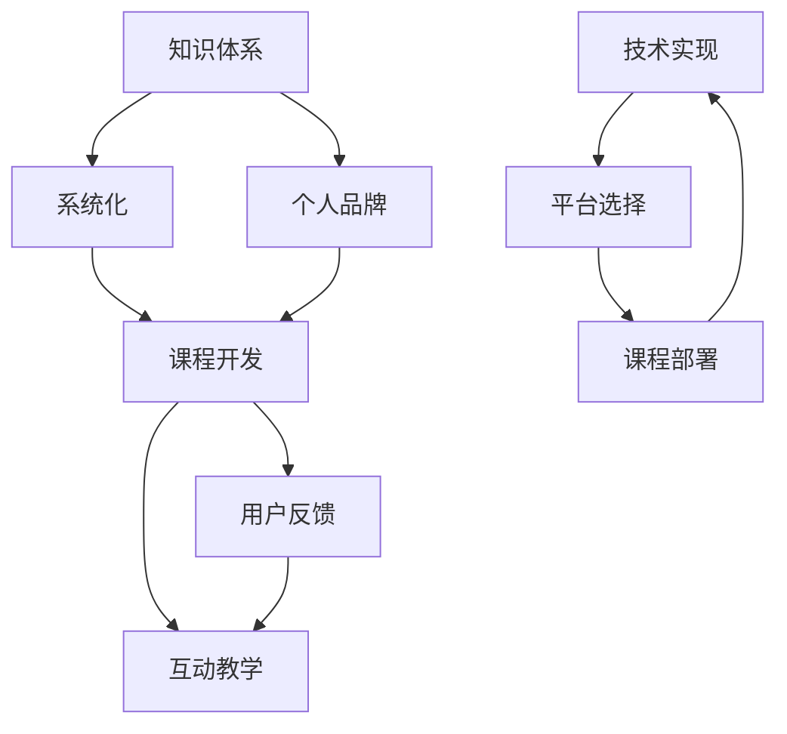

                 

# 开发个人品牌课程：系统化你的知识体系

> 关键词：知识体系,个人品牌,系统化,课程开发,在线教育

## 1. 背景介绍

### 1.1 问题由来

随着互联网的普及和教育技术的进步，越来越多的专业人士开始将个人知识和经验转化为线上课程，并通过平台分享。然而，内容零散、知识不成体系、学习体验不佳等问题，使得课程的吸引力和效果大打折扣。如何构建一套系统化的知识体系，使课程内容层次分明、逻辑清晰、易于理解，成为课程开发者面临的首要挑战。

### 1.2 问题核心关键点

本文将探讨如何通过系统化的知识体系开发，构建具有高度吸引力和实用价值的个人品牌课程。关键点包括：

- **系统化知识体系构建**：如何将复杂知识系统化、结构化，确保学习者能够循序渐进地掌握内容。
- **个人品牌塑造**：如何在课程中突出课程作者的专业形象，增强课程的吸引力和可信度。
- **互动教学设计**：如何设计有效的互动环节，提升学习者的参与度和学习效果。
- **用户反馈与优化**：如何收集用户反馈，不断优化课程内容和教学设计。
- **技术实现与平台选择**：如何选择合适的发展平台和工具，实现课程的高效开发和部署。

## 2. 核心概念与联系

### 2.1 核心概念概述

在探索构建个人品牌课程的过程中，需要深入理解以下几个核心概念：

- **知识体系（Knowledge System）**：指将某一领域知识按照内在逻辑和结构进行组织，形成层次分明、逻辑清晰的知识结构。
- **个人品牌（Personal Branding）**：指个人在专业领域中形成的独特形象和识别标志，通过课程传达专家的权威和专业性。
- **系统化（Systematization）**：指将知识体系系统化、结构化，使学习者能够系统掌握。
- **课程开发（Course Development）**：指从课程设计、内容制作到上线运营的全过程。
- **互动教学（Interactive Teaching）**：指通过多样化的教学手段，增强学习者的参与感和互动性。
- **用户反馈（User Feedback）**：指通过用户反馈收集和分析，不断优化课程内容和学习体验。

这些概念之间存在着密切的联系，通过系统化知识体系的构建和应用，可以更好地塑造个人品牌，同时提升课程的互动性和用户满意度。

### 2.2 核心概念原理和架构的 Mermaid 流程图



这个流程图展示了知识体系在系统化、个人品牌塑造、课程开发、互动教学、用户反馈和技术实现等环节的逻辑关系和应用流程。

## 3. 核心算法原理 & 具体操作步骤

### 3.1 算法原理概述

系统化知识体系开发的核心算法原理，在于将复杂知识按照内在逻辑和结构进行层次划分，形成从基础到高级、从理论到应用的知识路径，确保学习者能够系统地掌握内容。

#### 3.2 算法步骤详解

开发个人品牌课程的系统化知识体系，主要遵循以下步骤：

1. **需求分析与目标设定**：
   - 明确课程目标和受众，了解学习者的知识背景和学习需求。
   - 设定课程的总体框架和知识目标，确保课程内容具有明确的方向和目标。

2. **知识模块划分**：
   - 将课程内容按照内在逻辑和结构进行划分，形成多个知识模块。
   - 每个模块应具备独立的知识单元和技能点，便于学习者逐步掌握。

3. **内容设计与互动设计**：
   - 为每个知识模块设计详细的内容，确保内容充实、结构清晰。
   - 结合视频、文字、练习等多种教学手段，设计互动环节，提升学习效果。

4. **教学设计**：
   - 制定教学进度计划，确保学习者能够按照课程节奏逐步学习。
   - 引入案例分析和项目实践，增强学习者对知识的理解和应用能力。

5. **用户反馈与优化**：
   - 通过调查问卷、在线讨论等方式收集学习者反馈，了解课程的优缺点。
   - 根据反馈不断优化课程内容和教学设计，确保课程质量持续提升。

6. **技术实现与平台选择**：
   - 选择合适的课程开发平台和工具，确保课程的高效开发和部署。
   - 利用多媒体技术，提升课程的互动性和用户体验。

### 3.3 算法优缺点

系统化知识体系开发的优势包括：

- **系统化学习**：通过层次分明、逻辑清晰的知识结构，使学习者能够系统地掌握知识。
- **提升学习效率**：通过明确的知识路径和互动环节，提升学习者的参与度和学习效果。
- **增强课程吸引力**：通过系统化的知识体系和个人品牌的塑造，提升课程的吸引力和可信度。

然而，该方法也存在以下局限性：

- **开发成本较高**：系统化知识体系的构建和优化需要大量的时间和精力。
- **内容更新频率高**：随着技术的发展和知识的变化，课程内容需要不断更新，保持与行业前沿同步。
- **用户需求多样性**：学习者的需求各异，难以通过统一的知识体系满足所有人的学习需求。

### 3.4 算法应用领域

系统化知识体系开发技术，广泛应用于在线教育、职业培训、学术课程等多个领域。例如：

- **在线教育平台**：如Coursera、edX等，通过系统化的课程开发，提升课程质量和用户满意度。
- **职业培训课程**：如编程、设计、营销等，系统化的知识体系帮助学习者快速掌握技能。
- **学术课程**：如大学课程、MOOCs等，系统化的知识体系确保课程内容的科学性和严谨性。

## 4. 数学模型和公式 & 详细讲解 & 举例说明

### 4.1 数学模型构建

系统化知识体系的数学模型，可以从教育学的角度进行建模，如下：

设课程总目标为 $G$，分为 $n$ 个知识模块，每个模块的目标为 $M_i$。每个模块包含 $m_i$ 个知识点，每个知识点的目标为 $K_{i,j}$。

$$
G = \sum_{i=1}^n M_i
$$
$$
M_i = \sum_{j=1}^{m_i} K_{i,j}
$$

### 4.2 公式推导过程

以编程课程为例，可以进一步推导知识点的权重分配和目标达成。

- **知识点权重 $w_{i,j}$**：根据知识点的复杂度和重要性，分配不同的权重，确保学习者能够均衡掌握。
- **模块目标达成度 $R_i$**：计算每个模块的目标达成度，确保课程整体目标的实现。

$$
R_i = \frac{\sum_{j=1}^{m_i} w_{i,j} \cdot K_{i,j}}{M_i}
$$

### 4.3 案例分析与讲解

以数据分析课程为例，我们可以将其划分为以下几个模块：

1. **数据基础**：介绍数据类型、数据结构、数据处理等基础概念。
2. **数据清洗**：讲解数据清洗和预处理技术。
3. **数据探索**：教授数据探索和可视化的技能。
4. **数据分析**：深入讲解数据分析方法和技术。

每个模块设计详细的知识点，并通过互动环节增强学习效果。例如，在“数据清洗”模块中，可以设计一系列的练习和项目，帮助学习者掌握实际数据处理技能。

## 5. 项目实践：代码实例和详细解释说明

### 5.1 开发环境搭建

要进行课程开发，首先需要搭建合适的开发环境。

- **开发平台选择**：如Khan Academy、Udacity等在线教育平台，提供丰富的课程开发工具和支持。
- **开发工具**：如Adobe Captivate、Articulate Storyline等，用于制作互动课件。
- **多媒体工具**：如Camtasia、Adobe Premiere Pro等，用于制作高质量的视频内容。

### 5.2 源代码详细实现

这里提供一个简单的Python课程开发框架，用于制作和发布课程。

```python
class Course:
    def __init__(self, title, description, modules):
        self.title = title
        self.description = description
        self.modules = modules

    def add_module(self, module):
        self.modules.append(module)

    def get_modules(self):
        return self.modules

class Module:
    def __init__(self, name, goals, contents, interactive_activities):
        self.name = name
        self.goals = goals
        self.contents = contents
        self.interactive_activities = interactive_activities

    def get_name(self):
        return self.name

    def get_goals(self):
        return self.goals

    def get_contents(self):
        return self.contents

    def get_interactive_activities(self):
        return self.interactive_activities

# 示例：Python基础课程模块
module1 = Module("Python基础", ["变量与数据类型", "控制流语句", "函数", "列表与字典"],
                 ["变量与数据类型", "控制流语句", "函数", "列表与字典"],
                 ["变量与数据类型练习", "控制流语句练习", "函数练习", "列表与字典练习"])

# 将模块添加到课程中
course = Course("Python入门", "本课程介绍了Python基础语法和编程技能", [module1])

# 获取课程信息
print(course.title)
print(course.description)
print(course.get_modules())
```

### 5.3 代码解读与分析

该Python代码框架用于管理课程和模块的基本信息，是课程开发的基础。通过继承和扩展，可以进一步扩展功能，实现更复杂的课程开发需求。

### 5.4 运行结果展示

运行上述代码，输出课程的标题、描述和模块信息，展示了课程开发的基础框架和功能。

## 6. 实际应用场景

### 6.1 在线教育平台

在线教育平台是系统化知识体系开发的主要应用场景之一。平台通过系统化的课程开发，提升了课程的质量和用户满意度。例如，Coursera和edX等平台，提供丰富的课程开发工具和支持，帮助课程开发者构建高质量的在线课程。

### 6.2 职业培训课程

职业培训课程通过系统化的知识体系，帮助学习者快速掌握技能。例如，编程、设计、营销等职业培训课程，通过系统化的内容设计和互动环节，使学习者能够在短时间内掌握必备技能，提升职业竞争力。

### 6.3 学术课程

学术课程通过系统化的知识体系，确保课程内容的科学性和严谨性。例如，大学课程和MOOCs等，通过系统化的课程开发，使学习者能够系统掌握专业知识，提升学术水平。

### 6.4 未来应用展望

随着技术的进步和教育需求的变化，系统化知识体系开发将展现出更广阔的应用前景。未来，系统化知识体系开发将进一步结合人工智能和大数据分析技术，提供更加个性化、互动化的学习体验。例如，基于学习者行为数据的分析，实时调整课程内容和难度，提升学习效果。

## 7. 工具和资源推荐

### 7.1 学习资源推荐

为了帮助课程开发者掌握系统化知识体系开发的理论和方法，这里推荐一些优质的学习资源：

- **《系统化学习：设计有效课程》**：介绍如何设计系统化知识体系，提升课程质量和效果。
- **Coursera《课程设计》**：Coursera提供的课程设计专项课程，涵盖课程设计、内容制作、用户反馈等关键环节。
- **edX《教育技术应用》**：edX提供的教育技术应用课程，介绍最新教育技术和工具的应用。
- **Khan Academy《课程开发指南》**：Khan Academy提供的课程开发指南，涵盖课程设计、互动教学、用户反馈等关键环节。

### 7.2 开发工具推荐

优秀的工具是课程开发的重要保障。以下是几款常用的课程开发工具：

- **Khan Academy平台**：提供丰富的课程开发工具和支持，支持多媒体内容制作和互动教学设计。
- **Udacity平台**：提供在线课程开发工具和模板，支持视频、文本、练习等多种教学手段。
- **Camtasia视频编辑软件**：用于制作高质量的视频内容，支持屏幕录制、编辑、动画等多种功能。
- **Adobe Captivate课件制作工具**：用于制作互动课件，支持文字、图片、视频等多种内容形式。

### 7.3 相关论文推荐

系统化知识体系开发技术，涉及教育学、心理学、信息技术等多个领域。以下是几篇奠基性的相关论文，推荐阅读：

- **《基于知识体系的教学设计》**：探讨如何通过系统化的知识体系，设计有效教学过程。
- **《系统化知识体系在职业培训中的应用》**：介绍系统化知识体系在职业培训中的应用和效果。
- **《教育技术对课程开发的影响》**：研究教育技术对课程开发的影响，提出系统化知识体系开发的理论框架。
- **《在线教育平台的用户体验设计》**：探讨如何通过系统化的课程开发，提升在线教育平台的用户体验。

## 8. 总结：未来发展趋势与挑战

### 8.1 研究成果总结

系统化知识体系开发技术，已经成为课程开发的重要方法。通过系统化的知识体系构建和应用，课程开发者能够更好地塑造个人品牌，提升课程质量和用户满意度。

### 8.2 未来发展趋势

未来，系统化知识体系开发将呈现以下几个发展趋势：

- **技术融合**：结合人工智能、大数据分析等技术，提供更加个性化、互动化的学习体验。
- **多模态教学**：结合视频、音频、图像等多种模态，提升学习效果。
- **实时反馈**：利用人工智能和大数据分析，实时调整课程内容和难度，提升学习效果。
- **自适应学习**：通过学习者行为数据的分析，实现自适应学习，提高学习效率。

### 8.3 面临的挑战

尽管系统化知识体系开发技术已经取得了显著进展，但仍面临以下挑战：

- **内容更新频率高**：随着技术的发展和知识的变化，课程内容需要不断更新，保持与行业前沿同步。
- **用户需求多样性**：学习者的需求各异，难以通过统一的知识体系满足所有人的学习需求。
- **技术工具选择**：选择合适的课程开发平台和工具，需要一定的技术积累和成本投入。

### 8.4 研究展望

未来的研究需要在以下几个方面寻求新的突破：

- **自适应学习技术**：利用机器学习和大数据分析，实现自适应学习，提高学习效率。
- **个性化学习路径**：根据学习者的背景和需求，设计个性化的学习路径，提升学习效果。
- **多模态教学设计**：结合视频、音频、图像等多种模态，提升学习效果。
- **学习者行为分析**：通过学习者行为数据的分析，优化课程内容和教学设计，提升学习效果。

这些研究方向的探索，必将引领系统化知识体系开发技术迈向更高的台阶，为在线教育、职业培训等领域提供更优质的学习体验和更高的教学质量。面向未来，系统化知识体系开发技术还需要与其他教育技术进行更深入的融合，共同推动教育行业的创新发展。

## 9. 附录：常见问题与解答

**Q1：系统化知识体系开发的优势是什么？**

A: 系统化知识体系开发的优势包括：
- 系统化学习：通过层次分明、逻辑清晰的知识结构，使学习者能够系统地掌握知识。
- 提升学习效率：通过明确的知识路径和互动环节，提升学习者的参与度和学习效果。
- 增强课程吸引力：通过系统化的知识体系和个人品牌的塑造，提升课程的吸引力和可信度。

**Q2：如何构建系统化的知识体系？**

A: 构建系统化的知识体系，主要遵循以下步骤：
1. 需求分析与目标设定：明确课程目标和受众，了解学习者的知识背景和学习需求。
2. 知识模块划分：将课程内容按照内在逻辑和结构进行划分，形成多个知识模块。
3. 内容设计与互动设计：为每个知识模块设计详细的内容，结合视频、文字、练习等多种教学手段，设计互动环节，提升学习效果。
4. 教学设计：制定教学进度计划，引入案例分析和项目实践，增强学习者对知识的理解和应用能力。
5. 用户反馈与优化：通过调查问卷、在线讨论等方式收集学习者反馈，根据反馈不断优化课程内容和教学设计。

**Q3：系统化知识体系开发存在哪些挑战？**

A: 系统化知识体系开发存在以下挑战：
- 开发成本较高：系统化知识体系的构建和优化需要大量的时间和精力。
- 内容更新频率高：随着技术的发展和知识的变化，课程内容需要不断更新，保持与行业前沿同步。
- 用户需求多样性：学习者的需求各异，难以通过统一的知识体系满足所有人的学习需求。

**Q4：如何利用技术提升系统化知识体系的效果？**

A: 利用技术提升系统化知识体系的效果，可以通过以下方式：
- 结合人工智能和大数据分析，实现自适应学习，提高学习效率。
- 利用多媒体技术，提升课程的互动性和用户体验。
- 利用学习者行为数据的分析，实时调整课程内容和难度，提升学习效果。

**Q5：如何选择适合的开发工具和平台？**

A: 选择适合的开发工具和平台，需要考虑以下因素：
- 平台的功能和支持：选择功能丰富、支持良好的平台，确保课程开发的顺利进行。
- 技术复杂度和成本：考虑平台的易用性和成本投入，避免因技术复杂度导致的开发困难。
- 用户覆盖范围：选择用户覆盖范围广、应用广泛的平台，确保课程的传播和推广。

通过系统化的知识体系开发，我们可以更好地塑造个人品牌，提升课程质量和用户满意度，推动教育技术的发展和应用。面向未来，系统化知识体系开发技术还需要不断探索和创新，为在线教育、职业培训等领域提供更优质的学习体验和更高的教学质量。

---

作者：禅与计算机程序设计艺术 / Zen and the Art of Computer Programming

