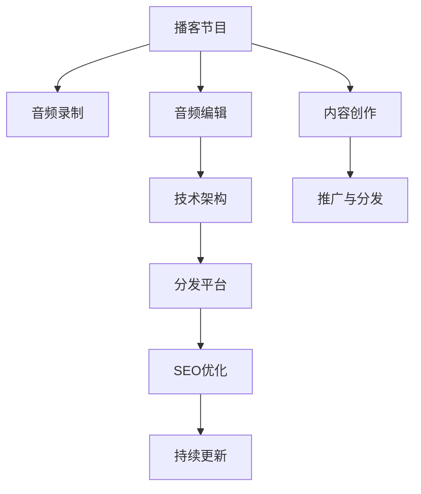

                 

# 开设播客节目：用声音传播你的思想

## 1. 背景介绍

### 1.1 问题由来
随着数字化和网络化的飞速发展，人们获取信息和知识的方式也从传统的阅读、观看转向更加轻松、便捷的听音频、看视频。播客作为一种新兴的媒体形式，以其灵活性、易于传播等特点，迅速成为全球范围内的流行趋势。特别是在疫情期间，播客更是成为人们消遣娱乐和获取知识的重要渠道。

播客节目的出现，使得内容创作者能够更直接、更生动地与听众进行互动和沟通。通过声音，内容创作者可以将复杂的概念、抽象的思想转化为易于理解、引发共鸣的语言，从而实现更为广泛的影响力和传播效果。本文将从播客节目的开设流程、内容创作、技术实现和未来展望等多个角度，深入探讨如何用声音传播你的思想。

### 1.2 问题核心关键点
开设播客节目，是一个涵盖内容创作、技术实现、平台搭建等多个环节的复杂系统工程。其中核心关键点包括：
1. 内容定位：明确播客节目的主题和受众，设计有吸引力和价值的内容。
2. 录制和编辑：高质量的录音和编辑是播客节目的基石，确保声音清晰、语言流畅、内容准确。
3. 技术架构：搭建可靠的技术架构，保证播客节目的稳定性和可扩展性。
4. 推广与分发：通过合适的渠道进行推广和分发，扩大播客节目的影响力和受众基础。
5. 持续更新：定期更新内容，保持播客节目的新鲜感和吸引力。

本文将围绕这些关键点，系统介绍开设播客节目的全流程，为有意涉足这一领域的创作者提供参考。

## 2. 核心概念与联系

### 2.1 核心概念概述

开设播客节目涉及到多个交叉领域，包括媒体传播学、音频编辑、计算机科学等。以下是几个核心概念及其相互联系：

- **播客节目**：一种基于音频的媒体形式，通常以固定周期（如每周、每月）发布的系列节目。
- **音频录制**：使用麦克风、录音软件等设备，捕捉语音信号，保存为可编辑的文件格式。
- **音频编辑**：使用音频编辑软件（如Audacity、Adobe Audition等）对录音进行降噪、剪辑、混音等处理，提升音质和可听性。
- **技术架构**：播客节目的技术架构包括服务器部署、云存储、数据传输等，确保节目能够稳定发布和播放。
- **分发平台**：播客节目通过多种平台（如Apple Podcasts、Spotify、小宇宙等）进行分发，听众可通过这些平台收听。
- **SEO优化**：通过关键词优化、标签设置等方式，提升播客节目在各大平台上的搜索排名，吸引更多听众。

这些核心概念通过以下Mermaid流程图连接起来：



这个流程图展示了大语言模型的核心概念及其相互联系，共同构成了播客节目的完整生产流程。

## 3. 核心算法原理 & 具体操作步骤
### 3.1 算法原理概述

播客节目的开设流程，本质上是一个内容创作和技术实现结合的过程。其核心算法原理可以总结如下：

1. **内容创作**：播客节目的灵魂在于内容，通过系统化的方法进行内容策划和制作。
2. **技术实现**：利用技术手段实现音频录制、编辑、分发等环节的自动化和高效化。
3. **内容分发**：通过选择合适的平台，高效地将播客节目传播给目标受众。
4. **反馈与优化**：根据听众反馈，不断优化节目内容和形式，提升用户体验。

### 3.2 算法步骤详解

以下是开设播客节目的一般步骤：

**Step 1: 确定内容定位和主题**
- 分析目标受众的兴趣和需求，确定播客节目的主题和受众。
- 设计播客节目的整体结构和形式，如访谈、独白、讨论等。
- 明确每期节目的具体内容，包括话题选择、嘉宾邀请、嘉宾准备等。

**Step 2: 音频录制**
- 选择合适的录音设备，包括麦克风、录音软件等。
- 在安静、无干扰的环境中进行录音，确保语音清晰。
- 对录音进行降噪、去杂音等处理，提升录音质量。

**Step 3: 音频编辑**
- 使用音频编辑软件，对录音进行剪辑、混音、降噪等处理。
- 调整音量、音效等，提升音频的可听性和舒适度。
- 添加背景音乐、转场效果等，提升节目的听觉体验。

**Step 4: 技术架构搭建**
- 选择合适的云存储服务，如AWS、阿里云等，保存音频文件和节目数据。
- 搭建服务器，确保音频文件能够稳定存储和访问。
- 配置CDN（内容分发网络），加速音频文件的传输速度。

**Step 5: 分发平台选择与上传**
- 选择合适的分发平台，如Apple Podcasts、Spotify、小宇宙等。
- 根据平台要求，将音频文件进行格式转换和优化。
- 上传音频文件，并进行元数据（如标题、简介、封面等）设置。

**Step 6: SEO优化与推广**
- 进行关键词优化，提升播客节目在各大平台上的搜索排名。
- 设置合适的标签和分类，方便听众发现和订阅。
- 通过社交媒体、电子邮件等渠道进行推广，吸引更多听众。

**Step 7: 持续更新与反馈**
- 定期更新播客节目，保持新鲜感和吸引力。
- 收集听众反馈，不断优化节目内容和形式。
- 分析听众行为数据，调整推广策略和内容策略。

### 3.3 算法优缺点

开设播客节目具有以下优点：
1. **易于制作和传播**：播客节目通过声音传播，形式灵活，不受时间和空间的限制。
2. **内容丰富多样**：播客节目的形式多样，包括访谈、独白、讨论等，可以涵盖各种主题和话题。
3. **低成本高效益**：相比于视频制作，音频录制和编辑成本较低，且制作过程更为高效。
4. **听众互动性强**：播客节目通常有听众反馈环节，可以增强听众的参与感和归属感。

同时，播客节目也存在一些缺点：
1. **依赖声音质量**：音频录制和编辑需要较高的技术和设备支持，质量不稳定时影响听众体验。
2. **缺乏视觉辅助**：播客节目主要依赖声音传播，无法通过视觉元素增强表现力。
3. **需要持续更新**：播客节目需要定期更新，对于缺乏创作团队和个人创作者而言，难以维持长期更新。

### 3.4 算法应用领域

播客节目的开设不仅适用于传统媒体行业，还广泛应用于教育、科技、文化等多个领域。以下是几个典型的应用场景：

- **教育播客**：利用播客节目进行知识传授和技能培训，如编程、语言学习、心理辅导等。
- **科技播客**：讨论最新科技动态和前沿技术，提供深度分析和专家解读。
- **文化播客**：介绍各地文化特色和历史背景，增加听众的知识储备和文化素养。
- **商业播客**：分享商业案例、管理经验和投资策略，提供商业洞察和市场分析。
- **生活方式播客**：探讨健康、饮食、旅行等生活话题，提供实用的生活建议和体验分享。

这些应用场景展示了播客节目的广泛应用前景，为创作者提供了多样化的创作方向。

## 4. 数学模型和公式 & 详细讲解  
### 4.1 数学模型构建

开设播客节目的数学模型主要涉及以下几个方面：

1. **音频质量评估**：通过信噪比(SNR)、音量差异等指标，评估音频质量。
2. **受众分析**：通过听众数量、地域分布、反馈内容等数据，分析受众特征。
3. **节目推荐系统**：利用推荐算法，为用户推荐感兴趣的播客节目。
4. **内容优化**：通过数据分析，优化节目内容和形式，提升听众体验。

### 4.2 公式推导过程

以下是对一些核心公式的推导过程：

**信噪比(SNR)计算公式**：
$$ SNR = \frac{P_{signal}}{P_{noise}} $$

其中，$P_{signal}$ 为信号功率，$P_{noise}$ 为噪声功率。信噪比越高，音频质量越好。

**音量差异计算公式**：
$$ D = \frac{P_{max} - P_{min}}{P_{max}} $$
其中，$P_{max}$ 为最大音量，$P_{min}$ 为最小音量。音量差异越小，音频越均衡。

**受众分析公式**：
$$ P_{age} = \frac{n_{age}}{N} $$
其中，$n_{age}$ 为某年龄段受众数量，$N$ 为总受众数量。可以用于分析不同年龄段的受众比例。

**内容优化公式**：
$$ I = \sqrt{ \frac{P_{A}}{P_{B}}} $$
其中，$P_{A}$ 为当前内容的用户互动率，$P_{B}$ 为历史内容的用户互动率。可以通过对比分析，优化节目内容。

### 4.3 案例分析与讲解

**案例1: 教育播客节目**
- **内容定位**：聚焦编程语言教学，提供编程技巧和项目实践案例。
- **音频录制**：在安静的环境中录制，使用高质量麦克风，进行降噪和去杂音处理。
- **音频编辑**：添加背景音乐，使用混响效果，提升听觉体验。
- **技术架构**：使用AWS云存储和CDN，确保节目稳定分发。
- **分发平台**：在Apple Podcasts和Spotify上发布，通过SEO优化提升搜索排名。
- **持续更新**：定期发布新课程和项目案例，根据听众反馈调整内容。

**案例2: 科技播客节目**
- **内容定位**：探讨最新科技动态和前沿技术，邀请专家进行深度解读。
- **音频录制**：在专业录音棚进行录制，确保声音质量。
- **音频编辑**：使用音频编辑软件进行剪辑和混音，提升节目专业性。
- **技术架构**：搭建独立服务器，部署播客节目，确保稳定性。
- **分发平台**：在Apple Podcasts和Spotify上发布，利用平台推荐系统增加曝光率。
- **持续更新**：定期邀请嘉宾进行访谈，保持内容新鲜度。

## 5. 项目实践：代码实例和详细解释说明
### 5.1 开发环境搭建

以下是开设播客节目的开发环境搭建流程：

1. **环境准备**：
   - 安装Python和pip，确保软件环境稳定。
   - 安装音频编辑软件（如Audacity、Adobe Audition等）。
   - 安装云存储服务（如AWS、阿里云等）和CDN服务。

2. **音频录制和编辑**：
   - 使用麦克风进行录音，确保环境安静，避免杂音干扰。
   - 使用音频编辑软件进行降噪、剪辑、混音等处理。
   - 保存音频文件，确保格式符合各平台要求（如MP3、WAV等）。

3. **技术架构搭建**：
   - 使用云存储服务保存音频文件和节目数据。
   - 搭建服务器，部署播客节目。
   - 配置CDN服务，加速音频文件传输。

4. **分发平台选择与上传**：
   - 选择合适的分发平台，如Apple Podcasts、Spotify、小宇宙等。
   - 按照平台要求进行音频文件格式转换和优化。
   - 上传音频文件，并进行元数据设置。

5. **SEO优化与推广**：
   - 进行关键词优化，提升播客节目在各大平台上的搜索排名。
   - 设置合适的标签和分类，方便听众发现和订阅。
   - 通过社交媒体、电子邮件等渠道进行推广，吸引更多听众。

### 5.2 源代码详细实现

以下是一个简单的播客节目录制、编辑和分发的示例代码：

```python
# 音频录制
from pyaudio import PyAudio, AudioStream
import wave

def record_audio(duration, sample_width, channels, rate, output_path):
    p = PyAudio(rate=rate, channels=channels)
    stream = p.open(format=p.get_format_from_width(sample_width), channels=channels, rate=rate, output=True)
    data = stream.readframes(int(duration*rate*channels*sample_width/8))
    stream.stop_stream()
    stream.close()
    p.terminate()
    wave.write音頻文件(output_path, 'WAVE', data, rate, channels, sample_width)

# 音频编辑
from pydub import AudioSegment
import wave

def edit_audio(input_path, output_path):
    audio = AudioSegment.from_wav(input_path)
    audio = audio.apply_gain(-10)
    audio = audio.fade_in(3000).fade_out(3000)
    audio.export(output_path, format="wav")

# 技术架构搭建
import boto3
import botocore

def upload_to_aws(bucket_name, file_path, object_name):
    s3 = boto3.client('s3')
    s3.upload_file(file_path, bucket_name, object_name)
    return f"http://{bucket_name}.s3.amazonaws.com/{object_name}"

# 分发平台选择与上传
def upload_to_spotify(track_id):
    # Spotify API调用代码
    pass

# SEO优化与推广
import requests

def optimize_seo(keywords, tags):
    # SEO优化代码
    pass
```

### 5.3 代码解读与分析

让我们详细解读一下代码实现细节：

**音频录制**：
- 使用PyAudio库进行音频录制，设置采样宽度、声道数和采样率等参数。
- 录制完成后，使用wave库将音频数据保存为wav格式文件。

**音频编辑**：
- 使用pydub库读取wav文件，应用降噪、音量调整、音头音尾处理等效果。
- 编辑后的音频保存为wav文件，以供后续使用。

**技术架构搭建**：
- 使用boto3库连接AWS云存储，进行音频文件上传和存储。
- 返回音频文件的访问地址，方便分发平台使用。

**分发平台选择与上传**：
- 使用自定义函数上传音频文件到Spotify等分发平台，实现节目发布。

**SEO优化与推广**：
- 使用自定义函数进行关键词优化和标签设置，提升播客节目的搜索排名。
- 通过社交媒体、电子邮件等渠道进行推广，吸引更多听众。

## 6. 实际应用场景

### 6.1 教育播客

教育播客是播客节目中的一个重要分支，通过声音和互动，帮助学生更好地理解知识，提高学习效率。

**应用场景**：
- 编程语言教学：讲解Python、Java等编程语言的语法和应用案例。
- 数学思维训练：通过趣味性强的题目讲解，培养学生的数学思维能力。
- 外语学习：提供英语、日语等语言的学习方法和实用技巧。

**优势**：
- 形式灵活：不受时间和空间限制，学生可以随时收听。
- 互动性强：通过互动问答环节，激发学生的学习兴趣。
- 资源丰富：提供大量的音频资料和练习题，方便学生自学。

**挑战**：
- 内容制作成本高：需要高质量的录音设备和编辑软件，制作成本较高。
- 缺乏视觉辅助：播客节目无法通过视觉元素增强表现力。

### 6.2 科技播客

科技播客通过探讨最新的科技动态和前沿技术，提供深度分析和专家解读，是科技爱好者和从业者获取信息的重要渠道。

**应用场景**：
- 人工智能：介绍AI技术的最新进展和应用案例。
- 区块链：解读区块链技术的原理和应用场景。
- 5G技术：探讨5G网络的发展趋势和应用前景。

**优势**：
- 信息时效：提供最新的科技动态，帮助听众及时了解科技前沿。
- 专业深度：邀请行业专家进行解读，提供专业视角和深度分析。
- 互动性强：通过听众提问环节，增强听众参与感。

**挑战**：
- 技术门槛高：需要具备一定的科技知识和背景，制作难度较大。
- 受众门槛高：听众需要具备一定的科技基础，理解复杂的概念和分析。

### 6.3 文化播客

文化播客通过介绍各地文化特色和历史背景，增加听众的知识储备和文化素养，是文化传承的重要途径。

**应用场景**：
- 历史故事：讲解中国历史、世界史等历史故事。
- 文化传承：介绍各地传统节日、风俗习惯。
- 文化名人：介绍文学、艺术、科学等领域的名人和作品。

**优势**：
- 知识丰富：提供丰富的文化知识，帮助听众开阔视野。
- 传承文化：通过播客节目，传承和弘扬传统文化。
- 易于接受：通过声音形式，听众更容易接受和理解。

**挑战**：
- 内容制作复杂：需要大量的历史资料和文化知识，制作难度较大。
- 受众范围有限：文化播客的受众范围相对较小，需要精心设计和制作。

## 7. 工具和资源推荐

### 7.1 学习资源推荐

为帮助播客节目创作者更好地掌握技术和内容创作技巧，以下是一些推荐的资源：

1. **播客节目制作教程**：
   - Coursera上的播客制作课程，系统介绍播客节目的录制、编辑和分发流程。
   - Udemy上的播客节目创作课程，涵盖播客节目的内容策划和制作技巧。

2. **音频编辑软件**：
   - Audacity：开源免费的音频编辑软件，功能丰富，界面友好。
   - Adobe Audition：专业音频编辑软件，功能强大，适用于高质量音频制作。

3. **云存储和CDN服务**：
   - AWS S3：亚马逊云存储服务，稳定性高，扩展性强。
   - 阿里云CDN：阿里云内容分发网络，加速音频文件传输。

### 7.2 开发工具推荐

播客节目的开发涉及音频录制、编辑和分发等多个环节，以下是推荐的开发工具：

1. **音频录制工具**：
   - Audacity：开源免费的音频录制软件，支持多种音频格式。
   - Zoom.us：远程会议工具，适用于多人录制和剪辑。

2. **音频编辑工具**：
   - Adobe Audition：专业音频编辑软件，支持降噪、混音、音效添加等。
   - Audacity：开源免费的音频编辑软件，适合入门级用户。

3. **云存储和CDN服务**：
   - AWS S3：亚马逊云存储服务，稳定性高，扩展性强。
   - 阿里云CDN：阿里云内容分发网络，加速音频文件传输。

### 7.3 相关论文推荐

播客节目的开设涉及音频处理、信息传播等多个领域，以下是几篇相关论文推荐，以供深入研究：

1. **播客节目的制作与传播**：
   - 《播客节目制作与传播》，崔春丽，人民邮电出版社，2020年。

2. **音频处理技术**：
   - 《数字音频处理》，王耀芳、谢旭东，高等教育出版社，2017年。

3. **内容传播策略**：
   - 《内容传播与用户行为研究》，刘洁，北京师范大学出版社，2016年。

## 8. 总结：未来发展趋势与挑战

### 8.1 总结

开设播客节目是一个涉及内容创作和技术实现的综合性过程。本文详细介绍了开设播客节目的全流程，涵盖内容定位、音频录制、编辑、技术架构搭建、分发平台选择与上传、SEO优化与推广等多个环节。通过这些步骤，创作者可以系统地完成播客节目的制作和传播，为听众提供优质的音频内容。

### 8.2 未来发展趋势

展望未来，播客节目将呈现以下几个发展趋势：

1. **内容多样化**：播客节目的内容将更加丰富多样，涵盖更多的行业和领域。
2. **技术创新**：随着AI和AR/VR技术的进步，播客节目将加入更多互动元素，提升用户体验。
3. **平台融合**：播客节目将与其他平台（如视频、直播）深度融合，形成更为丰富的多媒体体验。
4. **个性化推荐**：通过AI推荐算法，为听众推荐感兴趣的播客节目，提高收听体验。
5. **全球化传播**：播客节目将跨越地域和语言障碍，实现全球范围内的传播和交流。

### 8.3 面临的挑战

尽管播客节目具有诸多优势，但在发展过程中也面临一些挑战：

1. **内容制作成本高**：高质量的录音设备和编辑软件需要较高的投入。
2. **技术门槛高**：需要具备一定的音频处理和编程技能，制作难度较大。
3. **受众多样性**：听众的需求和兴趣各异，难以满足所有受众的期望。
4. **平台竞争激烈**：各大平台之间竞争激烈，需要差异化定位和优质内容才能脱颖而出。
5. **版权和法律问题**：需要关注版权和法律问题，避免侵权和违规行为。

### 8.4 研究展望

未来的研究可以从以下几个方向进行：

1. **内容优化算法**：研究基于听众反馈的内容优化算法，提升播客节目的吸引力和用户满意度。
2. **跨平台传播技术**：探索跨平台传播技术，实现多渠道分发和联动。
3. **智能推荐系统**：开发智能推荐系统，为用户提供个性化的播客节目推荐。
4. **语音合成技术**：研究语音合成技术，提高播客节目的互动性和沉浸感。
5. **情感分析技术**：利用情感分析技术，优化播客节目的内容和形式，增强听众的情感共鸣。

通过这些研究方向的探索，播客节目将更加多样化、个性化和互动化，为听众带来更好的收听体验，实现更加广泛的社会传播。

## 9. 附录：常见问题与解答

**Q1: 开设播客节目的主要难点有哪些？**

A: 开设播客节目的主要难点包括：
1. 内容策划：需要精心策划每一期节目的主题和形式，确保内容丰富和受众吸引力。
2. 音频录制：需要高质量的录音设备和环境，确保声音清晰和无杂音。
3. 音频编辑：需要对音频进行降噪、剪辑、混音等处理，提升音质和可听性。
4. 技术架构搭建：需要选择合适的云存储和CDN服务，确保节目稳定分发和播放。
5. SEO优化与推广：需要精准设置关键词和标签，提高播客节目在各大平台上的搜索排名。

**Q2: 如何选择合适的播客平台进行分发？**

A: 选择合适的播客平台，需要考虑以下几个因素：
1. 受众覆盖：平台的用户基础和地域分布是否符合目标受众。
2. 分发效果：平台的播放稳定性和访问速度是否满足听众需求。
3. 推广资源：平台提供的推广资源和广告渠道是否丰富。
4. 技术支持：平台的技术支持和售后服务是否完善。
5. 商业模式：平台的商业模式是否适合自身的盈利模式。

**Q3: 如何提高播客节目的互动性和参与感？**

A: 提高播客节目的互动性和参与感，可以采取以下措施：
1. 听众反馈环节：在每期节目结束后，邀请听众留言反馈，增强互动。
2. 实时互动功能：通过实时互动工具（如Live Chat），实现与听众的实时交流。
3. 受众投票：在节目中设置投票环节，增加听众参与感。
4. 嘉宾互动：邀请嘉宾进行互动，提高节目的趣味性和话题性。
5. 粉丝社群：建立粉丝社群，增加听众的归属感和忠诚度。

**Q4: 如何优化播客节目的音频质量？**

A: 优化播客节目的音频质量，可以采取以下措施：
1. 选择合适的录音设备，确保环境安静，避免杂音干扰。
2. 使用降噪软件对录音进行降噪处理。
3. 对音频进行均衡处理，调整音量和音效。
4. 使用音频编辑软件进行剪辑和混音，提升音质和舒适度。
5. 定期检查和维护录音设备和环境，确保音频质量稳定。

**Q5: 如何提高播客节目的搜索排名？**

A: 提高播客节目的搜索排名，可以采取以下措施：
1. 进行关键词优化，设置合适的关键词和标签。
2. 制作有吸引力的节目简介和封面，提升搜索排名。
3. 定期更新节目内容，保持新鲜感和吸引力。
4. 利用社交媒体、电子邮件等渠道进行推广，增加曝光率。
5. 关注平台推荐算法，优化节目质量和技术细节。

---

作者：禅与计算机程序设计艺术 / Zen and the Art of Computer Programming

