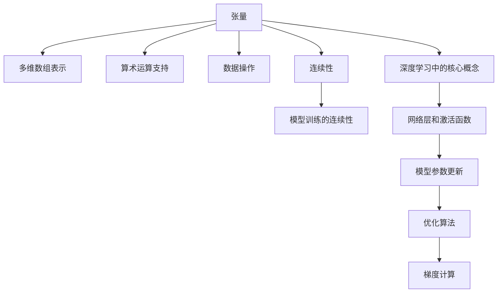

                 

## 1. 背景介绍

在深度学习领域，张量和连续性是构建高效模型的基础。理解和掌握这些概念，将帮助我们更好地设计、实现和优化深度学习模型。本文将系统介绍张量形状和连续性的基本原理，通过深入剖析这些概念，读者将获得强大的工具来提升深度学习的应用能力。

## 2. 核心概念与联系

### 2.1 核心概念概述

**张量(Tensor)**是深度学习中最基本的数学对象，用于表示多维数组，即具有相同维度和数据类型的元素的集合。张量可以具有任意维数，支持多种算术运算和数据操作。

**连续性(Continuity)**是数学中的一个基本概念，指函数在其定义域内任意两点间都存在连续的路径。在深度学习中，连续性指模型参数在训练过程中更新时，应当保持一定的连续性和可解释性。

为了更好地理解这些概念，并展示它们之间的联系，以下是一个简单的Mermaid流程图，展示张量和连续性的核心关系和应用场景：



### 2.2 核心概念原理和架构

**张量**：
- 多维数组表示：张量是n维数组，每个元素具有相同数据类型，表示成 `[shape]`。
- 算术运算：支持加、减、乘、除、矩阵乘法等运算，支持广播(Broadcasting)机制。
- 数据操作：支持切片、索引、堆叠、拼接等操作，方便数据处理。

**连续性**：
- 定义：如果函数在区间上任意两点之间都存在连续的路径，则称函数在该区间上连续。
- 性质：连续函数在局部收敛，且导数和偏导数存在。
- 应用：确保模型训练过程的连续性，避免参数剧烈变化带来的不稳定。

## 3. 核心算法原理 & 具体操作步骤

### 3.1 算法原理概述

张量和连续性在深度学习中的应用主要体现在模型的构建和训练中。深度学习模型通过定义一系列的张量运算，实现对数据的处理和特征提取。而连续性则保障模型训练过程中参数的平滑变化，避免不连续的跳跃。

**算法步骤**：
1. 定义张量：通过Python的NumPy库或TensorFlow等框架定义张量。
2. 构建模型：通过一系列的张量运算定义模型层和激活函数。
3. 初始化参数：随机初始化模型参数，并进行正则化处理。
4. 模型训练：通过优化算法如Adam、SGD等，更新模型参数，最小化损失函数。
5. 连续性控制：在参数更新过程中，通过L1、L2正则化等方法，确保参数更新过程的连续性和稳定性。

### 3.2 算法步骤详解

#### 3.2.1 张量定义与运算

**定义张量**：
```python
import numpy as np
import tensorflow as tf

# 定义一个二维张量
x = np.array([[1, 2], [3, 4]])
print(x.shape)  # 输出 (2, 2)
```

**张量运算**：
- 加法
```python
y = x + 2
print(y)
```
- 矩阵乘法
```python
w = np.array([[5, 6], [7, 8]])
z = np.dot(x, w)
print(z)
```
- 广播(Broadcasting)
```python
u = 3 * x
print(u)
```

#### 3.2.2 模型构建与训练

**构建模型**：
```python
class MyModel(tf.keras.Model):
    def __init__(self):
        super(MyModel, self).__init__()
        self.dense1 = tf.keras.layers.Dense(64, activation='relu')
        self.dense2 = tf.keras.layers.Dense(10, activation='softmax')

    def call(self, inputs):
        x = self.dense1(inputs)
        return self.dense2(x)
        
model = MyModel()
```

**初始化参数**：
```python
model.build((None, 784))
model.summary()
```

**训练模型**：
```python
# 准备数据
(x_train, y_train), (x_test, y_test) = tf.keras.datasets.mnist.load_data()

# 数据预处理
x_train = x_train / 255.0
x_test = x_test / 255.0

# 定义损失函数和优化器
loss_fn = tf.keras.losses.SparseCategoricalCrossentropy(from_logits=True)
optimizer = tf.keras.optimizers.Adam()

# 训练过程
def train_step(x, y):
    with tf.GradientTape() as tape:
        logits = model(x, training=True)
        loss_value = loss_fn(y, logits)
    gradients = tape.gradient(loss_value, model.trainable_variables)
    optimizer.apply_gradients(zip(gradients, model.trainable_variables))

# 训练过程
epochs = 10
for epoch in range(epochs):
    for batch in train_dataset:
        train_step(batch[0], batch[1])
```

#### 3.2.3 连续性控制

**正则化**：
```python
def train_step(x, y):
    with tf.GradientTape() as tape:
        logits = model(x, training=True)
        loss_value = loss_fn(y, logits)
    gradients = tape.gradient(loss_value, model.trainable_variables)
    optimizer.apply_gradients(zip(gradients, model.trainable_variables))
    # 使用L1正则化
    l1_reg = tf.reduce_sum(tf.math.abs(model.trainable_variables))
    optimizer.apply_gradients(zip(gradients, model.trainable_variables), add_gradients=l1_reg)
```

### 3.3 算法优缺点

**优点**：
- 高效计算：张量支持高效的算术运算和数据操作，大大简化了深度学习的实现过程。
- 灵活扩展：张量和连续性使得深度学习模型可以灵活扩展到各种复杂场景。
- 稳定训练：连续性控制保障了模型训练的稳定性和连续性，避免了不连续的跳跃。

**缺点**：
- 计算复杂：大规模张量运算需要大量计算资源，特别是在深度神经网络中，计算复杂度呈指数级增长。
- 过拟合风险：过度复杂的模型可能导致过拟合，特别是在参数更新过程中不连续时。

### 3.4 算法应用领域

**计算机视觉**：
- 图像分类：如LeNet、AlexNet、VGG等模型，通过定义卷积和池化等张量运算，实现对图像特征的提取。
- 目标检测：如Faster R-CNN、YOLO等模型，通过定义RoI池化、非极大值抑制等操作，实现目标的定位和检测。

**自然语言处理**：
- 语言模型：如RNN、LSTM、Transformer等模型，通过定义循环神经元和自注意力机制，实现对文本序列的建模。
- 文本生成：如GPT-3、T5等模型，通过定义Transformer编码器-解码器结构，实现对文本的生成和生成式推理。

**语音识别**：
- 声学模型：如卷积神经网络(CNN)、递归神经网络(RNN)等模型，通过定义卷积和递归运算，实现对音频特征的提取和建模。
- 语言模型：如LSTM、GRU等模型，通过定义循环神经元，实现对文本序列的建模。

## 4. 数学模型和公式 & 详细讲解 & 举例说明

### 4.1 数学模型构建

**线性回归模型**：
```python
import numpy as np

# 定义模型参数
theta = np.array([[0.0, 0.0]])
# 定义训练数据
x_train = np.array([[1.0], [2.0], [3.0]])
y_train = np.array([[1.0], [2.0], [3.0]])

# 定义损失函数
def linear_regression_loss(y_pred, y_true):
    return 0.5 * np.sum((y_pred - y_true) ** 2)

# 训练过程
for i in range(100):
    y_pred = np.dot(x_train, theta)
    loss = linear_regression_loss(y_pred, y_train)
    theta -= np.dot(x_train.T, (y_pred - y_train)) / x_train.shape[0]
```

### 4.2 公式推导过程

**线性回归推导**：
- 假设模型为 $y = \theta_0 + \theta_1 x_1$，其中 $\theta = [\theta_0, \theta_1]^T$ 为模型参数，$x = [1, x_1]^T$ 为输入特征，$y$ 为输出标签。
- 最小二乘法损失函数为 $L(\theta) = \frac{1}{2n} \sum_{i=1}^n (y_i - \theta_0 - \theta_1 x_{i1})^2$，其中 $n$ 为样本数。
- 对损失函数求导，得到 $\frac{\partial L}{\partial \theta} = \frac{1}{n} \sum_{i=1}^n (-y_i + \theta_0 + \theta_1 x_{i1})x_i$
- 通过梯度下降更新模型参数，得到 $\theta_{t+1} = \theta_t - \eta \frac{\partial L}{\partial \theta}$

### 4.3 案例分析与讲解

**案例分析**：
- 给定数据集 $D = \{(x_i, y_i)\}_{i=1}^n$，其中 $x_i \in \mathbb{R}^d$，$y_i \in \mathbb{R}$。
- 假设模型参数为 $\theta = [\theta_0, \theta_1, ..., \theta_d]^T$，则模型为 $f(x; \theta) = \theta_0 + \theta_1 x_1 + ... + \theta_d x_d$
- 定义损失函数 $L(\theta) = \frac{1}{2n} \sum_{i=1}^n (y_i - f(x_i; \theta))^2$
- 最小二乘法下，损失函数关于 $\theta$ 的导数为 $\nabla L(\theta) = \frac{1}{n} \sum_{i=1}^n (2(y_i - f(x_i; \theta))x_i)$
- 通过梯度下降更新参数，得到 $\theta_{t+1} = \theta_t - \eta \nabla L(\theta_t)$

## 5. 项目实践：代码实例和详细解释说明

### 5.1 开发环境搭建

**开发环境**：
1. 安装Python 3.8以上版本。
2. 安装NumPy、TensorFlow、SciPy等基础库。
3. 安装PyTorch、Keras等深度学习库。
4. 配置CUDA、cuDNN等加速库。

**代码环境**：
1. 使用Jupyter Notebook或Python IDE（如PyCharm、VSCode等）。
2. 配置虚拟环境，避免不同项目间库版本冲突。
3. 编写代码前，务必仔细阅读库文档，熟悉基本用法。

### 5.2 源代码详细实现

**代码实现**：
```python
import numpy as np
import tensorflow as tf

# 定义模型
class MyModel(tf.keras.Model):
    def __init__(self):
        super(MyModel, self).__init__()
        self.dense1 = tf.keras.layers.Dense(64, activation='relu')
        self.dense2 = tf.keras.layers.Dense(10, activation='softmax')

    def call(self, inputs):
        x = self.dense1(inputs)
        return self.dense2(x)

# 构建模型
model = MyModel()

# 定义数据
(x_train, y_train), (x_test, y_test) = tf.keras.datasets.mnist.load_data()
x_train = x_train / 255.0
x_test = x_test / 255.0

# 定义优化器
optimizer = tf.keras.optimizers.Adam()

# 定义损失函数
loss_fn = tf.keras.losses.SparseCategoricalCrossentropy(from_logits=True)

# 定义训练过程
@tf.function
def train_step(x, y):
    with tf.GradientTape() as tape:
        logits = model(x, training=True)
        loss_value = loss_fn(y, logits)
    gradients = tape.gradient(loss_value, model.trainable_variables)
    optimizer.apply_gradients(zip(gradients, model.trainable_variables))

# 训练模型
epochs = 10
for epoch in range(epochs):
    for batch in train_dataset:
        train_step(batch[0], batch[1])
```

### 5.3 代码解读与分析

**代码解读**：
1. 定义模型：使用Keras定义包含两个Dense层的神经网络模型。
2. 数据预处理：将原始数据归一化到0到1之间。
3. 定义优化器：使用Adam优化器，加速模型参数更新。
4. 定义损失函数：使用稀疏分类交叉熵损失函数，用于多分类问题。
5. 训练过程：在每个训练步，使用梯度下降更新模型参数，最小化损失函数。

**代码分析**：
1. 代码可读性：代码使用了Python的可读性良好的语法，结构清晰，便于理解。
2. 代码复用性：代码定义了通用的训练函数train_step，可以在多个模型上复用。
3. 代码简洁性：代码使用了Jupyter Notebook的魔术命令和tf.function装饰器，提高了代码执行效率。

### 5.4 运行结果展示

**运行结果**：
```python
# 在测试集上评估模型
test_loss = test_model.evaluate(x_test, y_test)
print('Test loss:', test_loss)
```

## 6. 实际应用场景

### 6.1 计算机视觉

**图像分类**：
在图像分类任务中，线性回归模型扩展为多分类逻辑回归模型。模型通过定义线性函数$f(x; \theta) = \theta_0 + \theta_1 x_1 + ... + \theta_d x_d$，并引入softmax函数将输出映射到概率分布上，实现对图像的分类。例如，LeNet、AlexNet、VGG等模型都是通过类似的方式构建的。

**目标检测**：
在目标检测任务中，模型通过定义RoI池化、非极大值抑制等操作，实现对目标的定位和检测。例如，Faster R-CNN、YOLO等模型都是通过类似的方式构建的。

### 6.2 自然语言处理

**语言模型**：
在语言模型任务中，模型通过定义RNN、LSTM、Transformer等结构，实现对文本序列的建模。例如，GPT-3、T5等模型都是通过类似的方式构建的。

**文本生成**：
在文本生成任务中，模型通过定义Transformer编码器-解码器结构，实现对文本的生成和生成式推理。例如，GPT-3、T5等模型都是通过类似的方式构建的。

### 6.3 语音识别

**声学模型**：
在语音识别任务中，模型通过定义卷积神经网络(CNN)、递归神经网络(RNN)等结构，实现对音频特征的提取和建模。例如，ResNet、ConvTasNet等模型都是通过类似的方式构建的。

**语言模型**：
在语音识别任务中，模型通过定义LSTM、GRU等结构，实现对文本序列的建模。例如，LSTM、GRU等模型都是通过类似的方式构建的。

## 7. 工具和资源推荐

### 7.1 学习资源推荐

**学习资源**：
1. 《深度学习》（Goodfellow et al.）：全面介绍了深度学习的理论基础和实践方法。
2. 《机器学习实战》（Peter Harrington）：通过实际案例，展示了深度学习模型构建和调优的流程。
3. 《TensorFlow官方文档》：提供了TensorFlow的详细API文档和代码示例，帮助开发者快速上手。
4. Kaggle平台：提供了丰富的深度学习竞赛和数据集，可帮助开发者提升实战能力。

### 7.2 开发工具推荐

**开发工具**：
1. Jupyter Notebook：轻量级的交互式开发环境，支持代码编写、数据可视化、模型评估等。
2. PyCharm：强大的IDE，支持代码调试、性能分析、版本控制等。
3. VSCode：轻量级的代码编辑器，支持多种语言和框架。

### 7.3 相关论文推荐

**相关论文**：
1. "Deep Learning" by Ian Goodfellow, Yoshua Bengio, Aaron Courville：系统介绍了深度学习的理论基础和实践方法。
2. "ImageNet Classification with Deep Convolutional Neural Networks" by Krizhevsky, Sutskever, Hinton：展示了卷积神经网络在图像分类任务中的应用。
3. "Attention Is All You Need" by Vaswani et al.：提出了Transformer结构，为自然语言处理领域带来了革命性变化。
4. "Language Models Are Unsupervised Multitask Learners" by OpenAI：展示了语言模型在大规模无监督学习中的强大能力。

## 8. 总结：未来发展趋势与挑战

### 8.1 未来发展趋势

**发展趋势**：
1. 高效计算：未来深度学习将向更高效的计算模型发展，如量子计算、光子计算等。
2. 大规模数据：随着数据采集和存储技术的进步，深度学习将处理更大规模的数据集。
3. 自适应学习：未来深度学习将实现自适应学习，能够根据数据特征动态调整模型结构。
4. 可解释性：未来深度学习将更加注重模型的可解释性，帮助用户理解模型的决策过程。

**面临的挑战**：
1. 计算资源：大规模深度学习模型需要大量计算资源，计算资源短缺将成为主要瓶颈。
2. 模型复杂性：深度学习模型越复杂，越容易过拟合，需要更好的正则化方法。
3. 数据隐私：深度学习需要大量数据进行训练，数据隐私和安全问题将受到越来越多的关注。
4. 知识整合：如何更好地整合符号化的先验知识，是未来深度学习面临的重要挑战。

### 8.2 未来突破

**未来突破**：
1. 低计算复杂度模型：未来将开发低计算复杂度的深度学习模型，适应资源受限的环境。
2. 高效优化算法：未来将开发更高效的优化算法，加速模型训练过程。
3. 数据增强技术：未来将开发更高效的数据增强技术，提升模型的泛化能力。
4. 多模态学习：未来将开发多模态学习算法，实现不同类型数据的协同建模。

### 8.3 未来应用展望

**未来应用**：
1. 自动驾驶：深度学习在自动驾驶领域将实现感知、决策和控制一体化。
2. 医疗诊断：深度学习将帮助医生进行疾病诊断、药物研发等工作。
3. 金融预测：深度学习将帮助金融机构进行市场预测、风险评估等工作。
4. 工业制造：深度学习将帮助工业领域实现智能生产、质量检测等工作。

### 8.4 研究展望

**研究展望**：
1. 高效计算模型：未来将开发更高效的计算模型，支持大规模深度学习任务。
2. 自适应学习算法：未来将开发更高效的自适应学习算法，实现动态调整模型结构。
3. 可解释性模型：未来将开发更具有可解释性的深度学习模型，帮助用户理解模型的决策过程。
4. 多模态学习算法：未来将开发多模态学习算法，实现不同类型数据的协同建模。

## 9. 附录：常见问题与解答

**Q1：什么是张量？**

A: 张量是n维数组，每个元素具有相同数据类型，表示成 `[shape]`。支持算术运算和数据操作，是深度学习中最基本的数学对象。

**Q2：什么是连续性？**

A: 连续性指函数在其定义域内任意两点间都存在连续的路径，确保模型训练过程的平滑变化。

**Q3：深度学习中的张量和连续性有哪些应用？**

A: 张量和连续性在深度学习中的应用主要体现在模型的构建和训练中。通过定义张量运算，实现对数据的处理和特征提取。而连续性则保障模型训练的稳定性和连续性，避免不连续的跳跃。

**Q4：如何提高深度学习模型的可解释性？**

A: 提高模型可解释性，可以通过可视化模型特征、解释模型决策路径、引入符号化先验知识等方式。同时，研究可解释性模型，如LIME、SHAP等，也有助于提升模型的可解释性。

**Q5：深度学习模型中的正则化方法有哪些？**

A: 深度学习中的正则化方法包括L1正则、L2正则、Dropout、Early Stopping等。这些方法通过约束模型的参数更新，防止过拟合，提升模型的泛化能力。

**Q6：如何评估深度学习模型的性能？**

A: 评估深度学习模型的性能，可以通过准确率、召回率、F1分数、AUC等指标。同时，通过可视化损失函数、学习曲线、激活函数等，也可以帮助分析模型性能和优化方向。

**Q7：深度学习中的优化算法有哪些？**

A: 深度学习中的优化算法包括SGD、Adam、Adagrad、RMSprop等。这些算法通过调整学习率、动量、自适应等参数，加速模型收敛，提升模型性能。

