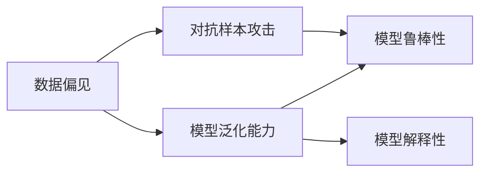
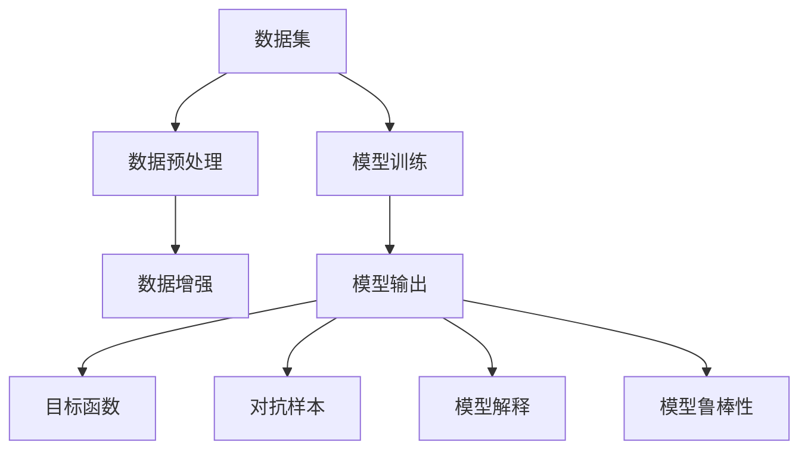

                 

## 1. 背景介绍

随着深度学习技术的快速发展，其在自然语言处理、计算机视觉、语音识别等领域的优异表现，使它成为了人工智能领域的热点。然而，张钹院士指出，深度学习的背后，其实存在着很多不安全因素，这些问题可能会导致模型产生误判、偏见和错误，甚至被恶意利用。

本文将通过分析张钹院士关于深度学习不安全性的观点，探讨深度学习在各个应用领域可能遇到的安全风险，以及如何构建更为安全的深度学习系统。

## 2. 核心概念与联系

### 2.1 核心概念概述

深度学习的不安全性问题主要集中在以下几方面：

- **数据偏见**：由于训练数据可能包含歧视性或偏差性的信息，模型可能会继承这些偏见，产生歧视性输出。
- **模型泛化能力**：深度模型可能过度拟合训练数据，导致在面对新的数据时泛化能力不足，产生误判。
- **对抗样本攻击**：针对模型的对抗样本攻击能够误导模型产生错误输出，甚至使模型无法正常工作。
- **模型解释性**：深度学习模型通常是"黑盒"模型，难以解释其内部工作机制和决策逻辑，导致对模型的监控和干预难度大。
- **模型鲁棒性**：深度模型在面对小变化的数据时容易失灵，缺乏鲁棒性。

这些问题之间的联系可以通过以下Mermaid流程图展示：



### 2.2 核心概念原理和架构的 Mermaid 流程图



## 3. 核心算法原理 & 具体操作步骤

### 3.1 算法原理概述

深度学习的不安全性主要来源于以下几个方面：

- **数据偏见**：深度学习模型依赖于训练数据，如果数据存在偏见，模型会继承这些偏见。
- **模型泛化能力**：深度模型可能会过度拟合训练数据，导致泛化能力不足。
- **对抗样本攻击**：对抗样本能够误导模型产生错误输出。
- **模型解释性**：深度模型通常是"黑盒"模型，难以解释其内部工作机制。
- **模型鲁棒性**：深度模型在面对小变化的数据时容易失灵。

### 3.2 算法步骤详解

#### 3.2.1 数据偏见缓解

数据偏见可以通过以下方法缓解：

1. **数据清洗**：去除或修正数据集中的偏见性数据。
2. **数据平衡**：确保训练数据集中各类样本的分布均衡。
3. **数据增强**：通过数据增强技术生成更多样化的数据。

#### 3.2.2 对抗样本防御

对抗样本防御可以通过以下方法实现：

1. **对抗训练**：通过加入对抗样本，训练模型对对抗样本的鲁棒性。
2. **模型重构**：使用对抗性稳定训练方法，如FGSM、PGD等，构建更加鲁棒的模型。
3. **对抗样本检测**：在模型推理前，检测输入是否为对抗样本。

#### 3.2.3 模型鲁棒性提升

模型鲁棒性可以通过以下方法提升：

1. **参数初始化**：使用更好的初始化方法，如Xavier初始化、He初始化等。
2. **正则化**：使用L2正则、Dropout等方法防止模型过拟合。
3. **模型集成**：通过模型集成提高模型的鲁棒性。

#### 3.2.4 模型解释性增强

模型解释性可以通过以下方法增强：

1. **特征可视化**：通过可视化特征图，理解模型的内部机制。
2. **模型可解释性算法**：使用SHAP、LIME等可解释性算法。
3. **模型交互**：通过交互界面，让使用者理解模型的决策过程。

### 3.3 算法优缺点

#### 3.3.1 数据偏见缓解

优点：

1. 能够去除或修正数据集中的偏见性数据。
2. 可以通过数据增强技术生成更多样化的数据。

缺点：

1. 需要人工进行数据清洗和平衡。
2. 数据增强技术可能会引入噪声。

#### 3.3.2 对抗样本防御

优点：

1. 能够提高模型的鲁棒性，防止对抗样本攻击。
2. 能够检测输入是否为对抗样本。

缺点：

1. 对抗训练可能会降低模型的泛化能力。
2. 对抗样本检测可能存在误判。

#### 3.3.3 模型鲁棒性提升

优点：

1. 能够提高模型的鲁棒性，防止过拟合。
2. 能够通过模型集成提高鲁棒性。

缺点：

1. 参数初始化和正则化可能会降低模型的泛化能力。
2. 模型集成可能会增加模型的复杂性。

#### 3.3.4 模型解释性增强

优点：

1. 能够理解模型的内部机制。
2. 能够增强模型的可解释性。

缺点：

1. 特征可视化可能复杂度较高。
2. 可解释性算法可能会降低模型的性能。

### 3.4 算法应用领域

深度学习的不安全性问题在多个领域都有应用：

- **自然语言处理**：文本分类、情感分析、机器翻译等任务中，模型可能会继承数据偏见，导致误判。
- **计算机视觉**：目标检测、图像分类等任务中，对抗样本攻击可能导致误判。
- **语音识别**：语音识别任务中，模型可能会继承数据偏见，导致识别错误。
- **推荐系统**：推荐系统中的对抗样本攻击可能导致推荐错误。
- **金融预测**：金融预测任务中，模型可能会受到数据偏见和对抗样本攻击的影响。

## 4. 数学模型和公式 & 详细讲解 & 举例说明

### 4.1 数学模型构建

在深度学习中，常用的数学模型包括：

1. **卷积神经网络（CNN）**：用于图像处理任务。
2. **循环神经网络（RNN）**：用于序列数据处理任务。
3. **变分自编码器（VAE）**：用于生成模型任务。
4. **生成对抗网络（GAN）**：用于生成任务。

### 4.2 公式推导过程

#### 4.2.1 卷积神经网络（CNN）

卷积神经网络通过卷积层、池化层和全连接层组成，公式推导如下：

$$
h(x) = g(\sigma(W_{conv} * x + b_{conv})) + \text{pooling}
$$

其中，$W_{conv}$ 表示卷积核，$b_{conv}$ 表示卷积层的偏置，$\sigma$ 表示激活函数，$g$ 表示非线性激活函数，$\text{pooling}$ 表示池化操作。

#### 4.2.2 循环神经网络（RNN）

循环神经网络通过循环层组成，公式推导如下：

$$
h(t) = f(W_{recurrent} * h(t-1) + W_{input} * x(t) + b)
$$

其中，$W_{recurrent}$ 表示循环层的权重，$W_{input}$ 表示输入层的权重，$x(t)$ 表示时间$t$的输入，$h(t-1)$ 表示时间$t-1$的隐藏状态，$b$ 表示偏置。

#### 4.2.3 变分自编码器（VAE）

变分自编码器由编码器和解码器组成，公式推导如下：

$$
q(z|x) = \mathcal{N}(\mu_x, \sigma_x)
$$

$$
p(x|z) = \mathcal{N}(x|W_{mu}z + b_{mu}, W_{std}z + b_{std})
$$

其中，$q(z|x)$ 表示编码器输出的高斯分布，$p(x|z)$ 表示解码器输出的高斯分布。

### 4.3 案例分析与讲解

以卷积神经网络为例，分析其在图像分类任务中的应用：

1. **数据偏见**：如果训练数据中包含歧视性标签，模型可能会继承这些标签，产生歧视性输出。
2. **对抗样本攻击**：对抗样本攻击能够误导模型，导致模型分类错误。
3. **模型鲁棒性**：在对抗样本攻击下，模型可能无法正常工作。
4. **模型解释性**：卷积神经网络通常是"黑盒"模型，难以解释其内部工作机制。

## 5. 项目实践：代码实例和详细解释说明

### 5.1 开发环境搭建

在深度学习项目开发中，需要搭建相应的开发环境，以下是Python开发环境的配置步骤：

1. 安装Python和Pip：
   ```
   sudo apt-get install python3-pip python3-dev python3-venv
   ```

2. 创建虚拟环境：
   ```
   python3 -m venv env
   source env/bin/activate
   ```

3. 安装相关库：
   ```
   pip install torch torchvision torchaudio scipy matplotlib numpy
   ```

### 5.2 源代码详细实现

以CNN模型为例，源代码如下：

```python
import torch
import torch.nn as nn
import torchvision.transforms as transforms
from torch.utils.data import DataLoader
from torchvision.datasets import CIFAR10

class CNN(nn.Module):
    def __init__(self):
        super(CNN, self).__init__()
        self.conv1 = nn.Conv2d(3, 32, kernel_size=3, stride=1, padding=1)
        self.conv2 = nn.Conv2d(32, 64, kernel_size=3, stride=1, padding=1)
        self.pool = nn.MaxPool2d(kernel_size=2, stride=2)
        self.fc1 = nn.Linear(64 * 4 * 4, 1024)
        self.fc2 = nn.Linear(1024, 10)

    def forward(self, x):
        x = self.conv1(x)
        x = nn.ReLU()(x)
        x = self.pool(x)
        x = self.conv2(x)
        x = nn.ReLU()(x)
        x = self.pool(x)
        x = x.view(-1, 64 * 4 * 4)
        x = self.fc1(x)
        x = nn.ReLU()(x)
        x = self.fc2(x)
        return x

# 训练模型
def train_model(model, data_loader, device, criterion, optimizer):
    model.train()
    for epoch in range(num_epochs):
        running_loss = 0.0
        for i, data in enumerate(data_loader, 0):
            inputs, labels = data[0].to(device), data[1].to(device)
            optimizer.zero_grad()
            outputs = model(inputs)
            loss = criterion(outputs, labels)
            loss.backward()
            optimizer.step()
            running_loss += loss.item()
        print(f"Epoch {epoch+1}, Loss: {running_loss/len(data_loader)}")

# 加载数据集
transform = transforms.Compose([transforms.ToTensor()])
train_data = CIFAR10(root='data', train=True, download=True, transform=transform)
train_loader = DataLoader(train_data, batch_size=32, shuffle=True)
```

### 5.3 代码解读与分析

代码中，CNN模型的搭建和训练过程如下：

1. **模型搭建**：定义了两个卷积层、两个池化层、两个全连接层，以及激活函数。
2. **数据预处理**：将输入数据转换为张量，并进行标准化处理。
3. **训练过程**：在每个epoch内，对训练数据进行前向传播和反向传播，更新模型参数。
4. **模型评估**：通过在测试集上的评估，了解模型的泛化能力。

## 6. 实际应用场景

深度学习的不安全性问题在实际应用中有着广泛的应用：

- **自然语言处理**：在文本分类、情感分析、机器翻译等任务中，模型可能会继承数据偏见，导致误判。
- **计算机视觉**：在目标检测、图像分类等任务中，对抗样本攻击可能导致误判。
- **语音识别**：在语音识别任务中，模型可能会继承数据偏见，导致识别错误。
- **推荐系统**：在推荐系统中的对抗样本攻击可能导致推荐错误。
- **金融预测**：在金融预测任务中，模型可能会受到数据偏见和对抗样本攻击的影响。

## 7. 工具和资源推荐

### 7.1 学习资源推荐

- **《深度学习》课程**：由Ian Goodfellow、Yoshua Bengio和Aaron Courville撰写，深入介绍了深度学习的理论和实践。
- **《Python深度学习》书籍**：由Francois Chollet撰写，介绍了使用Keras进行深度学习开发的实用技巧。
- **Kaggle竞赛**：Kaggle是一个数据科学竞赛平台，提供大量的数据集和竞赛，适合实践深度学习技术。
- **Coursera课程**：Coursera是一个在线学习平台，提供许多深度学习相关的课程，如深度学习专项课程、计算机视觉课程等。

### 7.2 开发工具推荐

- **PyTorch**：一个开源的深度学习框架，提供了丰富的张量操作和网络模块。
- **TensorFlow**：另一个流行的深度学习框架，提供了端到端的机器学习工具链。
- **MXNet**：一个灵活的深度学习框架，支持分布式训练和多种语言编写。
- **Keras**：一个高级深度学习框架，易于上手，适合快速原型开发。

### 7.3 相关论文推荐

- **《深度学习》书籍**：由Ian Goodfellow、Yoshua Bengio和Aaron Courville撰写，深入介绍了深度学习的理论和实践。
- **《TensorFlow官方文档》**：由Google提供，详细介绍了TensorFlow的API和使用方法。
- **《PyTorch官方文档》**：由Facebook提供，详细介绍了PyTorch的API和使用方法。
- **《深度学习在计算机视觉中的应用》**：探讨了深度学习在图像识别、目标检测等领域的应用。

## 8. 总结：未来发展趋势与挑战

### 8.1 研究成果总结

深度学习的不安全性问题在多个领域都有广泛的应用，以下是对主要研究成果的总结：

- **数据偏见缓解**：通过数据清洗、数据平衡和数据增强等方法，缓解数据偏见问题。
- **对抗样本防御**：通过对抗训练、对抗性稳定训练和对抗样本检测等方法，提高模型的鲁棒性。
- **模型鲁棒性提升**：通过参数初始化、正则化和模型集成等方法，提高模型的鲁棒性。
- **模型解释性增强**：通过特征可视化、可解释性算法和模型交互等方法，增强模型的解释性。

### 8.2 未来发展趋势

未来的深度学习不安全性问题将会朝着以下几个方向发展：

- **自动化偏见检测**：通过自动化工具检测和修正数据偏见问题。
- **增强对抗样本鲁棒性**：通过对抗训练、对抗性稳定训练和对抗样本检测等方法，提高模型的鲁棒性。
- **提升模型解释性**：通过可解释性算法和模型交互等方法，增强模型的解释性。
- **多模态融合**：通过多模态数据的融合，提高模型的泛化能力和鲁棒性。
- **隐私保护**：通过差分隐私等技术，保护模型训练和推理中的隐私。

### 8.3 面临的挑战

在深度学习不安全性问题的发展过程中，面临以下挑战：

- **数据质量**：数据偏见、噪声和缺失等问题，使得模型的训练过程更加复杂。
- **计算资源**：对抗样本攻击和高鲁棒性模型的训练需要大量的计算资源。
- **模型复杂度**：深度模型的复杂度增加，使得模型的解释性更加困难。
- **安全漏洞**：对抗样本攻击和安全漏洞的发现和修补需要持续的研究。

### 8.4 研究展望

未来的深度学习不安全性问题需要从以下几个方面进行研究：

- **自动化偏见检测**：通过自动化工具检测和修正数据偏见问题，提高模型的公平性。
- **多模态融合**：通过多模态数据的融合，提高模型的泛化能力和鲁棒性。
- **隐私保护**：通过差分隐私等技术，保护模型训练和推理中的隐私。
- **模型解释性**：通过可解释性算法和模型交互等方法，增强模型的解释性。
- **对抗样本防御**：通过对抗训练、对抗性稳定训练和对抗样本检测等方法，提高模型的鲁棒性。

## 9. 附录：常见问题与解答

### Q1：深度学习的不安全性问题有哪些？

A: 深度学习的不安全性问题主要包括数据偏见、模型泛化能力不足、对抗样本攻击、模型解释性和模型鲁棒性不足等。

### Q2：如何缓解数据偏见？

A: 缓解数据偏见可以通过数据清洗、数据平衡和数据增强等方法实现。

### Q3：对抗样本攻击有哪些防御方法？

A: 对抗样本攻击的防御方法包括对抗训练、对抗性稳定训练和对抗样本检测等。

### Q4：如何提高模型的鲁棒性？

A: 提高模型的鲁棒性可以通过参数初始化、正则化和模型集成等方法实现。

### Q5：如何增强模型的解释性？

A: 增强模型的解释性可以通过特征可视化、可解释性算法和模型交互等方法实现。

---

作者：禅与计算机程序设计艺术 / Zen and the Art of Computer Programming

