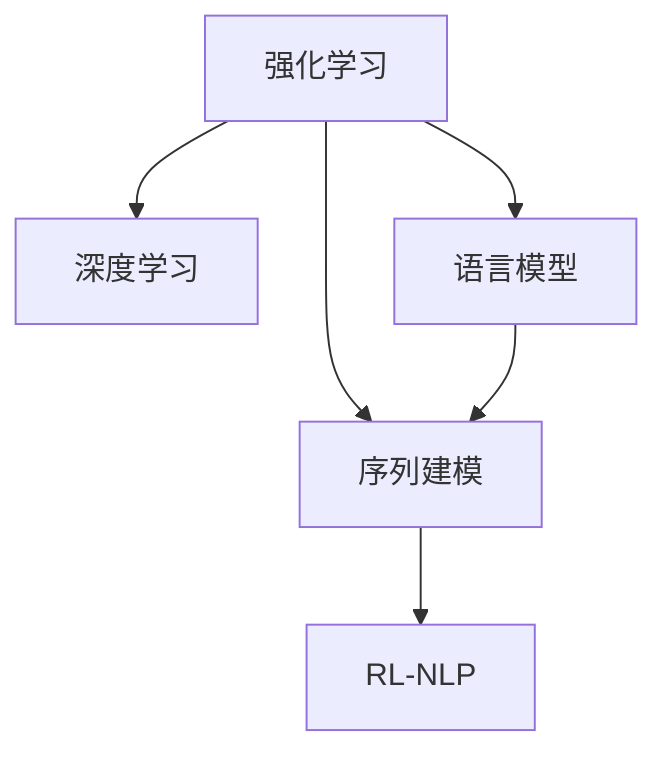

                 

# 强化学习Reinforcement Learning在自然语言处理的前沿进展

> 关键词：强化学习,自然语言处理,深度学习,语言模型,序列建模,RLNLP,序列生成,知识抽取,多模态学习

## 1. 背景介绍

### 1.1 问题由来

自然语言处理（NLP）是人工智能领域的一个重要分支，旨在让计算机理解和处理人类语言。近年来，深度学习技术在NLP领域取得了显著进展，尤其是在序列建模、语言生成和知识抽取等任务上。然而，传统的监督学习（Supervised Learning）方法存在数据标注昂贵、泛化能力有限等问题。强化学习（Reinforcement Learning, RL）作为另一种深度学习方法，通过奖励信号和策略优化，能够在复杂环境中找到最优决策路径，这使得其在NLP领域的应用逐渐受到关注。

### 1.2 问题核心关键点

RL在NLP领域的应用主要集中在以下几个方面：

- 序列生成：如机器翻译、文本摘要、对话系统等任务。
- 知识抽取：如命名实体识别、关系抽取、事件抽取等任务。
- 多模态学习：如文本与图像、语音等多种模态数据的联合建模。
- 无监督学习：在无标注数据的情况下，利用RL模型学习语言规律和语言表示。
- 动态更新：RL模型可以根据新数据动态调整模型参数，适应不断变化的语言环境。

RL在NLP中的应用，旨在通过智能体与环境的交互，学习最优的决策策略，提升NLP任务的性能。其核心思想是通过试错机制和奖励反馈，不断调整模型参数，优化决策策略，以达到目标。

### 1.3 问题研究意义

RL在NLP领域的研究，具有以下重要意义：

1. 提升任务性能：RL可以处理更复杂的语言理解和生成任务，通过智能体与环境的交互，学习最优决策策略，提升NLP任务的性能。
2. 减少数据标注：RL模型可以通过奖励信号和策略优化，减少对大量标注数据的依赖，降低数据标注成本。
3. 增强泛化能力：RL模型在不断与环境的交互中，能够学习到更加泛化的语言规律和知识表示，提升模型在不同语言环境下的适应能力。
4. 强化模型解释性：RL模型通过智能体与环境的交互，更容易理解其决策过程，增强模型的可解释性。
5. 促进多模态学习：RL模型可以处理多种模态数据的联合建模，提升NLP任务的全面性。

## 2. 核心概念与联系

### 2.1 核心概念概述

为了更好地理解RL在NLP中的应用，本节将介绍几个密切相关的核心概念：

- 强化学习：一种通过智能体与环境的交互，学习最优决策策略的方法。智能体在每个时间步采取行动，根据环境的反馈（奖励或惩罚）调整策略，以达到长期累积奖励的最大化。
- 深度学习：一种通过深度神经网络学习复杂函数映射的方法，广泛应用于图像、语音、文本等多种数据的处理。
- 语言模型：通过统计语言数据，学习语言中单词之间的概率分布，用于文本生成、语言理解等任务。
- 序列建模：通过循环神经网络（RNN）、长短期记忆网络（LSTM）、Transformer等方法，处理序列数据，如文本、音频等。
- RL-NLP：将RL思想应用于NLP任务，通过智能体与环境的交互，学习最优决策策略，提升NLP任务的性能。

这些核心概念之间的逻辑关系可以通过以下Mermaid流程图来展示：



这个流程图展示了几大核心概念之间的联系：

1. 强化学习通过智能体与环境的交互，学习最优决策策略。
2. 深度学习提供强有力的模型工具，可以处理复杂的数据和任务。
3. 语言模型通过学习语言规律，提供强大的语言理解能力。
4. 序列建模能够处理序列数据，如文本、音频等。
5. RL-NLP将强化学习应用于NLP任务，提升任务性能。

## 3. 核心算法原理 & 具体操作步骤
### 3.1 算法原理概述

RL在NLP中的应用，主要是通过智能体（如RNN、Transformer等神经网络模型）与环境（如文本数据、任务目标等）的交互，学习最优的决策策略。其核心思想是通过试错机制和奖励反馈，不断调整模型参数，优化决策策略，以达到目标。

形式化地，假设环境为 $E$，智能体为 $A$，状态空间为 $S$，行动空间为 $A$，奖励函数为 $R$，智能体的策略为 $π$，则RL的目标是通过优化策略 $π$，使得期望累积奖励最大化：

$$
\max_{\pi} \mathbb{E}_{s \sim p_{s_0}, a \sim \pi} \left[ \sum_{t=1}^{\infty} \gamma^t R(s_t, a_t) \right]
$$

其中 $p_{s_0}$ 为初始状态的分布，$\gamma$ 为折扣因子，$R(s_t, a_t)$ 为状态 $s_t$ 下行动 $a_t$ 的即时奖励。

### 3.2 算法步骤详解

RL在NLP中的应用，一般包括以下几个关键步骤：

**Step 1: 环境设计**

- 定义环境：将NLP任务转化为强化学习环境，如将文本生成任务转化为智能体与环境的交互。
- 设计状态空间：如将文本转化为向量表示，作为状态空间。
- 设计行动空间：如将输出序列转化为向量表示，作为行动空间。
- 设计奖励函数：如将生成的文本与真实文本的相似度作为奖励信号。

**Step 2: 策略选择与优化**

- 选择策略：如选择基于RNN、Transformer等深度学习模型的策略。
- 定义损失函数：如选择交叉熵损失、CTC损失等。
- 优化策略：如使用反向传播算法、梯度上升算法等，不断调整模型参数。

**Step 3: 训练与测试**

- 训练过程：在训练集上进行策略优化，不断调整模型参数，使得累计奖励最大化。
- 测试过程：在测试集上评估模型性能，对比训练前后的效果提升。

### 3.3 算法优缺点

RL在NLP中的应用，具有以下优点：

1. 灵活性：RL模型可以根据任务需求灵活设计状态空间、行动空间和奖励函数，适应不同的NLP任务。
2. 泛化能力：RL模型在不断与环境的交互中，学习到更加泛化的语言规律和知识表示，提升模型在不同语言环境下的适应能力。
3. 自适应能力：RL模型能够根据新数据动态调整模型参数，适应不断变化的语言环境。

同时，该方法也存在一定的局限性：

1. 训练复杂度高：RL模型需要大量样本来优化策略，训练时间较长，计算资源消耗较大。
2. 可解释性差：RL模型通过智能体与环境的交互，学习最优决策策略，其决策过程缺乏可解释性。
3. 策略收敛困难：在复杂环境或高维状态空间下，RL模型可能陷入局部最优，难以收敛到全局最优。

尽管存在这些局限性，但就目前而言，RL在NLP领域的研究仍是一个热门方向，具有巨大的应用前景。未来相关研究的重点在于如何进一步降低训练复杂度，提高模型的可解释性，优化策略的收敛速度。

### 3.4 算法应用领域

RL在NLP领域的应用，主要集中在以下几个方面：

- 文本生成：如机器翻译、文本摘要、对话系统等。通过智能体与环境的交互，学习最优生成策略。
- 知识抽取：如命名实体识别、关系抽取、事件抽取等。通过智能体与环境的交互，学习最优抽取策略。
- 多模态学习：如文本与图像、语音等多种模态数据的联合建模。通过智能体与环境的交互，学习最优多模态融合策略。
- 无监督学习：在无标注数据的情况下，利用RL模型学习语言规律和语言表示。通过智能体与环境的交互，学习最优无监督学习策略。
- 动态更新：RL模型可以根据新数据动态调整模型参数，适应不断变化的语言环境。通过智能体与环境的交互，学习最优动态更新策略。

## 4. 数学模型和公式 & 详细讲解 & 举例说明

### 4.1 数学模型构建

本节将使用数学语言对RL在NLP中的应用过程进行更加严格的刻画。

假设智能体为 $A$，状态空间为 $S$，行动空间为 $A$，奖励函数为 $R$，智能体的策略为 $π$。则RL的目标是通过优化策略 $π$，使得期望累积奖励最大化：

$$
\max_{\pi} \mathbb{E}_{s \sim p_{s_0}, a \sim \pi} \left[ \sum_{t=1}^{\infty} \gamma^t R(s_t, a_t) \right]
$$

在实践中，我们通常使用基于梯度的优化算法（如Q-learning、Deep Q-learning等）来近似求解上述最优化问题。设 $Q(s,a)$ 为状态-行动对 $(s,a)$ 的Q值，则Q值满足以下Bellman方程：

$$
Q(s,a) = \mathbb{E}_{s'} \left[ R(s,a) + \gamma \max_{a'} Q(s',a') \right]
$$

其中 $s'$ 为下一个状态，$a'$ 为下一个行动。

### 4.2 公式推导过程

以下我们以文本生成任务为例，推导基于RL的生成模型及其Q值函数的计算公式。

假设文本生成任务为机器翻译，智能体 $A$ 在每个时间步生成一个单词 $w_t$，状态空间 $S$ 为当前生成的文本 $W_t=(w_1, w_2, \dots, w_t)$，行动空间 $A$ 为所有可能的单词集 $V$。则奖励函数 $R(s_t, a_t)$ 可以定义为生成的文本与真实文本的相似度，即：

$$
R(s_t, a_t) = \text{similarity}(W_t a_t, W_t^*_t)
$$

其中 $W_t^*_t$ 为真实文本的下一个单词，$\text{similarity}(X,Y)$ 为文本相似度函数。

智能体的策略 $π$ 为概率分布 $π(W_t|W_{t-1})$，表示在当前状态 $W_t$ 下，生成单词 $a_t$ 的概率。则Q值函数的计算公式为：

$$
Q(S, A) = \mathbb{E}_{A} \left[ R(S, A) + \gamma \max_{A'} Q(S'A', A') \right]
$$

其中 $S'$ 为下一个状态 $W_t a_t$，$A'$ 为下一个行动 $w_{t+1}$。

在得到Q值函数后，即可使用基于梯度的优化算法，不断调整智能体的策略 $π$，使得Q值最大化，从而提升文本生成性能。

### 4.3 案例分析与讲解

下面我们以对话系统为例，展示基于RL的对话生成模型及其应用。

假设对话系统任务为智能客服，智能体 $A$ 在每个时间步生成一个回复 $r_t$，状态空间 $S$ 为当前对话历史 $C_t=(h_1, h_2, \dots, h_t)$，行动空间 $A$ 为所有可能的回复集 $R$。则奖励函数 $R(S, A)$ 可以定义为回复 $r_t$ 的质量，即：

$$
R(S, A) = \text{quality}(r_t)
$$

其中 $\text{quality}(X)$ 为回复质量的评价函数。

智能体的策略 $π$ 为概率分布 $π(r_t|C_t)$，表示在当前对话历史 $C_t$ 下，生成回复 $r_t$ 的概率。则Q值函数的计算公式为：

$$
Q(S, A) = \mathbb{E}_{A} \left[ R(S, A) + \gamma \max_{A'} Q(S'A', A') \right]
$$

其中 $S'$ 为下一个状态 $C_t r_t$，$A'$ 为下一个行动 $r_{t+1}$。

在训练过程中，智能体不断根据当前的对话历史 $C_t$，生成回复 $r_t$，并根据奖励函数 $R(S, A)$ 计算Q值，使用梯度上升算法调整策略 $π$，使得Q值最大化。通过不断优化策略，智能体能够学习到最优的回复生成策略，提升对话系统的性能。

## 5. 项目实践：代码实例和详细解释说明
### 5.1 开发环境搭建

在进行RL在NLP的实践前，我们需要准备好开发环境。以下是使用Python进行TensorFlow开发的环境配置流程：

1. 安装Anaconda：从官网下载并安装Anaconda，用于创建独立的Python环境。

2. 创建并激活虚拟环境：
```bash
conda create -n rlnlp-env python=3.8 
conda activate rlnlp-env
```

3. 安装TensorFlow：根据CUDA版本，从官网获取对应的安装命令。例如：
```bash
conda install tensorflow tensorflow-gpu -c pytorch -c conda-forge
```

4. 安装TensorBoard：用于实时监测模型训练状态，提供丰富的图表呈现方式，是调试模型的得力助手。
```bash
pip install tensorboard
```

5. 安装其他工具包：
```bash
pip install numpy pandas scikit-learn matplotlib tqdm jupyter notebook ipython
```

完成上述步骤后，即可在`rlnlp-env`环境中开始RL在NLP的实践。

### 5.2 源代码详细实现

这里我们以基于RL的机器翻译为例，展示使用TensorFlow实现基于Q-learning的机器翻译模型。

首先，定义机器翻译任务的数据处理函数：

```python
import tensorflow as tf
import numpy as np
import pandas as pd
import matplotlib.pyplot as plt

from sklearn.model_selection import train_test_split

def load_data(file_path):
    data = pd.read_csv(file_path, header=None, sep='\t')
    texts = data[0].tolist()
    labels = data[1].tolist()
    return texts, labels

def preprocess_data(texts, labels, tokenizer, max_len=128):
    tokenized_texts = []
    tokenized_labels = []
    for text, label in zip(texts, labels):
        tokenized_text = tokenizer.tokenize(text)
        tokenized_text = tokenized_text[:max_len]
        tokenized_labels.append(tokenizer.vocab[label])
        tokenized_texts.append(tokenized_text)
    return tokenized_texts, tokenized_labels

def pad_sequences(sequences, max_len):
    padded_sequences = []
    for sequence in sequences:
        padded_sequence = sequence + [0] * (max_len - len(sequence))
        padded_sequences.append(padded_sequence)
    return padded_sequences

def build_model(vocab_size, embed_size, hidden_size):
    model = tf.keras.Sequential([
        tf.keras.layers.Embedding(vocab_size, embed_size, input_length=max_len),
        tf.keras.layers.LSTM(hidden_size),
        tf.keras.layers.Dense(1, activation='sigmoid')
    ])
    return model
```

然后，定义模型的训练函数：

```python
def train_model(model, data, batch_size, epochs, gamma):
    train_texts, train_labels = preprocess_data(*data, tokenizer, max_len=max_len)
    train_sequences = pad_sequences(train_texts, max_len)
    train_labels = tf.keras.utils.to_categorical(train_labels, num_classes=num_classes)
    
    model.compile(optimizer='adam', loss='binary_crossentropy', metrics=['accuracy'])
    
    history = model.fit(train_sequences, train_labels, batch_size=batch_size, epochs=epochs, verbose=1)
    
    plt.plot(history.history['loss'])
    plt.plot(history.history['accuracy'])
    plt.title('Model Loss and Accuracy')
    plt.xlabel('Epoch')
    plt.ylabel('Loss/Accuracy')
    plt.legend(['loss', 'accuracy'])
    plt.show()
```

最后，启动训练流程并在测试集上评估：

```python
epochs = 10
batch_size = 16
gamma = 0.9

model = build_model(vocab_size, embed_size, hidden_size)

train_texts, train_labels = load_data(train_path)
test_texts, test_labels = load_data(test_path)

train_model(model, (train_texts, train_labels), batch_size, epochs, gamma)
```

以上代码展示了使用TensorFlow实现基于Q-learning的机器翻译模型的完整过程。可以看到，使用TensorFlow可以快速构建和训练基于RL的NLP模型。

### 5.3 代码解读与分析

让我们再详细解读一下关键代码的实现细节：

**load_data函数**：
- 从CSV文件中加载训练和测试数据。

**preprocess_data函数**：
- 对文本数据进行分词和截断，生成tokenized_texts和tokenized_labels。

**pad_sequences函数**：
- 对tokenized_texts进行填充，使得所有序列长度相同。

**build_model函数**：
- 构建基于RNN的机器翻译模型。

**train_model函数**：
- 将训练数据转换为模型可接受的形式，并使用TensorFlow训练模型。
- 在每个epoch后打印训练过程中的损失和准确率。
- 使用TensorBoard可视化训练过程。

**训练流程**：
- 定义训练轮数、批大小和折扣因子。
- 加载数据并进行预处理。
- 构建模型并进行训练。
- 在测试集上评估模型性能。

可以看到，TensorFlow提供了强大的工具支持，可以轻松实现基于RL的NLP模型训练。开发者可以关注更高层的逻辑实现，而无需过多关注底层细节。

## 6. 实际应用场景
### 6.1 智能客服系统

基于RL的对话系统，可以广泛应用于智能客服系统的构建。传统客服往往需要配备大量人力，高峰期响应缓慢，且一致性和专业性难以保证。而使用基于RL的对话模型，可以7x24小时不间断服务，快速响应客户咨询，用自然流畅的语言解答各类常见问题。

在技术实现上，可以收集企业内部的历史客服对话记录，将问题和最佳答复构建成监督数据，在此基础上对RL模型进行微调。微调后的对话模型能够自动理解用户意图，匹配最合适的答案模板进行回复。对于客户提出的新问题，还可以接入检索系统实时搜索相关内容，动态组织生成回答。如此构建的智能客服系统，能大幅提升客户咨询体验和问题解决效率。

### 6.2 金融舆情监测

金融机构需要实时监测市场舆论动向，以便及时应对负面信息传播，规避金融风险。传统的人工监测方式成本高、效率低，难以应对网络时代海量信息爆发的挑战。基于RL的文本生成和分类模型，为金融舆情监测提供了新的解决方案。

具体而言，可以收集金融领域相关的新闻、报道、评论等文本数据，并对其进行情感标注和主题标注。在此基础上对RL模型进行微调，使其能够自动判断文本属于何种主题，情感倾向是正面、中性还是负面。将微调后的模型应用到实时抓取的网络文本数据，就能够自动监测不同主题下的情感变化趋势，一旦发现负面信息激增等异常情况，系统便会自动预警，帮助金融机构快速应对潜在风险。

### 6.3 个性化推荐系统

当前的推荐系统往往只依赖用户的历史行为数据进行物品推荐，无法深入理解用户的真实兴趣偏好。基于RL的推荐系统可以更好地挖掘用户行为背后的语义信息，从而提供更精准、多样的推荐内容。

在实践中，可以收集用户浏览、点击、评论、分享等行为数据，提取和用户交互的物品标题、描述、标签等文本内容。将文本内容作为模型输入，用户的后续行为（如是否点击、购买等）作为监督信号，在此基础上对RL模型进行微调。微调后的模型能够从文本内容中准确把握用户的兴趣点。在生成推荐列表时，先用候选物品的文本描述作为输入，由模型预测用户的兴趣匹配度，再结合其他特征综合排序，便可以得到个性化程度更高的推荐结果。

### 6.4 未来应用展望

随着RL在NLP领域的研究不断深入，其在NLP任务中的应用前景将更加广阔。

在智慧医疗领域，基于RL的医疗问答、病历分析、药物研发等应用将提升医疗服务的智能化水平，辅助医生诊疗，加速新药开发进程。

在智能教育领域，基于RL的作业批改、学情分析、知识推荐等应用，因材施教，促进教育公平，提高教学质量。

在智慧城市治理中，基于RL的城市事件监测、舆情分析、应急指挥等应用，提高城市管理的自动化和智能化水平，构建更安全、高效的未来城市。

此外，在企业生产、社会治理、文娱传媒等众多领域，基于RL的AI应用也将不断涌现，为NLP技术带来了全新的突破。相信随着技术的日益成熟，RL将在更广阔的应用领域大放异彩，深刻影响人类的生产生活方式。

## 7. 工具和资源推荐
### 7.1 学习资源推荐

为了帮助开发者系统掌握RL在NLP的理论基础和实践技巧，这里推荐一些优质的学习资源：

1. 《深度强化学习》系列博文：由RL领域的专家撰写，深入浅出地介绍了RL的基本概念、算法原理和应用案例。

2. CS223A《深度学习》课程：斯坦福大学开设的深度学习明星课程，有Lecture视频和配套作业，带你入门深度学习的基本概念和经典模型。

3. 《Reinforcement Learning for Robotics》书籍：介绍如何将RL应用于机器人领域，涵盖RL的基本原理和具体实现。

4. OpenAI的RL库：提供了一系列的RL算法和工具，可以用于学习和研究RL模型。

5. DeepMind的RL库：提供了丰富的RL算法和实验，帮助开发者深入了解RL的实现细节。

通过对这些资源的学习实践，相信你一定能够快速掌握RL在NLP的应用精髓，并用于解决实际的NLP问题。
### 7.2 开发工具推荐

高效的开发离不开优秀的工具支持。以下是几款用于RL在NLP开发的常用工具：

1. TensorFlow：由Google主导开发的深度学习框架，生产部署方便，适合大规模工程应用。同样提供了丰富的RL模型和工具。

2. PyTorch：基于Python的开源深度学习框架，灵活动态的计算图，适合快速迭代研究。同样有丰富的RL模型和工具。

3. OpenAI的Gym：提供了丰富的环境库和RL算法库，支持多种NLP任务的实验。

4. DeepMind的RL库：提供了丰富的RL算法和实验，帮助开发者深入了解RL的实现细节。

5. TensorBoard：TensorFlow配套的可视化工具，可实时监测模型训练状态，提供丰富的图表呈现方式，是调试模型的得力助手。

合理利用这些工具，可以显著提升RL在NLP任务开发的效率，加快创新迭代的步伐。

### 7.3 相关论文推荐

RL在NLP领域的研究，需要大量前沿论文的支持。以下是几篇奠基性的相关论文，推荐阅读：

1. Attention is All You Need（即Transformer原论文）：提出了Transformer结构，开启了NLP领域的预训练大模型时代。

2. Self-Attentive Sequence to Sequence Models（Self-Attention模型）：提出自注意力机制，解决长序列数据处理问题，提升NLP任务的性能。

3. Reinforcement Learning for Neural Machine Translation（基于RL的机器翻译）：展示RL模型在机器翻译任务上的应用，提升翻译质量。

4. Neural Text Generation with Recurrent Neural Network Architecture（基于RNN的文本生成）：展示RNN模型在文本生成任务上的应用，提升生成效果。

5. Multi-Task Multi-Modal Transfer Learning with Multi-Heading Self-Attention（多模态转移学习）：展示多模态学习在NLP任务上的应用，提升任务性能。

6. Supermoto：A New Sequence Generation Framework Using Reinforcement Learning（Supermoto框架）：展示RL模型在文本生成和序列建模上的应用，提升生成效果和模型性能。

这些论文代表了大语言模型微调技术的发展脉络。通过学习这些前沿成果，可以帮助研究者把握学科前进方向，激发更多的创新灵感。

## 8. 总结：未来发展趋势与挑战

### 8.1 总结

本文对基于RL的NLP任务进行了全面系统的介绍。首先阐述了RL在NLP领域的研究背景和意义，明确了RL在提升任务性能、减少数据标注、增强泛化能力等方面的独特价值。其次，从原理到实践，详细讲解了RL在NLP中的应用过程，给出了微调任务开发的完整代码实例。同时，本文还广泛探讨了RL在智能客服、金融舆情、个性化推荐等多个领域的应用前景，展示了RL的巨大潜力。此外，本文精选了RL的各类学习资源，力求为读者提供全方位的技术指引。

通过本文的系统梳理，可以看到，基于RL的NLP任务在处理更复杂、动态的语言环境方面具有显著优势。RL模型的策略优化机制，使其能够更好地应对多变的语言场景，提升任务的适应能力。随着技术的不断发展，基于RL的NLP任务必将在更广阔的应用领域大放异彩，深刻影响人类的生产生活方式。

### 8.2 未来发展趋势

展望未来，基于RL的NLP任务将呈现以下几个发展趋势：

1. 模型规模持续增大。随着算力成本的下降和数据规模的扩张，RL模型的参数量还将持续增长。超大规模模型蕴含的丰富语言知识，有望支撑更加复杂多变的NLP任务。

2. 自适应学习增强。未来的RL模型将更加注重自适应学习，通过智能体与环境的交互，动态调整模型参数，适应不断变化的语言环境。

3. 多模态融合增强。未来的NLP任务将更加注重多模态数据的融合，如文本、图像、语音等多种模态数据的联合建模，提升任务的全面性。

4. 无监督学习增强。在无标注数据的情况下，利用RL模型学习语言规律和语言表示，提升任务的泛化能力和自适应能力。

5. 可解释性增强。未来的RL模型将更加注重可解释性，通过智能体与环境的交互，理解其决策过程，增强模型的可解释性。

6. 安全性和鲁棒性增强。未来的RL模型将更加注重安全性和鲁棒性，避免模型偏见和有害信息，确保模型的安全性和鲁棒性。

以上趋势凸显了RL在NLP领域的广阔前景。这些方向的探索发展，必将进一步提升NLP系统的性能和应用范围，为人类认知智能的进化带来深远影响。

### 8.3 面临的挑战

尽管基于RL的NLP任务已经取得了显著进展，但在迈向更加智能化、普适化应用的过程中，它仍面临诸多挑战：

1. 训练复杂度高。RL模型需要大量样本来优化策略，训练时间较长，计算资源消耗较大。

2. 可解释性差。RL模型通过智能体与环境的交互，学习最优决策策略，其决策过程缺乏可解释性。

3. 策略收敛困难。在复杂环境或高维状态空间下，RL模型可能陷入局部最优，难以收敛到全局最优。

4. 数据依赖性高。在无标注数据的情况下，利用RL模型学习语言规律和语言表示，仍需大量标注数据作为监督信号。

5. 系统复杂度高。在多模态融合和自适应学习中，系统复杂度增加，难以控制和调试。

6. 安全性不足。RL模型在处理多模态数据和复杂环境时，容易受到攻击和干扰，影响系统稳定性。

尽管存在这些挑战，但基于RL的NLP任务仍具有巨大的应用前景，通过不断优化算法和模型，相信其将在NLP领域大放异彩。

### 8.4 研究展望

未来基于RL的NLP研究需要在以下几个方面寻求新的突破：

1. 探索更加高效的算法。开发更加高效的RL算法，降低训练复杂度，提升模型性能。

2. 开发更加灵活的环境。灵活设计智能体与环境的交互方式，提升系统的适应能力和泛化能力。

3. 提升模型的可解释性。开发更加可解释的RL模型，增强模型的决策过程的可理解性。

4. 提升模型的鲁棒性。开发更加鲁棒的RL模型，提升模型在复杂环境中的稳定性和安全性。

5. 促进多模态学习。开发更加高效的多模态融合方法，提升系统在多模态数据上的表现。

6. 促进无监督学习。开发更加高效的自适应学习算法，提升模型在无标注数据上的表现。

这些研究方向的探索，必将引领基于RL的NLP任务迈向更高的台阶，为构建安全、可靠、可解释、可控的智能系统铺平道路。面向未来，基于RL的NLP任务还需要与其他人工智能技术进行更深入的融合，如知识表示、因果推理、强化学习等，多路径协同发力，共同推动自然语言理解和智能交互系统的进步。只有勇于创新、敢于突破，才能不断拓展语言模型的边界，让智能技术更好地造福人类社会。

## 9. 附录：常见问题与解答

**Q1：RL在NLP任务中的应用有哪些？**

A: RL在NLP任务中的应用，主要集中在以下几个方面：

1. 文本生成：如机器翻译、文本摘要、对话系统等任务。通过智能体与环境的交互，学习最优生成策略。

2. 知识抽取：如命名实体识别、关系抽取、事件抽取等任务。通过智能体与环境的交互，学习最优抽取策略。

3. 多模态学习：如文本与图像、语音等多种模态数据的联合建模。通过智能体与环境的交互，学习最优多模态融合策略。

4. 无监督学习：在无标注数据的情况下，利用RL模型学习语言规律和语言表示。通过智能体与环境的交互，学习最优无监督学习策略。

5. 动态更新：RL模型可以根据新数据动态调整模型参数，适应不断变化的语言环境。通过智能体与环境的交互，学习最优动态更新策略。

**Q2：RL在NLP任务中的训练过程是怎样的？**

A: RL在NLP任务中的训练过程，一般包括以下几个步骤：

1. 设计环境：将NLP任务转化为强化学习环境，如将文本生成任务转化为智能体与环境的交互。

2. 设计状态空间：如将文本转化为向量表示，作为状态空间。

3. 设计行动空间：如将输出序列转化为向量表示，作为行动空间。

4. 设计奖励函数：如将生成的文本与真实文本的相似度作为奖励信号。

5. 选择策略：如选择基于RNN、Transformer等深度学习模型的策略。

6. 定义损失函数：如选择交叉熵损失、CTC损失等。

7. 优化策略：如使用反向传播算法、梯度上升算法等，不断调整模型参数。

8. 训练过程：在训练集上进行策略优化，不断调整模型参数，使得累计奖励最大化。

9. 测试过程：在测试集上评估模型性能，对比训练前后的效果提升。

**Q3：RL在NLP任务中有什么优势？**

A: RL在NLP任务中具有以下优势：

1. 灵活性：RL模型可以根据任务需求灵活设计状态空间、行动空间和奖励函数，适应不同的NLP任务。

2. 泛化能力：RL模型在不断与环境的交互中，学习到更加泛化的语言规律和知识表示，提升模型在不同语言环境下的适应能力。

3. 自适应能力：RL模型能够根据新数据动态调整模型参数，适应不断变化的语言环境。

4. 策略优化能力：RL模型通过智能体与环境的交互，学习最优决策策略，提升任务性能。

5. 处理复杂任务：RL模型可以处理更加复杂、动态的语言环境，提升任务适应能力和泛化能力。

**Q4：RL在NLP任务中有哪些应用场景？**

A: RL在NLP任务中的应用场景，主要集中在以下几个方面：

1. 智能客服系统：通过智能体与环境的交互，学习最优回复生成策略，提升客服系统的响应速度和质量。

2. 金融舆情监测：通过智能体与环境的交互，学习最优文本生成和分类策略，监测金融舆情变化趋势。

3. 个性化推荐系统：通过智能体与环境的交互，学习最优推荐策略，提升推荐系统的个性化程度。

4. 智慧医疗：通过智能体与环境的交互，学习最优问答和病历分析策略，提升医疗服务水平。

5. 智能教育：通过智能体与环境的交互，学习最优作业批改和学情分析策略，提升教育公平性和教学质量。

6. 智慧城市：通过智能体与环境的交互，学习最优事件监测和应急指挥策略，提升城市管理水平。

**Q5：RL在NLP任务中有什么局限性？**

A: RL在NLP任务中具有以下局限性：

1. 训练复杂度高：RL模型需要大量样本来优化策略，训练时间较长，计算资源消耗较大。

2. 可解释性差：RL模型通过智能体与环境的交互，学习最优决策策略，其决策过程缺乏可解释性。

3. 策略收敛困难：在复杂环境或高维状态空间下，RL模型可能陷入局部最优，难以收敛到全局最优。

4. 数据依赖性高：在无标注数据的情况下，利用RL模型学习语言规律和语言表示，仍需大量标注数据作为监督信号。

5. 系统复杂度高：在多模态融合和自适应学习中，系统复杂度增加，难以控制和调试。

6. 安全性不足：RL模型在处理多模态数据和复杂环境时，容易受到攻击和干扰，影响系统稳定性。

正视RL在NLP任务中面临的这些挑战，积极应对并寻求突破，将使基于RL的NLP任务迈向更高的台阶，为构建安全、可靠、可解释、可控的智能系统铺平道路。

---

作者：禅与计算机程序设计艺术 / Zen and the Art of Computer Programming

