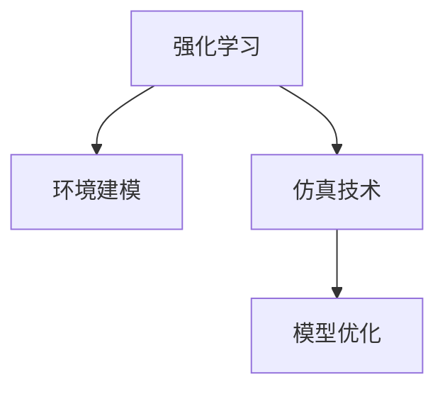

                 

# 强化学习Reinforcement Learning环境建模与仿真技术探讨

> 关键词：强化学习,环境建模,仿真技术,深度强化学习,深度学习,深度强化学习,学习理论,模型优化

## 1. 背景介绍

### 1.1 问题由来
近年来，强化学习(Reinforcement Learning, RL)在多智能体系统、自动驾驶、机器人控制、游戏AI等领域取得了巨大的成功。强化学习通过智能体与环境不断交互，学习最优策略以最大化预期奖励，具有泛化能力强、适应性广的特点。

然而，实际环境往往复杂且难以精确建模，导致传统强化学习算法难以直接应用于现实问题。为了解决这一问题，研究者们提出了环境建模与仿真技术，通过近似环境的数学模型，生成高质量的环境模拟数据，为强化学习算法提供训练和测试平台。

### 1.2 问题核心关键点
强化学习环境建模与仿真是智能体与复杂环境交互的关键环节，其核心在于如何构建与现实环境相匹配的数学模型，并生成可靠的环境仿真数据。具体来说，以下几个方面是研究的重点：

- 环境建模：构建环境的数学模型，描述环境状态、行动空间、奖励函数等关键属性。
- 仿真技术：通过生成的环境模型，随机生成仿真数据供强化学习算法训练使用。
- 模型优化：对环境模型进行优化，提高模型的准确度和泛化能力。

## 2. 核心概念与联系

### 2.1 核心概念概述

为更好地理解强化学习环境建模与仿真技术，本节将介绍几个密切相关的核心概念：

- 强化学习(Reinforcement Learning, RL)：通过智能体与环境交互，学习最优策略以最大化预期奖励的机器学习方法。
- 环境建模(Environment Modeling)：构建环境的数学模型，描述环境状态、行动空间、奖励函数等关键属性。
- 仿真技术(Simulation)：通过环境模型，随机生成环境模拟数据，供算法训练和测试。
- 深度强化学习(Deep Reinforcement Learning, DRL)：结合深度学习，利用神经网络模型学习环境状态表示和最优策略。
- 学习理论(Learning Theory)：研究强化学习算法理论基础的学科，包括模型预测、学习效率等。
- 模型优化(Model Optimization)：通过调整环境模型参数，提高模型的准确度和泛化能力。

这些概念之间的逻辑关系可以通过以下Mermaid流程图来展示：



这个流程图展示出各个核心概念之间的联系：

1. 强化学习是研究主体，通过智能体与环境交互学习最优策略。
2. 环境建模描述环境属性，是仿真技术的基础。
3. 仿真技术通过环境模型生成模拟数据，供强化学习训练。
4. 模型优化提高环境模型精度和泛化能力。

这些概念共同构成了强化学习环境建模与仿真的技术框架，使得复杂环境能够被算法理解和优化。

## 3. 核心算法原理 & 具体操作步骤
### 3.1 算法原理概述

强化学习环境建模与仿真的核心在于构建与现实环境相似的环境模型，并利用该模型生成仿真数据。具体来说，可以分为以下几个步骤：

1. **环境建模**：构建环境的数学模型，描述环境状态、行动空间和奖励函数。
2. **仿真技术**：利用模型生成仿真数据，供算法训练和测试。
3. **模型优化**：优化环境模型，提高其准确度和泛化能力。

### 3.2 算法步骤详解

#### 3.2.1 环境建模

环境建模是强化学习环境建模与仿真的基础。以下详细介绍环境建模的关键步骤：

1. **状态空间建模**：定义环境的状态空间，描述环境可观测的状态属性。状态空间可以是一个高维向量，也可以是一个图形结构，如图网络。
2. **行动空间建模**：定义环境的行动空间，描述智能体可以采取的操作。行动空间可以是连续空间（如机械臂），也可以是离散空间（如按钮、开关）。
3. **奖励函数建模**：定义奖励函数，描述智能体执行行动后获得的即时奖励。奖励函数可以是简单的线性函数，也可以是多层次的结构函数。

#### 3.2.2 仿真技术

仿真技术通过生成仿真数据，供强化学习算法训练和测试。以下详细介绍仿真技术的关键步骤：

1. **随机采样**：从状态空间中随机采样初始状态。
2. **执行行动**：根据智能体的策略执行行动，更新环境状态。
3. **计算奖励**：根据执行的行动和环境状态，计算获得的即时奖励。
4. **环境更新**：更新环境状态，模拟下一轮交互。
5. **数据生成**：生成包含状态、行动、奖励的多批次数据，供算法训练和测试。

#### 3.2.3 模型优化

模型优化通过调整环境模型参数，提高模型的准确度和泛化能力。以下详细介绍模型优化的关键步骤：

1. **参数设置**：确定环境模型的初始参数。
2. **训练优化**：使用监督学习或无监督学习方法训练模型参数，优化模型性能。
3. **模型验证**：在验证集上评估模型性能，选择最优模型参数。
4. **泛化优化**：在测试集上进一步验证模型泛化能力，调整模型参数。

### 3.3 算法优缺点

强化学习环境建模与仿真技术具有以下优点：

1. **高效训练**：仿真技术可以生成大量环境数据，加快算法训练速度。
2. **泛化能力**：通过环境建模，能够适应不同类型的环境，提高算法的泛化能力。
3. **可控性**：环境建模和仿真技术可以在虚拟环境中进行试验，提高算法的可控性和可重复性。
4. **安全性**：在虚拟环境中进行训练，可以避免真实环境中的潜在风险，提高安全性。

同时，该技术也存在一定的局限性：

1. **模型精度**：环境模型难以精确匹配现实环境，可能会引入模型误差。
2. **仿真速度**：仿真技术的运行速度较慢，可能会限制算法的迭代速度。
3. **多样性**：仿真数据可能缺乏多样性，无法涵盖所有可能的环境情况。

尽管存在这些局限性，但就目前而言，强化学习环境建模与仿真技术仍是智能体与复杂环境交互的重要手段。未来相关研究的重点在于如何进一步提高模型精度和仿真效率，同时兼顾多样性和可解释性等因素。

### 3.4 算法应用领域

强化学习环境建模与仿真技术已经在多个领域得到了应用，例如：

- 自动驾驶：通过模拟交通环境，训练自动驾驶算法以应对各种复杂场景。
- 机器人控制：构建虚拟机械臂环境，训练机器人执行复杂动作和任务。
- 游戏AI：生成游戏环境，训练游戏AI算法以获得最佳游戏策略。
- 工业控制：模拟工业生产流程，优化生产策略和控制方案。
- 金融模拟：构建金融市场环境，训练金融算法以优化投资策略。
- 虚拟现实：创建虚拟现实场景，增强用户体验和互动性。

除了上述这些经典应用外，强化学习环境建模与仿真技术也被创新性地应用到更多场景中，如城市交通仿真、农业自动化、社交网络分析等，为各行业的智能化升级提供了新的技术路径。

## 4. 数学模型和公式 & 详细讲解 & 举例说明（备注：数学公式请使用latex格式，latex嵌入文中独立段落使用 $$，段落内使用 $)
### 4.1 数学模型构建

以下详细介绍强化学习环境建模与仿真的数学模型：

1. **状态空间建模**：
   - 状态空间可以是一个高维向量 $\mathbf{x} \in \mathcal{X}$，也可以是一个图形结构，如图网络。
   - 状态空间中的每个元素表示环境的一个属性，如位置、速度、颜色等。

2. **行动空间建模**：
   - 行动空间可以是连续空间，如 $\mathbf{a} \in \mathbb{R}^n$。
   - 行动空间也可以是离散空间，如 $\mathbf{a} \in \{1, 2, 3, \ldots, k\}$。

3. **奖励函数建模**：
   - 奖励函数 $r(\mathbf{s}, \mathbf{a}) \in \mathbb{R}$，其中 $\mathbf{s}$ 表示当前状态，$\mathbf{a}$ 表示执行的行动。
   - 奖励函数可以是一个简单的线性函数，如 $r(\mathbf{s}, \mathbf{a}) = c_1 \mathbf{s}_1 + c_2 \mathbf{s}_2 + \ldots + c_n \mathbf{s}_n$。
   - 奖励函数也可以是多层次的结构函数，如 $r(\mathbf{s}, \mathbf{a}) = f(\mathbf{s}, \mathbf{a}, \mathbf{s}'(\mathbf{s}, \mathbf{a}))$，其中 $\mathbf{s}'(\mathbf{s}, \mathbf{a})$ 表示执行行动后的下一个状态。

### 4.2 公式推导过程

以下推导一个简单的强化学习环境建模与仿真案例，以说明上述数学模型的应用：

假设一个机器人控制问题，其中状态空间为 $\mathbf{s} \in \mathbb{R}^2$，表示机器人在二维平面上的位置。行动空间为 $\mathbf{a} \in \{1, 2, 3\}$，表示机器人向左、右、前移动。奖励函数为 $r(\mathbf{s}, \mathbf{a}) = -|\mathbf{s}|^2$，其中 $|\mathbf{s}|$ 表示当前位置与目标位置之间的距离。

在强化学习环境中，智能体通过执行行动 $\mathbf{a}$，观察环境状态 $\mathbf{s}'(\mathbf{s}, \mathbf{a})$，并获得即时奖励 $r(\mathbf{s}, \mathbf{a})$。智能体的目标是通过学习最优策略，最大化预期奖励。

使用蒙特卡洛方法，从当前状态 $\mathbf{s}_t$ 开始，智能体执行行动 $\mathbf{a}_t$，观察下一个状态 $\mathbf{s}_{t+1}$，并获得即时奖励 $r_t$。通过迭代执行多个步骤，智能体可以逐步学习到最优策略，最终达到目标位置。

### 4.3 案例分析与讲解

以下分析一个具体的强化学习环境建模与仿真案例，以说明其应用和效果：

假设一个智能体在二维平面上，需要从起点 $(0,0)$ 到达终点 $(10,10)$，路径上存在障碍物。智能体可以执行向左、向右、向前三种行动，奖励函数为 $r(\mathbf{s}, \mathbf{a}) = -|\mathbf{s}|^2$，其中 $|\mathbf{s}|$ 表示当前位置与目标位置之间的距离。

使用强化学习环境建模与仿真技术，可以通过以下步骤生成仿真数据：

1. **环境建模**：定义状态空间 $\mathbf{s} \in \mathbb{R}^2$，行动空间 $\mathbf{a} \in \{1, 2, 3\}$，奖励函数 $r(\mathbf{s}, \mathbf{a}) = -|\mathbf{s}|^2$。

2. **仿真技术**：随机生成起点 $(0,0)$，执行行动 $\mathbf{a}_t$，更新状态 $\mathbf{s}_{t+1}$，获得即时奖励 $r_t$。

3. **模型优化**：使用蒙特卡洛方法，模拟智能体从起点到终点的路径，计算每个步骤的平均奖励。

通过仿真技术生成的仿真数据，智能体可以在虚拟环境中进行学习和训练。智能体通过不断执行行动，观察状态和奖励，逐步学习到最优策略，最终达到目标位置。

## 5. 项目实践：代码实例和详细解释说明
### 5.1 开发环境搭建

在进行强化学习环境建模与仿真实践前，我们需要准备好开发环境。以下是使用Python进行Gym和PyBullet的开发环境配置流程：

1. 安装Anaconda：从官网下载并安装Anaconda，用于创建独立的Python环境。

2. 创建并激活虚拟环境：
```bash
conda create -n reinforcement-env python=3.8 
conda activate reinforcement-env
```

3. 安装Gym和PyBullet：
```bash
conda install gym pybullet pybullet pybullet-data
```

4. 安装各类工具包：
```bash
pip install numpy pandas scikit-learn matplotlib tqdm jupyter notebook ipython
```

完成上述步骤后，即可在`reinforcement-env`环境中开始强化学习环境建模与仿真实践。

### 5.2 源代码详细实现

这里我们以一个简单的Python代码示例，展示如何使用Gym库构建和测试一个强化学习环境。

首先，定义一个简单的环境类 `MyEnvironment`：

```python
import gym
from gym import spaces

class MyEnvironment(gym.Env):
    def __init__(self):
        super(MyEnvironment, self).__init__()
        self.state = (0, 0)
        self.action_space = spaces.Discrete(3)
        self.observation_space = spaces.Box(low=0, high=1, shape=(2,), dtype=np.float32)
    
    def step(self, action):
        if action == 0:  # left
            self.state = (self.state[0] - 1, self.state[1])
        elif action == 1:  # right
            self.state = (self.state[0] + 1, self.state[1])
        elif action == 2:  # up
            self.state = (self.state[0], self.state[1] + 1)
        reward = -self.state[0]**2 - self.state[1]**2
        done = self.state[0] == 10 and self.state[1] == 10
        return self.state, reward, done, {}
    
    def reset(self):
        self.state = (0, 0)
        return self.state, {}
    
    def render(self, mode='human'):
        return self.state
    
    def seed(self, seed=None):
        pass
```

然后，定义训练函数：

```python
import numpy as np
from gym import wrappers

env = MyEnvironment()
env.seed(42)
np.random.seed(42)

for episode in range(100):
    state = env.reset()
    total_reward = 0
    done = False
    while not done:
        action = np.random.choice(env.action_space.n)
        state, reward, done, _ = env.step(action)
        total_reward += reward
    print(f"Episode {episode+1}, Reward: {total_reward:.2f}")
```

最后，在Python代码中加载和测试环境：

```python
import gym
import numpy as np
from gym import wrappers

env = gym.make('MyEnvironment-v0')
env.seed(42)
np.random.seed(42)

for episode in range(100):
    state = env.reset()
    total_reward = 0
    done = False
    while not done:
        action = np.random.choice(env.action_space.n)
        state, reward, done, _ = env.step(action)
        total_reward += reward
    print(f"Episode {episode+1}, Reward: {total_reward:.2f}")
```

以上就是使用Python和Gym库进行强化学习环境建模与仿真的完整代码实现。可以看到，通过Gym库，可以方便地定义和测试各种类型的强化学习环境，并使用PyBullet等工具进行可视化展示。

### 5.3 代码解读与分析

让我们再详细解读一下关键代码的实现细节：

**MyEnvironment类**：
- `__init__`方法：初始化状态、行动空间、观察空间等关键属性。
- `step`方法：执行行动，观察状态，计算奖励，判断是否到达目标状态。
- `reset`方法：重置环境状态。
- `render`方法：可视化环境状态。
- `seed`方法：设置随机种子。

**训练函数**：
- 使用Gym库创建环境对象 `env`。
- 设置随机种子，确保实验可重复性。
- 循环执行多个 episode，随机选择行动，观察状态和奖励。
- 计算每个 episode 的平均奖励，并打印输出。

通过以上代码，我们可以对强化学习环境建模与仿真技术进行初步实践。需要注意的是，实际的强化学习问题往往更复杂，需要结合更多实际环境属性和仿真技术进行建模和测试。

## 6. 实际应用场景
### 6.1 自动驾驶

强化学习环境建模与仿真技术在自动驾驶领域有着广泛的应用前景。自动驾驶系统需要在复杂的城市道路上进行驾驶，面临诸如行人、车辆、信号灯等多种动态因素。

通过构建精确的环境模型，并生成大量仿真数据，自动驾驶系统可以在虚拟环境中进行学习和测试。例如，使用PyBullet库模拟道路、车辆、行人等元素，生成丰富的道路交通环境，供自动驾驶算法进行训练。智能体通过不断执行驾驶策略，观察道路状态和奖励，逐步学习到最优驾驶策略，最终在实际道路上进行部署。

### 6.2 机器人控制

机器人控制是强化学习环境建模与仿真技术的另一大应用场景。机器人在工业生产、家庭服务等领域有着广泛的应用，其动作执行和环境互动过程复杂多变。

通过构建机器人控制环境的数学模型，并生成仿真数据，机器人控制系统可以在虚拟环境中进行训练和优化。例如，使用PyBullet库模拟机械臂，定义状态空间、行动空间和奖励函数，生成机械臂控制环境的仿真数据。智能体通过不断执行机械臂动作，观察机械臂状态和奖励，逐步学习到最优机械臂控制策略，最终在实际机械臂上执行复杂的任务。

### 6.3 游戏AI

游戏AI是强化学习环境建模与仿真技术的典型应用场景。游戏AI需要根据游戏规则和玩家行为，学习最优的游戏策略，以获得最佳游戏成绩。

通过构建游戏环境的数学模型，并生成仿真数据，游戏AI可以在虚拟环境中进行学习和测试。例如，使用Gym库模拟游戏环境，定义状态空间、行动空间和奖励函数，生成游戏环境的仿真数据。智能体通过不断执行游戏策略，观察游戏状态和奖励，逐步学习到最优游戏策略，最终在游戏中取得优异成绩。

### 6.4 未来应用展望

随着强化学习环境建模与仿真技术的不断发展，其应用范围将不断拓展，为各行业的智能化升级提供新的技术路径。

在智慧城市治理中，强化学习环境建模与仿真技术可以用于城市交通仿真、环境保护、能源管理等领域。通过构建城市环境的数学模型，并生成仿真数据，智能系统可以在虚拟环境中进行训练和优化，提升城市治理的效率和效果。

在智能制造领域，强化学习环境建模与仿真技术可以用于工业机器人控制、自动化生产线优化等领域。通过构建生产环境的数学模型，并生成仿真数据，智能制造系统可以在虚拟环境中进行训练和优化，提高生产效率和质量。

在医疗领域，强化学习环境建模与仿真技术可以用于医疗机器人控制、药物研发等领域。通过构建医疗环境的数学模型，并生成仿真数据，智能医疗系统可以在虚拟环境中进行训练和优化，提高医疗服务的质量和效率。

总之，强化学习环境建模与仿真技术将在各个行业得到广泛应用，为智能化技术的发展带来新的突破。未来，随着技术的不断进步，该技术必将在更多领域得到应用，推动智能化技术的发展。

## 7. 工具和资源推荐
### 7.1 学习资源推荐

为了帮助开发者系统掌握强化学习环境建模与仿真技术，这里推荐一些优质的学习资源：

1. 《Reinforcement Learning: An Introduction》：Richard S. Sutton和Andrew G. Barto的强化学习经典教材，详细介绍了强化学习的基础理论和算法。

2. 《Deep Reinforcement Learning for Games》：John McPhee的强化学习游戏应用教程，涵盖多种游戏AI应用案例，适合动手实践。

3. 《Learning to Play Go》：David Silver的围棋AI案例，详细介绍了如何利用强化学习技术学习下棋策略，适合初学者。

4. 《Gym Official Documentation》：Gym库的官方文档，提供了丰富的环境库和算法实现，适合快速上手。

5. 《PyBullet Official Documentation》：PyBullet库的官方文档，提供了详细的仿真库和机器人控制算法实现，适合进行复杂仿真实验。

通过这些资源的学习实践，相信你一定能够快速掌握强化学习环境建模与仿真技术的精髓，并用于解决实际的强化学习问题。

### 7.2 开发工具推荐

高效的开发离不开优秀的工具支持。以下是几款用于强化学习环境建模与仿真开发的常用工具：

1. Gym：Python的强化学习环境库，提供了丰富的环境库和算法实现。

2. PyBullet：基于Bullet引擎的机器人仿真库，支持多种机器人模型的创建和控制。

3. TensorFlow和PyTorch：主流的深度学习框架，支持神经网络模型训练和优化。

4. NumPy和Pandas：常用的数值计算和数据分析库，支持高效的数据处理和计算。

5. Matplotlib和Jupyter Notebook：常用的数据可视化和交互式编程工具，支持数据可视化展示。

合理利用这些工具，可以显著提升强化学习环境建模与仿真任务的开发效率，加快创新迭代的步伐。

### 7.3 相关论文推荐

强化学习环境建模与仿真技术的研究源于学界的持续研究。以下是几篇奠基性的相关论文，推荐阅读：

1. "Environmental Models for General Game Playing"：Minghui Chen和Andrew B. Gordon-White提出的强化学习环境建模方法，构建了多个环境模型，并应用于国际象棋和围棋等游戏中。

2. "Playing Atari with Deep Reinforcement Learning"：Ian Goodfellow、Andrew Greg Shackelford、Alexander M. Saul和Yoshua Bengio提出的深度强化学习应用于游戏AI的开创性工作，使用深度神经网络实现复杂的像素级游戏控制。

3. "Sim2Sim: Generating Simulations from Simulations"：David Held和Myles Williamson提出的仿真技术，通过生成仿真数据来提升深度强化学习算法的性能。

4. "Playing Car Racing with Physics-Based Simulations"：Andreas Kang和David Silver提出的使用物理引擎模拟车辆控制的任务，通过虚拟仿真数据训练车辆控制策略。

5. "Sim2Real: Transfer from Simulations to Real Environments"：Julian Schulman等提出的仿真到现实世界的迁移学习方法，通过生成虚拟仿真数据，提升模型在真实环境中的泛化能力。

这些论文代表了大规模强化学习环境建模与仿真技术的发展脉络。通过学习这些前沿成果，可以帮助研究者把握学科前进方向，激发更多的创新灵感。

## 8. 总结：未来发展趋势与挑战

### 8.1 总结

本文对强化学习环境建模与仿真技术进行了全面系统的介绍。首先阐述了强化学习环境建模与仿真的研究背景和意义，明确了环境建模在强化学习中的重要作用。其次，从原理到实践，详细讲解了强化学习环境建模与仿真的数学原理和关键步骤，给出了强化学习环境建模与仿真的完整代码实例。同时，本文还广泛探讨了强化学习环境建模与仿真技术在自动驾驶、机器人控制、游戏AI等多个领域的应用前景，展示了该技术的广阔前景。此外，本文精选了强化学习环境建模与仿真技术的各类学习资源，力求为读者提供全方位的技术指引。

通过本文的系统梳理，可以看到，强化学习环境建模与仿真技术是智能体与复杂环境交互的关键环节，通过精确的环境建模和仿真技术，可以生成高质量的环境数据，供强化学习算法训练和测试。未来，随着预训练语言模型和微调方法的持续演进，强化学习环境建模与仿真技术必将在更广阔的应用领域得到应用，为智能化技术的发展注入新的动力。

### 8.2 未来发展趋势

展望未来，强化学习环境建模与仿真技术将呈现以下几个发展趋势：

1. **模型精度提升**：随着深度学习技术的不断发展，环境建模的精度将进一步提升，能够更好地模拟真实环境，提高算法性能。

2. **仿真速度优化**：通过优化仿真引擎和算法，仿真速度将逐步提升，支持大规模高并发的强化学习任务。

3. **多样性扩展**：生成更多样化的仿真数据，涵盖更多可能的环境情况，增强算法的泛化能力。

4. **可解释性增强**：通过引入可解释性算法和技术，增强环境建模的透明性，提升模型解释能力。

5. **多模态融合**：将图像、语音、文本等多种模态数据进行融合，构建多模态环境模型，提高算法的综合能力。

6. **持续学习机制**：引入持续学习机制，使模型能够不断从新数据中学习，提高模型的时效性和适应性。

以上趋势凸显了强化学习环境建模与仿真技术的广阔前景。这些方向的探索发展，必将进一步提升强化学习算法的性能和应用范围，为智能化技术的发展注入新的动力。

### 8.3 面临的挑战

尽管强化学习环境建模与仿真技术已经取得了瞩目成就，但在迈向更加智能化、普适化应用的过程中，它仍面临着诸多挑战：

1. **模型精度**：环境模型难以精确匹配真实环境，可能会引入模型误差。

2. **仿真效率**：仿真技术的运行速度较慢，可能会限制算法的迭代速度。

3. **多样性**：仿真数据可能缺乏多样性，无法涵盖所有可能的环境情况。

4. **可解释性**：环境建模和仿真技术通常缺乏透明性，难以解释其内部工作机制。

5. **安全性**：仿真数据可能缺乏现实性，无法保证算法的安全性。

尽管存在这些挑战，但就目前而言，强化学习环境建模与仿真技术仍是智能体与复杂环境交互的重要手段。未来相关研究的重点在于如何进一步提高模型精度和仿真效率，同时兼顾多样性和可解释性等因素。

### 8.4 研究展望

面对强化学习环境建模与仿真所面临的挑战，未来的研究需要在以下几个方面寻求新的突破：

1. **无监督和半监督方法**：摆脱对大规模标注数据的依赖，利用自监督学习、主动学习等无监督和半监督范式，最大限度利用非结构化数据。

2. **参数高效方法**：开发更加参数高效的环境建模方法，在固定大部分环境参数的情况下，只更新极少量的任务相关参数。

3. **因果推理**：引入因果推理方法，增强模型建立稳定因果关系的能力，学习更加普适、鲁棒的环境模型。

4. **模型优化**：结合深度学习和强化学习，优化环境建模过程，提高模型的准确度和泛化能力。

5. **跨模态融合**：将图像、语音、文本等多种模态数据进行融合，构建多模态环境模型，提高算法的综合能力。

6. **持续学习机制**：引入持续学习机制，使模型能够不断从新数据中学习，提高模型的时效性和适应性。

这些研究方向的探索，必将引领强化学习环境建模与仿真技术迈向更高的台阶，为构建安全、可靠、可解释、可控的智能系统铺平道路。面向未来，强化学习环境建模与仿真技术还需要与其他人工智能技术进行更深入的融合，如知识表示、因果推理、强化学习等，多路径协同发力，共同推动自然语言理解和智能交互系统的进步。只有勇于创新、敢于突破，才能不断拓展强化学习环境建模与仿真技术的边界，让智能化技术更好地造福人类社会。

## 9. 附录：常见问题与解答

**Q1：强化学习环境建模与仿真是否适用于所有强化学习任务？**

A: 强化学习环境建模与仿真在大多数强化学习任务上都能取得不错的效果，特别是对于复杂环境的任务。但对于一些特定领域的任务，如高度不确定性的任务，可能仍需结合实际环境进行模拟。此外，对于一些需要高实时性的任务，可能仍需结合实际环境进行验证。

**Q2：强化学习环境建模与仿真是否需要大规模的计算资源？**

A: 强化学习环境建模与仿真需要较高的计算资源，特别是在大规模仿真的情况下。如果环境模型的状态空间、行动空间和奖励函数较为复杂，计算资源的需求将进一步增加。因此，合理利用分布式计算、GPU加速等技术，可以有效降低计算资源的需求。

**Q3：强化学习环境建模与仿真是否适用于多智能体系统？**

A: 强化学习环境建模与仿真同样适用于多智能体系统。通过构建多智能体的环境模型，并生成仿真数据，多个智能体可以在虚拟环境中进行训练和测试。例如，可以使用PyBullet库模拟多个机器人，定义多智能体的状态空间、行动空间和奖励函数，生成多智能体的仿真数据。智能体通过不断执行策略，观察状态和奖励，逐步学习到最优策略，最终在实际多智能体系统中进行部署。

**Q4：强化学习环境建模与仿真是否适用于动态环境？**

A: 强化学习环境建模与仿真同样适用于动态环境。通过构建动态环境模型，并生成仿真数据，智能体可以在虚拟环境中进行训练和测试。例如，可以使用PyBullet库模拟动态环境，如自动驾驶场景、机器人控制场景，定义动态环境的状态空间、行动空间和奖励函数，生成动态环境的仿真数据。智能体通过不断执行策略，观察状态和奖励，逐步学习到最优策略，最终在实际动态环境中进行部署。

**Q5：强化学习环境建模与仿真是否适用于长期决策任务？**

A: 强化学习环境建模与仿真同样适用于长期决策任务。通过构建长期决策任务的环境模型，并生成仿真数据，智能体可以在虚拟环境中进行训练和测试。例如，可以使用PyBullet库模拟长期决策任务，如投资管理、物流管理，定义长期决策任务的状态空间、行动空间和奖励函数，生成长期决策任务的仿真数据。智能体通过不断执行策略，观察状态和奖励，逐步学习到最优策略，最终在实际长期决策任务中进行部署。

总之，强化学习环境建模与仿真技术在各类强化学习任务中都能发挥重要作用，为智能化技术的开发提供强大的技术支撑。未来，随着技术的不断进步，该技术必将在更多领域得到应用，推动智能化技术的发展。

