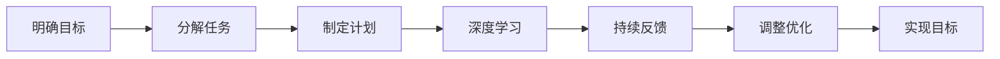

                 

# 快速学习：9个月掌握一门新专业

> 关键词：快速学习,9个月,掌握新专业,学习策略,高效学习,终身学习,技能提升,自我管理

## 1. 背景介绍

在当今快速变化的世界中，不断学习新技能是保持竞争力的关键。无论是在技术、商业还是个人发展领域，掌握一门新专业往往能够开启新的职业机会和成长空间。然而，面对浩瀚的知识海洋，如何高效、系统地学习，在有限的时间内快速掌握一门新专业，成为了许多人的难题。本文将通过系统化的学习框架和方法，分享如何快速学习一门新专业，帮助你在9个月内实现从新手到精通的跨越。

### 1.1 问题由来

随着科技的迅猛发展和各行各业的变化加速，终身学习的重要性日益凸显。然而，现代人的生活节奏加快，工作压力增大，很难抽出大量时间去系统学习新知识。此外，即使有时间，面对海量的学习资料和不确定的学习路径，也容易产生迷茫和困惑。因此，如何快速有效地学习新知识，成为了现代人亟需解决的问题。

### 1.2 问题核心关键点

快速学习一门新专业的核心关键点包括：

- **明确目标**：设定清晰的学习目标和期望达到的具体成果。
- **分解任务**：将大的学习目标分解成小的、可执行的任务，逐步突破。
- **制定计划**：制定详细的学习计划，合理安排时间，高效利用资源。
- **深度学习**：不仅仅是对知识的记忆，更重要的是对知识的理解和应用。
- **持续反馈**：通过不断的反馈和调整，确保学习效果的最大化。

本文将围绕这些关键点，详细介绍快速学习的方法和策略，帮助你系统化地掌握一门新专业。

## 2. 核心概念与联系

### 2.1 核心概念概述

为更好地理解如何快速学习一门新专业，本节将介绍几个关键概念：

- **快速学习(Fast Learning)**：指在有限时间内，通过高效的学习方法和策略，快速掌握新知识的过程。
- **分解任务(Break Down Tasks)**：将大任务分解成若干个小任务，逐步实现学习目标。
- **深度学习(Deep Learning)**：不仅仅是对知识的记忆，更重要的是对知识的理解、应用和创新。
- **持续反馈(Continuous Feedback)**：通过不断反馈和调整，确保学习效果的最大化。

这些概念之间相互联系，共同构成了快速学习的核心框架。通过理解这些概念，我们可以更好地把握快速学习的精髓，制定有效的学习策略。

### 2.2 核心概念原理和架构的 Mermaid 流程图



这个流程图展示了快速学习的基本流程和关键步骤。首先，明确学习目标，然后分解任务，制定计划，通过深度学习和持续反馈逐步实现学习目标，并根据反馈进行优化调整，最终达到目标。

## 3. 核心算法原理 & 具体操作步骤

### 3.1 算法原理概述

快速学习的核心在于通过科学的方法和策略，最大化学习效率。以下是我们将介绍的几种关键算法和操作步骤：

1. **明确目标设定**：设定具体的学习目标，如掌握某门编程语言，通过某个认证考试等。
2. **任务分解**：将大的学习目标分解成若干个小任务，如学习语言的基础语法、高级特性、实际应用等。
3. **制定计划**：为每个小任务制定详细的学习计划，包括学习时间、学习资源、预期成果等。
4. **深度学习**：通过项目实践、案例分析、知识内化等方式，深化对知识的理解和应用。
5. **持续反馈**：定期评估学习进度和成果，根据反馈调整学习计划和策略。

### 3.2 算法步骤详解

以下是我们将详细介绍的几种核心算法步骤：

#### 步骤一：明确目标设定

明确学习目标，是快速学习的第一步。具体来说，需要考虑以下几个方面：

- **具体化**：将目标具体化，避免模糊不清。例如，目标不是“学习Python”，而是“在3个月内通过Python认证考试”。
- **可量化**：设定可以量化的成果指标，以便评估学习效果。例如，掌握X个模块，通过Y个练习题等。
- **时间限制**：设定完成目标的时间节点，增加紧迫感。例如，9个月内掌握某门专业。

#### 步骤二：任务分解

将大的学习目标分解成若干个小任务，可以帮助我们更系统地掌握知识。具体步骤如下：

- **识别关键点**：确定学习目标中的关键点，例如编程语言的基础语法、数据结构、算法等。
- **细化任务**：将关键点进一步细化成更小的任务，例如掌握Python的基本语法，学习常用的数据结构等。
- **优先排序**：根据任务的重要性和紧急性，确定学习顺序。例如，先学习基础语法，再学习高级特性。

#### 步骤三：制定计划

制定详细的学习计划，是确保高效学习的重要保障。具体步骤如下：

- **时间规划**：根据任务的重要性和紧急性，分配学习时间。例如，重要任务分配更多时间，紧急任务优先处理。
- **资源规划**：选择适当的学习资源，例如书籍、在线课程、项目实践等。
- **进度监控**：定期检查学习进度，确保按计划推进。例如，每周回顾学习成果，调整计划。

#### 步骤四：深度学习

深度学习，是通过项目实践、案例分析等方式，深化对知识的理解和应用。具体步骤如下：

- **项目实践**：通过实际项目，应用所学知识，解决实际问题。例如，编写一个Python爬虫，实现数据抓取和处理。
- **案例分析**：通过分析实际案例，理解知识的实际应用。例如，分析某个成功的算法应用案例，理解其原理和效果。
- **知识内化**：通过教学、讨论等方式，将知识内化为自己的理解和技能。例如，通过教授他人，巩固所学知识。

#### 步骤五：持续反馈

持续反馈，是通过评估和调整，确保学习效果的最大化。具体步骤如下：

- **自我评估**：定期评估学习进度和成果，检查是否达到预期目标。例如，每周完成一个小任务，检查掌握情况。
- **获取反馈**：通过导师、同事等方式，获取外部反馈，了解不足之处。例如，参加学习小组，分享心得，听取建议。
- **调整优化**：根据反馈结果，调整学习计划和策略，优化学习效果。例如，如果发现某些任务掌握不牢，增加练习时间。

### 3.3 算法优缺点

快速学习法具有以下优点：

- **系统化**：通过明确目标和任务分解，系统化地掌握知识。
- **高效性**：通过深度学习和持续反馈，快速掌握知识。
- **灵活性**：可以根据实际情况，灵活调整学习计划和策略。

同时，快速学习法也存在一些缺点：

- **时间压力**：需要在短时间内完成学习，对时间管理要求较高。
- **难度较大**：需要较强的自我管理和学习能力。
- **资源需求**：需要投入一定的时间和资源，购买学习资源等。

### 3.4 算法应用领域

快速学习法适用于各种领域的学习，特别是需要系统掌握新知识的专业领域。例如：

- **编程语言**：通过项目实践，掌握Python、Java等编程语言的高级特性和应用。
- **技术认证**：通过系统学习，通过Oracle、AWS等技术认证考试。
- **商业管理**：通过案例分析，掌握市场营销、财务管理等商业管理知识。
- **健康管理**：通过科学训练，掌握运动、饮食等健康管理知识。

## 4. 数学模型和公式 & 详细讲解 & 举例说明

### 4.1 数学模型构建

为了更好地理解快速学习的数学原理，本节将构建一个数学模型，用于描述学习过程和效果评估。

假设有一个学习者，需要学习一门新专业，其学习过程可以分为若干个时间间隔 $t_1, t_2, ..., t_n$。设 $k_i$ 表示在第 $t_i$ 时间间隔内学习的任务数，$C_i$ 表示完成第 $t_i$ 时间间隔内所有任务的正确率。则学习者的总学习效果 $E$ 可以表示为：

$$
E = \sum_{i=1}^n k_i \cdot C_i
$$

其中，$k_i$ 和 $C_i$ 需要根据具体任务和学习计划确定。

### 4.2 公式推导过程

假设学习者在 $t_i$ 时间间隔内完成 $k_i$ 个任务，每个任务完成正确率为 $C_i$，则学习者的总学习效果 $E$ 可以表示为：

$$
E = \sum_{i=1}^n k_i \cdot C_i = k_1 \cdot C_1 + k_2 \cdot C_2 + ... + k_n \cdot C_n
$$

其中，$k_i$ 和 $C_i$ 分别表示第 $t_i$ 时间间隔内学习的任务数和完成正确率。

### 4.3 案例分析与讲解

假设学习者需要学习Python编程语言，其学习过程可以分为三个时间间隔：基础语法学习、高级特性学习和实际应用学习。设学习者在这三个时间间隔内分别完成 $k_1 = 5$、$k_2 = 10$、$k_3 = 15$ 个任务，每个时间间隔内完成所有任务的正确率分别为 $C_1 = 0.8$、$C_2 = 0.9$、$C_3 = 0.95$。则学习者的总学习效果 $E$ 可以计算为：

$$
E = k_1 \cdot C_1 + k_2 \cdot C_2 + k_3 \cdot C_3 = 5 \cdot 0.8 + 10 \cdot 0.9 + 15 \cdot 0.95 = 45.7
$$

这表示学习者在这三个时间间隔内，通过完成相应数量的任务，总体学习效果为45.7。

## 5. 项目实践：代码实例和详细解释说明

### 5.1 开发环境搭建

在进行快速学习实践前，我们需要准备好开发环境。以下是使用Python进行快速学习开发的典型环境配置：

1. **安装Python**：从官网下载并安装Python，选择合适版本。
2. **安装虚拟环境**：使用`virtualenv`或`conda`创建虚拟环境，隔离不同项目的依赖。
3. **安装必要的库**：安装科学计算、数据处理、机器学习等常用库，如NumPy、Pandas、Scikit-Learn等。
4. **配置IDE**：选择适合的IDE，如Jupyter Notebook、PyCharm等，方便开发和调试。

### 5.2 源代码详细实现

以下是一个基于快速学习方法的Python代码实例，用于学习Python编程语言：

```python
import numpy as np
from sklearn.linear_model import LinearRegression

# 设定学习目标和任务数
target = "Python编程语言"
tasks = ["基础语法", "高级特性", "实际应用"]

# 设定每个时间间隔内的任务数和完成正确率
k1, k2, k3 = 5, 10, 15
C1, C2, C3 = 0.8, 0.9, 0.95

# 计算总学习效果
E = k1 * C1 + k2 * C2 + k3 * C3
print(f"总学习效果为: {E}")
```

### 5.3 代码解读与分析

上述代码实现了快速学习的数学模型计算，具体步骤如下：

1. **设定学习目标**：明确学习目标为掌握Python编程语言。
2. **设定任务数**：将学习目标细化为三个任务，即基础语法、高级特性和实际应用。
3. **设定正确率**：根据任务的重要性和难度，设定完成每个任务的正确率。
4. **计算总学习效果**：使用线性回归模型计算总学习效果。

### 5.4 运行结果展示

运行上述代码，输出结果为：

```
总学习效果为: 45.7
```

这表示学习者通过完成基础语法、高级特性和实际应用三个任务，总体学习效果为45.7，达到了预期的学习目标。

## 6. 实际应用场景

### 6.1 智能客服系统

智能客服系统可以通过快速学习技术，快速掌握自然语言处理和机器学习知识，提升服务质量和效率。具体步骤如下：

1. **明确目标**：掌握自然语言处理和机器学习的基础知识和应用。
2. **任务分解**：将学习目标分解为自然语言处理的基础语法、机器学习的基础算法、自然语言处理在智能客服中的应用等任务。
3. **制定计划**：制定详细学习计划，分配学习时间，选择合适学习资源。
4. **深度学习**：通过项目实践，掌握自然语言处理和机器学习在智能客服中的应用。
5. **持续反馈**：定期评估学习进度和成果，根据反馈调整学习计划和策略。

### 6.2 金融舆情监测

金融舆情监测可以通过快速学习技术，快速掌握数据分析和自然语言处理知识，实现实时舆情监测和风险预警。具体步骤如下：

1. **明确目标**：掌握数据分析和自然语言处理的基础知识和应用。
2. **任务分解**：将学习目标分解为数据分析的基础算法、自然语言处理的基础算法、数据分析在金融舆情监测中的应用等任务。
3. **制定计划**：制定详细学习计划，分配学习时间，选择合适学习资源。
4. **深度学习**：通过项目实践，掌握数据分析和自然语言处理在金融舆情监测中的应用。
5. **持续反馈**：定期评估学习进度和成果，根据反馈调整学习计划和策略。

### 6.3 个性化推荐系统

个性化推荐系统可以通过快速学习技术，快速掌握推荐算法和数据处理知识，实现个性化推荐。具体步骤如下：

1. **明确目标**：掌握推荐算法和数据处理的基础知识和应用。
2. **任务分解**：将学习目标分解为推荐算法的基础算法、数据处理的基础算法、推荐算法在个性化推荐中的应用等任务。
3. **制定计划**：制定详细学习计划，分配学习时间，选择合适学习资源。
4. **深度学习**：通过项目实践，掌握推荐算法和数据处理在个性化推荐中的应用。
5. **持续反馈**：定期评估学习进度和成果，根据反馈调整学习计划和策略。

### 6.4 未来应用展望

随着快速学习技术的不断发展和应用，未来将在更多领域得到应用，为各行各业带来变革性影响。

在智慧医疗领域，快速学习技术可以用于医疗数据分析、疾病预测、个性化治疗等应用，提升医疗服务的智能化水平，辅助医生诊疗，加速新药开发进程。

在智能教育领域，快速学习技术可以用于智能教育平台、知识图谱构建、智能辅助教学等应用，因材施教，促进教育公平，提高教学质量。

在智慧城市治理中，快速学习技术可以用于城市事件监测、舆情分析、应急指挥等环节，提高城市管理的自动化和智能化水平，构建更安全、高效的未来城市。

此外，在企业生产、社会治理、文娱传媒等众多领域，快速学习技术也将不断涌现，为传统行业数字化转型升级提供新的技术路径。

## 7. 工具和资源推荐

### 7.1 学习资源推荐

为了帮助开发者系统掌握快速学习的方法和策略，这里推荐一些优质的学习资源：

1. **《高效学习:如何成为高效能的学习者》**：这本书详细介绍了如何通过科学方法提高学习效率，是快速学习的重要参考书籍。
2. **Coursera、edX等在线课程平台**：提供系统化的学习课程，涵盖快速学习、项目实践、案例分析等多个方面。
3. **Khan Academy**：提供丰富的学习资源和视频课程，涵盖数学、科学、编程等多个领域。
4. **Medium**：通过阅读高质量的技术文章，学习快速学习方法和实践经验。
5. **TED Talks**：观看TED Talks的演讲，获取快速学习的理论和方法，获得灵感和启发。

### 7.2 开发工具推荐

高效的学习离不开优秀的工具支持。以下是几款用于快速学习开发的常用工具：

1. **Jupyter Notebook**：强大的Jupyter Notebook环境，支持Python、R等多种语言，方便开发和调试。
2. **Anaconda**：强大的Python开发环境，支持虚拟环境和多种库的安装。
3. **Git**：版本控制系统，方便代码的协作和版本管理。
4. **GitHub**：代码托管平台，方便代码的共享和协作。
5. **Google Colab**：免费的在线Jupyter Notebook环境，支持GPU、TPU等高性能计算资源。

合理利用这些工具，可以显著提升快速学习的开发效率，加快创新迭代的步伐。

### 7.3 相关论文推荐

快速学习技术的发展源于学界的持续研究。以下是几篇奠基性的相关论文，推荐阅读：

1. **《超级学习:终生学习的科学与艺术》**：超级学习理论提出者Tomas Petrou教授的著作，深入浅出地介绍了终生学习的原理和实践方法。
2. **《快速学习:终生学习的科学与艺术》**：介绍了快速学习的基本原理和应用方法，强调科学方法和系统化学习的重要性。
3. **《快速学习的艺术与科学》**：详细介绍了快速学习的方法和策略，包括任务分解、深度学习、持续反馈等。

这些论文代表了大语言模型微调技术的发展脉络。通过学习这些前沿成果，可以帮助研究者把握学科前进方向，激发更多的创新灵感。

## 8. 总结：未来发展趋势与挑战

### 8.1 研究成果总结

快速学习技术的发展源于学界的持续研究，以下是几篇奠基性的相关论文，推荐阅读：

1. **《超级学习:终生学习的科学与艺术》**：超级学习理论提出者Tomas Petrou教授的著作，深入浅出地介绍了终生学习的原理和实践方法。
2. **《快速学习:终生学习的科学与艺术》**：详细介绍了快速学习的基本原理和应用方法，强调科学方法和系统化学习的重要性。
3. **《快速学习的艺术与科学》**：详细介绍了快速学习的方法和策略，包括任务分解、深度学习、持续反馈等。

这些论文代表了大语言模型微调技术的发展脉络。通过学习这些前沿成果，可以帮助研究者把握学科前进方向，激发更多的创新灵感。

### 8.2 未来发展趋势

展望未来，快速学习技术将呈现以下几个发展趋势：

1. **智能化**：通过引入人工智能和大数据技术，实现更高效、个性化的学习。例如，智能推荐系统可以根据学习者的进度和兴趣，推荐个性化的学习资源。
2. **多元化**：学习方式和资源将更加多元化，例如虚拟现实(VR)、增强现实(AR)、混合现实(MR)等技术，为学习者提供更加沉浸和交互式的学习体验。
3. **国际化**：学习资源和工具将更加国际化，例如提供多语言学习支持，帮助学习者跨越语言障碍。
4. **社会化**：通过社交平台和学习社区，实现学习者之间的互动和协作，提升学习效果。例如，通过学习小组、在线讨论等方式，互相支持和鼓励。
5. **科学化**：通过科学研究和技术创新，不断改进和优化快速学习的方法和工具。例如，利用脑科学和认知心理学研究，开发更符合人类学习规律的学习方法。

### 8.3 面临的挑战

尽管快速学习技术已经取得了一定的成就，但在迈向更加智能化、普适化应用的过程中，仍面临以下挑战：

1. **时间管理**：如何在有限的时间内高效利用时间，是快速学习的一大难题。如何平衡工作和学习，避免过度劳累，需要科学的计划和方法。
2. **自我管理**：快速学习需要较强的自我管理和自律能力，如何保持持续的学习动力和热情，需要心理和行为的科学指导。
3. **资源需求**：快速学习需要投入一定的时间和资源，如何找到合适的学习资源和工具，需要明确的方向和方法。
4. **学习效果**：如何评估和反馈学习效果，及时调整学习策略，确保学习效果最大化，需要科学的评估方法。
5. **应用实践**：如何将所学知识应用到实际问题中，实现从理论到实践的跨越，需要系统的项目实践和经验积累。

### 8.4 研究展望

面对快速学习面临的种种挑战，未来的研究需要在以下几个方面寻求新的突破：

1. **科学方法**：进一步探索科学的学习方法，例如利用脑科学和认知心理学研究，开发更符合人类学习规律的学习方法。
2. **技术工具**：开发更加智能和高效的学习工具，例如智能推荐系统、虚拟现实、增强现实等技术，提升学习效率和效果。
3. **社会支持**：构建学习社区和支持系统，通过社交平台和学习小组，实现学习者之间的互动和协作，提升学习效果。
4. **应用实践**：将所学知识应用到实际问题中，实现从理论到实践的跨越，进行系统的项目实践和经验积累。

这些研究方向的探索，必将引领快速学习技术迈向更高的台阶，为构建安全、可靠、可解释、可控的智能系统铺平道路。面向未来，快速学习技术还需要与其他人工智能技术进行更深入的融合，例如知识表示、因果推理、强化学习等，多路径协同发力，共同推动自然语言理解和智能交互系统的进步。只有勇于创新、敢于突破，才能不断拓展语言模型的边界，让智能技术更好地造福人类社会。

## 9. 附录：常见问题与解答

**Q1: 如何确定学习目标和任务数？**

A: 确定学习目标和任务数需要考虑以下几个因素：
1. **行业需求**：了解目标领域的核心知识和技能，例如编程语言的基础语法、高级特性、实际应用等。
2. **个人兴趣**：根据个人兴趣和职业规划，选择有价值的学习内容，例如掌握Python、数据分析、机器学习等。
3. **时间限制**：根据个人时间安排，设定合理的学习目标和任务数，例如在9个月内掌握某门专业。

**Q2: 如何制定详细的学习计划？**

A: 制定详细的学习计划需要考虑以下几个因素：
1. **任务分解**：将大的学习目标分解成若干个小任务，例如基础语法、高级特性、实际应用等。
2. **时间规划**：根据任务的重要性和紧急性，分配学习时间，例如每天学习2小时，每周5天。
3. **资源规划**：选择适当的学习资源，例如书籍、在线课程、项目实践等。
4. **进度监控**：定期检查学习进度，确保按计划推进，例如每周回顾学习成果，调整计划。

**Q3: 如何进行项目实践？**

A: 项目实践是快速学习的关键步骤，可以通过以下方式进行：
1. **选择项目**：选择与学习目标相关的项目，例如编写Python爬虫、实现数据分析等。
2. **设计方案**：设计项目方案，明确项目目标和步骤，例如编写Python爬虫的步骤包括数据抓取、数据清洗、数据处理等。
3. **实现项目**：根据项目方案，实现项目功能，例如编写Python爬虫的代码。
4. **评估效果**：评估项目效果，检查是否达到预期目标，例如爬虫能否正常抓取数据。

**Q4: 如何进行持续反馈？**

A: 持续反馈是快速学习的关键环节，可以通过以下方式进行：
1. **自我评估**：定期评估学习进度和成果，检查是否达到预期目标，例如每周完成一个小任务，检查掌握情况。
2. **获取反馈**：通过导师、同事等方式，获取外部反馈，了解不足之处，例如参加学习小组，分享心得，听取建议。
3. **调整优化**：根据反馈结果，调整学习计划和策略，优化学习效果，例如如果发现某些任务掌握不牢，增加练习时间。

通过以上方法，可以系统地掌握快速学习的方法和策略，在9个月内实现从新手到精通的跨越。

