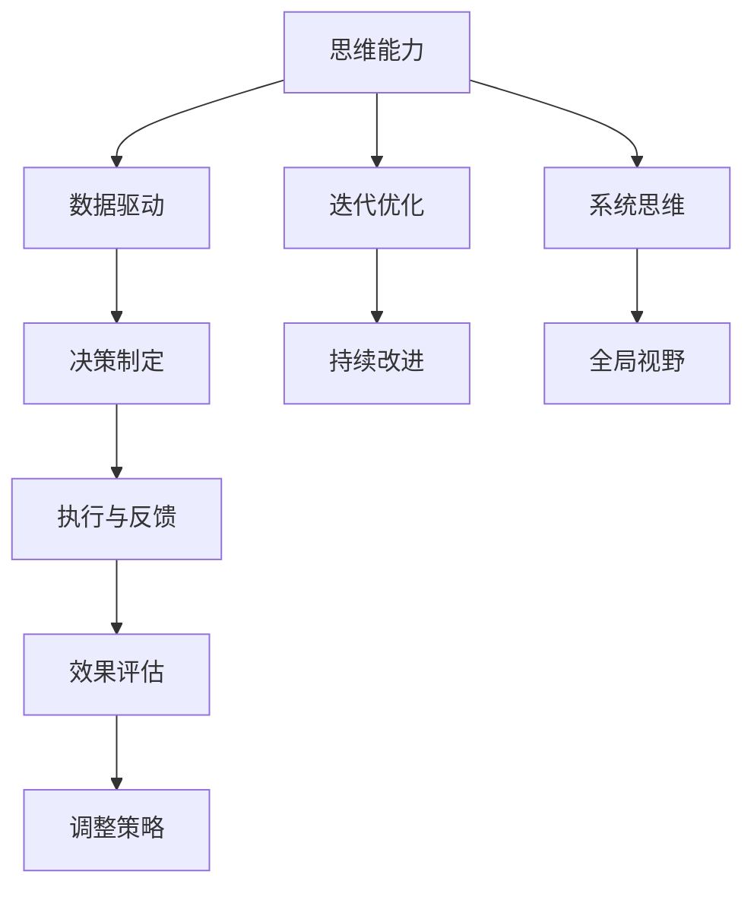

                 

# 思维升级：管理者的竞争优势

## 1. 背景介绍

在快速变化的商业环境中，管理者需要在不确定性中找到方向，在复杂性中寻找机会。现代管理理论和方法不断演进，从经典的管理科学与工程学、组织行为学到行为经济学，再到数字管理，管理者的工作范式已悄然发生了变革。在这场变革中，思维能力的升级成为管理者的核心竞争力。本文将深入探讨这一主题，帮助管理者在知识经济时代中建立竞争优势。

## 2. 核心概念与联系

### 2.1 核心概念概述

- **思维能力(Mental Agility)**：指在复杂多变环境中快速分析和解决问题的能力。思维能力强的管理者，能够从纷繁复杂的现实中找到关键点，并迅速制定和实施解决方案。

- **数据驱动(Management by Data)**：指利用数据和分析结果来指导决策和运营管理。随着信息技术和大数据技术的普及，数据驱动管理成为现代管理的新常态。

- **迭代优化(Iterative Optimization)**：指通过不断的反馈和调整，逐步优化管理策略和运营流程。迭代优化思维强调从实际效果中总结经验，不断改进和提升管理实践。

- **系统思维(System Thinking)**：指从系统的角度出发，考虑各个组成部分之间的相互关系，进行全局性、整体性的思考。系统思维能够帮助管理者识别关键要素，并综合考虑不同因素对系统的影响。

- **决策制定(Decision Making)**：指在确定目标和策略的基础上，选择最合适的行动方案。决策制定是管理者日常工作的重要组成部分，要求具备系统性、逻辑性和前瞻性。

这些核心概念之间存在着紧密的联系，共同构成现代管理者的思维框架。管理者通过对这些概念的灵活运用，能够在复杂多变的环境中游刃有余，实现业务的高效运行和持续创新。

### 2.2 核心概念原理和架构的 Mermaid 流程图



该图展示了核心概念之间的逻辑关系：

- 思维能力是基础，通过数据驱动和迭代优化，不断提升决策制定能力。
- 系统思维提供全局视野，决策制定需综合考虑系统各部分的关系。
- 执行与反馈形成闭环，确保决策实施的效果，为迭代优化提供依据。

## 3. 核心算法原理 & 具体操作步骤

### 3.1 算法原理概述

基于思维能力的竞争力构建，需要管理者具备以下核心能力：

1. **问题解决能力**：快速识别问题，并制定有效解决方案。
2. **决策制定能力**：在多重选项中选择最优方案。
3. **系统思维能力**：识别系统关键要素，进行整体性思考。
4. **数据驱动能力**：利用数据进行科学决策。
5. **迭代优化能力**：根据反馈不断调整策略，持续提升。

这些能力是通过不断学习和实践，逐步积累和提升的。管理者需要通过系统的训练和实践，构建并优化这些核心能力。

### 3.2 算法步骤详解

1. **问题识别与定义**：
   - 从业务实际出发，识别需要解决的关键问题。
   - 通过头脑风暴、SWOT分析等方法，对问题进行详细定义。

2. **数据收集与分析**：
   - 收集与问题相关的各类数据，包括定量数据和定性数据。
   - 运用数据挖掘、统计分析等技术，对数据进行整理和分析。

3. **系统构建与分析**：
   - 建立问题的系统模型，识别系统关键要素。
   - 运用系统思维方法，分析各要素之间的关系，识别瓶颈和优化点。

4. **决策制定与执行**：
   - 综合考虑数据和系统分析结果，制定最优决策方案。
   - 执行决策，并在实施过程中收集反馈，进行效果评估。

5. **迭代优化与调整**：
   - 根据反馈结果，识别策略的不足之处。
   - 进行局部优化和调整，并重新评估效果，进行下一轮循环。

### 3.3 算法优缺点

**优点**：

- 系统性的思考方式能够帮助管理者全面考虑问题，避免单一视角带来的偏见。
- 数据驱动的方法能够减少主观判断，提高决策的科学性和客观性。
- 迭代优化过程不断反馈和调整，使得管理策略更加精细和高效。

**缺点**：

- 系统思维和数据驱动需要较高的专业素养，对管理者的能力要求较高。
- 迭代优化过程需要较长的周期，短期内可能难以看到效果。
- 在面对复杂和不确定性问题时，可能存在信息不完备和处理复杂性的挑战。

### 3.4 算法应用领域

思维能力的竞争力构建，不仅适用于传统的企业管理和运营，也适用于创新创业、市场分析、产品开发等多个领域。

- **企业管理**：利用系统思维和数据驱动，优化企业的运营流程和决策过程，提升效率和效益。
- **创新创业**：通过迭代优化和问题解决，快速适应市场变化，实现业务创新和增长。
- **市场分析**：利用数据分析和系统思维，深入理解市场动态和消费者行为，制定有效的市场策略。
- **产品开发**：通过系统分析和迭代优化，不断改进产品设计和服务流程，提升用户满意度和竞争力。

## 4. 数学模型和公式 & 详细讲解 & 举例说明

### 4.1 数学模型构建

管理者竞争力的构建，可以通过以下数学模型进行量化分析：

$$\text{竞争力} = f(\text{问题解决能力}, \text{决策制定能力}, \text{系统思维能力}, \text{数据驱动能力}, \text{迭代优化能力})$$

其中，各能力因子可以通过以下公式计算：

- **问题解决能力**：

$$
\text{问题解决能力} = \frac{\text{问题识别率} \times \text{解决方案成功率}}{\text{问题解决时间}}
$$

- **决策制定能力**：

$$
\text{决策制定能力} = \frac{\text{正确决策率} \times \text{决策执行效率}}{\text{决策失败率} \times \text{决策修正成本}}
$$

- **系统思维能力**：

$$
\text{系统思维能力} = \frac{\text{系统要素识别率} \times \text{系统关系分析准确率}}{\text{系统分析误差率}}
$$

- **数据驱动能力**：

$$
\text{数据驱动能力} = \frac{\text{数据完整性} \times \text{数据分析准确性}}{\text{数据处理时间}}
$$

- **迭代优化能力**：

$$
\text{迭代优化能力} = \frac{\text{策略调整频次} \times \text{调整效果} - \text{策略调整频次} \times \text{策略调整成本}}{\text{策略调整周期}}
$$

### 4.2 公式推导过程

这些公式通过具体的指标和量化方法，反映了各能力因子的综合表现。例如，问题解决能力公式通过问题识别率和解决方案成功率来计算，数据驱动能力公式通过数据完整性和分析准确性来计算。每个指标的具体数值，需根据实际业务场景进行细化和调整。

### 4.3 案例分析与讲解

假设某公司正在进行新产品的开发项目，管理者需通过数据驱动和系统思维，优化产品设计和开发流程。具体步骤如下：

1. **问题识别与定义**：通过市场调研，识别出用户对产品功能的需求不明确，存在大量需求变更。

2. **数据收集与分析**：收集用户反馈和市场需求数据，分析用户需求变化趋势。

3. **系统构建与分析**：建立产品设计和开发流程的系统模型，识别出需求变更对设计和开发的潜在影响。

4. **决策制定与执行**：结合用户需求变化和系统分析结果，制定灵活的设计和开发流程，并执行初始方案。

5. **迭代优化与调整**：根据用户反馈和设计效果，进行流程优化和调整，并重新评估效果，进行下一轮循环。

## 5. 项目实践：代码实例和详细解释说明

### 5.1 开发环境搭建

- **安装Python和相关库**：
  ```bash
  pip install pandas numpy scikit-learn matplotlib seaborn
  ```

- **数据准备**：
  收集用户反馈和市场需求数据，保存为CSV格式。

### 5.2 源代码详细实现

```python
import pandas as pd
from sklearn.ensemble import RandomForestClassifier
from sklearn.model_selection import train_test_split
from sklearn.metrics import accuracy_score

# 读取数据
data = pd.read_csv('user_feedback.csv')

# 特征工程
features = data[['user_feedback', 'product_design']]
labels = data['product_quality']

# 数据拆分
features_train, features_test, labels_train, labels_test = train_test_split(features, labels, test_size=0.2, random_state=42)

# 模型训练
model = RandomForestClassifier()
model.fit(features_train, labels_train)

# 模型评估
predictions = model.predict(features_test)
accuracy = accuracy_score(labels_test, predictions)
print(f"模型准确率：{accuracy:.2f}")
```

### 5.3 代码解读与分析

以上代码通过Python和scikit-learn库实现了简单的随机森林分类模型。模型通过用户反馈和产品设计特征，预测产品质量，从而辅助管理者进行决策制定。

1. **数据准备**：
   - 通过读取CSV文件，获取用户反馈和市场需求数据。
   - 对数据进行特征工程，提取有用的特征。

2. **模型训练**：
   - 使用随机森林分类器，训练模型。
   - 通过交叉验证，确保模型的泛化能力。

3. **模型评估**：
   - 使用准确率评估模型预测效果。

## 6. 实际应用场景

### 6.1 企业管理

在企业管理中，系统思维和数据驱动的应用场景广泛。例如，一家制造业企业可以通过系统思维识别出生产线中的瓶颈环节，利用数据分析工具优化生产流程。

### 6.2 创新创业

创新创业中的迭代优化和问题解决，是成功的重要因素。例如，一家初创企业通过市场调研和用户反馈，迭代优化产品设计，快速适应市场变化。

### 6.3 市场分析

市场分析中的系统思维和数据驱动，能够帮助企业深入理解市场趋势和消费者行为。例如，一家电子商务平台通过分析用户购买数据和市场动态，优化促销策略，提升用户转化率。

### 6.4 产品开发

产品开发中的迭代优化和问题解决，能够不断改进产品设计和服务流程。例如，一家软件公司通过用户反馈和数据分析，优化产品功能和用户体验，提升用户满意度和竞争力。

## 7. 工具和资源推荐

### 7.1 学习资源推荐

1. **《系统思维：系统思考的艺术与实践》**：这本书深入探讨了系统思维的原理和应用，提供了一套系统思考的工具和方法。
2. **《数据分析与统计学习基础》**：这本书介绍了数据分析的基本原理和常见方法，适合管理者的初步学习。
3. **《敏捷管理：精益原则与实践》**：这本书介绍了敏捷管理的核心理念和方法，帮助管理者提升项目管理能力。
4. **《行为经济学与决策科学》**：这本书通过行为经济学的视角，分析决策制定的心理机制和优化方法。
5. **在线课程平台**：如Coursera、edX、Udemy等平台，提供各类管理、数据科学和系统思维的课程，帮助管理者系统学习。

### 7.2 开发工具推荐

1. **Jupyter Notebook**：一款强大的数据科学和编程工具，支持Python、R等多种语言，适合数据分析和模型开发。
2. **Tableau**：一款数据可视化工具，帮助管理者直观理解数据和系统关系。
3. **Power BI**：一款商业智能工具，支持数据整合和可视化，适合企业级数据分析。
4. **GitHub**：一个代码托管平台，支持版本控制和协作开发，适合项目管理。

### 7.3 相关论文推荐

1. **《系统思维与组织学习》**：这篇论文探讨了系统思维在组织学习中的应用，强调系统思维的复杂性和可操作性。
2. **《数据驱动管理：决策与运营优化》**：这篇论文介绍了数据驱动管理的理论基础和实践方法，适用于各类管理场景。
3. **《敏捷管理：方法与实践》**：这篇论文介绍了敏捷管理的核心理念和实践方法，适合管理者和开发团队。
4. **《行为经济学与决策制定》**：这篇论文通过行为经济学的视角，分析了决策制定的心理机制和优化方法。

## 8. 总结：未来发展趋势与挑战

### 8.1 研究成果总结

本文探讨了管理者的思维能力升级，并从系统思维、数据驱动、迭代优化等多个角度，分析了提升竞争力的策略和方法。通过具体的案例分析和代码实现，展示了实际应用场景和工具推荐，帮助管理者更好地理解和管理复杂问题。

### 8.2 未来发展趋势

1. **数字化转型**：随着数字化技术的普及，企业运营和管理的数字化水平将不断提升，管理者需具备更强的数据分析和系统思维能力。
2. **跨学科融合**：管理者和技术专家将更多地进行跨学科融合，综合运用各类知识和方法，提升问题解决和决策制定的效率。
3. **人工智能应用**：人工智能技术将进一步深入到管理实践中，帮助管理者更好地处理复杂多变的问题。
4. **可持续发展**：在面临环境、社会和经济等多元化挑战的背景下，管理者需具备更强的系统思维和全局视野，实现可持续发展。

### 8.3 面临的挑战

1. **信息过载**：现代管理环境中，信息量大、变化快，管理者需具备更强的信息筛选和处理能力。
2. **技术迭代**：各类新兴技术不断涌现，管理者需不断学习新知识，更新自身技能。
3. **组织变革**：数字化转型和跨学科融合，要求组织结构和管理方式进行适应性调整。
4. **决策风险**：数据驱动和迭代优化，要求管理者具备更高的风险识别和控制能力。

### 8.4 研究展望

1. **管理智能化**：利用人工智能和大数据技术，实现管理的智能化和自动化。
2. **全球化管理**：面对全球化挑战，管理者需具备更强的跨文化理解和沟通能力。
3. **伦理和社会责任**：在数字化的管理实践中，需重视伦理和社会责任，确保技术应用的社会效益。

## 9. 附录：常见问题与解答

**Q1：如何提升数据驱动能力？**

A: 提升数据驱动能力，可以通过以下步骤：

1. **数据收集**：全面收集业务相关的各类数据，包括定量和定性数据。
2. **数据清洗**：对数据进行清洗和处理，去除噪声和缺失值。
3. **数据分析**：运用数据挖掘、统计分析等技术，对数据进行分析和建模。
4. **数据可视化**：利用数据可视化工具，直观展示数据分析结果，辅助决策制定。

**Q2：如何实现系统思维？**

A: 实现系统思维，可以通过以下步骤：

1. **系统建模**：建立系统的系统模型，识别系统各部分的关键要素。
2. **系统分析**：运用系统思维方法，分析系统各要素之间的关系，识别瓶颈和优化点。
3. **系统优化**：根据系统分析结果，进行系统的优化和调整，实现全局最优。

**Q3：如何迭代优化管理策略？**

A: 迭代优化管理策略，可以通过以下步骤：

1. **评估效果**：对当前策略的效果进行评估，识别存在的问题和不足。
2. **调整策略**：根据评估结果，进行局部调整和优化。
3. **实施效果**：执行调整后的策略，并继续收集反馈和评估效果。
4. **反复迭代**：不断进行策略调整和效果评估，实现持续改进。

通过系统学习和实践，管理者可以逐步提升思维能力和竞争力，在快速变化的环境中保持优势。

---

作者：禅与计算机程序设计艺术 / Zen and the Art of Computer Programming

