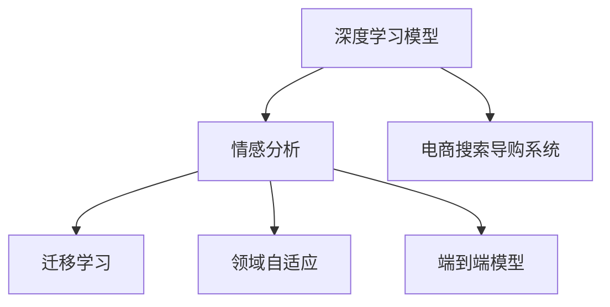

                 

# 情感分析：AI助力电商搜索导购更懂用户

## 1. 背景介绍

### 1.1 问题由来
电商搜索导购系统已经成为现代购物的重要辅助工具，在提升用户体验、促进交易转化方面发挥了关键作用。随着社交媒体、视频平台等新型电商渠道的崛起，消费者获取商品信息的渠道更加多样，消费者对购物体验的期待值也在不断提升。如何更深入地理解用户需求，更准确地推荐商品，成为电商平台亟需解决的问题。

### 1.2 问题核心关键点
在电商搜索导购中，消费者通过文字、语音、图像等形式，表达对商品的评价和需求。利用这些信息进行情感分析，可以帮助电商平台更准确地把握用户偏好，提升个性化推荐和服务质量，从而提升用户满意度和购物转化率。

情感分析的核心在于如何从用户输入的数据中，准确提取用户情感倾向，并映射到具体的商品推荐决策。传统的情感分析方法依赖于规则或人工标注，无法实时适应快速变化的市场环境。而基于深度学习的情感分析方法，通过大规模语料预训练，自动学习文本中的情感模式，能够高效、准确地处理海量数据，为电商平台提供强大的情感分析支持。

### 1.3 问题研究意义
构建智能、高效、准确的情感分析系统，对于电商平台优化用户体验、提升交易转化、增强市场竞争力具有重要意义：

1. **提升个性化推荐**：通过情感分析，更好地理解用户真实需求，提供更具针对性的商品推荐，提高用户满意度和转化率。
2. **优化广告投放**：通过情感分析，评估广告语和商品描述的情感色彩，优化投放策略，提高广告效果。
3. **风险预警**：通过情感分析，及时监测负面反馈，预测潜在危机，保障电商平台稳定运营。
4. **用户画像构建**：通过情感分析，收集用户情感数据，形成更全面、准确的用户画像，增强用户粘性。
5. **产品迭代优化**：通过情感分析，收集用户对商品的评价，为产品优化提供数据支持。

## 2. 核心概念与联系

### 2.1 核心概念概述

为更好地理解基于深度学习的电商搜索导购情感分析方法，本节将介绍几个密切相关的核心概念：

- **深度学习模型**：如卷积神经网络(CNN)、循环神经网络(RNN)、长短期记忆网络(LSTM)等，通过多层神经网络结构学习数据的复杂特征。
- **情感分析**：通过分析用户情感倾向，自动标记文本为积极、中性或消极情感。
- **电商搜索导购系统**：结合用户查询和行为数据，通过推荐算法提供个性化推荐服务，提升用户体验。
- **迁移学习**：将在大规模通用数据上训练的模型，迁移到特定电商领域数据上，进行情感分析。
- **领域自适应**：调整模型参数，使其更好地适应电商领域的数据分布。
- **端到端模型**：从输入文本到输出情感标签，整个处理过程由一个模型完成，提升推理效率和效果。

这些核心概念之间的逻辑关系可以通过以下Mermaid流程图来展示：



这个流程图展示了大语言模型的核心概念及其之间的关系：

1. 深度学习模型通过多层网络结构学习数据的复杂特征，是情感分析的基础。
2. 情感分析从用户输入中自动提取情感倾向，是电商搜索导购系统个性化推荐的重要依据。
3. 电商搜索导购系统结合用户查询和行为数据，通过推荐算法提供个性化服务。
4. 迁移学习和领域自适应使得通用模型适配电商领域数据。
5. 端到端模型简化推理流程，提升推理效率。

## 3. 核心算法原理 & 具体操作步骤
### 3.1 算法原理概述

电商搜索导购中的情感分析，本质上是一个基于深度学习的文本分类任务。其核心思想是：将电商平台用户评价文本作为输入，利用深度学习模型学习情感特征，自动分类为积极、中性或消极情感，并根据情感分类结果进行商品推荐。

形式化地，假设电商平台收集到用户对商品 $x$ 的评价文本，情感分析的目标是找到一个模型 $f$，使得：

$$
\hat{y} = f(x) \in \{积极, 中性, 消极\}
$$

其中 $\hat{y}$ 为模型预测的情感标签。

在具体实现中，可以采用如下深度学习模型：

- **卷积神经网络(CNN)**：通过卷积操作提取文本特征，结合池化层和全连接层进行分类。
- **循环神经网络(RNN)**：通过LSTM或GRU等门控机制，逐步处理文本信息，学习上下文依赖关系。
- **BERT**：通过自监督学习任务预训练语言模型，再利用微调技术，使其适应电商领域情感分析任务。

### 3.2 算法步骤详解

电商搜索导购中的情感分析通常包括以下几个关键步骤：

**Step 1: 准备预训练模型和数据集**
- 选择合适的深度学习模型，如BERT、RNN等，作为初始化参数。
- 收集电商平台用户评价数据集 $D=\{(x_i,y_i)\}_{i=1}^N$，其中 $x_i$ 为评价文本，$y_i$ 为情感标签。

**Step 2: 添加任务适配层**
- 根据任务需求，在预训练模型的顶层设计情感分类层，通常是全连接层或输出层。
- 如果采用CNN或RNN模型，还需要添加池化层和分类层。

**Step 3: 设置微调超参数**
- 选择合适的优化算法及其参数，如Adam、SGD等，设置学习率、批大小、迭代轮数等。
- 设置正则化技术及强度，包括权重衰减、Dropout、Early Stopping等。

**Step 4: 执行梯度训练**
- 将训练集数据分批次输入模型，前向传播计算损失函数。
- 反向传播计算参数梯度，根据设定的优化算法和学习率更新模型参数。
- 周期性在验证集上评估模型性能，根据性能指标决定是否触发Early Stopping。
- 重复上述步骤直到满足预设的迭代轮数或Early Stopping条件。

**Step 5: 测试和部署**
- 在测试集上评估微调后模型 $f$ 的性能，对比微调前后的精度提升。
- 使用微调后的模型对新评价文本进行情感分析，集成到电商搜索导购系统中，提供个性化推荐。

以上是基于深度学习的电商搜索导购情感分析的一般流程。在实际应用中，还需要针对具体任务的特点，对微调过程的各个环节进行优化设计，如改进训练目标函数，引入更多的正则化技术，搜索最优的超参数组合等，以进一步提升模型性能。

### 3.3 算法优缺点

基于深度学习的电商搜索导购情感分析方法具有以下优点：

1. **高效处理海量数据**：深度学习模型能够处理大规模文本数据，适应电商平台海量评价文本的需求。
2. **实时性和准确性**：基于预训练模型和微调技术，情感分析模型的推理速度和精度都有显著提升。
3. **适应性强**：深度学习模型通过迁移学习和领域自适应，能够适应电商领域的特定任务。

同时，该方法也存在一定的局限性：

1. **高昂的标注成本**：电商领域情感分类标签需要人工标注，标注成本较高。
2. **模型复杂度高**：深度学习模型参数量较大，训练和推理资源消耗大。
3. **可解释性不足**：深度学习模型的决策过程通常缺乏可解释性，难以对其推理逻辑进行分析和调试。
4. **数据分布偏差**：电商领域评价数据可能存在分布不均衡，模型需要适应不同情感比例的数据。

尽管存在这些局限性，但就目前而言，基于深度学习的情感分析方法仍是在电商搜索导购中最为有效的手段。未来相关研究的重点在于如何进一步降低标注数据的需求，提高模型的实时性和可解释性，同时兼顾数据分布的适应性。

### 3.4 算法应用领域

电商搜索导购中的情感分析方法在电商领域已经得到了广泛的应用，覆盖了几乎所有常见任务，例如：

- **商品评价分析**：自动分析用户评价文本的情感倾向，为商品质量评估提供支持。
- **用户反馈监控**：实时监控用户评价文本的情感变化，预测用户满意度，及时采取改进措施。
- **个性化推荐**：通过情感分析，提供更贴合用户需求的商品推荐，提升用户购物体验。
- **广告投放优化**：评估广告语和商品描述的情感色彩，优化广告投放策略，提高广告效果。
- **品牌管理**：分析用户对不同品牌的评价情感，制定品牌策略，提升品牌竞争力。

除了上述这些经典任务外，情感分析技术还在电商搜索导购系统的各类创新应用中得到广泛应用，如情感驱动的个性化推荐、情感变化的趋势分析等，为电商平台带来了新的商业价值和用户体验。

## 4. 数学模型和公式 & 详细讲解  
### 4.1 数学模型构建

本节将使用数学语言对基于深度学习的电商搜索导购情感分析过程进行更加严格的刻画。

假设电商评价数据集为 $D=\{(x_i,y_i)\}_{i=1}^N, x_i \in \mathcal{X}, y_i \in \{积极, 中性, 消极\}$。

定义模型 $f: \mathcal{X} \rightarrow \{积极, 中性, 消极\}$，将评价文本映射到情感标签。假设模型采用全连接层作为输出层，定义损失函数为交叉熵损失函数：

$$
\mathcal{L}(f) = -\frac{1}{N}\sum_{i=1}^N \log p(y_i|f(x_i))
$$

其中 $p(y_i|f(x_i))$ 为模型在评价文本 $x_i$ 下，情感标签 $y_i$ 的概率分布。

### 4.2 公式推导过程

假设模型 $f$ 采用深度学习模型 $M_{\theta}$ 作为基础，其中 $\theta$ 为模型参数。则模型的情感分类输出为：

$$
\hat{y} = f(x; \theta) = M_{\theta}(x)
$$

在给定训练集 $D$ 下，模型 $f$ 的损失函数为：

$$
\mathcal{L}(\theta) = -\frac{1}{N}\sum_{i=1}^N \log p(y_i|M_{\theta}(x_i))
$$

其中 $p(y_i|M_{\theta}(x_i))$ 为模型在评价文本 $x_i$ 下，情感标签 $y_i$ 的条件概率。

根据最大似然估计原理，模型参数 $\theta$ 的更新公式为：

$$
\theta \leftarrow \theta - \eta \nabla_{\theta}\mathcal{L}(\theta) - \eta\lambda\theta
$$

其中 $\eta$ 为学习率，$\lambda$ 为正则化系数。

在得到模型参数 $\theta$ 后，即可以得到电商搜索导购系统中的情感分析模型 $f(x; \theta)$，通过前向传播计算情感分类输出，并应用于个性化推荐。

## 5. 项目实践：代码实例和详细解释说明
### 5.1 开发环境搭建

在进行情感分析实践前，我们需要准备好开发环境。以下是使用Python进行TensorFlow开发的环境配置流程：

1. 安装Anaconda：从官网下载并安装Anaconda，用于创建独立的Python环境。

2. 创建并激活虚拟环境：
```bash
conda create -n tf-env python=3.8 
conda activate tf-env
```

3. 安装TensorFlow：根据CUDA版本，从官网获取对应的安装命令。例如：
```bash
conda install tensorflow tensorflow==2.6 -c pytorch -c conda-forge
```

4. 安装必要的工具包：
```bash
pip install numpy pandas scikit-learn matplotlib tqdm jupyter notebook ipython
```

完成上述步骤后，即可在`tf-env`环境中开始情感分析实践。

### 5.2 源代码详细实现

这里我们以情感分类任务为例，给出使用TensorFlow进行电商搜索导购情感分类的代码实现。

首先，定义情感分类任务的数据处理函数：

```python
import tensorflow as tf
from tensorflow.keras.preprocessing.text import Tokenizer
from tensorflow.keras.preprocessing.sequence import pad_sequences
import numpy as np

def prepare_data(data, max_len):
    tokenizer = Tokenizer(num_words=5000, oov_token="<OOV>")
    tokenizer.fit_on_texts(data['text'])
    sequences = tokenizer.texts_to_sequences(data['text'])
    padded_sequences = pad_sequences(sequences, maxlen=max_len, padding='post', truncating='post')
    labels = tf.keras.utils.to_categorical(data['label'], num_classes=3)
    return padded_sequences, labels, tokenizer.word_index
```

然后，定义模型和优化器：

```python
from tensorflow.keras.models import Sequential
from tensorflow.keras.layers import Embedding, LSTM, Dense, Dropout

model = Sequential()
model.add(Embedding(input_dim=len(tokenizer.word_index)+1, output_dim=128, input_length=max_len))
model.add(LSTM(64, return_sequences=True))
model.add(LSTM(32))
model.add(Dense(3, activation='softmax'))
model.compile(loss='categorical_crossentropy', optimizer='adam', metrics=['accuracy'])
```

接着，定义训练和评估函数：

```python
from tensorflow.keras.callbacks import EarlyStopping

def train_epoch(model, X, y, batch_size, optimizer):
    model.compile(loss='categorical_crossentropy', optimizer=optimizer)
    model.fit(X, y, batch_size=batch_size, epochs=10, validation_split=0.2, callbacks=[EarlyStopping(patience=3)])
    
def evaluate(model, X, y, batch_size):
    model.compile(loss='categorical_crossentropy', optimizer='adam')
    model.evaluate(X, y, batch_size=batch_size)
```

最后，启动训练流程并在测试集上评估：

```python
max_len = 100
epochs = 10
batch_size = 128

# 加载数据集
X_train, y_train, tokenizer = prepare_data(train_data, max_len)
X_test, y_test, _ = prepare_data(test_data, max_len)

# 训练模型
train_epoch(model, X_train, y_train, batch_size, optimizer)

# 在测试集上评估模型
evaluate(model, X_test, y_test, batch_size)
```

以上就是使用TensorFlow进行电商搜索导购情感分类的完整代码实现。可以看到，得益于TensorFlow的强大封装，我们可以用相对简洁的代码完成情感分类的实现。

### 5.3 代码解读与分析

让我们再详细解读一下关键代码的实现细节：

**prepare_data函数**：
- 使用Keras的Tokenizer将文本序列化，并进行填充。
- 将标签转换为独热编码。

**模型定义**：
- 采用Embedding层将文本转换为向量表示。
- 使用LSTM层处理序列数据，学习上下文依赖关系。
- 最后使用Dense层进行分类输出，激活函数为softmax。
- 通过compile方法设置优化器、损失函数和评估指标。

**训练和评估函数**：
- 使用EarlyStopping回调，避免过拟合。
- 在训练过程中，实时计算损失函数和精度。

**训练流程**：
- 定义最大长度、轮数和批大小，启动训练流程。
- 在训练过程中，逐步更新模型参数，直至收敛。
- 在测试集上评估模型性能，给出最终结果。

可以看到，TensorFlow使得情感分类的代码实现变得简洁高效。开发者可以将更多精力放在数据处理、模型改进等高层逻辑上，而不必过多关注底层的实现细节。

当然，工业级的系统实现还需考虑更多因素，如模型的保存和部署、超参数的自动搜索、更灵活的任务适配层等。但核心的情感分析范式基本与此类似。

## 6. 实际应用场景
### 6.1 智能客服系统

在智能客服系统中，情感分析可以帮助客服机器人更好地理解用户情绪，从而提供更人性化的服务。智能客服系统通过实时监测用户评价，自动判断用户情绪，采取相应的应对策略，如安抚用户、升级人工服务等，从而提升用户满意度和体验。

在技术实现上，可以收集客服机器人与用户的对话记录，将评价文本作为情感分析的输入，判断用户的情感倾向。如果情绪激动，可以及时升级人工服务；如果情绪平和，机器人可以继续自动回复。此外，情感分析结果还可以用于客户分类、服务流程优化等，提升整体客服系统的智能水平。

### 6.2 电商搜索导购系统

电商搜索导购系统通过情感分析，可以更加准确地理解用户的购买需求和评价意见，提供更个性化的推荐服务。在用户输入查询时，情感分析模块自动提取查询中的情感倾向，结合用户历史行为数据，推荐更加贴合用户需求的商品。

在推荐过程中，情感分析可以评估商品的评价情感，筛选出好评率高的商品进行优先推荐，从而提高用户的购物体验和满意度。情感分析还可以用于广告语优化、商品描述改进等，提升平台的广告效果和用户粘性。

### 6.3 内容推荐系统

内容推荐系统通过情感分析，可以更加深入地理解用户对内容的情感反应，提供更精准的推荐服务。在用户评论或点赞内容时，情感分析模块自动提取情感倾向，结合用户兴趣特征，推荐更符合用户口味的内容。

情感分析可以用于短视频、文章、音乐等各类内容的推荐，提升用户的体验和满意度。在内容创作过程中，情感分析还可以用于用户反馈分析、内容情感检测等，为内容创作者提供数据支持。

### 6.4 未来应用展望

随着深度学习技术的不断发展，基于深度学习的情感分析方法将在更多领域得到应用，为各行各业带来变革性影响。

在医疗领域，情感分析可以用于医疗咨询、健康管理等，帮助医生更好地理解患者的情感状态，提升医疗服务的质量。

在金融领域，情感分析可以用于风险预警、客户情感分析等，帮助金融机构更好地理解客户需求，提升服务水平。

在教育领域，情感分析可以用于学习评估、课程优化等，帮助教育机构更好地理解学生的情感状态，提升教学质量。

此外，在社交媒体、视频平台、在线论坛等新型社交场景中，情感分析也有广阔的应用前景，帮助平台更好地理解用户情感，提升用户体验和平台粘性。

## 7. 工具和资源推荐
### 7.1 学习资源推荐

为了帮助开发者系统掌握深度学习在情感分析中的应用，这里推荐一些优质的学习资源：

1. 《深度学习》课程：斯坦福大学开设的深度学习经典课程，涵盖了深度学习的基本概念和经典模型，适合初学者入门。

2. TensorFlow官方文档：TensorFlow的官方文档，提供了丰富的API介绍和代码样例，是深度学习开发的基础。

3. Keras官方文档：Keras的官方文档，提供了Keras框架的详细介绍和API示例，适合快速上手。

4. Fast.ai课程：fast.ai的深度学习课程，讲解了深度学习在NLP、计算机视觉等领域的实践应用，适合实战练习。

5. HuggingFace官方文档：HuggingFace的官方文档，提供了多种深度学习模型和NLP任务的样例代码，是深度学习开发的利器。

通过对这些资源的学习实践，相信你一定能够快速掌握深度学习在情感分析中的应用，并用于解决实际的NLP问题。

### 7.2 开发工具推荐

高效的开发离不开优秀的工具支持。以下是几款用于深度学习在情感分析中开发的常用工具：

1. TensorFlow：由Google主导开发的开源深度学习框架，生产部署方便，适合大规模工程应用。

2. Keras：Google开发的深度学习框架，提供了简单易用的API，适合快速原型开发。

3. PyTorch：Facebook开源的深度学习框架，灵活动态，适合研究开发。

4. Fast.ai：fast.ai开发的深度学习框架，提供了丰富的教程和代码样例，适合实战练习。

5. Scikit-learn：开源的机器学习库，提供了丰富的数据预处理、模型训练等工具，是深度学习开发的基础。

6. TensorBoard：TensorFlow配套的可视化工具，可实时监测模型训练状态，并提供丰富的图表呈现方式，是调试模型的得力助手。

合理利用这些工具，可以显著提升深度学习在情感分析任务中的开发效率，加快创新迭代的步伐。

### 7.3 相关论文推荐

深度学习在情感分析中的应用源于学界的持续研究。以下是几篇奠基性的相关论文，推荐阅读：

1. Text CNN: A Convolutional Neural Network for Text Classification：提出了卷积神经网络在文本分类中的应用，为情感分析提供了基础。

2. RNN in Sequence Labeling：讨论了循环神经网络在序列标注中的应用，为序列情感分析提供了思路。

3. BERT: Pre-training of Deep Bidirectional Transformers for Language Understanding：提出了BERT模型，提升了深度学习在情感分析中的表现。

4. Attention is All You Need：提出了Transformer模型，为深度学习在情感分析中的高效处理提供了新思路。

5. Transformer-XL: Attentive Language Models Beyond a Fixed-Length Context：讨论了长序列处理的Transformer模型，为深度学习在情感分析中的长期记忆能力提供了支持。

6. Deep Structured Semantic Models for Multi-Aspect Product Review Summarization：提出基于结构的情感分析方法，提高了情感分析的效果。

这些论文代表了大语言模型在情感分析技术的发展脉络。通过学习这些前沿成果，可以帮助研究者把握学科前进方向，激发更多的创新灵感。

## 8. 总结：未来发展趋势与挑战

### 8.1 总结

本文对基于深度学习的电商搜索导购情感分析方法进行了全面系统的介绍。首先阐述了深度学习模型在电商搜索导购中的应用背景和意义，明确了情感分析在提升个性化推荐、优化广告投放、风险预警等方面的重要价值。其次，从原理到实践，详细讲解了深度学习模型在情感分析中的数学模型构建和算法步骤，给出了代码实例和详细解释。同时，本文还广泛探讨了情感分析方法在智能客服、电商搜索导购、内容推荐等多个行业领域的应用前景，展示了情感分析技术的巨大潜力。

通过本文的系统梳理，可以看到，基于深度学习的情感分析方法正在成为电商搜索导购中情感分析的重要手段，极大地拓展了电商平台的业务应用场景，提高了用户体验和交易转化率。未来，伴随深度学习技术的不断发展，情感分析技术必将有更广阔的应用前景。

### 8.2 未来发展趋势

展望未来，深度学习在电商搜索导购情感分析中的发展趋势将呈现以下几个方向：

1. **模型规模不断增大**：随着算力成本的下降和数据规模的扩张，深度学习模型的参数量将继续增长，处理能力也将不断提升。

2. **模型结构不断优化**：未来的深度学习模型将更加注重模型结构的设计和优化，提高模型的推理速度和效果。

3. **端到端模型应用广泛**：端到端模型将成为情感分析的主流，简化了推理流程，提高了模型的实时性和准确性。

4. **多模态情感分析**：未来的情感分析将不仅仅是文本分析，还将扩展到图像、视频等多模态数据的处理，提升情感分析的全面性和准确性。

5. **实时情感分析**：未来的情感分析将更加注重实时性，支持动态数据流的处理，适应动态变化的市场环境。

6. **联邦学习**：通过联邦学习技术，保护用户隐私的同时，提升情感分析的精准度。

以上趋势凸显了深度学习在电商搜索导购情感分析中的广阔前景。这些方向的探索发展，必将进一步提升深度学习模型在情感分析中的应用效果，为电商平台带来更多的商业价值和用户体验。

### 8.3 面临的挑战

尽管深度学习在电商搜索导购情感分析中取得了显著成就，但在迈向更加智能化、普适化应用的过程中，仍面临诸多挑战：

1. **标注成本高昂**：电商领域情感分析的标注成本较高，标注数据难以获取。如何降低标注成本，是未来的一大挑战。

2. **模型复杂度高**：深度学习模型的复杂度高，训练和推理资源消耗大。如何降低模型复杂度，提高推理效率，是未来亟需解决的问题。

3. **可解释性不足**：深度学习模型的决策过程通常缺乏可解释性，难以对其推理逻辑进行分析和调试。如何提高模型的可解释性，增强用户信任，是未来研究的重要方向。

4. **数据分布不均衡**：电商领域情感分类标签可能存在分布不均衡，模型需要适应不同情感比例的数据。

5. **模型鲁棒性不足**：深度学习模型在面对噪声数据和异常输入时，鲁棒性较弱。如何提高模型的鲁棒性，增强其泛化能力，是未来研究的重要方向。

6. **隐私保护问题**：情感分析涉及大量用户隐私数据，如何保护用户隐私，防止数据泄露，是未来研究的重要课题。

这些挑战需要通过技术创新和算法改进，才能逐步解决。只有解决这些问题，深度学习在电商搜索导购情感分析中才能发挥更大的作用。

### 8.4 研究展望

面对深度学习在电商搜索导购情感分析中所面临的挑战，未来的研究需要在以下几个方面寻求新的突破：

1. **无监督学习和半监督学习**：探索无监督学习和半监督学习在情感分析中的应用，降低标注成本，提高情感分析的效果。

2. **模型压缩和加速**：开发更加轻量级的模型结构，使用模型压缩和加速技术，提高推理效率，优化资源占用。

3. **可解释性和透明性**：引入可解释性技术，如注意力机制、解释性学习等，提高模型的透明性和可解释性。

4. **多模态数据融合**：引入多模态数据融合技术，将文本、图像、视频等多种数据进行融合处理，提高情感分析的全面性和准确性。

5. **实时动态更新**：开发实时动态更新模型的方法，支持动态数据流的处理，提高情感分析的实时性和适应性。

6. **隐私保护和匿名化**：开发隐私保护和匿名化技术，保护用户隐私，防止数据泄露。

这些研究方向的探索，必将引领深度学习在电商搜索导购情感分析中的进一步发展，为电商平台带来更多的商业价值和用户体验。

## 9. 附录：常见问题与解答

**Q1：电商搜索导购系统中的情感分析是否适用于所有类型的电商领域？**

A: 电商搜索导购系统中的情感分析方法，在不同类型的电商领域中都可以发挥重要作用。例如，B2B电商、O2O电商、二手电商等领域，均可以通过情感分析提高推荐精度和用户体验。但需要注意的是，不同领域的情感特征可能存在差异，因此在模型适配和训练时，需要根据具体领域的特点进行调整和优化。

**Q2：电商搜索导购系统中的情感分析是否需要标注数据？**

A: 情感分析需要标注数据，但通过迁移学习技术，可以在已有的大规模通用数据集上进行预训练，然后通过少量标注数据进行微调，实现对特定电商领域情感数据的适应。相比从头训练模型，标注数据的量级可以大大降低，从而降低成本。

**Q3：电商搜索导购系统中的情感分析是否需要实时更新？**

A: 电商搜索导购系统中的情感分析，通常需要实时更新，以适应市场变化和用户需求的变化。实时更新可以通过增量学习和在线学习等技术实现，保持模型的时效性和适应性。

**Q4：电商搜索导购系统中的情感分析是否需要考虑多模态数据？**

A: 电商搜索导购系统中的情感分析，可以考虑多模态数据，如文本、图像、视频等。通过多模态数据融合技术，可以提高情感分析的全面性和准确性。例如，结合用户评论、商品图片和视频，进行更深入的情感分析。

**Q5：电商搜索导购系统中的情感分析是否需要考虑用户隐私？**

A: 电商搜索导购系统中的情感分析，需要考虑用户隐私保护，防止用户数据泄露和滥用。通过联邦学习等技术，可以在保护用户隐私的同时，提升情感分析的效果。

通过本文的系统梳理，可以看到，基于深度学习的电商搜索导购情感分析方法正在成为电商平台的重要技术手段，极大地拓展了电商平台的业务应用场景，提高了用户体验和交易转化率。未来，伴随深度学习技术的不断发展，情感分析技术必将有更广阔的应用前景。

