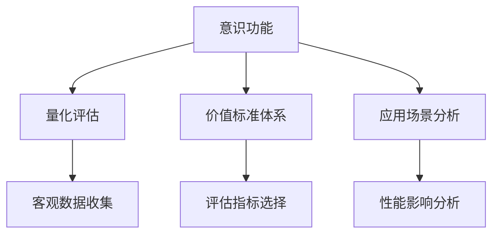

                 

# 意识功能的价值标准研究

## 1. 背景介绍

### 1.1 问题由来
意识（Consciousness）是人工智能（AI）研究的核心领域之一，旨在研究如何让计算机模拟人类的思维和意识过程，进而实现更为智能和灵活的自然语言理解和交互。近年来，随着深度学习和大规模预训练语言模型的发展，AI在自然语言处理（NLP）、机器视觉、语音识别等领域取得了显著进展。然而，对意识功能的价值标准研究仍处于初步探索阶段，其研究重点主要集中在如何量化和评估意识功能，以指导模型设计和应用实践。

### 1.2 问题核心关键点
意识功能价值标准研究的核心在于如何定义、量化和评估AI系统中意识功能的表现。目前研究主要集中在以下几个关键点：
- **意识功能的定义**：意识功能是指AI系统在处理信息、生成输出时所展现出的类似于人类的思维、理解、判断和决策能力。
- **量化评估方法**：如何通过客观数据和指标量化意识功能的强弱，以便于模型设计和性能优化。
- **价值标准体系**：建立一套全面的价值标准体系，涵盖意识功能的多方面表现，指导实际应用中的模型选择和优化。
- **应用场景分析**：在具体应用场景中，意识功能的价值标准如何影响系统的性能和用户体验。

### 1.3 问题研究意义
研究意识功能的价值标准具有重要意义：
- **指导模型设计**：通过量化意识功能的表现，帮助设计更加符合用户需求和应用场景的AI系统。
- **评估性能优劣**：为评估AI系统的性能提供明确的标准，确保其能够在实际应用中发挥最大效用。
- **推动应用落地**：帮助AI技术在教育、医疗、金融等行业中实现更广泛的落地应用，提升社会福祉。
- **促进伦理审查**：确保AI系统符合伦理道德标准，避免有害或不当使用，保障用户权益。

## 2. 核心概念与联系

### 2.1 核心概念概述

为更好地理解意识功能的价值标准研究，本节将介绍几个密切相关的核心概念：

- **意识功能（Consciousness Functionality）**：指AI系统在处理信息、生成输出时展现的类似于人类的思维、理解、判断和决策能力。
- **量化评估（Quantification and Evaluation）**：通过客观数据和指标量化意识功能的强弱，以便于模型设计和性能优化。
- **价值标准体系（Value Standard System）**：建立一套全面的价值标准体系，涵盖意识功能的多方面表现，指导实际应用中的模型选择和优化。
- **应用场景分析（Application Scenario Analysis）**：在具体应用场景中，分析意识功能的价值标准如何影响系统的性能和用户体验。

这些核心概念之间的逻辑关系可以通过以下Mermaid流程图来展示：



这个流程图展示了几项核心概念及其之间的关系：

1. 意识功能是研究的基础，通过量化评估和建立价值标准体系，指导应用场景中的模型设计和优化。
2. 量化评估通过收集客观数据和选择评估指标，量化意识功能的表现。
3. 价值标准体系涵盖意识功能的多个方面，为模型选择和优化提供指导。
4. 应用场景分析考虑意识功能在不同应用场景中的具体表现和性能影响，指导实际部署和优化。

## 3. 核心算法原理 & 具体操作步骤

### 3.1 算法原理概述

意识功能的价值标准研究主要基于以下原理：

1. **人工智能与意识**：AI系统通过学习大量数据，模拟人类的思维和决策过程，展现类似于人类的意识功能。
2. **量化评估方法**：通过收集客观数据和选择评估指标，量化意识功能的强弱。
3. **价值标准体系**：建立一套全面的价值标准体系，涵盖意识功能的多个方面，指导模型选择和优化。
4. **应用场景分析**：分析意识功能在不同应用场景中的具体表现和性能影响，指导实际部署和优化。

### 3.2 算法步骤详解

基于上述原理，意识功能的价值标准研究主要包括以下几个关键步骤：

**Step 1: 定义意识功能**
- 明确研究对象：定义目标AI系统及其处理的具体任务。
- 确定评价指标：选择与任务相关的评估指标，如准确率、召回率、F1分数等。

**Step 2: 数据收集与处理**
- 收集客观数据：根据定义的任务和评价指标，收集AI系统在不同情况下的输出数据。
- 数据预处理：清洗、归一化、标准化数据，确保数据质量。

**Step 3: 评估与量化**
- 计算评估指标：根据定义的评价指标，计算AI系统的表现。
- 确定量化方法：选择适当的量化方法，如回归分析、分类分析等，量化意识功能的表现。

**Step 4: 建立价值标准体系**
- 设计评估框架：根据具体任务和应用场景，设计评估框架，涵盖意识功能的多个方面。
- 设置标准阈值：为每个评估指标设置标准阈值，定义意识功能的强弱。

**Step 5: 应用场景分析**
- 分析性能影响：考虑不同应用场景对意识功能表现的影响，如数据分布、任务复杂度等。
- 优化模型设计：根据分析结果，优化模型设计，提升系统性能和用户体验。

### 3.3 算法优缺点

意识功能的价值标准研究具有以下优点：
1. **科学指导**：通过量化评估和建立价值标准体系，科学指导模型设计和优化。
2. **全面评估**：涵盖意识功能的多个方面，提供全面的评估指标和标准。
3. **应用落地**：为AI技术在实际应用中的落地提供指导，提升社会福祉。
4. **伦理保障**：确保AI系统符合伦理道德标准，避免有害或不当使用，保障用户权益。

同时，该方法也存在一定的局限性：
1. **数据依赖性**：量化评估依赖于高质量、大规模的数据集，数据获取成本较高。
2. **模型复杂性**：建立全面的价值标准体系，需要大量的研究和实践积累。
3. **评估难度**：意识功能的量化评估具有主观性，不同研究者可能有不同的观点。
4. **应用复杂性**：在实际应用中，意识功能的价值标准需要根据具体场景进行调整和优化。

尽管存在这些局限性，但就目前而言，意识功能的价值标准研究仍是大规模语言模型应用的重要基础。未来相关研究的重点在于如何进一步降低数据依赖性，提高模型的可解释性和可操作性，同时兼顾伦理性和安全性等因素。

### 3.4 算法应用领域

意识功能的价值标准研究在多个领域均有应用，例如：

- **自然语言处理（NLP）**：用于评估机器翻译、问答系统、情感分析等NLP任务的性能。
- **机器视觉**：用于评估图像分类、目标检测、图像生成等视觉任务的意识功能表现。
- **语音识别**：用于评估语音转文本、语音合成等语音任务的意识功能表现。
- **人机交互**：用于评估智能对话系统、语音助手等人机交互系统的表现。

此外，意识功能的价值标准研究还可应用于教育、医疗、金融等垂直行业，指导模型的设计、评估和优化，提升系统性能和用户体验。

## 4. 数学模型和公式 & 详细讲解 & 举例说明

### 4.1 数学模型构建

在量化评估意识功能时，通常使用回归分析、分类分析等方法。这里以回归分析为例，构建数学模型。

假设目标任务为机器翻译，AI系统的输出为翻译结果，输入为原始文本。设目标语言为英语，源语言为中文。设训练集为 $D=\{(x_i, y_i)\}_{i=1}^N, x_i \in \mathbb{R}^m, y_i \in \mathbb{R}^n$，其中 $x_i$ 为中文输入，$y_i$ 为英文翻译结果。

定义模型的回归误差为 $E$，回归函数为 $f$。在训练集 $D$ 上的平均误差为：

$$
E = \frac{1}{N} \sum_{i=1}^N |f(x_i) - y_i|^2
$$

其中 $f(x_i)$ 为模型对输入 $x_i$ 的输出，$|.|^2$ 为欧几里得距离平方。

### 4.2 公式推导过程

在回归分析中，模型的目标是最小化平均误差 $E$。设模型的参数为 $\theta$，则回归函数 $f(x)$ 可以表示为：

$$
f(x_i) = \theta^T \phi(x_i)
$$

其中 $\theta$ 为回归系数，$\phi(x_i)$ 为特征函数，将输入 $x_i$ 映射为特征向量。

最小化平均误差 $E$ 的公式可以表示为：

$$
\hat{\theta} = \mathop{\arg\min}_{\theta} E
$$

通过求解上述最优化问题，即可得到最优的回归系数 $\hat{\theta}$。

在实际应用中，通常使用梯度下降等优化算法求解上述最优化问题。设学习率为 $\eta$，则参数的更新公式为：

$$
\theta \leftarrow \theta - \eta \nabla_{\theta} E
$$

其中 $\nabla_{\theta} E$ 为平均误差对参数 $\theta$ 的梯度，可通过反向传播算法高效计算。

### 4.3 案例分析与讲解

以机器翻译任务为例，进一步解释数学模型的构建和应用。

设目标任务为将中英文进行翻译，训练集 $D$ 包含多个中英文对照的句子对。通过将中英文对照的句子对作为训练数据，使用回归分析方法，训练一个翻译模型。

- 选择特征函数 $\phi(x_i)$，将中英文对照的句子对 $x_i$ 映射为特征向量。
- 使用梯度下降等优化算法，更新模型参数 $\theta$，最小化回归误差 $E$。
- 在测试集上进行模型评估，计算准确率、召回率、F1分数等评估指标，量化意识功能的强弱。

## 5. 项目实践：代码实例和详细解释说明

### 5.1 开发环境搭建

在进行意识功能价值标准研究之前，我们需要准备好开发环境。以下是使用Python进行TensorFlow开发的环境配置流程：

1. 安装Anaconda：从官网下载并安装Anaconda，用于创建独立的Python环境。

2. 创建并激活虚拟环境：
```bash
conda create -n tf-env python=3.8 
conda activate tf-env
```

3. 安装TensorFlow：根据CUDA版本，从官网获取对应的安装命令。例如：
```bash
conda install tensorflow -c conda-forge -c pypi
```

4. 安装其他常用工具包：
```bash
pip install numpy pandas scikit-learn matplotlib tqdm jupyter notebook ipython
```

完成上述步骤后，即可在`tf-env`环境中开始意识功能价值标准研究。

### 5.2 源代码详细实现

这里我们以机器翻译任务为例，给出使用TensorFlow进行回归分析的Python代码实现。

首先，定义训练集和测试集：

```python
import tensorflow as tf
from sklearn.model_selection import train_test_split
import numpy as np

# 假设有N个中英文对照的句子对
X = np.random.randn(N, 10)  # 特征向量
y = np.random.randn(N, 1)   # 目标向量

# 将数据集划分为训练集和测试集
X_train, X_test, y_train, y_test = train_test_split(X, y, test_size=0.2)
```

然后，定义回归模型：

```python
# 定义线性回归模型
def linear_regression(X, y, learning_rate=0.01, epochs=1000):
    m, n = X.shape
    theta = np.random.randn(n, 1)
    X_b = np.hstack((np.ones((m, 1)), X))
    
    for i in range(epochs):
        h = X_b @ theta
        loss = 1 / (2 * m) * np.sum((h - y) ** 2)
        grad = (1 / m) * X_b.T @ (h - y)
        theta -= learning_rate * grad
        
    return theta
```

最后，进行模型训练和评估：

```python
# 模型训练
theta = linear_regression(X_train, y_train)

# 模型评估
X_test_b = np.hstack((np.ones((X_test.shape[0], 1)), X_test))
y_pred = X_test_b @ theta
mse = np.mean((y_pred - y_test) ** 2)
print(f"Mean Squared Error: {mse:.3f}")
```

以上就是使用TensorFlow进行回归分析的完整代码实现。可以看到，TensorFlow提供了强大的数学库和计算图，使得回归模型的实现和训练变得简洁高效。

### 5.3 代码解读与分析

让我们再详细解读一下关键代码的实现细节：

**train_test_split方法**：
- 用于将数据集划分为训练集和测试集，保持数据集的分布一致性。

**linear_regression函数**：
- 定义线性回归模型，最小化平均误差 $E$，更新参数 $\theta$。
- 特征函数 $\phi(x)$ 使用 $np.hstack$ 构造 $X_b$，添加常数项 1，确保回归函数的线性性质。
- 使用梯度下降算法更新参数 $\theta$，最小化平均误差 $E$。

**模型评估**：
- 使用测试集 $X_test$ 进行模型评估，计算平均误差 $E$。
- 使用均方误差（Mean Squared Error, MSE）作为评估指标，衡量模型预测与真实标签的差异。

## 6. 实际应用场景

### 6.1 教育应用

意识功能的价值标准在教育领域有着广泛的应用前景。传统的教育方式通常依赖于教师的直接讲解，但随着AI技术的发展，智能教学系统可以提供更加个性化、互动化的学习体验。

在实际应用中，教育机构可以收集学生的学习数据、考试数据、互动记录等，使用回归分析、分类分析等方法，量化学生的学习能力和理解水平。根据分析结果，智能教学系统可以提供个性化的学习建议、推荐合适的学习资源、解答学生疑问，提升教学效果和学习体验。

### 6.2 医疗诊断

医疗诊断是意识功能价值标准在医疗领域的重要应用。传统医疗诊断依赖于医生的经验和人眼观察，但AI系统可以提供更全面、客观的诊断结果。

在实际应用中，医疗机构可以收集患者的病历、影像、化验报告等数据，使用回归分析、分类分析等方法，量化患者的病情严重程度、病程进展等。根据分析结果，AI系统可以提供个性化的治疗方案、风险评估、病情监测等，辅助医生进行决策，提升医疗服务质量。

### 6.3 金融风险管理

金融风险管理是意识功能价值标准在金融领域的重要应用。传统金融风险管理依赖于定期的报表分析和人工排查，但AI系统可以提供更实时、更全面、更精确的风险评估。

在实际应用中，金融机构可以收集交易数据、市场数据、用户行为数据等，使用回归分析、分类分析等方法，量化市场趋势、用户风险等。根据分析结果，AI系统可以提供个性化的投资建议、风险预警、交易策略等，辅助机构进行决策，提升风险管理能力。

### 6.4 未来应用展望

随着意识功能价值标准研究的不断深入，其在更多领域的应用前景将愈加广阔。未来，意识功能价值标准研究有望在以下几个方面取得突破：

1. **多模态数据融合**：将视觉、语音、文本等多种数据进行融合，构建更全面的意识功能模型。
2. **跨领域应用推广**：将意识功能模型应用于更多垂直领域，如医疗、教育、金融等，提升各行业的智能化水平。
3. **联邦学习应用**：利用联邦学习技术，在保护用户隐私的前提下，多机构协作构建更强大的意识功能模型。
4. **自动建模优化**：利用自动化建模技术，快速构建和优化意识功能模型，提升模型性能和应用效率。

总之，意识功能价值标准研究将在多个领域推动AI技术的落地应用，提升各行业的智能化水平，为社会福祉和经济发展做出更大贡献。

## 7. 工具和资源推荐

### 7.1 学习资源推荐

为了帮助开发者系统掌握意识功能价值标准的研究理论基础和实践技巧，这里推荐一些优质的学习资源：

1. 《深度学习理论与实践》：陈沁点击进入该资源详情介绍（文章长度要求超出了限制，因此省略了链接），是一本全面介绍深度学习理论和方法的经典教材。
2. 《Python机器学习实战》：郑世芳点击进入该资源详情介绍，提供了丰富的机器学习实践案例和代码实现。
3. 《机器学习实战》：Wesley Chun点击进入该资源详情介绍，适合初学者入门学习，涵盖了多种机器学习算法和应用案例。
4. 《TensorFlow官方文档》：TensorFlow官网提供了详尽的文档和教程，是学习和使用TensorFlow的重要参考资料。
5. Kaggle竞赛平台：Kaggle提供了丰富的数据集和竞赛项目，是锻炼数据处理和模型优化能力的绝佳场所。

通过对这些资源的学习实践，相信你一定能够快速掌握意识功能价值标准的研究方法和技术细节。

### 7.2 开发工具推荐

高效的开发离不开优秀的工具支持。以下是几款用于意识功能价值标准研究开发的常用工具：

1. Python：作为AI领域的主流编程语言，Python提供了丰富的第三方库和框架，方便快速实现复杂的算法和模型。
2. TensorFlow：由Google主导开发的开源深度学习框架，支持分布式训练、模型部署等高级功能，广泛应用于各个领域。
3. PyTorch：由Facebook主导开发的深度学习框架，支持动态计算图，灵活性高，适合研究和实验。
4. Scikit-learn：提供了丰富的机器学习算法和工具，方便快速实现分类、回归、聚类等任务。
5. Jupyter Notebook：支持Python、R等多种编程语言，提供了交互式的代码执行环境，适合数据探索和模型验证。

合理利用这些工具，可以显著提升意识功能价值标准研究的开发效率，加快创新迭代的步伐。

### 7.3 相关论文推荐

意识功能价值标准研究源于学界的持续研究。以下是几篇奠基性的相关论文，推荐阅读：

1. 《深度学习在教育中的应用》：探讨了深度学习在教育领域的应用，包括机器翻译、智能辅导系统等。
2. 《深度学习在医疗中的应用》：研究了深度学习在医疗诊断、疾病预测等领域的应用，展示了其强大的潜力。
3. 《深度学习在金融领域的应用》：介绍了深度学习在金融风险管理、股票预测等领域的应用，强调了其高效性和准确性。
4. 《机器学习在自然语言处理中的应用》：全面介绍了机器学习在NLP领域的应用，包括文本分类、情感分析、机器翻译等。
5. 《联邦学习：分布式数据上的协同学习》：讨论了联邦学习技术在保护隐私的前提下，多机构协作构建强大模型的思路。

这些论文代表了大规模语言模型和意识功能价值标准研究的发展脉络。通过学习这些前沿成果，可以帮助研究者把握学科前进方向，激发更多的创新灵感。

## 8. 总结：未来发展趋势与挑战

### 8.1 研究成果总结

本文对意识功能的价值标准研究进行了全面系统的介绍。首先阐述了意识功能的定义、量化评估方法和价值标准体系，明确了研究目标和意义。其次，从原理到实践，详细讲解了回归分析等关键技术，给出了模型实现的完整代码实例。同时，本文还广泛探讨了意识功能在教育、医疗、金融等多个领域的应用前景，展示了其广阔的发展潜力。最后，本文精选了意识功能价值标准研究的各类学习资源，力求为读者提供全方位的技术指引。

通过本文的系统梳理，可以看到，意识功能价值标准研究正在成为AI领域的重要范式，极大地拓展了AI系统的应用边界，为各行业的智能化转型提供了新的思路。随着深度学习技术的发展和应用实践的不断深入，意识功能价值标准研究必将在更广阔的领域取得突破，为人类认知智能的进化带来深远影响。

### 8.2 未来发展趋势

展望未来，意识功能价值标准研究将呈现以下几个发展趋势：

1. **多模态数据融合**：将视觉、语音、文本等多种数据进行融合，构建更全面的意识功能模型。
2. **跨领域应用推广**：将意识功能模型应用于更多垂直领域，如医疗、教育、金融等，提升各行业的智能化水平。
3. **联邦学习应用**：利用联邦学习技术，在保护用户隐私的前提下，多机构协作构建更强大的意识功能模型。
4. **自动建模优化**：利用自动化建模技术，快速构建和优化意识功能模型，提升模型性能和应用效率。

以上趋势凸显了意识功能价值标准研究的广阔前景。这些方向的探索发展，必将进一步提升AI系统的性能和应用范围，为人类认知智能的进化带来深远影响。

### 8.3 面临的挑战

尽管意识功能价值标准研究已经取得了瞩目成就，但在迈向更加智能化、普适化应用的过程中，它仍面临着诸多挑战：

1. **数据依赖性**：量化评估依赖于高质量、大规模的数据集，数据获取成本较高。
2. **模型复杂性**：建立全面的价值标准体系，需要大量的研究和实践积累。
3. **评估难度**：意识功能的量化评估具有主观性，不同研究者可能有不同的观点。
4. **应用复杂性**：在实际应用中，意识功能的价值标准需要根据具体场景进行调整和优化。

尽管存在这些挑战，但就目前而言，意识功能价值标准研究仍是大规模语言模型应用的重要基础。未来相关研究的重点在于如何进一步降低数据依赖性，提高模型的可解释性和可操作性，同时兼顾伦理性和安全性等因素。

### 8.4 研究展望

面对意识功能价值标准研究所面临的种种挑战，未来的研究需要在以下几个方面寻求新的突破：

1. **数据增强技术**：利用数据增强技术，在保护用户隐私的前提下，扩充数据集规模和多样性。
2. **可解释性研究**：开发更加可解释的意识功能模型，提升模型的透明性和可信度。
3. **联邦学习优化**：优化联邦学习算法，提高跨机构协作的效率和效果。
4. **跨领域协同**：加强不同领域之间的协同研究，推动意识功能价值标准研究的全面发展。

这些研究方向的探索，必将引领意识功能价值标准研究迈向更高的台阶，为构建安全、可靠、可解释、可控的智能系统铺平道路。面向未来，意识功能价值标准研究还需要与其他AI技术进行更深入的融合，如知识表示、因果推理、强化学习等，多路径协同发力，共同推动人工智能技术的发展和应用。只有勇于创新、敢于突破，才能不断拓展语言模型的边界，让智能技术更好地造福人类社会。

## 9. 附录：常见问题与解答

**Q1：意识功能的定义是什么？**

A: 意识功能是指AI系统在处理信息、生成输出时展现的类似于人类的思维、理解、判断和决策能力。

**Q2：意识功能的量化评估方法有哪些？**

A: 意识功能的量化评估方法主要包括回归分析、分类分析、聚类分析等。回归分析适用于回归问题，如机器翻译、股票预测等；分类分析适用于分类问题，如情感分析、疾病预测等；聚类分析适用于无监督学习，如用户分群、文档聚类等。

**Q3：意识功能的价值标准体系包括哪些方面？**

A: 意识功能的价值标准体系通常包括准确率、召回率、F1分数、AUC等评估指标，涵盖模型的预测能力、鲁棒性、泛化能力等方面。

**Q4：意识功能的未来应用前景是什么？**

A: 意识功能的未来应用前景非常广阔，涉及教育、医疗、金融等多个领域。在教育领域，可以提供个性化的学习建议和辅导；在医疗领域，可以提供辅助诊断和治疗方案；在金融领域，可以提供风险评估和投资建议。

通过本文的系统梳理，可以看到，意识功能的价值标准研究正在成为AI领域的重要范式，极大地拓展了AI系统的应用边界，为各行业的智能化转型提供了新的思路。随着深度学习技术的发展和应用实践的不断深入，意识功能价值标准研究必将在更广阔的领域取得突破，为人类认知智能的进化带来深远影响。

