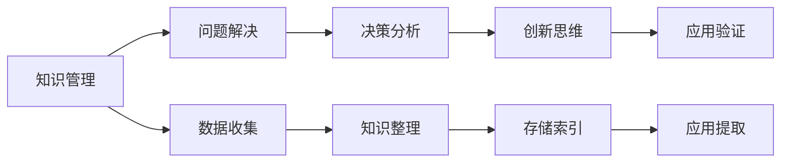

                 

# 打造个人思维体系的意义

在快速发展的科技时代，构建一个强大的个人思维体系变得越来越重要。无论是在技术领域、商业领域还是日常生活，一个良好的思维体系可以帮助我们更高效地解决问题，更全面地理解世界，更快速地做出决策。本文将深入探讨打造个人思维体系的意义、核心要素、实施方法以及面临的挑战，希望能为读者提供一些启示和实用的建议。

## 1. 背景介绍

### 1.1 问题由来

随着人工智能、大数据、云计算等技术的飞速发展，信息爆炸时代已经来临。面对海量信息，如何筛选、处理、整合，并从中提取出有用的知识，成为了每一个行业从业者需要解决的重要问题。在这种背景下，个人思维体系的重要性被进一步凸显。

### 1.2 问题核心关键点

个人思维体系的核心关键点在于其完整性、系统性和前瞻性。具体来说：

- **完整性**：思维体系应涵盖知识、方法、技能等多方面，形成闭环。
- **系统性**：各个要素之间相互关联，形成一个有机的整体。
- **前瞻性**：能够预测未来趋势，适应变化，灵活应变。

## 2. 核心概念与联系

### 2.1 核心概念概述

构建个人思维体系涉及多个核心概念，包括知识管理、问题解决、决策分析、创新思维等。这些概念之间相互关联，形成一个动态、开放的系统。

- **知识管理**：指的是对知识进行收集、整理、存储和应用的过程，是思维体系的基础。
- **问题解决**：面对复杂问题时，能够系统化地分析、推理、验证和实施解决方案的能力。
- **决策分析**：在多个选项中选择最优方案，涉及数据驱动、风险评估、情感平衡等多个方面。
- **创新思维**：能够从不同角度思考问题，提出新颖的解决方案，具有创造性。

### 2.2 核心概念原理和架构的 Mermaid 流程图



这个流程图展示了个人思维体系的核心概念之间的联系。知识管理是基础，问题解决和决策分析基于知识，而创新思维则是提升和完善这一体系的关键。应用验证则是对思维体系的实际应用和反馈，进一步优化体系。

## 3. 核心算法原理 & 具体操作步骤

### 3.1 算法原理概述

构建个人思维体系涉及多个算法和技术，包括知识图谱构建、信息抽取、自然语言处理、决策树和神经网络等。这些算法和技术共同作用，形成一个综合的解决方案。

### 3.2 算法步骤详解

1. **知识收集与整理**：
   - 使用爬虫、RSS订阅等工具收集相关领域的知识。
   - 使用知识管理工具（如Evernote、Notion等）进行整理和分类。

2. **知识存储与索引**：
   - 利用数据库或搜索引擎（如Elasticsearch、Solr）存储知识，并建立索引。
   - 使用知识图谱工具（如Neo4j）构建知识图谱，以便于理解和查询。

3. **问题分析与解决**：
   - 使用自然语言处理技术（如BERT、GPT等）提取问题和相关知识。
   - 使用决策树或神经网络模型（如随机森林、XGBoost等）构建解决方案，并进行优化。

4. **创新与验证**：
   - 使用创新思维工具（如Brainstorming、Mind Mapping等）激发新的解决方案。
   - 利用A/B测试等方法验证新方案的可行性和效果。

### 3.3 算法优缺点

**优点**：
- **系统化**：能够整合多种算法和技术，形成综合的解决方案。
- **灵活性**：能够适应不同领域的知识和问题，具有较强的泛化能力。
- **高效性**：利用先进技术和工具，大大提高了问题的解决速度和精度。

**缺点**：
- **复杂性**：涉及多种算法和技术，需要一定的专业知识和技能。
- **成本高**：需要购买和维护相关工具和平台。
- **数据依赖**：依赖高质量的数据和知识，对数据获取和处理的要求较高。

### 3.4 算法应用领域

个人思维体系在多个领域都有广泛的应用，例如：

- **技术开发**：利用知识管理、问题解决和决策分析技术，提高开发效率和质量。
- **商业决策**：通过综合利用多领域知识和创新思维，制定最优的商业策略。
- **学术研究**：构建知识体系，进行创新研究，提出前沿理论和技术。
- **生活管理**：通过优化时间管理、任务规划等，提高生活质量和工作效率。

## 4. 数学模型和公式 & 详细讲解 & 举例说明

### 4.1 数学模型构建

构建个人思维体系需要构建多个数学模型，以量化和评估不同的解决方案。以下是一个简化的数学模型构建示例：

1. **知识图谱构建**：
   - 节点表示概念，边表示关系，形成图结构。
   - 使用图神经网络（GNN）进行处理和分析。

2. **问题解决模型**：
   - 将问题分解为多个子问题，形成树状结构。
   - 使用决策树或神经网络进行推理和验证。

3. **创新思维模型**：
   - 使用遗传算法或模拟退火算法生成新的解决方案。
   - 通过计算多样性、创新性等指标评估解决方案的质量。

### 4.2 公式推导过程

以知识图谱构建为例，假设有节点集 $V$ 和边集 $E$，节点的属性为 $A$，边的属性为 $R$。知识图谱的构建公式如下：

$$ G(V, E, A, R) = \bigcup_{i \in V} \bigcup_{j \in V} \bigcup_{k \in R} (i, k, j) $$

其中，$G$ 表示图结构，$V$ 表示节点集，$E$ 表示边集，$A$ 表示节点属性，$R$ 表示边属性。

### 4.3 案例分析与讲解

假设我们需要构建一个关于“人工智能”的知识图谱。具体步骤如下：

1. **数据收集**：
   - 通过爬虫和RSS订阅收集“人工智能”相关的新闻、论文、书籍等文本数据。
   - 使用命名实体识别（NER）技术提取概念和关系，形成初始节点和边。

2. **数据处理**：
   - 对初始数据进行去重、清洗、标注等处理，确保数据质量。
   - 使用知识图谱工具（如Gephi）构建图结构，并进行可视化展示。

3. **分析优化**：
   - 利用图神经网络（GNN）算法，对知识图谱进行深度分析，提取关键节点和关系。
   - 使用社区发现算法（如Louvain算法）识别知识图谱中的重要社区，进行优化。

## 5. 项目实践：代码实例和详细解释说明

### 5.1 开发环境搭建

1. **安装Python**：
   - 从官网下载Python安装包，安装到系统。
   - 在Python环境中安装必要的库，如Pandas、NumPy、Scikit-learn等。

2. **安装知识图谱工具**：
   - 安装Neo4j数据库，并创建图数据库。
   - 使用Py2neo或Gephi等工具进行知识图谱构建和分析。

3. **安装自然语言处理库**：
   - 安装NLTK、SpaCy等自然语言处理库，用于提取文本信息。
   - 安装BERT、GPT等预训练模型，用于问题分析和创新思维。

### 5.2 源代码详细实现

以下是一个简化的知识图谱构建示例代码：

```python
import pandas as pd
from py2neo import Graph

# 读取知识图谱数据
data = pd.read_csv('knowledge_graph.csv')

# 连接到Neo4j数据库
graph = Graph('http://localhost:7474/db/data/')

# 定义节点和边
def create_node(name, type):
    node = graph.create({'name': name, 'type': type})
    return node

def create_edge(source, target, rel):
    edge = graph.create({'relationship': rel})
    source_node = graph.nodes.get('name', source)
    target_node = graph.nodes.get('name', target)
    edge['start_node'] = source_node['id']
    edge['end_node'] = target_node['id']
    return edge

# 构建知识图谱
for row in data.itertuples():
    name = row.name
    type = row.type
    source = row.source
    target = row.target
    rel = row.rel
    node = create_node(name, type)
    edge = create_edge(source, target, rel)
    node['source'] = edge['start_node']
    node['target'] = edge['end_node']
```

### 5.3 代码解读与分析

- **数据读取**：使用Pandas库读取CSV格式的知识图谱数据，并进行处理。
- **连接数据库**：使用Py2neo库连接到Neo4j数据库，创建图数据库。
- **节点和边定义**：定义节点和边的创建函数，使用Python语言和Neo4j API进行操作。
- **知识图谱构建**：遍历数据，创建节点和边，并更新节点的属性。

### 5.4 运行结果展示

运行上述代码后，我们可以在Neo4j数据库中看到构建的知识图谱。使用Gephi等工具进行可视化展示，可以直观地看到知识图谱的结构和关系。

## 6. 实际应用场景

### 6.1 技术开发

在技术开发中，个人思维体系可以通过知识管理、问题解决和决策分析等技术，提高开发效率和质量。例如，在软件开发中，开发者可以利用知识图谱进行技术选型和问题排查，利用自然语言处理技术进行代码生成和优化，利用决策分析技术进行版本控制和代码评审。

### 6.2 商业决策

商业决策中，个人思维体系可以通过综合利用多领域知识和创新思维，制定最优的商业策略。例如，在市场营销中，可以利用知识图谱进行用户画像和行为分析，利用自然语言处理技术进行情感分析和舆情监测，利用决策分析技术进行需求预测和产品推荐。

### 6.3 学术研究

学术研究中，个人思维体系可以通过构建知识体系，进行创新研究，提出前沿理论和技术。例如，在机器学习领域，可以利用知识图谱进行模型选择和优化，利用自然语言处理技术进行文本挖掘和语义分析，利用决策分析技术进行算法评估和改进。

### 6.4 生活管理

生活管理中，个人思维体系可以通过优化时间管理、任务规划等，提高生活质量和工作效率。例如，在日程安排中，可以利用知识图谱进行事件关联和优先级排序，利用自然语言处理技术进行语言理解和交互，利用决策分析技术进行任务分配和资源优化。

## 7. 工具和资源推荐

### 7.1 学习资源推荐

- **在线课程**：
  - Coursera、edX、Udacity等平台提供的计算机科学和人工智能课程，如《Deep Learning Specialization》、《Applied Data Science with Python》等。
  - Kaggle上的竞赛和项目，可以实践知识图谱构建、自然语言处理和决策分析等技术。

- **书籍推荐**：
  - 《深度学习》by Ian Goodfellow、Yoshua Bengio和Aaron Courville。
  - 《自然语言处理综论》by Jurafsky 和 Martin。
  - 《人工智能：一种现代方法》by Stuart Russell和Peter Norvig。

- **技术博客和社区**：
  - GitHub、Stack Overflow、Kaggle等社区，可以获取最新的技术资讯和代码实现。
  - Medium、Towards Data Science等技术博客，可以阅读专家文章和实践心得。

### 7.2 开发工具推荐

- **编程语言**：
  - Python：功能强大、社区活跃，适合数据科学和机器学习开发。
  - R：统计分析和数据可视化能力强，适合数据科学和统计学研究。

- **开发工具**：
  - Jupyter Notebook：支持多种编程语言，方便编写和分享代码。
  - VS Code：功能全面、扩展性强，适合开发和调试。

- **数据处理工具**：
  - Pandas：数据处理和分析能力强，适合数据清洗和预处理。
  - NumPy：数值计算能力强，适合矩阵运算和科学计算。

- **知识图谱工具**：
  - Neo4j：关系型数据库，支持图数据建模和分析。
  - Gephi：可视化工具，支持复杂网络分析和展示。

### 7.3 相关论文推荐

- **知识图谱构建**：
  - "Knowledge Graphs: Creating Nodes and Edges in Semantic Space" by Brave N和Neil Lawrence。
  - "Translating Databases into Ontologies: A MapReduce Approach to Ontology Construction from Raw Data" by Juan A. Gomez-Perez和Gerhard C. Klügl。

- **自然语言处理**：
  - "Bert: Pre-training of Deep Bidirectional Transformers for Language Understanding" by Jacob Devlin等。
  - "Attention is All You Need" by Ashish Vaswani等。

- **决策分析**：
  - "Decision Trees" by J. Ross Quinlan。
  - "Random Forest" by Leo Breiman。

## 8. 总结：未来发展趋势与挑战

### 8.1 研究成果总结

个人思维体系的构建是一个长期的过程，需要不断地学习和实践。目前已经取得了一定的成果，例如：

- **知识图谱构建**：已经在多个领域应用，如医疗、金融、社交网络等。
- **自然语言处理**：已经在语言模型、文本分类、情感分析等方面取得突破。
- **决策分析**：已经在推荐系统、预测分析、风险评估等方面得到应用。

### 8.2 未来发展趋势

个人思维体系的构建将呈现以下几个发展趋势：

- **自动化和智能化**：未来将利用AI技术，自动构建知识图谱、进行自然语言处理和决策分析，提升效率和准确性。
- **跨领域融合**：未来将结合更多领域的数据和知识，构建更加全面和深入的思维体系。
- **实时动态化**：未来将利用流数据处理技术，实现实时动态更新和优化。

### 8.3 面临的挑战

个人思维体系的构建面临多个挑战，例如：

- **数据质量和多样性**：数据获取和处理需要大量的资源和时间，且数据质量直接影响最终结果。
- **模型复杂性和可解释性**：构建复杂的模型需要高深的专业知识和技能，且模型的可解释性需要进一步提高。
- **系统集成和协同**：需要整合多种技术和工具，确保各部分协同工作，提升整体效果。

### 8.4 研究展望

未来的研究需要在以下几个方面寻求新的突破：

- **自动化构建**：开发自动化工具，减少人工干预，提高构建效率。
- **跨领域融合**：探索跨领域知识融合技术，构建更加全面和深入的思维体系。
- **实时动态优化**：利用流数据处理技术，实现实时动态更新和优化。
- **可解释性和透明度**：提高模型的可解释性和透明度，确保系统的可信度和安全性。

## 9. 附录：常见问题与解答

**Q1: 如何构建高效的知识图谱？**

A: 构建高效的知识图谱需要以下几个步骤：

1. **数据收集**：通过爬虫、API、数据库等方式获取相关领域的知识数据。
2. **数据清洗**：对数据进行去重、清洗、标注等处理，确保数据质量。
3. **图结构设计**：设计合理的节点和边，使用知识图谱工具构建图结构。
4. **算法优化**：利用图神经网络（GNN）等算法进行优化和分析，提取关键节点和关系。
5. **可视化展示**：使用可视化工具（如Gephi）展示知识图谱的结构和关系。

**Q2: 如何提高自然语言处理的效率？**

A: 提高自然语言处理效率需要以下几个方面：

1. **预训练模型**：使用预训练模型（如BERT、GPT等）进行快速处理。
2. **高效算法**：使用高效的算法（如Transformer）进行模型训练和推理。
3. **分布式计算**：利用分布式计算（如Spark、TensorFlow）提升计算效率。
4. **数据增强**：利用数据增强技术（如回译、近义替换等）提升模型泛化能力。
5. **模型压缩**：使用模型压缩技术（如剪枝、量化）优化模型大小和推理速度。

**Q3: 如何选择合适的决策分析模型？**

A: 选择合适的决策分析模型需要考虑多个因素：

1. **数据类型**：根据数据类型选择合适的模型，如分类、回归、序列等。
2. **问题性质**：根据问题性质选择合适的模型，如监督学习、无监督学习、强化学习等。
3. **模型复杂度**：根据数据量和计算资源选择合适的模型，避免过拟合和欠拟合。
4. **可解释性**：根据应用需求选择合适的模型，确保模型的可解释性和透明度。
5. **实时性要求**：根据实时性要求选择合适的模型，确保系统的响应速度。

---

作者：禅与计算机程序设计艺术 / Zen and the Art of Computer Programming

