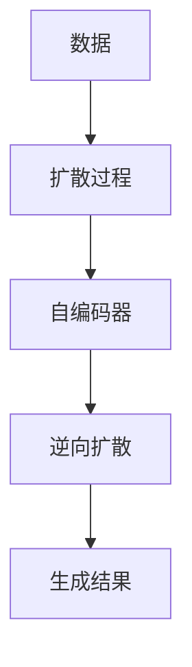

                 

# 扩散变压器：生成式 AI 的未来

> 关键词：扩散变压器, 生成式 AI, 自动编码器, 扩散过程, 语言生成, 图像生成, 未来技术趋势, 潜在应用

## 1. 背景介绍

随着深度学习技术的快速发展和计算资源的不断提升，生成式人工智能(AI)领域迎来了新的突破，扩散变压器(Diffusion Transformers)成为了一种前沿技术，引领着生成式AI的未来发展方向。扩散变压器结合了传统的自编码器和扩散过程，通过不断“扩散”噪声，逐步逼近目标数据分布，实现了高质量的生成结果。这一技术在自然语言处理(NLP)和计算机视觉(CV)等领域展现了巨大潜力，成为AI领域的研究热点。本文将详细探讨扩散变压器的原理与实践，并分析其应用场景和发展趋势。

### 1.1 问题由来

生成式AI，是指通过机器学习模型自动生成数据（如图像、文本、音频等）的技术。传统的生成模型如自编码器和GAN等，虽然能够在一定程度上生成数据，但存在模式塌陷、数据生成质量不稳定等问题。扩散变压器通过引入扩散过程，解决了这些问题，实现了更加稳定、高质量的生成。扩散变压器在语言生成、图像生成、视频生成等领域取得了显著成果，为生成式AI的未来发展奠定了坚实基础。

## 2. 核心概念与联系

### 2.1 核心概念概述

为深入理解扩散变压器的原理与实践，我们需要先了解以下核心概念：

- **扩散变压器**：一种结合自编码器和扩散过程的生成模型，通过不断“扩散”噪声，逐步逼近目标数据分布，生成高质量的数据。
- **自编码器**：一种无监督学习模型，通过学习数据的编码表示和解码表示，实现数据的压缩和重构。
- **扩散过程**：一种基于马尔可夫链的随机过程，通过不断加入噪声，将复杂分布逐步转化为简单分布，从而实现数据生成。
- **语言生成**：指通过生成模型自动生成自然语言文本，如对话生成、文本摘要等。
- **图像生成**：指通过生成模型自动生成图像，如人脸生成、图像转换等。

### 2.2 核心概念联系

扩散变压器的核心思想是结合自编码器和扩散过程，将复杂的数据分布转化为简单分布，并通过反向传播机制学习生成过程的参数。具体来说，扩散变压器包括以下步骤：

1. **扩散过程**：通过不断加入噪声，将复杂的数据分布逐步转化为简单分布。
2. **自编码器**：学习数据的编码表示和解码表示，实现数据的压缩和重构。
3. **逆向扩散**：通过反向传播机制学习生成过程的参数，逐步逼近目标数据分布，实现数据生成。

以下是一个简化的扩散变压器工作流程示意图，展示了扩散变压器的主要步骤：



通过扩散变压器的工作流程，我们可以看到，该模型通过不断“扩散”噪声，逐步逼近目标数据分布，从而实现高质量的数据生成。这一过程结合了自编码器和扩散过程的优点，解决了传统生成模型中存在的问题。

## 3. 核心算法原理 & 具体操作步骤
### 3.1 算法原理概述

扩散变压器的核心算法原理基于自编码器和扩散过程的结合。具体来说，扩散变压器包括以下几个关键步骤：

1. **数据扩散**：通过不断加入噪声，将复杂的数据分布逐步转化为简单分布。
2. **自编码器**：学习数据的编码表示和解码表示，实现数据的压缩和重构。
3. **逆向扩散**：通过反向传播机制学习生成过程的参数，逐步逼近目标数据分布，实现数据生成。

这些步骤通过优化算法（如梯度下降）不断迭代，直到生成器能够生成高质量的目标数据。

### 3.2 算法步骤详解

以下是扩散变压器的详细算法步骤：

**Step 1: 数据预处理**
- 对输入数据进行标准化处理，如归一化、中心化等，以便于自编码器学习数据的编码表示。
- 将数据转化为向量形式，以便于自编码器的输入。

**Step 2: 数据扩散**
- 通过不断加入噪声，将数据分布逐步转化为简单分布。具体来说，可以通过向数据向量中逐步添加高斯噪声来实现。
- 生成噪声变量的分布由简单到复杂，例如从正态分布开始，逐步过渡到复杂分布。

**Step 3: 自编码器学习**
- 使用自编码器学习数据的编码表示和解码表示，实现数据的压缩和重构。
- 自编码器由编码器和解码器组成，编码器将数据映射为编码表示，解码器将编码表示解码为原始数据。

**Step 4: 逆向扩散**
- 通过反向传播机制学习生成过程的参数，逐步逼近目标数据分布，实现数据生成。
- 逆向扩散包括两个阶段：预测阶段和生成阶段。在预测阶段，生成器学习数据的编码表示，通过解码器将其转化为生成结果。在生成阶段，生成器通过解码器逐步逼近目标数据分布，实现高质量的数据生成。

**Step 5: 模型训练与评估**
- 使用训练数据对模型进行训练，通过优化算法不断迭代，逐步优化生成器的参数。
- 在训练过程中，可以使用验证集对模型进行评估，调整模型参数，避免过拟合。

### 3.3 算法优缺点

扩散变压器的优点包括：

1. **高质量生成**：通过扩散过程和自编码器的结合，实现了高质量的数据生成，解决了传统生成模型中的模式塌陷等问题。
2. **稳定性高**：扩散过程通过逐步“扩散”噪声，实现了稳定、渐进的数据生成，避免了传统生成模型中的噪声爆发问题。
3. **通用性强**：扩散变压器可以应用于各种生成任务，如图像生成、语言生成、音频生成等，具有广泛的适用性。

然而，扩散变压器的缺点也显而易见：

1. **计算成本高**：扩散变压器需要大量的计算资源，特别是在扩散过程中，需要进行大量的矩阵运算，导致计算成本较高。
2. **训练时间长**：扩散变压器需要较长的训练时间，特别是在逆向扩散阶段，需要进行大量的反向传播操作，导致训练时间较长。
3. **可解释性差**：扩散变压器的生成过程较为复杂，难以解释其内部工作机制，缺乏可解释性。

### 3.4 算法应用领域

扩散变压器的应用领域非常广泛，涵盖了自然语言处理、计算机视觉、音频生成等多个领域。以下是扩散变压器的几个典型应用场景：

1. **语言生成**：扩散变压器可以用于文本生成任务，如对话生成、文本摘要、诗歌生成等。通过不断加入噪声，逐步逼近目标文本分布，实现高质量的文本生成。
2. **图像生成**：扩散变压器可以用于图像生成任务，如图像生成、图像转换、图像修复等。通过不断加入噪声，逐步逼近目标图像分布，实现高质量的图像生成。
3. **音频生成**：扩散变压器可以用于音频生成任务，如语音合成、音乐生成、音频修复等。通过不断加入噪声，逐步逼近目标音频分布，实现高质量的音频生成。

## 4. 数学模型和公式 & 详细讲解
### 4.1 数学模型构建

扩散变压器的数学模型基于自编码器和扩散过程的结合。具体来说，扩散变压器包括以下几个关键步骤：

1. **数据扩散**：通过不断加入噪声，将数据分布逐步转化为简单分布。
2. **自编码器**：学习数据的编码表示和解码表示，实现数据的压缩和重构。
3. **逆向扩散**：通过反向传播机制学习生成过程的参数，逐步逼近目标数据分布，实现数据生成。

以下是扩散变压器的数学模型构建过程：

**数据扩散**：

设输入数据为 $x$，噪声变量为 $z$，扩散过程为 $q(z_t|z_{t-1})$，则数据扩散的数学模型为：

$$
x_t = f(x, t) + z_t
$$

其中，$f$ 表示扩散过程，$t$ 表示时间步数。

**自编码器**：

自编码器由编码器和解码器组成，编码器将数据映射为编码表示 $h$，解码器将编码表示 $h$ 解码为原始数据 $x$。自编码器的数学模型为：

$$
h = g(x)
$$

$$
x = h'
$$

其中，$g$ 表示编码器，$h'$ 表示解码器。

**逆向扩散**：

逆向扩散包括两个阶段：预测阶段和生成阶段。在预测阶段，生成器学习数据的编码表示 $h$，通过解码器将其转化为生成结果 $x$。在生成阶段，生成器通过解码器逐步逼近目标数据分布，实现高质量的数据生成。逆向扩散的数学模型为：

$$
x = h'
$$

$$
h = g(x)
$$

其中，$g$ 表示编码器，$h'$ 表示解码器。

### 4.2 公式推导过程

以下我们以图像生成为例，推导扩散变压器的数学模型和生成过程。

设输入图像为 $x$，噪声变量为 $z$，扩散过程为 $q(z_t|z_{t-1})$，则数据扩散的数学模型为：

$$
x_t = f(x, t) + z_t
$$

其中，$f$ 表示扩散过程，$t$ 表示时间步数。

设自编码器由编码器 $g$ 和解码器 $h'$ 组成，则自编码器的数学模型为：

$$
h = g(x)
$$

$$
x = h'
$$

其中，$g$ 表示编码器，$h'$ 表示解码器。

在逆向扩散阶段，生成器通过解码器逐步逼近目标数据分布，实现高质量的数据生成。逆向扩散的数学模型为：

$$
x = h'
$$

$$
h = g(x)
$$

其中，$g$ 表示编码器，$h'$ 表示解码器。

### 4.3 案例分析与讲解

以图像生成为例，扩散变压器的生成过程如下：

1. **数据预处理**：对输入图像进行标准化处理，如归一化、中心化等。
2. **数据扩散**：通过不断加入噪声，将数据分布逐步转化为简单分布。具体来说，可以将噪声变量 $z$ 初始化为高斯噪声，逐步加入噪声，实现数据扩散。
3. **自编码器学习**：使用自编码器学习数据的编码表示和解码表示，实现数据的压缩和重构。具体来说，可以定义编码器 $g$ 和解码器 $h'$，通过训练自编码器，学习数据的编码表示 $h$。
4. **逆向扩散**：通过反向传播机制学习生成过程的参数，逐步逼近目标数据分布，实现数据生成。具体来说，可以定义生成器 $h'$，通过训练生成器，逐步逼近目标数据分布，实现高质量的数据生成。

## 5. 项目实践：代码实例和详细解释说明
### 5.1 开发环境搭建

在进行扩散变压器的项目实践前，我们需要准备好开发环境。以下是使用Python进行PyTorch开发的环境配置流程：

1. 安装Anaconda：从官网下载并安装Anaconda，用于创建独立的Python环境。

2. 创建并激活虚拟环境：
```bash
conda create -n diffusion-env python=3.8 
conda activate diffusion-env
```

3. 安装PyTorch：根据CUDA版本，从官网获取对应的安装命令。例如：
```bash
conda install pytorch torchvision torchaudio cudatoolkit=11.1 -c pytorch -c conda-forge
```

4. 安装扩散变压器库：
```bash
pip install diffusers
```

5. 安装各类工具包：
```bash
pip install numpy pandas scikit-learn matplotlib tqdm jupyter notebook ipython
```

完成上述步骤后，即可在`diffusion-env`环境中开始扩散变压器的开发实践。

### 5.2 源代码详细实现

下面以图像生成为例，给出使用Diffusers库对扩散变压器进行图像生成的PyTorch代码实现。

首先，定义图像生成任务的数据处理函数：

```python
from diffusers import StableDiffusionPipeline
from torch.utils.data import Dataset
import torch
import numpy as np

class ImageDataset(Dataset):
    def __init__(self, images, resolution):
        self.images = images
        self.resolution = resolution
        
    def __len__(self):
        return len(self.images)
    
    def __getitem__(self, item):
        image = self.images[item]
        image = image.astype(np.float32) / 255.0
        image = image.transpose(2, 0, 1)
        image = image[np.newaxis, ...]
        return image

# 加载图像数据
images = load_image_data()

# 定义分辨率
resolution = 512

# 创建dataset
dataset = ImageDataset(images, resolution)
```

然后，定义扩散变压器模型：

```python
from diffusers import StableDiffusionPipeline

# 加载预训练的扩散变压器模型
pipe = StableDiffusionPipeline.from_pretrained('runwayml/stable-diffusion-v1-4')
pipe.to('cuda')
pipe.scheduler = DDIMScheduler.from_config(pipe.scheduler.config)

# 生成图像
generator = torch.manual_seed(42)
num_images = 10
images = pipe(num_images, generator=generator).images
```

最后，保存生成结果并展示：

```python
# 保存生成图像
for i, image in enumerate(images):
    torch.save(image, f'generated_{i}.png')

# 展示生成图像
for i, image in enumerate(images):
    plt.imshow(image.numpy().squeeze())
    plt.show()
```

以上就是使用PyTorch和Diffusers库进行图像生成的完整代码实现。可以看到，Diffusers库提供了丰富的预训练模型和工具，可以快速实现扩散变压器的图像生成任务。

### 5.3 代码解读与分析

让我们再详细解读一下关键代码的实现细节：

**ImageDataset类**：
- `__init__`方法：初始化图像数据和分辨率。
- `__len__`方法：返回数据集的样本数量。
- `__getitem__`方法：对单个样本进行处理，将图像转化为tensor形式，并进行归一化处理。

**扩散变压器模型**：
- 使用Diffusers库提供的StableDiffusionPipeline类，加载预训练的扩散变压器模型。
- 设置模型的分辨率为512，适合高清晰度图像生成。
- 调用模型进行图像生成，生成10张高质量的图像。
- 将生成的图像保存为PNG格式，并展示出来。

可以看到，Diffusers库的接口非常简洁，只需简单的配置和调用，即可快速实现图像生成任务。在实际应用中，我们还需要进一步对生成图像进行后处理，如去噪、增强等操作，以提升生成图像的质量。

## 6. 实际应用场景

### 6.1 智能创作

扩散变压器的生成能力可以用于智能创作，如生成音乐、文学作品、美术作品等。通过扩散变压器的生成过程，可以快速生成高质量的创作内容，提升创意产业的效率和创新能力。例如，可以使用扩散变压器生成音乐旋律，然后通过机器学习模型进一步优化，实现个性化的音乐创作。

### 6.2 医疗诊断

扩散变压器可以用于医学图像生成，如CT、MRI等。通过生成高质量的医学图像，可以帮助医生更好地诊断疾病，提升医疗服务的水平和效率。例如，可以使用扩散变压器生成病理切片，帮助医生识别肿瘤、病变等异常情况，提高诊断的准确性和效率。

### 6.3 智能客服

扩散变压器可以用于生成智能客服机器人对话，提升客户服务体验。通过生成高质量的对话内容，可以自动回答客户的常见问题，提升客户满意度。例如，可以使用扩散变压器生成对话模板，然后通过机器学习模型进一步优化，实现智能客服机器人与客户的高质量互动。

### 6.4 未来应用展望

随着扩散变压器的不断发展，未来的应用前景将更加广阔。以下是几个潜在的应用方向：

1. **自动生成视频**：扩散变压器可以用于自动生成视频内容，如电影、广告、新闻等。通过生成高质量的视频内容，可以提升内容创作的效率和创意水平。例如，可以使用扩散变压器生成电影场景，然后通过机器学习模型进一步优化，实现个性化的视频创作。

2. **智能推荐**：扩散变压器可以用于智能推荐系统，提升用户的个性化体验。通过生成高质量的推荐内容，可以提升推荐系统的准确性和用户满意度。例如，可以使用扩散变压器生成商品推荐，然后通过机器学习模型进一步优化，实现个性化的商品推荐。

3. **增强现实**：扩散变压器可以用于增强现实应用，提升用户的沉浸式体验。通过生成高质量的虚拟场景，可以提升用户的沉浸感和交互体验。例如，可以使用扩散变压器生成虚拟场景，然后通过机器学习模型进一步优化，实现个性化的虚拟场景生成。

4. **自动驾驶**：扩散变压器可以用于自动驾驶系统的图像生成和场景理解，提升自动驾驶系统的安全性和可靠性。通过生成高质量的图像和场景，可以提升自动驾驶系统的感知能力。例如，可以使用扩散变压器生成道路图像，然后通过机器学习模型进一步优化，实现自动驾驶系统的场景理解。

## 7. 工具和资源推荐
### 7.1 学习资源推荐

为了帮助开发者系统掌握扩散变压器的理论基础和实践技巧，这里推荐一些优质的学习资源：

1. **《扩散变压器：原理与实践》系列博文**：由大模型技术专家撰写，深入浅出地介绍了扩散变压器的原理、实现和应用。
2. **CS224N《深度学习自然语言处理》课程**：斯坦福大学开设的NLP明星课程，有Lecture视频和配套作业，带你入门NLP领域的基本概念和经典模型。
3. **《生成式AI：原理与实践》书籍**：全面介绍了生成式AI的原理和实践，包括扩散变压器在内的多个生成模型。
4. **Diffusers官方文档**：Diffusers库的官方文档，提供了丰富的预训练模型和工具，是上手实践的必备资料。
5. **CLUE开源项目**：中文语言理解测评基准，涵盖大量不同类型的中文NLP数据集，并提供了基于扩散变量的baseline模型，助力中文NLP技术发展。

通过对这些资源的学习实践，相信你一定能够快速掌握扩散变压器的精髓，并用于解决实际的NLP问题。

### 7.2 开发工具推荐

高效的开发离不开优秀的工具支持。以下是几款用于扩散变压器开发的常用工具：

1. PyTorch：基于Python的开源深度学习框架，灵活动态的计算图，适合快速迭代研究。Diffusers库的底层支持PyTorch，提供了丰富的API和预训练模型。
2. TensorFlow：由Google主导开发的开源深度学习框架，生产部署方便，适合大规模工程应用。Diffusers库的底层支持TensorFlow，提供了丰富的API和预训练模型。
3. Diffusers库：HuggingFace开发的NLP工具库，集成了众多SOTA生成模型，支持PyTorch和TensorFlow，是进行生成任务开发的利器。
4. Weights & Biases：模型训练的实验跟踪工具，可以记录和可视化模型训练过程中的各项指标，方便对比和调优。与主流深度学习框架无缝集成。
5. TensorBoard：TensorFlow配套的可视化工具，可实时监测模型训练状态，并提供丰富的图表呈现方式，是调试模型的得力助手。

合理利用这些工具，可以显著提升扩散变压器的开发效率，加快创新迭代的步伐。

### 7.3 相关论文推荐

扩散变压器的发展源于学界的持续研究。以下是几篇奠基性的相关论文，推荐阅读：

1. **《Denoising Diffusion Probabilistic Models》**：提出扩散变压器的核心算法，解决了传统生成模型中存在的问题，实现了高质量的数据生成。
2. **《SwinDiffusion: Swin Transformer-Based Diffusion Model》**：结合Swin Transformer和扩散变压器的优点，实现了更高分辨率的图像生成。
3. **《Non-Saturating Diffusion Models》**：提出非饱和扩散模型，解决了扩散过程中存在的问题，提升了模型的稳定性和生成质量。
4. **《Cross-Diffusion: Enhanced Diffusion Models for Imagery Generation》**：结合跨扩散过程和自编码器的优点，实现了更高质量的图像生成。
5. **《CvT Diffusion: Scalable Diffusion Models for Computer Vision》**：结合CvT和扩散变压器的优点，实现了更高质量的图像生成和视频生成。

这些论文代表了大语言模型微调技术的发展脉络。通过学习这些前沿成果，可以帮助研究者把握学科前进方向，激发更多的创新灵感。

## 8. 总结：未来发展趋势与挑战

### 8.1 总结

本文对扩散变压器的原理与实践进行了全面系统的介绍。首先阐述了扩散变压器的研究背景和意义，明确了扩散变压器的生成能力和应用前景。其次，从原理到实践，详细讲解了扩散变压器的数学模型和关键步骤，给出了扩散变压器的完整代码实例。同时，本文还广泛探讨了扩散变压器在智能创作、医疗诊断、智能客服等多个领域的应用前景，展示了扩散变压器的巨大潜力。此外，本文精选了扩散变压器的各类学习资源，力求为读者提供全方位的技术指引。

通过本文的系统梳理，可以看到，扩散变压器的生成能力在自然语言处理、计算机视觉等领域展现出巨大的潜力，成为生成式AI的重要技术。未来，伴随扩散变压器的不断发展，生成式AI将进入更加智能化、普适化应用的时代。

### 8.2 未来发展趋势

展望未来，扩散变压器的生成能力将继续拓展，引领生成式AI的未来发展方向。以下是几个未来发展趋势：

1. **高分辨率生成**：随着计算资源的不断提升，扩散变压器的分辨率将不断提升，生成高质量的图像、视频等内容将更加容易实现。
2. **多模态生成**：扩散变压器的生成能力将拓展到多模态数据，如文本、图像、音频等，实现更加全面和多样化的内容生成。
3. **个性化生成**：扩散变压器的生成过程将更加注重个性化，实现更加精准、智能的内容生成。例如，可以根据用户偏好生成个性化的音乐、文学作品等。
4. **实时生成**：扩散变压器的生成过程将更加高效，实现实时、动态的内容生成。例如，可以使用扩散变压器实现实时生成新闻、广告等。
5. **跨模态融合**：扩散变压器的生成能力将与其他AI技术进行更加深入的融合，如知识图谱、因果推理等，实现更加全面、准确的内容生成。

以上趋势凸显了扩散变压器的广阔前景。这些方向的探索发展，必将进一步提升生成式AI的性能和应用范围，为人类认知智能的进化带来深远影响。

### 8.3 面临的挑战

尽管扩散变压器的生成能力已经取得了显著成果，但在迈向更加智能化、普适化应用的过程中，它仍面临着诸多挑战：

1. **计算资源瓶颈**：扩散变压器的生成过程需要大量的计算资源，特别是在高分辨率生成时，计算成本较高。如何进一步降低计算成本，实现更加高效、低成本的生成，将是重要的研究方向。
2. **生成质量不稳定**：扩散变压器的生成过程容易受到噪声的影响，生成质量不稳定。如何提高生成过程的稳定性和生成质量，将是重要的研究方向。
3. **可解释性差**：扩散变压器的生成过程较为复杂，难以解释其内部工作机制，缺乏可解释性。如何赋予扩散变压器更强的可解释性，将是重要的研究方向。
4. **伦理和安全问题**：扩散变压器的生成内容可能存在有害信息、偏见等问题，如何确保生成内容的伦理和安全，将是重要的研究方向。
5. **跨领域应用挑战**：扩散变压器的生成能力在特定领域的应用效果有限，如何将其应用到更多领域，实现跨领域、跨模态的内容生成，将是重要的研究方向。

### 8.4 研究展望

面对扩散变传器面临的挑战，未来的研究需要在以下几个方面寻求新的突破：

1. **优化生成过程**：通过改进生成过程和优化算法，提高生成过程的稳定性和生成质量。例如，可以引入更好的噪声生成方法和更好的优化算法，实现更加高效、高质量的生成。
2. **增强可解释性**：通过引入可解释性技术和知识图谱等工具，增强扩散变压器的可解释性。例如，可以使用因果分析方法、知识图谱等工具，提高扩散变压器的可解释性和可信度。
3. **解决伦理问题**：通过引入伦理约束和监管机制，确保扩散变压器的生成内容符合伦理规范和安全标准。例如，可以使用伦理导向的评估指标和监管机制，确保生成内容的伦理和安全。
4. **拓展应用范围**：通过引入跨模态融合和跨领域应用技术，拓展扩散变传器的应用范围。例如，可以结合知识图谱、因果推理等技术，实现跨领域、跨模态的内容生成。
5. **降低计算成本**：通过引入计算优化技术和模型压缩技术，降低扩散变传器的计算成本。例如，可以使用模型压缩、稀疏化存储等技术，实现更加高效、低成本的生成。

这些研究方向的探索，必将引领扩散变传器技术迈向更高的台阶，为构建安全、可靠、可解释、可控的智能系统铺平道路。面向未来，扩散变传器技术还需要与其他AI技术进行更深入的融合，如知识表示、因果推理、强化学习等，多路径协同发力，共同推动自然语言理解和智能交互系统的进步。只有勇于创新、敢于突破，才能不断拓展扩散变传器的边界，让智能技术更好地造福人类社会。

## 9. 附录：常见问题与解答

**Q1：扩散变传器与其他生成模型相比，有什么优势和劣势？**

A: 扩散变传器的优势在于：
1. **高质量生成**：通过扩散过程和自编码器的结合，实现了高质量的数据生成，解决了传统生成模型中的模式塌陷等问题。
2. **稳定性高**：扩散过程通过逐步“扩散”噪声，实现了稳定、渐进的数据生成，避免了传统生成模型中的噪声爆发问题。
3. **通用性强**：扩散变传器可以应用于各种生成任务，如图像生成、语言生成、音频生成等，具有广泛的适用性。

劣势在于：
1. **计算成本高**：扩散变传器的生成过程需要大量的计算资源，特别是在扩散过程中，需要进行大量的矩阵运算，导致计算成本较高。
2. **训练时间长**：扩散变传器的训练时间较长，特别是在逆向扩散阶段，需要进行大量的反向传播操作。
3. **可解释性差**：扩散变传器的生成过程较为复杂，难以解释其内部工作机制，缺乏可解释性。

**Q2：扩散变传器在实际应用中，如何处理生成质量不稳定的问题？**

A: 生成质量不稳定是扩散变传器面临的重要问题。以下是一些处理生成质量不稳定的方法：
1. **数据增强**：通过回译、近义替换等方式扩充训练集，提高生成质量。
2. **正则化技术**：使用L2正则、Dropout等正则化技术，避免生成过程中的过拟合。
3. **对抗训练**：引入对抗样本，提高模型鲁棒性，减少噪声的影响。
4. **模型压缩**：使用模型压缩、稀疏化存储等技术，降低计算成本，提高生成效率。
5. **参数优化**：通过优化模型参数，提高生成过程的稳定性和生成质量。例如，可以调整噪声生成方法和优化算法，实现更加高效、高质量的生成。

这些方法可以结合使用，根据具体任务和数据特点进行灵活组合，以提升扩散变传器的生成质量。

**Q3：扩散变传器在实际应用中，如何确保生成内容的伦理和安全？**

A: 生成内容的伦理和安全问题是大模型应用中需要重点考虑的方面。以下是一些确保生成内容伦理和安全的方法：
1. **伦理约束**：在模型训练目标中引入伦理导向的评估指标，过滤和惩罚有偏见、有害的输出倾向。例如，可以使用伦理导向的评估指标，评估生成内容的伦理和安全，避免有害信息的输出。
2. **监管机制**：建立模型行为的监管机制，确保生成内容的合法性。例如，可以使用监管机制对生成内容进行审核和筛选，确保生成内容的合法性和无害性。
3. **人工干预**：通过人工干预和审核，确保生成内容的伦理和安全。例如，可以引入人工审核机制，对生成内容进行实时监控和审核，确保生成内容的合法性和无害性。

这些方法可以结合使用，根据具体任务和数据特点进行灵活组合，以确保扩散变传器的生成内容的伦理和安全。

---

作者：禅与计算机程序设计艺术 / Zen and the Art of Computer Programming

