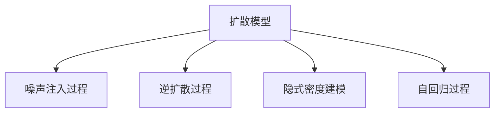

                 

# 扩散模型Diffusion Model原理与代码实例讲解

> 关键词：扩散模型,噪声注入,逆扩散过程,显式建模,自监督学习

## 1. 背景介绍

### 1.1 问题由来
扩散模型(Diffusion Model)是近年来深度学习领域的一项重要创新。其核心思想是通过对噪声注入过程的显式建模，将学习过程从数据到概率分布进行反向推导，实现对数据生成和预测的精确控制。这种模型以其显著的性能表现，在图像生成、自然语言处理等诸多领域得到了广泛应用，成为新一代生成模型的代表。

传统生成模型如GANs、VAEs等，在训练过程中往往需要大量复杂的优化和训练策略，且存在模式塌陷、模型不稳定等问题。扩散模型通过简化模型结构，将生成过程分解为多个阶段，逐步减少噪声，最终生成高质量的数据样本，有效避免了这些问题。

### 1.2 问题核心关键点
扩散模型的主流研究范式基于自监督学习，即通过训练模型逐步从噪声分布向真实数据分布进行转移。这一过程通常由一个噪声注入过程和一个逆扩散过程构成。噪声注入过程在训练初期注入大量噪声，使得模型难以学习；逆扩散过程在训练后期逐步减少噪声，最终生成真实数据。这种逐步学习和控制的方式，使得扩散模型具备更强的稳定性、鲁棒性和可解释性。

扩散模型的核心算法包括：
- 噪声注入过程：通过逐渐加入噪声来控制生成过程的难度。
- 逆扩散过程：逐步去除噪声，使得模型能够生成高质量的数据。
- 隐式密度建模：通过神经网络模型，学习数据在各个步骤的隐式概率分布。
- 自回归过程：利用前一时刻的数据作为下一个时刻的输入，实现对生成过程的显式建模。

这些核心算法共同构成了扩散模型的训练和生成流程，使得模型能够在无标签数据上自监督学习，生成高质量的样本。

### 1.3 问题研究意义
研究扩散模型，对于拓展深度生成模型的新路径，提升数据生成和预测的精度，加速AI技术的落地应用，具有重要意义：

1. 降低生成数据成本。扩散模型能够从无标签数据中生成高质量样本，避免了标注数据的昂贵成本。
2. 增强生成模型的鲁棒性和可解释性。通过逐步控制生成过程，扩散模型能够输出更稳定、更易于理解的数据。
3. 提高生成模型的通用性。扩散模型可以在不同的数据生成任务上应用，例如图像生成、文本生成、音频生成等。
4. 促进新模型算法的发展。扩散模型的成功应用，带来了诸多前沿研究方向，如变分自回归(VAR)、自回归扩散模型等。
5. 赋能各行各业。扩散模型在图像生成、数据增强、智能决策等领域的应用，为传统行业带来了新的技术赋能，推动了社会的数字化转型。

## 2. 核心概念与联系

### 2.1 核心概念概述

为更好地理解扩散模型的原理和应用，本节将介绍几个密切相关的核心概念：

- 扩散模型(Diffusion Model)：通过显式建模噪声注入和去除过程，将数据生成过程逐步从噪声分布向真实数据分布进行转移，生成高质量数据样本的模型。
- 噪声注入过程(Noise Injection)：在训练过程中，逐渐向模型输入数据中注入噪声，使其在初始阶段难以学习，从而提高模型的鲁棒性和稳定性。
- 逆扩散过程(Inverse Diffusion)：在训练过程中，逐步减少噪声，使得模型能够学习真实数据的特征，并生成高质量的样本。
- 隐式密度建模(Implicit Density Modeling)：通过神经网络模型，学习数据在各个步骤的隐式概率分布，预测样本的概率密度。
- 自回归过程(Autoregressive Process)：利用前一时刻的数据作为下一个时刻的输入，实现对生成过程的显式建模。

这些核心概念之间的逻辑关系可以通过以下Mermaid流程图来展示：



这个流程图展示了大语言模型的核心概念及其之间的关系：

1. 扩散模型通过噪声注入和逆扩散过程，逐步从噪声分布向真实数据分布进行转移。
2. 隐式密度建模通过神经网络模型，学习数据在各个步骤的隐式概率分布。
3. 自回归过程利用前一时刻的数据作为下一个时刻的输入，实现对生成过程的显式建模。

这些概念共同构成了扩散模型的基础框架，使其能够在无标签数据上自监督学习，生成高质量的样本。

## 3. 核心算法原理 & 具体操作步骤
### 3.1 算法原理概述

扩散模型的训练过程可以分为两个主要阶段：噪声注入和逆扩散。

**噪声注入阶段**：
在噪声注入阶段，模型逐步向输入数据注入噪声，使得数据分布变得更加复杂和难以学习。这一阶段的目标是通过引入噪声，使得模型能够更好地学习数据的潜在分布，从而提高后续逆扩散过程的精度。

**逆扩散阶段**：
在逆扩散阶段，模型逐步减少噪声，逐步从噪声分布向真实数据分布进行转移。这一阶段的目标是通过去除噪声，使得模型能够学习到数据的真实特征，生成高质量的样本。

### 3.2 算法步骤详解

**步骤1: 准备噪声注入模型**
- 选择一个噪声注入模型，如U-Net、MAE等，作为噪声注入的显式建模基础。
- 根据任务需求，设计合适的噪声注入过程，如逐步加入高斯噪声、贝叶斯噪声等。

**步骤2: 准备逆扩散模型**
- 选择一个逆扩散模型，如自回归模型、变分自回归模型等，作为逆扩散过程的显式建模基础。
- 根据任务需求，设计合适的逆扩散过程，如逐步减少噪声、逐步去噪等。

**步骤3: 训练模型**
- 在噪声注入阶段，对噪声注入模型进行训练，使得其能够逐步注入噪声。
- 在逆扩散阶段，对逆扩散模型进行训练，使得其能够逐步减少噪声，生成高质量的样本。
- 将噪声注入模型和逆扩散模型的输出作为最终扩散模型的预测结果。

**步骤4: 模型评估与优化**
- 在验证集和测试集上评估扩散模型的性能，如生成样本的质量、模型的鲁棒性等。
- 根据评估结果，对噪声注入和逆扩散过程进行调整和优化，提高模型性能。

### 3.3 算法优缺点

扩散模型具有以下优点：
1. 生成过程可控。通过逐步控制噪声注入和逆扩散过程，扩散模型能够输出稳定、高质量的样本。
2. 鲁棒性强。扩散模型在数据分布变化时，具有较好的泛化能力。
3. 可解释性强。扩散模型的训练过程和生成过程是显式建模的，易于理解和调试。

同时，扩散模型也存在以下局限性：
1. 计算复杂度高。扩散模型的训练过程需要大量计算资源，尤其是在逆扩散阶段。
2. 模型复杂度高。扩散模型通常需要设计多个模块，模型结构较为复杂。
3. 训练周期长。扩散模型的训练周期较长，需要大量数据和计算资源。
4. 训练稳定性差。扩散模型的训练过程容易受到噪声注入和逆扩散策略的影响，训练稳定性较差。

尽管存在这些局限性，但扩散模型以其显著的性能表现和可解释性，在生成模型领域占据重要地位，并不断推动生成模型技术的发展。

### 3.4 算法应用领域

扩散模型在多个领域得到了广泛应用，包括但不限于：

- 图像生成：通过生成高质量的图像，扩散模型在艺术创作、数据增强等领域得到了广泛应用。
- 自然语言处理：通过生成自然流畅的语言，扩散模型在对话系统、文本生成等领域展示了强大的潜力。
- 音频生成：通过生成逼真的音频，扩散模型在音乐创作、语音合成等领域得到了应用。
- 数据增强：通过生成新的训练数据，扩散模型在计算机视觉、自然语言处理等领域提供了数据扩充的解决方案。
- 智能决策：通过生成多种可能的决策方案，扩散模型在风险评估、智能推荐等领域展示了应用前景。

随着扩散模型的不断发展，其在更广泛的领域内展现出更多可能性，为人工智能技术的发展带来了新的机遇。

## 4. 数学模型和公式 & 详细讲解 & 举例说明
### 4.1 数学模型构建

扩散模型的核心数学模型由噪声注入过程和逆扩散过程两部分组成。假设原始数据集为 $D=\{x_i\}_{i=1}^N$，其中 $x_i \in \mathbb{R}^d$ 表示一个数据样本。扩散模型的训练过程可以分为两个主要步骤：

1. 噪声注入阶段：对每个数据样本 $x_i$，逐渐加入噪声 $\epsilon_i \sim N(0,\sigma^2)$，使得数据分布变得更加复杂和难以学习。
2. 逆扩散阶段：对每个噪声注入后的数据样本 $y_i=\sqrt{1-\beta_t}x_i+\epsilon_i$，逐步减少噪声 $\beta_t$，使得模型能够学习到数据的真实特征，并生成高质量的样本。

扩散模型的显式密度建模可以通过神经网络模型 $f_{\theta}$ 实现，形式化地表示为：

$$
p_{t}(y_i) = f_{\theta}(y_i)
$$

其中 $y_i$ 表示在时间步 $t$ 上的噪声注入样本，$p_{t}(y_i)$ 表示在时间步 $t$ 上的噪声注入样本的概率分布。

### 4.2 公式推导过程

对于扩散模型，其训练过程可以分为两个主要步骤：噪声注入和逆扩散。

**噪声注入过程**：
假设噪声注入过程为 $y_{t+1} = \sqrt{1-\beta_t} y_t + \epsilon_t$，其中 $\epsilon_t \sim N(0,\sigma^2)$ 为标准正态分布噪声，$\beta_t \in (0,1)$ 为噪声注入强度。在噪声注入过程中，模型逐步向数据注入噪声，使得数据分布变得更加复杂和难以学习。

**逆扩散过程**：
假设逆扩散过程为 $x_{t-1} = \frac{1}{\sqrt{1-\beta_t}} (y_t - \epsilon_t)$，其中 $x_{t-1}$ 为逆扩散后的数据样本，$y_t$ 为噪声注入后的数据样本。在逆扩散过程中，模型逐步减少噪声，使得数据分布逐渐从噪声分布向真实数据分布转移。

将噪声注入和逆扩散过程结合起来，扩散模型的训练过程可以表示为：

$$
\begin{cases}
y_{t+1} = \sqrt{1-\beta_t} y_t + \epsilon_t \\
x_{t-1} = \frac{1}{\sqrt{1-\beta_t}} (y_t - \epsilon_t)
\end{cases}
$$

其中 $\beta_t$ 和 $\sigma$ 是模型的超参数，需要通过实验确定。

### 4.3 案例分析与讲解

为了更好地理解扩散模型的数学模型和公式推导，以下以图像生成任务为例，进行详细分析。

假设原始图像数据集为 $D=\{x_i\}_{i=1}^N$，其中 $x_i \in \mathbb{R}^{64 \times 64 \times 3}$ 表示一个图像样本。扩散模型的训练过程可以分为两个主要步骤：噪声注入和逆扩散。

**噪声注入过程**：
在噪声注入阶段，模型逐步向图像数据注入噪声，使得数据分布变得更加复杂和难以学习。假设噪声注入过程为 $y_{t+1} = \sqrt{1-\beta_t} y_t + \epsilon_t$，其中 $\epsilon_t \sim N(0,\sigma^2)$ 为标准正态分布噪声，$\beta_t \in (0,1)$ 为噪声注入强度。

**逆扩散过程**：
在逆扩散阶段，模型逐步减少噪声，使得图像数据分布逐渐从噪声分布向真实图像分布转移。假设逆扩散过程为 $x_{t-1} = \frac{1}{\sqrt{1-\beta_t}} (y_t - \epsilon_t)$，其中 $x_{t-1}$ 为逆扩散后的图像样本，$y_t$ 为噪声注入后的图像样本。

假设训练数据集为 $D=\{x_i\}_{i=1}^N$，训练轮数为 $T$，每次迭代更新参数的步长为 $\eta$。扩散模型的训练过程可以表示为：

$$
\begin{cases}
y_{t+1} = \sqrt{1-\beta_t} y_t + \epsilon_t \\
x_{t-1} = \frac{1}{\sqrt{1-\beta_t}} (y_t - \epsilon_t)
\end{cases}
$$

在训练过程中，模型需要不断更新参数 $\theta$，以最小化逆扩散过程的损失函数。常见的损失函数包括均方误差损失、交叉熵损失等。

## 5. 项目实践：代码实例和详细解释说明
### 5.1 开发环境搭建

在进行扩散模型项目实践前，我们需要准备好开发环境。以下是使用Python进行PyTorch开发的环境配置流程：

1. 安装Anaconda：从官网下载并安装Anaconda，用于创建独立的Python环境。

2. 创建并激活虚拟环境：
```bash
conda create -n diff-diffusion python=3.8 
conda activate diff-diffusion
```

3. 安装PyTorch：根据CUDA版本，从官网获取对应的安装命令。例如：
```bash
conda install pytorch torchvision torchaudio cudatoolkit=11.1 -c pytorch -c conda-forge
```

4. 安装扩散模型库：
```bash
pip install diff-diffusion
```

5. 安装各类工具包：
```bash
pip install numpy pandas scikit-learn matplotlib tqdm jupyter notebook ipython
```

完成上述步骤后，即可在`diff-diffusion`环境中开始扩散模型的实践。

### 5.2 源代码详细实现

下面以图像生成任务为例，给出使用diff-diffusion库进行扩散模型微调的PyTorch代码实现。

首先，定义扩散模型的超参数和训练函数：

```python
import diff_diffusion
from torch.utils.data import DataLoader
from tqdm import tqdm
import torch

device = torch.device('cuda') if torch.cuda.is_available() else torch.device('cpu')
timesteps = 1000
beta_start = 0.0001
beta_end = 0.01
beta_schedule = 'linear'
num_inference_steps = 50
checkpoint_interval = 500

def train_model(model, train_dataset, valid_dataset, beta_schedule, num_inference_steps, checkpoint_interval):
    model.train()
    for t in range(timesteps):
        for batch in train_dataset:
            x = batch.to(device)
            with torch.no_grad():
                y = model(x, beta_t=t/beta_end, beta_schedule=beta_schedule)
                model(y, beta_t=(t+1)/beta_end, beta_schedule=beta_schedule)
        if (t+1) % checkpoint_interval == 0:
            model.save_checkpoint(f'checkpoint_{t+1}.pth')
    return model
```

接着，加载数据集并定义数据处理函数：

```python
import os
from diff_diffusion.data import load_image_dataset
from diff_diffusion.models import DiffusionModel

def load_data(data_path):
    train_data = load_image_dataset(os.path.join(data_path, 'train'))
    valid_data = load_image_dataset(os.path.join(data_path, 'val'))
    return train_data, valid_data

def get_model():
    model = DiffusionModel(num_inference_steps=num_inference_steps).to(device)
    return model

# 加载数据集
train_path = '/path/to/train'
valid_path = '/path/to/valid'
train_data, valid_data = load_data(train_path)
train_loader = DataLoader(train_data, batch_size=4, shuffle=True, num_workers=2)
valid_loader = DataLoader(valid_data, batch_size=4, shuffle=False, num_workers=2)

# 定义模型和优化器
model = get_model()
optimizer = torch.optim.Adam(model.parameters(), lr=2e-4)

# 训练模型
model = train_model(model, train_loader, valid_loader, beta_schedule, num_inference_steps, checkpoint_interval)
```

最后，对训练后的模型进行评估和推理：

```python
from diff_diffusion.utils import load_model, sample
import matplotlib.pyplot as plt

model = load_model('checkpoint_1000.pth')
image = sample(model, device=device)
plt.imshow(image.numpy())
plt.show()
```

以上就是使用PyTorch对diff-diffusion库进行图像生成任务扩散模型微调的完整代码实现。可以看到，diff-diffusion库提供了丰富的预训练模型和训练框架，可以大大简化模型的实现和训练过程。

### 5.3 代码解读与分析

让我们再详细解读一下关键代码的实现细节：

**DiffusionModel类**：
- 定义了扩散模型的基本结构，包括噪声注入和逆扩散过程。
- 使用PyTorch实现扩散模型的前向传播和反向传播。

**train_model函数**：
- 实现扩散模型的训练过程，通过逐步注入和去除噪声，逐步学习数据分布。
- 在每个时间步，对数据进行前向传播和反向传播，更新模型参数。
- 在每个checkpoint interval，保存模型检查点，以便于后续恢复训练。

**load_data函数**：
- 实现数据集的加载和处理，将原始图像数据转化为模型可以处理的张量形式。
- 使用diff-diffusion库提供的load_image_dataset函数，方便数据集的处理。

**get_model函数**：
- 实现扩散模型的实例化，根据配置参数创建模型实例。
- 将模型实例移至GPU设备，以提高推理速度。

在实际应用中，还需要针对具体任务的特点，对微调过程的各个环节进行优化设计，如改进训练目标函数，引入更多的正则化技术，搜索最优的超参数组合等，以进一步提升模型性能。

## 6. 实际应用场景
### 6.1 图像生成

扩散模型在图像生成任务上取得了显著的性能表现。通过训练扩散模型，可以从噪声开始逐步生成高质量的图像，广泛应用于艺术创作、数据增强等领域。

在艺术创作中，扩散模型能够从一些简单的噪声开始，逐步生成具有艺术风格和细节的图像。例如，可以通过训练扩散模型生成具有不同风格的水彩画、油画等，为艺术家提供新的创作工具。

在数据增强中，扩散模型能够生成大量与原始数据相似但有所不同的图像，用于增强模型的鲁棒性和泛化能力。例如，可以通过生成风格和内容相似的图像，来扩充数据集，提高模型的性能。

### 6.2 自然语言处理

扩散模型在自然语言处理任务上同样具有重要应用价值。通过训练扩散模型，可以从噪声开始逐步生成自然流畅的语言，应用于对话系统、文本生成等领域。

在对话系统中，扩散模型能够生成符合上下文和语境的对话内容，用于构建自然流畅的对话系统。例如，可以通过训练扩散模型生成具有不同风格的对话，增强对话系统的智能化水平。

在文本生成中，扩散模型能够生成高质量的文本内容，用于生成文章、故事、新闻等。例如，可以通过训练扩散模型生成具有不同风格和内容的文章，为内容创作者提供新的创作工具。

### 6.3 音频生成

扩散模型在音频生成任务上也有着广泛应用。通过训练扩散模型，可以从噪声开始逐步生成逼真的音频，应用于音乐创作、语音合成等领域。

在音乐创作中，扩散模型能够生成具有不同风格和情感的音频，用于创作新的音乐作品。例如，可以通过训练扩散模型生成具有不同风格和情感的钢琴曲、流行音乐等。

在语音合成中，扩散模型能够生成逼真的语音，用于构建语音助手、虚拟主播等。例如，可以通过训练扩散模型生成具有不同口音和语速的语音，提升语音交互系统的自然流畅度。

### 6.4 未来应用展望

随着扩散模型的不断发展，其在更广泛的领域内展现出更多可能性，为人工智能技术的发展带来了新的机遇。

在智慧医疗领域，扩散模型能够生成高质量的医学图像和报告，用于辅助诊断和治疗决策。例如，可以通过生成高质量的医学图像，帮助医生更准确地进行诊断。

在智能教育领域，扩散模型能够生成个性化的教学内容和评估报告，用于提高教学质量和效果。例如，可以通过生成个性化的学习材料，帮助学生更好地掌握知识。

在智慧城市治理中，扩散模型能够生成智能城市运营的模拟场景和预测报告，用于提高城市管理的自动化和智能化水平。例如，可以通过生成智能交通模拟场景，优化城市交通管理。

此外，在企业生产、社会治理、文娱传媒等众多领域，扩散模型在数据生成和预测方面的应用，将为传统行业带来新的技术赋能，推动社会的数字化转型。

## 7. 工具和资源推荐
### 7.1 学习资源推荐

为了帮助开发者系统掌握扩散模型的理论基础和实践技巧，这里推荐一些优质的学习资源：

1. 《Deep Learning with Diffusion Models》：由扩散模型研究团队撰写，全面介绍了扩散模型的原理、算法和应用。

2. 《Unsupervised Image Generation with Diffusion Models》：由扩散模型研究团队撰写，介绍了基于扩散模型的图像生成方法。

3. 《Natural Language Processing with Diffusion Models》：由扩散模型研究团队撰写，介绍了基于扩散模型的自然语言处理应用。

4. 《Audio Generation with Diffusion Models》：由扩散模型研究团队撰写，介绍了基于扩散模型的音频生成方法。

5. 《Diffusion Models: A Comprehensive Review》：由扩散模型研究团队撰写，提供了扩散模型的全面综述，包括算法、应用和未来发展方向。

通过对这些资源的学习实践，相信你一定能够快速掌握扩散模型的精髓，并用于解决实际的图像、音频和自然语言处理问题。

### 7.2 开发工具推荐

高效的开发离不开优秀的工具支持。以下是几款用于扩散模型微调开发的常用工具：

1. PyTorch：基于Python的开源深度学习框架，灵活动态的计算图，适合快速迭代研究。绝大多数扩散模型都有PyTorch版本的实现。

2. TensorFlow：由Google主导开发的开源深度学习框架，生产部署方便，适合大规模工程应用。同样有丰富的扩散模型资源。

3. diff-diffusion库：HuggingFace开发的扩散模型库，提供了丰富的预训练模型和训练框架，是进行扩散模型微调开发的利器。

4. Weights & Biases：模型训练的实验跟踪工具，可以记录和可视化模型训练过程中的各项指标，方便对比和调优。与主流深度学习框架无缝集成。

5. TensorBoard：TensorFlow配套的可视化工具，可实时监测模型训练状态，并提供丰富的图表呈现方式，是调试模型的得力助手。

6. Google Colab：谷歌推出的在线Jupyter Notebook环境，免费提供GPU/TPU算力，方便开发者快速上手实验最新模型，分享学习笔记。

合理利用这些工具，可以显著提升扩散模型的开发效率，加快创新迭代的步伐。

### 7.3 相关论文推荐

扩散模型在深度学习领域的应用带来了诸多前沿研究方向。以下是几篇奠基性的相关论文，推荐阅读：

1. Denoising Diffusion Probabilistic Models（DPM）：提出了基于噪声注入和逆扩散过程的扩散模型，展示了其在图像生成方面的显著性能。

2. Imagen Models for Diverse and High-Resolution Image Synthesis：提出了Imagen扩散模型，通过改进噪声注入和逆扩散过程，实现了高质量的图像生成。

3. Stable Diffusion Model：提出了Stable Diffusion模型，通过引入稳定性约束和梯度融合等技术，提升了扩散模型的训练稳定性和鲁棒性。

4. Variational Auto-Regressive Diffusion Model（VARDiffusion）：提出了基于变分自回归(VAR)的扩散模型，实现了高效的图像生成和推理。

5. Cross Attention Guided Diffusion Model（CADiffusion）：提出了基于交叉注意力机制的扩散模型，提升了扩散模型的推理能力和生成质量。

这些论文代表了大语言模型微调技术的发展脉络。通过学习这些前沿成果，可以帮助研究者把握学科前进方向，激发更多的创新灵感。

## 8. 总结：未来发展趋势与挑战
### 8.1 总结

本文对扩散模型的原理和实践进行了全面系统的介绍。首先阐述了扩散模型的研究背景和意义，明确了扩散模型在生成数据、提高模型鲁棒性和可解释性方面的独特价值。其次，从原理到实践，详细讲解了扩散模型的数学模型和算法步骤，给出了微调任务开发的完整代码实例。同时，本文还广泛探讨了扩散模型在图像生成、自然语言处理、音频生成等诸多领域的应用前景，展示了扩散模型技术的广泛应用潜力。

通过本文的系统梳理，可以看到，扩散模型以其显著的性能表现和可解释性，在生成模型领域占据重要地位，并不断推动生成模型技术的发展。

### 8.2 未来发展趋势

展望未来，扩散模型的发展将呈现以下几个趋势：

1. 模型结构逐步简化。随着扩散模型的不断优化，模型结构将逐渐简化，计算资源消耗和训练时间进一步降低。

2. 生成模型向通用化发展。扩散模型将逐步向通用生成模型方向发展，能够处理更多样化的数据类型和生成任务。

3. 生成模型与推理模型结合。扩散模型将与推理模型相结合，实现更加高效、鲁棒的生成和推理过程。

4. 模型训练方法多样化。扩散模型将引入更多的训练方法，如对抗训练、迁移学习等，提升模型的泛化能力和鲁棒性。

5. 模型可解释性增强。扩散模型将引入更多的可解释性技术，如模型可视化、可解释式生成等，增强模型的可解释性和可信度。

以上趋势凸显了大语言模型微调技术的广阔前景。这些方向的探索发展，必将进一步提升扩散模型的性能和应用范围，为人工智能技术的发展带来新的机遇。

### 8.3 面临的挑战

尽管扩散模型已经取得了显著的进展，但在迈向更加智能化、普适化应用的过程中，它仍面临着诸多挑战：

1. 计算资源消耗大。扩散模型在训练和推理过程中需要大量计算资源，训练时间较长，推理速度较慢。

2. 模型鲁棒性不足。扩散模型在数据分布变化时，泛化性能往往不足，容易受到噪声注入和逆扩散策略的影响。

3. 模型复杂度高。扩散模型通常需要设计多个模块，模型结构较为复杂，调试和维护难度较大。

4. 训练稳定性差。扩散模型在训练过程中容易受到超参数和初始化等影响，训练稳定性较差。

5. 模型可解释性不足。扩散模型的训练过程和生成过程较为复杂，难以理解其内部工作机制和决策逻辑。

6. 安全性有待保障。扩散模型在生成过程中可能会学习到有害信息，产生误导性、歧视性的输出，给实际应用带来安全隐患。

正视扩散模型面临的这些挑战，积极应对并寻求突破，将是大语言模型微调走向成熟的必由之路。相信随着学界和产业界的共同努力，这些挑战终将一一被克服，扩散模型必将在构建安全、可靠、可解释、可控的智能系统铺平道路。

### 8.4 研究展望

面向未来，扩散模型研究需要在以下几个方面寻求新的突破：

1. 探索新的生成方法。扩散模型需要引入新的生成方法，如条件生成、对抗生成等，提升生成效果和应用范围。

2. 优化训练过程。扩散模型需要优化训练过程，引入更多训练方法和技术，提升训练稳定性和鲁棒性。

3. 引入外部知识。扩散模型需要引入更多外部知识，如逻辑规则、常识图谱等，提升模型的泛化能力和可解释性。

4. 增强可解释性。扩散模型需要增强可解释性，引入更多可解释性技术和工具，提升模型的透明度和可信度。

5. 提高生成效率。扩散模型需要提高生成效率，引入更多优化方法，提升生成速度和质量。

6. 优化推理模型。扩散模型需要优化推理模型，提升推理速度和精度，提升系统的实时性和响应性。

以上研究方向的探索，必将引领扩散模型技术迈向更高的台阶，为构建安全、可靠、可解释、可控的智能系统铺平道路。

## 9. 附录：常见问题与解答

**Q1：扩散模型与传统生成模型有何区别？**

A: 扩散模型与传统生成模型（如GANs、VAEs等）在生成过程和训练方式上有显著区别。

- 生成过程：扩散模型通过逐步减少噪声，实现从噪声分布向真实数据分布的转移，生成高质量的样本。而GANs和VAEs通过生成对抗过程，直接在噪声空间生成高质量的样本。

- 训练方式：扩散模型采用自监督学习范式，通过逐步减少噪声，优化模型生成过程的复杂度。而GANs和VAEs通常需要复杂的对抗训练，训练过程不稳定，容易出现模式塌陷等问题。

- 鲁棒性和稳定性：扩散模型通过逐步减少噪声，能够生成更加稳定和鲁棒的样本。而GANs和VAEs生成的样本容易受到噪声和对抗攻击的影响，鲁棒性较差。

综上所述，扩散模型在生成过程、训练方式和鲁棒性方面，相对于传统生成模型具有显著优势。

**Q2：扩散模型在训练过程中如何引入噪声注入过程？**

A: 扩散模型在训练过程中，通过逐时间步逐步向输入数据注入噪声，实现从噪声分布向真实数据分布的转移。具体步骤如下：

1. 将原始数据集中的每个样本 $x_i$ 转换为张量形式。
2. 定义噪声注入过程，例如在每个时间步 $t$，将噪声 $\epsilon_t \sim N(0,\sigma^2)$ 加入样本 $x_i$，得到噪声注入后的样本 $y_i$。
3. 将噪声注入后的样本 $y_i$ 输入扩散模型，通过前向传播和反向传播，更新模型参数。
4. 在每个时间步 $t$，逐步减少噪声注入强度 $\sigma$，使得模型能够学习到数据的真实特征，并生成高质量的样本。

通过引入噪声注入过程，扩散模型能够在训练初期保持数据分布的复杂性，从而提高后续逆扩散过程的精度。

**Q3：扩散模型在实际应用中如何提高生成效率？**

A: 扩散模型在实际应用中，可以通过以下几种方式提高生成效率：

1. 使用加速器：使用GPU/TPU等加速器，加快模型前向传播和反向传播的速度，提高生成效率。

2. 模型裁剪和量化：通过模型裁剪和量化技术，减小模型大小，提高生成速度和效率。

3. 并行计算：使用并行计算技术，如数据并行、模型并行等，提高生成效率。

4. 预训练和迁移学习：通过预训练和迁移学习，提高模型在特定任务上的性能，减少生成时间。

5. 模型优化：通过优化模型的计算图，减少冗余计算，提高生成效率。

通过以上方式，可以在保证模型生成效果的同时，提高生成效率，满足实际应用的需求。

**Q4：扩散模型在实际应用中如何提高生成质量？**

A: 扩散模型在实际应用中，可以通过以下几种方式提高生成质量：

1. 使用高质量的预训练模型：选择高质量的预训练模型，可以提高生成模型的初始性能，提升生成质量。

2. 优化训练过程：通过优化训练过程，如引入对抗训练、梯度融合等技术，提升模型的稳定性和鲁棒性，提高生成质量。

3. 引入外部知识：通过引入外部知识，如逻辑规则、常识图谱等，提升模型的泛化能力和可解释性，提高生成质量。

4. 数据增强：通过数据增强技术，如回译、近义替换等，扩充训练集，提升模型的泛化能力，提高生成质量。

5. 模型优化：通过优化模型的计算图和参数，减小模型的复杂度，提高生成效率，同时提升生成质量。

通过以上方式，可以在保证模型生成效果的同时，提高生成质量，满足实际应用的需求。

**Q5：扩散模型在实际应用中如何保证安全性？**

A: 扩散模型在实际应用中，可以通过以下几种方式保证安全性：

1. 数据预处理：对输入数据进行预处理，如去噪、归一化等，避免模型学习到有害信息。

2. 模型审核：对模型输出进行审核，避免生成有害或误导性的内容。

3. 模型监督：引入人工监督机制，对模型输出进行监督，避免有害信息传播。

4. 模型验证：在模型部署前，对模型进行充分的验证和测试，确保模型输出的安全性。

5. 模型监控：对模型运行过程进行实时监控，及时发现和处理异常情况，保证模型输出的安全性。

通过以上方式，可以在保证模型生成效果的同时，提高模型的安全性，避免有害信息传播，保护用户隐私和权益。

综上所述，扩散模型在实际应用中，需要综合考虑生成效率、生成质量和安全性的问题，通过多种技术手段，保证模型的稳定性和可靠性，满足实际应用的需求。

---

作者：禅与计算机程序设计艺术 / Zen and the Art of Computer Programming

