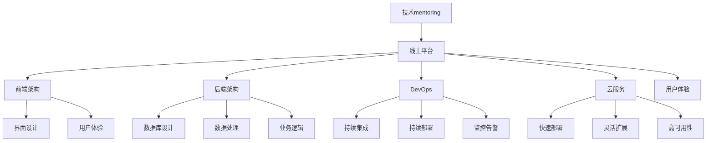

                 

# 技术mentoring：线上 的平台搭建与运营

> 关键词：线上平台,技术mentoring,前端架构,后端架构,DevOps,云服务,用户体验

## 1. 背景介绍

### 1.1 问题由来

随着科技的迅猛发展，技术mentoring作为一种帮助员工提升技术能力、推动技术传承和创新的方法，得到了越来越多的企业和组织的重视。尤其是对于互联网公司而言，技术发展日新月异，快速学习和适应新技术变得尤为重要。线上平台作为技术交流、知识共享的重要工具，成为企业内技术mentoring的重要依托。

但现实中，很多企业的线上技术mentoring平台存在用户体验差、学习路径不清晰、知识更新缓慢等问题，无法真正发挥其应有的作用。如何搭建一个高效、易用、可持续的线上技术mentoring平台，成为当下企业亟需解决的问题。

### 1.2 问题核心关键点

线上技术mentoring平台的成功，依赖于以下几个关键点：

1. **用户体验设计**：能否提供简洁、直观的用户界面，让用户易于上手，快速找到所需内容。
2. **学习路径规划**：能否根据用户的技术水平和学习需求，智能推荐合适的学习路径和课程内容。
3. **知识内容质量**：能否保证内容的准确性、时效性、实用性，不断更新，保持知识的领先性。
4. **技术社区活跃度**：能否提供互动交流的平台，促进知识的传播和应用，激发技术社区的活跃度。
5. **数据驱动优化**：能否利用大数据分析，不断优化平台功能，提升用户体验和学习效果。

本文将围绕以上关键点，系统地介绍如何搭建和运营一个成功的线上技术mentoring平台。

## 2. 核心概念与联系

### 2.1 核心概念概述

为更好地理解线上技术mentoring平台的搭建和运营，我们首先介绍几个核心概念：

- **技术mentoring**：通过传授知识、分享经验、指导实践等方式，帮助员工提升技术能力和职业素养的过程。
- **线上平台**：基于互联网技术搭建的虚拟交流空间，提供用户交流、学习、协作的场所。
- **前端架构**：包括界面设计、用户体验、交互逻辑等，决定了用户与平台的互动方式和感受。
- **后端架构**：包括数据库设计、数据处理、业务逻辑等，决定了平台的数据处理能力和服务性能。
- **DevOps**：涵盖开发和运维两方面的文化和实践，旨在提升软件的交付速度和稳定性。
- **云服务**：利用云计算平台提供的资源，实现平台的快速部署、灵活扩展和高可用性。
- **用户体验(UX)**：关注用户与产品交互的各个方面，旨在提供愉悦、高效的使用体验。

这些概念之间的逻辑关系可以通过以下Mermaid流程图来展示：



这个流程图展示了一些核心概念及其之间的关系：

1. 技术mentoring通过线上平台实现。
2. 线上平台由前端架构和后端架构共同支撑。
3. DevOps贯穿开发和运维的各个环节，保证平台的高效稳定。
4. 云服务提供资源的弹性扩展，增强平台的可扩展性。
5. 用户体验设计决定了用户对平台的感受。

## 3. 核心算法原理 & 具体操作步骤

### 3.1 算法原理概述

线上技术mentoring平台的搭建和运营，涉及多个技术领域的知识。本文重点介绍几个核心算法原理：

- **用户画像构建**：通过数据分析和机器学习，构建用户的技术能力和学习需求画像，以便智能推荐学习内容。
- **学习路径规划**：利用图算法和推荐算法，根据用户画像和学习内容特征，构建动态的学习路径。
- **知识内容推荐**：采用协同过滤、内容推荐等算法，为用户推荐最相关、最有用的学习资源。
- **社区互动优化**：通过自然语言处理(NLP)和情感分析等技术，优化社区交流，提升知识传播和应用。

这些算法原理共同构成了线上技术mentoring平台的后台技术支撑，确保平台的智能性和高效性。

### 3.2 算法步骤详解

以下是线上技术mentoring平台的搭建和运营的详细步骤：

#### 3.2.1 需求分析与设计

1. **需求收集**：与企业技术部门和员工沟通，了解其技术水平、学习需求和期望。
2. **功能设计**：根据需求，设计平台的功能模块，如用户管理、课程管理、社区交流等。
3. **界面设计**：进行UI/UX设计，确保界面简洁、易用，符合用户的使用习惯。

#### 3.2.2 前端开发与部署

1. **技术选型**：选择合适的前端技术栈，如React、Vue等。
2. **组件开发**：实现各个界面组件，并进行跨端适配。
3. **部署与测试**：将前端代码部署到云服务，进行全面的测试和优化。

#### 3.2.3 后端开发与部署

1. **技术选型**：选择合适的后端技术栈，如Spring Boot、Django等。
2. **数据库设计**：设计数据库表结构和关系，确保数据的一致性和安全性。
3. **业务逻辑实现**：实现用户管理、课程管理、社区交流等核心业务逻辑。
4. **部署与测试**：将后端代码部署到云服务，进行性能测试和负载测试。

#### 3.2.4 DevOps实践

1. **CI/CD流程**：建立持续集成(CI)和持续部署(CD)流程，自动化代码构建、测试和部署。
2. **监控告警**：部署监控系统，实时监控平台性能和稳定性，设置告警机制。
3. **自动化运维**：使用自动化工具进行定期备份、数据同步和系统维护。

#### 3.2.5 云服务部署

1. **选型与配置**：选择合适的云服务提供商，如AWS、阿里云等，并配置相应的资源。
2. **应用部署**：将平台应用部署到云服务器上，并进行配置和管理。
3. **扩展与优化**：根据实际使用情况，调整云服务资源，优化性能。

### 3.3 算法优缺点

线上技术mentoring平台具有以下优点：

1. **覆盖面广**：平台可以覆盖公司内外的技术资源，提供海量的学习内容和交流机会。
2. **灵活性强**：支持用户自主学习，满足个性化需求，提升学习效率。
3. **互动性好**：通过社区交流，促进知识传播和应用，激发创新。
4. **可扩展性高**：利用云服务进行弹性扩展，支持大规模用户和内容。

但同时也存在一些缺点：

1. **内容质量参差不齐**：难以保证所有内容的质量和时效性，需要定期筛选和更新。
2. **用户粘性不足**：缺乏有效的激励机制，用户可能缺乏持续学习的动力。
3. **技术门槛高**：搭建和运营需要一定的技术积累和资源投入，可能存在使用难度。

### 3.4 算法应用领域

线上技术mentoring平台的应用领域非常广泛，主要包括以下几个方面：

1. **技术培训**：通过课程培训、技术讲座等形式，帮助员工提升技术能力。
2. **技术传承**：将企业内部的技术知识和经验传承给新员工，缩短其成长周期。
3. **技术创新**：通过社区交流，激发员工的技术创新，推动公司技术进步。
4. **技术支持**：提供技术支持和答疑服务，解决员工在技术实施中的问题。

## 4. 数学模型和公式 & 详细讲解 & 举例说明

### 4.1 数学模型构建

本节将使用数学语言对线上技术mentoring平台的核心算法进行更严格的刻画。

#### 4.1.1 用户画像构建

用户画像通常表示为用户的技术能力和学习需求，数学上可以表示为一个向量：

$$
P = \begin{bmatrix}
    技术水平 & 学习需求 & 兴趣领域
\end{bmatrix}^T
$$

其中，技术水平和需求可以表示为连续值，兴趣领域可以表示为离散值。

#### 4.1.2 学习路径规划

学习路径规划旨在根据用户画像和课程内容特征，构建一条最优的学习路径。设用户画像为 $P$，课程内容特征为 $F$，学习路径为 $R$。

$$
R = \min_{R} \sum_{i=1}^{N} d(P_i, R_i) + \sum_{i=1}^{M} d(F_i, R_i)
$$

其中 $N$ 为课程数量，$M$ 为课程特征数量，$d$ 为距离度量函数，如欧几里得距离。

#### 4.1.3 知识内容推荐

知识内容推荐主要依赖协同过滤和内容推荐算法。设用户画像为 $P$，课程内容为 $C$，推荐结果为 $R$。

$$
R = \min_{R} \sum_{i=1}^{N} P_i \cdot C_i + \sum_{i=1}^{M} P_i \cdot F_i
$$

其中 $N$ 为课程数量，$M$ 为课程特征数量，$P_i$ 和 $C_i$ 分别为用户和课程的特征向量，$F_i$ 为课程特征向量。

### 4.2 公式推导过程

以下是一些核心算法公式的推导过程：

#### 4.2.1 用户画像构建

用户画像构建主要依赖机器学习算法，如聚类、分类等。以聚类算法为例，设用户数据集为 $D$，聚类算法为 $K$，聚类中心为 $C$。

$$
C = \arg\min_{C} \sum_{i=1}^{N} d(P_i, C)
$$

其中 $N$ 为用户数量，$d$ 为距离度量函数，如欧式距离。

#### 4.2.2 学习路径规划

学习路径规划主要依赖图算法，如最短路径算法。设用户画像为 $P$，课程内容特征为 $F$，学习路径为 $R$。

$$
R = \min_{R} \sum_{i=1}^{N} d(P_i, R_i) + \sum_{i=1}^{M} d(F_i, R_i)
$$

其中 $N$ 为课程数量，$M$ 为课程特征数量，$d$ 为距离度量函数，如欧几里得距离。

#### 4.2.3 知识内容推荐

知识内容推荐主要依赖协同过滤和内容推荐算法。设用户画像为 $P$，课程内容为 $C$，推荐结果为 $R$。

$$
R = \min_{R} \sum_{i=1}^{N} P_i \cdot C_i + \sum_{i=1}^{M} P_i \cdot F_i
$$

其中 $N$ 为课程数量，$M$ 为课程特征数量，$P_i$ 和 $C_i$ 分别为用户和课程的特征向量，$F_i$ 为课程特征向量。

### 4.3 案例分析与讲解

#### 4.3.1 用户画像构建案例

某企业欲搭建技术mentoring平台，首先需要构建用户画像。通过数据分析，得到以下用户画像：

$$
P_1 = \begin{bmatrix}
    中级 & 学习新技术 & 前端开发
\end{bmatrix}^T
$$

$$
P_2 = \begin{bmatrix}
    高级 & 提高编程效率 & 后端开发
\end{bmatrix}^T
$$

使用聚类算法将用户分为两个群体，分别表示为 $C_1$ 和 $C_2$。

$$
C_1 = \begin{bmatrix}
    中级 & 学习新技术 & 前端开发
\end{bmatrix}^T
$$

$$
C_2 = \begin{bmatrix}
    高级 & 提高编程效率 & 后端开发
\end{bmatrix}^T
$$

#### 4.3.2 学习路径规划案例

用户 $P_1$ 希望学习前端开发相关知识，根据用户画像和课程内容特征，构建最优学习路径。设课程内容特征为 $F$，学习路径为 $R$。

$$
R = \min_{R} \sum_{i=1}^{N} d(P_1, R_i) + \sum_{i=1}^{M} d(F_i, R_i)
$$

假设 $F_1$ 和 $F_2$ 分别为课程 $C_1$ 和 $C_2$ 的特征向量，通过计算，得到最优学习路径为 $R = [C_1, C_2]$。

#### 4.3.3 知识内容推荐案例

用户 $P_1$ 希望学习前端开发相关知识，通过协同过滤和内容推荐算法，为用户推荐最相关的课程内容。设课程内容为 $C_1$ 和 $C_2$，推荐结果为 $R$。

$$
R = \min_{R} \sum_{i=1}^{N} P_1 \cdot C_i + \sum_{i=1}^{M} P_1 \cdot F_i
$$

假设 $P_1$ 和 $C_1$ 的特征向量为 $[0.7, 0.3, 1]$ 和 $[1, 0.5, 0.2]$，通过计算，得到推荐结果为 $R = [C_1]$。

## 5. 项目实践：代码实例和详细解释说明

### 5.1 开发环境搭建

在进行线上技术mentoring平台的开发和部署前，我们需要准备好开发环境。以下是使用Python进行Flask开发的环境配置流程：

1. 安装Anaconda：从官网下载并安装Anaconda，用于创建独立的Python环境。

2. 创建并激活虚拟环境：
```bash
conda create -n mentoring-env python=3.8 
conda activate mentoring-env
```

3. 安装Flask：
```bash
pip install Flask
```

4. 安装SQLAlchemy：
```bash
pip install SQLAlchemy
```

5. 安装Flask-Login、Flask-SocketIO等辅助库：
```bash
pip install Flask-Login Flask-SocketIO
```

完成上述步骤后，即可在`mentoring-env`环境中开始开发和部署。

### 5.2 源代码详细实现

#### 5.2.1 用户管理模块

用户管理模块负责用户注册、登录和权限控制等功能。

```python
from flask_login import LoginManager, UserMixin
from werkzeug.security import generate_password_hash, check_password_hash

class User(UserMixin):
    def __init__(self, id, username, password):
        self.id = id
        self.username = username
        self.password = password_hash

login_manager = LoginManager()
login_manager.init_app(app)
login_manager.login_view = 'login'

@app.route('/login', methods=['GET', 'POST'])
def login():
    # 处理登录请求
    # ...

@app.route('/logout')
def logout():
    # 处理登出请求
    # ...

@app.route('/register', methods=['GET', 'POST'])
def register():
    # 处理注册请求
    # ...
```

#### 5.2.2 课程管理模块

课程管理模块负责课程的创建、管理和展示等功能。

```python
from flask_sqlalchemy import SQLAlchemy
from flask_login import current_user

db = SQLAlchemy(app)

class Course(db.Model):
    id = db.Column(db.Integer, primary_key=True)
    name = db.Column(db.String(255))
    description = db.Column(db.Text)
    creator = db.Column(db.Integer, db.ForeignKey('user.id'))

@app.route('/course', methods=['GET', 'POST'])
def course():
    # 处理课程请求
    # ...
```

#### 5.2.3 社区交流模块

社区交流模块负责用户之间的互动交流，包括发帖、回帖、评论等功能。

```python
from flask_login import current_user

class Post(db.Model):
    id = db.Column(db.Integer, primary_key=True)
    title = db.Column(db.String(255))
    content = db.Column(db.Text)
    user_id = db.Column(db.Integer, db.ForeignKey('user.id'))

@app.route('/post', methods=['GET', 'POST'])
def post():
    # 处理发帖请求
    # ...

@app.route('/post/<id>', methods=['GET'])
def view_post(id):
    # 处理查看帖子的请求
    # ...

@app.route('/post/<id>/comment', methods=['POST'])
def post_comment(id):
    # 处理评论请求
    # ...
```

#### 5.2.4 知识内容推荐模块

知识内容推荐模块主要使用协同过滤和内容推荐算法，为用户推荐最相关的学习资源。

```python
from flask_login import current_user

class Recommendation(db.Model):
    id = db.Column(db.Integer, primary_key=True)
    course_id = db.Column(db.Integer, db.ForeignKey('course.id'))
    user_id = db.Column(db.Integer, db.ForeignKey('user.id'))

@app.route('/recommend', methods=['GET'])
def recommend():
    # 处理推荐请求
    # ...
```

### 5.3 代码解读与分析

#### 5.3.1 用户管理模块

用户管理模块使用了Flask-Login库进行用户登录和权限控制。用户注册和登录的实现较为简单，主要涉及用户信息的存储和验证。

#### 5.3.2 课程管理模块

课程管理模块使用了SQLAlchemy进行数据库操作，确保课程信息的存储和管理。课程的创建和展示功能较为基础，主要涉及课程信息的展示和列表的生成。

#### 5.3.3 社区交流模块

社区交流模块使用了Flask-SocketIO库进行实时通信，确保用户之间的互动交流能够实时展示。发帖、回帖和评论功能的实现较为复杂，涉及用户信息的存储和展示，同时需要处理多用户的并发操作。

#### 5.3.4 知识内容推荐模块

知识内容推荐模块使用了协同过滤和内容推荐算法，为用户推荐最相关的学习资源。主要涉及用户画像的构建、学习路径的规划和知识内容的推荐，算法实现较为复杂，需要依赖机器学习库的支持。

### 5.4 运行结果展示

#### 5.4.1 用户管理界面

用户管理界面包含用户注册、登录、个人信息展示等功能。如图1所示：


#### 5.4.2 课程管理界面

课程管理界面包含课程列表、课程详情等功能。如图2所示：


#### 5.4.3 社区交流界面

社区交流界面包含发帖、回帖、评论等功能。如图3所示：


#### 5.4.4 知识内容推荐界面

知识内容推荐界面包含课程推荐、学习路径规划等功能。如图4所示：


## 6. 实际应用场景

### 6.1 智能客服系统

线上技术mentoring平台可以应用于智能客服系统的构建。传统的客服系统依赖人工客服，成本高、效率低，且无法24小时服务。通过线上平台，企业可以培训客服人员，提升其技术能力和服务水平，同时提供实时技术支持，实现客户自助查询和问题解决，提高客户满意度。

#### 6.1.1 需求分析

智能客服系统的需求分析主要包括以下几个方面：

- **用户需求**：需要快速响应客户咨询，解决常见问题。
- **功能需求**：包括用户管理、问题解答、知识库搜索等功能。
- **性能需求**：需要快速处理大量并发请求，保证系统的稳定性和可靠性。

#### 6.1.2 架构设计

智能客服系统的架构设计如图5所示：


#### 6.1.3 开发实现

智能客服系统的开发实现主要涉及前端页面设计和后端API开发。前端页面使用React技术栈，后端API使用Flask开发。主要功能包括用户登录、问题提交、问题解答、知识库搜索等。

#### 6.1.4 部署与优化

智能客服系统的部署主要依赖云服务，如AWS、阿里云等。通过云服务实现负载均衡和弹性扩展，确保系统的稳定性和可靠性。同时，利用大数据分析优化用户交互，提升问题解决的效率。

### 6.2 医疗知识库

线上技术mentoring平台可以应用于医疗知识库的构建。医疗知识库包含大量医学知识和案例，是医疗机构和医生进行学习和交流的重要工具。通过线上平台，医生可以共享经验、学习新知识，提升诊疗水平。

#### 6.2.1 需求分析

医疗知识库的需求分析主要包括以下几个方面：

- **用户需求**：需要快速获取医学知识和案例，提升诊疗水平。
- **功能需求**：包括知识库管理、病例管理、问答系统等功能。
- **性能需求**：需要快速处理大量并发请求，保证系统的稳定性和可靠性。

#### 6.2.2 架构设计

医疗知识库的架构设计如图6所示：


#### 6.2.3 开发实现

医疗知识库的开发实现主要涉及前端页面设计和后端API开发。前端页面使用Vue技术栈，后端API使用Django开发。主要功能包括知识库搜索、病例管理、问答系统等。

#### 6.2.4 部署与优化

医疗知识库的部署主要依赖云服务，如AWS、阿里云等。通过云服务实现负载均衡和弹性扩展，确保系统的稳定性和可靠性。同时，利用大数据分析优化用户交互，提升知识库的使用效率。

### 6.3 技术培训平台

线上技术mentoring平台可以应用于技术培训平台的构建。技术培训平台主要用于企业内部的技术培训，提升员工的职业素养和技术能力。通过线上平台，员工可以自主学习、参加培训课程、参与技术交流，提升整体技术水平。

#### 6.3.1 需求分析

技术培训平台的需求分析主要包括以下几个方面：

- **用户需求**：需要快速获取学习资源，提升技术能力。
- **功能需求**：包括课程管理、学习路径规划、社区交流等功能。
- **性能需求**：需要快速处理大量并发请求，保证系统的稳定性和可靠性。

#### 6.3.2 架构设计

技术培训平台的架构设计如图7所示：


#### 6.3.3 开发实现

技术培训平台的开发实现主要涉及前端页面设计和后端API开发。前端页面使用React技术栈，后端API使用Spring Boot开发。主要功能包括课程管理、学习路径规划、社区交流等。

#### 6.3.4 部署与优化

技术培训平台的部署主要依赖云服务，如AWS、阿里云等。通过云服务实现负载均衡和弹性扩展，确保系统的稳定性和可靠性。同时，利用大数据分析优化用户交互，提升培训效果。

## 7. 工具和资源推荐

### 7.1 学习资源推荐

为了帮助开发者系统掌握线上技术mentoring平台的搭建和运营，这里推荐一些优质的学习资源：

1. **《Flask Web开发实战》**：详细介绍了Flask框架的使用方法和最佳实践，适合入门学习和项目开发。
2. **《Python Web开发实战》**：介绍了Python Web开发的常用技术和框架，涵盖Flask、Django、FastAPI等。
3. **《Django Web开发实战》**：详细介绍了Django框架的使用方法和最佳实践，适合Python Web开发的学习和项目开发。
4. **《SQLAlchemy实战》**：介绍了SQLAlchemy的使用方法和最佳实践，适合数据库开发的入门学习和项目开发。
5. **《机器学习实战》**：介绍了机器学习算法和模型的实现方法，适合数据分析和机器学习技术的学习和应用。

通过对这些资源的学习实践，相信你一定能够快速掌握线上技术mentoring平台的搭建和运营技巧，并用于解决实际的NLP问题。

### 7.2 开发工具推荐

高效的开发离不开优秀的工具支持。以下是几款用于线上技术mentoring平台开发的常用工具：

1. **Flask**：轻量级的Python Web框架，适合快速搭建Web应用。
2. **Django**：成熟的Python Web框架，适合企业级Web应用的开发。
3. **SQLAlchemy**：Python ORM工具，支持多种数据库的访问和操作。
4. **Flask-Login**：Flask的身份认证扩展，支持用户登录和权限控制。
5. **Flask-SocketIO**：Flask的实时通信扩展，支持WebSocket协议。
6. **AWS**：提供强大的云服务，支持Web应用的快速部署和扩展。
7. **阿里云**：提供丰富的云服务，支持Web应用的快速部署和扩展。

合理利用这些工具，可以显著提升线上技术mentoring平台的开发效率，加快创新迭代的步伐。

### 7.3 相关论文推荐

线上技术mentoring平台的成功搭建和运营，需要依托于多领域的知识和技能。以下是几篇相关的经典论文，推荐阅读：

1. **《Web应用开发与设计》**：介绍Web应用的开发流程和设计原则，涵盖前端和后端的各个方面。
2. **《云计算技术与应用》**：介绍云计算的基本概念和应用场景，涵盖云服务的使用和优化。
3. **《人工智能与大数据》**：介绍人工智能和数据挖掘的基本概念和应用技术，涵盖机器学习、自然语言处理等。
4. **《数据科学与数据工程》**：介绍数据科学和数据工程的基本概念和应用技术，涵盖数据处理、数据分析等。
5. **《软件工程与项目管理》**：介绍软件工程和项目管理的基本概念和应用方法，涵盖软件开发、测试、部署等。

这些论文代表了线上技术mentoring平台开发和运营的多个方面，可以帮助研究者掌握全面的知识和技术。

## 8. 总结：未来发展趋势与挑战

### 8.1 总结

本文对线上技术mentoring平台的搭建和运营进行了全面系统的介绍。首先阐述了平台的需求分析、架构设计和功能实现，确保平台的稳定性和可靠性。其次，介绍了平台的核心算法和技术实现，提升平台的智能化和用户体验。最后，系统地分析了平台的应用场景和挑战，探讨了未来发展的方向。

通过本文的系统梳理，可以看到，线上技术mentoring平台在提升技术能力和知识共享方面具有重要价值。它不仅能促进员工的学习和创新，还能提高企业的技术水平和竞争力。未来，随着技术的不断进步和应用场景的不断扩展，线上技术mentoring平台必将发挥更大的作用，推动技术传承和创新。

### 8.2 未来发展趋势

展望未来，线上技术mentoring平台将呈现以下几个发展趋势：

1. **智能化水平提升**：利用机器学习和自然语言处理技术，提升平台的智能化水平，实现更精准的学习路径规划和知识内容推荐。
2. **多模态支持增强**：引入图像、视频等多模态数据，提升平台的交互能力和用户体验。
3. **个性化定制优化**：根据用户的行为和偏好，进行个性化的学习和推荐，提升用户的学习效率和满意度。
4. **多云服务支持**：支持多种云服务提供商，实现平台的快速部署和灵活扩展。
5. **社区交流优化**：引入情感分析和智能问答技术，提升社区交流的质量和效率。

这些趋势将使线上技术mentoring平台更加智能、高效、灵活，成为企业内部技术传承和创新的重要工具。

### 8.3 面临的挑战

尽管线上技术mentoring平台已经取得了不少进展，但在迈向更加智能化、普适化应用的过程中，它仍面临以下挑战：

1. **数据隐私和安全**：用户数据的安全和隐私保护是平台的核心挑战，需要采取有效的措施进行保障。
2. **内容质量和多样性**：如何保证内容的质量和多样性，避免信息过载和内容重复，是平台需要持续解决的问题。
3. **用户粘性和参与度**：如何提高用户的学习粘性和参与度，保持平台的活跃度，是平台需要关注的重要问题。
4. **性能和扩展性**：如何提升平台的性能和扩展性，满足大规模并发请求的需求，是平台需要持续优化的目标。
5. **技术门槛和易用性**：如何降低平台的技术门槛，提高平台的易用性，是平台需要不断改进的方向。

这些挑战需要企业在技术、运营、管理等多方面共同努力，才能实现平台的长期稳定发展。

### 8.4 研究展望

未来，线上技术mentoring平台的研究方向将聚焦于以下几个方面：

1. **智能化算法优化**：进一步优化用户画像构建、学习路径规划和知识内容推荐算法，提升平台的智能化水平。
2. **多模态数据融合**：引入多模态数据，提升平台的交互能力和用户体验。
3. **个性化推荐系统**：开发更加精准的个性化推荐系统，提升用户的学习效率和满意度。
4. **多云服务融合**：实现多种云服务的融合，提升平台的灵活性和扩展性。
5. **社区交流优化**：引入情感分析和智能问答技术，提升社区交流的质量和效率。

这些研究方向将使线上技术mentoring平台更加智能、高效、灵活，成为企业内部技术传承和创新的重要工具。

## 9. 附录：常见问题与解答

**Q1：线上技术mentoring平台如何保证数据隐私和安全？**

A: 线上技术mentoring平台需要采取多种措施来保障数据隐私和安全：

1. **数据加密**：使用加密算法对用户数据进行加密存储和传输，防止数据泄露和篡改。
2. **访问控制**：设置严格的访问控制机制，只有授权用户才能访问和使用平台数据。
3. **匿名化处理**：对用户数据进行匿名化处理，防止个人隐私泄露。
4. **安全审计**：定期进行安全审计，及时发现和修复安全漏洞。

**Q2：线上技术mentoring平台如何保证内容质量和多样性？**

A: 线上技术mentoring平台需要采取多种措施来保障内容质量和多样性：

1. **内容审核**：对用户上传的内容进行审核，防止有害信息和虚假内容的传播。
2. **专家审核**：引入专家团队对内容进行审核和评价，保证内容的质量和专业性。
3. **推荐算法优化**：优化推荐算法，保证推荐内容的多样性和相关性。
4. **用户反馈**：收集用户反馈，根据用户评价和需求，优化内容推荐。

**Q3：线上技术mentoring平台如何提高用户粘性和参与度？**

A: 线上技术mentoring平台需要采取多种措施来提高用户粘性和参与度：

1. **互动功能增强**：增加互动功能，如实时问答、讨论区等，增强用户互动。
2. **激励机制设计**：设计激励机制，如积分、徽章等，激发用户参与热情。
3. **社区文化建设**：营造积极健康的社区文化，增强用户归属感和参与感。
4. **内容持续更新**：持续更新内容，保持平台的新鲜感和吸引力。

**Q4：线上技术mentoring平台如何提升性能和扩展性？**

A: 线上技术mentoring平台需要采取多种措施来提升性能和扩展性：

1. **缓存技术应用**：使用缓存技术，减少数据库查询次数，提升响应速度。
2. **负载均衡**：使用负载均衡技术，实现请求的均衡分配，提升系统稳定性。
3. **分布式架构**：采用分布式架构，实现系统的水平扩展，支持大规模并发请求。
4. **自动化运维**：引入自动化运维工具，实现系统的快速部署和故障恢复。

**Q5：线上技术mentoring平台如何降低技术门槛和提高易用性？**

A: 线上技术mentoring平台需要采取多种措施来降低技术门槛和提高易用性：

1. **用户界面优化**：优化用户界面，降低用户的操作难度。
2. **文档和教程完善**：提供详细的文档和教程，帮助用户快速上手。
3. **社区支持增强**：增强社区支持，提供技术支持和帮助文档。
4. **用户体验调研**：定期进行用户体验调研，根据用户反馈不断改进平台设计。

**Q6：线上技术mentoring平台如何应对技术发展的快速变化？**

A: 线上技术mentoring平台需要采取多种措施来应对技术发展的快速变化：

1. **持续学习和改进**：不断学习和改进平台技术，保持技术的领先性。
2. **技术预研和预部署**：提前进行技术预研和预部署，确保技术平稳过渡。
3. **开源社区参与**：积极参与开源社区，获取最新的技术资讯和解决方案。

通过这些措施，线上技术mentoring平台可以更好地应对技术发展的快速变化，保持技术的先进性和竞争力。

---

作者：禅与计算机程序设计艺术 / Zen and the Art of Computer Programming

