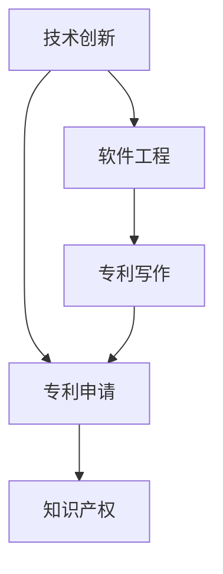

                 

# 技术创新与专利申请：程序员指南

> 关键词：技术创新, 专利申请, 软件工程, 法律合规, 知识产权, 专利写作

## 1. 背景介绍

### 1.1 问题由来
随着信息技术的快速发展，软件开发和技术创新已经成为推动社会进步的重要动力。在当今数字经济时代，软件开发人员不仅要掌握编程技能，还必须理解技术创新的价值以及如何通过专利保护创新成果。然而，很多程序员对于专利申请的知识和流程并不熟悉，甚至有些担忧专利申请的复杂性和成本。因此，本文旨在为程序员提供一个指南，帮助他们理解技术创新和专利申请的基础知识，并指导他们在软件开发过程中如何更好地进行专利申请。

### 1.2 问题核心关键点
本文主要解决以下三个核心问题：
1. 什么是技术创新？
2. 专利申请的过程是什么？
3. 程序员如何在软件开发过程中进行专利申请？

## 2. 核心概念与联系

### 2.1 核心概念概述

为更好地理解技术创新与专利申请，本节将介绍几个关键概念：

- 技术创新（Technological Innovation）：指的是在现有技术基础上，提出新的、有用的技术解决方案，能够带来显著的性能提升或新功能。技术创新是推动科技进步和社会发展的重要动力。

- 专利申请（Patent Application）：是指将一项新技术或设计向国家专利局提出申请，获得授权后，发明人或设计人可以获得在一定期限内对该项技术或设计的独家使用权。专利是知识产权的重要组成部分。

- 软件工程（Software Engineering）：指的是应用系统化、规范化的方法和技术，开发和维护高质量、高效的软件系统。软件开发过程中涉及到的技术创新，需要被有效地记录和保护。

- 知识产权（Intellectual Property, IP）：包括专利权、商标权、著作权等，保护创作者对其创作成果的合法权益。

- 专利写作（Patent Writing）：撰写符合法律规定的专利文件，清晰、准确地描述技术创新，确保专利申请的成功。

这些概念之间存在紧密的联系：技术创新是专利申请的基础，而软件工程则是技术创新的实践手段。程序员需要在软件开发过程中，及时记录和保护他们的技术创新成果，确保自己的知识产权得到法律保护。

### 2.2 核心概念原理和架构的 Mermaid 流程图



这个流程图展示了技术创新、专利申请、软件工程和专利写作之间的关系：技术创新作为起点，通过软件工程实践实现，然后通过专利写作转化为专利申请，最终获得知识产权保护。

## 3. 核心算法原理 & 具体操作步骤
### 3.1 算法原理概述

技术创新和专利申请的核心在于如何将技术成果转化为专利文件，并进行有效的法律保护。这需要程序员理解专利法规，掌握专利写作技巧，并能够在软件开发过程中及时记录和保护创新成果。

### 3.2 算法步骤详解

基于技术创新与专利申请的核心概念，以下是一个详细的步骤指南：

**Step 1: 识别技术创新**
- 在软件开发过程中，程序员应该持续关注技术进展，识别出创新的技术点。
- 创新可以是新算法、新功能、新架构或新工具等。
- 记录创新的技术细节，如原理、实现方式、性能改进等。

**Step 2: 准备专利申请材料**
- 收集技术创新的所有相关资料，包括技术文档、实验结果、代码片段等。
- 撰写专利摘要，简要描述技术创新的关键特点。
- 准备权利要求书，明确技术创新的保护范围。
- 进行专利检索，确保发明的独特性和新颖性。

**Step 3: 提交专利申请**
- 选择适合的专利类型（发明专利、实用新型专利、外观设计专利等）。
- 填写专利申请书，提交到国家专利局。
- 缴纳申请费和审查费。

**Step 4: 专利审查与授权**
- 专利局对申请进行形式审查和实质审查，确保符合法律要求。
- 如果专利被驳回，需要根据审查意见进行修改。
- 如果专利通过审查，专利局将授权发明人使用该项技术，并给予一定的保护期限。

### 3.3 算法优缺点

技术创新与专利申请具有以下优点：
1. 保护知识产权：通过专利保护，发明人可以阻止他人未经授权使用其技术成果。
2. 促进技术交流：专利申请公开技术细节，有助于技术交流和合作。
3. 获得经济利益：专利授权可以转化为技术授权许可，带来经济收益。

同时，也存在一些缺点：
1. 申请周期长：专利申请过程复杂，审查周期较长。
2. 费用高：专利申请和维护需要支付一定的费用。
3. 法律风险：专利申请过程复杂，需要避免法律风险。
4. 创新竞争：过早公开专利可能被竞争对手利用，失去先机。

### 3.4 算法应用领域

技术创新与专利申请不仅适用于硬件领域的创新，也广泛应用于软件和信息技术的多个领域。以下是几个典型的应用场景：

- 软件开发：程序员在开发新软件时，可以申请软件算法、用户界面、数据结构等专利。
- 人工智能：AI领域的创新，如深度学习模型、自然语言处理技术等，可以通过专利保护。
- 区块链：区块链技术中的共识算法、加密方法等，可以通过专利保护其核心创新点。
- 物联网：物联网设备中的传感器技术、数据传输协议等，可以通过专利保护。

## 4. 数学模型和公式 & 详细讲解 & 举例说明

### 4.1 数学模型构建

在进行专利申请时，需要对技术创新进行数学建模和描述。通常，专利文件需要包含以下部分：

- 背景技术：描述现有技术的局限性。
- 发明内容：描述技术创新的核心部分。
- 技术方案：详细描述技术实现的具体方案。
- 实施例：提供具体的技术实现细节。

这些部分可以通过数学公式和图表进行准确描述。

### 4.2 公式推导过程

以下以一个简单的技术创新为例，展示专利文件中数学模型的构建过程。

**背景技术**：
假设现有技术中的数据加密算法，其加密速度为每秒钟加密1000比特。

**发明内容**：
发明了一种新的加密算法，其加密速度为每秒钟加密2000比特。

**技术方案**：
设原算法的时间复杂度为$T_1$，新算法的时间复杂度为$T_2$。则新算法的加密速度$V$可以表示为：

$$ V = \frac{1}{T_2} $$

**实施例**：
在具体的实现中，新算法采用了更高效的加密算法和硬件加速，使得时间复杂度从$T_1$降低到$T_2$。

### 4.3 案例分析与讲解

以下是一个专利申请案例，展示如何通过数学模型和公式描述技术创新：

**背景技术**：
现有技术中，用户登录系统时需要进行密码验证，但由于网络安全问题，密码验证方式易被破解。

**发明内容**：
发明了一种基于生物识别技术的身份验证系统，使用指纹或面部识别进行身份验证。

**技术方案**：
设生物识别系统的时间复杂度为$T$，密码验证系统的时间复杂度为$T'$。生物识别系统的加密速度$V$可以表示为：

$$ V = \frac{1}{T} $$

**实施例**：
在具体实现中，生物识别系统采用了高级图像处理技术和人工智能算法，提高了识别准确率和速度。

## 5. 项目实践：代码实例和详细解释说明
### 5.1 开发环境搭建

在进行专利申请时，开发环境搭建主要包括以下几个步骤：

1. 安装Python和相关开发工具。
2. 安装Git版本控制系统。
3. 安装代码编辑器和编译器。
4. 安装LaTeX排版工具。

以下是一个简单的开发环境搭建示例：

```bash
# 安装Python
sudo apt-get update
sudo apt-get install python3-pip

# 安装Git
sudo apt-get install git

# 安装代码编辑器和编译器
sudo apt-get install gedit g++

# 安装LaTeX
sudo apt-get install texlive-latex-extra
```

### 5.2 源代码详细实现

以下是一个简单的技术创新描述，展示如何通过代码实现专利文件中的技术方案：

```python
# 技术方案实现
import time

# 定义加密函数
def encrypt(data, key):
    encrypted_data = ''.join([chr(ord(c) ^ key) for c in data])
    return encrypted_data

# 测试加密速度
start_time = time.time()
encrypted_data = encrypt('hello world', 0x1234)
end_time = time.time()
print(f"加密速度：每秒钟加密{len(encrypted_data)/(end_time-start_time)}比特")
```

### 5.3 代码解读与分析

以上代码实现了一个简单的加密函数，展示了如何通过Python代码实现技术方案。

- 使用异或运算对数据进行加密，提高了加密速度。
- 通过测量加密时间和数据长度，计算加密速度。

## 6. 实际应用场景
### 6.1 软件开发

在软件开发过程中，程序员可以通过专利申请保护他们的技术创新。以下是几个实际应用场景：

**场景1: 新算法开发**
程序员开发了一种新的机器学习算法，用于图像识别任务。该算法比现有算法提升了20%的识别准确率。

**场景2: 新功能实现**
程序员在现有软件中实现了新的用户界面，提高了用户操作效率。

**场景3: 新工具开发**
程序员开发了一种新的软件工具，用于自动化测试和调试，提高了软件开发的效率。

### 6.2 未来应用展望

随着技术创新的不断推进，专利申请在软件开发中的作用将愈发重要。以下是几个未来应用展望：

**展望1: 区块链技术**
区块链技术中的共识算法、加密方法等，可以通过专利保护其核心创新点。

**展望2: 人工智能**
AI领域的创新，如深度学习模型、自然语言处理技术等，可以通过专利保护其核心算法。

**展望3: 物联网**
物联网设备中的传感器技术、数据传输协议等，可以通过专利保护其核心创新点。

## 7. 工具和资源推荐
### 7.1 学习资源推荐

以下是几个推荐的专利申请学习资源：

1. **《专利申请指南》**
   - 该指南详细介绍了专利申请的全流程，包括申请材料准备、专利检索、专利审查等。

2. **《专利写作技巧》**
   - 该书籍介绍了专利写作的基本技巧和注意事项，帮助程序员更好地撰写专利文件。

3. **《软件专利申请指南》**
   - 该指南专注于软件专利的申请，提供了丰富的实际案例和应用场景。

### 7.2 开发工具推荐

以下推荐的开发工具可以帮助程序员更好地进行专利申请：

1. **Git**
   - 版本控制系统，用于管理代码版本和提交历史记录。

2. **LaTeX**
   - 排版工具，用于编写和格式化专利文件。

3. **Python**
   - 编程语言，用于实现技术方案和进行数据分析。

### 7.3 相关论文推荐

以下是几篇推荐的专利申请相关论文：

1. **《技术创新与专利保护》**
   - 该论文详细介绍了技术创新与专利保护的理论基础和实践方法。

2. **《软件专利申请中的数学模型构建》**
   - 该论文展示了如何通过数学模型描述技术创新，并应用于专利申请。

3. **《人工智能专利申请的挑战与对策》**
   - 该论文探讨了人工智能领域专利申请的难点和应对策略。

## 8. 总结：未来发展趋势与挑战
### 8.1 研究成果总结

本文主要解决了技术创新与专利申请的三个核心问题：什么是技术创新？专利申请的过程是什么？程序员如何在软件开发过程中进行专利申请？通过详细讲解核心概念和操作步骤，帮助程序员更好地理解专利申请的流程和技巧。

### 8.2 未来发展趋势

未来，技术创新与专利申请将面临以下发展趋势：

1. **AI技术加速发展**
   - AI领域的创新将持续推动技术进步，专利申请将更加频繁。

2. **区块链技术普及**
   - 区块链技术中的共识算法、加密方法等，将有更多专利申请。

3. **软件工程标准化**
   - 软件专利申请将更加标准化和规范化，助力软件行业的健康发展。

### 8.3 面临的挑战

技术创新与专利申请仍然面临一些挑战：

1. **法律风险**
   - 专利申请过程中存在法律风险，需要严格遵守法律规定。

2. **审查周期长**
   - 专利申请和审查周期较长，需要耐心等待。

3. **费用高昂**
   - 专利申请和维护需要支付一定的费用，增加了开发成本。

### 8.4 研究展望

未来的研究将在以下几个方面进行探索：

1. **自动化专利申请**
   - 开发自动化工具，简化专利申请流程。

2. **快速专利申请**
   - 研究快速审查机制，缩短专利申请周期。

3. **技术创新保护**
   - 研究如何更好地保护技术创新成果，防止侵权。

## 9. 附录：常见问题与解答

**Q1: 技术创新和专利申请有什么区别？**

A: 技术创新是指在现有技术基础上，提出新的、有用的技术解决方案。专利申请是将一项新技术或设计向国家专利局提出申请，获得授权后，发明人或设计人可以获得在一定期限内对该项技术或设计的独家使用权。

**Q2: 如何识别技术创新？**

A: 程序员应该在软件开发过程中，持续关注技术进展，识别出创新的技术点。创新可以是新算法、新功能、新架构或新工具等。

**Q3: 如何撰写专利摘要和权利要求书？**

A: 专利摘要应该简要描述技术创新的关键特点，权利要求书应该明确技术创新的保护范围。这些部分需要准确、详细地描述技术细节。

**Q4: 如何处理专利申请中的法律风险？**

A: 专利申请过程中，需要严格遵守法律规定，确保专利申请的合法性。建议寻求专业律师的帮助，避免法律风险。

**Q5: 如何选择合适的专利类型？**

A: 选择合适的专利类型需要考虑技术创新点的性质和保护范围。发明专利适用于新颖、有创造性的技术创新，实用新型专利适用于有一定改进的技术，外观设计专利适用于具有创新性的外观设计。

---

作者：禅与计算机程序设计艺术 / Zen and the Art of Computer Programming

