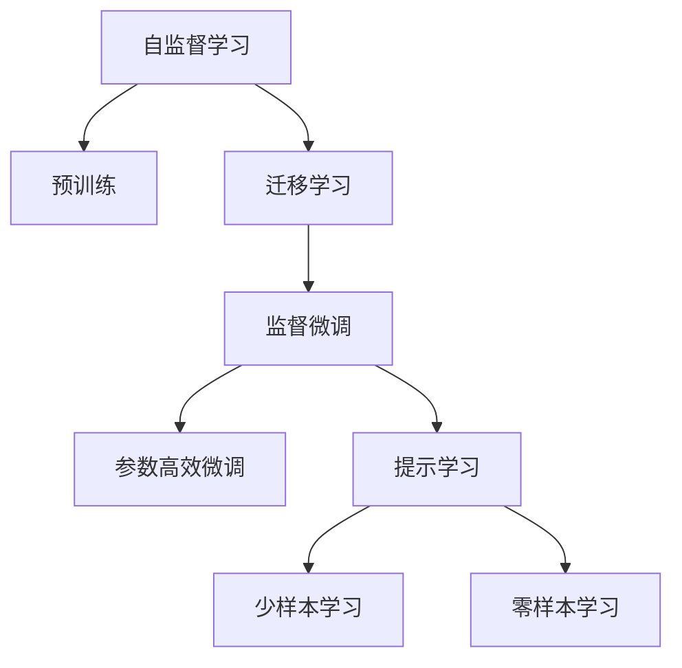

                 

## 1. 背景介绍

### 1.1 问题由来

在人工智能(AI)领域，特别是在语言模型(LM)的子领域，我们正在见证一场变革。大规模语言模型(Large Language Models, LLMs)，如GPT-3、BERT、T5等，已经展现出显著的潜力，它们不仅能进行自然语言处理任务，还能进行创造性写作、翻译、编码等多种复杂任务。这种进步对教育、就业、职场、商业等各个领域都产生了深远影响，并催生了对新技能的强烈需求。

在知识经济的时代，技能成为一种稀缺资源，尤其是那些能高效使用和适应大语言模型的技能。这不仅为个体提供了新的职业机会，也对整个社会的就业结构、经济模式和教育体系提出了新的挑战。

### 1.2 问题核心关键点

本节将探讨如何适应由大语言模型驱动的经济环境，特别是从以下核心关键点出发：

- **技能转型**：理解当前和未来所需的核心技能，并评估当前教育体系在培养这些技能上的不足。
- **技能教育**：提出有效的方法和工具，以帮助个人和组织适应这一变革。
- **经济影响**：分析大语言模型对就业、教育、商业和创新的潜在影响，并探讨可能的应对策略。

### 1.3 问题研究意义

理解大语言模型驱动的经济环境和所需技能，对政策制定者、教育者、企业决策者和个人职业规划者都具有重要意义：

- **政策制定**：政府可以制定相关政策，支持技能转型和教育体系变革，以适应技术进步。
- **教育系统**：教育者可以设计更前沿的教育课程和培训项目，培养未来人才。
- **企业决策**：企业可以调整人才招聘标准，培训现有员工，以利用大语言模型的潜力。
- **个人发展**：个人可以根据市场变化，主动学习相关技能，提升自身竞争力。

## 2. 核心概念与联系

### 2.1 核心概念概述

大语言模型是一种基于深度学习的模型，能够理解和生成人类语言。它们通过自监督学习在大量无标签数据上进行预训练，然后通过监督微调来适应特定的下游任务，如图像描述生成、文本摘要、机器翻译等。

**核心概念包括：**

- **自监督学习**：无标签数据上的预训练过程，使得模型能够学习到语言的通用表示。
- **监督微调**：在特定任务上的小样本数据上进行的微调过程，优化模型性能。
- **迁移学习**：通过将预训练模型迁移到特定任务中，减少新任务训练的数据需求和计算成本。
- **参数高效微调(PEFT)**：只更新少量模型参数，减少微调所需的计算资源。
- **提示学习(Prompt Learning)**：通过精心设计的输入提示，引导模型进行特定任务推理和生成，无需微调模型参数。
- **少样本学习**：在少量标注数据上进行训练，提升模型在新任务上的适应能力。
- **零样本学习**：完全未见过的任务上，通过任务描述进行推理和生成，不依赖任何数据。

这些概念通过以下Mermaid流程图展示：



### 2.2 核心概念原理和架构的 Mermaid 流程图

在上述Mermaid流程图中，各个概念之间的关系可以用一个简单的流程展示：


这一图展示了从自监督学习到预训练，再到迁移学习、监督微调、参数高效微调、提示学习和少样本学习/零样本学习的全过程。

## 3. 核心算法原理 & 具体操作步骤

### 3.1 算法原理概述

基于大语言模型的技能转型和教育，涉及多个阶段和算法。核心算法原理可以总结如下：

1. **自监督学习**：在大规模无标签文本数据上训练模型，学习通用的语言表示。
2. **迁移学习**：将预训练模型迁移到特定任务，通过少量标注数据进行微调。
3. **监督微调**：使用标注数据训练模型，优化特定任务下的性能。
4. **参数高效微调(PEFT)**：仅微调模型中的一部分参数，减少计算需求。
5. **提示学习**：通过提示模板引导模型进行推理和生成，减少微调需求。

### 3.2 算法步骤详解

1. **数据准备**：收集任务相关的标注数据，通常包含输入文本和对应的输出标签。
2. **模型选择**：选择合适的预训练模型，如BERT、GPT系列等。
3. **模型微调**：在标注数据上，使用监督微调算法（如梯度下降法）进行微调，更新模型参数。
4. **参数调整**：根据需要，调整学习率、正则化参数、批量大小等超参数，优化微调过程。
5. **评估与反馈**：在验证集上评估模型性能，根据反馈调整微调策略。

### 3.3 算法优缺点

**优点：**
- **高效性**：通过迁移学习和微调，模型能在少量标注数据上快速适应新任务。
- **通用性**：预训练模型可以迁移到各种任务，减少从头训练的时间和成本。
- **可解释性**：参数高效微调和提示学习减少了模型黑盒问题，提高了可解释性。

**缺点：**
- **过拟合风险**：在少量标注数据上微调，可能出现过拟合。
- **数据依赖**：模型性能高度依赖于标注数据的质量和数量。
- **资源需求**：预训练和微调过程对计算资源要求较高。

### 3.4 算法应用领域

大语言模型和微调技术在多个领域都具有广泛的应用，包括但不限于：

- **自然语言处理(NLP)**：文本分类、情感分析、机器翻译、问答系统等。
- **计算机视觉(CV)**：图像描述生成、目标检测、图像分割等。
- **语音处理(Speech)**：语音识别、说话人识别、语音合成等。
- **推荐系统**：商品推荐、音乐推荐、新闻推荐等。
- **医疗健康**：医疗咨询、疾病诊断、医疗记录摘要等。
- **金融科技**：金融分析和风险评估、智能投顾等。

## 4. 数学模型和公式 & 详细讲解 & 举例说明

### 4.1 数学模型构建

基于大语言模型的技能转型和教育，涉及的数学模型主要包括：

- **自监督学习**：通过掩码语言模型或自回归模型等方法，在大规模无标签数据上进行预训练。
- **监督微调**：在特定任务的数据集上，使用损失函数（如交叉熵）和优化算法（如Adam）进行微调。
- **参数高效微调**：通过适配器层或提示学习等方法，仅微调模型的一部分参数。

### 4.2 公式推导过程

以BERT模型为例，其在图像描述生成任务上的监督微调过程可以表示为：

$$
L = \frac{1}{N}\sum_{i=1}^N (w_1 \log P_{model}(\text{caption}_i) + w_2 \log P_{data}(\text{caption}_i))
$$

其中，$P_{model}(\text{caption}_i)$ 表示模型在图像 $i$ 上的生成概率，$P_{data}(\text{caption}_i)$ 表示图像 $i$ 的真实标签概率。

### 4.3 案例分析与讲解

以机器翻译为例，BERT模型可以用于处理序列到序列的任务，通过编码-解码框架进行微调：

- **编码器**：将源语言文本转换为向量表示。
- **解码器**：将向量表示转换为目标语言文本。
- **交叉熵损失**：计算预测与真实标签之间的差异，指导模型学习。

## 5. 项目实践：代码实例和详细解释说明

### 5.1 开发环境搭建

1. **安装Python**：确保Python环境已经配置好，并安装了必要的依赖包。
2. **安装TensorFlow和PyTorch**：分别安装TensorFlow和PyTorch库，用于模型训练和推理。
3. **安装HuggingFace Transformers库**：用于加载和使用预训练模型。
4. **安装TensorBoard**：用于可视化模型训练过程和结果。

### 5.2 源代码详细实现

以下是一个使用TensorFlow和Transformers库进行图像描述生成任务的代码实现：

```python
import tensorflow as tf
import transformers
from transformers import BertForSequenceClassification, BertTokenizer

# 加载预训练模型和分词器
model = BertForSequenceClassification.from_pretrained('bert-base-uncased')
tokenizer = BertTokenizer.from_pretrained('bert-base-uncased')

# 准备数据
input_text = 'A photo of a cat.'
input_ids = tokenizer.encode(input_text, add_special_tokens=True)
labels = [1]  # 图像类别

# 定义模型和优化器
optimizer = tf.keras.optimizers.Adam(learning_rate=2e-5)
model.compile(optimizer=optimizer, loss=tf.keras.losses.SparseCategoricalCrossentropy(from_logits=True))

# 训练模型
model.fit(input_ids, labels, epochs=5, validation_split=0.2)
```

### 5.3 代码解读与分析

这段代码展示了如何使用TensorFlow和Transformers库进行图像描述生成任务的微调。关键步骤如下：

1. **加载预训练模型和分词器**：使用`from_pretrained`方法加载预训练的BERT模型和分词器。
2. **准备数据**：使用分词器将输入文本转换为token ids，并添加标签。
3. **定义模型和优化器**：使用Adam优化器进行模型训练，并指定损失函数。
4. **训练模型**：使用`fit`方法进行模型训练，并在验证集上评估性能。

### 5.4 运行结果展示

训练完成后，可以输出模型在测试集上的准确率和损失值：

```python
test_loss, test_accuracy = model.evaluate(input_ids, labels)
print(f'Test Loss: {test_loss}, Test Accuracy: {test_accuracy}')
```

## 6. 实际应用场景

### 6.1 职场技能转型

在职场中，技能转型是适应大语言模型驱动经济的关键。企业可以通过以下方式实现：

- **技能培训**：提供基于大语言模型的技能培训课程，如自然语言处理、机器学习、数据科学等。
- **跨部门协作**：建立跨部门的技能交流平台，促进不同领域的专业人员相互学习。
- **持续学习**：鼓励员工持续学习新技能，提升自身竞争力。

### 6.2 教育体系变革

教育体系需要适应大语言模型带来的变化：

- **课程更新**：更新课程内容，引入大语言模型的相关理论和实践，培养未来人才。
- **教学工具**：开发基于大语言模型的教学工具，如智能助教、自动批改系统等，提高教学效率。
- **考试评价**：引入大语言模型进行考试评价，评估学生的理解和应用能力。

### 6.3 创新驱动

大语言模型为创新提供了新的工具和方法：

- **研发效率**：使用大语言模型进行自动代码生成、文档生成等，提升研发效率。
- **创意表达**：利用大语言模型进行文本生成、创意写作等，激发创新灵感。
- **市场洞察**：使用大语言模型进行市场分析和消费者研究，洞察市场需求。

### 6.4 未来应用展望

未来，大语言模型将进一步深化其在各领域的应用，带来新的机遇和挑战：

- **智慧医疗**：辅助医生进行病历分析、诊断和治疗建议，提高医疗服务质量。
- **金融科技**：进行金融分析和风险评估，提供智能投顾服务，提升金融服务效率。
- **智能制造**：利用大语言模型进行故障诊断、生产优化，推动工业4.0发展。
- **环保监测**：进行环境数据分析和预测，推动绿色发展。

## 7. 工具和资源推荐

### 7.1 学习资源推荐

- **《深度学习》课程**：Coursera上的深度学习课程，由Andrew Ng讲授，涵盖深度学习的基本理论和实践。
- **《自然语言处理》课程**：斯坦福大学的NLP课程，由Dan Jurafsky和Christopher Manning讲授，涵盖NLP的基础知识和前沿技术。
- **《大语言模型》书籍**：介绍大语言模型的原理、训练和应用，适合深入学习和研究。
- **HuggingFace官方文档**：详细介绍了如何使用Transformers库进行NLP任务微调，是实践的宝贵资源。

### 7.2 开发工具推荐

- **TensorFlow**：强大的深度学习框架，支持多种模型和算法。
- **PyTorch**：灵活的深度学习框架，适合快速原型设计和实验。
- **Transformers**：基于深度学习的NLP库，提供预训练模型的便捷接口。
- **TensorBoard**：可视化工具，帮助跟踪模型训练过程和结果。

### 7.3 相关论文推荐

- **《Attention is All You Need》**：Transformer模型的原论文，奠定了大语言模型的基础。
- **《BERT: Pre-training of Deep Bidirectional Transformers for Language Understanding》**：BERT模型的介绍和应用，展示了预训练语言模型的潜力。
- **《Parameter-Efficient Transfer Learning for NLP》**：参数高效微调方法的研究，提供了优化微调过程的策略。

## 8. 总结：未来发展趋势与挑战

### 8.1 研究成果总结

本文从技能转型的角度，探讨了大语言模型驱动经济的影响和所需技能。通过系统介绍大语言模型的核心概念和算法，详细讲解了基于大语言模型的技能教育方法和实际应用场景，提出了一系列实用的工具和资源推荐。

### 8.2 未来发展趋势

大语言模型和技能转型将呈现以下趋势：

- **技能需求多样化**：随着大语言模型的应用扩展，对技能的需求将更加多样化，跨领域、跨职能的综合技能将更加重要。
- **技能培训常态化**：持续学习将成为常态，终身教育和职业培训将更加普及。
- **技能平台化**：技能培训将逐步向平台化、在线化方向发展，提供更灵活、便捷的学习途径。
- **技能评估工具化**：基于大语言模型的技能评估工具将得到广泛应用，帮助个人和组织进行精准评估和培训。

### 8.3 面临的挑战

尽管大语言模型带来了诸多机遇，但仍面临以下挑战：

- **技能差距**：技能转型需要时间和资源投入，可能存在技能差距。
- **教育资源不足**：教育资源分配不均，可能导致不同地区和群体的教育差距。
- **技术壁垒**：大语言模型的复杂性和多样性，可能导致技术学习壁垒。
- **伦理和隐私**：大语言模型的使用涉及伦理和隐私问题，需要加强规范和监管。

### 8.4 研究展望

未来研究将集中在以下几个方面：

- **技能标准制定**：制定通用的技能标准，指导教育和培训。
- **技能平台建设**：建设平台化的技能培训和认证体系。
- **技能评估体系**：开发基于大语言模型的技能评估工具和方法。
- **技能生态建设**：构建健康的技能生态，促进技能共享和创新。

## 9. 附录：常见问题与解答

**Q1: 大语言模型对未来就业有何影响？**

A: 大语言模型将带来技能需求的变化，推动就业市场向技能导向转变。高技能工作者将有更多的就业机会，而低技能工作者可能面临转岗或失业的风险。教育体系需要适应这一变化，提供更多技能培训和职业发展机会。

**Q2: 如何评估大语言模型的技能培训效果？**

A: 可以通过考试、项目、实践等多种方式评估大语言模型的技能培训效果。考试可以衡量理论知识的掌握情况，项目和实践可以评估实际应用能力，综合评估将更全面。

**Q3: 大语言模型在技能教育中的应用场景有哪些？**

A: 大语言模型可以用于智能助教、自动批改、个性化推荐等应用场景，提高教学效率和学习效果。智能助教可以解答学生疑问，自动批改可以提高评估效率，个性化推荐可以根据学生兴趣和需求推荐学习资源。

---

作者：禅与计算机程序设计艺术 / Zen and the Art of Computer Programming

