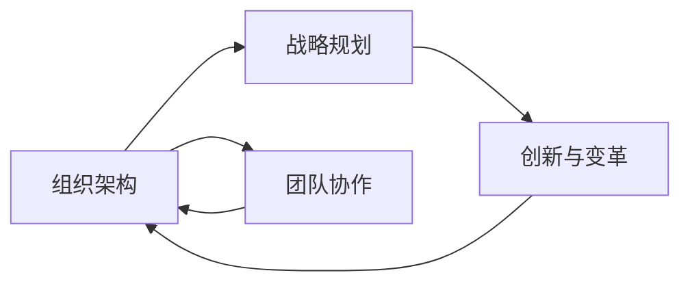

                 

# 拥有体系思维是管理者的必备能力

> 关键词：体系思维, 管理者, 组织架构, 战略规划, 团队协作, 创新与变革

## 1. 背景介绍

### 1.1 问题由来

在快速发展的互联网时代，企业面对复杂多变的外部环境和内部挑战，管理者必须具备一套系统的、综合的思维方式，才能有效应对。如何构建科学的组织架构，制定合理的战略规划，以及协调团队的协作，成为了现代管理者的核心任务。本文旨在深入探讨体系思维的概念、原理和应用，帮助管理者提升管理能力，推动组织持续发展。

### 1.2 问题核心关键点

体系思维是指在复杂系统中，通过构建系统的、有机的组织结构和流程，实现整体最优的决策和行动。其核心关键点包括：
- **系统性**：从整体出发，考虑系统的各个组成部分及其相互关系，避免片面思考。
- **有机性**：强调各部分之间的协同和互动，促进整体功能和效率的最大化。
- **动态性**：持续优化调整，适应外部环境和内部需求的变化。
- **可控性**：通过明确的目标和规则，控制系统的运行，避免无序和混乱。

这些关键点共同构成了体系思维的基本框架，是现代管理者必备的能力之一。

## 2. 核心概念与联系

### 2.1 核心概念概述

体系思维不仅是一种思维方式，更是一种系统的管理方法论，涵盖了组织架构、战略规划、团队协作、创新与变革等多个方面。

- **组织架构**：通过合理的组织设计，明确各部门的职责和关系，促进信息流通和资源共享。
- **战略规划**：制定长远目标，并分解为短期行动计划，确保战略实施的有效性。
- **团队协作**：强调团队内部的沟通和协调，建立信任和合作机制，提升团队绩效。
- **创新与变革**：鼓励创新，持续改进和优化管理流程，适应环境变化。

这些概念相互关联，共同构成了一个体系化的管理框架。

### 2.2 核心概念原理和架构的 Mermaid 流程图



这个流程图展示了体系思维各个核心概念之间的联系和相互作用。

## 3. 核心算法原理 & 具体操作步骤

### 3.1 算法原理概述

体系思维的核心算法原理主要体现在系统性、有机性和动态性三个方面。

**系统性**：通过整体观照和系统分析，识别出系统中的关键要素和关系，建立系统的模型。

**有机性**：在模型中强调要素间的相互作用和依赖，构建协同机制，促进整体功能的最大化。

**动态性**：根据环境变化和内部需求，持续调整和优化模型，确保系统的适应性和稳定性。

### 3.2 算法步骤详解

1. **数据收集和分析**：
   - 收集系统内外部的数据，包括市场趋势、竞争对手、内部资源等。
   - 利用数据分析工具，进行数据清洗和特征提取。

2. **系统建模**：
   - 使用系统建模技术，如Simulink、UML等，构建系统的结构和流程。
   - 定义系统的边界和目标，明确各部分的职责和关系。

3. **系统优化和调整**：
   - 根据数据分析结果，优化系统的结构和流程，提升效率和效果。
   - 定期评估和调整系统，确保其适应外部环境和内部需求的变化。

### 3.3 算法优缺点

**优点**：
- **全面性**：系统性的分析能够全面考虑系统的各个方面，避免遗漏关键要素。
- **协同性**：有机性的设计促进了各部分之间的互动和协作，提升了整体功能。
- **灵活性**：动态性的调整能够适应环境变化，确保系统的稳定性和适应性。

**缺点**：
- **复杂性**：系统建模和优化可能涉及复杂的数学和工程方法，对人员和资源要求较高。
- **成本高**：构建和优化系统可能需要较高的投入，包括时间、金钱和人力。
- **难度大**：需要系统思维和分析能力，管理者必须具备相应的素质和技能。

### 3.4 算法应用领域

体系思维在多个领域都有广泛的应用，如：
- **企业管理**：优化组织架构，制定战略规划，协调团队协作。
- **项目管理**：构建项目管理体系，提升项目效率和质量。
- **信息系统**：设计高效的信息系统架构，实现数据管理与业务支持。
- **医疗管理**：优化医疗资源配置，提升医疗服务质量。

## 4. 数学模型和公式 & 详细讲解 & 举例说明

### 4.1 数学模型构建

**系统性模型**：
- **目标函数**：
  $$
  f(x) = \sum_{i=1}^{n} a_i f_i(x)
  $$
  其中 $f(x)$ 为系统目标函数，$a_i$ 为各部分的权重，$f_i(x)$ 为各部分的贡献函数。

**有机性模型**：
- **协同矩阵**：
  $$
  S = (s_{ij})_{n\times n}
  $$
  其中 $s_{ij}$ 表示第 $i$ 部分和第 $j$ 部分之间的协同系数。

**动态性模型**：
- **状态转移矩阵**：
  $$
  A = (a_{ij})_{n\times n}
  $$
  其中 $a_{ij}$ 表示第 $i$ 部分在下一时刻变为第 $j$ 部分的概率。

### 4.2 公式推导过程

**目标函数推导**：
假设系统由 $n$ 个部分组成，各部分的权重分别为 $a_i$，目标函数为 $f(x)$，则系统目标函数可表示为：
$$
f(x) = \sum_{i=1}^{n} a_i f_i(x)
$$
其中 $f_i(x)$ 为第 $i$ 部分的贡献函数，$a_i$ 为各部分的权重。

**协同矩阵推导**：
假设系统有 $n$ 个部分，各部分之间的协同系数分别为 $s_{ij}$，则协同矩阵可表示为：
$$
S = (s_{ij})_{n\times n}
$$
其中 $s_{ij}$ 表示第 $i$ 部分和第 $j$ 部分之间的协同系数，反映了各部分之间的依赖和互动。

**状态转移矩阵推导**：
假设系统有 $n$ 个部分，各部分在下一时刻变为其他部分的概率分别为 $a_{ij}$，则状态转移矩阵可表示为：
$$
A = (a_{ij})_{n\times n}
$$
其中 $a_{ij}$ 表示第 $i$ 部分在下一时刻变为第 $j$ 部分的概率，反映了系统在时间维度上的动态变化。

### 4.3 案例分析与讲解

**案例一：企业管理体系**

一家大型企业采用体系思维优化其组织架构和战略规划。首先，通过数据分析收集内部和外部的相关信息。然后，构建系统的目标函数和协同矩阵，识别出各部门的职责和关系。最后，根据分析结果优化组织结构和流程，制定战略规划。通过定期评估和调整，确保系统的适应性和稳定性。

**案例二：医疗资源配置**

一家医院采用体系思维优化其资源配置。首先，收集医院内部的资源数据和外部市场需求。然后，建立系统的目标函数和状态转移矩阵，识别出各资源部门的职责和依赖关系。最后，根据分析结果优化资源配置方案，提升医疗服务质量。

## 5. 项目实践：代码实例和详细解释说明

### 5.1 开发环境搭建

要实现体系思维的应用，需要构建一个综合的信息管理系统。以下是使用Python进行系统开发的环境配置流程：

1. 安装Anaconda：从官网下载并安装Anaconda，用于创建独立的Python环境。

2. 创建并激活虚拟环境：
```bash
conda create -n systhinking python=3.8 
conda activate systhinking
```

3. 安装Python的科学计算库：
```bash
conda install numpy pandas matplotlib seaborn
```

4. 安装数据处理和可视化工具：
```bash
conda install jupyter notebook
```

5. 安装系统建模和优化工具：
```bash
conda install simpy pulp
```

完成上述步骤后，即可在`systhinking`环境中开始系统开发实践。

### 5.2 源代码详细实现

这里我们以构建一个基于SimPy的系统模型为例，展示如何使用Python实现体系思维的应用。

首先，定义系统的各个部分和其状态：

```python
from simpy import Process, Resource, Environment
import pandas as pd

# 定义系统组件
class Component(Process):
    def __init__(self, env, name, resource):
        super().__init__(env)
        self.name = name
        self.resource = resource
        self.resource.queue.append(self)

    def run(self):
        # 定义部分的行为逻辑
        while True:
            self.resource.request(self)
            print(f"{self.name} is working")
            self.resource.release(self)
            env.sleep(env.random_exponential(10))  # 休眠一段时间

# 定义系统环境
class System:
    def __init__(self, env):
        self.env = env
        self.resource = Resource(self.env, 3)  # 创建3个资源

    def run(self):
        # 定义系统启动流程
        comp1 = Component(self.env, "Comp1", self.resource)
        comp2 = Component(self.env, "Comp2", self.resource)
        comp3 = Component(self.env, "Comp3", self.resource)
        self.env.process(comp1.run())
        self.env.process(comp2.run())
        self.env.process(comp3.run())
        self.env.run(until=100)  # 运行100个时间单位
```

然后，运行系统并输出分析结果：

```python
env = Environment()
sys = System(env)
sys.run()
```

### 5.3 代码解读与分析

**Component类**：
- 继承自Process类，定义了一个组件的行为逻辑，包含资源的请求和释放。

**System类**：
- 定义了系统的环境，包含资源的创建和管理。
- 在`run`方法中创建多个组件，并启动它们的运行流程。
- 使用`env.run`方法运行系统，直至预设的时间或事件触发。

**运行流程**：
- 创建三个组件，并将它们加入资源队列中。
- 组件在运行时请求资源，然后执行指定操作，最后释放资源。
- 运行系统至指定时间，观察各组件的运行状态和资源利用情况。

通过这个简单的代码实例，我们可以初步理解体系思维在实际系统中的实现方法和效果。

## 6. 实际应用场景

### 6.1 企业战略规划

体系思维在企业战略规划中的应用，主要体现在以下几个方面：
- **战略分析**：利用数据分析工具，分析市场趋势、竞争对手和内部资源，制定战略方向。
- **目标分解**：根据战略方向，将长期目标分解为短期行动计划，确保每一步都有明确的任务和指标。
- **资源配置**：合理分配内部资源，提升各部门的协作效率，确保战略实施的效果。

### 6.2 项目管理

体系思维在项目管理中的应用，主要体现在以下几个方面：
- **项目规划**：构建项目管理体系，明确各阶段的任务和里程碑，确保项目按时交付。
- **风险控制**：识别项目中的潜在风险，制定相应的应对措施，降低风险影响。
- **团队协作**：建立高效的团队协作机制，促进信息流通和资源共享，提升项目效率。

### 6.3 医疗资源配置

体系思维在医疗资源配置中的应用，主要体现在以下几个方面：
- **资源分析**：收集医院内部的资源数据和外部市场需求，识别出各资源部门的职责和关系。
- **配置优化**：根据资源分析结果，优化资源配置方案，提升医疗服务质量。
- **动态调整**：根据环境变化和内部需求，持续调整和优化资源配置，确保系统的稳定性和适应性。

## 7. 工具和资源推荐

### 7.1 学习资源推荐

为了帮助管理者系统掌握体系思维的理论基础和实践技巧，这里推荐一些优质的学习资源：

1. **《系统思考：组织理论与管理实践》**：介绍系统思考的基本原理和应用方法，适合管理者和组织变革从业者阅读。

2. **《企业管理实践：系统思维与创新管理》**：结合企业管理案例，讲解系统思维在企业管理中的应用。

3. **《项目管理体系：理论与实践》**：详细阐述项目管理的系统方法和工具，适合项目经理和项目管理从业人员学习。

4. **《医疗资源配置与优化》**：介绍医疗资源配置的系统方法，适合医院管理者阅读。

5. **《系统建模与优化》**：讲解系统建模和优化的基本原理和技术，适合系统工程师和数据分析师学习。

### 7.2 开发工具推荐

1. **Python**：强大的编程语言，支持科学计算和数据分析，适合系统建模和优化。

2. **SimPy**：Python的仿真模拟库，支持系统动态建模和仿真。

3. **UML**：用于系统设计和文档编写的标准建模语言，适合系统架构设计。

4. **Jupyter Notebook**：交互式的编程环境，支持代码开发和数据分析。

5. **Pulp**：线性规划库，支持系统优化模型的构建和求解。

### 7.3 相关论文推荐

1. **《System Dynamics and Management Science: A Systemic Approach》**：系统动力学和管理系统科学的基础著作，介绍了系统思考的理论和方法。

2. **《The Systems Thinking and Its Applications in Enterprise Management》**：系统思维在企业管理中的应用研究，结合实际案例讲解系统思考方法。

3. **《Systems Thinking in Project Management: A Literature Review》**：系统思维在项目管理中的应用综述，推荐阅读。

4. **《Healthcare Resource Optimization: A System Approach》**：医疗资源配置的系统方法研究，适合医疗管理者阅读。

5. **《Optimization Models and Algorithms》**：系统优化模型的理论和方法，适合系统工程师和优化从业人员学习。

## 8. 总结：未来发展趋势与挑战

### 8.1 总结

本文对体系思维的概念、原理和应用进行了系统介绍，探讨了其在企业管理、项目管理、医疗资源配置等领域的应用。通过理论分析、案例讲解和代码实例，展示了体系思维在实际管理中的重要性和实施方法。

### 8.2 未来发展趋势

未来，体系思维将在以下几个方面继续发展：
- **智能化**：结合人工智能技术，提升系统分析和优化的能力，实现动态自适应。
- **数字化**：通过大数据和云计算技术，优化资源配置和管理流程，实现数字化转型。
- **协同化**：建立智能化的协同平台，促进跨部门和跨组织的协作，提升整体效率。
- **规范化**：制定系统的标准和规范，确保管理的一致性和可控性。

### 8.3 面临的挑战

尽管体系思维在管理实践中已有广泛应用，但在实际应用中也面临一些挑战：
- **复杂性**：系统建模和优化涉及复杂的数学和工程方法，对人员和资源要求较高。
- **资源限制**：系统构建和优化需要大量的数据和资源投入，对中小型企业可能存在一定的难度。
- **灵活性**：系统的优化和调整需要灵活的管理机制和快速响应能力，对组织文化和管理水平有较高要求。
- **风险控制**：系统实施过程中可能面临各种风险，需要有效的风险控制机制和应急预案。

### 8.4 研究展望

未来，需要进一步研究以下方向：
- **跨领域应用**：拓展体系思维在不同行业中的应用，提升其普适性和灵活性。
- **技术融合**：将系统思维与人工智能、大数据等技术结合，提升系统分析和优化的能力。
- **管理创新**：探索新的管理工具和方法，提升系统管理的效率和效果。
- **实践落地**：在实际管理中推广应用，积累经验和数据，不断优化和改进。

## 9. 附录：常见问题与解答

**Q1：如何选择合适的系统建模工具？**

A: 选择合适的系统建模工具需要考虑系统的复杂性和规模。对于小规模系统，可以使用UML等简单的建模工具；对于大规模系统，建议使用SimPy等仿真模拟工具。同时，还需要考虑工具的易用性、可扩展性和功能丰富度。

**Q2：如何应对系统复杂性带来的挑战？**

A: 应对系统复杂性，可以从以下几个方面入手：
1. 分解问题：将复杂问题分解为更小的子问题，逐一解决。
2. 使用建模工具：利用系统建模工具，构建系统的整体结构和流程，简化问题处理。
3. 逐步优化：先构建简单的模型，逐步优化和调整，确保系统的稳定性和适应性。

**Q3：如何实现系统的动态调整？**

A: 实现系统的动态调整，需要建立系统的状态转移矩阵和反馈机制。首先，根据环境变化和内部需求，计算系统的状态转移矩阵，更新系统的状态和行为。然后，建立系统的反馈机制，及时响应外部变化，调整系统策略和资源配置。

**Q4：如何在实际管理中应用体系思维？**

A: 在实际管理中应用体系思维，可以按照以下步骤进行：
1. 分析系统：收集系统内外部的数据，构建系统的目标函数和协同矩阵，识别出各部门的职责和关系。
2. 优化系统：根据分析结果，优化系统的结构和流程，提升效率和效果。
3. 持续调整：定期评估和调整系统，确保其适应外部环境和内部需求的变化。

通过这些步骤，管理者可以系统性地分析和优化管理流程，提升组织绩效和竞争力。

---

作者：禅与计算机程序设计艺术 / Zen and the Art of Computer Programming

